<!-- i18n:manual -->
# Детекция объектов — YOLO с нуля

> Детекция — это классификация плюс регрессия, запущенные в каждой позиции карты признаков и затем почищенные через non-maximum suppression.

**Type:** Build
**Languages:** Python
**Prerequisites:** Phase 4 Lesson 03 (CNNs), Phase 4 Lesson 04 (Image Classification), Phase 4 Lesson 05 (Transfer Learning)
**Time:** ~75 minutes

## Learning Objectives

- Объяснить устройство сетки и anchor box, которое превращает детекцию в задачу плотного предсказания, и сказать, что означает каждое число в выходном тензоре
- Посчитать IoU между рамками и реализовать NMS с нуля
- Собрать минимальную голову в стиле YOLO поверх предобученного backbone, включая функции потерь для классификации, objectness и регрессии рамок
- Читать строку метрик детекции (precision@0.5, recall, mAP@0.5, mAP@0.5:0.95) и выбирать, какую ручку крутить дальше

> 🎒 **На пальцах.** Классификатор отвечает одним словом: «собака». Детектор отвечает списком: «собака вот тут, кошка вот тут, больше ничего». Разница в том, что длина ответа заранее неизвестна — и вся сложность урока растёт именно из этого.

## The Problem

Классификация говорит «на этой картинке собака». Детекция говорит «собака в пикселях (112, 40, 280, 210), кошка в (400, 180, 560, 310), больше в кадре ничего нет». Это одно структурное изменение — предсказание переменного числа размеченных рамок вместо одной метки на изображение — то, на чём держится каждая автономная система, каждый продукт видеонаблюдения, каждый парсер вёрстки документов и каждая линия машинного зрения на заводе.

Детекция — это ещё и место, где все инженерные компромиссы зрения вылезают разом. Вам нужны точные рамки (голова регрессии), нужен правильный класс для каждой рамки (голова классификации), нужно, чтобы модель понимала, когда детектировать нечего (objectness score), и нужно ровно одно предсказание на каждый реальный объект (non-maximum suppression). Пропустите любое из этого — и пайплайн либо теряет объекты, либо выдаёт галлюцинированные рамки, либо предсказывает один и тот же объект пятнадцать раз в чуть разных позициях.

YOLO (You Only Look Once, Redmon et al. 2016) был той конструкцией, которая заставила всё это работать в реальном времени за один прямой проход свёрточной сети, и те же самые структурные решения до сих пор лежат в основе современных детекторов (YOLOv8, YOLOv9, YOLO-NAS, RT-DETR). Разберитесь в ядре — и любой вариант станет перестановкой тех же деталей.

## The Concept

### Detection as dense prediction

Классификатор выдаёт C чисел на изображение. Детектор в стиле YOLO выдаёт `(S x S x (5 + C))` чисел на изображение, где S — размер пространственной сетки.

```mermaid
flowchart LR
    IMG["Input 416x416 RGB"] --> BB["Backbone<br/>(ResNet, DarkNet, ...)"]
    BB --> FM["Feature map<br/>(C_feat, 13, 13)"]
    FM --> HEAD["Detection head<br/>(1x1 convs)"]
    HEAD --> OUT["Output tensor<br/>(13, 13, B * (5 + C))"]
    OUT --> DEC["Decode<br/>(grid + sigmoid + exp)"]
    DEC --> NMS["Non-max suppression"]
    NMS --> RESULT["Final boxes"]

    style IMG fill:#dbeafe,stroke:#2563eb
    style HEAD fill:#fef3c7,stroke:#d97706
    style NMS fill:#fecaca,stroke:#dc2626
    style RESULT fill:#dcfce7,stroke:#16a34a
```



Каждая из `S * S` клеток сетки предсказывает `B` рамок. Для каждой рамки:

- 4 числа описывают геометрию: `tx, ty, tw, th`.
- 1 число — objectness score: «есть ли объект с центром в этой клетке?»
- C чисел — вероятности классов.

Итого на клетку: `B * (5 + C)`. Для VOC с `S=13, B=2, C=20` это 50 чисел на клетку.

> 🎒 **На пальцах.** Считаем весь выход: 13 × 13 = 169 клеток, по 50 чисел в каждой — это 8450 чисел на одно изображение. Из них реально нужны данные примерно о трёх объектах, то есть о трёх наборах по 25 чисел. Остальные 99% выхода — это модель, говорящая «здесь ничего нет».

### Why grids and anchors

Обычная регрессия предсказывала бы `(x, y, w, h)` для каждого объекта как абсолютные координаты. Свёрточной сети это тяжело, потому что сдвиг изображения не должен сдвигать все предсказания на одну и ту же величину — каждый объект пространственно привязан. Сетка решает это, назначая каждую эталонную рамку той клетке, в которую попадает её центр; только эта клетка отвечает за этот объект.

Anchor box решают вторую проблему. Свёртка 3x3 не может легко отрегрессировать рамку шириной 500 пикселей из клетки признаков с рецептивным полем в 16 пикселей. Вместо этого мы заранее задаём `B` форм-заготовок (anchor box) на клетку и предсказываем небольшие поправки от каждого anchor box. Модель учится выбирать правильный anchor box и слегка его подвинуть, а не регрессировать с пустого места.

```
Anchor box priors (example for 416x416 input):

  small:   (30,  60)
  medium:  (75,  170)
  large:   (200, 380)

At each grid cell, every anchor emits (tx, ty, tw, th, obj, c_1, ..., c_C).
```

Современные детекторы часто используют FPN с разными наборами anchor box на разных разрешениях: маленькие anchor box на неглубоких картах высокого разрешения, большие — на глубоких картах низкого разрешения. Та же идея, больше масштабов.

> 🎒 **На пальцах.** Anchor box — как размерная сетка одежды. Вместо «сшить рубашку по индивидуальным меркам» модель говорит «размер M, рукава на два сантиметра длиннее». Три заготовки (30×60, 75×170, 200×380) покрывают почти все объекты, а сети остаётся предсказать маленькую поправку.

### Decoding predictions

Сырые `tx, ty, tw, th` — это не координаты рамки; это цели регрессии, которые нужно преобразовать перед отрисовкой:

```
centre x  = (sigmoid(tx) + cell_x) * stride
centre y  = (sigmoid(ty) + cell_y) * stride
width     = anchor_w * exp(tw)
height    = anchor_h * exp(th)
```

`sigmoid` удерживает смещение центра внутри клетки. `exp` позволяет ширине свободно масштабироваться от anchor box без смены знака. `stride` переводит координаты сетки обратно в пиксели. Этот шаг декодирования одинаков в каждой версии YOLO начиная с v2.

> 🎒 **На пальцах.** Пусть tx = 0.4, тогда sigmoid(0.4) ≈ 0.6. Клетка `cell_x = 4`, stride = 32. Центр по x = (0.6 + 4) × 32 = 147.2 пикселя. Теперь ширина: anchor_w = 30, tw = 0.7, exp(0.7) ≈ 2.01, ширина = 60 пикселей. Заготовка удвоилась одним числом.

### IoU

Универсальная метрика похожести двух рамок в детекции:

```
IoU(A, B) = area(A intersect B) / area(A union B)
```

IoU = 1 означает совпадение; IoU = 0 означает отсутствие пересечения. IoU между предсказанием и эталонной рамкой решает, засчитывается ли предсказание как true positive (обычно IoU >= 0.5). IoU между двумя предсказаниями — то, чем NMS убирает дубликаты.

> 🎒 **На пальцах.** Две рамки: площадь пересечения 20, площадь объединения 80, значит IoU = 20/80 = 0.25 — порог 0.5 не пройден, предсказание считается ошибкой. Другой случай: пересечение 60, объединение 80, IoU = 0.75 — попадание засчитано и по мягкому порогу 0.5, и по строгому 0.7.

### Non-maximum suppression

Свёрточная сеть, обученная на соседних anchor box, часто предсказывает перекрывающиеся рамки для одного объекта. NMS оставляет предсказание с наибольшей уверенностью и удаляет любое другое предсказание с IoU выше порога.

```
NMS(boxes, scores, iou_threshold):
    sort boxes by score descending
    keep = []
    while boxes not empty:
        pick the top-scoring box, add to keep
        remove every box with IoU > iou_threshold to the picked box
    return keep
```

Типичный порог: 0.45 для детекции объектов. Свежие детекторы заменяют обычный NMS на `soft-NMS`, `DIoU-NMS` или учат подавление напрямую (RT-DETR), но структурное назначение то же.

> 🎒 **На пальцах.** Три рамки вокруг одной собаки с уверенностью 0.9, 0.85 и 0.7. Берём 0.9 и оставляем. У 0.85 IoU с ней 0.8 > 0.45 — выбрасываем. У 0.7 IoU 0.5 > 0.45 — тоже выбрасываем. Осталась одна рамка. Если бы порог был 0.9, все три остались бы, и вы получили бы трёх собак вместо одной.

### The loss

Функция потерь YOLO — это три потери, сложенные с весами:

```
L = lambda_coord * L_box(pred, target, where obj=1)
  + lambda_obj   * L_obj(pred, 1,     where obj=1)
  + lambda_noobj * L_obj(pred, 0,     where obj=0)
  + lambda_cls   * L_cls(pred, target, where obj=1)
```

Только клетки, содержащие объект, вносят вклад в потери регрессии рамок и классификации. Клетки без объектов вносят вклад только в потерю objectness (учат модель молчать). `lambda_noobj` обычно маленькая (~0.5), потому что подавляющее большинство клеток пусты и иначе доминировали бы в общей потере.

Современные варианты меняют MSE-потерю рамок на CIoU / DIoU (которые оптимизируют IoU напрямую), используют focal loss для дисбаланса классов и балансируют objectness через quality focal loss. Трёхкомпонентная структура не меняется.

> 🎒 **На пальцах.** Считаем дисбаланс: 169 клеток × 2 anchor box = 338 предсказаний, из них с объектами примерно 3. То есть 335 пустых против 3 занятых, соотношение больше 100 к 1. Без `lambda_noobj = 0.5` модель просто выучила бы «везде пусто» — это дало бы почти нулевую потерю и ноль детекций.

### Detection metrics

Accuracy на детекцию не переносится. Четыре числа, которые переносятся:

- **Precision@IoU=0.5** — из предсказаний, засчитанных как положительные, сколько на самом деле верны.
- **Recall@IoU=0.5** — из реальных объектов, сколько мы нашли.
- **AP@0.5** — площадь под precision-recall кривой при пороге IoU 0.5; одно число на класс.
- **mAP@0.5:0.95** — среднее AP по порогам IoU 0.5, 0.55, ..., 0.95. Метрика COCO; самая строгая и самая информативная.

Приводите все четыре. Детектор, сильный по mAP@0.5, но слабый по mAP@0.5:0.95, локализует грубо, а не плотно; чинится лучшей потерей регрессии рамок. Детектор с высоким precision и низким recall слишком осторожен; понизьте порог уверенности или увеличьте вес objectness.

> 🎒 **На пальцах.** Нашли 8 объектов из 10 настоящих, всего выдали 12 рамок. Recall = 8/10 = 0.8, precision = 8/12 ≈ 0.67. Понизите порог уверенности — recall вырастет до 0.9, но рамок станет 20 и precision упадёт до 0.45. Эти две метрики всегда тянут в разные стороны, поэтому и смотрят обе.

```figure
object-detection-nms
```

## Build It

### Step 1: IoU

Рабочая лошадка всего урока. Работает с двумя массивами рамок в формате `(x1, y1, x2, y2)`.

```python
import numpy as np

def box_iou(boxes_a, boxes_b):
    ax1, ay1, ax2, ay2 = boxes_a[:, 0], boxes_a[:, 1], boxes_a[:, 2], boxes_a[:, 3]
    bx1, by1, bx2, by2 = boxes_b[:, 0], boxes_b[:, 1], boxes_b[:, 2], boxes_b[:, 3]

    inter_x1 = np.maximum(ax1[:, None], bx1[None, :])
    inter_y1 = np.maximum(ay1[:, None], by1[None, :])
    inter_x2 = np.minimum(ax2[:, None], bx2[None, :])
    inter_y2 = np.minimum(ay2[:, None], by2[None, :])

    inter_w = np.clip(inter_x2 - inter_x1, 0, None)
    inter_h = np.clip(inter_y2 - inter_y1, 0, None)
    inter = inter_w * inter_h

    area_a = (ax2 - ax1) * (ay2 - ay1)
    area_b = (bx2 - bx1) * (by2 - by1)
    union = area_a[:, None] + area_b[None, :] - inter
    return inter / np.clip(union, 1e-8, None)
```

Возвращает матрицу попарных IoU размера `(N_a, N_b)`. Чтобы сравнить с одной эталонной рамкой, сделайте форму одного из массивов `(1, 4)`.

> 🎒 **На пальцах.** `np.clip(inter_x2 - inter_x1, 0, None)` — самая важная строка. Если рамки не пересекаются, разность выходит отрицательной, и без clip вы получили бы отрицательную «площадь пересечения» и положительный IoU у рамок в разных углах картинки. Обрезка по нулю превращает это в честный IoU = 0.

### Step 2: Non-max suppression

```python
def nms(boxes, scores, iou_threshold=0.45):
    order = np.argsort(-scores)
    keep = []
    while len(order) > 0:
        i = order[0]
        keep.append(i)
        if len(order) == 1:
            break
        rest = order[1:]
        ious = box_iou(boxes[[i]], boxes[rest])[0]
        order = rest[ious <= iou_threshold]
    return np.array(keep, dtype=np.int64)
```

Детерминированный, `O(N log N)` за счёт сортировки, и совпадает по поведению с `torchvision.ops.nms` на одинаковых входах.

> 🎒 **На пальцах.** Цикл каждый раз берёт первую рамку из отсортированного списка и оставляет только те, у которых IoU с ней не больше порога. Из 100 предсказаний вокруг трёх объектов обычно за три итерации остаётся три рамки. Обратите внимание на `<=`: рамка ровно с IoU 0.45 выживает.

### Step 3: Box encoding and decoding

Перевод между пиксельными координатами и целями `(tx, ty, tw, th)`, которые сеть на самом деле регрессирует.

```python
def encode(box_xyxy, cell_x, cell_y, stride, anchor_wh):
    x1, y1, x2, y2 = box_xyxy
    cx = 0.5 * (x1 + x2)
    cy = 0.5 * (y1 + y2)
    w = x2 - x1
    h = y2 - y1
    # decode() applies a sigmoid to tx/ty, so encode has to apply its inverse:
    # the logit. Clamp away from 0 and 1 first, or a box centred exactly on a
    # cell edge sends log(off / (1 - off)) to +-inf.
    off_x = np.clip(cx / stride - cell_x, 1e-6, 1 - 1e-6)
    off_y = np.clip(cy / stride - cell_y, 1e-6, 1 - 1e-6)
    tx = float(np.log(off_x / (1 - off_x)))
    ty = float(np.log(off_y / (1 - off_y)))
    tw = np.log(w / anchor_wh[0] + 1e-8)
    th = np.log(h / anchor_wh[1] + 1e-8)
    return np.array([tx, ty, tw, th])


def decode(tx_ty_tw_th, cell_x, cell_y, stride, anchor_wh):
    tx, ty, tw, th = tx_ty_tw_th
    cx = (sigmoid(tx) + cell_x) * stride
    cy = (sigmoid(ty) + cell_y) * stride
    w = anchor_wh[0] * np.exp(tw)
    h = anchor_wh[1] * np.exp(th)
    return np.array([cx - w / 2, cy - h / 2, cx + w / 2, cy + h / 2])


def sigmoid(x):
    return 1.0 / (1.0 + np.exp(-x))
```

Проверка: закодируйте рамку и раскодируйте обратно — вы получите исходную рамку с точностью до плавающей запятой, потому что `encode` и `decode` — точные взаимно обратные функции: логит против sigmoid, логарифм против exp. Единственный шаг с потерей — это clip, и он срабатывает лишь для центра, сидящего ровно на границе клетки, где сдвигает результат заметно меньше чем на пиксель. Если выбросить логит и хранить сырое смещение внутри клетки, `decode` пропустит его через sigmoid второй раз, и все рамки вернутся неправильными.

> 🎒 **На пальцах.** В `encode` два разных «обратных хода», не путайте их. Для размеров: рамка вдвое шире anchor box даёт tw = log(2) ≈ 0.69, вдвое уже — log(0.5) ≈ −0.69, симметрично относительно нуля, и `decode` возвращает это через exp. Для центра обратной к sigmoid служит логит: центр ровно посередине клетки — смещение 0.5, логит log(0.5/0.5) = 0, и sigmoid(0) = 0.5, всё сошлось. Смещение 0.9 даёт логит log(0.9/0.1) ≈ 2.2, а sigmoid(2.2) ≈ 0.9 — снова сошлось. Если бы вы записали в цель просто 0.9, `decode` выдал бы sigmoid(0.9) ≈ 0.71, то есть рамку, съехавшую почти на пятую часть клетки.

### Step 4: A minimal YOLO head

Одна свёртка 1x1 на карте признаков с изменением формы в `(B, S, S, num_anchors, 5 + C)`.

```python
import torch
import torch.nn as nn

class YOLOHead(nn.Module):
    def __init__(self, in_c, num_anchors, num_classes):
        super().__init__()
        self.num_anchors = num_anchors
        self.num_classes = num_classes
        self.conv = nn.Conv2d(in_c, num_anchors * (5 + num_classes), kernel_size=1)

    def forward(self, x):
        n, _, h, w = x.shape
        y = self.conv(x)
        y = y.view(n, self.num_anchors, 5 + self.num_classes, h, w)
        y = y.permute(0, 3, 4, 1, 2).contiguous()
        return y
```

Форма выхода: `(N, H, W, num_anchors, 5 + C)`. Последнее измерение хранит `[tx, ty, tw, th, obj, cls_0, ..., cls_{C-1}]`.

> 🎒 **На пальцах.** Вся «голова детектора» — это одна свёртка 1x1. При 512 каналах на входе, 3 anchor box и 20 классах она выдаёт 3 × 25 = 75 каналов, то есть матрица 512×75 = 38 400 весов. Всё остальное в этом уроке — про то, как правильно читать эти 75 чисел.

### Step 5: Ground-truth assignment

Для каждой эталонной рамки решаем, какая пара `(клетка, anchor box)` за неё отвечает.

```python
def assign_targets(boxes_xyxy, classes, anchors, stride, grid_size, num_classes):
    num_anchors = len(anchors)
    target = np.zeros((grid_size, grid_size, num_anchors, 5 + num_classes), dtype=np.float32)
    has_obj = np.zeros((grid_size, grid_size, num_anchors), dtype=bool)

    for box, cls in zip(boxes_xyxy, classes):
        x1, y1, x2, y2 = box
        cx, cy = 0.5 * (x1 + x2), 0.5 * (y1 + y2)
        gx_raw, gy_raw = int(cx / stride), int(cy / stride)
        if not (0 <= gx_raw < grid_size and 0 <= gy_raw < grid_size):
            continue
        gx = min(gx_raw, grid_size - 1)
        gy = min(gy_raw, grid_size - 1)
        bw, bh = x2 - x1, y2 - y1

        ious = np.array([
            (min(bw, aw) * min(bh, ah)) / (bw * bh + aw * ah - min(bw, aw) * min(bh, ah))
            for aw, ah in anchors
        ])
        best = int(np.argmax(ious))
        aw, ah = anchors[best]

        # Same logit trick as encode(): the network's raw tx/ty go through a
        # sigmoid at decode time, so the target lives in logit space too.
        off_x = np.clip(cx / stride - gx, 1e-6, 1 - 1e-6)
        off_y = np.clip(cy / stride - gy, 1e-6, 1 - 1e-6)
        target[gy, gx, best, 0] = np.log(off_x / (1 - off_x))
        target[gy, gx, best, 1] = np.log(off_y / (1 - off_y))
        target[gy, gx, best, 2] = np.log(bw / aw + 1e-8)
        target[gy, gx, best, 3] = np.log(bh / ah + 1e-8)
        target[gy, gx, best, 4] = 1.0
        target[gy, gx, best, 5 + cls] = 1.0
        has_obj[gy, gx, best] = True
    return target, has_obj
```

Индекс клетки не принимается на веру, а проверяется: у рамки с центром ровно на правом или нижнем краю картинки `int(cx / stride) == grid_size`, и такой индекс уехал бы за конец массива `target`. Всё, что действительно вне картинки, отбрасывается; всё, что на границе, притягивается назад в последнюю клетку. Выбор anchor box идёт по принципу «лучший IoU формы с эталоном» — дешёвый заменитель, совпадающий с назначением в YOLOv2/v3. В v5 и позже используют более изощрённые стратегии (task-aligned matching, dynamic k), которые уточняют ту же идею.

> 🎒 **На пальцах.** Строка `gx_raw, gy_raw = int(cx / stride), int(cy / stride)` — это и есть «кто отвечает». Центр в пикселе 147 при stride 32 даёт int(4.59) = 4, значит объект приписан клетке 4. Соседняя клетка 5 обязана предсказать objectness = 0, даже если объект наполовину заходит на её территорию. А теперь крайний случай: картинка 416×416, stride 32, значит `grid_size = 13` и клетки нумеруются от 0 до 12. Центр ровно в пикселе 416 даёт int(13.0) = 13 — такой индекс на единицу больше последней клетки, и `target[gy, 13]` уронил бы вас с IndexError. `min(gx_raw, grid_size - 1)` возвращает 12, а `continue` выкидывает рамки, чей центр вообще оказался за пределами картинки.

### Step 6: The three losses

```python
def yolo_loss(pred, target, has_obj, lambda_coord=5.0, lambda_obj=1.0, lambda_noobj=0.5, lambda_cls=1.0):
    has_obj_t = torch.from_numpy(has_obj).bool()
    target_t = torch.from_numpy(target).float()

    # box-regression loss: only on cells with objects
    box_pred = pred[..., :4][has_obj_t]
    box_true = target_t[..., :4][has_obj_t]
    loss_box = torch.nn.functional.mse_loss(box_pred, box_true, reduction="sum")

    # objectness loss
    obj_pred = pred[..., 4]
    obj_true = target_t[..., 4]
    loss_obj_pos = torch.nn.functional.binary_cross_entropy_with_logits(
        obj_pred[has_obj_t], obj_true[has_obj_t], reduction="sum")
    loss_obj_neg = torch.nn.functional.binary_cross_entropy_with_logits(
        obj_pred[~has_obj_t], obj_true[~has_obj_t], reduction="sum")

    # classification loss on cells with objects
    cls_pred = pred[..., 5:][has_obj_t]
    cls_true = target_t[..., 5:][has_obj_t]
    loss_cls = torch.nn.functional.binary_cross_entropy_with_logits(
        cls_pred, cls_true, reduction="sum")

    total = (lambda_coord * loss_box
             + lambda_obj * loss_obj_pos
             + lambda_noobj * loss_obj_neg
             + lambda_cls * loss_cls)
    return total, {"box": loss_box.item(), "obj_pos": loss_obj_pos.item(),
                   "obj_neg": loss_obj_neg.item(), "cls": loss_cls.item()}
```

Пять гиперпараметров, которые каждый туториал по YOLO либо зашивает в код, либо перебирает. Важны соотношения: `lambda_coord=5, lambda_noobj=0.5` повторяет оригинальную статью про YOLOv1 и до сих пор работает как разумное значение по умолчанию.

> 🎒 **На пальцах.** Соотношение lambda_coord к lambda_noobj — это 5 к 0.5, то есть в десять раз. Ошибка в координатах на занятой клетке в десять раз дороже ложной тревоги на пустой. Так и должно быть: пустых клеток в сто раз больше, и без такого перекоса они утопили бы обучение рамок.

### Step 7: Inference pipeline

Раскодировать сырой выход головы, применить sigmoid/exp, отсечь по objectness и прогнать NMS.

```python
def postprocess(pred_tensor, anchors, stride, img_size, conf_threshold=0.25, iou_threshold=0.45):
    pred = pred_tensor.detach().cpu().numpy()
    grid_h, grid_w = pred.shape[1], pred.shape[2]
    num_anchors = len(anchors)

    boxes, scores, classes = [], [], []
    for gy in range(grid_h):
        for gx in range(grid_w):
            for a in range(num_anchors):
                tx, ty, tw, th, obj, *cls = pred[0, gy, gx, a]
                score = sigmoid(obj) * sigmoid(np.array(cls)).max()
                if score < conf_threshold:
                    continue
                cls_idx = int(np.argmax(cls))
                cx = (sigmoid(tx) + gx) * stride
                cy = (sigmoid(ty) + gy) * stride
                w = anchors[a][0] * np.exp(tw)
                h = anchors[a][1] * np.exp(th)
                boxes.append([cx - w / 2, cy - h / 2, cx + w / 2, cy + h / 2])
                scores.append(float(score))
                classes.append(cls_idx)

    if not boxes:
        return np.zeros((0, 4)), np.zeros((0,)), np.zeros((0,), dtype=int)
    boxes = np.array(boxes)
    scores = np.array(scores)
    classes = np.array(classes)
    keep = nms(boxes, scores, iou_threshold)
    return boxes[keep], scores[keep], classes[keep]
```

Это полный путь инференса: голова -> декодирование -> порог -> NMS.

> 🎒 **На пальцах.** Итоговая уверенность `sigmoid(obj) * max(sigmoid(cls))` — произведение двух вещей: «здесь вообще что-то есть» и «я знаю, что именно». При objectness 0.9 и лучшем классе 0.3 получается 0.27 — чуть выше `conf_threshold=0.25`, рамка проходит. При objectness 0.5 и классе 0.4 получается 0.20 — рамка отсеивается. Оба множителя должны быть приличными, одного мало.

## Use It

`torchvision.models.detection` поставляет продакшн-детекторы с той же концептуальной структурой. Загрузка предобученной модели — три строки.

```python
import torch
from torchvision.models.detection import fasterrcnn_resnet50_fpn_v2

model = fasterrcnn_resnet50_fpn_v2(weights="DEFAULT")
model.eval()
with torch.no_grad():
    predictions = model([torch.randn(3, 400, 600)])
print(predictions[0].keys())
print(f"boxes:  {predictions[0]['boxes'].shape}")
print(f"scores: {predictions[0]['scores'].shape}")
print(f"labels: {predictions[0]['labels'].shape}")
```

Для пайплайнов инференса в реальном времени стандарт — `ultralytics` (YOLOv8/v9): `from ultralytics import YOLO; model = YOLO('yolov8n.pt'); model(img)`. Модель сама делает декодирование и NMS и возвращает ту же тройку `boxes / scores / labels`, которую вы собрали выше.

## Ship It

Этот урок производит:

- `outputs/prompt-detection-metric-reader.md` — промпт, который превращает строку `precision, recall, AP, mAP@0.5:0.95` в однострочный диагноз и одно самое полезное следующее действие.
- `outputs/skill-anchor-designer.md` — навык, который по датасету эталонных рамок запускает k-means по `(w, h)` и возвращает наборы anchor box для каждого уровня FPN плюс статистику покрытия, нужную для выбора правильного числа anchor box.

## Exercises

1. **(Easy)** Реализуйте `box_iou` и сравните с `torchvision.ops.box_iou` на 1000 случайных пар рамок. Убедитесь, что максимальная абсолютная разница меньше `1e-6`.
2. **(Medium)** Перепишите `yolo_loss` на версию с потерей рамок `CIoU` вместо MSE. Покажите на синтетическом датасете из 100 изображений, что CIoU сходится к лучшему итоговому mAP@0.5:0.95, чем MSE, за то же число эпох.
3. **(Hard)** Реализуйте многомасштабный инференс: прогоните одно и то же изображение через модель в трёх разрешениях, объедините предсказанные рамки и запустите один NMS в конце. Измерьте прирост mAP относительно одномасштабного инференса на отложенной выборке.

> 🎒 **На пальцах.** Подсказка к первому заданию: 1000 пар рамок в матричной форме — это матрица 1000×1000, миллион значений IoU. Ваша реализация считает их за один вызов через broadcasting, а не циклом. Если разница с torchvision больше `1e-6`, ищите ошибку не в формуле, а в clip: почти всегда это непересекающиеся рамки.

## Key Terms

| Term | What people say | What it actually means |
|------|----------------|----------------------|
| Anchor | «Заготовка рамки» | Заранее заданная форма рамки в каждой клетке сетки, от которой сеть предсказывает поправки вместо абсолютных координат |
| IoU | «Перекрытие» | Отношение площади пересечения к площади объединения двух рамок; универсальная мера похожести в детекции |
| NMS | «Убрать дубликаты» | Жадный алгоритм, который оставляет предсказания с наибольшим счётом и удаляет перекрывающиеся выше порога |
| Objectness | «Есть ли тут что-нибудь» | Скаляр на каждый anchor box в каждой клетке, предсказывающий, центрирован ли объект в этой клетке |
| Grid stride | «Коэффициент уменьшения» | Пикселей на клетку сетки; вход 416 пикселей с головой на сетке 13 даёт stride 32 |
| mAP | «Средняя средняя точность» | Среднее площадей под precision-recall кривой, усреднённое по классам и (для COCO) по порогам IoU |
| AP@0.5 | «AP как в PASCAL VOC» | Average precision при пороге IoU 0.5; мягкая версия метрики |
| mAP@0.5:0.95 | «AP как в COCO» | Среднее по порогам IoU от 0.5 до 0.95 с шагом 0.05; строгая версия и текущий стандарт сообщества |

## Further Reading

- [YOLOv1: You Only Look Once (Redmon et al., 2016)](https://arxiv.org/abs/1506.02640) — основополагающая статья; каждый YOLO с тех пор — уточнение этой структуры
- [YOLOv3 (Redmon & Farhadi, 2018)](https://arxiv.org/abs/1804.02767) — статья, где появились многомасштабные головы в стиле FPN; до сих пор самая понятная схема
- [Ultralytics YOLOv8 docs](https://docs.ultralytics.com) — актуальный продакшн-справочник; форматы датасетов, augmentation, рецепты обучения
- [The Illustrated Guide to Object Detection (Jonathan Hui)](https://jonathan-hui.medium.com/object-detection-series-24d03a12f904) — лучший обзор всего зоопарка детекторов простым языком; бесценен для понимания, как связаны DETR, RetinaNet, FCOS и YOLO
