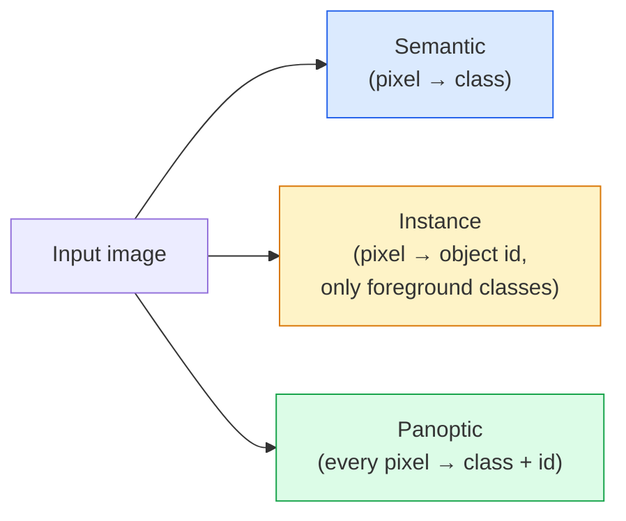
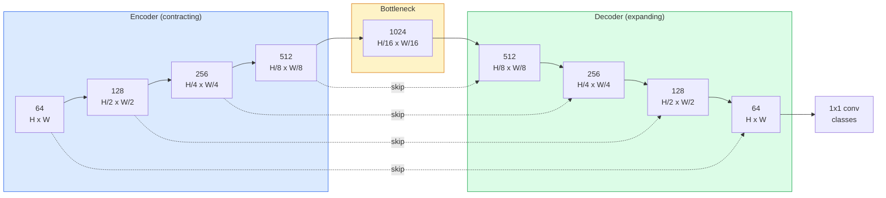

<!-- i18n:manual -->
# Семантическая сегментация — U-Net

> Сегментация — это классификация в каждом пикселе. U-Net заставляет её работать: сжимающий encoder, разжимающий decoder и skip connection между ними.

**Type:** Build
**Languages:** Python
**Prerequisites:** Phase 4 Lesson 03 (CNNs), Phase 4 Lesson 04 (Image Classification)
**Time:** ~75 minutes

## Learning Objectives

- Различать семантическую, instance- и паноптическую сегментацию и выбирать правильную задачу под конкретную проблему
- Собрать U-Net с нуля на PyTorch: блоки encoder, bottleneck, decoder с транспонированными свёртками и skip connection
- Реализовать попиксельную кросс-энтропию, Dice loss и комбинированную функцию потерь — сегодняшний стандарт для медицинской и промышленной сегментации
- Читать метрики IoU и Dice по классам и понимать, откуда взялся плохой результат: мелкие объекты, границы или дисбаланс классов

## The Problem

Классификация выдаёт одну метку на изображение. Детекция выдаёт несколько рамок на изображение. Сегментация выдаёт метку на каждый пиксель. Для входа размера `H x W` выход — тензор формы `H x W` (семантическая) или `H x W x N_instances` (instance). Это миллионы предсказаний на картинку, а не одно.

Именно из-за такой структуры сегментация лежит в основе почти любого продукта с плотным предсказанием: медицинская визуализация (маски опухолей), автопилот (дорога, полоса, препятствие), спутники (контуры зданий, границы полей), разбор документов (зоны вёрстки), робототехника (области, за которые можно схватить). Ни одну из этих задач нельзя решить рамкой вокруг объекта; нужен точный силуэт.

Архитектурная проблема формулируется просто, а решается трудно: сеть должна одновременно видеть глобальный контекст изображения (что это вообще за сцена) и локальную деталь на уровне пикселя (вот здесь дорога, а вот здесь уже тротуар). Обычная CNN сжимает картинку пространственно, чтобы получить контекст, — и вместе со сжатием выбрасывает детали. U-Net оказался конструкцией, которая даёт и то, и другое.

> 🎒 **На пальцах.** Представьте, что вас просят обвести на фотографии контур кота маркером. Чтобы понять, что это кот, надо отойти и посмотреть на всю картинку целиком. Чтобы аккуратно обвести усы, надо наклониться вплотную. Человек делает и то, и другое, переводя взгляд. U-Net делает то же самое: сначала отходит (encoder), потом наклоняется обратно (decoder), а skip connection — это память о том, что он видел вблизи.

## The Concept

### Semantic vs instance vs panoptic



- **Semantic** говорит «этот пиксель — дорога, тот пиксель — машина». Две машины рядом сливаются в одно пятно.
- **Instance** говорит «этот пиксель — машина №3, тот пиксель — машина №5». Игнорирует фон-«вещество» («stuff» = небо, дорога, трава).
- **Panoptic** объединяет оба: каждый пиксель получает класс, каждый экземпляр получает уникальный id, сегментируются и «вещества», и «предметы».

Этот урок про семантическую. Следующий урок (Mask R-CNN) — про instance.

> 🎒 **На пальцах.** Парковка с пятью машинами. Semantic скажет: «вот тут машина» — одно сплошное пятно, машин посчитать нельзя. Instance скажет: «машина 1, машина 2, ... машина 5» — можно посчитать, но небо и асфальт ему безразличны. Panoptic опишет все 65 536 пикселей: и класс, и номер экземпляра. Если вам надо посчитать объекты, семантической сегментации не хватит.

### The U-Net shape



Encoder четыре раза уменьшает пространственное разрешение вдвое и вдвое увеличивает число каналов. Decoder делает обратное: четыре раза удваивает разрешение и вдвое уменьшает число каналов. Skip connection на каждом разрешении склеивает признаки encoder с признаками decoder. Финальная свёртка 1x1 переводит `64 -> num_classes` в полном разрешении.

Почему skip connection необходимы: к моменту, когда decoder должен выдать попиксельное предсказание, он видел только маленькие карты признаков. Без skip он не сможет точно локализовать края — эта информация была сжата и потеряна в encoder. Skip connection передаёт ему карты признаков высокого разрешения, посчитанные encoder на пути вниз.

> 🎒 **На пальцах.** Картинка 256×256 проходит через encoder так: 256 → 128 → 64 → 32 → 16. В самом узком месте от исходных 65 536 позиций остаётся 256 — в 256 раз меньше. Зато каналов там 1024 вместо 64. Смысла много, деталей нет. Skip connection — это как черновик, который вы не выбросили: на пути вверх decoder берёт слой 128×128 прямо из encoder, а не пытается вспомнить его по памяти.

### Transposed vs bilinear upsample

Decoder обязан увеличивать пространственные размеры. Есть два варианта:

- **Transposed convolution** (`nn.ConvTranspose2d`) — обучаемое увеличение. Исторический вариант по умолчанию в U-Net. Может давать артефакты в виде шахматной клетки, если stride и размер ядра не делятся нацело.
- **Bilinear upsample + 3x3 conv** — плавное увеличение, за которым идёт свёртка. Меньше артефактов, меньше параметров, современный вариант по умолчанию.

Оба встречаются в реальном коде. Для первого U-Net безопаснее bilinear.

> 🎒 **На пальцах.** Разница как между «растянуть фото в редакторе» и «дорисовать недостающие пиксели кистью». Bilinear просто усредняет соседей — предсказуемо и скучно. Transposed conv учится дорисовывать, но при `kernel_size=3, stride=2` соседние выходные пиксели получают разное количество вкладов, и на картинке проступает сетка. Именно поэтому в коде ниже стоит `nn.Upsample(scale_factor=2, mode="bilinear")`, а не `ConvTranspose2d`.

### Cross-entropy on a pixel grid

Для семантической сегментации с C классами выход модели — `(N, C, H, W)`. Разметка — `(N, H, W)` с целочисленными id классов. Кросс-энтропия здесь ровно та же, что в классификации, просто применяется в каждой пространственной позиции:

```
Loss = mean over (n, h, w) of -log( softmax(logits[n, :, h, w])[target[n, h, w]] )
```

`F.cross_entropy` в PyTorch понимает такую форму сам. Никаких reshape не нужно.

> 🎒 **На пальцах.** Это буквально 65 536 маленьких классификаторов, которые обучаются одновременно и делят между собой одни и те же веса. Формулу можно прочесть так: «взять предсказанную вероятность правильного класса в этом пикселе, взять от неё минус логарифм, усреднить по всем пикселям». Если сеть уверена и права, вклад близок к 0; если уверена и не права — вклад огромный.

### Dice loss and why you need it

Кросс-энтропия считает все пиксели одинаково важными. Это неверно, когда один класс занимает почти весь кадр (медицина: 99% фон, 1% опухоль). Сеть получит 99% точности, предсказывая фон везде, и останется бесполезной.

Dice loss решает это, напрямую оптимизируя перекрытие предсказанной и настоящей маски:

```
Dice(p, y) = 2 * sum(p * y) / (sum(p) + sum(y) + epsilon)
Dice_loss = 1 - Dice
```

где `p` — карта вероятностей класса после sigmoid/softmax, а `y` — бинарная маска эталона. Потеря равна нулю только при идеальном перекрытии. Поскольку метрика построена на отношении, дисбаланс классов на неё не влияет.

> 🎒 **На пальцах.** Возьмём снимок 512×512 = 262 144 пикселя, опухоль занимает 1% — это 2 621 пиксель. Сеть, которая говорит «фона нет нигде, кроме фона», получает pixel accuracy 99% и полностью проваливает задачу. Dice для неё: перекрытие 0, значит `2*0 / (0 + 2621) = 0`, а Dice loss = 1 — максимум. Метрика сразу кричит, что модель бесполезна.

На практике используйте **комбинированную потерю**:

```
L = L_cross_entropy + lambda * L_dice       (lambda ~ 1)
```

Кросс-энтропия даёт стабильные градиенты в начале обучения; Dice в конце обучения заставляет модель точно попадать в форму маски. Эта комбинация — стандарт медицинской визуализации, и её трудно превзойти на любом наборе данных с дисбалансом классов.

### Evaluation metrics

- **Pixel accuracy** — процент правильно предсказанных пикселей. Дёшево. Ломается на несбалансированных данных ровно по той же причине, что и accuracy в классификации.
- **IoU per class** — пересечение делить на объединение для маски каждого класса; среднее по классам = mIoU.
- **Dice (F1 on pixels)** — похоже на IoU; `Dice = 2 * IoU / (1 + IoU)`. Медицина предпочитает Dice, автопилотное сообщество — IoU; они монотонно связаны.
- **Boundary F1** — измеряет, насколько предсказанные границы близки к эталонным, штрафуя даже небольшие сдвиги. Важно для задач высокой точности вроде контроля полупроводников.

Показывайте IoU по классам, а не только mIoU. Среднее прячет класс с 15%, когда девять других держат 85%.

> 🎒 **На пальцах.** Проверьте связь метрик руками: при IoU = 0.5 получаем Dice = 2*0.5 / 1.5 = 0.667. Одно и то же качество, два разных числа — не пугайтесь, когда медицинская статья хвалится 0.9, а автопилотная 0.82. А про среднее: девять классов по 85% и один на 15% дают mIoU (9*85 + 15) / 10 = 78%. Отчёт выглядит прилично, а один класс модель не видит вообще.

### Input resolution trade-off

Encoder U-Net уменьшает разрешение вдвое четыре раза, поэтому вход должен делиться на 16. Медицинские снимки часто 512x512 или 1024x1024. Кропы для автопилота — 2048x1024. Потребление памяти U-Net растёт как `H * W * C_max`, и при 1024x1024 с 1024 каналами в bottleneck один прямой проход уже съедает гигабайты VRAM.

Два стандартных обходных пути:
1. Нарезать вход на тайлы — обрабатывать плитки 256x256 с перекрытием и сшивать.
2. Заменить bottleneck на dilated-свёртки, которые сохраняют более высокое разрешение и при этом расширяют рецептивное поле (семейство DeepLab).

Для первой модели вход 256x256 и U-Net с базой 64 канала спокойно обучается на 8 ГБ VRAM.

> 🎒 **На пальцах.** Почему именно 16: четыре уменьшения вдвое — это 2⁴ = 16. Вход 256 проходит: 256/16 = 16, целое, всё хорошо. Вход 250 даёт 250/16 = 15.6 — формы в skip connection перестают совпадать, и код падает. Поэтому в блоке `Up` ниже стоит страховка через `F.interpolate`.

```figure
segmentation-flood
```

## Build It

### Step 1: Encoder block

Две свёртки 3x3 с batch norm и ReLU. Первая свёртка меняет число каналов; вторая его сохраняет.

```python
import torch
import torch.nn as nn
import torch.nn.functional as F

class DoubleConv(nn.Module):
    def __init__(self, in_c, out_c):
        super().__init__()
        self.net = nn.Sequential(
            nn.Conv2d(in_c, out_c, kernel_size=3, padding=1, bias=False),
            nn.BatchNorm2d(out_c),
            nn.ReLU(inplace=True),
            nn.Conv2d(out_c, out_c, kernel_size=3, padding=1, bias=False),
            nn.BatchNorm2d(out_c),
            nn.ReLU(inplace=True),
        )

    def forward(self, x):
        return self.net(x)
```

Этот блок используется повторно по всей сети. `bias=False` — потому что смещение берёт на себя параметр beta в BatchNorm.

> 🎒 **На пальцах.** Свёртка 3x3 смотрит на квадратик из 9 пикселей. Две подряд — уже эффективное окно 5x5, но параметров меньше, чем у одной свёртки 5x5. Если считать честно: две 3x3 при 64 каналах дают 2 × 3 × 3 × 64 × 64 = 73 728 весов, одна 5x5 — 5 × 5 × 64 × 64 = 102 400. Дешевле и нелинейности между ними две вместо одной.

### Step 2: Down and up blocks

```python
class Down(nn.Module):
    def __init__(self, in_c, out_c):
        super().__init__()
        self.net = nn.Sequential(
            nn.MaxPool2d(2),
            DoubleConv(in_c, out_c),
        )

    def forward(self, x):
        return self.net(x)


class Up(nn.Module):
    def __init__(self, in_c, out_c):
        super().__init__()
        self.up = nn.Upsample(scale_factor=2, mode="bilinear", align_corners=False)
        self.conv = DoubleConv(in_c, out_c)

    def forward(self, x, skip):
        x = self.up(x)
        if x.shape[-2:] != skip.shape[-2:]:
            x = F.interpolate(x, size=skip.shape[-2:], mode="bilinear", align_corners=False)
        x = torch.cat([skip, x], dim=1)
        return self.conv(x)
```

Проверка только пространственной формы (`shape[-2:]`) обрабатывает входы, размеры которых не делятся на 16; безопасный `F.interpolate` выравнивает тензор перед конкатенацией. Сравнение полной формы срабатывало бы и на различии в числе каналов, а это должно быть громкой ошибкой, а не тихой интерполяцией.

> 🎒 **На пальцах.** Обратите внимание на порядок в `torch.cat([skip, x], dim=1)`: `dim=1` — это каналы. Если из encoder пришло 256 каналов, а снизу поднялось 512, после склейки будет 768. Именно поэтому в конструкторе U-Net написано `Up(base * 16 + base * 8, base * 8)` — сеть заранее знает, что на входе будет сумма двух потоков, а не один.

### Step 3: The U-Net

```python
class UNet(nn.Module):
    def __init__(self, in_channels=3, num_classes=2, base=64):
        super().__init__()
        self.inc = DoubleConv(in_channels, base)
        self.d1 = Down(base, base * 2)
        self.d2 = Down(base * 2, base * 4)
        self.d3 = Down(base * 4, base * 8)
        self.d4 = Down(base * 8, base * 16)
        self.u1 = Up(base * 16 + base * 8, base * 8)
        self.u2 = Up(base * 8 + base * 4, base * 4)
        self.u3 = Up(base * 4 + base * 2, base * 2)
        self.u4 = Up(base * 2 + base, base)
        self.outc = nn.Conv2d(base, num_classes, kernel_size=1)

    def forward(self, x):
        x1 = self.inc(x)
        x2 = self.d1(x1)
        x3 = self.d2(x2)
        x4 = self.d3(x3)
        x5 = self.d4(x4)
        x = self.u1(x5, x4)
        x = self.u2(x, x3)
        x = self.u3(x, x2)
        x = self.u4(x, x1)
        return self.outc(x)

net = UNet(in_channels=3, num_classes=2, base=32)
x = torch.randn(1, 3, 256, 256)
print(f"output: {net(x).shape}")
print(f"params: {sum(p.numel() for p in net.parameters()):,}")
```

Форма выхода `(1, 2, 256, 256)` — тот же пространственный размер, что у входа, и `num_classes` каналов. Около 7.7 млн параметров при `base=32`.

> 🎒 **На пальцах.** Проследите за одной картинкой: `x1` — 32 канала при 256×256, `x2` — 64 при 128×128, `x3` — 128 при 64×64, `x4` — 256 при 32×32, `x5` — 512 при 16×16. Дальше всё разворачивается обратно, и на каждом шаге подмешивается сохранённый `x4`, `x3`, `x2`, `x1`. Форма буквы U в названии — это ровно этот график: вниз, потом вверх, с перемычками.

### Step 4: Losses

```python
def dice_loss(logits, targets, num_classes, eps=1e-6):
    probs = F.softmax(logits, dim=1)
    targets_one_hot = F.one_hot(targets, num_classes).permute(0, 3, 1, 2).float()
    dims = (0, 2, 3)
    intersection = (probs * targets_one_hot).sum(dim=dims)
    denom = probs.sum(dim=dims) + targets_one_hot.sum(dim=dims)
    dice = (2 * intersection + eps) / (denom + eps)
    return 1 - dice.mean()


def combined_loss(logits, targets, num_classes, lam=1.0):
    ce = F.cross_entropy(logits, targets)
    dc = dice_loss(logits, targets, num_classes)
    return ce + lam * dc, {"ce": ce.item(), "dice": dc.item()}
```

Dice считается по классам и потом усредняется (macro Dice). `eps` защищает от деления на ноль для классов, отсутствующих в батче.

### Step 5: IoU metric

```python
@torch.no_grad()
def iou_per_class(logits, targets, num_classes):
    preds = logits.argmax(dim=1)
    ious = torch.zeros(num_classes)
    for c in range(num_classes):
        pred_c = (preds == c)
        true_c = (targets == c)
        inter = (pred_c & true_c).sum().float()
        union = (pred_c | true_c).sum().float()
        ious[c] = (inter / union) if union > 0 else torch.tensor(float("nan"))
    return ious
```

Возвращает вектор длины C. `nan` помечает классы, отсутствующие в батче — не усредняйте по ним при подсчёте mIoU.

> 🎒 **На пальцах.** Считаем руками: предсказано 100 пикселей класса «круг», в эталоне 120, совпало 80. Пересечение = 80, объединение = 100 + 120 − 80 = 140, IoU = 80/140 = 0.57. Именно это и делают строки с `&` и `|` — побитовое «и» даёт пересечение, побитовое «или» даёт объединение.

### Step 6: Synthetic dataset for end-to-end verification

Генерируем фигуры на цветных фонах, чтобы сеть училась форме, а не цвету пикселя.

```python
import numpy as np
from torch.utils.data import Dataset, DataLoader

def synthetic_segmentation(num_samples=200, size=64, seed=0):
    rng = np.random.default_rng(seed)
    images = np.zeros((num_samples, size, size, 3), dtype=np.float32)
    masks = np.zeros((num_samples, size, size), dtype=np.int64)
    for i in range(num_samples):
        bg = rng.uniform(0, 1, (3,))
        images[i] = bg
        masks[i] = 0
        num_shapes = rng.integers(1, 4)
        for _ in range(num_shapes):
            cls = int(rng.integers(1, 3))
            color = rng.uniform(0, 1, (3,))
            cx, cy = rng.integers(10, size - 10, size=2)
            r = int(rng.integers(4, 12))
            yy, xx = np.meshgrid(np.arange(size), np.arange(size), indexing="ij")
            if cls == 1:
                mask = (xx - cx) ** 2 + (yy - cy) ** 2 < r ** 2
            else:
                mask = (np.abs(xx - cx) < r) & (np.abs(yy - cy) < r)
            images[i][mask] = color
            masks[i][mask] = cls
        images[i] += rng.normal(0, 0.02, images[i].shape)
        images[i] = np.clip(images[i], 0, 1)
    return images, masks


class SegDataset(Dataset):
    def __init__(self, images, masks):
        self.images = images
        self.masks = masks

    def __len__(self):
        return len(self.images)

    def __getitem__(self, i):
        img = torch.from_numpy(self.images[i]).permute(2, 0, 1).float()
        mask = torch.from_numpy(self.masks[i]).long()
        return img, mask
```

Три класса: фон (0), круги (1), квадраты (2). Сеть должна научиться различать форму.

> 🎒 **На пальцах.** Ключевой трюк здесь — `color = rng.uniform(0, 1, (3,))` для каждой фигуры отдельно. Круг может оказаться красным, а квадрат — тоже красным. Значит, по цвету их не отличить, остаётся только форма. Размеры: картинка 64×64, радиус фигуры от 4 до 12 пикселей, от 1 до 3 фигур на кадр — то есть объект занимает от 0.3% до 11% площади. Дисбаланс классов встроен в датасет намеренно.

### Step 7: Training loop

```python
def train_one_epoch(model, loader, optimizer, device, num_classes):
    model.train()
    loss_sum, total = 0.0, 0
    iou_sum = torch.zeros(num_classes)
    for x, y in loader:
        x, y = x.to(device), y.to(device)
        logits = model(x)
        loss, _ = combined_loss(logits, y, num_classes)
        optimizer.zero_grad()
        loss.backward()
        optimizer.step()
        loss_sum += loss.item() * x.size(0)
        total += x.size(0)
        iou_sum += iou_per_class(logits, y, num_classes).nan_to_num(0)
    return loss_sum / total, iou_sum / len(loader)
```

Запустите это на 10-30 эпох на синтетическом наборе и посмотрите, как mIoU для классов-фигур переваливает за 0.9. Обратите внимание: `nan_to_num(0)` считает отсутствующие в батче классы нулём; для честного IoU по классам маскируйте по наличию и используйте `torch.nanmean` по батчам на этапе оценки, а не усреднение здесь.

> 🎒 **На пальцах.** Порядок строк важен: `loss.backward()` идёт после `optimizer.zero_grad()`, иначе градиенты с прошлого шага сложатся с новыми и обучение поедет. И ещё: `loss_sum += loss.item() * x.size(0)` умножает на размер батча, потому что последний батч из 200 примеров при `batch_size=64` будет неполным — 8 штук. Без умножения средний loss был бы перекошен.

## Use It

Для продакшена `segmentation_models_pytorch` («smp») оборачивает любую стандартную архитектуру сегментации с любым backbone из torchvision или timm. Три строки:

```python
import segmentation_models_pytorch as smp

model = smp.Unet(
    encoder_name="resnet34",
    encoder_weights="imagenet",
    in_channels=3,
    classes=3,
)
```

Что ещё стоит знать для реальной работы:
- **DeepLabV3+** заменяет уменьшение через max-pool на dilated-свёртки, так что bottleneck сохраняет разрешение; лучше границы на спутниковых и дорожных данных.
- **SegFormer** меняет свёрточный encoder на иерархический трансформер; текущий SOTA на многих бенчмарках.
- **Mask2Former** / **OneFormer** объединяют семантическую, instance- и паноптическую сегментацию в одной архитектуре.

Все три подставляются в `smp` или `transformers` без изменений в загрузчике данных.

> 🎒 **На пальцах.** Сравните: ваш U-Net с `base=32` — это 7.7 млн параметров, обученных с нуля на 200 картинках. `smp.Unet` с `encoder_name="resnet34"` и `encoder_weights="imagenet"` берёт encoder, уже видевший миллион изображений. На реальных данных разница обычно 5-15 пунктов mIoU при том же времени обучения. Свой U-Net — чтобы понимать, `smp` — чтобы сдать проект.

## Ship It

Этот урок производит:

- `outputs/prompt-segmentation-task-picker.md` — промпт, который выбирает между семантической, instance- и паноптической сегментацией и называет архитектуру под конкретную задачу.
- `outputs/skill-segmentation-mask-inspector.md` — навык, который показывает распределение классов, статистику предсказанных масок и классы, которые недопредсказаны или размыты по границам.

## Exercises

1. **(Easy)** Реализуйте `bce_dice_loss` для бинарной сегментации (передний план против фона). Проверьте на синтетическом двухклассовом наборе, что комбинированная потеря сходится быстрее, чем один BCE, когда передний план занимает 5% пикселей.
2. **(Medium)** Замените up-блок `nn.Upsample + conv` на up-блок с `nn.ConvTranspose2d`. Обучите оба варианта на синтетическом наборе и сравните mIoU. Посмотрите, где именно в версии с transposed conv появляются шахматные артефакты.
3. **(Hard)** Возьмите настоящий набор для сегментации (Oxford-IIIT Pets, мини-срез Cityscapes или медицинский поднабор) и обучите свой U-Net так, чтобы отстать от эталонного `smp.Unet` не более чем на 2 пункта IoU. Приведите IoU по классам и определите, каким классам добавление Dice в функцию потерь помогает сильнее всего.

> 🎒 **На пальцах.** Подсказка к первому заданию: если передний план занимает 5% пикселей картинки 64×64, это всего 205 пикселей из 4096. Модель, которая предсказывает фон везде, получит BCE-точность 95% и Dice ровно 0. Постройте два графика в одних осях — BCE-loss и Dice — и вы увидите, что BCE падает почти сразу, а Dice ещё долго держится у единицы. Это и есть ответ на вопрос «зачем нужен Dice».

## Key Terms

| Term | What people say | What it actually means |
|------|----------------|----------------------|
| Semantic segmentation | «Разметить каждый пиксель» | Попиксельная классификация на C классов; экземпляры одного класса сливаются |
| Instance segmentation | «Разметить каждый объект» | Разделяет разные экземпляры одного класса; только передний план |
| Panoptic segmentation | «Semantic + instance» | Каждый пиксель получает класс; каждый экземпляр-предмет получает ещё и уникальный id |
| Skip connection | «Мостик в U-Net» | Склейка признаков encoder с признаками decoder того же разрешения; сохраняет мелкие детали |
| Transposed conv | «Деконволюция» | Обучаемое увеличение разрешения; может давать шахматные артефакты |
| Dice loss | «Потеря на перекрытие» | 1 - 2|A ∩ B| / (|A| + |B|); напрямую оптимизирует перекрытие масок и устойчива к дисбалансу классов |
| mIoU | «Среднее пересечение к объединению» | Средний IoU по классам; общепринятая метрика сегментации |
| Boundary F1 | «Точность границ» | F1, посчитанный только по граничным пикселям; важен там, где критична точность |

## Further Reading

- [U-Net: Convolutional Networks for Biomedical Image Segmentation (Ronneberger et al., 2015)](https://arxiv.org/abs/1505.04597) — оригинальная статья; ту самую картинку, которую все копируют, ищите на второй странице
- [Fully Convolutional Networks (Long et al., 2015)](https://arxiv.org/abs/1411.4038) — статья, которая первой сделала сегментацию сквозной свёрточной задачей
- [segmentation_models_pytorch](https://github.com/qubvel/segmentation_models.pytorch) — эталон для продакшен-сегментации; все стандартные архитектуры и все стандартные потери
- [Lessons learned from training SOTA segmentation (kaggle.com competitions)](https://www.kaggle.com/code/iafoss/carvana-unet-pytorch) — разбор того, почему на реальных данных важны TTA, псевдоразметка и веса классов
