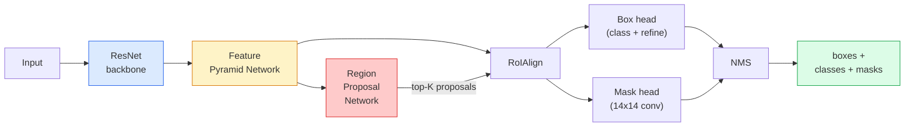

<!-- i18n:manual -->
# Instance-сегментация — Mask R-CNN

> Добавьте к детектору Faster R-CNN крошечную ветку масок — и вы получили instance-сегментацию. Сложная часть — RoI Align, и она сложнее, чем кажется.

**Type:** Build + Learn
**Languages:** Python
**Prerequisites:** Phase 4 Lesson 06 (YOLO), Phase 4 Lesson 07 (U-Net)
**Time:** ~75 minutes

## Learning Objectives

- Проследить архитектуру Mask R-CNN от начала до конца: backbone, FPN, RPN, RoI Align, box head, mask head
- Реализовать RoI Align с нуля и объяснить, почему RoIPool больше не используют
- Использовать предобученную torchvision-модель `maskrcnn_resnet50_fpn_v2` для масок продакшен-качества и правильно читать формат её выхода
- Дообучить Mask R-CNN на маленьком своём наборе данных, заменив головы для рамок и масок и заморозив backbone

## The Problem

Семантическая сегментация даёт одну маску на класс. Instance-сегментация даёт одну маску на объект, даже когда два объекта одного класса. Подсчёт отдельных штук, трекинг между кадрами и измерения (габариты каждого кирпича в стене, каждой клетки на снимке микроскопа) требуют именно instance-сегментации.

Mask R-CNN (He et al., 2017) решил задачу, переформулировав instance-сегментацию как «детекция плюс маска». Конструкция оказалась настолько чистой, что следующие пять лет почти каждая статья по instance-сегментации была вариацией Mask R-CNN, а реализация в torchvision до сих пор остаётся выбором по умолчанию для небольших и средних наборов данных.

Сложная инженерная проблема — сэмплирование: как вырезать область признаков фиксированного размера из рамки-кандидата, углы которой не совпадают с границами пикселей? Ошибка здесь стоит десятых долей mAP везде и сразу. Ответ — RoI Align.

> 🎒 **На пальцах.** Разница между двумя задачами видна на одной фотографии стены. U-Net скажет «вот тут кирпич» одним сплошным пятном на всю стену. Mask R-CNN выдаст 240 отдельных масок — по одной на кирпич — и каждую можно измерить. Если в задаче есть слово «посчитать» или «измерить каждый», вам нужен этот урок, а не предыдущий.

## The Concept

### The architecture



Пять частей, которые надо понять:

1. **Backbone** — ResNet-50 или ResNet-101, обученная на ImageNet. Выдаёт иерархию карт признаков со stride 4, 8, 16, 32.
2. **FPN (Feature Pyramid Network)** — связи сверху вниз плюс боковые, благодаря которым на каждом уровне есть C каналов семантически богатых признаков. Детекция обращается к тому уровню FPN, который соответствует размеру объекта.
3. **RPN (Region Proposal Network)** — маленькая свёрточная голова, которая в каждой позиции якоря предсказывает «есть ли тут объект?» и «как уточнить рамку?». Выдаёт ~1000 кандидатов на изображение.
4. **RoI Align** — вырезает участок признаков фиксированного размера (например, 7x7) из любой рамки на любом уровне FPN. Билинейное сэмплирование, никакого округления.
5. **Heads** — двухслойная голова для рамок, которая уточняет координаты и выбирает класс, плюс маленькая свёрточная голова, выдающая бинарную маску `28x28` для каждого кандидата.

> 🎒 **На пальцах.** Смотрите на масштабы. Backbone со stride 32 превращает картинку 640×640 в карту 20×20 — одна клетка карты отвечает за квадрат 32×32 пикселя. Мелкую монету на такой карте не разглядеть, поэтому FPN держит одновременно и уровень со stride 4 (карта 160×160) для мелочи, и stride 32 для крупного. Каждый кандидат идёт на «свой» этаж пирамиды.

### Why RoIAlign, not RoIPool

Оригинальный Fast R-CNN использовал RoIPool: рамка делится на сетку, в каждой ячейке берётся максимум признака, а все координаты округляются до целых. Это округление сдвигает карту признаков относительно координат входных пикселей вплоть до целого пикселя карты — мелочь на картинке 224x224 и катастрофа, когда карта признаков имеет stride 32.

```
RoIPool:
  box (34.7, 51.3, 98.2, 142.9)
  round -> (34, 51, 98, 142)
  split grid -> round each cell boundary
  misalignment accumulates at every step

RoIAlign:
  box (34.7, 51.3, 98.2, 142.9)
  sample at exact float coordinates using bilinear interpolation
  no rounding anywhere
```

RoI Align бесплатно поднимает mask AP на 3-4 пункта на COCO. Любой детектор, которому важна локализация, теперь использует его — и YOLOv7 seg, и RT-DETR, и Mask2Former.

> 🎒 **На пальцах.** Посчитайте цену округления. Координата 34.7 округляется до 34 — потеря 0.7 клетки карты признаков. При stride 32 одна клетка — это 32 пикселя входа, значит маска уехала на 0.7 × 32 ≈ 22 пикселя. На фотографии 640×640 это заметный сдвиг всего контура. RoI Align не округляет вообще: он спрашивает значение «между» клетками и получает его линейной интерполяцией четырёх соседей.

### The RPN in one paragraph

В каждой позиции карты признаков ставим K якорных рамок разных размеров и пропорций. Для каждого якоря предсказываем оценку «объектности» и смещение регрессии, превращающее якорь в более подходящую рамку. Оставляем топ ~1000 рамок по оценке, применяем NMS при IoU 0.7 и передаём выживших в головы. RPN обучается собственным мини-лоссом — той же структуры, что у YOLO-лосса из урока 6, только классов два (объект / не объект).

> 🎒 **На пальцах.** На карте 50×50 с K = 3 якорями получается 50 × 50 × 3 = 7 500 кандидатов. Из них после сортировки по оценке остаётся 1000, а после NMS при IoU 0.7 — обычно несколько сотен. NMS выкидывает рамку, если она перекрывается с уже принятой более чем на 70%: восемь рамок вокруг одной кошки схлопываются в одну.

### The mask head

Для каждого кандидата (после RoI Align) mask head — это крошечная FCN: четыре свёртки 3x3, один deconv с двукратным увеличением, финальная свёртка 1x1, дающая `num_classes` каналов в разрешении `28x28`. Оставляется только канал, соответствующий предсказанному классу; остальные игнорируются. Так предсказание маски отвязывается от классификации.

Увеличьте маску 28x28 до исходного размера кандидата — это и есть финальная бинарная маска.

> 🎒 **На пальцах.** Маска 28x28 — это всего 784 числа на объект. Кажется мало, но контур человека на фото вполне узнаваем и в таком разрешении: сеть предсказывает грубую форму, а потом её растягивают до реального размера рамки. Именно поэтому у Mask R-CNN границы масок слегка «мыльные» — гораздо мягче, чем у U-Net, который работает в полном разрешении.

### Losses

У Mask R-CNN четыре потери, которые складываются:

```
L = L_rpn_cls + L_rpn_box + L_box_cls + L_box_reg + L_mask
```

- `L_rpn_cls`, `L_rpn_box` — объектность и регрессия рамок для кандидатов RPN.
- `L_box_cls` — кросс-энтропия по (C+1) классам (включая фон) на классификаторе головы.
- `L_box_reg` — smooth L1 на уточнении рамки в голове.
- `L_mask` — попиксельная бинарная кросс-энтропия на выходе маски 28x28.

У каждой потери свой вес по умолчанию; реализация в torchvision выставляет их аргументами конструктора.

> 🎒 **На пальцах.** Формула из пяти слагаемых, а в тексте выше сказано «четыре потери» — потому что две RPN-потери обычно считают одной группой. При отладке смотрите на них по отдельности: если `L_mask` падает, а `L_box_reg` стоит на месте, проблема в рамках, а не в масках, и крутить mask head бесполезно.

### Output format

`torchvision.models.detection.maskrcnn_resnet50_fpn_v2` возвращает список словарей, по одному на изображение:

```
{
    "boxes":  (N, 4) in (x1, y1, x2, y2) pixel coordinates,
    "labels": (N,) class IDs, 0 = background so indices are 1-based,
    "scores": (N,) confidence scores,
    "masks":  (N, 1, H, W) float masks in [0, 1] — threshold at 0.5 for binary,
}
```

Маска уже в полном разрешении изображения. Выход головы 28x28 увеличен внутри модели.

> 🎒 **На пальцах.** Главная ловушка новичка — `"labels": 0 = background`. Если у вас четыре своих класса, они получают номера 1, 2, 3, 4, а не 0, 1, 2, 3. Вторая ловушка — маски приходят вещественными в диапазоне [0, 1], а не булевыми. Пока вы не написали `> 0.5`, у вас не маска, а карта уверенности.

```figure
cv3-roialign-sampling
```

## Build It

### Step 1: RoIAlign from scratch

Это единственный компонент Mask R-CNN, который понятнее в виде кода, чем в виде текста.

```python
import torch
import torch.nn.functional as F

def roi_align_single(feature, box, output_size=7, spatial_scale=1 / 16.0):
    """
    feature: (C, H, W) single-image feature map
    box: (x1, y1, x2, y2) in original image pixel coordinates
    output_size: side of the output grid (7 for box head, 14 for mask head)
    spatial_scale: reciprocal of the feature map stride
    """
    C, H, W = feature.shape
    x1, y1, x2, y2 = [c * spatial_scale - 0.5 for c in box]
    bin_w = (x2 - x1) / output_size
    bin_h = (y2 - y1) / output_size

    grid_y = torch.linspace(y1 + bin_h / 2, y2 - bin_h / 2, output_size)
    grid_x = torch.linspace(x1 + bin_w / 2, x2 - bin_w / 2, output_size)
    yy, xx = torch.meshgrid(grid_y, grid_x, indexing="ij")

    gx = 2 * (xx + 0.5) / W - 1
    gy = 2 * (yy + 0.5) / H - 1
    grid = torch.stack([gx, gy], dim=-1).unsqueeze(0)
    sampled = F.grid_sample(feature.unsqueeze(0), grid, mode="bilinear",
                            align_corners=False)
    return sampled.squeeze(0)
```

Каждое число снимается билинейной интерполяцией. Никакого округления, никакой квантизации, никаких потерянных градиентов.

> 🎒 **На пальцах.** Разберём `spatial_scale=1/16`: рамка задана в пикселях картинки, а карта признаков в 16 раз меньше, поэтому координату 98.2 надо превратить в 98.2/16 = 6.14 клетки. При `output_size=7` рамку делят на 7 × 7 = 49 ячеек и берут по одной точке из центра каждой — отсюда `bin_h / 2` в `linspace`. Никаких целых чисел на этом пути не появляется вообще.

### Step 2: Compare to torchvision's RoIAlign

```python
from torchvision.ops import roi_align

feature = torch.randn(1, 16, 50, 50)
boxes = torch.tensor([[0, 10, 20, 100, 90]], dtype=torch.float32)  # (batch_idx, x1, y1, x2, y2)

ours = roi_align_single(feature[0], boxes[0, 1:].tolist(), output_size=7, spatial_scale=1/4)
theirs = roi_align(feature, boxes, output_size=(7, 7), spatial_scale=1/4, sampling_ratio=1, aligned=True)[0]

print(f"shape ours:   {tuple(ours.shape)}")
print(f"shape theirs: {tuple(theirs.shape)}")
print(f"max|diff|:    {(ours - theirs).abs().max().item():.3e}")
```

При `sampling_ratio=1` и `aligned=True` оба варианта совпадают с точностью до `1e-5`.

> 🎒 **На пальцах.** `1e-5` — это 0.00001, обычная погрешность вычислений во float32. Такое сравнение с эталонной реализацией — лучший способ проверить свой код: если бы вы забыли `- 0.5` при пересчёте координат, разница была бы порядка 0.1, а не 0.00001. Пишете что-то с нуля — всегда ищите готовую функцию, с которой можно сверить числа.

### Step 3: Load a pretrained Mask R-CNN

```python
import torch
from torchvision.models.detection import maskrcnn_resnet50_fpn_v2, MaskRCNN_ResNet50_FPN_V2_Weights

model = maskrcnn_resnet50_fpn_v2(weights=MaskRCNN_ResNet50_FPN_V2_Weights.DEFAULT)
model.eval()
print(f"params: {sum(p.numel() for p in model.parameters()):,}")
print(f"classes (including background): {len(model.roi_heads.box_predictor.cls_score.out_features * [0])}")
```

46 млн параметров, 91 класс (COCO). Первый класс (id 0) — фон; всё, что модель реально детектирует, начинается с id 1.

> 🎒 **На пальцах.** 46 млн параметров — примерно 184 МБ в float32. Для сравнения, ваш U-Net с прошлого урока был 7.7 млн, то есть в шесть раз легче. Разница уходит на backbone ResNet-50 и FPN — на всё то, что вы не будете обучать, а просто возьмёте готовым.

### Step 4: Run inference

```python
with torch.no_grad():
    x = torch.randn(3, 400, 600)
    predictions = model([x])
p = predictions[0]
print(f"boxes:  {tuple(p['boxes'].shape)}")
print(f"labels: {tuple(p['labels'].shape)}")
print(f"scores: {tuple(p['scores'].shape)}")
print(f"masks:  {tuple(p['masks'].shape)}")
```

Тензор масок имеет форму `(N, 1, H, W)`. Порог 0.5 превращает его в бинарную маску на объект:

```python
binary_masks = (p['masks'] > 0.5).squeeze(1)  # (N, H, W) boolean
```

> 🎒 **На пальцах.** Посчитайте память: если модель нашла 50 объектов на картинке 400×600, тензор масок — это 50 × 1 × 400 × 600 = 12 млн чисел, около 48 МБ во float32. После порога и `.squeeze(1)` остаются булевы значения — в четыре раза меньше. На видео с сотней кадров такая экономия перестаёт быть теоретической.

### Step 5: Swap the heads for a custom class count

Обычный рецепт дообучения: переиспользовать backbone, FPN и RPN; заменить два классификатора-головы.

```python
from torchvision.models.detection.faster_rcnn import FastRCNNPredictor
from torchvision.models.detection.mask_rcnn import MaskRCNNPredictor

def build_custom_maskrcnn(num_classes):
    model = maskrcnn_resnet50_fpn_v2(weights=MaskRCNN_ResNet50_FPN_V2_Weights.DEFAULT)
    in_features = model.roi_heads.box_predictor.cls_score.in_features
    model.roi_heads.box_predictor = FastRCNNPredictor(in_features, num_classes)
    in_features_mask = model.roi_heads.mask_predictor.conv5_mask.in_channels
    hidden_layer = 256
    model.roi_heads.mask_predictor = MaskRCNNPredictor(in_features_mask, hidden_layer, num_classes)
    return model

custom = build_custom_maskrcnn(num_classes=5)
print(f"custom cls_score.out_features: {custom.roi_heads.box_predictor.cls_score.out_features}")
```

`num_classes` должен включать класс фона, поэтому набор данных с 4 классами объектов использует `num_classes=5`.

> 🎒 **На пальцах.** Почему меняют только головы: backbone уже умеет видеть края, текстуры и формы — это одинаково для кошек и для дефектов на плате. А вот последний слой обучен выдавать ровно 91 число, и ваши 5 классов в него не поместятся. Заменяются два предсказателя: `box_predictor` (класс + координаты) и `mask_predictor` (маска). Всё остальное остаётся как было.

### Step 6: Freeze what does not need training

На маленьких наборах заморозьте backbone и FPN. Учатся только объектность с регрессией в RPN и две головы.

```python
def freeze_backbone_and_fpn(model):
    # torchvision Mask R-CNN packs the FPN inside `model.backbone` (as
    # `model.backbone.fpn`), so iterating `model.backbone.parameters()` covers
    # both the ResNet feature layers and the FPN lateral/output convs.
    for p in model.backbone.parameters():
        p.requires_grad = False
    return model

custom = freeze_backbone_and_fpn(custom)
trainable = sum(p.numel() for p in custom.parameters() if p.requires_grad)
print(f"trainable after freeze: {trainable:,}")
```

На наборах из 500 изображений именно это отделяет сходимость от переобучения.

> 🎒 **На пальцах.** Арифметика простая: 500 картинок и 46 млн обучаемых параметров — это 92 000 параметров на одну картинку. Сеть просто запомнит обучающую выборку наизусть. После заморозки backbone обучаемых остаётся несколько миллионов, и модель вынуждена обобщать. `requires_grad = False` буквально говорит «не считай градиент для этого веса».

## Use It

Полный цикл обучения Mask R-CNN в torchvision — это 40 строк, и от задачи к задаче он осмысленно не меняется: подставили другой набор данных и поехали.

```python
def train_step(model, images, targets, optimizer):
    model.train()
    loss_dict = model(images, targets)
    losses = sum(loss for loss in loss_dict.values())
    optimizer.zero_grad()
    losses.backward()
    optimizer.step()
    return {k: v.item() for k, v in loss_dict.items()}
```

Список `targets` должен содержать словари по изображению с ключами `boxes`, `labels` и `masks` (бинарные тензоры формы `(num_instances, H, W)`). Модель возвращает словарь из четырёх потерь во время обучения и список предсказаний во время оценки — выбор зависит от `model.training`.

Оценщик `pycocotools` считает mAP@IoU=0.5:0.95 и для рамок, и для масок; вам нужны оба числа, чтобы понять, что является узким местом — box head или mask head.

> 🎒 **На пальцах.** Обратите внимание: одна и та же строка `model(images, targets)` в режиме обучения возвращает потери, а `model(images)` в режиме eval — предсказания. Это частый источник недоумения: вызвали модель, ждали маски, получили словарь с числами. Проверьте `model.training`. И про метрику: mAP@0.5:0.95 — это среднее по десяти порогам IoU от 0.50 до 0.95 с шагом 0.05, поэтому оно всегда заметно ниже привычного mAP@0.5.

## Ship It

Этот урок производит:

- `outputs/prompt-instance-vs-semantic-router.md` — промпт, который задаёт три вопроса и выбирает instance против semantic против panoptic плюс конкретную модель для старта.
- `outputs/skill-mask-rcnn-head-swapper.md` — навык, который генерирует те самые 10 строк для замены голов в любой torchvision-модели детекции по заданному `num_classes`.

## Exercises

1. **(Easy)** Проверьте свой RoI Align против `torchvision.ops.roi_align` на 100 случайных рамках. Приведите максимальную абсолютную разницу. Заодно прогоните RoIPool (поведение до 2017 года) и покажите, что он расходится на 1-2 пикселя карты признаков на рамках у края.
2. **(Medium)** Дообучите `maskrcnn_resnet50_fpn_v2` на своём наборе из 50 изображений (любые два класса: шарики, рыбы, ямы на дороге, логотипы). Заморозьте backbone, обучите 20 эпох, приведите mask AP@0.5.
3. **(Hard)** Замените mask head в Mask R-CNN на такой, который предсказывает 56x56 вместо 28x28. Измерьте mAP@IoU=0.75 до и после. Объясните, почему прирост (или его отсутствие) соответствует ожидаемому компромиссу между точностью границ и памятью.

> 🎒 **На пальцах.** Подсказка к третьему заданию: 56x56 = 3 136 чисел на маску против 784 у 28x28 — ровно в четыре раза больше памяти и вычислений в mask head. Прирост качества вы увидите только там, где границы действительно тонкие: у людей с растопыренными пальцами, у велосипедов, у листьев. На круглых и компактных объектах разницы почти не будет, и это нормальный результат, а не ошибка эксперимента.

## Key Terms

| Term | What people say | What it actually means |
|------|----------------|----------------------|
| Mask R-CNN | «Детекция плюс маски» | Faster R-CNN + маленькая FCN-голова, предсказывающая маску 28x28 на каждый кандидат для каждого класса |
| FPN | «Пирамида признаков» | Связи сверху вниз плюс боковые, дающие на каждом уровне stride по C каналов семантически богатых признаков |
| RPN | «Генератор кандидатов» | Маленькая свёрточная голова, выдающая ~1000 кандидатов «объект / не объект» на изображение |
| RoIAlign | «Вырезание без округления» | Билинейно снимает сетку признаков фиксированного размера с любой рамки с дробными координатами |
| RoIPool | «Вырезание до 2017 года» | То же назначение, что у RoI Align, но округляет координаты рамки; устарел |
| Mask AP | «Instance mAP» | Средняя точность, посчитанная по IoU масок вместо IoU рамок; метрика instance-сегментации в COCO |
| Binary mask head | «Маска на класс» | Предсказывает по одной бинарной маске на класс для каждого кандидата; оставляется только канал предсказанного класса |
| Background class | «Класс 0» | Служебный класс «объекта нет»; номера настоящих классов начинаются с 1 |

## Further Reading

- [Mask R-CNN (He et al., 2017)](https://arxiv.org/abs/1703.06870) — статья; раздел 3 про RoI Align обязателен к прочтению
- [FPN: Feature Pyramid Networks (Lin et al., 2017)](https://arxiv.org/abs/1612.03144) — статья про FPN; его использует любой современный детектор
- [torchvision Mask R-CNN tutorial](https://pytorch.org/tutorials/intermediate/torchvision_tutorial.html) — эталонный цикл дообучения
- [Detectron2 model zoo](https://github.com/facebookresearch/detectron2/blob/main/MODEL_ZOO.md) — продакшен-реализации с обученными весами почти для всех вариантов детекции и сегментации
