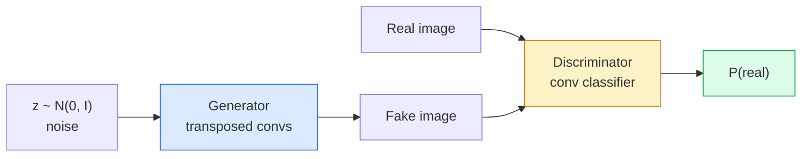
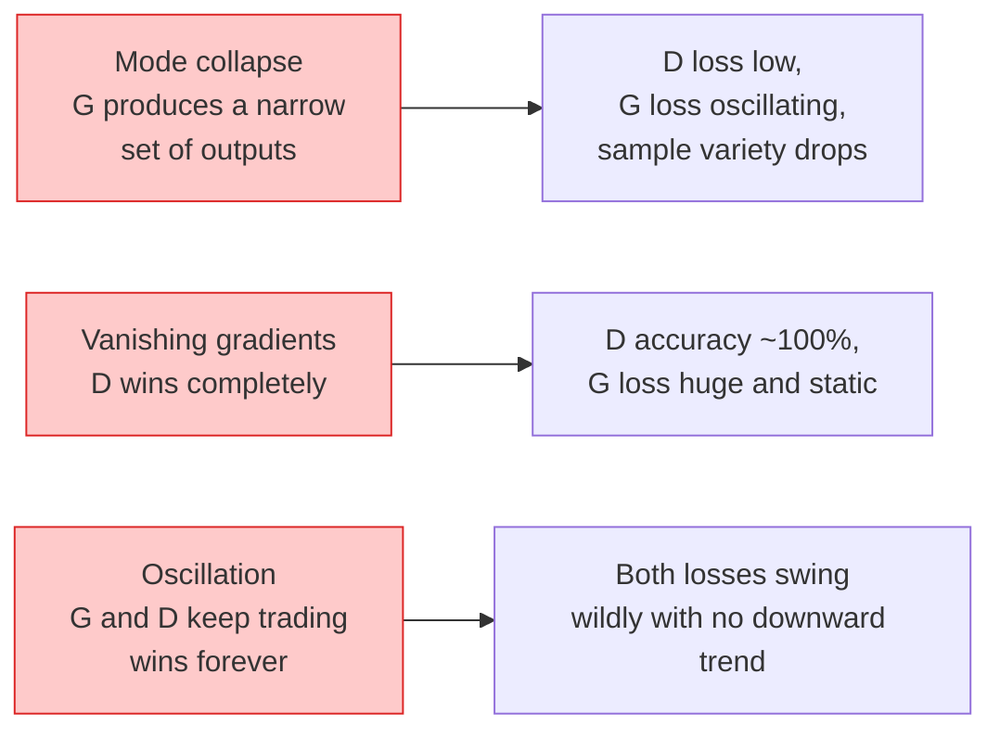

<!-- i18n:manual -->
# Генерация изображений — GAN

> GAN — это две нейросети в игре с жёсткими правилами. Одна рисует, вторая критикует. Они растут вместе, пока рисунки не начнут обманывать критика.

**Type:** Build
**Languages:** Python
**Prerequisites:** Phase 4 Lesson 03 (CNNs), Phase 3 Lesson 06 (Optimizers), Phase 3 Lesson 07 (Regularization)
**Time:** ~75 minutes

## Learning Objectives

- Объяснить минимаксную игру между generator и discriminator и почему равновесие соответствует p_model = p_data
- Реализовать DCGAN на PyTorch и заставить его генерировать осмысленные синтетические картинки 32x32 меньше чем в 60 строк
- Стабилизировать обучение GAN тремя стандартными приёмами: non-saturating loss, spectral norm, TTUR (two-timescale update rule)
- Читать кривые обучения и отличать здоровую сходимость от mode collapse, осцилляции и «discriminator победил всухую»

> 🎒 **На пальцах.** Фальшивомонетчик и следователь. Фальшивомонетчик печатает купюры, следователь учится их отличать. Каждый раз, когда следователь ловит подделку, фальшивомонетчик узнаёт, что именно выдало его, и печатает лучше. Через несколько сотен раундов следователь угадывает с вероятностью ровно 0.5 — то есть просто подбрасывает монетку. Это и есть цель обучения GAN.

## The Problem

Классификация учит сеть переводить изображения в метки. Генерация переворачивает задачу: породить новые изображения, которые выглядят так, будто пришли из того же распределения. Здесь нет «правильного» выхода, с которым можно сравнить результат; есть только распределение, которому надо подражать.

Стандартные функции потерь (MSE, кросс-энтропия) не умеют измерять «пришёл ли этот образец из настоящего распределения». Минимизация попиксельной ошибки даёт размытые усреднённые картинки, а не реалистичные образцы. Прорыв был в том, чтобы выучить саму функцию потерь: обучить вторую сеть, чья работа — отличать настоящее от поддельного, и её суждением подталкивать generator.

GAN (Goodfellow et al., 2014) задали эту схему. К 2018 году StyleGAN уже выдавал лица 1024x1024, неотличимые от фотографий. С тех пор трон по качеству и управляемости заняли диффузионные модели, но каждый приём, который сделал диффузию практичной — выбор нормализаций, латентные пространства, потери на признаках — был впервые понят на GAN.

> 🎒 **На пальцах.** Почему MSE не работает: если попросить сеть минимизировать попиксельную ошибку на наборе фотографий котов, лучший ответ — усреднённый кот, серо-бурое пятно. Оно действительно ближе всего ко всем котам сразу и при этом не похоже ни на одного. Discriminator решает это тем, что говорит не «насколько пиксели похожи», а «выглядит ли это как настоящая фотография».

## The Concept

### The two networks



**Generator** G берёт вектор шума `z` и выдаёт изображение. **Discriminator** D берёт изображение и выдаёт один скаляр: вероятность того, что изображение настоящее.

> 🎒 **На пальцах.** Посчитайте, из чего рождается картинка. Вход — 64 случайных числа. Выход — 32 × 32 × 3 = 3072 числа. Generator раздувает 64 в 3072, то есть в 48 раз, и делает это не хаотично: каждое из 64 чисел управляет какой-то характеристикой картинки. Именно поэтому потом можно двигать одно число и смотреть, как плавно меняется результат.

### The game

G хочет, чтобы D ошибался. D хочет быть правым. Формально:

```
min_G max_D  E_x[log D(x)] + E_z[log(1 - D(G(z)))]
```

Читайте справа налево: D максимизирует точность на настоящих (`log D(real)`) и на поддельных (`log (1 - D(fake))`) изображениях. G минимизирует точность D на подделках — он хочет, чтобы `D(G(z))` было высоким.

Goodfellow доказал, что у этого минимакса есть глобальное равновесие, в котором `p_G = p_data`, D везде выдаёт 0.5, а расстояние Йенсена — Шеннона между сгенерированным и настоящим распределениями равно нулю. Сложность — дойти до него.

> 🎒 **На пальцах.** «D выдаёт 0.5 везде» звучит как поражение, но это победа. Если бы D мог отличать, он выдавал бы 0.9 на настоящих и 0.1 на поддельных. Ровно 0.5 значит: он смотрит на картинку и не видит ни одной зацепки, приходится угадывать. Практическое следствие: если у вас `loss_d` уползла в ноль — это плохой знак, а не хороший.

### Non-saturating loss

Форма выше численно неустойчива. В начале обучения `D(G(z))` близко к нулю для любой подделки, поэтому у `log(1 - D(G(z)))` градиенты по G исчезают. Решение: перевернуть потерю G.

```
L_D = -E_x[log D(x)] - E_z[log(1 - D(G(z)))]
L_G = -E_z[log D(G(z))]                          # non-saturating
```

Теперь, когда `D(G(z))` близко к нулю, потеря G велика, и её градиент информативен. Любой современный GAN обучается именно в этом варианте.

> 🎒 **На пальцах.** Подставьте числа. Пусть `D(G(z)) = 0.01` — подделка распознана мгновенно. Исходный вариант: `log(1 - 0.01) = log(0.99) ≈ -0.01`, почти ноль, наклон почти нулевой — сети нечему учиться. Перевёрнутый вариант: `-log(0.01) ≈ 4.6`, большое число с крутым наклоном. Математически цель та же, но градиент есть, и обучение сдвигается с места.

### DCGAN architecture rules

Radford, Metz, Chintala (2015) свели годы неудачных экспериментов в пять правил, которые делают обучение GAN стабильным:

1. Заменить пулинг на свёртки со stride (в обеих сетях).
2. Использовать batch norm и в generator, и в discriminator, кроме выхода G и входа D.
3. Убрать полносвязные слои в глубоких архитектурах.
4. G использует ReLU на всех слоях, кроме выходного (tanh на выходе для диапазона [-1, 1]).
5. D использует LeakyReLU (negative_slope=0.2) на всех слоях.

Любой современный свёрточный GAN (StyleGAN, BigGAN, GigaGAN) до сих пор стартует с этих правил и заменяет детали по одной.

> 🎒 **На пальцах.** Правило про LeakyReLU важнее, чем кажется. Обычный ReLU обнуляет всё отрицательное — и градиент по этим нейронам тоже становится нулём. У discriminator это смертельно: если он «умер» на половине нейронов, generator перестаёт получать полезный сигнал. LeakyReLU с наклоном 0.2 пропускает 20% отрицательной части, и канал обратной связи остаётся открытым.

### Failure modes and their signatures



- **Mode collapse**: G находит одну картинку, которая обманывает D, и выдаёт только её. Лечение: minibatch discrimination, spectral norm или обусловливание метками.
- **Discriminator побеждает**: D становится слишком сильным слишком быстро, градиенты G исчезают. Лечение: уменьшить D, снизить его learning rate или применить сглаживание меток на настоящих примерах.
- **Осцилляция**: две сети обмениваются победами и никогда не приближаются к равновесию. Лечение: TTUR (D учится в 2-4 раза быстрее G) или переход на Wasserstein-потерю.

> 🎒 **На пальцах.** Диагностика на глазах: сохраняйте сетку из 16 сэмплов каждую эпоху. При mode collapse все 16 картинок будут почти одинаковыми — 16 копий одного круга. При «D побеждает» все 16 останутся шумом даже на десятой эпохе. При осцилляции картинки будут меняться от эпохи к эпохе, но лучше не станут. Три диагноза, один взгляд.

### Evaluation

У GAN нет эталона, так откуда знать, что всё работает?

- **Sample inspection** — просто посмотрите на 64 сэмпла в конце каждой эпохи. Не обсуждается.
- **FID (Fréchet Inception Distance)** — расстояние между распределениями признаков Inception-v3 для настоящего и сгенерированного наборов. Меньше — лучше. Стандарт сообщества.
- **Inception Score** — старее и капризнее; предпочитайте FID.
- **Precision/Recall для генеративных моделей** — измеряет качество (precision) и покрытие (recall) отдельно. Информативнее, чем один FID.

Для маленького прогона на синтетических данных хватит просмотра сэмплов.

> 🎒 **На пальцах.** Почему FID ловит mode collapse, а точность — нет. Возьмите генератор, который выдаёт одну идеальную картинку кота. Качество каждого сэмпла безупречно, но распределение признаков — это одна точка вместо облака, и FID окажется огромным. Именно поэтому FID сравнивает распределения целиком, а не картинки по отдельности.

```figure
cv-gan-image
```

## Build It

### Step 1: Generator

Маленький DCGAN-generator, который берёт 64-мерный шум и выдаёт картинку 32x32.

```python
import torch
import torch.nn as nn

class Generator(nn.Module):
    def __init__(self, z_dim=64, img_channels=3, feat=64):
        super().__init__()
        self.net = nn.Sequential(
            nn.ConvTranspose2d(z_dim, feat * 4, kernel_size=4, stride=1, padding=0, bias=False),
            nn.BatchNorm2d(feat * 4),
            nn.ReLU(inplace=True),
            nn.ConvTranspose2d(feat * 4, feat * 2, kernel_size=4, stride=2, padding=1, bias=False),
            nn.BatchNorm2d(feat * 2),
            nn.ReLU(inplace=True),
            nn.ConvTranspose2d(feat * 2, feat, kernel_size=4, stride=2, padding=1, bias=False),
            nn.BatchNorm2d(feat),
            nn.ReLU(inplace=True),
            nn.ConvTranspose2d(feat, img_channels, kernel_size=4, stride=2, padding=1, bias=False),
            nn.Tanh(),
        )

    def forward(self, z):
        return self.net(z.view(z.size(0), -1, 1, 1))
```

Четыре транспонированные свёртки, у каждой `kernel_size=4, stride=2, padding=1`, поэтому они аккуратно удваивают пространственный размер. Выходные активации в [-1, 1] через tanh.

> 🎒 **На пальцах.** Проследите за размерами: `z.view(..., 1, 1)` даёт 1×1, первая свёртка с `stride=1, padding=0` растягивает до 4×4, дальше три удвоения — 8×8, 16×16, 32×32. Каналы идут в обратную сторону: 128 → 64 → 32 → 3. Общее правило DCGAN: пространство растёт, каналы падают. Именно поэтому tanh на выходе — данные тоже надо нормировать в [-1, 1], иначе generator и датасет живут в разных диапазонах.

### Step 2: Discriminator

Зеркало generator. LeakyReLU, свёртки со stride, на выходе один логит.

```python
class Discriminator(nn.Module):
    def __init__(self, img_channels=3, feat=64):
        super().__init__()
        self.net = nn.Sequential(
            nn.Conv2d(img_channels, feat, kernel_size=4, stride=2, padding=1),
            nn.LeakyReLU(0.2, inplace=True),
            nn.Conv2d(feat, feat * 2, kernel_size=4, stride=2, padding=1, bias=False),
            nn.BatchNorm2d(feat * 2),
            nn.LeakyReLU(0.2, inplace=True),
            nn.Conv2d(feat * 2, feat * 4, kernel_size=4, stride=2, padding=1, bias=False),
            nn.BatchNorm2d(feat * 4),
            nn.LeakyReLU(0.2, inplace=True),
            nn.Conv2d(feat * 4, 1, kernel_size=4, stride=1, padding=0),
        )

    def forward(self, x):
        return self.net(x).view(-1)
```

Последняя свёртка сжимает карту признаков `4x4` в `1x1`. На выходе один скаляр на изображение; sigmoid применяется только при вычислении потери.

> 🎒 **На пальцах.** Обратите внимание на первый слой: у него нет `bias=False` и нет BatchNorm — это правило 2 из списка DCGAN. Batch norm на входе D смешал бы статистики настоящих и поддельных картинок в одном батче и подсказал бы discriminator ответ через чёрный ход. А sigmoid не применяют внутри сети потому, что `binary_cross_entropy_with_logits` делает это численно устойчивее самостоятельно.

### Step 3: Training step

Чередуем: каждый батч сначала обновляем D один раз, потом G один раз.

```python
import torch.nn.functional as F

def train_step(G, D, real, z, opt_g, opt_d, device):
    real = real.to(device)
    z = z.to(device)

    # D step
    opt_d.zero_grad()
    d_real = D(real)
    d_fake = D(G(z).detach())
    loss_d = (F.binary_cross_entropy_with_logits(d_real, torch.ones_like(d_real))
              + F.binary_cross_entropy_with_logits(d_fake, torch.zeros_like(d_fake)))
    loss_d.backward()
    opt_d.step()

    # G step
    opt_g.zero_grad()
    d_fake = D(G(z))
    loss_g = F.binary_cross_entropy_with_logits(d_fake, torch.ones_like(d_fake))
    loss_g.backward()
    opt_g.step()

    return loss_d.item(), loss_g.item()
```

`G(z).detach()` в шаге D критичен: мы не хотим, чтобы градиенты текли в G во время его обновления. Забыть про это — классическая ошибка новичка.

> 🎒 **На пальцах.** `detach()` буквально отрезает картинку от графа вычислений: она превращается в обычные числа без истории. Без него `loss_d.backward()` посчитал бы градиенты и для generator, и `opt_d.step()` обновил бы... нет, не обновил бы, но градиенты остались бы в G и сложились со следующими. Симптом забытого `detach()` — обучение, которое выглядит почти нормальным и не сходится по непонятной причине.

### Step 4: Full training loop on synthetic shapes

```python
from torch.utils.data import DataLoader, TensorDataset
import numpy as np

def synthetic_images(num=2000, size=32, seed=0):
    rng = np.random.default_rng(seed)
    imgs = np.zeros((num, 3, size, size), dtype=np.float32) - 1.0
    for i in range(num):
        r = rng.uniform(6, 12)
        cx, cy = rng.uniform(r, size - r, size=2)
        yy, xx = np.meshgrid(np.arange(size), np.arange(size), indexing="ij")
        mask = (xx - cx) ** 2 + (yy - cy) ** 2 < r ** 2
        color = rng.uniform(-0.5, 1.0, size=3)
        for c in range(3):
            imgs[i, c][mask] = color[c]
    return torch.from_numpy(imgs)

device = "cuda" if torch.cuda.is_available() else "cpu"
data = synthetic_images()
loader = DataLoader(TensorDataset(data), batch_size=64, shuffle=True)

G = Generator(z_dim=64, img_channels=3, feat=32).to(device)
D = Discriminator(img_channels=3, feat=32).to(device)
opt_g = torch.optim.Adam(G.parameters(), lr=2e-4, betas=(0.5, 0.999))
opt_d = torch.optim.Adam(D.parameters(), lr=2e-4, betas=(0.5, 0.999))

for epoch in range(10):
    for (batch,) in loader:
        z = torch.randn(batch.size(0), 64, device=device)
        ld, lg = train_step(G, D, batch, z, opt_g, opt_d, device)
    print(f"epoch {epoch}  D {ld:.3f}  G {lg:.3f}")
```

`Adam(lr=2e-4, betas=(0.5, 0.999))` — значение по умолчанию из DCGAN: низкая beta1 не даёт моменту слишком сильно стабилизировать состязательную игру.

> 🎒 **На пальцах.** Посчитайте объём обучения: 2000 картинок при `batch_size=64` — это 32 батча в эпоху, 10 эпох дают 320 шагов. Для настоящего GAN это ничтожно мало, но круги на фоне — задача простая, и форма проступает уже к пятой-шестой эпохе. Обычный beta1 в Adam равен 0.9; здесь его снизили до 0.5, потому что цель постоянно двигается — D меняется на каждом шаге, и старые градиенты быстро устаревают.

### Step 5: Sampling

```python
@torch.no_grad()
def sample(G, n=16, z_dim=64, device="cpu"):
    G.eval()
    z = torch.randn(n, z_dim, device=device)
    imgs = G(z)
    G.train()
    imgs = (imgs + 1) / 2
    return imgs.clamp(0, 1)
```

Перед сэмплированием всегда переключайтесь в режим eval. Для DCGAN это важно, потому что тогда batch norm использует накопленную статистику вместо статистики текущего батча. И не забудьте вернуть `train()` перед выходом: если вы вызываете `sample()` в конце каждой эпохи и пропустите эту строку, следующая эпоха будет обучаться с замороженной статистикой batch norm.

> 🎒 **На пальцах.** Строка `imgs = (imgs + 1) / 2` — это обратный перевод из диапазона tanh [-1, 1] в диапазон картинки [0, 1]: значение −1 становится 0 (чёрный), +1 становится 1 (белый), 0 становится 0.5 (серый). Забыть эту строку — и вы увидите чёрный квадрат вместо результата, потому что средство просмотра обрежет всё отрицательное.

### Step 6: Spectral normalisation

Замена BN в discriminator «как есть», ограничивающая константу Липшица каждого слоя значением 1, что держит под контролем константу Липшица всей сети. Чинит большинство отказов вида «D побеждает слишком уверенно».

```python
from torch.nn.utils import spectral_norm

def build_sn_discriminator(img_channels=3, feat=64):
    return nn.Sequential(
        spectral_norm(nn.Conv2d(img_channels, feat, 4, 2, 1)),
        nn.LeakyReLU(0.2, inplace=True),
        spectral_norm(nn.Conv2d(feat, feat * 2, 4, 2, 1)),
        nn.LeakyReLU(0.2, inplace=True),
        spectral_norm(nn.Conv2d(feat * 2, feat * 4, 4, 2, 1)),
        nn.LeakyReLU(0.2, inplace=True),
        spectral_norm(nn.Conv2d(feat * 4, 1, 4, 1, 0)),
    )
```

Подставьте `build_sn_discriminator()` вместо `Discriminator`, и приём TTUR часто уже не понадобится. Spectral norm — самое простое одиночное улучшение устойчивости, которое можно применить.

> 🎒 **На пальцах.** «Константа Липшица равна 1» означает, что изменение входа на единицу меняет выход не больше чем на единицу — слой не может стать сколь угодно крутым. Spectral norm делит веса каждого слоя на их наибольшее сингулярное число, и это ограничение накладывается на каждый слой по отдельности. Про всю сеть строгого «ровно 1» не обещают — LeakyReLU и сама композиция слоёв дают своё, — но произведение ограниченных наклонов уже не может разлететься. Discriminator без такого ограничения превращается в отвесную стену: он отвечает 0.999 и 0.001, а generator получает нулевой градиент и стоит на месте. Обратите внимание, что в этом варианте BatchNorm исчез совсем.

## Use It

Для серьёзной генерации берите предобученные веса или переходите на диффузию. Две стандартные библиотеки:

- `torch_fidelity` считает FID / IS для вашего генератора без написания собственного кода оценки.
- `pytorch-gan-zoo` (устарел) и `StudioGAN` содержат проверенные реализации DCGAN, WGAN-GP, SN-GAN, StyleGAN и BigGAN.

В 2026 году GAN остаются лучшим выбором для: генерации изображений в реальном времени (задержка <10 мс), переноса стиля, image-to-image преобразований с точным контролем (Pix2Pix, CycleGAN). Диффузия выигрывает по фотореализму и управлению текстом.

> 🎒 **На пальцах.** Ключевое число здесь — «<10 мс». Generator делает ровно один прямой проход: шум вошёл, картинка вышла. Диффузионной модели нужно 20-50 проходов, чтобы постепенно убрать шум. Отсюда и разделение труда: там, где важна задержка (фильтры камеры, игровая графика), GAN до сих пор вне конкуренции.

## Ship It

Этот урок производит:

- `outputs/prompt-gan-training-triage.md` — промпт, который читает описание кривой обучения и определяет тип отказа (mode collapse, D-wins, осцилляция) плюс единственную рекомендованную правку.
- `outputs/skill-dcgan-scaffold.md` — навык, который пишет каркас DCGAN по `z_dim`, целевому `image_size` и `num_channels`, включая цикл обучения и сохранение сэмплов.

## Exercises

1. **(Easy)** Обучите DCGAN выше на синтетическом наборе с кругами и сохраняйте сетку из 16 сэмплов в конце каждой эпохи. К какой эпохе сгенерированные круги становятся явно круглыми?
2. **(Medium)** Замените batch norm в discriminator на spectral norm. Обучите обе версии параллельно. Какая сходится быстрее? У какой меньше разброс по трём случайным сидам?
3. **(Hard)** Реализуйте условный DCGAN: подайте метку класса и в G, и в D (в G приклейте one-hot к шуму, в D добавьте канал с эмбеддингом класса). Обучите на синтетическом наборе «круги против квадратов» из урока 7 и покажите, что обусловливание работает, сэмплируя с конкретными метками.

> 🎒 **На пальцах.** Подсказка ко второму заданию: «разброс по трём сидам» — это и есть настоящий тест на устойчивость. Запустите один и тот же код с `seed=0, 1, 2` и сравните финальный loss или FID. Если у обычного discriminator результаты 12, 31 и 47, а у версии со spectral norm — 15, 17 и 16, вторая лучше, даже если её среднее чуть хуже. GAN, который иногда взрывается, в продакшене бесполезен.

## Key Terms

| Term | What people say | What it actually means |
|------|----------------|----------------------|
| Generator (G) | «Сеть, которая рисует» | Переводит шум в изображения; обучается обманывать discriminator |
| Discriminator (D) | «Критик» | Бинарный классификатор; обучается отличать настоящие изображения от сгенерированных |
| Minimax | «Игра» | Минимум по G, максимум по D от состязательной потери; равновесие при p_G = p_data |
| Non-saturating loss | «Численно вменяемая версия» | Потеря G равна -log(D(G(z))) вместо log(1 - D(G(z))), чтобы избежать исчезающих градиентов в начале обучения |
| Mode collapse | «Generator выдаёт одно и то же» | G порождает лишь малую часть распределения данных; лечится SN, minibatch discrimination или большим батчем |
| TTUR | «Два learning rate» | D учится быстрее G, обычно в 2-4 раза; стабилизирует обучение |
| Spectral norm | «1-липшицев слой» | Нормализация весов, ограничивающая константу Липшица каждого слоя; не даёт D стать сколь угодно крутым |
| FID | «Fréchet Inception Distance» | Расстояние между распределениями признаков Inception-v3 для настоящего и сгенерированного наборов; стандартная метрика оценки |

## Further Reading

- [Generative Adversarial Networks (Goodfellow et al., 2014)](https://arxiv.org/abs/1406.2661) — статья, с которой всё началось
- [DCGAN (Radford, Metz, Chintala, 2015)](https://arxiv.org/abs/1511.06434) — архитектурные правила, сделавшие GAN обучаемыми
- [Spectral Normalization for GANs (Miyato et al., 2018)](https://arxiv.org/abs/1802.05957) — самый полезный приём стабилизации
- [StyleGAN3 (Karras et al., 2021)](https://arxiv.org/abs/2106.12423) — SOTA-GAN; читается как сборник лучших хитов всех приёмов десятилетия
