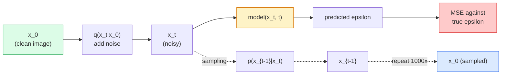

<!-- i18n:manual -->
# Генерация изображений — диффузионные модели

> Диффузионная модель учится убирать шум. Научите её снимать чуть-чуть шума с зашумлённой картинки, повторите это в обратную сторону тысячу раз — и вы получили генератор изображений.

**Type:** Build
**Languages:** Python
**Prerequisites:** Phase 4 Lesson 07 (U-Net), Phase 1 Lesson 06 (Probability), Phase 3 Lesson 06 (Optimizers)
**Time:** ~75 minutes

## Learning Objectives

- Вывести прямой процесс зашумления `x_0 -> x_1 -> ... -> x_T` и объяснить, почему замкнутая формула `q(x_t | x_0)` работает для любого t
- Реализовать обучение в стиле DDPM, где модель предсказывает шум, добавленный на каждом шаге, и sampler, который идёт от чистого шума к изображению
- Собрать U-Net с обусловливанием по времени (достаточно маленький, чтобы обучаться на CPU), предсказывающий шум для любого шага
- Объяснить разницу между сэмплированием DDPM и DDIM и когда что уместно (урок 23 подробно разбирает flow matching и rectified flow)

> 🎒 **На пальцах.** Представьте, что вы учитесь реставрировать старые фотографии. Вам дают снимок, на который кто-то нарочно насыпал песок, и просят сказать, где именно песок. Сделайте это 1000 раз подряд, каждый раз снимая по крупинке, — и из чистого песка проступит фотография, которой никогда не было.

## The Problem

GAN-ы генерируют за один заход: шум на вход, изображение на выход, один прямой проход. Они быстрые и тяжело обучаются. Диффузионные модели генерируют итеративно: старт из чистого шума, снятие шума маленькими шагами, изображение проявляется постепенно. Они медленные и легко обучаются. Последние пять лет второе свойство перевесило: любая маленькая команда может обучить диффузионную модель и получить приличные примеры; обучение GAN — ремесло, которое осваивают годами неудачных запусков.

Кроме устойчивости обучения, важна сама итеративная структура диффузии — именно она открывает всё, что умеет современная генерация картинок: обусловливание текстом, дорисовку (inpainting), редактирование изображений, увеличение разрешения, управляемый стиль. Каждый шаг цикла сэмплирования — это место, куда можно вставить новое ограничение. Из-за этой зацепки Stable Diffusion, Imagen, DALL-E 3, Midjourney и любая управляемая модель изображений, с которой вы столкнётесь, построены на диффузии.

Этот урок собирает минимальный DDPM: прямое зашумление, обратное расшумление, цикл обучения. Следующий урок (Stable Diffusion) встраивает это в рабочую систему с VAE, текстовым энкодером и classifier-free guidance.

> 🎒 **На пальцах.** GAN — это художник, который рисует картину одним движением кисти и либо гений, либо мазила. Диффузия — скульптор, который тысячу раз чуть-чуть подправляет глину. Тысяча шагов дороже одного, зато после любого из них можно сказать «а сделай тут кота», и скульптор послушается.

## The Concept

### The forward process

Возьмите изображение `x_0`. Добавьте капельку гауссова шума — получится `x_1`. Добавьте ещё каплю — `x_2`. Продолжайте T шагов, пока `x_T` не станет почти неотличим от чистого гауссова шума.

```
q(x_t | x_{t-1}) = N(x_t; sqrt(1 - beta_t) * x_{t-1},  beta_t * I)
```

`beta_t` — небольшое расписание дисперсий (noise schedule), обычно линейное от 0.0001 до 0.02 за T=1000 шагов. Каждый шаг слегка ужимает сигнал и подмешивает свежий шум.

> 🎒 **На пальцах.** Это как каждый день добавлять в стакан чая по капле молока. Одна капля почти ничего не меняет, но через 1000 капель в стакане молоко, а не чай. Первый шаг забирает всего 0.005% сигнала (beta = 0.0001), последний — уже 2% (beta = 0.02): порча идёт по нарастающей.

### The closed-form jump

Пошаговое добавление шума — это цепь Маркова, но математика тут складывается: `x_t` можно получить прямо из `x_0` за один шаг.

```
Define alpha_t = 1 - beta_t
Define alpha_bar_t = prod_{s=1..t} alpha_s

Then:
  q(x_t | x_0) = N(x_t; sqrt(alpha_bar_t) * x_0,  (1 - alpha_bar_t) * I)

Equivalently:
  x_t = sqrt(alpha_bar_t) * x_0 + sqrt(1 - alpha_bar_t) * epsilon
  where epsilon ~ N(0, I)
```

Это одно уравнение — вся причина, по которой диффузия практична. Во время обучения вы выбираете случайный `t`, сэмплируете `x_t` напрямую из `x_0` и обучаетесь за один шаг — симулировать всю цепь Маркова не нужно.

> 🎒 **На пальцах.** Без этой формулы, чтобы получить `x_500`, пришлось бы честно прокрутить 500 шагов зашумления для каждой картинки в батче. С ней — одна строка умножения. Для линейного расписания при t=500 остаётся примерно 28% исходного сигнала, при t=1000 — около 0.7%. Экономия: 500 операций против одной.

### The reverse process

Прямой процесс фиксирован. Обратный процесс `p(x_{t-1} | x_t)` — это то, чему учится нейросеть. Диффузионные модели не предсказывают `x_{t-1}` напрямую; они предсказывают шум `epsilon`, добавленный на шаге t, а `x_{t-1}` выводится из него математически.



### The training loss

На каждом шаге обучения:

1. Сэмплируем реальное изображение `x_0`.
2. Сэмплируем шаг `t` равномерно из индексов расписания — в коде это `[0, T-1]`, потому что предвычисленные массивы индексируются с нуля.
3. Сэмплируем шум `epsilon ~ N(0, I)`.
4. Считаем `x_t = sqrt(alpha_bar_t) * x_0 + sqrt(1 - alpha_bar_t) * epsilon`.
5. Предсказываем `epsilon_theta(x_t, t)` сетью.
6. Минимизируем `|| epsilon - epsilon_theta(x_t, t) ||^2`.

Вот и всё. Нейросеть учится предсказывать шум на любом шаге. Функция потерь — MSE. Никакой состязательной игры, никакого коллапса, никаких осцилляций.

> 🎒 **На пальцах.** Шесть строчек — это весь алгоритм обучения. Сравните с GAN, где нужны две сети, две функции потерь и вечная борьба за то, чтобы одна не победила другую. Здесь одна сеть и одна MSE — та самая, которой учат линейную регрессию на первом занятии.

### The sampler (DDPM)

Чтобы сгенерировать: старт из `x_T ~ N(0, I)` и шаг за шагом назад.

```
for t = T, T-1, ..., 1:
    eps = model(x_t, t)
    x_{t-1} = (1 / sqrt(alpha_t)) * (x_t - (beta_t / sqrt(1 - alpha_bar_t)) * eps) + sqrt(beta_t) * z
    where z ~ N(0, I) if t > 1, else 0
return x_0
```

Суть в том, что в общем случае обратное условное распределение не известно в замкнутой форме, но для этого конкретного гауссова прямого процесса — известно. Страшноватые коэффициенты — это то, что даёт формула Байеса.

> 🎒 **На пальцах.** Обратите внимание на `z`: на каждом шаге, кроме последнего, к результату досыпают немного свежего шума. Звучит абсурдно — мы же шум убираем. Но без него все запуски из одного семени сходились бы в одну усреднённую картинку. Именно эта добавка делает 1000 запусков 1000 разными изображениями.

### Why 1000 steps

Расписание прямого шума подобрано так, чтобы каждый шаг добавлял ровно столько шума, что обратный шаг остаётся почти гауссовым. Слишком мало шагов — обратный шаг далёк от гауссова, сеть плохо его моделирует. Слишком много — сэмплирование дорожает, а выигрыш падает. T=1000 с линейным расписанием — значение по умолчанию в DDPM.

### DDIM: 20x faster sampling

Обучение то же самое. Меняется сэмплирование. DDIM (Song et al., 2020) задаёт детерминированный обратный процесс, который пропускает шаги без переобучения. Сэмплирование за 50 шагов через DDIM даёт качество, близкое к 1000 шагам DDPM. Любая продакшен-система использует DDIM или вариант ещё быстрее (DPM-Solver, Euler ancestral).

> 🎒 **На пальцах.** 1000 шагов против 50 — это ровно двадцатикратная разница по времени. Если картинка генерировалась 40 секунд, теперь она генерируется 2. Обучать заново ничего не надо: веса те же, поменялся только цикл, который их вызывает.

### Time conditioning

Сеть `epsilon_theta(x_t, t)` должна знать, какой шаг она расшумляет. Современные диффузионные модели подают `t` через синусоидальные временные эмбеддинги (та же идея, что позиционное кодирование в трансформерах), которые прибавляются к картам признаков на каждом уровне U-Net.

```
t_embedding = sinusoidal(t)
feature_map += MLP(t_embedding)
```

Без обусловливания по времени сети приходится угадывать уровень шума по самой картинке — это работает, но заметно менее эффективно по данным.

> 🎒 **На пальцах.** Представьте врача, которому показывают снимок и не говорят, сколько лет пациенту. Диагноз он поставит, но с возрастом в карточке — точнее и быстрее. Число `t` от 0 до 999 и есть эта карточка: оно говорит сети, насколько сильно испорчена картинка.

```figure
cv-diffusion-image
```

## Build It

### Step 1: Noise schedule

```python
import torch

def linear_beta_schedule(T=1000, beta_start=1e-4, beta_end=2e-2):
    return torch.linspace(beta_start, beta_end, T)


def precompute_schedule(betas):
    alphas = 1.0 - betas
    alphas_cumprod = torch.cumprod(alphas, dim=0)
    return {
        "betas": betas,
        "alphas": alphas,
        "alphas_cumprod": alphas_cumprod,
        "sqrt_alphas_cumprod": torch.sqrt(alphas_cumprod),
        "sqrt_one_minus_alphas_cumprod": torch.sqrt(1.0 - alphas_cumprod),
        "sqrt_recip_alphas": torch.sqrt(1.0 / alphas),
    }

schedule = precompute_schedule(linear_beta_schedule(T=1000))
```

Считаем один раз заранее, а во время обучения и сэмплирования просто берём по индексу.

> 🎒 **На пальцах.** `torch.linspace(1e-4, 2e-2, 1000)` — это 1000 чисел с ровным шагом примерно 0.00002 между соседями. `cumprod` перемножает все `alpha` подряд: получается таблица «сколько исходного сигнала осталось к моменту t». Один раз посчитали — и дальше все 100000 шагов обучения просто читают из неё по индексу, ноль вычислений.

### Step 2: Forward diffusion (q_sample)

```python
def q_sample(x0, t, noise, schedule):
    sqrt_a = schedule["sqrt_alphas_cumprod"][t].view(-1, 1, 1, 1)
    sqrt_one_minus_a = schedule["sqrt_one_minus_alphas_cumprod"][t].view(-1, 1, 1, 1)
    return sqrt_a * x0 + sqrt_one_minus_a * noise
```

Замкнутая форма в одну строку. `t` — батч шагов, по одному на каждое изображение в батче.

> 🎒 **На пальцах.** `.view(-1, 1, 1, 1)` выглядит загадочно, но делает простую вещь: превращает вектор из 32 чисел (по числу картинок в батче) в форму, которую broadcasting растянет на все каналы, строки и столбцы. Каждой картинке — свой коэффициент, каждому её пикселю — тот же самый.

### Step 3: A tiny time-conditioned U-Net

```python
import torch.nn as nn
import torch.nn.functional as F
import math

def timestep_embedding(t, dim=64):
    half = dim // 2
    freqs = torch.exp(-math.log(10000) * torch.arange(half, device=t.device) / half)
    args = t[:, None].float() * freqs[None]
    emb = torch.cat([args.sin(), args.cos()], dim=-1)
    return emb


class TinyUNet(nn.Module):
    def __init__(self, img_channels=3, base=32, t_dim=64):
        super().__init__()
        self.t_mlp = nn.Sequential(
            nn.Linear(t_dim, base * 4),
            nn.SiLU(),
            nn.Linear(base * 4, base * 4),
        )
        self.t_dim = t_dim
        self.enc1 = nn.Conv2d(img_channels, base, 3, padding=1)
        self.enc2 = nn.Conv2d(base, base * 2, 4, stride=2, padding=1)
        self.mid = nn.Conv2d(base * 2, base * 2, 3, padding=1)
        self.dec1 = nn.ConvTranspose2d(base * 2, base, 4, stride=2, padding=1)
        self.dec2 = nn.Conv2d(base * 2, img_channels, 3, padding=1)
        self.time_proj = nn.Linear(base * 4, base * 2)

    def forward(self, x, t):
        t_emb = timestep_embedding(t, self.t_dim)
        t_emb = self.t_mlp(t_emb)
        t_proj = self.time_proj(t_emb)[:, :, None, None]

        h1 = F.silu(self.enc1(x))
        h2 = F.silu(self.enc2(h1)) + t_proj
        h3 = F.silu(self.mid(h2))
        d1 = F.silu(self.dec1(h3))
        d2 = torch.cat([d1, h1], dim=1)
        return self.dec2(d2)
```

Двухуровневый U-Net с обусловливанием по времени, вставленным в узкое место. Для настоящих изображений увеличьте глубину и ширину.

> 🎒 **На пальцах.** Разберём размеры: `base=32`, поэтому `enc1` делает из 3 каналов 32, `enc2` — из 32 сразу 64 и вдвое уменьшает картинку, `dec1` возвращает её к исходному размеру. Строка `torch.cat([d1, h1], dim=1)` — это тот самый skip connection: 32 канала «после сжатия» склеиваются с 32 каналами «до сжатия», получается 64, и мелкие детали не теряются.

### Step 4: Training loop

```python
def train_step(model, x0, schedule, optimizer, device, T=1000):
    model.train()
    x0 = x0.to(device)
    bs = x0.size(0)
    t = torch.randint(0, T, (bs,), device=device)
    noise = torch.randn_like(x0)
    x_t = q_sample(x0, t, noise, schedule)
    pred = model(x_t, t)
    loss = F.mse_loss(pred, noise)
    optimizer.zero_grad()
    loss.backward()
    optimizer.step()
    return loss.item()
```

Это весь цикл обучения. Никакой игры GAN, никакой специальной функции потерь, один вызов MSE.

> 🎒 **На пальцах.** Тринадцать строк — и это полноценный тренировочный шаг диффузионной модели. `torch.randint(0, T, (bs,))` бросает кубик с 1000 граней для каждой картинки в батче: одна учится расшумлять почти чистое изображение, соседняя — почти сплошной шум. За тысячи шагов сеть увидит все уровни примерно поровну.

### Step 5: Sampler (DDPM)

```python
@torch.no_grad()
def sample(model, schedule, shape, T=1000, device="cpu"):
    model.eval()
    x = torch.randn(shape, device=device)
    betas = schedule["betas"].to(device)
    sqrt_one_minus_a = schedule["sqrt_one_minus_alphas_cumprod"].to(device)
    sqrt_recip_alphas = schedule["sqrt_recip_alphas"].to(device)

    for t in reversed(range(T)):
        t_batch = torch.full((shape[0],), t, dtype=torch.long, device=device)
        eps = model(x, t_batch)
        coef = betas[t] / sqrt_one_minus_a[t]
        mean = sqrt_recip_alphas[t] * (x - coef * eps)
        if t > 0:
            x = mean + torch.sqrt(betas[t]) * torch.randn_like(x)
        else:
            x = mean
    return x
```

1000 прямых проходов, чтобы получить один батч примеров. В реальном коде вы бы заменили это на DDIM-sampler на 50 шагов.

> 🎒 **На пальцах.** Считаем цену: 1000 проходов на батч. Если один проход на CPU занимает 20 мс, генерация займёт 20 секунд — и это для крошечной сети. Отсюда и вся индустрия ускоренных sampler-ов: люди не готовы ждать полминуты ради одной картинки.

### Step 6: DDIM sampler (deterministic, ~20x faster)

```python
@torch.no_grad()
def sample_ddim(model, schedule, shape, steps=50, T=1000, device="cpu", eta=0.0):
    model.eval()
    x = torch.randn(shape, device=device)
    alphas_cumprod = schedule["alphas_cumprod"].to(device)

    # последний элемент — -1, шаг «чистой картинки», где alpha_bar = 1
    ts = torch.linspace(T - 1, 0, steps).long().tolist() + [-1]
    for i in range(steps):
        t = ts[i]
        t_prev = ts[i + 1]
        t_batch = torch.full((shape[0],), t, dtype=torch.long, device=device)
        eps = model(x, t_batch)
        a_t = alphas_cumprod[t]
        a_prev = alphas_cumprod[t_prev] if t_prev >= 0 else torch.tensor(1.0, device=device)
        x0_pred = (x - torch.sqrt(1 - a_t) * eps) / torch.sqrt(a_t)
        sigma = eta * torch.sqrt((1 - a_prev) / (1 - a_t) * (1 - a_t / a_prev))
        dir_xt = torch.sqrt(1 - a_prev - sigma ** 2) * eps
        noise = sigma * torch.randn_like(x) if eta > 0 else 0
        x = torch.sqrt(a_prev) * x0_pred + dir_xt + noise
    return x
```

`eta=0` полностью детерминирован (один и тот же входной шум всегда даёт один и тот же результат). `eta=1` возвращает DDPM. Замыкающая `-1` в `ts` важна: последний шаг должен попасть в `alpha_bar = 1` (полностью чистая картинка), а не в `alphas_cumprod[0]`, где ещё сидит шум одного шага.

> 🎒 **На пальцах.** `torch.linspace(T - 1, 0, steps)` при `steps=50` строит лесенку 999, 978, 958 … 20, 0 — то есть шагает через каждые ~20 шагов расписания вместо каждого. К этому списку вручную приписывают `-1`: это не индекс расписания, а метка «дальше уже чистая картинка», по которой строка с `if t_prev >= 0` подставляет `a_prev = 1` вместо чтения из таблицы. Подставьте `a_prev = 1` в формулы и увидите, почему это важно: `sigma` обнуляется (в ней множитель `1 - a_prev`), `dir_xt` тоже, и последний шаг отдаёт ровно `x0_pred` — чистое предсказание картинки. Без `-1` цикл упирался бы в `alphas_cumprod[0] ≈ 0.9999`, то есть `x = 0.99995 * x0_pred + 0.01 * eps`, и на выходе оставался бы едва заметный шум последнего шага. Детерминированность из `eta=0` — это то, почему в веб-интерфейсах есть поле seed: одно и то же число даёт побайтово ту же картинку.

## Use It

Для продакшена используйте `diffusers`:

```python
from diffusers import DDPMScheduler, UNet2DModel

unet = UNet2DModel(sample_size=32, in_channels=3, out_channels=3, layers_per_block=2)
scheduler = DDPMScheduler(num_train_timesteps=1000)
```

Библиотека даёт готовые scheduler-ы (DDPM, DDIM, DPM-Solver, Euler, Heun), настраиваемые U-Net, пайплайны text-to-image и image-to-image, а также помощники для дообучения через LoRA.

Для исследований у `k-diffusion` (Katherine Crowson) самые точные референсные реализации и лучшие варианты сэмплирования.

> 🎒 **На пальцах.** `UNet2DModel(sample_size=32, layers_per_block=2)` — это ваш TinyUNet, только выросший: вместо двух уровней несколько, вместо одной свёртки на уровень — две. Идея та же самая, отличается количество деталей.

## Ship It

Этот урок производит:

- `outputs/prompt-diffusion-sampler-picker.md` — промпт, который выбирает DDPM / DDIM / DPM-Solver / Euler исходя из целевого качества, бюджета по задержке и типа обусловливания.
- `outputs/skill-noise-schedule-designer.md` — навык, который строит линейное, косинусное или сигмоидальное расписание beta по заданным T и целевому уровню порчи, плюс диагностические графики отношения сигнал/шум по времени.

## Exercises

1. **(Easy)** Визуализируйте прямой процесс: возьмите одно изображение и постройте `x_t` при `t in [0, 100, 250, 500, 750, 1000]`. Убедитесь, что `x_1000` выглядит как чистый гауссов шум.
2. **(Medium)** Обучите TinyUNet на синтетическом наборе с кругами в течение 20 эпох и сгенерируйте 16 кругов. Сравните сэмплирование DDPM (1000 шагов) и DDIM (50 шагов) — дают ли они похожие изображения из одного и того же семени шума?
3. **(Hard)** Реализуйте косинусное расписание шума (Nichol & Dhariwal, 2021): `alpha_bar_t = cos^2((t/T + s) / (1 + s) * pi / 2)`. Обучите одну и ту же модель с линейным и косинусным расписаниями и покажите, что косинусное даёт лучшие примеры при малом числе шагов.

> 🎒 **На пальцах.** Подсказка к первому заданию: считать всю цепь не надо, используйте `q_sample` с готовым расписанием. При t=0 картинка останется исходной, при t=250 будет ещё узнаваемой (сигнала около 55%), при t=500 — на грани, при t=1000 — снег. Постройте эти шесть картинок в ряд, и вы увидите весь прямой процесс на одной строчке.

## Key Terms

| Term | What people say | What it actually means |
|------|----------------|----------------------|
| Forward process | «Добавляем шум со временем» | Фиксированная цепь Маркова, которая за T шагов портит изображение до гауссова шума |
| Reverse process | «Убираем шум шаг за шагом» | Выученное распределение, которое идёт обратно от шума к изображению |
| Epsilon prediction | «Предсказать шум» | Цель обучения: `epsilon_theta(x_t, t)` предсказывает шум, добавленный на шаге t |
| Beta schedule | «Сколько шума» | Последовательность из T маленьких дисперсий, задающая, сколько шума входит на каждом шаге |
| alpha_bar_t | «Накопленный коэффициент сохранения» | Произведение (1 - beta_s) до момента t; чем больше t, тем меньше сигнала осталось |
| DDPM sampler | «Стохастический, по цепи» | Сэмплирует каждый x_{t-1} из его условного гауссова распределения; 1000 шагов |
| DDIM sampler | «Детерминированный, быстрый» | Переписывает сэмплирование как детерминированное ОДУ; 20-100 шагов при похожем качестве |
| Time conditioning | «Сказать модели, какой t» | Синусоидальный эмбеддинг t, вставленный в U-Net, чтобы сеть знала уровень шума |

## Further Reading

- [Denoising Diffusion Probabilistic Models (Ho et al., 2020)](https://arxiv.org/abs/2006.11239) — статья, которая сделала диффузию практичной и обошла GAN по FID
- [Improved DDPM (Nichol & Dhariwal, 2021)](https://arxiv.org/abs/2102.09672) — косинусное расписание и v-параметризация
- [DDIM (Song, Meng, Ermon, 2020)](https://arxiv.org/abs/2010.02502) — детерминированный sampler, сделавший инференс в реальном времени возможным
- [Elucidating the Design Space of Diffusion (Karras et al., 2022)](https://arxiv.org/abs/2206.00364) — единый взгляд на все проектные решения в диффузии; лучший справочник на сегодня
