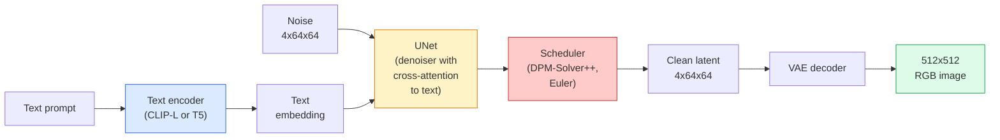

<!-- i18n:manual -->
# Stable Diffusion — архитектура и дообучение

> Stable Diffusion — это DDPM, работающий в latent space предобученной VAE, обусловленный текстом через cross-attention, сэмплируемый быстрым детерминированным решателем ОДУ и направляемый classifier-free guidance.

**Type:** Learn + Use
**Languages:** Python
**Prerequisites:** Phase 4 Lesson 10 (Diffusion), Phase 7 Lesson 02 (Self-Attention)
**Time:** ~75 minutes

## Learning Objectives

- Проследить пять частей пайплайна Stable Diffusion: VAE, текстовый энкодер, U-Net, scheduler, safety checker — и понять, что каждая из них на самом деле делает
- Объяснить latent diffusion и почему обучение в latent space 4x64x64 (вместо изображения 3x512x512) сокращает вычисления в 48 раз без потери качества
- Использовать `diffusers` для генерации изображений, image-to-image, inpainting и генерации под управлением ControlNet
- Дообучить Stable Diffusion через LoRA на маленьком своём наборе данных и подключить LoRA-адаптер на инференсе

> 🎒 **На пальцах.** Прошлый урок собрал двигатель — DDPM. Этот собирает вокруг него машину: коробку передач (scheduler), руль (текст), кузов (VAE) и тюнинг (LoRA). Всё это — не новая математика, а обвязка вокруг того же «предскажи шум».

## The Problem

Обучать DDPM напрямую на RGB-изображениях 512x512 дорого. Каждый шаг обучения гоняет обратное распространение через U-Net, который видит 3x512x512 = 786 432 входных значения, а сэмплирование требует 50+ прямых проходов через тот же U-Net. На уровне качества Stable Diffusion 1.5 (2022 год) диффузия в пространстве пикселей потребовала бы примерно 256 GPU-месяцев обучения и 10-30 секунд на изображение на потребительской видеокарте.

Трюк, который сделал открытые модели text-to-image практичными, — **latent diffusion** (Rombach et al., CVPR 2022). Обучаем VAE, которая переводит изображение 3x512x512 в латентный тензор 4x64x64 и обратно, а диффузию делаем в этом latent space. Вычисления падают в `(3*512*512)/(4*64*64) = 48x`. Сэмплирование сокращается с десятков секунд до менее чем двух на той же видеокарте.

Почти каждая современная модель генерации изображений — SDXL, SD3, FLUX, HunyuanDiT, Wan-Video — это latent diffusion с вариациями автоэнкодера, шумоподавителя (U-Net или DiT) и текстового обусловливания. Разобравшись со Stable Diffusion, вы разобрались с шаблоном.

> 🎒 **На пальцах.** 786 432 числа против 16 384 — вот вся суть. Это как редактировать не саму фотографию, а её эскиз на клетчатой бумаге: деталей меньше в 48 раз, композиция та же, а в конце эскиз разворачивается обратно в полноразмерную картинку.

## The Concept

### The pipeline



- **VAE** — замороженный автоэнкодер. Энкодер превращает изображение в латенты (нужно для img2img и обучения). Декодер превращает латенты обратно в изображение.
- **Text encoder** — текстовый энкодер CLIP (SD 1.x/2.x), CLIP-L + CLIP-G (SDXL) или T5-XXL (SD3/FLUX). Выдаёт последовательность эмбеддингов токенов.
- **U-Net** — шумоподавитель. Содержит слои cross-attention, которые смотрят из латентов в текстовый эмбеддинг на каждом уровне разрешения.
- **Scheduler** — алгоритм сэмплирования (DDIM, Euler, DPM-Solver++). Выбирает сигмы, подмешивает предсказанный шум обратно в латент.
- **Safety checker** — необязательный фильтр NSFW и запрещённого контента на выходном изображении.

> 🎒 **На пальцах.** Пять деталей — как пять человек на кухне: один переводит заказ на язык поваров (текстовый энкодер), другой готовит (U-Net), третий решает, сколько раз помешать (scheduler), четвёртый раскладывает по тарелкам (VAE-декодер), пятый проверяет, что блюдо съедобно (safety checker). Убрать можно только пятого.

### Classifier-free guidance (CFG)

Обычное текстовое обусловливание учит `epsilon_theta(x_t, t, c)` для каждого промпта `c`. CFG обучает ту же сеть, выкидывая `c` в 10% случаев (заменяя пустым эмбеддингом), и получается одна модель, предсказывающая и условный, и безусловный шум. На инференсе:

```
eps = eps_uncond + w * (eps_cond - eps_uncond)
```

`w` — это guidance scale. `w=0` — безусловно, `w=1` — обычное условное предсказание, `w>1` толкает результат в сторону «сильнее следовать промпту» ценой разнообразия. По умолчанию в SD `w=7.5`.

CFG — причина, по которой text-to-image работает на продакшен-качестве. Без него промпты влияют на результат слабо; с ним они доминируют.

> 🎒 **На пальцах.** Формула — это простая экстраполяция. Модель говорит: «без промпта я бы нарисовал вот это, с промптом — вот это». CFG берёт разницу и умножает её на 7.5, то есть уходит далеко за пределы того, что модель считала нужным. Как если бы вы попросили повара «поострее», а он высыпал в блюдо семь с половиной порций перца.

### Latent space geometry

Четырёхканальный латент VAE — не просто сжатое изображение. Это многообразие, где арифметика примерно соответствует смысловым правкам (и prompt engineering, и интерполяция живут именно здесь) и где diffusion U-Net потратил весь свой бюджет моделирования. Если декодировать случайный латент 4x64x64, получится не случайно выглядящая картинка, а мусор: только определённое подмногообразие латентов декодируется в допустимые изображения.

Два следствия:

1. **Img2img** = закодировать изображение в латент, добавить частичный шум, запустить шумоподавитель, декодировать. Структура изображения выживает, потому что кодирование почти обратимо; содержание меняется под влиянием промпта.
2. **Inpainting** = то же, что img2img, но шумоподавитель обновляет только замаскированные области; незамаскированные остаются на закодированном латенте.

> 🎒 **На пальцах.** Латентное пространство похоже на язык. Из букв можно составить и «кот», и «ъщы» — но только первое что-то значит. Случайные 16 384 числа — это «ъщы»: формально валидный латент, декодируется в цветную кашу.

### The U-Net architecture

U-Net в SD — это большая версия TinyUNet из урока 10 с тремя добавками:

- **Transformer blocks** на каждом пространственном разрешении, содержащие self-attention + cross-attention к текстовому эмбеддингу.
- **Time embedding** через MLP поверх синусоидального кодирования.
- **Skip connections** между энкодером и декодером на совпадающих разрешениях.

Всего параметров в SD 1.5: ~860M. SDXL: ~2.6B. FLUX: ~12B. Рост числа параметров в основном приходится на слои внимания.

> 🎒 **На пальцах.** От 860M к 12B — это в 14 раз больше весов и примерно столько же больше VRAM. SD 1.5 в float16 занимает около 1.7 ГБ и влезает в любую игровую видеокарту; FLUX в том же формате — около 24 ГБ, и это уже отдельная покупка.

### LoRA fine-tuning

Полное дообучение Stable Diffusion требует 20+ ГБ VRAM и обновляет 860M параметров. LoRA (Low-Rank Adaptation) оставляет базовую модель замороженной и вставляет маленькие матрицы низкорангового разложения в слои внимания. LoRA-адаптер для SD обычно весит 10-50 МБ, обучается за 10-60 минут на одной потребительской видеокарте и подключается на инференсе как накладка.

```
Original: W_q : (d_in, d_out)   frozen
LoRA:     W_q + alpha * (A @ B)   where A : (d_in, r), B : (r, d_out)

r is typically 4-32.
```

Через LoRA распространяется почти каждое сообщественное дообучение. На CivitAI и Hugging Face их миллионы.

> 🎒 **На пальцах.** Посчитаем экономию. Матрица внимания 1280x1280 — это 1 638 400 весов. LoRA с r=8 хранит вместо неё две матрицы: 1280x8 и 8x1280, то есть 20 480 чисел — в 80 раз меньше. Отсюда и файлы по 30 МБ вместо 4 ГБ.

### Schedulers you will see

- **DDIM** — детерминированный, ~50 шагов, простой.
- **Euler ancestral** — стохастический, 30-50 шагов, примеры чуть более творческие.
- **DPM-Solver++ 2M Karras** — детерминированный, 20-30 шагов, стандарт для продакшена.
- **LCM / TCD / Turbo** — consistency-модели и дистиллированные варианты; 1-4 шага ценой некоторого качества.

Смена scheduler — это одна строка в `diffusers`, и иногда она чинит проблемы с примерами вообще без переобучения.

> 🎒 **На пальцах.** От DDIM (50 шагов) к DPM-Solver++ (25 шагов) — это вдвое быстрее при том же качестве, бесплатно, одной строкой. От DPM-Solver++ к Turbo (4 шага) — ещё в шесть раз быстрее, но качество уже придётся смотреть глазами.

```figure
cv3-latent-compression
```

## Build It

Этот урок использует `diffusers` от начала до конца, а не пересобирает Stable Diffusion с нуля. Части, которые пришлось бы пересобирать (VAE, текстовый энкодер, U-Net, scheduler), — темы отдельных уроков; здесь цель — свободно владеть продакшен-API.

### Step 1: Text-to-image

```python
import torch
from diffusers import StableDiffusionPipeline

pipe = StableDiffusionPipeline.from_pretrained(
    "runwayml/stable-diffusion-v1-5",
    torch_dtype=torch.float16,
).to("cuda")

image = pipe(
    prompt="a dog riding a skateboard in tokyo, studio ghibli style",
    guidance_scale=7.5,
    num_inference_steps=25,
    generator=torch.Generator("cuda").manual_seed(42),
).images[0]
image.save("dog.png")
```

`float16` вдвое сокращает VRAM без заметной потери качества. `num_inference_steps=25` с DPM-Solver++ по умолчанию соответствует `num_inference_steps=50` с DDIM.

> 🎒 **На пальцах.** `manual_seed(42)` — это гарантия воспроизводимости: тот же промпт с тем же семенем даст ту же картинку хоть завтра. Меняете 42 на 43 — получаете другую собаку на скейтборде при тех же словах.

### Step 2: Swap the scheduler

```python
from diffusers import DPMSolverMultistepScheduler, EulerAncestralDiscreteScheduler

pipe.scheduler = DPMSolverMultistepScheduler.from_config(pipe.scheduler.config)
pipe.scheduler = EulerAncestralDiscreteScheduler.from_config(pipe.scheduler.config)
```

Состояние scheduler развязано с весами U-Net. Обучать можно на DDPM, а сэмплировать любым scheduler.

> 🎒 **На пальцах.** Веса модели — это двигатель, scheduler — маршрут. Двигатель не знает, едете вы по прямой за 25 шагов или петляете за 50. Поэтому эти две строки полностью взаимозаменяемы и ничего не ломают.

### Step 3: Image-to-image

```python
from diffusers import StableDiffusionImg2ImgPipeline
from PIL import Image

img2img = StableDiffusionImg2ImgPipeline.from_pretrained(
    "runwayml/stable-diffusion-v1-5",
    torch_dtype=torch.float16,
).to("cuda")

init_image = Image.open("dog.png").convert("RGB").resize((512, 512))
out = img2img(
    prompt="a dog riding a skateboard, oil painting",
    image=init_image,
    strength=0.6,
    guidance_scale=7.5,
).images[0]
```

`strength` — это сколько шума добавить перед расшумлением (0.0 = без изменений, 1.0 = полная перегенерация). 0.5-0.7 — стандартный диапазон для переноса стиля.

> 🎒 **На пальцах.** `strength=0.6` при 50 шагах означает: пропускаем первые 40% шагов и начинаем с шага 30 из 50, взяв за основу вашу фотографию. Отсюда и логика: при 1.0 стартуем с чистого шума, и от исходника не остаётся ничего.

### Step 4: Inpainting

```python
from diffusers import StableDiffusionInpaintPipeline

inpaint = StableDiffusionInpaintPipeline.from_pretrained(
    "runwayml/stable-diffusion-inpainting",
    torch_dtype=torch.float16,
).to("cuda")

image = Image.open("dog.png").convert("RGB").resize((512, 512))
mask = Image.open("dog_mask.png").convert("L").resize((512, 512))

out = inpaint(
    prompt="a cat",
    image=image,
    mask_image=mask,
    guidance_scale=7.5,
).images[0]
```

Белые пиксели маски — это область, которую нужно перегенерировать. Чёрные сохраняются.

> 🎒 **На пальцах.** Маска `convert("L")` — это чёрно-белая картинка 512x512, где 255 значит «перерисуй», 0 — «не трогай». В латентном пространстве она ужимается до 64x64, поэтому маска работает блоками примерно 8x8 пикселей — тонкие волоски ей не по силам.

### Step 5: LoRA loading

```python
pipe.load_lora_weights("sayakpaul/sd-lora-ghibli")
pipe.fuse_lora(lora_scale=0.8)

image = pipe(prompt="a village square in ghibli style").images[0]
```

`lora_scale` управляет силой; 0.0 = нет эффекта, 1.0 = полный эффект. `fuse_lora` вплавляет адаптер прямо в веса ради скорости, но после этого его нельзя поменять. Вызовите `pipe.unfuse_lora()` перед загрузкой другого адаптера.

> 🎒 **На пальцах.** `lora_scale=0.8` — это ручка громкости стиля. На 0.3 гибли-стиль будет намёком, на 0.8 — явным, на 1.5 (да, можно больше единицы) картинка обычно разваливается. Начинайте с 0.7-0.8 и крутите по вкусу.

### Step 6: LoRA training (sketch)

Настоящее обучение LoRA живёт в `peft` или `diffusers.training`. Общий вид:

```python
# Pseudocode
for step, batch in enumerate(dataloader):
    images, prompts = batch
    latents = vae.encode(images).latent_dist.sample() * 0.18215

    t = torch.randint(0, num_train_timesteps, (batch_size,))
    noise = torch.randn_like(latents)
    noisy_latents = scheduler.add_noise(latents, noise, t)

    text_emb = text_encoder(tokenizer(prompts))

    pred_noise = unet(noisy_latents, t, text_emb)  # LoRA weights injected here

    loss = F.mse_loss(pred_noise, noise)
    loss.backward()
    optimizer.step()
```

Градиент получают только матрицы LoRA; базовый U-Net, VAE и текстовый энкодер заморожены. При batch size 1 и gradient checkpointing это влезает в 8 ГБ VRAM.

> 🎒 **На пальцах.** Обратите внимание на `* 0.18215` — это та самая магическая константа VAE. Сырые латенты выходят из энкодера со «слишком большим» разбросом, и умножение на неё приводит их примерно к единичной дисперсии, как ожидает noise schedule. Забудете её — обучение просто не сойдётся.

## Use It

В продакшене вы реально принимаете такие решения:

- **Model family**: SD 1.5 ради сообщественных дообучений, SDXL ради качества выше, SD3 / FLUX ради состояния искусства и строгих лицензионных требований.
- **Scheduler**: DPM-Solver++ 2M Karras на 20-30 шагов, LCM-LoRA когда задержка должна быть меньше секунды.
- **Precision**: `float16` на 4080/4090, `bfloat16` на A100 и новее, `int8` (через `bitsandbytes` или `compel`), когда VRAM в дефиците.
- **Conditioning**: обычного текста хватает; для более жёсткого контроля добавьте ControlNet (canny, depth, pose) поверх базового пайплайна.

Для пакетной генерации сообщество использует `AUTO1111` / `ComfyUI`; для продакшен-API — `diffusers` + `accelerate` или `optimum-nvidia` с компиляцией TensorRT.

> 🎒 **На пальцах.** Порядок решений именно такой: сначала семейство модели (это выбор качества и лицензии), потом scheduler (это выбор скорости), потом точность (это выбор видеокарты). Менять scheduler дёшево — одна строка; менять семейство модели дорого — все ваши LoRA перестанут подходить.

## Ship It

Этот урок производит:

- `outputs/prompt-sd-pipeline-planner.md` — промпт, который выбирает SD 1.5 / SDXL / SD3 / FLUX плюс scheduler и точность по бюджету задержки, целевой достоверности и лицензионным ограничениям.
- `outputs/skill-lora-training-setup.md` — навык, который пишет полный конфиг обучения LoRA для своего набора данных, включая подписи, ранг, размер батча и learning rate.

## Exercises

1. **(Easy)** Сгенерируйте один и тот же промпт при `guidance_scale` из `[1, 3, 5, 7.5, 10, 15]`. Опишите, как меняется изображение. При каком значении guidance появляются артефакты?
2. **(Medium)** Возьмите любую настоящую фотографию, прогоните её через `StableDiffusionImg2ImgPipeline` при `strength` из `[0.2, 0.4, 0.6, 0.8, 1.0]`. Какая сила сохраняет композицию, меняя стиль? Почему при 1.0 вход игнорируется полностью?
3. **(Hard)** Обучите LoRA на 10-20 изображениях одного объекта (питомец, логотип, персонаж) и сгенерируйте новые сцены с ним. Отчитайтесь, какой ранг LoRA и сколько шагов обучения дали лучшее сохранение личности без переобучения на исходные картинки.

> 🎒 **На пальцах.** Подсказка к первому заданию: фиксируйте seed, иначе вы будете сравнивать разные картинки, а не разное влияние guidance. Ожидаемая картина: на 1 результат размытый и мало связан с промптом, на 7.5 всё в порядке, начиная примерно с 12-15 появляется пережжённый контраст и кислотные цвета — это модель ушла слишком далеко по вектору разницы.

## Key Terms

| Term | What people say | What it actually means |
|------|----------------|----------------------|
| Latent diffusion | «Диффузия в латентах» | Гонять весь DDPM в latent space VAE (4x64x64) вместо пиксельного (3x512x512); экономия вычислений в 48 раз |
| VAE scale factor | «0.18215» | Константа, приводящая сырой латент VAE примерно к единичной дисперсии; зашита в каждый пайплайн SD |
| Classifier-free guidance | «CFG» | Смешивание условного и безусловного предсказаний шума; самая влиятельная ручка на инференсе |
| Scheduler | «Sampler» | Алгоритм, превращающий шум и предсказания модели в траекторию расшумления латента |
| LoRA | «Низкоранговый адаптер» | Маленькие матрицы низкорангового разложения, дообучающие слои внимания, не трогая базовые веса |
| Cross-attention | «Внимание текст-изображение» | Внимание от латентных токенов к текстовым; вносит информацию промпта на каждом уровне U-Net |
| ControlNet | «Обусловливание структурой» | Отдельно обученный адаптер, направляющий SD дополнительным входом (canny, depth, pose, сегментация) |
| DPM-Solver++ | «Scheduler по умолчанию» | Детерминированный решатель ОДУ второго порядка; лучшее качество при малом числе шагов (20-30) в 2026 году |

## Further Reading

- [High-Resolution Image Synthesis with Latent Diffusion (Rombach et al., 2022)](https://arxiv.org/abs/2112.10752) — статья про Stable Diffusion; содержит все абляции, обосновывающие дизайн
- [Classifier-Free Diffusion Guidance (Ho & Salimans, 2022)](https://arxiv.org/abs/2207.12598) — статья про CFG
- [LoRA: Low-Rank Adaptation of Large Language Models (Hu et al., 2021)](https://arxiv.org/abs/2106.09685) — LoRA появилась сначала в NLP; в SD она перенеслась почти без изменений
- [diffusers documentation](https://huggingface.co/docs/diffusers) — справочник по каждому пайплайну SD / SDXL / SD3 / FLUX
