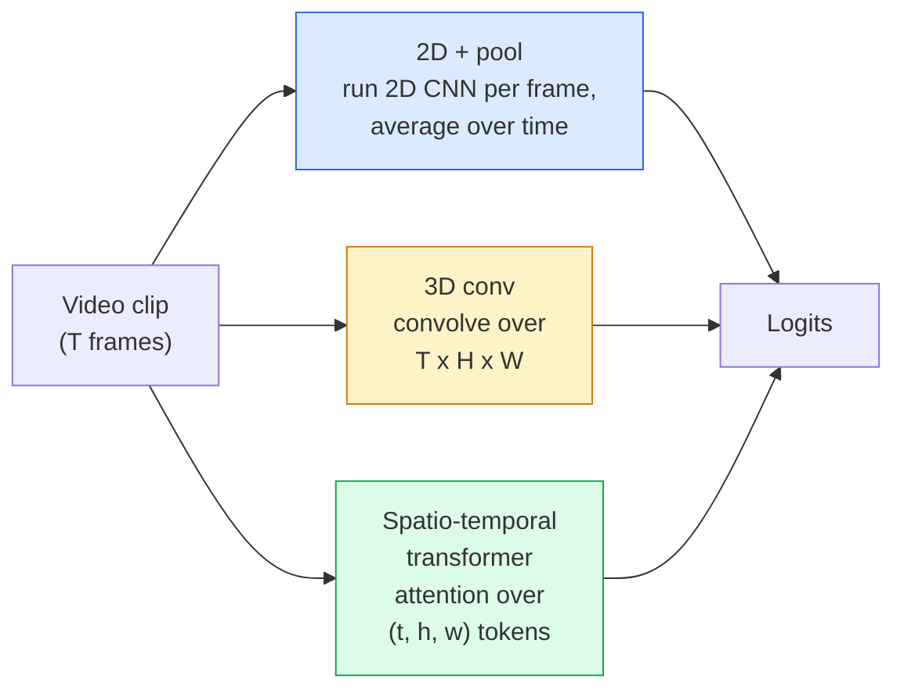

<!-- i18n:manual -->
# Понимание видео — моделирование времени

> Видео — это последовательность изображений плюс физика, которая их связывает. Любая видеомодель либо считает время дополнительной осью (3D-свёртка), либо последовательностью, по которой работает внимание (трансформер), либо признаком, который извлекают один раз и усредняют (2D+pool).

**Type:** Learn + Build
**Languages:** Python
**Prerequisites:** Phase 4 Lesson 03 (CNNs), Phase 4 Lesson 04 (Image Classification)
**Time:** ~45 minutes

## Learning Objectives

- Различать три основных подхода к моделированию видео (2D+pool, 3D-свёртка, пространственно-временной трансформер) и предсказывать их компромиссы по цене и точности
- Реализовать в PyTorch выборку кадров, временной пулинг и базовый классификатор 2D+pool
- Объяснить, почему «раздутые» 3D-ядра из I3D хорошо переносят веса ImageNet и чем от них отличается факторизованная (2+1)D-свёртка
- Читать стандартные наборы данных и метрики распознавания действий: Kinetics-400/600, UCF101, Something-Something V2; top-1 accuracy на уровне клипа и на уровне видео

> 🎒 **На пальцах.** Картинка отвечает на вопрос «что на ней», видео — на вопрос «что происходит». Разница в одном слове, но из-за неё 30-секундный ролик при 30 кадрах в секунду превращается в 900 картинок, и весь урок про то, как не обрабатывать все 900.

## The Problem

Тридцатисекундное видео при 30 кадрах в секунду — это 900 изображений. Наивно классификация видео — это классификация изображений, запущенная 900 раз, плюс какая-то агрегация. Это работает, когда действие видно почти на каждом кадре (спорт, готовка, ролики с упражнениями), и сильно проваливается, когда действие определяется самим движением: «двигаю предмет слева направо» на каждом отдельном кадре выглядит как два неподвижных объекта.

Главный вопрос для любой видеоархитектуры: когда моделируется временная структура и как? Ответ тянет за собой всё остальное — стоимость вычислений, стратегию предобучения, возможность переиспользовать веса ImageNet, наборы данных, на которых модель учится.

Этот урок намеренно короче уроков про статичные изображения. Основная машинерия для картинок уже собрана, а понимание видео — это в основном история про время: выборка, моделирование, агрегация.

> 🎒 **На пальцах.** Проверьте себя на паре «открыть дверь» и «закрыть дверь». Наберите 8 случайных кадров из каждого ролика, перемешайте их — и вы не отличите одно от другого. Информация здесь не в кадрах, а в их порядке, и модель, которая усредняет кадры, эту информацию выбрасывает целиком.

## The Concept

### The three architectural families



> 🎒 **На пальцах.** Три семейства — три ответа на вопрос «где живёт время». В 2D+pool время живёт в усреднении в самом конце (то есть почти не живёт). В 3D-свёртке — внутри каждого ядра. В трансформере — в матрице внимания, где каждый патч видит любой другой патч из любого кадра.

### 2D + pool

Берём 2D CNN (ResNet, EfficientNet, ViT). Запускаем её независимо на каждом выбранном кадре. Усредняем (или берём max-pool, или attention-pool) покадровые эмбеддинги. Подаём усреднённый вектор в классификатор.

Плюсы:
- Предобучение на ImageNet переносится напрямую.
- Проще всего реализовать.
- Дёшево: T кадров * стоимость инференса одной картинки.

Минусы:
- Не может моделировать движение. Действие = сумма внешних видов.
- Временной пулинг не зависит от порядка; «открыть дверь» и «закрыть дверь» выглядят одинаково.

Когда использовать: задачи, где решает внешний вид, transfer learning на маленьких видеонаборах, первые бейзлайны.

> 🎒 **На пальцах.** Усреднение по времени — операция, для которой порядок слагаемых не важен: (a+b+c)/3 = (c+a+b)/3. Это математический факт, а не недоработка реализации. Именно поэтому 2D+pool физически не способен отличить прямое движение от обратного.

### 3D convolutions

Заменяем 2D-ядра (H, W) на 3D-ядра (T, H, W). Сеть свёртывает и по пространству, и по времени. Раннее семейство: C3D, I3D, SlowFast.

Трюк I3D: берём предобученную 2D-модель ImageNet и «раздуваем» каждое 2D-ядро, копируя его вдоль новой временной оси. Свёртка 3x3 становится свёрткой 3x3x3. Так 3D-модель получает сильные предобученные веса вместо обучения с нуля.

Плюсы:
- Напрямую моделирует движение.
- Раздувание I3D даёт transfer learning бесплатно.

Минусы:
- Примерно в 3 раза больше FLOPs, чем у 2D-аналога на тех же T кадрах: временное ядро размера 3 умножает стоимость каждой свёртки на 3.
- Временные ядра маленькие; для движения на большом промежутке нужна пирамида или двухпоточный подход.

Когда использовать: распознавание действий, где сигнал именно в движении (Something-Something V2, классы Kinetics с активным движением).

> 🎒 **На пальцах.** Раздувание — это буквально копипаст весов. Ядро 3x3 из 9 чисел превращается в 3x3x3 из 27 чисел: те же 9 повторены трижды. Сеть на первом же проходе видит примерно то же, что видела 2D-модель, и дальше просто дообучает разницу.

### Spatio-temporal transformers

Разбиваем видео на сетку пространственно-временных патчей и применяем внимание по всем ним. TimeSformer, ViViT, Video Swin, VideoMAE.

Важные схемы внимания:
- **Joint** — одно большое внимание по (t, h, w). Квадратично по `T*H*W`; дорого.
- **Divided** — два внимания в блоке: одно по времени, одно по пространству. Масштабируется почти линейно.
- **Factorised** — внимание по времени чередуется с вниманием по пространству между блоками.

Плюсы:
- SOTA-точность на каждом крупном бенчмарке.
- Переносится из картиночных трансформеров (ViT) через раздувание патчей.
- Поддерживает длинный контекст через разреженное внимание.

Минусы:
- Прожорлив по вычислениям.
- Требует аккуратного выбора схемы внимания, иначе время работы разлетается.

Когда использовать: большие наборы данных, понимание видео высокой точности, мультимодальные задачи видео+текст.

> 🎒 **На пальцах.** Посчитаем, почему joint дорого. При T=8, H=W=14 патчей получается 8*14*14 = 1568 токенов, и матрица внимания — 1568² ≈ 2.5 млн элементов. Divided считает сначала 8² по времени, потом 196² по пространству для каждого токена: суммарно на порядок меньше при почти том же качестве.

### Frame sampling

Десятисекундный клип при 30 кадрах в секунду — это 300 кадров; подавать все 300 в любую модель расточительно. Стандартные стратегии:

- **Uniform sampling** — берём T кадров равномерно по всему клипу. По умолчанию для 2D+pool.
- **Dense sampling** — случайное непрерывное окно из T кадров. Обычно для 3D-свёрток, потому что движению нужны соседние кадры.
- **Multi-clip** — берём несколько окон по T кадров из одного видео, классифицируем каждое, усредняем предсказания на тесте.

T обычно равно 8, 16, 32 или 64. Больше T = больше временного сигнала при большей стоимости.

> 🎒 **На пальцах.** Из 300 кадров при T=8 вы берёте каждый 37-й — это примерно один кадр в 1.25 секунды. Для «человек играет на гитаре» такой разреженной выборки хватит с запасом. Для «человек хлопнул в ладоши» вы просто промахнётесь мимо хлопка, и здесь нужен dense sampling с подряд идущими кадрами.

### Evaluation

Два уровня:
- **Clip-level accuracy** — модель видит один клип из T кадров, выдаёт top-k.
- **Video-level accuracy** — усредняем предсказания по нескольким клипам одного видео; выше и стабильнее.

Всегда отчитывайтесь по обоим. Модель с 78% на клипах и 82% на видео сильно опирается на усреднение при тестировании; модель с 80% / 81% устойчивее на каждом клипе.

> 🎒 **На пальцах.** Разрыв 78 → 82 означает, что четыре процентных пункта модель получила не от понимания, а от того, что ей дали посмотреть ролик несколько раз. В продакшене, где обычно есть время только на один клип, вы получите 78, а не 82. Разрыв 80 → 81 честнее.

### Datasets you will meet

- **Kinetics-400 / 600 / 700** — универсальный набор действий. 400 тыс. клипов; ссылки на YouTube (многие уже мертвы).
- **Something-Something V2** — действия, определяемые движением («двигаю X слева направо»). Не решается через 2D+pool.
- **UCF-101**, **HMDB-51** — старее, меньше, но всё ещё встречаются в отчётах.
- **AVA** — *локализация* действий в пространстве и времени; сложнее классификации.

> 🎒 **На пальцах.** Something-Something V2 — это специально построенная ловушка для 2D+pool: все классы там симметричны по времени и различимы только порядком кадров. Если ваша модель даёт на Kinetics 70%, а на SSv2 около случайного угадывания, диагноз очевиден — движение она не видит вообще.

```figure
v4-video-temporal
```

## Build It

### Step 1: Frame sampler

Равномерный и плотный samplers, работающие со списком кадров (или тензором видео).

```python
import numpy as np

def sample_uniform(num_frames_total, T):
    if num_frames_total <= T:
        return list(range(num_frames_total)) + [num_frames_total - 1] * (T - num_frames_total)
    step = num_frames_total / T
    return [int(i * step) for i in range(T)]


def sample_dense(num_frames_total, T, rng=None):
    rng = rng or np.random.default_rng()
    if num_frames_total <= T:
        return list(range(num_frames_total)) + [num_frames_total - 1] * (T - num_frames_total)
    start = int(rng.integers(0, num_frames_total - T + 1))
    return list(range(start, start + T))
```

Оба возвращают `T` индексов, которыми вы нарезаете тензор видео.

> 🎒 **На пальцах.** Разберём `step = num_frames_total / T`. При 300 кадрах и T=8 шаг равен 37.5, поэтому индексы получаются 0, 37, 75, 112, 150, 187, 225, 262 — ровно восемь и последний не выходит за границу. А ветка `if num_frames_total <= T` спасает короткие клипы: недостающие места добиваются повтором последнего кадра.

### Step 2: A 2D+pool baseline

Прогоняем 2D ResNet-18 по каждому кадру, усредняем признаки, классифицируем.

```python
import torch
import torch.nn as nn
from torchvision.models import resnet18, ResNet18_Weights

class FramePool(nn.Module):
    def __init__(self, num_classes=400, pretrained=True):
        super().__init__()
        weights = ResNet18_Weights.IMAGENET1K_V1 if pretrained else None
        backbone = resnet18(weights=weights)
        self.features = nn.Sequential(*(list(backbone.children())[:-1]))  # global avg pool kept
        self.head = nn.Linear(512, num_classes)

    def forward(self, x):
        # x: (N, T, 3, H, W)
        N, T = x.shape[:2]
        x = x.view(N * T, *x.shape[2:])
        feats = self.features(x).view(N, T, -1)
        pooled = feats.mean(dim=1)
        return self.head(pooled)

model = FramePool(num_classes=10)
x = torch.randn(2, 8, 3, 224, 224)
print(f"output: {model(x).shape}")
print(f"params: {sum(p.numel() for p in model.parameters()):,}")
```

Одиннадцать миллионов параметров, предобучение на ImageNet, работа по кадрам, усреднение, классификация. Этот бейзлайн часто отстаёт от честных 3D-моделей всего на 5-10 пунктов в задачах, где решает внешний вид, — а иногда и выигрывает, потому что переиспользует более сильный ImageNet-бэкбон.

> 🎒 **На пальцах.** Обратите внимание на `x.view(N * T, ...)`: батч из 2 видео по 8 кадров превращается в обычный батч из 16 картинок. ResNet вообще не подозревает, что перед ним видео. Всё «понимание времени» здесь — это одна строка `feats.mean(dim=1)`, которая усредняет 8 векторов по 512 чисел в один.

### Step 3: An I3D-style inflated 3D conv

Превращаем одну 2D-свёртку в 3D-свёртку, повторяя веса вдоль новой временной оси.

```python
def inflate_2d_to_3d(conv2d, time_kernel=3):
    out_c, in_c, kh, kw = conv2d.weight.shape
    weight_3d = conv2d.weight.data.unsqueeze(2)  # (out, in, 1, kh, kw)
    weight_3d = weight_3d.repeat(1, 1, time_kernel, 1, 1) / time_kernel
    conv3d = nn.Conv3d(in_c, out_c, kernel_size=(time_kernel, kh, kw),
                        padding=(time_kernel // 2, conv2d.padding[0], conv2d.padding[1]),
                        stride=(1, conv2d.stride[0], conv2d.stride[1]),
                        bias=False)
    conv3d.weight.data = weight_3d
    return conv3d

conv2d = nn.Conv2d(3, 64, kernel_size=3, padding=1, bias=False)
conv3d = inflate_2d_to_3d(conv2d, time_kernel=3)
print(f"2D weight shape:  {tuple(conv2d.weight.shape)}")
print(f"3D weight shape:  {tuple(conv3d.weight.shape)}")
x = torch.randn(1, 3, 8, 56, 56)
print(f"3D output shape:  {tuple(conv3d(x).shape)}")
```

Деление на `time_kernel` держит величину активаций примерно постоянной — это важно, чтобы на первом же проходе не сломать статистики batch-norm.

> 🎒 **На пальцах.** Почему делим на 3: раздутое ядро суммирует по трём кадрам вместо одного, и без деления выход был бы втрое больше по величине. Проверка на числах: форма весов была (64, 3, 3, 3), стала (64, 3, 3, 3, 3) — параметров ровно втрое больше, а типичное значение активации осталось тем же.

### Step 4: Factorised (2+1)D conv

Разделяем 3D-свёртку на 2D (пространственную) и 1D (временную). Та же рецептивная область, меньше параметров, лучше точность на части бенчмарков.

```python
class Conv2Plus1D(nn.Module):
    def __init__(self, in_c, out_c, kernel_size=3):
        super().__init__()
        mid_c = (in_c * out_c * kernel_size * kernel_size * kernel_size) \
                // (in_c * kernel_size * kernel_size + out_c * kernel_size)
        self.spatial = nn.Conv3d(in_c, mid_c, kernel_size=(1, kernel_size, kernel_size),
                                 padding=(0, kernel_size // 2, kernel_size // 2), bias=False)
        self.bn = nn.BatchNorm3d(mid_c)
        self.act = nn.ReLU(inplace=True)
        self.temporal = nn.Conv3d(mid_c, out_c, kernel_size=(kernel_size, 1, 1),
                                  padding=(kernel_size // 2, 0, 0), bias=False)

    def forward(self, x):
        return self.temporal(self.act(self.bn(self.spatial(x))))

c = Conv2Plus1D(3, 64)
x = torch.randn(1, 3, 8, 56, 56)
print(f"(2+1)D output: {tuple(c(x).shape)}")
```

Полная сеть R(2+1)D — это тот же ResNet-18, где каждая свёртка 3x3 заменена на `Conv2Plus1D`.

> 🎒 **На пальцах.** Формула для `mid_c` выглядит страшно, но она подбирает промежуточное число каналов так, чтобы параметров вышло примерно столько же, сколько у честной 3D-свёртки. Для `in_c=3, out_c=64, kernel_size=3` она даёт mid_c = 23. Бонусом между пространственной и временной частями появляется лишний ReLU — дополнительная нелинейность бесплатно.

## Use It

Продакшен-работу с видео закрывают две библиотеки:

- `torchvision.models.video` — R(2+1)D, MViT, Swin3D с предобученными на Kinetics весами. API тот же, что у картиночных моделей.
- `pytorchvideo` (Meta) — зоопарк моделей, загрузчики данных для Kinetics / SSv2 / AVA, стандартные преобразования.

Для видео-языковых моделей (описание видео, вопросы по видео) используйте `transformers` (`VideoMAE`, `VideoLLaMA`, `InternVideo`).

> 🎒 **На пальцах.** Правило выбора простое: если задача — классифицировать действие, берите готовые веса Kinetics из `torchvision` и дообучайте голову. Писать свой R(2+1)D с нуля имеет смысл ровно один раз — чтобы понять, как он устроен, что вы и сделали на шаге 4.

## Ship It

Этот урок производит:

- `outputs/prompt-video-architecture-picker.md` — промпт, который выбирает 2D+pool / I3D / (2+1)D / трансформер по соотношению «внешний вид против движения», размеру набора данных и бюджету вычислений.
- `outputs/skill-frame-sampler-auditor.md` — навык, который проверяет sampler в видеопайплайне и отмечает типовые баги: сдвиг индекса на единицу, неравномерная выборка при `num_frames < T`, отсутствие кропа с сохранением пропорций и так далее.

## Exercises

1. **(Easy)** Посчитайте FLOPs (приблизительно) для FramePool при T=8 и для 3D ResNet в стиле I3D при T=8. Обоснуйте, почему 2D+pool в 3-5 раз дешевле.
2. **(Medium)** Сгенерируйте синтетический видеонабор: случайные шарики, движущиеся в случайных направлениях, с метками по направлению движения («слева направо», «справа налево», «по диагонали вверх»). Обучите на нём FramePool. Покажите, что точность близка к случайной, — это доказывает, что одного внешнего вида для задач про движение недостаточно.
3. **(Hard)** Соберите R(2+1)D-18, заменив каждый Conv2d в ResNet-18 на `Conv2Plus1D`. Раздуйте веса первой свёртки из предобученного на ImageNet ResNet-18. Обучите на наборе про движение из задания 2 и обойдите FramePool.

> 🎒 **На пальцах.** Подсказка ко второму заданию: при трёх классах случайное угадывание — это 33%, и именно около этой цифры застрянет FramePool, сколько бы эпох вы ни ждали. Не считайте это багом обучения. Возьмите те же кадры, переверните порядок и подайте снова — модель выдаст ровно тот же ответ, потому что усреднение слепо к порядку.

## Key Terms

| Term | What people say | What it actually means |
|------|----------------|----------------------|
| 2D + pool | «Покадровый классификатор» | Запустить 2D CNN на каждом выбранном кадре, усреднить признаки по времени, классифицировать |
| 3D convolution | «Пространственно-временное ядро» | Ядро, свёртывающее по (T, H, W); умеет моделировать движение напрямую |
| Inflation | «Поднять 2D-веса до 3D» | Инициализировать веса 3D-свёртки повтором весов 2D-свёртки вдоль новой временной оси и поделить на kernel_T, чтобы сохранить масштаб активаций |
| (2+1)D | «Факторизованная свёртка» | Разделить 3D на 2D пространственную + 1D временную; меньше параметров, дополнительная нелинейность между ними |
| Divided attention | «Сначала время, потом пространство» | Блок трансформера с двумя вниманиями на слой: одно по токенам одного кадра, другое по токенам одной позиции |
| Clip | «Окно из T кадров» | Выбранная подпоследовательность из T кадров; единица, которую потребляет видеомодель |
| Clip vs video accuracy | «Два режима оценки» | Клип = один образец на видео, видео = усреднение по нескольким выбранным клипам |
| Kinetics | «ImageNet для видео» | 400-700 классов действий, 300 тыс.+ клипов с YouTube, стандартный корпус для предобучения на видео |

## Further Reading

- [I3D: Quo Vadis, Action Recognition (Carreira & Zisserman, 2017)](https://arxiv.org/abs/1705.07750) — вводит раздувание ядер и набор данных Kinetics
- [R(2+1)D: A Closer Look at Spatiotemporal Convolutions (Tran et al., 2018)](https://arxiv.org/abs/1711.11248) — факторизованная свёртка, до сих пор сильный бейзлайн
- [TimeSformer: Is Space-Time Attention All You Need? (Bertasius et al., 2021)](https://arxiv.org/abs/2102.05095) — первый сильный видеотрансформер
- [VideoMAE (Tong et al., 2022)](https://arxiv.org/abs/2203.12602) — предобучение маскированным автоэнкодером для видео; сейчас доминирующий рецепт предобучения
