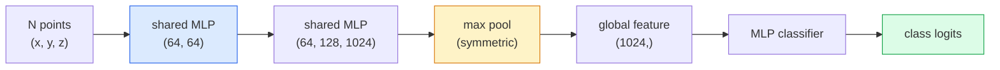

<!-- i18n:manual -->
# 3D-зрение — облака точек и NeRF

> 3D-зрение бывает двух видов. Облако точек — это сырой выход сенсора. NeRF — это выученное объёмное поле. Оба отвечают на вопрос «что и где находится в пространстве».

**Type:** Learn + Build
**Languages:** Python
**Prerequisites:** Phase 4 Lesson 03 (CNNs), Phase 1 Lesson 12 (Tensor Operations)
**Time:** ~45 minutes

## Learning Objectives

- Различать явные (облако точек, меш, воксели) и неявные (signed distance field, NeRF) 3D-представления и понимать, где какое нужно
- Понять приём PointNet с симметричной функцией, который делает нейросеть инвариантной к порядку точек в неупорядоченном множестве
- Проследить прямой проход NeRF: ray marching, volume rendering, positional encoding, MLP с головами плотности и цвета
- Использовать `nerfstudio` или `instant-ngp` для готовой 3D-реконструкции по небольшому набору снимков с известными позами камеры

> 🎒 **На пальцах.** Весь урок сводится к двум способам хранить сцену. Первый — список координат: «вот 1024 точки, у каждой x, y, z». Второй — нейросеть весом пара мегабайт, которой вы задаёте вопрос «а что находится вот в этой точке пространства?». Второй способ и есть NeRF.

## The Problem

Камера выдаёт 2D-картинку. LIDAR выдаёт набор 3D-точек без всякого порядка. Пайплайн structure-from-motion выдаёт разреженное облако 3D-ключевых точек. NeRF восстанавливает целую 3D-сцену по горстке снимков с известными позами камеры. Всё это «зрение», но ничто из этого не похоже на плотный тензор, которого ждёт CNN.

3D-зрение важно, потому что почти любая дорогая задача робота живёт в 3D: захват предмета, объезд препятствий, навигация, перекрытия в AR, съёмка 3D-контента. Инженер, который понимает только 2D-картинки, отрезан от самой быстрорастущей части области (контент для AR/VR, робототехника, стеки автономного вождения, NeRF-реконструкция для недвижимости и стройки).

Два представления доминируют по разным причинам. Облака точек — это то, что сенсоры отдают бесплатно. NeRF и его наследники (3D Gaussian splatting, нейронные SDF) — это то, что получается, когда сцену просят выучить нейросеть.

> 🎒 **На пальцах.** Разница как между фотографией комнаты и планом комнаты. Фотография (2D-тензор) годится, чтобы сказать «здесь стул». План (3D) нужен, чтобы робот дотянулся до стула рукой и не снёс по дороге стол. Промышленный LIDAR отдаёт порядка 100 000 точек за один оборот — и ни одного пикселя.

## The Concept

### Point clouds

Облако точек — это неупорядоченное множество из N точек в R^3, у каждой опционально есть признаки (цвет, интенсивность, нормаль).

```
cloud = [
  (x1, y1, z1, r1, g1, b1),
  (x2, y2, z2, r2, g2, b2),
  ...
  (xN, yN, zN, rN, gN, bN),
]
```

Ни сетки, ни связности. Два свойства делают это тяжёлым для нейросетей:

- **Permutation invariance** — выход не должен зависеть от порядка точек.
- **Variable N** — одна модель обязана работать с облаками разного размера.

PointNet (Qi et al., 2017) решил обе задачи одной идеей: прогнать общий MLP через каждую точку, а потом свернуть всё симметричной функцией (max pool). Получается вектор фиксированного размера, который не зависит от порядка.

```
f(P) = max_{p in P} MLP(p)
```

Это и есть всё ядро PointNet. Более глубокие варианты (PointNet++, Point Transformer) добавляют иерархическое сэмплирование и локальную агрегацию, но приём с симметричной функцией остаётся тем же.

> 🎒 **На пальцах.** Max pool не помнит порядок так же, как оценка «максимальная температура за неделю» не помнит, в какой день было жарче всего. Переставьте 1024 точки облака как угодно — максимум по каждому из 1024 каналов останется прежним, а значит и ответ сети не изменится.

### The PointNet architecture



«Общий MLP» означает, что один и тот же MLP применяется к каждой точке независимо. Ради скорости его реализуют как свёртку 1x1 вдоль измерения точек.

> 🎒 **На пальцах.** Схема читается слева направо как конвейер: 1024 точки по 3 числа каждая превращаются в 1024 вектора по 1024 числа, а max pool сжимает их в один вектор длиной 1024. То есть 1024 × 3 = 3072 входных числа ужимаются до 1024 — и по ним уже выбирается класс объекта.

### Neural Radiance Fields (NeRFs)

NeRF (Mildenhall et al., 2020) взял вопрос «можно ли восстановить 3D-сцену по N фотографиям?» и ответил на него нейросетью, которая и есть сцена. Сеть отображает `(x, y, z, viewing_direction)` в `(density, colour)`. Рендер нового ракурса — это цикл ray marching по этой сети.

```
NeRF MLP:  (x, y, z, theta, phi) -> (sigma, r, g, b)

To render a pixel (u, v) of a new view:
  1. Cast a ray from the camera through pixel (u, v)
  2. Sample points along the ray at distances t_1, t_2, ..., t_N
  3. Query the MLP at each point
  4. Composite the colours weighted by (1 - exp(-sigma * dt))
  5. The sum is the rendered pixel colour
```

Функция потерь сравнивает отрендеренный пиксель с настоящим пикселем на обучающих фотографиях. Backprop через шаг рендеринга обновляет MLP. Ни 3D-разметки, ни явной геометрии — сцена хранится в весах MLP.

> 🎒 **На пальцах.** Обычная нейросеть хранит знание о миллионе картинок. NeRF хранит одну-единственную сцену — вашу гостиную. Веса модели и есть гостиная. Чтобы получить один пиксель, сеть спрашивают 64 раза (по числу точек вдоль луча), и для кадра 800×800 это 640 000 лучей × 64 = около 41 миллиона запросов. Поэтому чистый NeRF рендерит секундами, а не кадрами в секунду.

### Positional encoding in NeRF

Обычный MLP поверх `(x, y, z)` не умеет представлять высокочастотные детали: MLP спектрально смещены в сторону низких частот. NeRF чинит это, кодируя каждую координату в вектор фурье-признаков до входа в MLP:

```
gamma(p) = (sin(2^0 pi p), cos(2^0 pi p), sin(2^1 pi p), cos(2^1 pi p), ...)
```

Вплоть до L=10 уровней частот. Это тот же приём, которым трансформеры кодируют позиции, и он снова всплывает в кондиционировании по времени у диффузии (Lesson 10). Без него NeRF выглядит размытым.

> 🎒 **На пальцах.** Представьте линейку, на которой есть только метровые деления: мелкую деталь ею не измерить. Positional encoding добавляет к метру дециметры, сантиметры и миллиметры — при L=10 частоты растут как 2^0, 2^1, ..., 2^9, то есть от 1 до 512. Одна координата превращается в 20 чисел (10 синусов и 10 косинусов), три координаты — в 60.

### Volumetric rendering

```
C(r) = sum_i T_i * (1 - exp(-sigma_i * delta_i)) * c_i

T_i  = exp(- sum_{j<i} sigma_j * delta_j)
delta_i = t_{i+1} - t_i
```

`T_i` — это transmittance, доля света, дожившая до точки i. `(1 - exp(-sigma_i * delta_i))` — непрозрачность в точке i. `c_i` — цвет. Итоговый пиксель — взвешенная сумма вдоль луча.

> 🎒 **На пальцах.** Как смотреть сквозь стопку тонированных стёкол. Первое стекло видно целиком, второе — уже через первое, и так далее. Если каждое пропускает 90% света, то до десятого дойдёт 0.9^10 ≈ 0.35, то есть треть. `T_i` считает ровно эту долю, и поэтому объект за стеной не подмешивается в цвет пикселя.

### What replaced NeRFs

Чистые NeRF долго учатся (часы) и долго рендерят (секунды на кадр). Родословная с тех пор:

- **Instant-NGP** (2022) — хэш-сетка заменяет вход MLP по позиции; обучение за секунды.
- **Mip-NeRF 360** — работает с неограниченными сценами и убирает алиасинг.
- **3D Gaussian Splatting** (2023) — заменяет объёмное поле миллионами 3D-гауссиан; обучается за минуты, рендерит в реальном времени. Текущий продуктовый выбор по умолчанию.

Почти любой реальный «NeRF-продукт» в 2026 году на самом деле работает на 3D Gaussian splatting. Ментальная модель при этом всё ещё NeRF.

> 🎒 **На пальцах.** Сравните так: NeRF — это рецепт, по которому цвет каждой точки надо каждый раз пересчитывать. Gaussian splatting — это готовые мазки краски, которые остаётся просто нанести на холст. Отсюда и разрыв: часы против минут на обучении и рендер в 100 раз быстрее при сопоставимом качестве.

### Datasets and benchmarks

- **ShapeNet** — классификация и сегментация 3D-моделей САПР в виде облаков точек.
- **ScanNet** — реальные сканы помещений для сегментации.
- **KITTI** — уличные LIDAR-облака для автономного вождения.
- **NeRF Synthetic** / **Blended MVS** — наборы снимков с позами камеры для синтеза новых ракурсов.
- **Mip-NeRF 360** dataset — неограниченные реальные сцены.

> 🎒 **На пальцах.** Выбирайте датасет под задачу, а не наоборот. Учите классификатор форм — берите ShapeNet. Делаете что-то для машины — KITTI. Проверяете свой NeRF — NeRF Synthetic, там сцены сняты с идеально известных позиций камеры, и вам не придётся отлаживать чужие ошибки калибровки.

```figure
nerf-rays
```

## Build It

### Step 1: PointNet classifier

```python
import torch
import torch.nn as nn

class PointNet(nn.Module):
    def __init__(self, num_classes=10):
        super().__init__()
        self.mlp1 = nn.Sequential(
            nn.Conv1d(3, 64, 1),    nn.BatchNorm1d(64),   nn.ReLU(inplace=True),
            nn.Conv1d(64, 64, 1),   nn.BatchNorm1d(64),   nn.ReLU(inplace=True),
        )
        self.mlp2 = nn.Sequential(
            nn.Conv1d(64, 128, 1),  nn.BatchNorm1d(128),  nn.ReLU(inplace=True),
            nn.Conv1d(128, 1024, 1), nn.BatchNorm1d(1024), nn.ReLU(inplace=True),
        )
        self.head = nn.Sequential(
            nn.Linear(1024, 512),   nn.BatchNorm1d(512),  nn.ReLU(inplace=True),
            nn.Dropout(0.3),
            nn.Linear(512, 256),    nn.BatchNorm1d(256),  nn.ReLU(inplace=True),
            nn.Dropout(0.3),
            nn.Linear(256, num_classes),
        )

    def forward(self, x):
        # x: (N, 3, num_points) — transposed for Conv1d
        x = self.mlp1(x)
        x = self.mlp2(x)
        x = torch.max(x, dim=-1)[0]       # (N, 1024)
        return self.head(x)

pts = torch.randn(4, 3, 1024)
net = PointNet(num_classes=10)
print(f"output: {net(pts).shape}")
print(f"params: {sum(p.numel() for p in net.parameters()):,}")
```

Примерно 1.6M параметров. Работает на 1024 точках в облаке.

> 🎒 **На пальцах.** Обратите внимание на `torch.max(x, dim=-1)[0]` — вот тот самый max pool, ради которого всё затевалось. До него тензор имеет форму (4, 1024, 1024): 4 облака, 1024 канала, 1024 точки. После — (4, 1024): измерение точек исчезло вместе с их порядком.

### Step 2: Positional encoding

```python
def positional_encoding(x, L=10):
    """
    x: (..., D) -> (..., D * 2 * L)
    """
    freqs = 2.0 ** torch.arange(L, dtype=x.dtype, device=x.device)
    args = x.unsqueeze(-1) * freqs * 3.141592653589793
    sinc = torch.cat([args.sin(), args.cos()], dim=-1)
    return sinc.reshape(*x.shape[:-1], -1)

x = torch.randn(5, 3)
y = positional_encoding(x, L=10)
print(f"input:  {x.shape}")
print(f"encoded: {y.shape}     # (5, 60)")
```

Умножение на `2^l * pi` даёт всё более высокие частоты.

> 🎒 **На пальцах.** Проверьте размерность руками: на входе 3 координаты, L=10 уровней, синус и косинус — итого 3 × 2 × 10 = 60. Ровно это и печатает код: `(5, 3)` на входе, `(5, 60)` на выходе.

### Step 3: Tiny NeRF MLP

```python
class TinyNeRF(nn.Module):
    def __init__(self, L_pos=10, L_dir=4, hidden=128):
        super().__init__()
        self.L_pos = L_pos
        self.L_dir = L_dir
        pos_dim = 3 * 2 * L_pos
        dir_dim = 3 * 2 * L_dir
        self.trunk = nn.Sequential(
            nn.Linear(pos_dim, hidden), nn.ReLU(inplace=True),
            nn.Linear(hidden, hidden),  nn.ReLU(inplace=True),
            nn.Linear(hidden, hidden),  nn.ReLU(inplace=True),
            nn.Linear(hidden, hidden),  nn.ReLU(inplace=True),
        )
        self.sigma = nn.Linear(hidden, 1)
        self.color = nn.Sequential(
            nn.Linear(hidden + dir_dim, hidden // 2), nn.ReLU(inplace=True),
            nn.Linear(hidden // 2, 3), nn.Sigmoid(),
        )

    def forward(self, x, d):
        x_enc = positional_encoding(x, self.L_pos)
        d_enc = positional_encoding(d, self.L_dir)
        h = self.trunk(x_enc)
        sigma = torch.relu(self.sigma(h)).squeeze(-1)
        rgb = self.color(torch.cat([h, d_enc], dim=-1))
        return sigma, rgb

nerf = TinyNeRF()
x = torch.randn(128, 3)
d = torch.randn(128, 3)
s, c = nerf(x, d)
print(f"sigma: {s.shape}   rgb: {c.shape}")
```

Крошечная по сравнению с оригинальным NeRF (у которого два ствола MLP глубиной 8). Достаточно, чтобы показать архитектуру.

> 🎒 **На пальцах.** Заметьте асимметрию: позиция кодируется с L_pos=10 (60 чисел), а направление взгляда — только с L_dir=4 (24 числа). Это осознанно: геометрия меняется резко от точки к точке, а блик от угла зрения — плавно. Плотность `sigma` вообще не зависит от направления, поэтому её голова висит на стволе, а голова цвета получает направление отдельно.

### Step 4: Volumetric rendering along a ray

```python
def volumetric_render(sigma, rgb, t_vals):
    """
    sigma: (..., N_samples)
    rgb:   (..., N_samples, 3)
    t_vals: (N_samples,) distances along the ray
    """
    delta = torch.cat([t_vals[1:] - t_vals[:-1], torch.full_like(t_vals[:1], 1e10)])
    alpha = 1.0 - torch.exp(-sigma * delta)
    trans = torch.cumprod(torch.cat([torch.ones_like(alpha[..., :1]), 1.0 - alpha + 1e-10], dim=-1), dim=-1)[..., :-1]
    weights = alpha * trans
    rendered = (weights.unsqueeze(-1) * rgb).sum(dim=-2)
    depth = (weights * t_vals).sum(dim=-1)
    return rendered, depth, weights


N = 64
t_vals = torch.linspace(2.0, 6.0, N)
sigma = torch.rand(N) * 0.5
rgb = torch.rand(N, 3)
rendered, depth, weights = volumetric_render(sigma, rgb, t_vals)
print(f"rendered colour: {rendered.tolist()}")
print(f"depth:           {depth.item():.2f}")
```

Один луч, 64 сэмпла, свёртка в один RGB-пиксель и глубину.

> 🎒 **На пальцах.** Луч идёт от 2.0 до 6.0, то есть 4 единицы разбиты на 64 шага — шаг примерно 0.063. `torch.cumprod` считает накопленное произведение прозрачностей: это и есть «сколько света ещё осталось». А `depth` — просто средневзвешенная дистанция, то есть ответ на вопрос «на каком расстоянии стоит поверхность, которую мы увидели».

## Use It

Для настоящей работы:

- `nerfstudio` (Tancik et al.) — сегодняшняя эталонная библиотека для NeRF / Instant-NGP / Gaussian Splatting. Командная строка плюс веб-вьюер.
- `pytorch3d` (Meta) — дифференцируемый рендеринг, утилиты для облаков точек, операции с мешами.
- `open3d` — обработка облаков точек, регистрация, визуализация.

Для продакшена 3D Gaussian splatting почти вытеснил чистые NeRF, потому что рендерит в 100 раз быстрее. Качество реконструкции сопоставимо.

> 🎒 **На пальцах.** Не пишите свой NeRF для продукта. `nerfstudio` берёт папку с фотографиями и отдаёт готовую сцену, а ваш `TinyNeRF` из Step 3 существует ради понимания. Разница как между «собрать двигатель на уроке труда» и «купить машину».

## Ship It

Этот урок производит:

- `outputs/prompt-3d-task-router.md` — промпт, который выбирает правильное 3D-представление (облако точек, меш, воксели, NeRF, Gaussian splat) по задаче и входным данным.
- `outputs/skill-point-cloud-loader.md` — навык, который пишет PyTorch `Dataset` для файлов .ply / .pcd / .xyz с корректной нормализацией, центрированием и сэмплированием точек.

## Exercises

1. **(Easy)** Покажите, что PointNet инвариантен к перестановкам: прогоните одно и то же облако дважды, второй раз с перемешанными точками. Убедитесь, что выходы совпадают с точностью до шума плавающей запятой.
2. **(Medium)** Реализуйте минимальную функцию генерации лучей: по внутренним параметрам камеры и её позе она выдаёт начала и направления лучей для каждого пикселя изображения H x W.
3. **(Hard)** Обучите TinyNeRF на синтетическом наборе рендеров цветного куба (сгенерируйте их дифференцируемым рендерингом или простым трассировщиком лучей). Сообщите ошибку рендеринга на эпохах 1, 10 и 100. На какой эпохе модель начинает выдавать узнаваемые ракурсы?

> 🎒 **На пальцах.** Подсказка к первому заданию: «с точностью до шума» — это не придирка. Складывать 1024 числа в разном порядке — значит получать чуть разные суммы в float32, обычно в районе 1e-6. Поэтому сравнивайте через `torch.allclose`, а не через `==`, иначе честный инвариантный код покажется вам сломанным.

## Key Terms

| Term | What people say | What it actually means |
|------|----------------|----------------------|
| Point cloud | «3D-точки с LIDAR» | Неупорядоченное множество (x, y, z) плюс опциональные признаки у каждой точки |
| PointNet | «Первая нейросеть по облакам точек» | Общий MLP на каждую точку плюс симметричный max pool; инвариантность к порядку заложена в конструкцию |
| NeRF | «MLP, который и есть сцена» | Сеть, отображающая (x, y, z, направление) в (плотность, цвет); рендерится через ray marching |
| Positional encoding | «Фурье-признаки» | Кодирование каждой координаты синусами и косинусами на нескольких частотах, чтобы обойти низкочастотное смещение MLP |
| Volumetric rendering | «Интегрирование по лучу» | Сборка сэмплов вдоль луча в один пиксель через transmittance и альфу |
| Instant-NGP | «NeRF на хэш-сетке» | Заменяет координатный MLP многомасштабной хэш-сеткой; в 100-1000 раз быстрее |
| 3D Gaussian splatting | «Миллионы гауссиан» | Сцена — набор 3D-гауссиан; рендерит в реальном времени, обучается за минуты |
| SDF | «Signed distance field» | Функция, возвращающая знаковое расстояние до ближайшей поверхности; ещё одно неявное представление |

## Further Reading

- [PointNet (Qi et al., 2017)](https://arxiv.org/abs/1612.00593) — инвариантный к перестановкам классификатор
- [NeRF (Mildenhall et al., 2020)](https://arxiv.org/abs/2003.08934) — статья, превратившая 3D-реконструкцию по фотографиям в задачу для нейросети
- [Instant-NGP (Müller et al., 2022)](https://arxiv.org/abs/2201.05989) — хэш-сетки, ускорение в 1000 раз
- [3D Gaussian Splatting (Kerbl et al., 2023)](https://arxiv.org/abs/2308.04079) — архитектура, вытеснившая NeRF из продакшена
