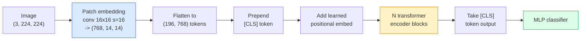

<!-- i18n:manual -->
# Vision-трансформеры (ViT)

> Режем картинку на патчи, считаем каждый патч словом, запускаем обычный трансформер. И не оглядываемся назад.

**Type:** Build
**Languages:** Python
**Prerequisites:** Phase 7 Lesson 02 (Self-Attention), Phase 4 Lesson 04 (Image Classification)
**Time:** ~45 minutes

## Learning Objectives

- Реализовать patch embedding, обучаемый positional embedding, class-токен и блоки энкодера трансформера с нуля и собрать минимальный ViT
- Объяснить, почему ViT считали требующим гигантского претрейна, пока DeiT и MAE не доказали обратное
- Сравнить ViT, Swin и ConvNeXt по их архитектурным приорам (никаких, локальное оконное attention, свёрточный бэкбон)
- Дообучить предобученный ViT на маленьком датасете через `timm` по стандартному рецепту linear-probe / fine-tune

> 🎒 **На пальцах.** Главная мысль урока помещается в одну строку: картинка — это текст, только слова у неё квадратные. Картинка 224×224 при патче 16×16 даёт 14×14 = 196 патчей — столько же токенов, сколько слов в небольшом абзаце.

## The Problem

Десять лет свёртка была синонимом компьютерного зрения. У CNN были сильные индуктивные смещения — локальность, эквивариантность к сдвигу, — и никто не думал, что их можно чем-то заменить. Потом Dosovitskiy et al. (2020) показали, что обычный трансформер, применённый к вытянутым в строку патчам изображения, вообще без свёрточной машинерии, на масштабе догоняет и обгоняет лучшие CNN.

Подвох был в словах «на масштабе». ViT на ImageNet-1k проигрывал ResNet. ViT, предобученный на ImageNet-21k или JFT-300M и потом дообученный на ImageNet-1k, выигрывал. Вывод был такой: у трансформеров нет полезных приоров, но они могут выучить их из достаточного объёма данных. Дальнейшие работы (DeiT, MAE, DINO) показали, что при правильных рецептах обучения — сильные аугментации, self-supervised претрейн, дистилляция — ViT прекрасно учатся и на маленьких данных.

К 2026 году чистые CNN всё ещё конкурентоспособны на edge-устройствах (сильнее всех ConvNeXt), но во всём остальном доминируют трансформеры: сегментация (Mask2Former, SegFormer), детекция (DETR, RT-DETR), мультимодальность (CLIP, SigLIP), видео (VideoMAE, VJEPA). Знать надо структуру блока ViT.

> 🎒 **На пальцах.** CNN — это человек, которому с рождения объяснили, что соседние пиксели связаны. ViT — человек, которому не объяснили ничего, но показали 300 миллионов картинок, и он додумался сам. Первому хватает 1.3 миллиона примеров ImageNet-1k, второму без хитрых рецептов нужно в 200 раз больше.

## The Concept

### The pipeline



Семь шагов. Патчи -> токены -> attention -> классификатор. Каждый вариант (DeiT, Swin, ConvNeXt, претрейн MAE) меняет один-два шага из семи, а остальные не трогает.

### Patch embedding

Первая свёртка — вот весь секрет. Ядро 16, шаг 16, поэтому картинка 224x224 превращается в сетку 14x14 из патчей 16x16, каждый из которых спроецирован в 768-мерный эмбеддинг. Одна эта свёртка одновременно и режет на патчи, и линейно проецирует.

```
Input:  (3, 224, 224)
Conv (3 -> 768, k=16, s=16, no padding):
Output: (768, 14, 14)
Flatten spatial: (196, 768)
```

196 патчей = 196 токенов. Размерность признаков токена — 768 (ViT-B), 1024 (ViT-L) или 1280 (ViT-H).

> 🎒 **На пальцах.** Шаг равен размеру ядра — значит окна не перекрываются, и свёртка честно нарезает картинку как ножницы. Считаем: 224 / 16 = 14 по каждой стороне, 14 × 14 = 196 кусочков. Каждый кусочек — это 16 × 16 × 3 = 768 исходных чисел, которые сворачиваются ровно в 768 чисел эмбеддинга.

### Class token

Один обучаемый вектор, приписанный в начало последовательности:

```
tokens = [CLS; patch_1; patch_2; ...; patch_196]   shape (197, 768)
```

После N блоков трансформера выход `[CLS]` — это глобальное представление изображения. Классификационная голова читает только этот один вектор.

> 🎒 **На пальцах.** `[CLS]` — как секретарь на совещании: сам он ничего не производит, но слушает всех 196 участников и в конце пишет протокол. Отсюда и 197 токенов вместо 196: 196 патчей плюс один секретарь.

### Positional embedding

У трансформеров нет встроенного понятия пространственной позиции. Прибавляем обучаемый вектор к каждому токену:

```
tokens = tokens + learned_pos_embedding   (also shape (197, 768))
```

Этот эмбеддинг — параметр модели; обучение градиентом подгоняет его под двумерную структуру изображения. Синусоидальные 2D-альтернативы существуют, но на практике почти не используются.

> 🎒 **На пальцах.** Без positional embedding перемешанные патчи дадут ровно тот же ответ — attention по своей природе не знает, что было слева, а что справа. Это как раздать 196 фрагментов пазла без номеров. Таблица позиций размера 197 × 768 — примерно 151 тысяча обучаемых чисел — и есть эти номера.

### Transformer encoder block

Стандартный. Multi-head self-attention, MLP, residual connections, pre-LayerNorm.

```
x = x + MSA(LN(x))
x = x + MLP(LN(x))

MLP is two-layer with GELU: Linear(d -> 4d) -> GELU -> Linear(4d -> d)
```

ViT-B/16 складывает 12 таких блоков, в каждом по 12 голов attention, в сумме 86M параметров.

> 🎒 **На пальцах.** Заметьте `4d` в MLP: при d=768 внутренний слой это 3072. То есть MLP расширяет вектор вчетверо, обрабатывает и сжимает обратно — примерно две трети всех параметров блока сидят именно здесь, а не в attention.

### Why pre-LN

Ранние трансформеры использовали post-LN (`x = LN(x + sublayer(x))`) и с трудом обучались глубже 6-8 слоёв без прогрева. Pre-LN (`x = x + sublayer(LN(x))`) обучает глубокие сети стабильно и без прогрева. Все ViT и все современные LLM используют pre-LN.

### Patch size trade-off

- 16x16 патчей -> 196 токенов, стандарт.
- 32x32 патчей -> 49 токенов, быстрее, но грубее по разрешению.
- 8x8 патчей -> 784 токена, детальнее, но стоимость attention растёт как O(n^2) и быстро становится неподъёмной.

Крупнее патч = меньше токенов = быстрее, но меньше пространственных деталей. SwinV2 использует патчи 4x4 внутри иерархических окон.

> 🎒 **На пальцах.** Считайте квадраты: 196² = 38 416, 49² = 2 401, 784² = 614 656. Переход с патча 16 на патч 32 удешевляет attention в 16 раз, а переход на патч 8 удорожает его в те же 16 раз. Вот почему 16 — компромисс по умолчанию.

### DeiT's recipe for training ViT on ImageNet-1k

Оригинальному ViT нужен был JFT-300M, чтобы обойти CNN. DeiT (Touvron et al., 2020) обучил ViT-B до 81.8% top-1 на одном лишь ImageNet-1k, изменив четыре вещи:

1. Тяжёлые аугментации: RandAugment, Mixup, CutMix, Random Erasing.
2. Stochastic depth (случайное выбрасывание целых блоков во время обучения).
3. Повторяющаяся аугментация (одна и та же картинка попадает в батч 3 раза).
4. Дистилляция от CNN-учителя (опционально, поднимает точность ещё выше).

Любой современный рецепт обучения ViT — потомок DeiT.

> 🎒 **На пальцах.** Ключ не в архитектуре, а в дисциплине обучения: те же 86M параметров, тот же датасет из 1.3 миллиона картинок, но 81.8% вместо проигрыша ResNet. Аугментации здесь заменяют недостающие 300 миллионов картинок — модели просто не дают увидеть одну и ту же картинку дважды в одном виде.

### Swin vs ConvNeXt

- **Swin** (Liu et al., 2021) — attention внутри окон. Каждый блок считает attention внутри локального окна; соседние блоки сдвигают окно, чтобы информация перетекала между окнами. Возвращает CNN-подобный приор локальности, сохраняя оператор attention.
- **ConvNeXt** (Liu et al., 2022) — переработанная CNN, повторяющая архитектурные решения Swin (depthwise-свёртки, LayerNorm, GELU, инвертированное бутылочное горлышко). Показала, что дело не в «attention против свёртки», а в «современный рецепт обучения + архитектура».

В 2026 году ConvNeXt-V2 и Swin-V2 оба продакшен-уровня; выбор зависит от вашего инференс-стека (ConvNeXt лучше компилируется под edge) и корпуса для претрейна.

> 🎒 **На пальцах.** Swin режет 196 токенов на окна, скажем по 49 токенов, и считает attention внутри каждого отдельно: 4 × 49² = 9 604 вместо 38 416, вчетверо дешевле. ConvNeXt заходит с другой стороны и получает тот же результат обычными свёртками — мораль в том, что спор «attention или свёртка» оказался спором ни о чём.

### MAE pretraining

Masked Autoencoder (He et al., 2022): случайно маскируем 75% патчей, обучаем энкодер обрабатывать только видимые 25%, обучаем маленький декодер восстанавливать замаскированные патчи по выходу энкодера. После претрейна декодер выбрасываем и дообучаем энкодер.

MAE делает ViT обучаемым на одном ImageNet-1k, даёт SOTA и сегодня является стандартным self-supervised рецептом.

> 🎒 **На пальцах.** Это тест на понимание картинки: закрыть три четверти и попросить дорисовать. Из 196 патчей энкодер видит только 49 — поэтому претрейн ещё и вчетверо дешевле обычного, при том что модель вынуждена выучить, как устроен мир, а не запомнить текстуры.

```figure
batchnorm-inference
```

## Build It

### Step 1: Patch embedding

```python
import torch
import torch.nn as nn

class PatchEmbedding(nn.Module):
    def __init__(self, in_channels=3, patch_size=16, dim=192, image_size=64):
        super().__init__()
        assert image_size % patch_size == 0
        self.proj = nn.Conv2d(in_channels, dim, kernel_size=patch_size, stride=patch_size)
        num_patches = (image_size // patch_size) ** 2
        self.num_patches = num_patches

    def forward(self, x):
        x = self.proj(x)
        return x.flatten(2).transpose(1, 2)
```

Одна свёртка, один flatten, один transpose. Это весь шаг «картинка в токены».

> 🎒 **На пальцах.** `flatten(2)` схлопывает 14 и 14 в 196, а `transpose(1, 2)` меняет местами каналы и токены, потому что трансформеры хотят форму (batch, токены, признаки). В этом коде картинка 64×64 при патче 16 даёт всего 4 × 4 = 16 патчей — маленькая учебная версия того же самого.

### Step 2: Transformer block

Pre-LN, multi-head self-attention, MLP с GELU, residual connections.

```python
class Block(nn.Module):
    def __init__(self, dim, num_heads, mlp_ratio=4, dropout=0.0):
        super().__init__()
        self.ln1 = nn.LayerNorm(dim)
        self.attn = nn.MultiheadAttention(dim, num_heads, dropout=dropout, batch_first=True)
        self.ln2 = nn.LayerNorm(dim)
        self.mlp = nn.Sequential(
            nn.Linear(dim, dim * mlp_ratio),
            nn.GELU(),
            nn.Dropout(dropout),
            nn.Linear(dim * mlp_ratio, dim),
            nn.Dropout(dropout),
        )

    def forward(self, x):
        a, _ = self.attn(self.ln1(x), self.ln1(x), self.ln1(x), need_weights=False)
        x = x + a
        x = x + self.mlp(self.ln2(x))
        return x
```

`nn.MultiheadAttention` сам разбивает на головы, считает scaled dot-product и делает выходную проекцию. `batch_first=True` — чтобы формы были `(N, seq, dim)`.

> 🎒 **На пальцах.** Три раза `self.ln1(x)` подряд — это query, key и value из одного и того же входа, отсюда и слово self в self-attention. При dim=192 и 3 головах каждая голова работает с 192 / 3 = 64 числами: три независимых взгляда на одну сцену, потом склеенных обратно в 192.

### Step 3: The ViT

```python
class ViT(nn.Module):
    def __init__(self, image_size=64, patch_size=16, in_channels=3,
                 num_classes=10, dim=192, depth=6, num_heads=3, mlp_ratio=4):
        super().__init__()
        self.patch = PatchEmbedding(in_channels, patch_size, dim, image_size)
        num_patches = self.patch.num_patches
        self.cls_token = nn.Parameter(torch.zeros(1, 1, dim))
        self.pos_embed = nn.Parameter(torch.zeros(1, num_patches + 1, dim))
        self.blocks = nn.ModuleList([
            Block(dim, num_heads, mlp_ratio) for _ in range(depth)
        ])
        self.ln = nn.LayerNorm(dim)
        self.head = nn.Linear(dim, num_classes)
        nn.init.trunc_normal_(self.pos_embed, std=0.02)
        nn.init.trunc_normal_(self.cls_token, std=0.02)

    def forward(self, x):
        x = self.patch(x)
        cls = self.cls_token.expand(x.size(0), -1, -1)
        x = torch.cat([cls, x], dim=1)
        x = x + self.pos_embed
        for blk in self.blocks:
            x = blk(x)
        x = self.ln(x[:, 0])
        return self.head(x)

vit = ViT(image_size=64, patch_size=16, num_classes=10, dim=192, depth=6, num_heads=3)
x = torch.randn(2, 3, 64, 64)
print(f"output: {vit(x).shape}")
print(f"params: {sum(p.numel() for p in vit.parameters()):,}")
```

Около 2.8M параметров — крошечный ViT, который тянет даже CPU. Настоящий ViT-B — это 86M; то же самое определение класса с `dim=768, depth=12, num_heads=12`.

> 🎒 **На пальцах.** Пройдите forward глазами: `patch` даёт (2, 16, 192), `cat` с CLS даёт (2, 17, 192), 6 блоков форму не меняют, `x[:, 0]` берёт только CLS и даёт (2, 192), голова — (2, 10). Обратите внимание: 16 патчей плюс CLS — значит `pos_embed` обязан быть длиной 17, иначе прибавление упадёт по формам.

### Step 4: Sanity check — single image inference

```python
logits = vit(torch.randn(1, 3, 64, 64))
print(f"logits: {logits}")
print(f"probs:  {logits.softmax(-1)}")
```

Должно отработать без ошибок. Вероятности суммируются в 1.

> 🎒 **На пальцах.** Модель необучена, поэтому 10 вероятностей будут примерно по 0.1 каждая — это ровно то, что вы и хотите увидеть на этом шаге. Проверяется не качество, а то, что формы стыкуются от входа до выхода.

## Use It

`timm` поставляет каждый вариант ViT с предобученными на ImageNet весами. Одна строка:

```python
import timm

model = timm.create_model("vit_base_patch16_224", pretrained=True, num_classes=10)
```

`timm` — стандарт продакшена для vision-трансформеров в 2026 году. Поддерживает ViT, DeiT, Swin, Swin-V2, ConvNeXt, ConvNeXt-V2, MaxViT, MViT, EfficientFormer и десятки других под одним и тем же API.

Для мультимодальной работы (картинка + текст) в `transformers` есть CLIP, SigLIP, BLIP-2, LLaVA. Энкодер изображений во всех этих моделях — вариант ViT.

> 🎒 **На пальцах.** `num_classes=10` в этой строке выбрасывает голову на 1000 классов ImageNet и ставит новую на 10 — всё остальное веса сохраняют. Меняется примерно 7 тысяч параметров из 86 миллионов, а работать оно начинает на вашем датасете.

## Ship It

Этот урок производит:

- `outputs/prompt-vit-vs-cnn-picker.md` — промпт, который выбирает между ViT, ConvNeXt и Swin по размеру датасета, доступным вычислениям и инференс-стеку.
- `outputs/skill-vit-patch-and-pos-embed-inspector.md` — навык, который проверяет, что формы patch embedding и positional embedding у ViT совпадают с ожидаемой длиной последовательности, и ловит самые частые ошибки при переносе моделей.

## Exercises

1. **(Easy)** Распечатайте формы всех промежуточных тензоров на прямом проходе через крошечный ViT выше. Убедитесь: вход `(N, 3, 64, 64)` -> патчи `(N, 16, 192)` -> с CLS `(N, 17, 192)` -> вход классификатора `(N, 192)` -> выход `(N, num_classes)`.
2. **(Medium)** Дообучите предобученный `timm` ViT-S/16 на синтетическом CIFAR из Lesson 4. Сравните с дообучением ResNet-18 на тех же данных. Сообщите время обучения и итоговую точность.
3. **(Hard)** Реализуйте претрейн MAE для крошечного ViT: замаскируйте 75% патчей, обучите энкодер и маленький декодер восстанавливать замаскированное. Оцените точность linear-probe на синтетических данных до и после претрейна.

> 🎒 **На пальцах.** Подсказка к третьему заданию: при 16 патчах маска в 75% оставляет ровно 4 видимых патча. Это мало, поэтому не удивляйтесь слабому результату — MAE начинает работать, когда патчей хотя бы 196 и видимых остаётся 49. Сначала увеличьте картинку или уменьшите патч, потом маскируйте.

## Key Terms

| Term | What people say | What it actually means |
|------|----------------|----------------------|
| Patch embedding | «Первая свёртка» | Свёртка, у которой ядро = шаг = размер патча; превращает картинку в сетку эмбеддингов-токенов |
| Class token | «[CLS]» | Обучаемый вектор в начале последовательности токенов; его итоговый выход и есть глобальное представление картинки |
| Positional embedding | «Обучаемая позиция» | Обучаемый вектор, прибавляемый к каждому токену, чтобы трансформер знал, откуда взялся патч |
| Pre-LN | «LayerNorm до подслоя» | Стабильный вариант трансформера: `x + sublayer(LN(x))` вместо `LN(x + sublayer(x))` |
| Multi-head attention | «Параллельное внимание» | Обычный attention трансформера, разбитый на num_heads независимых подпространств, которые потом склеиваются |
| ViT-B/16 | «Base, патч 16» | Канонический размер: dim=768, depth=12, heads=12, patch_size=16, image=224; ~86M параметров |
| DeiT | «Data-efficient ViT» | ViT, обученный на одном ImageNet-1k с сильными аугментациями; доказал, что огромный претрейн-датасет не обязателен |
| MAE | «Masked autoencoder» | Self-supervised претрейн: замаскировать 75% патчей и восстановить их; доминирующий рецепт претрейна ViT |

## Further Reading

- [An Image is Worth 16x16 Words (Dosovitskiy et al., 2020)](https://arxiv.org/abs/2010.11929) — статья про ViT
- [DeiT: Data-efficient Image Transformers (Touvron et al., 2020)](https://arxiv.org/abs/2012.12877) — как обучить ViT на одном ImageNet-1k
- [Masked Autoencoders are Scalable Vision Learners (He et al., 2022)](https://arxiv.org/abs/2111.06377) — претрейн MAE
- [timm documentation](https://huggingface.co/docs/timm) — справочник по всем vision-трансформерам, которые вам понадобятся в продакшене
