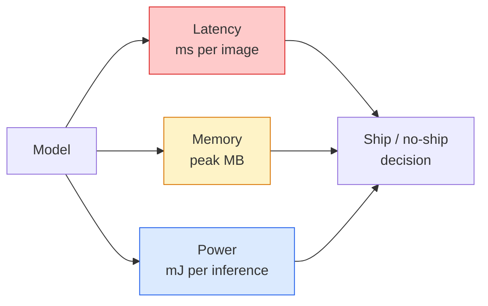

<!-- i18n:manual -->
# Зрение в реальном времени — деплой на edge

> Edge-инференс — это дисциплина о том, как заставить модель с точностью 90 работать на 30 fps на устройстве с 2 ГБ памяти. Каждый процентный пункт точности обменивается на миллисекунды latency.

**Type:** Learn + Build
**Languages:** Python
**Prerequisites:** Phase 4 Lesson 04 (Image Classification), Phase 10 Lesson 11 (Quantization)
**Time:** ~75 minutes

## Learning Objectives

- Измерять latency инференса, пиковую память и пропускную способность для любой модели PyTorch и читать компромисс FLOPs / параметры / latency
- Квантовать vision-модель в INT8 через post-training quantization из PyTorch и проверять, что потеря точности меньше 1%
- Экспортировать в ONNX и компилировать через ONNX Runtime или TensorRT; назвать три самых частых сбоя экспорта и способы их починить
- Объяснить, когда выбирать MobileNetV3, EfficientNet-Lite, ConvNeXt-Tiny или MobileViT под конкретное edge-ограничение

> 🎒 **На пальцах.** 30 fps означает 1000 / 30 ≈ 33 миллисекунды на кадр — включая захват, препроцессинг и постобработку. У самой модели остаётся миллисекунд двадцать. Весь урок про то, как влезть в этот бюджет и как честно проверить, что вы в него влезли.

## The Problem

Модель зрения на момент обучения — это плавающее чудовище. 100M параметров, 10 GFLOPs на прямой проход, 2 ГБ видеопамяти. Ничего из этого не влезет в телефон, в мультимедийный блок автомобиля, в промышленную камеру или в дрон. Выпустить систему зрения — значит уместить те же предсказания в бюджет, который в 100 раз меньше.

Основную работу делают три ручки: выбор модели (архитектура поменьше при том же рецепте), quantization (INT8 вместо FP32) и рантайм инференса (ONNX Runtime, TensorRT, Core ML, TFLite). Правильно ими воспользоваться — это разница между демо, которое крутится на рабочей станции, и продуктом, который едет в камере за 30 долларов.

Этот урок сначала ставит дисциплину измерений (нельзя оптимизировать то, что не измеряешь), а потом проходит по трём ручкам. Цель не выучить все edge-рантаймы, а знать, какие рычаги существуют и как проверить, что каждый делает именно то, что вы думаете.

> 🎒 **На пальцах.** Считаем размер: 100M параметров по 4 байта каждый — это 400 МБ только весов. После перевода в INT8 остаётся 100 МБ. Этого всё ещё много для камеры, поэтому вторая ручка — взять модель на 2.5M параметров, то есть 10 МБ в FP32 и 2.5 МБ в INT8.

## The Concept

### The three budgets



- **Latency**: p50, p95, p99. Средний p50 прячет хвост, а именно хвост важен для систем реального времени.
- **Peak memory**: максимум, который устройство когда-либо видит, а не среднее в установившемся режиме. Важно, потому что на встраиваемых платформах OOM смертелен.
- **Power / energy**: миллиджоули на инференс на устройстве с батареей. Часто оценивают косвенно через загрузку CPU/GPU, умноженную на время.

Решение по edge принимают по таблице (модель, latency, память, точность). Каждая клетка измеряется на целевом устройстве, а не на рабочей станции.

> 🎒 **На пальцах.** Почему p99 важнее среднего: если 99 кадров из 100 обрабатываются за 20 мс, а сотый — за 300 мс, среднее будет приличные 23 мс, но пользователь увидит рывок картинки. Среднее сглаживает ровно то, что ломает продукт.

### Measurement discipline

Три правила, которым обязан следовать любой edge-профиль:

1. **Warm up** — прогрейте модель 5-10 холостыми прямыми проходами до измерения. Холодные кэши и JIT-компиляция дают нерепрезентативные первые числа.
2. **Synchronise** — синхронизируйте GPU через `torch.cuda.synchronize()` до и после замеряемого блока. Без этого вы измеряете постановку ядер в очередь, а не их выполнение.
3. **Fix input sizes** — зафиксируйте размер входа на продакшен-разрешении. Latency на 224x224 — это не latency на 512x512.

> 🎒 **На пальцах.** Забыть `synchronize()` — самая обидная ошибка в этом уроке: CUDA-вызовы асинхронные, поэтому таймер честно покажет вам 0.3 мс на модели, которая на деле считает 20 мс. Вы поверите, что уложились в 33 мс на кадр, и узнаете правду только на устройстве.

### FLOPs as a proxy

FLOPs (число операций с плавающей запятой на инференс) — дешёвая и не зависящая от железа оценка latency. Полезна для сравнения архитектур, обманчива как абсолютное время на часах. Модель с на 10% большим числом FLOPs на практике может быть вдвое быстрее, потому что использует дружественные железу операции (depthwise-свёртки хорошо компилируются, крупные свёртки 7x7 — нет).

Правило: FLOPs — для поиска архитектуры, latency на устройстве — для решений о деплое.

> 🎒 **На пальцах.** FLOPs — как километраж маршрута, latency — как время в пути. Маршрут в 12 км по трассе быстрее маршрута в 10 км по центру города. Считать километры полезно, но выезжать по расписанию нужно всё-таки по времени.

### Quantisation in one paragraph

Заменяем веса и активации FP32 на INT8. Размер модели падает в 4 раза, требования к пропускной способности памяти — в 4 раза, вычисления — в 2-4 раза на железе с INT8-ядрами (любой современный мобильный SoC, любая NVIDIA GPU с Tensor Cores). Потеря точности на задачах зрения обычно 0.1-1 процентного пункта при статической post-training quantization.

Типы:

- **Dynamic** — веса квантуются в INT8, активации считаются в плавающей запятой. Просто, ускорение небольшое.
- **Static (post-training)** — квантуются веса плюс калибруются диапазоны активаций на небольшом калибровочном наборе. Заметно быстрее динамического.
- **Quantisation-aware training (QAT)** — quantization симулируется во время обучения, и модель учится с учётом неё. Лучшая точность, нужны размеченные данные.

Для зрения статическая post-training quantization даёт 95% выгоды за 5% усилий. Берите QAT, только если потеря точности от PTQ неприемлема.

> 🎒 **На пальцах.** INT8 — это округление цен до рублей вместо копеек: чисел становится в 4 раза меньше по объёму, а итоговая сумма почти та же. Модель на 400 МБ становится моделью на 100 МБ, а точность падает, скажем, с 76.1% до 75.6% — полпроцентного пункта за четырёхкратное сжатие.

### Pruning and distillation

- **Pruning** — выбросить неважные веса (по величине) или каналы (структурно). Хорошо работает на переразмеренных моделях; на уже компактных архитектурах пользы мало.
- **Distillation** — обучить маленького ученика повторять логиты большого учителя. Часто возвращает большую часть точности, потерянной при уменьшении модели. Стандарт для продакшен-моделей на edge.

> 🎒 **На пальцах.** Pruning работает, когда в модели есть жир: у ResNet-50 половину весов можно занулить почти без потерь. У MobileNetV3-Small на 2.5M параметров жира уже нет — там каждый вес при деле, и pruning только ломает. Сначала проверьте, есть ли что резать.

### The inference runtimes

- **PyTorch eager** — медленно, не для деплоя. Только для разработки.
- **TorchScript** — легаси. Вытеснен `torch.compile` и экспортом в ONNX.
- **ONNX Runtime** — нейтральный рантайм. У CPU, CUDA, CoreML, TensorRT и OpenVINO есть ONNX-провайдеры. Начинайте отсюда.
- **TensorRT** — компилятор от NVIDIA. Лучшая latency на GPU NVIDIA (рабочая станция и Jetson). Работает через ONNX Runtime или отдельно.
- **Core ML** — рантайм Apple для iOS/macOS. Нужен `.mlmodel` или `.mlpackage`.
- **TFLite** — рантайм Google для Android/ARM. Нужен `.tflite`.
- **OpenVINO** — рантайм Intel для CPU/VPU. Нужны `.xml` плюс `.bin`.

На практике: экспорт PyTorch -> ONNX -> выбор рантайма под цель. ONNX — язык международного общения.

> 🎒 **На пальцах.** Из семи пунктов запомнить надо один: ONNX. Это как PDF для моделей — вы сохраняете один раз, а открыть могут все шесть остальных. Порядок действий всегда одинаковый: PyTorch, потом ONNX, потом рантайм целевого устройства.

### Edge architecture picker

| Budget | Model | Why |
|--------|-------|-----|
| < 3M params | MobileNetV3-Small | Компилируется везде, хорошая база |
| 3-10M | EfficientNet-Lite-B0 | Лучшая точность на параметр в TFLite |
| 10-20M | ConvNeXt-Tiny | Лучшая точность на параметр, дружественна к CPU |
| 20-30M | MobileViT-S or EfficientViT | Трансформер с точностью уровня ImageNet |
| 30-80M | Swin-V2-Tiny | Если стек поддерживает оконное attention |

Квантуйте всё это в INT8, если нет конкретной причины не делать этого.

> 🎒 **На пальцах.** Таблица читается снизу вверх от вашего железа. 2 ГБ памяти и батарея — берите первую строку, 3M параметров это 12 МБ в FP32 и 3 МБ в INT8. Есть Jetson и питание от сети — можно позволить себе последнюю строку, там модель в 25 раз тяжелее.

```figure
cnn-param-count
```

## Build It

### Step 1: Measure latency correctly

```python
import time
import torch

def measure_latency(model, input_shape, device="cpu", warmup=10, iters=50):
    model = model.to(device).eval()
    x = torch.randn(input_shape, device=device)
    with torch.no_grad():
        for _ in range(warmup):
            model(x)
        if device == "cuda":
            torch.cuda.synchronize()
        times = []
        for _ in range(iters):
            if device == "cuda":
                torch.cuda.synchronize()
            t0 = time.perf_counter()
            model(x)
            if device == "cuda":
                torch.cuda.synchronize()
            times.append((time.perf_counter() - t0) * 1000)
    times.sort()
    return {
        "p50_ms": times[len(times) // 2],
        "p95_ms": times[int(len(times) * 0.95)],
        "p99_ms": times[int(len(times) * 0.99)],
        "mean_ms": sum(times) / len(times),
    }
```

Прогрев, синхронизация, `time.perf_counter()`. Сообщайте перцентили, а не только среднее.

> 🎒 **На пальцах.** Разберите арифметику перцентилей: 50 замеров, отсортированы, p50 — это элемент с индексом 25, p95 — индекс int(50 × 0.95) = 47, p99 — индекс 49, то есть буквально самый медленный замер. При 50 итерациях p99 — это одно-единственное число, поэтому для честного хвоста берите хотя бы 500 итераций.

### Step 2: Parameter and FLOP counts

```python
def parameter_count(model):
    return sum(p.numel() for p in model.parameters())

def flops_estimate(model, input_shape):
    """
    Rough FLOP count for a conv/linear-only model. For production use `fvcore` or `ptflops`.
    """
    total = 0
    def conv_hook(m, inp, out):
        nonlocal total
        c_out, c_in, kh, kw = m.weight.shape
        h, w = out.shape[-2:]
        total += 2 * c_in * c_out * kh * kw * h * w
    def linear_hook(m, inp, out):
        nonlocal total
        total += 2 * m.in_features * m.out_features
    hooks = []
    for m in model.modules():
        if isinstance(m, torch.nn.Conv2d):
            hooks.append(m.register_forward_hook(conv_hook))
        elif isinstance(m, torch.nn.Linear):
            hooks.append(m.register_forward_hook(linear_hook))
    model.eval()
    with torch.no_grad():
        model(torch.randn(input_shape))
    for h in hooks:
        h.remove()
    return total
```

Для реальных проектов используйте `fvcore.nn.FlopCountAnalysis` или `ptflops`; они корректно обрабатывают все типы модулей.

> 🎒 **На пальцах.** Откуда двойка в `2 * c_in * c_out * kh * kw * h * w`: каждый выходной элемент — это умножение и сложение, две операции. Свёртка 3x3 с 64 входными и 64 выходными каналами на карте 56x56 даёт 2 × 64 × 64 × 9 × 56 × 56 ≈ 231 миллион операций — и это всего один слой.

### Step 3: Post-training static quantisation

```python
def quantise_ptq(model, calibration_loader, backend="x86"):
    import torch.ao.quantization as tq
    model = model.eval().cpu()
    model.qconfig = tq.get_default_qconfig(backend)
    tq.prepare(model, inplace=True)
    with torch.no_grad():
        for x, _ in calibration_loader:
            model(x)
    tq.convert(model, inplace=True)
    return model
```

Три шага: сконфигурировать, подготовить (вставить наблюдатели), откалибровать на реальных данных, преобразовать (слить и квантовать). Требует, чтобы модель была слита (`Conv -> BN -> ReLU` -> `ConvBnReLU`), чем занимается `torch.ao.quantization.fuse_modules`.

> 🎒 **На пальцах.** Калибровка — это не обучение: градиенты не считаются, модель просто смотрит на данные и запоминает, в каких пределах гуляют активации. Хватает 100-500 картинок из вашего реального распределения. Возьмёте калибровочный набор не из того распределения — получите обрезанные диапазоны и провал точности.

### Step 4: Export to ONNX

```python
def export_onnx(model, sample_input, path="model.onnx"):
    model = model.eval()
    torch.onnx.export(
        model,
        sample_input,
        path,
        input_names=["input"],
        output_names=["output"],
        dynamic_axes={"input": {0: "batch"}, "output": {0: "batch"}},
        opset_version=17,
    )
    return path
```

`opset_version=17` — безопасное значение по умолчанию в 2026 году. `dynamic_axes` позволяет запускать ONNX-модель с любым размером батча.

> 🎒 **На пальцах.** Без `dynamic_axes` модель намертво запомнит батч, с которым вы её экспортировали: отправили пример формы (1, 3, 224, 224) — и на батче из 8 картинок она откажется работать. Здесь динамической объявлена только нулевая ось, то есть батч; разрешение 224x224 остаётся зашитым, и это как раз правильно.

### Step 5: Benchmark and compare regimes

```python
import torch.nn as nn
from torchvision.models import mobilenet_v3_small

def compare_regimes():
    model = mobilenet_v3_small(weights=None, num_classes=10)
    params = parameter_count(model)
    flops = flops_estimate(model, (1, 3, 224, 224))
    lat_fp32 = measure_latency(model, (1, 3, 224, 224), device="cpu")
    print(f"FP32 MobileNetV3-Small: {params:,} params  {flops/1e9:.2f} GFLOPs  "
          f"p50={lat_fp32['p50_ms']:.2f}ms  p95={lat_fp32['p95_ms']:.2f}ms")
```

Запустите ту же функцию для `resnet50`, `efficientnet_v2_s` и `convnext_tiny` — и у вас будет сравнительная таблица, нужная для решения о деплое.

> 🎒 **На пальцах.** У MobileNetV3-Small примерно 2.5M параметров и около 0.06 GFLOPs на кадр 224x224, у ResNet-50 — 25M и 4.1 GFLOPs. Разница в FLOPs почти в 70 раз, а в latency на CPU обычно раз в 15-20: наглядное напоминание из раздела про FLOPs, что километры и время в пути — не одно и то же.

## Use It

Продакшен-стеки сходятся к одному из трёх путей:

- **Web / serverless**: PyTorch -> ONNX -> ONNX Runtime (провайдер CPU или CUDA). Проще всего, для большинства достаточно.
- **NVIDIA edge (Jetson, GPU server)**: PyTorch -> ONNX -> TensorRT. Лучшая latency, больше всего инженерных усилий.
- **Mobile**: PyTorch -> ONNX -> Core ML (iOS) или TFLite (Android). Квантуйте до экспорта.

Для измерений `torch-tb-profiler`, `nvprof` / `nsys` и Instruments на macOS дают разбивку по слоям. `benchmark_app` (OpenVINO) и `trtexec` (TensorRT) дают отдельные числа из командной строки.

> 🎒 **На пальцах.** «Квантуйте до экспорта» — не мелочь: если сначала экспортировать FP32 в ONNX, а потом искать квантование на стороне мобильного рантайма, вы получите другой набор поддерживаемых операций и половину вечера на отладку. Порядок такой: квантование, экспорт, замер.

## Ship It

Этот урок производит:

- `outputs/prompt-edge-deployment-planner.md` — промпт, который выбирает бэкбон, стратегию quantization и рантайм по целевому устройству и SLA по latency.
- `outputs/skill-latency-profiler.md` — навык, который пишет полный скрипт бенчмарка latency с прогревом, синхронизацией, перцентилями и отслеживанием памяти.

## Exercises

1. **(Easy)** Измерьте p50 latency для `resnet18`, `mobilenet_v3_small`, `efficientnet_v2_s` и `convnext_tiny` на 224x224 на CPU. Приведите таблицу и определите, у какой архитектуры лучшая точность на миллисекунду.
2. **(Medium)** Примените статическую post-training quantization к `mobilenet_v3_small`. Сообщите latency FP32 против INT8 и потерю точности на отложенной части CIFAR-10 или похожего набора.
3. **(Hard)** Экспортируйте `convnext_tiny` в ONNX, прогоните через `onnxruntime` с `CPUExecutionProvider` и сравните latency с базовым PyTorch eager. Найдите первый слой, на котором ONNX Runtime быстрее, и объясните почему.

> 🎒 **На пальцах.** Подсказка ко всем трём заданиям: закройте браузер и остановите фоновые задачи перед замером. На ноутбуке разброс между «чистым» и «занятым» CPU легко достигает 30%, а вы ищете разницу в 2 раза — и рискуете принять чужой видеозвонок за архитектурный вывод.

## Key Terms

| Term | What people say | What it actually means |
|------|----------------|----------------------|
| Latency | «Как быстро» | Время от входа до выхода; перцентили p50/p95/p99, а не среднее |
| FLOPs | «Размер модели» | Число операций с плавающей запятой на прямой проход; грубая оценка стоимости вычислений |
| INT8 quantisation | «8 бит» | Замена весов и активаций FP32 на 8-битные целые; примерно в 4 раза меньше, в 2-4 раза быстрее |
| PTQ | «Post-training quantization» | Квантование обученной модели без переобучения; просто и обычно достаточно |
| QAT | «Quantization-aware training» | Симуляция quantization во время обучения; лучшая точность, нужны размеченные данные |
| ONNX | «Нейтральный формат» | Формат обмена моделями, поддерживаемый всеми основными рантаймами инференса |
| TensorRT | «Компилятор NVIDIA» | Компилирует ONNX в оптимизированный движок под GPU NVIDIA |
| Distillation | «Учитель -> ученик» | Обучение маленькой модели повторять логиты большой; возвращает большую часть потерянной точности |

## Further Reading

- [EfficientNet (Tan & Le, 2019)](https://arxiv.org/abs/1905.11946) — составное масштабирование для эффективных архитектур
- [MobileNetV3 (Howard et al., 2019)](https://arxiv.org/abs/1905.02244) — архитектура, спроектированная под мобильные устройства, с h-swish и squeeze-excite
- [A Practical Guide to TensorRT Optimization (NVIDIA)](https://developer.nvidia.com/blog/accelerating-model-inference-with-tensorrt-tips-and-best-practices-for-pytorch-users/) — как на самом деле получить те цифры пропускной способности, что в статьях
- [ONNX Runtime docs](https://onnxruntime.ai/docs/) — quantization, оптимизация графа, выбор провайдера
