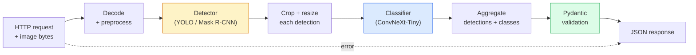

<!-- i18n:manual -->
# Собираем полный vision-пайплайн — капстоун

> Продакшн-система компьютерного зрения — это цепочка моделей и правил, сшитая контрактами данных. Все детали уже есть в этой фазе; капстоун соединяет их от начала до конца.

**Type:** Build
**Languages:** Python
**Prerequisites:** Phase 4 Lessons 01-15
**Time:** ~120 minutes

## Learning Objectives

- Спроектировать продакшн-пайплайн зрения, который находит объекты, классифицирует их и отдаёт структурированный JSON — с обработкой каждого пути отказа
- Соединить детектор (Mask R-CNN или YOLO), классификатор (ConvNeXt-Tiny) и контракт данных (Pydantic) в один сервис
- Замерить пайплайн целиком и найти первое узкое место (на CPU это детектор; препроцессинг — когда модели переезжают на GPU)
- Выкатить минимальный FastAPI-сервис, который принимает картинку, прогоняет пайплайн и возвращает детекции с классами

> 🎒 **На пальцах.** Раньше вы учили отдельные модели. Сейчас — конвейер: картинка на входе, JSON на выходе, семь этапов между ними. Из этих семи только два — модели. Остальные пять — обычный код, и именно в нём живут баги.

## The Problem

Отдельные модели зрения полезны; продукты зрения — это цепочки моделей. Аудит полки в магазине — это детектор плюс классификатор товаров плюс OCR-пайплайн для ценников. Автопилот — это 2D-детектор плюс 3D-детектор плюс сегментатор плюс трекер плюс планировщик. Медицинский предварительный скрининг — это сегментатор плюс классификатор области плюс интерфейс для врача.

Сшивание этих цепочек — та часть, которая отделяет ML-прототип от продукта. Каждый стык между моделями — новое место для багов. Каждый пересчёт координат, каждая нормализация, каждое изменение размера маски — кандидат на тихий сбой. Пайплайн настолько прочен, насколько прочен его слабейший стык.

Этот капстоун собирает минимально жизнеспособный пайплайн: детекция + классификация + структурированный выход + слой сервинга. Всё остальное из Phase 4 вставляется в этот скелет: замените Mask R-CNN на YOLOv8, добавьте OCR-голову, добавьте ветку сегментации, добавьте трекер. Архитектура стабильна; детали заменяемы.

> 🎒 **На пальцах.** Представьте сборочный конвейер на заводе. Станки (модели) дорогие и надёжные, а ломается обычно лента между ними: деталь повернули не той стороной, размер не совпал. В зрении так же — детектор отдаёт коробки в формате `(cx, cy, w, h)`, а следующий шаг ждёт `(x1, y1, x2, y2)`, и всё едет дальше молча.

## The Concept

### The pipeline



Семь этапов. Два этапа с моделями дорогие; остальные пять — те, где живут баги.

> 🎒 **На пальцах.** Посчитайте по схеме: из семи блоков только `Detector` и `Classifier` считают нейросети. Пять оставшихся — декодирование, обрезка, сборка, валидация, ответ — это обычный Python. Ошибки чаще всего именно там, потому что их никто не тестирует.

### Data contracts with Pydantic

Каждая граница модели становится типизированным объектом. Это превращает тихие сбои в громкие.

```
Detection(
    box: tuple[float, float, float, float],   # (x1, y1, x2, y2), absolute pixels
    score: float,                              # [0, 1]
    class_id: int,                             # from detector's label map
    mask_rle: Optional[str],                   # RLE-encoded mask, if present
)

PipelineResult(
    image_id: str,
    detections: list[Detection],
    classifications: list[Classification],
    inference_ms: float,
)
```

Когда детектор возвращает коробки в формате `(cx, cy, w, h)` вместо `(x1, y1, x2, y2)`, валидация Pydantic падает прямо на границе, и вы узнаёте об этом сразу — вместо того чтобы отлаживать обрезку ниже по течению, которая молча возвращает пустые области.

> 🎒 **На пальцах.** Контракт данных — это как таможенная декларация на посылке. `score: float` в диапазоне [0, 1]: если модель вдруг вернёт 1.7, Pydantic остановит посылку на границе. Без контракта эта 1.7 доедет до фронтенда и покажет пользователю «уверенность 170%».

### Where latency goes

Три истины верны почти для любого пайплайна зрения:

1. **Preprocessing is easy to underestimate.** Декодирование JPEG, перевод цветовых пространств, изменение размера — всё это упирается в CPU и легко забывается. На машине без GPU детектор всё равно перевешивает препроцессинг с большим отрывом (числа — в шаге 5); но как только модели переезжают на GPU, препроцессинг часто становится самым большим куском реального времени.
2. **The detector dominates GPU time.** 70-90% времени GPU уходит на прямой проход детектора.
3. **Postprocessing (NMS, RLE encode/decode) is cheap on GPU, expensive on CPU.** Всегда профилируйте на настоящем целевом железе.

Знание этого распределения превращает оптимизацию в список приоритетов.

> 🎒 **На пальцах.** Это как поездка на работу: сама дорога (детектор) — 40 минут, но ещё 10 уходит на сборы и 5 на парковку. Ускорять надо самое длинное. Если детектор ест 80% времени GPU, то оптимизация препроцессинга вдвое даст выигрыш в единицы процентов.

### Failure modes

- **Empty detections** — вернуть пустой список, не падать. Записать в лог.
- **Out-of-bounds boxes** — обрезать по размеру изображения перед вырезанием фрагмента.
- **Tiny crops** — пропустить классификацию для коробок меньше минимального входа классификатора.
- **Corrupt upload** — ответ 400 с конкретным кодом ошибки, а не 500.
- **Model load failure** — падать при старте сервиса, а не на первом запросе.

Продакшн-пайплайн обрабатывает каждый из этих случаев, не заворачивая всё в общий `try/except`, который прячет сбой. У каждого отказа есть имя, код и ответ.

> 🎒 **На пальцах.** Разница между 400 и 500 такая же, как между «вы принесли не тот документ» и «у нас в офисе пожар». Первое клиент может исправить сам и повторить запрос. Второе означает «у нас всё сломалось». Если на битую картинку вы отдаёте 500, клиент будет ретраить её вечно.

### Batching

Продакшн-сервис обслуживает много клиентов. Батчинг детекций и классификаций между запросами кратно увеличивает пропускную способность. Компромисс: дополнительная задержка из-за ожидания, пока батч наполнится. Типичная настройка: собирать запросы до 20 мс, объединять в батч, обрабатывать, раздавать ответы. `torchserve` и `triton` умеют это из коробки; маленькие сервисы с предсказуемой нагрузкой пишут свой микробатчер.

> 🎒 **На пальцах.** Лифт в высотке: можно везти каждого пассажира отдельно, а можно подождать 20 секунд и увезти восьмерых за одну поездку. Каждый пассажир ждёт на 20 секунд дольше, но лифт перевозит в разы больше людей в час. Окно в 20 мс — это ровно такая же сделка.

```figure
v4-vision-pipeline
```

## Build It

### Step 1: Data contracts

```python
from pydantic import BaseModel, Field
from typing import List, Optional, Tuple

class Detection(BaseModel):
    box: Tuple[float, float, float, float]
    score: float = Field(ge=0, le=1)
    class_id: int = Field(ge=0)
    mask_rle: Optional[str] = None


class Classification(BaseModel):
    detection_index: int
    class_id: int
    class_name: str
    score: float = Field(ge=0, le=1)


class PipelineResult(BaseModel):
    image_id: str
    detections: List[Detection]
    classifications: List[Classification]
    inference_ms: float
```

Пять секунд кода экономят час отладки на любом серьёзном пайплайне.

> 🎒 **На пальцах.** Обратите внимание на `Field(ge=0, le=1)` — это одна строка, которая навсегда закрывает вопрос «а почему у нас score равен 1.4?». И `Optional[str] = None` для маски: маски может не быть, и это нормальный, заранее описанный случай, а не сюрприз.

### Step 2: A minimal Pipeline class

```python
import time
import numpy as np
import torch
from PIL import Image

class VisionPipeline:
    def __init__(self, detector, classifier, class_names,
                 device="cpu", min_crop=32):
        self.detector = detector.to(device).eval()
        self.classifier = classifier.to(device).eval()
        self.class_names = class_names
        self.device = device
        self.min_crop = min_crop

    def preprocess(self, image):
        """
        image: PIL.Image or np.ndarray (H, W, 3) uint8
        returns: CHW float tensor on device
        """
        if isinstance(image, Image.Image):
            image = np.asarray(image.convert("RGB"))
        tensor = torch.from_numpy(image).permute(2, 0, 1).float() / 255.0
        return tensor.to(self.device)

    @torch.no_grad()
    def detect(self, image_tensor):
        return self.detector([image_tensor])[0]

    @torch.no_grad()
    def classify(self, crops):
        if len(crops) == 0:
            return []
        batch = torch.stack(crops).to(self.device)
        logits = self.classifier(batch)
        probs = logits.softmax(-1)
        scores, cls = probs.max(-1)
        return list(zip(cls.tolist(), scores.tolist()))

    def run(self, image, image_id="anonymous"):
        t0 = time.perf_counter()
        tensor = self.preprocess(image)
        det = self.detect(tensor)

        crops = []
        detections = []
        valid_indices = []
        H, W = tensor.shape[-2], tensor.shape[-1]
        for i, (box, score, cls) in enumerate(zip(det["boxes"], det["scores"], det["labels"])):
            x1, y1, x2, y2 = [int(b) for b in box.tolist()]
            # зажимаем с обеих сторон, чтобы коробка, целиком вылезшая за кадр,
            # выродилась в нулевую площадь, а не в перевёрнутую (x1 > x2)
            x1, y1 = min(max(x1, 0), W), min(max(y1, 0), H)
            x2, y2 = min(max(x2, x1), W), min(max(y2, y1), H)
            detections.append(Detection(
                box=(x1, y1, x2, y2),
                score=float(score),
                class_id=int(cls),
            ))
            if (x2 - x1) < self.min_crop or (y2 - y1) < self.min_crop:
                continue
            crop = tensor[:, y1:y2, x1:x2]
            crop = torch.nn.functional.interpolate(
                crop.unsqueeze(0),
                size=(224, 224),
                mode="bilinear",
                align_corners=False,
            )[0]
            crops.append(crop)
            valid_indices.append(i)

        class_preds = self.classify(crops)

        classifications = []
        for valid_idx, (cls_id, cls_score) in zip(valid_indices, class_preds):
            classifications.append(Classification(
                detection_index=valid_idx,
                class_id=int(cls_id),
                class_name=self.class_names[cls_id],
                score=float(cls_score),
            ))

        return PipelineResult(
            image_id=image_id,
            detections=detections,
            classifications=classifications,
            inference_ms=(time.perf_counter() - t0) * 1000,
        )
```

Каждый стык типизирован. У каждого пути отказа есть конкретное решение.

> 🎒 **На пальцах.** Разберём две строки защиты. Каждая координата зажимается с двух сторон: `max(..., 0)` не даёт уйти в минус, `min(..., W)` — вылезти за правый край. Картинка шириной 600, детектор предложил x2 = 640 — останется 600. Теперь злой случай: детектор предложил коробку целиком справа от кадра, x1 = 700, x2 = 760. Оба конца прижимаются к 600, ширина становится 0, и проверка `min_crop` спокойно её выбрасывает. Если бы x1 зажимали только снизу (а x2 только сверху), вышло бы x1 = 700, x2 = 600, то есть перевёрнутая коробка: срез `tensor[:, y1:y2, 700:600]` в Python молча даёт пустой тензор, и падение случится далеко от места настоящей ошибки. Отдельно посмотрите на `min(max(x2, x1), W)`: правая граница никогда не оказывается левее левой, поэтому «нулевая площадь» — худшее, что может выйти.

### Step 3: Wire a detector and a classifier

```python
from torchvision.models.detection import maskrcnn_resnet50_fpn_v2
from torchvision.models import convnext_tiny

# Use ImageNet-pretrained weights for a realistic pipeline without training
detector = maskrcnn_resnet50_fpn_v2(weights="DEFAULT")
classifier = convnext_tiny(weights="DEFAULT")
class_names = [f"imagenet_class_{i}" for i in range(1000)]

pipe = VisionPipeline(detector, classifier, class_names)

# Smoke test with a synthetic image
test_image = (np.random.rand(400, 600, 3) * 255).astype(np.uint8)
result = pipe.run(test_image, image_id="demo")
print(result.model_dump_json(indent=2)[:500])
```

> 🎒 **На пальцах.** Smoke-тест здесь гоняет пайплайн на случайном шуме 400×600. Никаких настоящих объектов на нём нет, и это нормально: цель — проверить, что все формы стыкуются и код не падает. Если на шуме получилось пусто, а сервис не упал, — путь «пустые детекции» уже работает правильно.

### Step 4: FastAPI service

```python
from contextlib import asynccontextmanager
from fastapi import FastAPI, UploadFile, HTTPException
from io import BytesIO

pipe = None  # initialised on startup

@asynccontextmanager
async def lifespan(app: FastAPI):
    global pipe
    detector = maskrcnn_resnet50_fpn_v2(weights="DEFAULT").eval()
    classifier = convnext_tiny(weights="DEFAULT").eval()
    pipe = VisionPipeline(detector, classifier, class_names=[f"c{i}" for i in range(1000)])
    yield
    # работа на остановке (закрыть пулы, сбросить метрики) идёт после yield

app = FastAPI(lifespan=lifespan)

@app.post("/detect")
async def detect_endpoint(file: UploadFile):
    if file.content_type not in {"image/jpeg", "image/png", "image/webp"}:
        raise HTTPException(status_code=400, detail="unsupported image type")
    data = await file.read()
    try:
        img = Image.open(BytesIO(data)).convert("RGB")
    except Exception:
        raise HTTPException(status_code=400, detail="cannot decode image")
    result = pipe.run(img, image_id=file.filename or "upload")
    return result.model_dump()
```

Запускается командой `uvicorn main:app --host 0.0.0.0 --port 8000`. Проверяется командой `curl -F 'file=@dog.jpg' http://localhost:8000/detect`.

> 🎒 **На пальцах.** Обратите внимание на порядок проверок: сначала тип файла, потом попытка декодирования, и только потом модель. Три разных причины отказа — три разных ответа 400 с разным текстом. Модели загружаются один раз на старте, а не на каждый запрос: иначе первый пользователь ждал бы 30 секунд. Механизм — `lifespan`: всё до `yield` выполняется один раз при подъёме сервиса, всё после `yield` — один раз при остановке. Старый `@app.on_event("startup")` делал то же самое, но в FastAPI он объявлен устаревшим, и у него нет симметричного места под закрытие ресурсов.

### Step 5: Benchmark the pipeline

```python
import time

def benchmark(pipe, num_runs=20, image_size=(400, 600)):
    img = (np.random.rand(*image_size, 3) * 255).astype(np.uint8)
    pipe.run(img)  # warm up

    stages = {"preprocess": [], "detect": [], "classify": [], "total": []}
    for _ in range(num_runs):
        t0 = time.perf_counter()
        tensor = pipe.preprocess(img)
        t1 = time.perf_counter()
        det = pipe.detect(tensor)
        t2 = time.perf_counter()
        crops = []
        H, W = tensor.shape[-2], tensor.shape[-1]
        for box in det["boxes"]:
            x1, y1, x2, y2 = [int(b) for b in box.tolist()]
            x1, y1 = min(max(x1, 0), W), min(max(y1, 0), H)
            x2, y2 = min(max(x2, x1), W), min(max(y2, y1), H)
            if (x2 - x1) >= pipe.min_crop and (y2 - y1) >= pipe.min_crop:
                crop = tensor[:, y1:y2, x1:x2]
                crop = torch.nn.functional.interpolate(
                    crop.unsqueeze(0), size=(224, 224), mode="bilinear", align_corners=False
                )[0]
                crops.append(crop)
        pipe.classify(crops)
        t3 = time.perf_counter()
        stages["preprocess"].append((t1 - t0) * 1000)
        stages["detect"].append((t2 - t1) * 1000)
        stages["classify"].append((t3 - t2) * 1000)
        stages["total"].append((t3 - t0) * 1000)

    for stage, times in stages.items():
        times.sort()
        print(f"{stage:12s}  p50={times[len(times)//2]:7.1f} ms  p95={times[int(len(times)*0.95)]:7.1f} ms")
```

Типичный вывод на CPU: preprocess ~3 мс, detect 300-500 мс, classify 20-40 мс, total 350-550 мс. На GPU detect занимает 20-40 мс, и препроцессинг с классификацией начинают заметно весить в относительных числах.

> 🎒 **На пальцах.** Сравните числа: на CPU детектор — это примерно 300 из 350 мс, то есть 85% времени. На GPU он падает до 20-40 мс, и вдруг те же 3 мс препроцессинга становятся почти 10% от общего. Правило простое: оптимизируйте то, что реально измерили, а не то, что кажется медленным. И смотрите на p95, а не только на p50 — пользователи чувствуют именно хвост.

## Use It

Продакшн-шаблоны сходятся к той же структуре, плюс:

- **Model versioning** — всегда пишите в ответ имя модели и хеш весов.
- **Per-request trace IDs** — логируйте время каждого этапа для каждого запроса, чтобы связывать медленные ответы с конкретным этапом.
- **Fallback path** — если классификатор не уложился в таймаут, верните детекции без классов, а не проваливайте весь запрос.
- **Safety filters** — фильтры NSFW / PII работают после классификации, до того как ответ покинет сервис.
- **Batch endpoint** — эндпоинт `/detect_batch`, принимающий список URL картинок для пакетной обработки.

Для продакшн-сервинга `torchserve`, `Triton Inference Server` и `BentoML` дают батчинг, версионирование, метрики и health-check из коробки. Запускать `FastAPI` напрямую нормально для прототипов и небольших продуктов.

> 🎒 **На пальцах.** Хеш весов в ответе выглядит паранойей ровно до первого раза, когда качество упало ночью и никто не помнит, какую версию выкатили. Одно поле в JSON отвечает на вопрос «что именно считало этот ответ» за секунду вместо дня раскопок.

## Ship It

Этот урок производит:

- `outputs/prompt-vision-service-shape-reviewer.md` — промпт, который проверяет код vision-сервиса на нарушения контрактов и формы ответа и называет первый ломающий баг.
- `outputs/skill-pipeline-budget-planner.md` — навык, который по целевой задержке и пропускной способности расписывает бюджет времени на каждый этап пайплайна и указывает, какой этап первым выйдет за бюджет.

## Exercises

1. **(Easy)** Прогоните пайплайн на 10 изображениях из любого открытого набора данных. Приведите среднее время по этапам и распределение числа детекций на картинку.
2. **(Medium)** Добавьте в `Detection` поле маски и закодируйте её в RLE. Убедитесь, что JSON остаётся меньше 1 МБ даже для картинки с 10 объектами.
3. **(Hard)** Поставьте микробатчер перед классификатором: собирайте фрагменты до 10 мс, классифицируйте их одним вызовом GPU, раздавайте результаты по запросам. Измерьте прирост пропускной способности при 5 одновременных запросах в секунду и добавленную задержку.

> 🎒 **На пальцах.** Подсказка ко второму заданию: RLE кодирует маску как «сколько нулей подряд, сколько единиц подряд». Маска 400×600 — это 240 000 пикселей, но у обычного объекта границ мало, поэтому RLE ужимает её до пары сотен чисел. Умножьте на 10 объектов — и вы всё ещё далеко от 1 МБ. Проблема начнётся, если вы попробуете отдать маску как список списков из нулей и единиц.

## Key Terms

| Term | What people say | What it actually means |
|------|----------------|----------------------|
| Pipeline | «Система» | Упорядоченная цепочка препроцессинга, инференса и постпроцессинга с типизированным стыком между каждой парой |
| Data contract | «Схема» | Определения Pydantic / dataclass, которым соответствует вход и выход каждого этапа; ловит баги интеграции прямо на границе |
| Preprocessing | «До модели» | Декодирование, перевод цвета, изменение размера, нормализация; обычно самая большая трата CPU |
| Postprocessing | «После модели» | NMS, изменение размера маски, порог, кодирование RLE; дёшево на GPU, дорого на CPU |
| Microbatcher | «Собрать, потом прогнать» | Накопитель, который ждёт фиксированное окно ради нескольких запросов и делает один батчевый прямой проход |
| Trace ID | «Идентификатор запроса» | Идентификатор запроса, попадающий в лог на каждом этапе, чтобы медленный запрос можно было проследить целиком |
| Failure code | «Именованная ошибка» | Конкретный код ошибки на каждый класс отказа вместо общего 500; позволяет клиенту правильно ретраить |
| Health check | «Проба готовности» | Дешёвый эндпоинт, сообщающий, может ли сервис отвечать; на него опираются балансировщики |

## Further Reading

- [Full Stack Deep Learning — Deploying Models](https://fullstackdeeplearning.com/course/2022/lecture-5-deployment/) — канонический обзор продакшн-деплоя ML
- [BentoML docs](https://docs.bentoml.com) — фреймворк сервинга с батчингом, версионированием и метриками
- [torchserve docs](https://pytorch.org/serve/) — официальная библиотека сервинга от PyTorch
- [NVIDIA Triton Inference Server](https://developer.nvidia.com/triton-inference-server) — высокопроизводительный сервинг с батчингом и поддержкой нескольких моделей
