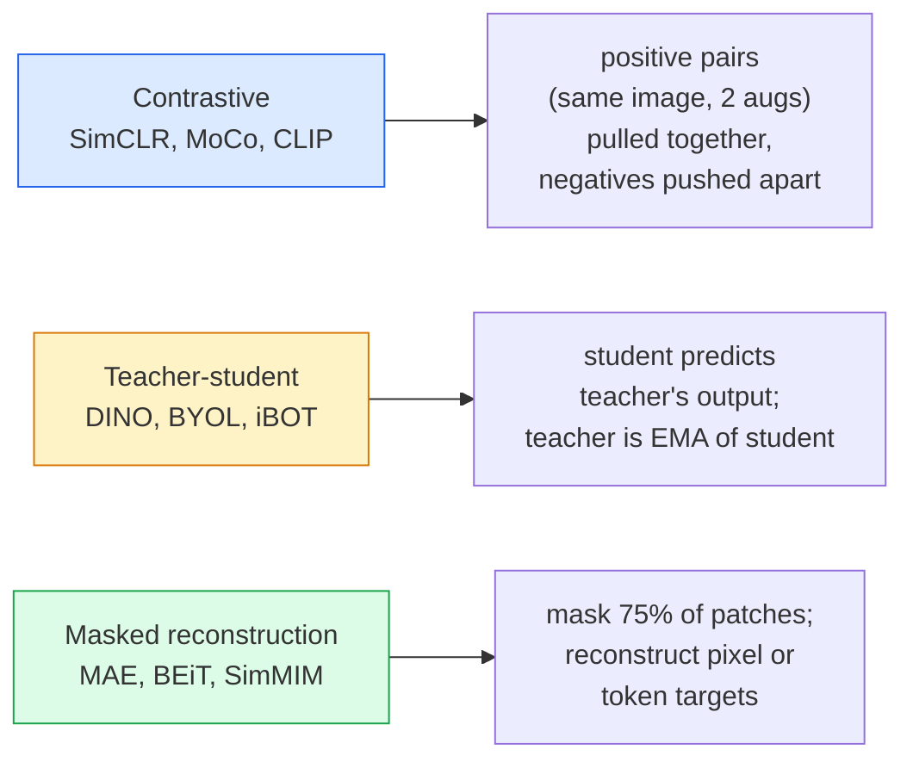

<!-- i18n:manual -->
# Self-supervised зрение — SimCLR, DINO, MAE

> Разметка — узкое место обучения зрения с учителем. Self-supervised предобучение убирает её: выучите визуальные признаки на 100 млн неразмеченных картинок, дообучите на 10 тысячах размеченных.

**Type:** Learn + Build
**Languages:** Python
**Prerequisites:** Phase 4 Lesson 04 (Image Classification), Phase 4 Lesson 14 (ViT)
**Time:** ~75 minutes

## Learning Objectives

- Разобрать три главных семейства self-supervised методов — contrastive learning (SimCLR), учитель-ученик (DINO), восстановление по маске (MAE) — и сказать, что оптимизирует каждое
- Реализовать InfoNCE loss с нуля и объяснить, почему батч из 512 работает, а батч из 32 — нет
- Объяснить, почему доля маскирования 75% в MAE выбрана не произвольно и чем она отличается от 15% в BERT для текста
- Использовать чекпоинты DINOv2 или MAE на ImageNet для linear probing и zero-shot поиска

> 🎒 **На пальцах.** Ребёнок учится видеть мир задолго до того, как ему объяснят слово «кошка». Он просто смотрит. Self-supervised обучение делает то же самое: модель часами разглядывает картинки без единой подписи, а метки нужны только в самом конце, чтобы дать выученным признакам имена.

## The Problem

В размеченном ImageNet 1,3 млн изображений, разметка которых обошлась примерно в 10 млн долларов. Медицинские и промышленные наборы данных меньше и размечаются ещё дороже. Каждая команда зрения задаёт вопрос: можно ли предобучиться на дешёвых неразмеченных данных — кадрах с YouTube, веб-краулах, записях с камер, спутниковых съёмках — и потом дообучиться на маленькой размеченной выборке?

Self-supervised обучение — это ответ. Современный self-supervised ViT, обученный на LAION или JFT, после дообучения достигает точности обучения с учителем на ImageNet или превосходит её. Он также лучше переносится на прикладные задачи (детекция, сегментация, глубина), чем предобучение с учителем. DINOv2 (Meta, 2023) и MAE (Meta, 2022) — сегодняшний продакшн-стандарт для переносимых визуальных признаков.

Концептуальный сдвиг в том, что предлоговая задача — то, чему модель обучают, — не обязана совпадать с прикладной задачей. Важно лишь, чтобы она заставляла модель выучить полезные признаки. Предсказывать цвет чёрно-белых картинок, поворачивать изображения и просить модель угадать поворот, маскировать патчи и восстанавливать их — всё это работало. Три подхода, которые масштабируются, — это contrastive learning, дистилляция учитель-ученик и восстановление по маске.

> 🎒 **На пальцах.** 10 млн долларов за 1,3 млн картинок — это примерно 8 долларов за картинку. Теперь представьте медицинский набор данных, где размечает не студент, а рентгенолог. Именно поэтому подход «сначала смотрим бесплатно, потом размечаем тысячу примеров» экономит не проценты, а порядки.

## The Concept

### Three families



> 🎒 **На пальцах.** Три способа учиться без учителя. Contrastive: «эти две фотки — один и тот же кот, а вон те — чужие». Учитель-ученик: «повторяй за старшей версией себя». Маска: «закрой три четверти картинки и дорисуй». Разные задачи, а признаки на выходе получаются похожего качества.

### Contrastive learning (SimCLR)

Берём одну картинку, применяем две случайные аугментации, получаем два вида. Прогоняем оба через один и тот же энкодер плюс проекционную голову. Минимизируем функцию потерь, которая говорит: «эти два embedding должны быть близко» и «этот embedding должен быть далеко от embedding любой другой картинки в батче».

```
Loss for positive pair (z_i, z_j) among 2N views per batch:

   L_ij = -log( exp(sim(z_i, z_j) / tau) / sum_k in batch \ {i} exp(sim(z_i, z_k) / tau) )

sim = cosine similarity
tau = temperature (0.1 standard)
```

Это и есть InfoNCE loss. Ему нужно много негативов на каждый позитив, поэтому размер батча важен — SimCLR требует 512-8192. MoCo ввёл очередь с моментумом из прошлых батчей, чтобы отвязать количество негативов от размера батча.

> 🎒 **На пальцах.** Батч из 32 даёт 62 негатива на пример, батч из 512 — 1022. Это как отличать своего друга в компании из 30 человек и на стадионе: во втором случае задача честно трудная, и модель вынуждена выучить настоящие признаки, а не «у него куртка тёмная». Отсюда и огромные батчи в SimCLR.

### Teacher-student (DINO)

Две сети одинаковой архитектуры: ученик и учитель. Учитель — это экспоненциальное скользящее среднее (EMA) весов ученика. Обе видят аугментированные виды картинки. Ученика обучают попадать в выход учителя — без явных негативов.

```
loss = CE( student_output(view_1),  teacher_output(view_2) )
     + CE( student_output(view_2),  teacher_output(view_1) )

teacher_weights = m * teacher_weights + (1 - m) * student_weights   (m ≈ 0.996)
```

Почему это не схлопывается в «предсказывай константу»: выход учителя центрируют (вычитают среднее по каждому измерению) и заостряют (делят на маленькую temperature). Центрирование не даёт одному измерению доминировать; заострение не даёт выходу схлопнуться в равномерный.

DINO — это то, что DINOv2 масштабирует на 142 млн отобранных изображений. Полученные признаки — сегодняшний SOTA для zero-shot визуального поиска и плотных предсказаний.

> 🎒 **На пальцах.** Коэффициент m ≈ 0.996 означает, что за один шаг учитель забирает лишь 0,4% от ученика. Это как учитель, который меняет мнение очень медленно: ученик прыгает, учитель плавно за ним ползёт. Именно эта медлительность даёт стабильную цель и мешает обоим договориться на пустой константе.

### Masked reconstruction (MAE)

Маскируем 75% патчей входа ViT. Пропускаем через энкодер только видимые 25%. Маленький декодер получает выход энкодера плюс mask-токены на замаскированных позициях и обучается восстанавливать пиксели закрытых патчей.

```
Encoder:  visible 25% of patches -> features
Decoder:  features + mask tokens at masked positions -> reconstructed pixels
Loss:     MSE between reconstructed and original pixels on masked patches only
```

Ключевые решения в дизайне, благодаря которым MAE работает:

- **75% mask ratio** — высокая доля. Заставляет энкодер выучить семантические признаки; восстанавливать 25% было бы почти тривиально (соседние пиксели настолько скоррелированы, что справилась бы и CNN).
- **Asymmetric encoder/decoder** — большой ViT-энкодер видит только видимые патчи; восстановлением занимается маленький декодер (8 слоёв, 512 измерений). Предобучение в 3 раза быстрее, чем у наивного BEiT.
- **Pixel-space reconstruction target** — проще, чем токенизированная цель BEiT, и на ViT работает лучше.

После предобучения декодер выбрасывают. Энкодер и есть извлекатель признаков.

> 🎒 **На пальцах.** Посчитайте выгоду от асимметрии: картинка 224×224 даёт 196 патчей, но энкодер видит только 25% — это 49 патчей. Тяжёлый ViT работает вчетверо меньше на каждом шаге. Декодер, который обрабатывает все 196, специально сделан маленьким, и всё равно его потом выбрасывают.

### Why 75% and not 15%

BERT маскирует 15% токенов. MAE маскирует 75%. Разница — в плотности информации.

- У естественного языка высокая энтропия на токен. Предсказать 15% токенов всё равно сложно, потому что у каждой закрытой позиции много правдоподобных вариантов.
- У патчей изображения энтропия низкая — незамаскированная окрестность часто определяет пиксели закрытого патча почти точно. Чтобы предсказание требовало семантического понимания, маскировать приходится агрессивно.

75% — достаточно много, чтобы простая пространственная экстраполяция не решала задачу; энкодер обязан представлять содержание картинки.

> 🎒 **На пальцах.** Закройте пальцем один сантиметр неба на фотографии — вы дорисуете его не думая, там просто голубое. Закройте три четверти кадра — и, чтобы дорисовать, придётся понять, что вообще на снимке: пляж, город или лес. Вот и вся разница между 15% и 75%.

### Linear-probe evaluation

После self-supervised предобучения стандартная проверка — это **linear probe**: заморозить энкодер и обучить поверх него один линейный классификатор на метках ImageNet. Сообщают top-1 accuracy.

- SimCLR ResNet-50: ~71% (2020)
- DINO ViT-S/16: ~77% (2021)
- MAE ViT-L/16: ~76% (2022)
- DINOv2 ViT-g/14: ~86% (2023)

Linear probe — чистая мера качества признаков; дообучение обычно добавляет 2-5 пунктов, но заодно подмешивает эффект переобучения головы.

> 🎒 **На пальцах.** Обратите внимание на цифры: с 71% в 2020-м до 86% в 2023-м, и всё это одним линейным слоем поверх замороженных признаков. Линейный слой ничего не «понимает» — он только проводит прямую. Если такой прямой хватает на 86%, значит вся работа уже сделана энкодером, который ни одной метки не видел.

```figure
data-augmentation
```

## Build It

### Step 1: Two-view augmentation pipeline

```python
import torch
import torchvision.transforms as T

two_view_train = lambda: T.Compose([
    T.RandomResizedCrop(96, scale=(0.2, 1.0)),
    T.RandomHorizontalFlip(),
    T.ColorJitter(0.4, 0.4, 0.4, 0.1),
    T.RandomGrayscale(p=0.2),
    T.ToTensor(),
])


class TwoViewDataset(torch.utils.data.Dataset):
    def __init__(self, base):
        self.base = base
        self.aug = two_view_train()

    def __len__(self):
        return len(self.base)

    def __getitem__(self, i):
        img, _ = self.base[i]
        v1 = self.aug(img)
        v2 = self.aug(img)
        return v1, v2
```

Каждый вызов __getitem__ возвращает два аугментированных вида одной картинки; метки не нужны.

> 🎒 **На пальцах.** Посмотрите на `scale=(0.2, 1.0)`: два вида могут оказаться вырезками, покрывающими от 20% до 100% исходной картинки. Плюс отражение, сдвиг цвета и с вероятностью 0.2 обесцвечивание. Два вида одного кота выглядят настолько по-разному, что модель вынуждена цепляться за форму и содержание, а не за цвет фона.

### Step 2: InfoNCE loss

```python
import torch.nn.functional as F

def info_nce(z1, z2, tau=0.1):
    """
    z1, z2: (N, D) L2-normalised embeddings of paired views
    """
    N, D = z1.shape
    z = torch.cat([z1, z2], dim=0)  # (2N, D)
    sim = z @ z.T / tau              # (2N, 2N)

    mask = torch.eye(2 * N, dtype=torch.bool, device=z.device)
    sim = sim.masked_fill(mask, float("-inf"))

    targets = torch.cat([torch.arange(N, 2 * N), torch.arange(0, N)]).to(z.device)
    return F.cross_entropy(sim, targets)
```

Перед вызовом нормируйте embedding по L2. `tau=0.1` — значение по умолчанию из SimCLR; меньшее делает функцию потерь острее и требует больше негативов.

> 🎒 **На пальцах.** Строка `sim.masked_fill(mask, float("-inf"))` закрывает диагональ. Без неё каждый вектор оказался бы ближе всего сам к себе, задача решалась бы мгновенно и ничему не учила. Одна строка отличает работающий loss от бессмысленного.

### Step 3: Sanity check InfoNCE

```python
z1 = F.normalize(torch.randn(16, 32), dim=-1)
z2 = z1.clone()
loss_same = info_nce(z1, z2, tau=0.1).item()
z2_random = F.normalize(torch.randn(16, 32), dim=-1)
loss_random = info_nce(z1, z2_random, tau=0.1).item()
print(f"InfoNCE with identical pairs:  {loss_same:.3f}")
print(f"InfoNCE with random pairs:     {loss_random:.3f}")
```

Одинаковые пары должны давать низкую потерю (близкую к 0 при большом батче и холодной temperature). Случайные пары должны давать log(2N-1) = ~log(31) = ~3.4 при батче из 16 пар.

> 🎒 **На пальцах.** Проверьте число сами: 2N − 1 = 2×16 − 1 = 31, натуральный логарифм 31 ≈ 3.43. Это потеря «модель ничего не знает и тыкает наугад в 31 вариант». Если ваша обучающаяся модель застряла около 3.43 — она не учится вообще, и это самый быстрый способ это заметить.

### Step 4: MAE-style masking

```python
def random_mask_indices(num_patches, mask_ratio=0.75, seed=0):
    g = torch.Generator().manual_seed(seed)
    n_keep = int(num_patches * (1 - mask_ratio))
    perm = torch.randperm(num_patches, generator=g)
    visible = perm[:n_keep]
    masked = perm[n_keep:]
    return visible.sort().values, masked.sort().values


num_patches = 196
visible, masked = random_mask_indices(num_patches, mask_ratio=0.75)
print(f"visible: {len(visible)} / {num_patches}")
print(f"masked:  {len(masked)} / {num_patches}")
```

Просто, быстро и детерминированно при заданном seed. Настоящие реализации MAE делают это батчем и хранят маску для каждого примера отдельно.

> 🎒 **На пальцах.** 196 патчей — это картинка 224×224, разрезанная на квадратики 16×16: 14 × 14 = 196. При mask_ratio=0.75 остаётся `int(196 × 0.25)` = 49 видимых патчей и 147 закрытых. Именно эти 49 и пойдут в энкодер.

## Use It

DINOv2 — продакшн-стандарт в 2026 году:

```python
import torch
from transformers import AutoImageProcessor, AutoModel

processor = AutoImageProcessor.from_pretrained("facebook/dinov2-base")
model = AutoModel.from_pretrained("facebook/dinov2-base")
model.eval()

# Per-image embeddings for zero-shot retrieval
with torch.no_grad():
    inputs = processor(images=[pil_image], return_tensors="pt")
    outputs = model(**inputs)
    embedding = outputs.last_hidden_state[:, 0]  # CLS token
```

Полученный 768-мерный embedding — основа современного поиска по изображениям, плотных соответствий и zero-shot переноса. Дообучению на прикладной задаче редко нужно что-то сверх линейной головы.

Для image-text embedding эквивалент — SigLIP или OpenCLIP; для дообучения в стиле MAE в репозитории `timm` лежат все чекпоинты MAE.

> 🎒 **На пальцах.** `outputs.last_hidden_state[:, 0]` берёт нулевой токен — CLS. Это один вектор из 768 чисел, который представляет всю картинку целиком. Хотите поиск похожих изображений — посчитайте cosine similarity между такими векторами, и всё. Никакого обучения не требуется.

## Ship It

Этот урок производит:

- `outputs/prompt-ssl-pretraining-picker.md` — промпт, который выбирает SimCLR / MAE / DINOv2 по размеру набора данных, доступным вычислениям и прикладной задаче.
- `outputs/skill-linear-probe-runner.md` — навык, который пишет linear-probe оценку для любого замороженного энкодера и размеченного набора данных.

## Exercises

1. **(Easy)** Убедитесь, что InfoNCE loss падает при уменьшении temperature для хорошо выровненных embedding и растёт при уменьшении temperature для случайных. Постройте график `tau in [0.05, 0.1, 0.2, 0.5]` против потери.
2. **(Medium)** Реализуйте буфер центрирования в стиле DINO. Покажите, что без центрирования ученик схлопывается в постоянный вектор за несколько эпох.
3. **(Hard)** Обучите MAE на CIFAR-100, взяв TinyUNet из Lesson 10 в качестве основы. Сообщите точность linear probe на 10, 50 и 200 эпохах. Покажите, что linear probe после предобучения MAE обгоняет linear probe поверх обучения с учителем с нуля на той же выборке из 1000 картинок.

> 🎒 **На пальцах.** Подсказка ко второму заданию: схлопывание видно по одному числу — считайте дисперсию выхода ученика по батчу. Если она падает к нулю, значит модель выдаёт всем картинкам один и тот же вектор. Отключите центрирование, и вы увидите это за пару эпох; включите обратно — дисперсия останется живой.

## Key Terms

| Term | What people say | What it actually means |
|------|----------------|----------------------|
| Self-supervised | «Без меток» | Предлоговая задача, дающая полезные представления из неразмеченных данных |
| Pretext task | «Фальшивая задача» | Цель, используемая во время SSL (восстановить патчи, сопоставить виды); выбрасывается после предобучения |
| Linear probe | «Замороженный энкодер + линейная голова» | Стандартная оценка SSL: обучается только линейный классификатор поверх замороженных признаков |
| InfoNCE | «Контрастивная потеря» | softmax по cosine similarity; позитивная пара — целевой класс, все остальные — негативы |
| EMA teacher | «Учитель по скользящему среднему» | Учитель, чьи веса — экспоненциальное скользящее среднее весов ученика; применяется в BYOL, MoCo, DINO |
| Mask ratio | «% скрытых патчей» | Доля патчей, маскируемых в MAE; 75% для зрения, 15% для текста |
| Representation collapse | «Постоянный выход» | Сбой SSL, при котором энкодер выдаёт один и тот же вектор на все входы; предотвращается центрированием, заострением или негативами |
| DINOv2 | «Продакшн-основа для SSL» | Self-supervised ViT от Meta 2023 года; сильнейшие универсальные признаки изображений в 2026 году |

## Further Reading

- [SimCLR (Chen et al., 2020)](https://arxiv.org/abs/2002.05709) — эталонная работа по contrastive learning
- [DINO (Caron et al., 2021)](https://arxiv.org/abs/2104.14294) — учитель-ученик с моментумом, центрированием и заострением
- [MAE (He et al., 2022)](https://arxiv.org/abs/2111.06377) — предобучение ViT masked autoencoder
- [DINOv2 (Oquab et al., 2023)](https://arxiv.org/abs/2304.07193) — масштабирование self-supervised ViT до продакшн-признаков
