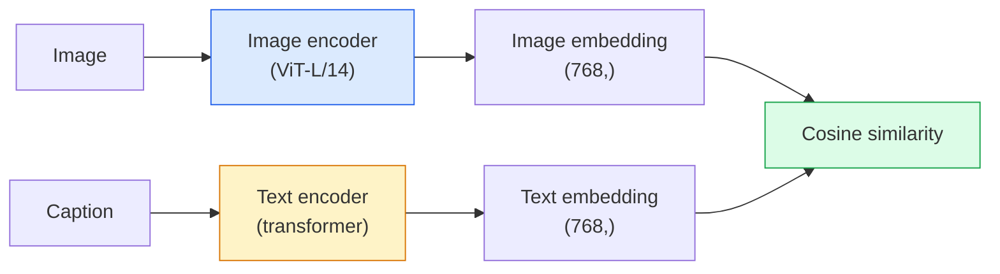

<!-- i18n:manual -->
# Зрение с открытым словарём — CLIP

> Обучите энкодер изображений и энкодер текста вместе так, чтобы совпадающие пары (картинка, подпись) попадали в одну точку общего пространства. В этом весь фокус.

**Type:** Build + Use
**Languages:** Python
**Prerequisites:** Phase 4 Lesson 14 (ViT), Phase 4 Lesson 17 (Self-Supervised)
**Time:** ~45 minutes

## Learning Objectives

- Объяснить двухбашенную архитектуру CLIP и контрастивную цель обучения
- Использовать предобученный CLIP (или SigLIP) для zero-shot классификации без какого-либо обучения под задачу
- Реализовать zero-shot классификацию с нуля: закодировать prompt классов, посчитать cosine similarity, взять argmax
- Различать CLIP, SigLIP, OpenCLIP и модели LLaVA / LLaMA-vision — для чего нужна каждая в 2026 году

> 🎒 **На пальцах.** Обычный классификатор — это анкета с готовыми галочками: 1000 классов, и ни одного нового. CLIP — это анкета с пустой строкой: напишите словами, что ищете, и модель ответит. Новый класс добавляется одним предложением, без единой размеченной картинки.

## The Problem

Традиционные классификаторы работают с закрытым словарём: модель ImageNet на 1000 классов умеет предсказывать только эти 1000 меток. Каждая новая категория требует размеченных данных и переобученной головы.

CLIP (Radford et al., OpenAI 2021) показал, что обучение на 400 млн пар (картинка, подпись), собранных из интернета, даёт модель, которая на инференсе умеет классифицировать в любой набор категорий, описанный обычным языком. Новый класс вы задаёте, написав предложение.

Именно эта способность — zero-shot перенос — причина, по которой любая современная система зрения начинается с чекпоинта из семейства CLIP. Детекция (Grounding DINO, OWL-ViT), сегментация (CLIPSeg, SAM), поиск, модерация контента, VLM и генерация картинок по тексту — всё это построено на совместных embedding в стиле CLIP.

> 🎒 **На пальцах.** Посчитайте разницу в цене. Чтобы модель ImageNet научилась распознавать «поддон с трещиной», нужно собрать и разметить хотя бы тысячу фотографий. Чтобы это же сделал CLIP, нужно написать строку «a photo of a cracked pallet». Ноль картинок, ноль часов разметки — отсюда и слово zero-shot.

## The Concept

### Two towers



Оба энкодера заканчиваются линейной проекцией в одну и ту же размерность embedding (512 для CLIP-B/32, 768 для CLIP-L/14, 1024 для более крупных OpenCLIP ViT-H/14 и ViT-g/14). Нормируем по L2 и считаем cosine similarity.

> 🎒 **На пальцах.** Две башни — как два переводчика, работающих в один общий язык. Один переводит картинки, второй — предложения, и оба выдают вектор одной и той же длины: 768 чисел у ViT-L/14, 512 у B/32, 1024 у самых крупных моделей OpenCLIP. Важно не конкретное число, а то, что оно совпадает у обеих башен — иначе скалярное произведение просто не посчитать. После этого «похожа ли картинка на подпись» превращается в измерение угла между двумя стрелками. Дальше вся магия — это арифметика.

### The objective

Дан батч из N пар (картинка, подпись); строим матрицу похожести N×N. Обучаем оба энкодера так, чтобы на диагонали (совпадающие пары) похожесть была высокой, а вне диагонали (несовпадающие) — низкой.

```
sim_matrix = image_embeddings @ text_embeddings.T / tau

loss_i2t = cross_entropy(sim_matrix,       targets=arange(N))
loss_t2i = cross_entropy(sim_matrix.T,     targets=arange(N))
loss = (loss_i2t + loss_t2i) / 2
```

Симметрично, потому что работать должен и поиск текста по картинке, и поиск картинки по тексту. `tau` (temperature) обычно обучается как скалярный параметр с начальным значением 0.07.

> 🎒 **На пальцах.** Представьте матрицу 8×8 при батче из 8 пар: 8 клеток на диагонали — правильные ответы, остальные 56 клеток — «мимо». Каждый шаг обучения тянет диагональ вверх и все 56 остальных вниз. Обучение здесь — это просто задача «угадай, какая подпись к какой картинке», решаемая миллионы раз подряд.

### SigLIP: a better loss

SigLIP (Zhai et al., 2023) заменил softmax на сигмоиду для каждой пары:

```
loss = mean over pairs of log(1 + exp(-y_ij * (s * sim_ij + b)))
y_ij = +1 if matching, -1 otherwise
s    = learned scale (positive), b = learned bias, initialised strongly negative
```

Потеря на каждую пару убирает нормализацию по всему батчу, которая нужна CLIP. Обучаемый bias `b` здесь не украшение: в батче N×N всего N позитивов против N² − N негативов, и bias с сильно отрицательной инициализацией не даёт этому дисбалансу забить градиент на старте. Без него потеря плохо обучается именно на маленьких батчах, ради которых SigLIP и придумали. При равных данных SigLIP догоняет CLIP или превосходит его.

> 🎒 **На пальцах.** Softmax в CLIP — это конкурс: каждая клетка сравнивается со всем рядом, и если ряд короткий (батч 64 вместо 32 000), сигнал слабый. Сигмоида в SigLIP спрашивает про каждую клетку отдельно: «совпадает или нет, да или нет». Такой вопрос не зависит от длины ряда — поэтому SigLIP учится и на скромном железе. Но есть подвох: в матрице 8×8 правильных ответов 8, а неправильных 56, и если спрашивать про каждую клетку честно и независимо, модель быстро выучит выгодную стратегию «всегда отвечай нет» — она права в 56 случаях из 64. Bias `b` — это как раз поправка на эту нечестную ставку: он начинается с большого минуса, то есть модель заранее говорит «нет» по умолчанию, и градиенту остаётся учить только то, что действительно интересно — где надо сказать «да».

### Zero-shot classification

Дан обученный CLIP:

1. Для каждого класса составьте prompt: "a photo of a {class}".
2. Закодируйте все prompt классов текстовым энкодером -> `T` формы (C, d).
3. Закодируйте тестовую картинку -> `I` формы (1, d).
4. Похожесть = `I @ T.T` формы (1, C).
5. Argmax -> предсказанный класс.

Проработка prompt имеет значение. OpenAI опубликовал 80 шаблонов prompt для ImageNet («a photo of a {}», «a blurry photo of a {}», «a sketch of a {}», ...). Усреднение embedding всех шаблонов по классу даёт дополнительные 1-3% top-1 accuracy.

> 🎒 **На пальцах.** Классификация здесь — это пять строк и одно умножение матриц. Для 10 классов CLIP-B/32 матрица `T` имеет форму (10, 512), картинка — (1, 512), произведение — (1, 10) — десять чисел, из которых берём максимум. Никакого обучения: вся «модель классификатора» — это десять предложений, закодированных заранее.

### Where CLIP-style models are used in 2026

- **Zero-shot classification** — прямое использование.
- **Image retrieval** — закодировать все картинки один раз, запрос кодировать на инференсе.
- **Text-conditioned detection** — Grounding DINO и OWL-ViT оборачивают текстовую башню CLIP вокруг детектора.
- **Text-conditioned segmentation** — CLIPSeg; SAM принимает текстовые подсказки через CLIP.
- **VLMs** — LLaVA, Qwen-VL, InternVL вставляют визуальный энкодер из семейства CLIP в LLM.
- **Text-to-image gen** — Stable Diffusion и DALL-E 3 обусловливаются текстовыми embedding CLIP.

Как только у вас есть общее пространство embedding, любая задача «зрение + язык» становится вычислением расстояния.

> 🎒 **На пальцах.** Обратите внимание, что во всех шести пунктах используется одна и та же операция — скалярное произведение нормированных векторов. Меняются только вход и то, что делают с результатом. Поэтому поиск по миллиону картинок стоит одно умножение матриц, а не миллион прогонов модели.

```figure
clip-contrastive
```

## Build It

### Step 1: A tiny two-tower model

Настоящий CLIP — это ViT плюс трансформер. В этом уроке башни — маленькие MLP поверх заранее извлечённых признаков, чтобы сигнал обучения был виден на CPU.

```python
import torch
import torch.nn as nn
import torch.nn.functional as F


class TwoTower(nn.Module):
    def __init__(self, img_in=128, txt_in=64, emb=64):
        super().__init__()
        self.image_proj = nn.Sequential(nn.Linear(img_in, 128), nn.ReLU(), nn.Linear(128, emb))
        self.text_proj = nn.Sequential(nn.Linear(txt_in, 128), nn.ReLU(), nn.Linear(128, emb))
        self.logit_scale = nn.Parameter(torch.ones([]) * 2.6592)  # ln(1/0.07)

    def forward(self, img_feats, txt_feats):
        i = F.normalize(self.image_proj(img_feats), dim=-1)
        t = F.normalize(self.text_proj(txt_feats), dim=-1)
        return i, t, self.logit_scale.exp()
```

Две проекции, выход общей размерности, обучаемая temperature. Та же форма, что у настоящего API CLIP.

> 🎒 **На пальцах.** Число 2.6592 — это не магия, а ln(1/0.07): логарифм обратной температуры 0.07 из статьи CLIP. Параметр хранят в логарифме, чтобы после `.exp()` он всегда оставался положительным. Так temperature обучается вместе с весами и не может случайно уйти в ноль или в минус.

### Step 2: Contrastive loss

```python
def clip_loss(image_emb, text_emb, logit_scale):
    N = image_emb.size(0)
    sim = logit_scale * image_emb @ text_emb.T
    targets = torch.arange(N, device=sim.device)
    l_i = F.cross_entropy(sim, targets)
    l_t = F.cross_entropy(sim.T, targets)
    return (l_i + l_t) / 2
```

Симметрично. Больше logit_scale = острее softmax = увереннее, но выше риск нестабильности.

> 🎒 **На пальцах.** Две строки кросс-энтропии — это один и тот же вопрос с двух сторон: «какая подпись подходит этой картинке» и «какая картинка подходит этой подписи». Матрица одна, транспонирование бесплатное, а модель учится вдвое надёжнее. Среднее из двух потерь и есть весь loss CLIP.

### Step 3: Zero-shot classifier

```python
@torch.no_grad()
def zero_shot_classify(model, image_feats, class_text_feats, class_names):
    """
    image_feats:      (N, img_in)
    class_text_feats: (C, txt_in)   one averaged embedding per class
    """
    i = F.normalize(model.image_proj(image_feats), dim=-1)
    t = F.normalize(model.text_proj(class_text_feats), dim=-1)
    sim = i @ t.T
    pred = sim.argmax(dim=-1)
    return [class_names[p] for p in pred.tolist()]
```

Одна строка на шаг. Это в точности та же процедура zero-shot, которую применяют с продакшн-чекпоинтом CLIP.

> 🎒 **На пальцах.** Заметьте, что здесь нет ни одного обучаемого шага — только `normalize`, умножение матриц и `argmax`. Если картинок 100, а классов 5, то `sim` имеет форму (100, 5), и argmax по последней оси даёт 100 предсказаний. Весь «классификатор» — это пять строк текста, закодированных заранее.

### Step 4: Sanity check

```python
torch.manual_seed(0)
model = TwoTower()

img = torch.randn(8, 128)
txt = torch.randn(8, 64)
i, t, scale = model(img, txt)
loss = clip_loss(i, t, scale)
print(f"batch size: {i.size(0)}   loss: {loss.item():.3f}")
```

Потеря должна быть близка к `log(N) = log(8) = 2.08` для случайно инициализированной модели — это цель симметричной кросс-энтропии, когда структура ещё не выучена.

> 🎒 **На пальцах.** Проверьте руками: натуральный логарифм 8 ≈ 2.079. Это значение «модель тыкает наугад в 8 вариантов». Если после часа обучения потеря всё ещё 2.08 — модель не выучила ничего; если она упала до 0.5 — диагональ уже заметно выше остальных клеток.

## Use It

OpenCLIP — выбор сообщества по умолчанию в 2026 году:

```python
import open_clip
import torch
from PIL import Image

model, _, preprocess = open_clip.create_model_and_transforms("ViT-B-32", pretrained="laion2b_s34b_b79k")
tokenizer = open_clip.get_tokenizer("ViT-B-32")

image = preprocess(Image.open("dog.jpg")).unsqueeze(0)
text = tokenizer(["a photo of a dog", "a photo of a cat", "a photo of a car"])

with torch.no_grad():
    image_features = model.encode_image(image)
    text_features = model.encode_text(text)
    image_features = image_features / image_features.norm(dim=-1, keepdim=True)
    text_features = text_features / text_features.norm(dim=-1, keepdim=True)
    probs = (100.0 * image_features @ text_features.T).softmax(dim=-1)

print(probs)
```

SigLIP новее, лучше обучается на малых масштабах и предпочтителен для новых проектов: `google/siglip-base-patch16-224`. Hugging Face выкладывает обе модели.

> 🎒 **На пальцах.** Множитель 100.0 перед softmax — это ровно 1/0.07 ≈ 14.3, округлённое вверх и зашитое в код примера. Без него значения cosine similarity лежат в диапазоне от −1 до 1, softmax по трём классам выдал бы что-то вроде 0.34 / 0.33 / 0.33, и всё выглядело бы как случайное угадывание.

## Ship It

Этот урок производит:

- `outputs/prompt-zero-shot-class-picker.md` — промпт, который проектирует шаблоны классов для zero-shot CLIP по списку классов и предметной области.
- `outputs/skill-image-text-retriever.md` — навык, который строит индекс embedding изображений на любом чекпоинте CLIP и поддерживает запрос текстом и запрос картинкой.

## Exercises

1. **(Easy)** Возьмите предобученный OpenCLIP ViT-B/32 и сделайте zero-shot классификацию на CIFAR-10 с набором из 80 шаблонов prompt. Сообщите top-1 accuracy; она должна быть около 85-90%.
2. **(Medium)** Сравните один шаблон («a photo of a {}») с усреднёнными embedding по 80 шаблонам на той же задаче CIFAR-10. Измерьте разрыв и объясните, почему шаблоны помогают.
3. **(Hard)** Постройте индекс zero-shot поиска картинок: закодируйте 1000 изображений через CLIP, соберите индекс FAISS, делайте запросы описанием на естественном языке. Сообщите recall@5 для 20 отложенных запросов, написанных вами вручную.

> 🎒 **На пальцах.** Подсказка ко второму заданию: усреднение шаблонов работает как усреднение нескольких замеров одним градусником. Один prompt задаёт одно случайное направление в пространстве, 80 prompt дают среднее направление с меньшим шумом. Ожидайте прирост порядка 1-3 пунктов top-1 — небольшой, но бесплатный.

## Key Terms

| Term | What people say | What it actually means |
|------|----------------|----------------------|
| Two-tower | «Двойной энкодер» | Отдельные энкодеры картинок и текста, заканчивающиеся проекционной головой в общую размерность |
| Zero-shot | «Без обучения под задачу» | Классификация в классы, описанные только текстом на инференсе; ни одной метки не тронуто |
| Temperature / logit_scale | «tau» | Обучаемый скаляр, масштабирующий матрицу похожести перед softmax |
| Prompt template | «A photo of a {}» | Языковая обёртка вокруг имён классов; усреднение многих шаблонов повышает zero-shot accuracy |
| CLIP | «Модель картинка+текст» | Модель OpenAI 2021 года; словарь всей области в 2026 году |
| SigLIP | «CLIP на сигмоиде» | Меняет softmax на сигмоиду для каждой пары плюс добавляет обучаемый bias, компенсирующий дисбаланс негативов и позитивов; лучше обучается на маленьких батчах |
| OpenCLIP | «Открытое воспроизведение» | Обученные сообществом варианты CLIP на LAION; продакшн-стандарт для open-source пайплайнов |
| VLM | «Визуально-языковая модель» | Энкодер из семейства CLIP плюс LLM, обученные отвечать на вопросы по картинкам |

## Further Reading

- [CLIP: Learning Transferable Visual Models from Natural Language Supervision (Radford et al., 2021)](https://arxiv.org/abs/2103.00020)
- [SigLIP: Sigmoid Loss for Language-Image Pre-Training (Zhai et al., 2023)](https://arxiv.org/abs/2303.15343)
- [OpenCLIP](https://github.com/mlfoundations/open_clip) — кодовая база сообщества
- [DINOv2 vs CLIP vs MAE: a features comparison](https://huggingface.co/blog/dinov2) — гайд HF с параллельным сравнением сценариев использования
