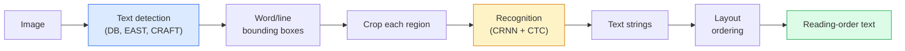

<!-- i18n:manual -->
# OCR и понимание документов

> OCR — это конвейер из трёх шагов: найти рамки с текстом, распознать символы, разложить их по порядку чтения. Любая современная система OCR либо меняет порядок этих шагов, либо сливает их в один.

**Type:** Learn + Use
**Languages:** Python
**Prerequisites:** Phase 4 Lesson 06 (Detection), Phase 7 Lesson 02 (Self-Attention)
**Time:** ~45 minutes

## Learning Objectives

- Проследить классический конвейер OCR (detect -> recognise -> layout) и современные end-to-end альтернативы (Donut, Qwen-VL-OCR)
- Реализовать CTC loss (Connectionist Temporal Classification) для обучения OCR как задачи sequence-to-sequence
- Использовать PaddleOCR или EasyOCR для разбора документов в продакшене без обучения
- Различать OCR, layout parsing и понимание документов — и выбирать под задачу правильный инструмент

> 🎒 **На пальцах.** Представьте, что вы читаете чужой рукописный конспект. Сначала глаза находят, где вообще строчки. Потом вы разбираете буквы в каждой строчке. И только потом понимаете, что вот это сверху — заголовок, а вот это снизу — итоговая сумма. Три шага, и компьютер делает ровно те же три.

## The Problem

Изображения, полные текста, повсюду: чеки, счета, паспорта, отсканированные книги, анкеты, доски, вывески, скриншоты. Извлечь из них структурированные данные — не просто символы, а «вот это итоговая сумма» — одна из самых денежных прикладных задач компьютерного зрения.

Область делится на три уровня навыков:

1. **OCR proper**: превратить пиксели в текст.
2. **Layout parsing**: сгруппировать выход OCR в области (заголовок, тело, таблица, колонтитул).
3. **Document understanding**: извлечь из разметки структурированные поля («invoice_total = $42.50»).

У каждого уровня есть классический и современный подход, и разрыв между «хочу текст с картинки» и «мне нужна итоговая сумма с этого чека» больше, чем думает большинство команд.

> 🎒 **На пальцах.** Разница как между «прочитать вслух» и «понять». Ребёнок может бегло прочитать счёт за электричество и не сказать, сколько платить. Первый уровень — чтение символов, третий — ответ на вопрос «сколько платить». Между ними лежит целый уровень: понять, где на листе что расположено.

## The Concept

### The classical pipeline



- **Text detection** выдаёт четырёхугольники вокруг строк или слов.
- **Recognition** обрезает каждую область до фиксированной высоты и прогоняет CNN + BiLSTM + CTC, получая последовательность символов.
- **Layout** восстанавливает порядок чтения (сверху вниз и слева направо для латиницы; иначе для арабского и японского).

> 🎒 **На пальцах.** Конвейер как сортировка почты. Сначала находят конверты на столе (detection), потом читают адрес на каждом (recognition), потом раскладывают по ящикам в нужном порядке (layout). Ошибка на первом шаге не чинится на третьем: не нашли конверт — адрес никто не прочитает.

### CTC in one paragraph

Распознавание в OCR выдаёт последовательность переменной длины из карты признаков фиксированной длины. CTC (Graves et al., 2006) позволяет обучать это без выравнивания по символам. Модель на каждом шаге времени выдаёт распределение по (словарь + blank); CTC loss суммирует вероятности по всем выравниваниям, которые после склейки повторов и удаления blank дают нужный текст.

```
raw output: "h h h _ _ e e l l _ l l o _ _"
after merge repeats and remove blanks: "hello"
```

CTC — причина, по которой CRNN заработал в 2015-м и до сих пор, в 2026-м, обучает большинство продакшен-моделей OCR.

> 🎒 **На пальцах.** В примере выше 15 шагов времени превращаются в 5 букв «hello». Обратите внимание на `l l _ l l`: blank между двумя парами «l» нужен, чтобы они не слиплись в одну букву. Без него получилось бы «helo». Символ blank — это не пробел, а знак «здесь я ничего не говорю».

> 🎒 **На пальцах.** Почему это вообще нужно: чтобы обучать иначе, пришлось бы для каждой картинки размечать, какой столбец пикселей какой букве соответствует. Для строки из 5 букв это 5 разметок вместо одной. CTC берёт на себя все варианты выравнивания сразу — вы даёте только картинку и строку «hello».

### Modern end-to-end models

- **Donut** (Kim et al., 2022) — энкодер ViT + текстовый декодер; читает изображение и сразу выдаёт JSON. Ни детектора текста, ни модуля layout.
- **TrOCR** — ViT + трансформерный декодер для построчного OCR.
- **Qwen-VL-OCR / InternVL** — полноценные vision-language модели, дообученные под задачи OCR; лучшая точность в 2026-м на сложных документах.
- **PaddleOCR** — классический конвейер DB + CRNN в зрелой продакшен-упаковке; всё ещё главная рабочая лошадка open source.

End-to-end модели требуют больше данных и вычислений, но избегают накопления ошибок многоступенчатого конвейера.

> 🎒 **На пальцах.** Накопление ошибок считается перемножением. Если детектор прав в 95% случаев, а распознавание — в 95%, то до конца доходит 0.95 × 0.95 ≈ 0.90. Три шага по 95% — уже 0.86. End-to-end модель делает один шаг, поэтому и множить нечего.

### Layout parsing

Для структурированных документов запускают детектор разметки (LayoutLMv3, DocLayNet), который размечает каждую область: Title, Paragraph, Figure, Table, Footnote. Порядок чтения тогда сводится к «пройти по областям в порядке layout и склеить».

Для форм используют модели **Key-Value extraction** (Donut для визуально насыщенных документов, LayoutLMv3 для простых сканов). Они принимают изображение + найденный текст + позиции и предсказывают структурированные пары ключ-значение.

> 🎒 **На пальцах.** Без layout текст из газетной полосы в две колонки склеится построчно поперёк колонок: первая строка левой колонки, первая строка правой, и так далее. Читать невозможно. Layout сначала говорит «это два блока», и только потом внутри каждого идёт обычный порядок сверху вниз.

### Evaluation metrics

- **Character Error Rate (CER)** — расстояние Левенштейна, делённое на длину эталона. Меньше — лучше. Продакшен-цель: < 2% на чистых сканах.
- **Word Error Rate (WER)** — то же самое, но на уровне слов.
- **F1 on structured fields** — для задач ключ-значение; проверяет, правильно ли появилось `{invoice_total: 42.50}`.
- **Edit distance on JSON** — для end-to-end разбора документов; статья про Donut ввела нормированное tree edit distance.

> 🎒 **На пальцах.** CER 2% на чеке из 500 символов — это примерно 10 неверных символов на документ. Звучит терпимо, пока одна из этих ошибок не попадёт в сумму: «42.50» превратится в «12.50». Поэтому по полям вроде суммы считают отдельный F1, а не общий CER.

```figure
cv3-ctc-collapse
```

## Build It

### Step 1: CTC loss + greedy decoder

```python
import torch
import torch.nn as nn
import torch.nn.functional as F


def ctc_loss(log_probs, targets, input_lengths, target_lengths, blank=0):
    """
    log_probs:      (T, N, C) log-softmax over vocab including blank at index 0
    targets:        (N, S) int targets (no blanks)
    input_lengths:  (N,) per-sample time steps used
    target_lengths: (N,) per-sample target length
    """
    return F.ctc_loss(log_probs, targets, input_lengths, target_lengths,
                      blank=blank, reduction="mean", zero_infinity=True)


def greedy_ctc_decode(log_probs, blank=0):
    """
    log_probs: (T, N, C) log-softmax
    returns: list of index sequences (blanks removed, repeats merged)
    """
    preds = log_probs.argmax(dim=-1).transpose(0, 1).cpu().tolist()
    out = []
    for seq in preds:
        decoded = []
        prev = None
        for idx in seq:
            if idx != prev and idx != blank:
                decoded.append(idx)
            prev = idx
        out.append(decoded)
    return out
```

`F.ctc_loss` использует эффективную реализацию CuDNN, когда та доступна. Жадный декодер проще, чем beam search, и обычно отстаёт от него не более чем на 1% CER.

> 🎒 **На пальцах.** Весь жадный декодер — два правила в цикле: «если тот же индекс, что и предыдущий — пропустить» и «если blank — пропустить». Для последовательности `h h h _ _ e ...` первая `h` попадает в ответ, вторая и третья отсекаются первым правилом, два `_` — вторым. Пятнадцать шагов схлопываются в пять букв без единой хитрости.

### Step 2: Tiny CRNN recogniser

Минимальный CNN + BiLSTM для построчного OCR.

```python
class TinyCRNN(nn.Module):
    def __init__(self, vocab_size=40, hidden=128, feat=32):
        super().__init__()
        self.cnn = nn.Sequential(
            nn.Conv2d(1, feat, 3, 1, 1), nn.BatchNorm2d(feat), nn.ReLU(inplace=True),
            nn.MaxPool2d(2),
            nn.Conv2d(feat, feat * 2, 3, 1, 1), nn.BatchNorm2d(feat * 2), nn.ReLU(inplace=True),
            nn.MaxPool2d(2),
            nn.Conv2d(feat * 2, feat * 4, 3, 1, 1), nn.BatchNorm2d(feat * 4), nn.ReLU(inplace=True),
            nn.MaxPool2d((2, 1)),
            nn.Conv2d(feat * 4, feat * 4, 3, 1, 1), nn.BatchNorm2d(feat * 4), nn.ReLU(inplace=True),
            nn.MaxPool2d((2, 1)),
        )
        self.rnn = nn.LSTM(feat * 4, hidden, bidirectional=True, batch_first=True)
        self.head = nn.Linear(hidden * 2, vocab_size)

    def forward(self, x):
        # x: (N, 1, H, W)
        f = self.cnn(x)                # (N, C, H', W')
        f = f.mean(dim=2).transpose(1, 2)  # (N, W', C)
        h, _ = self.rnn(f)
        return F.log_softmax(self.head(h).transpose(0, 1), dim=-1)  # (W', N, vocab)
```

Вход фиксированной высоты (CNN сжимает высоту пулингом почти до 1). Ширина — это ось времени для CTC.

> 🎒 **На пальцах.** Посчитаем, что делают четыре пулинга с картинкой 32 в высоту и 80 в ширину. Два `MaxPool2d(2)` режут обе стороны: 32 → 8, 80 → 20. Два `MaxPool2d((2, 1))` режут только высоту: 8 → 2, ширина остаётся 20. Итог: 20 шагов времени на строку «hello» из 5 букв, то есть по 4 «взгляда» на букву. Этого хватает, чтобы CTC разложил буквы по времени.

### Step 3: Synthetic OCR

Генерируем чёрные строки на белом фоне для сквозной проверки работоспособности.

```python
import numpy as np

def synthetic_line(text, height=32, char_width=16):
    W = char_width * len(text)
    img = np.ones((height, W), dtype=np.float32)
    for i, c in enumerate(text):
        x = i * char_width
        shade = 0.0 if c.isalnum() else 0.5
        img[6:height - 6, x + 2:x + char_width - 2] = shade
    return img


def build_batch(strings, vocab):
    H = 32
    W = 16 * max(len(s) for s in strings)
    imgs = np.ones((len(strings), 1, H, W), dtype=np.float32)
    target_lengths = []
    targets = []
    for i, s in enumerate(strings):
        imgs[i, 0, :, :16 * len(s)] = synthetic_line(s)
        ids = [vocab.index(c) for c in s]
        targets.extend(ids)
        target_lengths.append(len(ids))
    return torch.from_numpy(imgs), torch.tensor(targets), torch.tensor(target_lengths)


vocab = ["_"] + list("0123456789abcdefghijklmnopqrstuvwxyz")
imgs, targets, lengths = build_batch(["hello", "world"], vocab)
print(f"images: {imgs.shape}   targets: {targets.shape}   lengths: {lengths.tolist()}")
```

Настоящий датасет OCR добавляет шрифты, шум, повороты, размытие и цвет. Конвейер выше не меняется.

> 🎒 **На пальцах.** Прогоните `build_batch(["hello", "world"], vocab)` в голове: обе строки по 5 символов, `char_width=16`, значит W = 16 × 5 = 80, а тензор картинок будет (2, 1, 32, 80). Словарь — это 1 blank + 10 цифр + 26 букв = 37 классов. Именно 37 чисел модель выдаёт на каждом из 20 шагов времени.

### Step 4: Training sketch

```python
model = TinyCRNN(vocab_size=len(vocab))
opt = torch.optim.Adam(model.parameters(), lr=1e-3)

for step in range(200):
    strings = ["abc" + str(step % 10)] * 4 + ["xyz" + str((step + 1) % 10)] * 4
    imgs, targets, target_lens = build_batch(strings, vocab)
    log_probs = model(imgs)  # (W', 8, vocab)
    input_lens = torch.full((8,), log_probs.size(0), dtype=torch.long)
    loss = ctc_loss(log_probs, targets, input_lens, target_lens, blank=0)
    opt.zero_grad(); loss.backward(); opt.step()
```

Loss должен упасть примерно с 3 до 0.2 за 200 шагов на этих тривиальных синтетических данных.

> 🎒 **На пальцах.** Откуда берётся стартовая тройка: в начале модель ничего не знает и раздаёт всем 37 классам равные шансы, а −log(1/37) ≈ 3.6. Так что loss около 3 — это «модель угадывает». Падение до 0.2 означает, что нужный символ она ставит с вероятностью около 0.8.

> 🎒 **На пальцах.** Проверьте, что CTC вообще выполним: строка `"abc0"` — 4 символа, ширина картинки 16 × 4 = 64 пикселя, после пулингов остаётся 16 шагов времени. 16 ≥ 4, места хватает. Если шагов времени меньше, чем символов в цели, CTC loss уходит в бесконечность — отсюда флаг `zero_infinity=True`.

## Use It

Три продакшен-пути:

- **PaddleOCR** — зрелый, быстрый, многоязычный. Использование в одну строку: `paddleocr.PaddleOCR(lang="en").ocr(image_path)`.
- **EasyOCR** — на чистом Python, многоязычный, на бэкенде PyTorch.
- **Tesseract** — классика; до сих пор полезен на старых сканах, где модели буксуют.

Для сквозного разбора документов берите Donut или VLM:

```python
from transformers import DonutProcessor, VisionEncoderDecoderModel

processor = DonutProcessor.from_pretrained("naver-clova-ix/donut-base-finetuned-cord-v2")
model = VisionEncoderDecoderModel.from_pretrained("naver-clova-ix/donut-base-finetuned-cord-v2")
```

Для чеков, счетов и анкет с повторяющейся структурой дообучайте Donut. Для произвольных документов или OCR с рассуждением текущий выбор по умолчанию — VLM вроде Qwen-VL-OCR.

> 🎒 **На пальцах.** Простое правило выбора. Один формат документа и тысячи копий в день — берите PaddleOCR или дообученный Donut: дёшево и предсказуемо. Сто разных форматов по паре штук — берите VLM: платить за дообучение под каждый формат дороже, чем за токены.

## Ship It

Этот урок производит:

- `outputs/prompt-ocr-stack-picker.md` — промпт, который выбирает Tesseract / PaddleOCR / Donut / VLM-OCR по типу документа, языку и структуре.
- `outputs/skill-ctc-decoder.md` — навык, который пишет жадный и beam-search декодеры CTC с нуля, включая нормализацию по длине.

## Exercises

1. **(Easy)** Обучите TinyCRNN на случайных пятизначных числовых строках в течение 500 шагов. Посчитайте CER на отложенной выборке.
2. **(Medium)** Замените жадное декодирование на beam search (beam_width=5). Посчитайте разницу в CER. На каких входах beam search выигрывает?
3. **(Hard)** Прогоните PaddleOCR на 20 чеках, извлеките позиции и посчитайте F1 против размеченного вручную эталона для пар {item_name, price}.

> 🎒 **На пальцах.** Подсказка ко второму заданию: beam search выигрывает там, где жадный декодер уверенно ошибается на одном шаге и рушит всё слово. Классика — похожие символы: «0» против «O», «1» против «l». Если ваш словарь только из цифр, как в первом задании, разница будет почти нулевой — сначала добавьте буквы, иначе измерять будет нечего.

## Key Terms

| Term | What people say | What it actually means |
|------|----------------|----------------------|
| OCR | «Текст из пикселей» | Превращение областей изображения в последовательности символов |
| CTC | «Функция потерь без выравнивания» | Loss, обучающий модель последовательностей без меток на каждом шаге времени; суммирует по всем выравниваниям |
| CRNN | «Классическая модель OCR» | Свёрточный экстрактор признаков + BiLSTM + CTC; базовая модель 2015 года, до сих пор в продакшене |
| Donut | «Сквозной OCR» | Энкодер ViT + текстовый декодер; выдаёт JSON прямо из изображения |
| Layout parsing | «Найти области» | Найти и разметить области Title/Table/Figure/Paragraph в документе |
| Reading order | «Последовательность текста» | Порядок распознанных областей в связный текст; тривиален для латиницы, нетривиален для смешанных вёрсток |
| CER / WER | «Доли ошибок» | Расстояние Левенштейна, делённое на длину эталона, на уровне символов или слов |
| VLM-OCR | «LLM, которая читает» | Vision-language модель, обученная или запромптованная под задачи OCR; текущий SOTA на сложных документах |

## Further Reading

- [CRNN (Shi et al., 2015)](https://arxiv.org/abs/1507.05717) — исходная архитектура CNN+RNN+CTC
- [CTC (Graves et al., 2006)](https://www.cs.toronto.edu/~graves/icml_2006.pdf) — оригинальная статья про CTC; плотно набита алгоритмическими идеями
- [Donut (Kim et al., 2022)](https://arxiv.org/abs/2111.15664) — трансформер для понимания документов без OCR
- [PaddleOCR](https://github.com/PaddlePaddle/PaddleOCR) — продакшен-стек OCR с открытым исходным кодом
