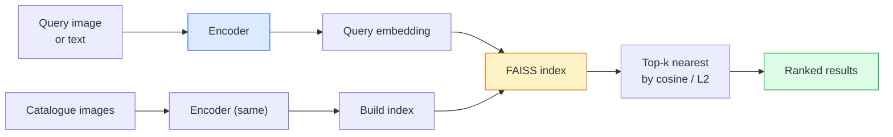

<!-- i18n:manual -->
# Поиск по изображениям и metric learning

> Система поиска ранжирует кандидатов по расстоянию в пространстве эмбеддингов. Metric learning — это дисциплина о том, как придать этому пространству форму, при которой расстояния значат то, что вам нужно.

**Type:** Build
**Languages:** Python
**Prerequisites:** Phase 4 Lesson 14 (ViT), Phase 4 Lesson 18 (CLIP)
**Time:** ~45 minutes

## Learning Objectives

- Объяснить triplet loss, contrastive и proxy-based функции потерь metric learning и выбрать подходящую под конкретный датасет
- Корректно реализовать L2-нормализацию и косинусную близость и различать поиск «тот же самый предмет» и «тот же класс»
- Собрать индекс FAISS, искать в нём по тексту и по картинке и посчитать recall@k на отложенном наборе запросов
- Использовать DINOv2, CLIP и SigLIP как готовые энкодеры и понимать, где каждый выигрывает

> 🎒 **На пальцах.** Поиск похожих картинок — это не «сравнить картинки», а «сравнить два списка чисел». Модель превращает каждое изображение в вектор, скажем из 64 чисел, а дальше вся задача — найти ближайшие векторы. Вся сложность в том, чтобы числа получились правильные.

## The Problem

Поиск встречается в продакшен-зрении повсюду: поиск дубликатов, обратный поиск по картинке, визуальный поиск («найти похожие товары»), повторная идентификация лиц, person re-ID для видеонаблюдения, сопоставление конкретных экземпляров для e-commerce. Продуктовый вопрос всегда один: «дано изображение-запрос, отранжируй мой каталог».

Систему определяют два решения. Эмбеддинг — какая модель делает векторы. Индекс — как искать ближайших соседей в масштабе. В 2026-м оба стали ширпотребом (DINOv2 для эмбеддинга, FAISS для индекса), и это поднимает планку: сложное здесь — определить, *что именно считается похожим* в вашей задаче, и придать пространству эмбеддингов такую форму, чтобы расстояния этому соответствовали.

Такое придание формы и есть metric learning. Дисциплина маленькая, но с огромным рычагом.

> 🎒 **На пальцах.** «Похожи» — слово с подвохом. Для магазина одежды две чёрные футболки разных брендов похожи, а для склада — это разные товары, и путать их нельзя. Одна и та же пара картинок, два противоположных правильных ответа. Модель не угадает, чего вы хотите, — ей нужно показать примеры.

## The Concept

### Retrieval at a glance



> 🎒 **На пальцах.** Ключевая деталь на схеме — надпись «Encoder (same)». Каталог и запрос обязаны проходить через одну и ту же модель. Если каталог проиндексирован старой версией энкодера, а запрос считается новой, расстояния станут бессмысленными: это как искать слово в словаре, напечатанном другим алфавитом.

### The four loss families

| Loss | Requires | Pros | Cons |
|------|----------|------|------|
| **Contrastive** | (anchor, positive) + negatives | Простая, работает с любой парной разметкой | Медленно сходится без большого числа негативов |
| **Triplet** | (anchor, positive, negative) | Интуитивна; прямой контроль margin | Hard-triplet mining дорого обходится |
| **NT-Xent / InfoNCE** | Pairs + batch-mined negatives | Масштабируется на большие батчи | Нужен большой батч или momentum queue |
| **Proxy-based (ProxyNCA)** | Class labels only | Быстро, стабильно, без mining | Может переобучиться на прокси при малых датасетах |

Для большинства продакшен-задач начните с предобученного backbone и добавляйте дообучение через metric learning, только если готовые эмбеддинги проседают на вашем тестовом наборе.

> 🎒 **На пальцах.** Смотрите на колонку Requires — она про то, сколько вам придётся размечать. Proxy-based нужны только метки классов: «это кроссовки Nike», и всё. Triplet нужны тройки: «эти два — одно и то же, а вот этот — другое». Для 10 000 картинок первое размечается за день, второе может занять неделю.

### Triplet loss formally

```
L = max(0, ||f(a) - f(p)||^2 - ||f(a) - f(n)||^2 + margin)
```

Притянуть якорь `a` к позитиву `p`, оттолкнуть от негатива `n`, с зазором `margin`, который гарантирует разрыв. Структура из трёх картинок обобщается на любой порядок похожести.

Mining имеет значение: лёгкие тройки (`n` уже далеко от `a`) дают нулевой loss; учат сеть только сложные. Semi-hard mining (`n` дальше, чем `p`, но в пределах margin) — рецепт FaceNet 2016 года, и он до сих пор доминирует.

> 🎒 **На пальцах.** Подставьте числа при margin = 0.2. Если d(a, p) = 0.3, а d(a, n) = 0.9, то 0.3 − 0.9 + 0.2 = −0.4, и `max(0, ...)` даёт ноль: эта тройка ничему не учит. А если d(a, n) = 0.4, получаем 0.3 − 0.4 + 0.2 = 0.1 — вот тут градиент и появляется. Именно поэтому hard negative mining нужен: без него 99% троек в батче дают ровно ноль.

### Cosine similarity vs L2

Две метрики, две договорённости:

- **Cosine**: угол между векторами. Требует L2-нормализованных эмбеддингов.
- **L2**: евклидово расстояние. Работает и на сырых, и на нормализованных эмбеддингах, но обычно идёт в паре с L2-нормализацией и квадратом L2.

Для большинства современных сетей эти две метрики эквивалентны: `||a - b||^2 = 2 - 2 cos(a, b)`, когда `||a|| = ||b|| = 1`. Выбирайте ту договорённость, которая совпадает с тем, как обучался ваш эмбеддинг; смешав их, вы молча меняете смысл слова «ближайший».

> 🎒 **На пальцах.** Проверьте формулу на числах. Два одинаковых нормализованных вектора: cos = 1, значит квадрат расстояния = 2 − 2 = 0. Косинус 0.9 даёт 2 − 1.8 = 0.2, то есть расстояние ≈ 0.45. Перпендикулярные векторы: cos = 0, расстояние = √2 ≈ 1.41. Порядок сортировки один и тот же, меняются только числа — но пороги вроде «считать дубликатом, если ближе 0.3» переносить между метриками нельзя.

### Recall@K

Стандартная метрика поиска:

```
recall@K = fraction of queries where at least one correct match is in the top K results
```

Показывайте recall@1, @5 и @10 рядом. Recall@10 выше 0.95 при recall@1 ниже 0.5 означает, что структура пространства эмбеддингов правильная, но ранжирование шумит — попробуйте дообучать дольше или добавить этап переранжирования.

Для поиска дубликатов важнее precision@K, потому что каждое ложное срабатывание видит пользователь. Для визуального поиска продуктовый сигнал — recall@k.

> 🎒 **На пальцах.** Разберите ту самую пару чисел. Recall@10 = 0.95 значит: из 100 запросов у 95 правильный ответ где-то в первой десятке. Recall@1 = 0.5 значит: но на первом месте он только у 50. То есть модель знает нужную картинку, просто ставит её то третьей, то седьмой. Чинится переранжированием топ-10, а не переобучением с нуля.

### FAISS in one paragraph

Facebook AI Similarity Search. Де-факто библиотека для поиска ближайших соседей. Три варианта индекса:

- `IndexFlatIP` / `IndexFlatL2` — полный перебор, точный, обучать не нужно. До ~1M векторов.
- `IndexIVFFlat` — разбить на K ячеек, искать только в ближайших нескольких. Приближённый, быстрый, требует данных для обучения.
- `IndexHNSW` — на графе, быстрее всех при большом числе запросов, индекс занимает много памяти.

Для 100k векторов вам, скорее всего, подойдёт `IndexFlatIP` на косинусной близости. Для 10M нужен `IndexIVFFlat`. Для 100M+ — в связке с product quantisation (`IndexIVFPQ`).

> 🎒 **На пальцах.** Полный перебор — это буквально сравнить запрос со всеми. Для 100 000 векторов по 64 числа это 6.4 млн умножений на запрос: современный процессор проглотит их за миллисекунды. Для 10 млн векторов это уже 640 млн умножений на каждый запрос — вот тут и переходят на `IndexIVFFlat`, который смотрит только в несколько ячеек из тысячи и экономит порядок-другой.

### Instance-level vs category-level retrieval

Две очень разные задачи с одним названием:

- **Category-level** — «найти кошек в моём каталоге». Похожесть на уровне класса; готовые эмбеддинги CLIP / DINOv2 работают хорошо.
- **Instance-level** — «найти *вот этот конкретный товар* в моём каталоге». Нужно тонко различать визуально похожие объекты одного класса; готовые эмбеддинги проседают, дообучение через metric learning решает.

Всегда спрашивайте, какую из двух задач вы решаете, до выбора модели.

> 🎒 **На пальцах.** Вернитесь к двум чёрным футболкам. Category-level скажет «обе — футболки» и будет прав. Instance-level должен заметить логотип размером в 30 пикселей и сказать «разные». Готовая модель, обученная отличать кошек от собак, на такое просто не смотрит — она этот логотип усредняет в ноль.

```figure
metric-embedding
```

## Build It

### Step 1: Triplet loss

```python
import torch
import torch.nn.functional as F

def triplet_loss(anchor, positive, negative, margin=0.2):
    d_ap = F.pairwise_distance(anchor, positive, p=2)
    d_an = F.pairwise_distance(anchor, negative, p=2)
    return F.relu(d_ap - d_an + margin).mean()
```

Одна строка. Работает и на L2-нормализованных, и на сырых эмбеддингах.

> 🎒 **На пальцах.** `F.relu` здесь и есть тот самый `max(0, ...)` из формулы. Если тройка лёгкая, relu обнуляет её вклад, и в среднее по батчу она входит нулём. При батче 32, где полезны только 4 тройки, средний loss окажется примерно в 8 раз меньше, чем «настоящий» по этим четырём — ещё одна причина отбирать тройки, а не брать подряд.

### Step 2: Semi-hard mining

Дан батч эмбеддингов и меток — найти для каждого якоря самый сложный semi-hard негатив.

```python
def semi_hard_negatives(emb, labels, margin=0.2):
    dist = torch.cdist(emb, emb)
    same_class = labels[:, None] == labels[None, :]
    diff_class = ~same_class
    N = emb.size(0)

    positives = dist.clone()
    positives[~same_class] = float("-inf")
    positives.fill_diagonal_(float("-inf"))
    pos_idx = positives.argmax(dim=1)

    semi_hard = dist.clone()
    semi_hard[same_class] = float("inf")
    d_ap = dist[torch.arange(N), pos_idx].unsqueeze(1)
    semi_hard[dist <= d_ap] = float("inf")
    neg_idx = semi_hard.argmin(dim=1)

    fallback_mask = semi_hard[torch.arange(N), neg_idx] == float("inf")
    if fallback_mask.any():
        hardest = dist.clone()
        hardest[same_class] = float("inf")
        neg_idx = torch.where(fallback_mask, hardest.argmin(dim=1), neg_idx)
    return pos_idx, neg_idx
```

Каждый якорь получает самый сложный позитив своего класса и semi-hard негатив, который дальше позитива, но в пределах margin.

> 🎒 **На пальцах.** Все эти `float("inf")` — способ «выключить» неподходящих кандидатов перед `argmin`. Ставим бесконечность на свой класс (негатив не может быть своим), потом ещё и на всё, что ближе позитива. Что осталось конечным — те самые semi-hard. Если не осталось ничего (маска `fallback_mask`), берём просто самый близкий чужой — иначе шаг обучения пропал бы впустую.

### Step 3: Recall@K

```python
def recall_at_k(query_emb, gallery_emb, query_labels, gallery_labels, k=1):
    sim = query_emb @ gallery_emb.T
    _, top_k = sim.topk(k, dim=-1)
    matches = (gallery_labels[top_k] == query_labels[:, None]).any(dim=-1)
    return matches.float().mean().item()
```

Top-k по скалярному произведению на L2-нормализованных эмбеддингах совпадает с top-k по косинусу. Считайте среднюю долю запросов, у которых есть хотя бы один правильный сосед.

> 🎒 **На пальцах.** `matches.float().mean()` — просто доля единиц. Сто запросов, у 87 в топ-k нашёлся правильный сосед: 87 / 100 = 0.87. Слово «хотя бы один» здесь важное: если из десяти правильных ответов модель нашла один, recall@k всё равно засчитает единицу.

### Step 4: Putting it together

```python
import torch
import torch.nn as nn
from torch.optim import Adam

class Encoder(nn.Module):
    def __init__(self, in_dim=128, emb_dim=64):
        super().__init__()
        self.net = nn.Sequential(
            nn.Linear(in_dim, 128), nn.ReLU(),
            nn.Linear(128, emb_dim),
        )

    def forward(self, x):
        return F.normalize(self.net(x), dim=-1)

torch.manual_seed(0)
num_classes = 6
protos = F.normalize(torch.randn(num_classes, 128), dim=-1)

def sample_batch(bs=32):
    labels = torch.randint(0, num_classes, (bs,))
    x = protos[labels] + 0.15 * torch.randn(bs, 128)
    return x, labels

enc = Encoder()
opt = Adam(enc.parameters(), lr=3e-3)

for step in range(200):
    x, y = sample_batch(32)
    emb = enc(x)
    pos_idx, neg_idx = semi_hard_negatives(emb, y)
    loss = triplet_loss(emb, emb[pos_idx], emb[neg_idx])
    opt.zero_grad(); loss.backward(); opt.step()
```

После нескольких сотен шагов кластеры эмбеддингов складываются в один кластер на класс.

> 🎒 **На пальцах.** Данные тут игрушечные, но честные: 6 случайных прототипов в 128 измерениях плюс шум 0.15. Энкодер сжимает 128 чисел до 64 и нормализует их `F.normalize`, то есть кладёт все точки на единичную сферу. Задача обучения — собрать 32 точки батча в 6 кучек на этой сфере, и 200 шагов с lr 3e-3 на это хватает.

## Use It

Продакшен-стеки в 2026-м:

- **DINOv2 + FAISS** — универсальный визуальный поиск. Работает из коробки.
- **CLIP + FAISS** — когда запросы текстовые.
- **Fine-tuned DINOv2 + FAISS** — поиск конкретных экземпляров, повторная идентификация лиц, мода, e-commerce.
- **Milvus / Weaviate / Qdrant** — управляемые векторные БД поверх FAISS или HNSW.

Для SOTA-поиска конкретных экземпляров рецепт такой: backbone DINOv2, добавить голову эмбеддинга, дообучить с triplet loss или InfoNCE на парах с разметкой по экземплярам, проиндексировать в FAISS.

> 🎒 **На пальцах.** Обратите внимание, что во всех четырёх строчках вторая половина одна и та же — FAISS или HNSW под капотом. Меняется только энкодер. Это и значит «индекс стал ширпотребом»: выбор модели решает качество, выбор индекса — только скорость и счёт за железо.

## Ship It

Этот урок производит:

- `outputs/prompt-retrieval-loss-picker.md` — промпт, который выбирает triplet / InfoNCE / ProxyNCA под конкретную задачу поиска.
- `outputs/skill-recall-at-k-runner.md` — навык, который пишет аккуратный каркас оценки recall@k с разбиением train/val/gallery и внятным контрактом данных.

## Exercises

1. **(Easy)** Запустите игрушечный пример выше. Нарисуйте эмбеддинги через PCA до и после обучения, чтобы увидеть, как складываются шесть кластеров.
2. **(Medium)** Добавьте реализацию ProxyNCA: один обучаемый «прокси» на класс, обычная кросс-энтропия по косинусной близости. Сравните скорость сходимости с triplet loss на игрушечных данных.
3. **(Hard)** Возьмите 1000 валидационных изображений ImageNet, посчитайте эмбеддинги через DINOv2 из HuggingFace, соберите плоский индекс FAISS и посчитайте recall@{1, 5, 10} против тех же изображений в роли запросов (должно быть 1.0) и против отложенной части с метками ImageNet в роли эталона.

> 🎒 **На пальцах.** Подсказка к третьему заданию: первый прогон — это проверка проводки, а не качества. Каждая картинка ищет саму себя, ближайший сосед — она же, расстояние 0, recall@1 обязан быть ровно 1.0. Получили 0.98 — ищите баг: перепутанный порядок индексов, забытая нормализация или индекс, собранный не на тех векторах. И только когда первый прогон даёт 1.0, вторые числа что-то значат.

## Key Terms

| Term | What people say | What it actually means |
|------|----------------|----------------------|
| Metric learning | «Придать пространству форму» | Обучение энкодера так, чтобы расстояния в его выходном пространстве отражали нужную похожесть |
| Triplet loss | «Притянуть и оттолкнуть» | L = max(0, d(a, p) - d(a, n) + margin); каноническая функция потерь metric learning |
| Semi-hard mining | «Полезные негативы» | Негативы дальше от якоря, чем позитив, но в пределах margin; эмпирически самые информативные |
| Proxy-based loss | «Прототипы классов» | Один обучаемый прокси на класс; кросс-энтропия по близости к прокси; без отбора пар |
| Recall@K | «Доля попаданий в топ-K» | Доля запросов, у которых хотя бы один правильный результат попал в первые K |
| Instance retrieval | «Найти именно эту вещь» | Тонкое сопоставление; готовые признаки обычно проседают |
| FAISS | «Библиотека для ближайших соседей» | Библиотека Facebook для поиска соседей; поддерживает точные и приближённые индексы |
| HNSW | «Графовый индекс» | Hierarchical navigable small world; быстрый приближённый поиск соседей с малым перерасходом памяти |

## Further Reading

- [FaceNet: A Unified Embedding for Face Recognition (Schroff et al., 2015)](https://arxiv.org/abs/1503.03832) — статья про triplet loss и semi-hard mining
- [In Defense of the Triplet Loss for Person Re-Identification (Hermans et al., 2017)](https://arxiv.org/abs/1703.07737) — практическое руководство по дообучению с triplet loss
- [FAISS documentation](https://github.com/facebookresearch/faiss/wiki) — каждый индекс и каждый компромисс
- [SMoT: Metric Learning Taxonomy (Kim et al., 2021)](https://arxiv.org/abs/2010.06927) — обзор современных функций потерь и связей между ними
