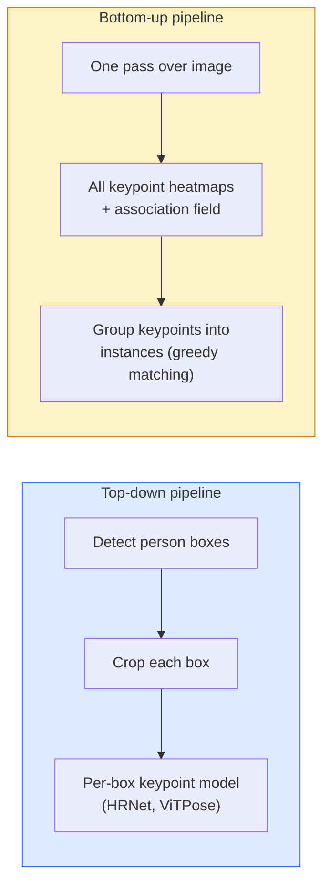

<!-- i18n:manual -->
# Детекция keypoint и оценка позы

> Поза — это упорядоченный набор keypoint. Детектор keypoint — это регрессор heatmap. Всё остальное — бухгалтерия.

**Type:** Build
**Languages:** Python
**Prerequisites:** Phase 4 Lesson 06 (Detection), Phase 4 Lesson 07 (U-Net)
**Time:** ~45 minutes

## Learning Objectives

- Различать top-down и bottom-up оценку позы и понимать, когда применяется каждый подход
- Предсказывать heatmap для K keypoint с гауссовой целью на каждый keypoint и извлекать координаты на инференсе
- Объяснить Part Affinity Fields (PAF) и то, как bottom-up конвейеры собирают keypoint в отдельные объекты
- Использовать MediaPipe Pose или MMPose для оценки keypoint в продакшене и понимать формат их выхода

> 🎒 **На пальцах.** Поза человека в COCO — это всего 17 точек: нос, плечи, локти, запястья, бёдра, колени, ступни и так далее. Вся «оценка позы» сводится к тому, чтобы выдать 17 пар координат. Скелетик, который вы видите поверх видео, рисуется поверх этих 17 точек линиями — модель линий не предсказывает.

## The Problem

Задачи про keypoint прячутся под кучей названий: поза человека (17 суставов), точки лица (68 или 478), кисть руки (21 точка), поза животных, поза объектов для робота, анатомические ориентиры в медицине. У всех одна и та же структура: найти K дискретных точек на объекте и выдать их координаты (x, y).

Оценка позы — фундамент захвата движения, фитнес-приложений, спортивной аналитики, управления жестами, анимации, AR-примерочных и роботизированного захвата. Двумерный случай зрелый; 3D-поза (оценка положения суставов в мировых координатах по одной камере) — текущий рубеж исследований.

Инженерный вопрос — масштаб. Поза одного человека на одном кадре — задача на 20 мс. Поза множества людей в толпе на 30 fps — другая задача с другими архитектурами.

> 🎒 **На пальцах.** Разница в арифметике. Top-down конвейер на кадре с 1 человеком делает 1 прогон модели позы; на кадре с 20 людьми — 20 прогонов. При бюджете 33 мс на кадр (это и есть 30 fps) на каждого человека остаётся меньше 1.6 мс. Отсюда и берутся bottom-up архитектуры.

## The Concept

### Top-down vs bottom-up



- **Top-down** — сначала найти людей, потом прогнать модель keypoint по каждому вырезу. Максимальная точность; время растёт линейно с числом людей.
- **Bottom-up** — один прямой проход предсказывает все keypoint плюс поле связей; дальше их группируют. Постоянное время независимо от размера толпы.

Top-down (HRNet, ViTPose) лидирует по точности; bottom-up (OpenPose, HigherHRNet) лидирует по пропускной способности на людных сценах.

> 🎒 **На пальцах.** Top-down выигрывает по точности потому, что каждый человек в вырезе растягивается на полное разрешение входа. Человек ростом 80 пикселей в кадре 1080p после вырезания и масштабирования до 256×192 занимает весь вход — модель видит его локти крупным планом. Bottom-up смотрит на весь кадр сразу, и те же локти остаются на 80 пикселях.

### Heatmap regression

Вместо того чтобы предсказывать `(x, y)` напрямую, предсказывают heatmap размера `H x W` на каждый keypoint с гауссовым пятном в истинной точке.

```
target[k, y, x] = exp(-((x - cx_k)^2 + (y - cy_k)^2) / (2 sigma^2))
```

На инференсе argmax каждого heatmap и есть предсказанное положение keypoint.

Почему heatmap работает лучше прямой регрессии: пространственная структура сети (карта признаков свёртки) естественно совпадает с пространственным выходом. Гауссовы цели ещё и регуляризуют — маленькая ошибка локализации даёт маленький loss, а не ноль.

> 🎒 **На пальцах.** Разница между «назови число 32» и «покажи пальцем на карте». Прямая регрессия просит сеть выдать число, хотя внутри у неё карта пикселей. Heatmap просит подсветить нужный пиксель — задача того же вида, что и вход. Плюс градиент осмысленный: ошиблись на 2 пикселя — получили небольшой штраф, а не «неверно».

### Sub-pixel localisation

Argmax даёт целые координаты. Для субпиксельной точности уточняют, подгоняя параболу по argmax и его соседям, или используют известный сдвиг на четверть пикселя `(dx, dy) = 0.25 * sign(heatmap[y, x+1] - heatmap[y, x-1], ...)` — фиксированный шаг в четверть пикселя в сторону более яркого соседа. Берут именно **знак** разности, а не саму разность: сырые значения масштабируют сдвиг на амплитуду heatmap и на уверенных предсказаниях уносят оценку далеко от пика.

> 🎒 **На пальцах.** Считайте, что это цена округления. На heatmap 64×64 один пиксель — это 1/64 ≈ 1.6% ширины кадра. Для человека ростом 1.8 м в полный рост ошибка округления запястья — около 3 см. Для фитнес-приложения, считающего угол в локте, эти 3 см — уже пара градусов.

### Part Affinity Fields (PAFs)

Приём OpenPose для группировки в bottom-up. Для каждой пары связанных keypoint (например, левое плечо и левый локоть) предсказывается двухканальное поле, кодирующее единичный вектор от одной точки к другой. Чтобы связать плечо с его локтем, интегрируют PAF вдоль отрезка между кандидатами; пара с наибольшим интегралом и считается совпадением.

```
For each connection (limb):
  PAF channels: 2 (unit vector x, y)
  Line integral: sum over sample points of (PAF . line_direction)
  Higher integral = stronger match
```

Изящно и масштабируется на толпу любого размера без вырезов по людям.

> 🎒 **На пальцах.** На кадре два человека, у каждого есть плечо и локоть — значит четыре варианта соединения, из них два правильные. PAF решает спор так: вдоль правильного отрезка «плечо-локоть» поле указывает туда же, куда идёт отрезок, и интеграл получается большой. Отрезок, ведущий к чужому локтю, идёт поперёк поля, интеграл близок к нулю. Расстояние тут не помогло бы: чужой локоть вполне может оказаться ближе.

### COCO keypoints

Стандартный датасет поз человека: 17 keypoint на человека, метрики PCK (Percentage of Correct Keypoints) и OKS (Object Keypoint Similarity). OKS — аналог IoU для keypoint, и именно его показывает COCO mAP@OKS.

> 🎒 **На пальцах.** PCK устроен просто: точка засчитана, если она ближе некоторого порога к истинной, обычно доли размера головы или бокса. 17 точек, 15 попали в порог — PCK = 15/17 ≈ 0.88. OKS хитрее: он даёт разным суставам разный допуск, потому что разметчики размечают нос куда точнее, чем бедро.

### 2D vs 3D

- **2D pose** — координаты на изображении; решено на продакшен-уровне (MediaPipe, HRNet, ViTPose).
- **3D pose** — мировые или камерные координаты; всё ещё активные исследования. Типичные подходы:
  - Поднять 2D-предсказания в 3D маленьким MLP (VideoPose3D).
  - Прямая регрессия 3D из изображения (PyMAF, MHFormer).
  - Многокамерные установки (CMU Panoptic) для получения эталона.

> 🎒 **На пальцах.** Почему 3D по одной камере сложно: глубина принципиально неоднозначна. Рука, вытянутая вперёд к камере, на картинке выглядит короткой — ровно как согнутая рука. Из одного кадра эти два случая неразличимы; спасают только знание анатомии, движение во времени или вторая камера.

```figure
cv3-pose-heatmap
```

## Build It

### Step 1: Gaussian heatmap target

```python
import numpy as np
import torch

def gaussian_heatmap(size, cx, cy, sigma=2.0):
    yy, xx = np.meshgrid(np.arange(size), np.arange(size), indexing="ij")
    return np.exp(-((xx - cx) ** 2 + (yy - cy) ** 2) / (2 * sigma ** 2)).astype(np.float32)

hm = gaussian_heatmap(64, 32, 32, sigma=2.0)
print(f"peak: {hm.max():.3f} at ({hm.argmax() % 64}, {hm.argmax() // 64})")
```

Heatmap по каждому keypoint, сложенные вдоль оси каналов, дают полный целевой тензор.

> 🎒 **На пальцах.** Подставьте sigma = 2.0 и посчитайте, как быстро гаснет пятно. В самом центре значение 1.0. На расстоянии 2 пикселя: exp(−4/8) ≈ 0.61. На 4 пикселях: exp(−16/8) ≈ 0.14. На 6 пикселях уже 0.01. То есть «полезное» пятно занимает круг радиусом примерно 3σ = 6 пикселей, всё остальное поле — почти нули.

### Step 2: Tiny keypoint head

Модель в стиле U-Net, выдающая K каналов heatmap.

```python
import torch.nn as nn
import torch.nn.functional as F

class TinyKeypointNet(nn.Module):
    def __init__(self, num_keypoints=4, base=16):
        super().__init__()
        self.down1 = nn.Sequential(nn.Conv2d(3, base, 3, 2, 1), nn.ReLU(inplace=True))
        self.down2 = nn.Sequential(nn.Conv2d(base, base * 2, 3, 2, 1), nn.ReLU(inplace=True))
        self.mid = nn.Sequential(nn.Conv2d(base * 2, base * 2, 3, 1, 1), nn.ReLU(inplace=True))
        self.up1 = nn.ConvTranspose2d(base * 2, base, 2, 2)
        self.up2 = nn.ConvTranspose2d(base, num_keypoints, 2, 2)

    def forward(self, x):
        h1 = self.down1(x)
        h2 = self.down2(h1)
        h3 = self.mid(h2)
        u1 = self.up1(h3)
        return self.up2(u1)
```

Вход `(N, 3, H, W)`, выход `(N, K, H, W)`. Loss — попиксельный MSE против гауссовых целей.

> 🎒 **На пальцах.** Проследите размеры для входа 64×64. `down1` со stride 2 даёт 32×32, `down2` — 16×16, `mid` ничего не меняет, `up1` возвращает 32×32, `up2` — 64×64, но уже с 4 каналами вместо 3. Каналы на выходе — это не цвета, а по одному слою на keypoint: канал 0 — первая точка, канал 3 — четвёртая.

### Step 3: Inference — extract keypoint coordinates

```python
def heatmap_to_coords(heatmaps):
    """
    heatmaps: (N, K, H, W)
    returns:  (N, K, 2) float coordinates in image pixels
    """
    N, K, H, W = heatmaps.shape
    hm = heatmaps.reshape(N, K, -1)
    idx = hm.argmax(dim=-1)
    ys = (idx // W).float()
    xs = (idx % W).float()
    return torch.stack([xs, ys], dim=-1)

coords = heatmap_to_coords(torch.randn(2, 4, 32, 32))
print(f"coords: {coords.shape}")  # (2, 4, 2)
```

Одна строка на инференсе. Для субпиксельного уточнения интерполируйте вокруг argmax.

> 🎒 **На пальцах.** Весь фокус в двух операциях после `argmax`. Heatmap разворачивают в один длинный вектор длиной H×W, находят индекс максимума, а потом восстанавливают координаты: `idx // W` — это номер строки, `idx % W` — номер столбца. Для 32×32 индекс 100 даёт y = 100 // 32 = 3 и x = 100 % 32 = 4.

### Step 4: Synthetic keypoint dataset

Просто: нарисовать четыре точки на белом холсте и научиться их предсказывать.

```python
def make_synthetic_sample(size=64, rng=None):
    # Генератор принимаем аргументом, чтобы seed контролировал вызывающий код;
    # свежий default_rng() внутри функции делает датасет невоспроизводимым.
    rng = rng if rng is not None else np.random.default_rng()
    img = np.ones((3, size, size), dtype=np.float32)
    kps = rng.integers(8, size - 8, size=(4, 2))
    for cx, cy in kps:
        img[:, cy - 2:cy + 2, cx - 2:cx + 2] = 0.0
    hms = np.stack([gaussian_heatmap(size, cx, cy) for cx, cy in kps])
    return img, hms, kps
```

Достаточно просто, чтобы крошечная модель выучила это за минуту.

> 🎒 **На пальцах.** Обратите внимание на `rng.integers(8, size - 8)`: точки никогда не появляются ближе 8 пикселей к краю холста 64×64. Это не педантизм, а необходимость — гауссово пятно радиусом 6 пикселей у самого края обрезалось бы, и модель училась бы на половинках пятен. В настоящих датасетах ту же проблему решают паддингом.

### Step 5: Training

```python
torch.manual_seed(0)
rng = np.random.default_rng(0)

model = TinyKeypointNet(num_keypoints=4)
opt = torch.optim.Adam(model.parameters(), lr=3e-3)

for step in range(200):
    batch = [make_synthetic_sample(rng=rng) for _ in range(16)]
    imgs = torch.from_numpy(np.stack([b[0] for b in batch]))
    hms = torch.from_numpy(np.stack([b[1] for b in batch]))
    pred = model(imgs)
    # Страховка, а не upsample: две свёртки со stride 2 и две транспонированные
    # свёртки с коэффициентом 2 уже возвращают полное разрешение, так что при H и W,
    # кратных 4, эта строка ничего не делает. Работа находится только для входов
    # с некратными размерами.
    pred = F.interpolate(pred, size=hms.shape[-2:], mode="bilinear", align_corners=False)
    loss = F.mse_loss(pred, hms)
    opt.zero_grad(); loss.backward(); opt.step()
```

> 🎒 **На пальцах.** Строка с `F.interpolate` здесь страховка: она растягивает предсказание до размера целей. Для входа 64×64 выход модели и так 64×64, и эта строка ничего не делает. Но настоящие модели вроде HRNet выдают heatmap вчетверо меньше входа (например, 256×192 на входе и 64×48 на выходе) — там без растягивания или пересчёта координат не обойтись.

> 🎒 **На пальцах.** Ещё одна ловушка MSE на heatmap: почти всё поле — нули. На картинке 64×64 это 4096 пикселей, из которых заметно ненулевых примерно сотня вокруг четырёх пятен. Модель, предсказывающая ровно ноль везде, уже получает довольно низкий loss. Именно поэтому в продакшене heatmap иногда взвешивают или переходят на другие функции потерь.

## Use It

- **MediaPipe Pose** — продакшен-оценщик позы от Google; поставляется с WebGL- и мобильными рантаймами и задержкой меньше 10 мс.
- **MMPose** (OpenMMLab) — исчерпывающая исследовательская кодовая база; каждая SOTA-архитектура с предобученными весами.
- **YOLOv8-pose** — самая быстрая поза для нескольких людей в реальном времени за один прямой проход.
- **transformers HumanDPT / PoseAnything** — более новые vision-language подходы к позе с открытым словарём (любой объект, любой набор keypoint).

> 🎒 **На пальцах.** Сопоставьте эти 10 мс с бюджетом кадра. При 30 fps на кадр есть 33 мс, значит MediaPipe тратит меньше трети и оставляет запас на всё остальное — камеру, отрисовку, вашу логику. Именно поэтому в браузерных и мобильных фитнес-приложениях он стоит почти везде.

## Ship It

Этот урок производит:

- `outputs/prompt-pose-stack-picker.md` — промпт, который выбирает MediaPipe / YOLOv8-pose / HRNet / ViTPose по требованиям к задержке, размеру толпы и необходимости 2D или 3D.
- `outputs/skill-heatmap-to-coords.md` — навык, который пишет процедуру субпиксельного перевода heatmap в координаты, используемую в любой продакшен-модели позы.

## Exercises

1. **(Easy)** Обучите крошечную модель keypoint на синтетическом датасете из 4 точек. Посчитайте среднюю L2-ошибку между предсказанными и истинными keypoint после 200 шагов.
2. **(Medium)** Добавьте субпиксельное уточнение: по положению argmax подгоните одномерную параболу вдоль x и вдоль y по соседним пикселям. Посчитайте прирост точности относительно целочисленного argmax.
3. **(Hard)** Соберите синтетический датасет на двух «людей», где на каждом изображении два экземпляра узора из 4 keypoint. Обучите bottom-up конвейер с PAF, предсказывающими, какой keypoint какому экземпляру принадлежит, и оцените OKS.

> 🎒 **На пальцах.** Подсказка ко второму заданию: сначала измерьте, что вообще можно выиграть. Целочисленный argmax ошибается в среднем примерно на 0.25-0.5 пикселя из-за округления, и субпиксельное уточнение убирает именно эту часть. Если ваша модель после 200 шагов промахивается на 3 пикселя, выигрыш утонет в шуме — сначала доучите модель до ошибки около 1 пикселя, и только потом сравнивайте.

## Key Terms

| Term | What people say | What it actually means |
|------|----------------|----------------------|
| Keypoint | «Ориентир» | Конкретная упорядоченная точка на объекте (сустав, угол, характерная деталь) |
| Pose | «Скелет» | Упорядоченный набор keypoint, принадлежащих одному объекту |
| Top-down | «Сначала найти, потом поза» | Двухэтапный конвейер: детектор людей + модель keypoint на каждый вырез; максимальная точность |
| Bottom-up | «Сначала поза, группировка потом» | Предсказание всех keypoint за один проход + группировка; время не зависит от размера толпы |
| Heatmap | «Гауссова цель» | Тензор H x W на каждый keypoint с пиком в истинной точке; предпочтительная цель для регрессии |
| PAF | «Part Affinity Field» | Двухканальное поле единичных векторов, кодирующее направления конечностей; служит для группировки keypoint по объектам |
| OKS | «IoU для keypoint» | Object Keypoint Similarity; метрика COCO для позы |
| HRNet | «High-Resolution Net» | Доминирующая top-down архитектура для keypoint; сохраняет высокое разрешение признаков на всём пути |

## Further Reading

- [OpenPose (Cao et al., 2017)](https://arxiv.org/abs/1812.08008) — bottom-up с PAF; до сих пор лучшее описание подхода
- [HRNet (Sun et al., 2019)](https://arxiv.org/abs/1902.09212) — эталонная top-down архитектура
- [ViTPose (Xu et al., 2022)](https://arxiv.org/abs/2204.12484) — обычный ViT как backbone для позы; текущий SOTA на многих бенчмарках
- [MediaPipe Pose](https://developers.google.com/mediapipe/solutions/vision/pose_landmarker) — продакшен-поза в реальном времени; самый быстрый развёрнутый стек в 2026-м
