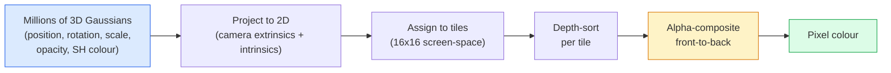

<!-- i18n:manual -->
# 3D Gaussian Splatting с нуля

> Сцена — это облако из миллионов трёхмерных гауссиан. У каждой есть позиция, ориентация, масштаб, непрозрачность и цвет, который зависит от направления взгляда. Растеризуйте их, пропустите градиенты назад через rasterization — готово.

**Type:** Build
**Languages:** Python
**Prerequisites:** Phase 4 Lesson 13 (3D Vision & NeRF), Phase 1 Lesson 12 (Tensor Operations), Phase 4 Lesson 10 (Diffusion basics optional)
**Time:** ~90 minutes

## Learning Objectives

- Объяснить, почему в 2026 году 3D Gaussian Splatting вытеснил NeRF и стал продакшн-стандартом фотореалистичной 3D-реконструкции
- Назвать шесть параметров одной гауссианы (позиция, кватернион поворота, масштаб, непрозрачность, цвет в базисе сферических гармоник, опциональный feature) и сколько float даёт каждый
- Написать с нуля 2D-растеризатор gaussian splatting на `alpha`-композитинге и показать, что 3D-случай после проекции сводится к тому же циклу
- Использовать `nerfstudio`, `gsplat` или `SuperSplat`, чтобы восстановить сцену по 20-50 фотографиям и экспортировать её в расширение glTF `KHR_gaussian_splatting` или в схему OpenUSD 26.03 `UsdVolParticleField3DGaussianSplat`

> 🎒 **На пальцах.** Представьте, что сцену рисуют не кистью по пикселям, а мазками полупрозрачной краски: каждый мазок — эллиптическое пятно с своим цветом и прозрачностью. Таких мазков в сцене 1-5 миллионов. Урок про то, как их расставить автоматически — градиентным спуском.

## The Problem

NeRF хранит сцену как веса MLP. Каждый отрисованный пиксель — это сотни запросов к MLP вдоль луча. Обучение занимает часы, рендер — секунды, а веса нельзя редактировать: чтобы подвинуть стул внутри сцены, придётся переобучать модель.

3D Gaussian Splatting (Kerbl, Kopanas, Leimkühler, Drettakis, SIGGRAPH 2023) заменил всё это. Сцена — явный набор трёхмерных гауссиан. Рендер — обычная GPU-rasterization на 100+ fps. Обучение занимает минуты. Редактирование прямое: сдвиньте подмножество гауссиан — и стул переехал. К 2026 году Khronos Group ратифицировала расширение glTF для gaussian splat, OpenUSD 26.03 поставляется со схемой для splat, Zillow и Apartments.com рендерят так недвижимость, а большинство новых статей по 3D-реконструкции — вариации базовой идеи 3DGS.

Модель в голове простая, но движущихся частей в математике достаточно, поэтому большинство введений начинают с rasterization и проскакивают проекции и сферические гармоники. Этот урок собирает всю конструкцию целиком — сначала 2D-версию, потом расширение до 3D.

> 🎒 **На пальцах.** Разница как между рецептом и готовыми ингредиентами. NeRF — это рецепт: чтобы узнать цвет одной точки, надо каждый раз «готовить» сотни запросов к сети. 3DGS — это уже разложенные по столу продукты: цвет просто лежит в параметрах гауссианы, бери и рисуй. Отсюда и разрыв: часы обучения против минут, секунды на кадр против 100+ кадров в секунду.

## The Concept

### What a Gaussian carries

Одна 3D-гауссиана — это параметрический сгусток в пространстве со следующими атрибутами:

```
position         mu         (3,)    centre in world coordinates
rotation         q          (4,)    unit quaternion encoding orientation
scale            s          (3,)    log-scales per axis (exponentiated at render time)
opacity          alpha      (1,)    post-sigmoid opacity [0, 1]
SH coefficients  c_lm       (3 * (L+1)^2,)   view-dependent colour
```

Поворот и масштаб вместе задают матрицу ковариации 3x3: `Sigma = R S S^T R^T`. Это и есть форма гауссианы в 3D. Сферические гармоники позволяют цвету меняться вместе с направлением взгляда — блики, лёгкий отблеск, зависящее от ракурса свечение — и при этом не хранить отдельную текстуру под каждый ракурс. При степени SH 3 получается 16 коэффициентов на цветовой канал, то есть 48 float на одну гауссиану только под цвет.

В типичной сцене 1-5 миллионов гауссиан. Каждая хранит примерно 60 float (3 + 4 + 3 + 1 + 48 + мелочь). По 4 байта на float это 240 байт на гауссиану, то есть около 1,2 ГБ на сцену из пяти миллионов гауссиан в float32 — именно поэтому сцены, которые где-то публикуют, почти всегда квантуют (половинная точность или урезанная степень SH) до нескольких сотен мегабайт.

> 🎒 **На пальцах.** Сложите числа из блока сами: 3 (позиция) + 4 (кватернион) + 3 (масштаб) + 1 (непрозрачность) + 48 (цвет) = 59. Почти всё место съедает цвет — 48 из 59, то есть больше 80%. Теперь переведите в байты: 60 float × 4 байта = 240 байт на гауссиану, 5 миллионов гауссиан × 240 байт ≈ 1,2 ГБ. Такое в браузер не отдашь, поэтому и квантуют. Самая дешёвая экономия — снизить степень SH: при степени 0 остаётся 3 коэффициента вместо 48, и гауссиана худеет с 59 float до 14, то есть сцена — примерно до 280 МБ. Расплата — цвет перестанет меняться с ракурсом, блики исчезнут. Перевод в float16 даёт ровно вдвое, зато ничего не ломает.

### Rasterisation, not ray marching



Пять шагов, и все они удобны для GPU. Никаких запросов к MLP на каждый пиксель. Одна RTX 3080 Ti рендерит 6 миллионов splat на 147 fps.

> 🎒 **На пальцах.** Тайлы 16x16 — это разбиение экрана на квадратики по 256 пикселей. Сортировать по глубине миллион гауссиан целиком дорого, а внутри одного тайла их обычно десятки — вот и весь трюк. И прикиньте бюджет времени: 147 fps означает примерно 6,8 миллисекунды на кадр на все 6 миллионов splat.

### The projection step

Трёхмерная гауссиана в мировой позиции `mu` с трёхмерной ковариацией `Sigma` проецируется в двумерную гауссиану в экранной позиции `mu'` с двумерной ковариацией `Sigma'`:

```
mu' = project(mu)
Sigma' = J W Sigma W^T J^T          (2 x 2)

W = viewing transform (rotation + translation of camera)
J = Jacobian of the perspective projection at mu'
```

След двумерной гауссианы на экране — эллипс, оси которого суть собственные векторы `Sigma'`. Каждый пиксель внутри этого эллипса получает вклад гауссианы с весом `exp(-0.5 * (p - mu')^T Sigma'^-1 (p - mu'))`.

> 🎒 **На пальцах.** Посветите фонариком на стену под углом — круглое пятно превратится в эллипс. Проекция делает ровно это: сжимает матрицу 3x3 в матрицу 2x2, а трёхмерный сгусток — в плоское пятно. Вес в центре эллипса равен exp(0) = 1, а на расстоянии одной сигмы — exp(-0.5) ≈ 0,61. Дальше вклад падает быстро, поэтому эллипс можно смело обрезать по границе примерно трёх сигм.

### The alpha-compositing rule

Для одного пикселя гауссианы, которые его накрывают, сортируются сзади наперёд (или, что то же самое, спереди назад с перевёрнутой формулой). Цвет смешивается тем же уравнением, что используют все полупрозрачные растеризаторы начиная с 1980-х:

```
C_pixel = sum_i alpha_i * T_i * c_i

T_i = prod_{j < i} (1 - alpha_j)       transmittance up to i
alpha_i = opacity_i * exp(-0.5 * d^T Sigma'^-1 d)   local contribution
c_i = eval_SH(SH_i, view_direction)    view-dependent colour
```

Это **то же самое уравнение, что и объёмный рендер NeRF**, только по явному разреженному набору гауссиан, а не по плотным сэмплам вдоль луча. Именно из-за этого совпадения качество картинки не уступает NeRF — обе схемы интегрируют одно и то же уравнение поля излучения.

> 🎒 **На пальцах.** Это стопка цветных стёкол перед глазом. Возьмём три гауссианы с `alpha` = 0,5 каждая. Первая пропускает через себя `T` = 1 и вносит 0,5. До второй доходит `T` = 0,5, её вклад 0,25. До третьей — `T` = 0,25, вклад 0,125. Сумма 0,875, а оставшиеся 0,125 — это то, что видно сквозь всю стопку, то есть фон.

### Why this is differentiable

Каждый шаг — проекция, раскладка по тайлам, alpha-композитинг, вычисление SH — дифференцируем по параметрам гауссиан. Взяли эталонное изображение, посчитали ошибку по пикселям, прогнали градиенты назад через растеризатор, обновили все `(mu, q, s, alpha, c_lm)` градиентным спуском. За примерно 30 000 итераций гауссианы находят свои правильные позиции, размеры и цвета.

### Densification and pruning

Фиксированный набор гауссиан не покроет сложную сцену. В обучение встроены два адаптивных механизма:

- **Clone** — продублировать гауссиану в текущей позиции, если градиент по ней большой, а масштаб маленький: реконструкции здесь не хватает деталей.
- **Split** — разбить крупную гауссиану на две поменьше, если градиент по ней большой: одна большая гауссиана слишком гладкая, чтобы описать этот участок.
- **Prune** — удалить гауссианы, у которых непрозрачность упала ниже порога: они ни на что не влияют.

Уплотнение запускается раз в N итераций. Обычно сцена растёт с примерно 100 тысяч начальных гауссиан (посеянных из точек SfM) до 1-5 миллионов к концу обучения.

> 🎒 **На пальцах.** Это как рисовать карандашом: где всё гладко — хватает пары широких штрихов, где мелкие детали — приходится штриховать часто. Рост со 100 тысяч до 1-5 миллионов — это увеличение в 10-50 раз. Причём модель сама решает, где «штриховать чаще»: сигналом служит величина градиента.

### Spherical harmonics in one paragraph

Зависящий от ракурса цвет — это функция `c(direction)` на единичной сфере. Сферические гармоники — это ряд Фурье для сферы. Обрежьте его на степени `L`, и получите `(L+1)^2` базисных функций на канал. Вычисление цвета для нового ракурса — скалярное произведение выученных коэффициентов SH на базис, посчитанный в направлении взгляда. Степень 0 = один коэффициент = постоянный цвет. Степень 3 = 16 коэффициентов = достаточно, чтобы поймать ламбертово затенение, блик и слабое отражение. Статьи по 3D Gaussian Splatting по умолчанию берут степень 3.

> 🎒 **На пальцах.** Проверьте формулу `(L+1)^2` руками: L = 0 даёт 1, L = 1 даёт 4, L = 2 даёт 9, L = 3 даёт 16. Каждая следующая степень добавляет всё более «мелкие» узоры на сфере — как высокие гармоники в звуке. Степень 0 — это просто «объект такого-то цвета», степень 3 — «а вот отсюда он ещё и блестит».

### The 2026 production stack

```
1. Capture         smartphone / DJI drone / handheld scanner
2. SfM / MVS       COLMAP or GLOMAP derives camera poses + sparse points
3. Train 3DGS      nerfstudio / gsplat / inria official / PostShot (~10-30 min on RTX 4090)
4. Edit            SuperSplat / SplatForge (clean floaters, segment)
5. Export          .ply -> glTF KHR_gaussian_splatting or .usd (OpenUSD 26.03)
6. View            Cesium / Unreal / Babylon.js / Three.js / Vision Pro
```

> 🎒 **На пальцах.** Шесть шагов, и лишь один из них (шаг 3) — обучение, те самые 10-30 минут на RTX 4090. Всё остальное — фотографии, COLMAP, чистка и экспорт. На практике время съёмки и подготовки данных часто больше времени обучения, и качество результата решается именно там.

### 4D and generative variants

- **4D Gaussian Splatting** — гауссианы становятся функциями времени; так делают объёмное видео (Superman 2026, клип A$AP Rocky «Helicopter»).
- **Generative splats** — модели text-to-splat (Marble от World Labs), которые придумывают сцену целиком.
- **3D Gaussian Unscented Transform** — вариант от NVIDIA NuRec для симуляции автономного вождения.

```figure
cv3-gaussian-splat
```

## Build It

### Step 1: A 2D Gaussian

Сначала соберём двумерный растеризатор. После проекции трёхмерный случай сводится к нему же.

```python
import math

import torch
import torch.nn as nn
import torch.nn.functional as F


def eval_2d_gaussian(means, covs, points):
    """
    means:  (G, 2)      centres
    covs:   (G, 2, 2)   covariance matrices
    points: (H, W, 2)   pixel coordinates
    returns: (G, H, W)  density at every pixel for every Gaussian
    """
    G = means.size(0)
    H, W, _ = points.shape
    flat = points.view(-1, 2)
    inv = torch.linalg.inv(covs)
    diff = flat[None, :, :] - means[:, None, :]
    d = torch.einsum("gpi,gij,gpj->gp", diff, inv, diff)
    density = torch.exp(-0.5 * d)
    return density.view(G, H, W)
```

`einsum` считает квадратичную форму `diff^T Sigma^-1 diff` для каждой пары (гауссиана, пиксель).

> 🎒 **На пальцах.** Прикиньте объём работы: 64 гауссианы на картинке 64x64 дают тензор плотностей 64 × 64 × 64 = 262 144 числа, и каждое — это отдельная квадратичная форма. Именно поэтому настоящие реализации не считают все пары подряд, а сначала выкидывают гауссианы, чей эллипс вообще не попадает в тайл.

### Step 2: 2D splatting rasteriser

Alpha-композитинг спереди назад. Глубина в 2D бессмысленна, поэтому для порядка используем обучаемый скаляр на каждую гауссиану.

```python
def rasterise_2d(means, covs, colours, opacities, depths, image_size):
    """
    means:     (G, 2)
    covs:      (G, 2, 2)
    colours:   (G, 3)
    opacities: (G,)     in [0, 1]
    depths:    (G,)     per-Gaussian scalar used for ordering
    image_size: (H, W)
    returns:   (H, W, 3) rendered image
    """
    H, W = image_size
    yy, xx = torch.meshgrid(
        torch.arange(H, dtype=torch.float32, device=means.device),
        torch.arange(W, dtype=torch.float32, device=means.device),
        indexing="ij",
    )
    points = torch.stack([xx, yy], dim=-1)

    densities = eval_2d_gaussian(means, covs, points)
    alphas = opacities[:, None, None] * densities
    alphas = alphas.clamp(0.0, 0.99)

    order = torch.argsort(depths)
    alphas = alphas[order]
    colours_sorted = colours[order]

    T = torch.ones(H, W, device=means.device)
    out = torch.zeros(H, W, 3, device=means.device)
    for i in range(means.size(0)):
        a = alphas[i]
        out += (T * a)[..., None] * colours_sorted[i][None, None, :]
        T = T * (1.0 - a)
    return out
```

Не быстро — настоящая реализация использует тайловые CUDA-ядра — но математика ровно та, что нужна, и всё полностью дифференцируемо.

> 🎒 **На пальцах.** Обратите внимание на `clamp(0.0, 0.99)`: `alpha` никогда не доходит до 1. Если бы дошла, `T` стала бы ровно нулём, и все гауссианы за ней перестали бы получать градиент — обучение для них умерло бы навсегда. Потолок 0,99 оставляет 1% света просачиваться дальше, и градиент продолжает течь.

### Step 3: A trainable 2D splat scene

```python
class Splats2D(nn.Module):
    def __init__(self, num_splats=128, image_size=64, seed=0):
        super().__init__()
        g = torch.Generator().manual_seed(seed)
        H, W = image_size, image_size
        self.means = nn.Parameter(torch.rand(num_splats, 2, generator=g) * torch.tensor([W, H]))
        self.log_scale = nn.Parameter(torch.ones(num_splats, 2) * math.log(2.0))
        self.rot = nn.Parameter(torch.zeros(num_splats))  # single angle in 2D
        self.colour_logits = nn.Parameter(torch.randn(num_splats, 3, generator=g) * 0.5)
        self.opacity_logit = nn.Parameter(torch.zeros(num_splats))
        self.depth = nn.Parameter(torch.rand(num_splats, generator=g))

    def covs(self):
        s = torch.exp(self.log_scale)
        c, si = torch.cos(self.rot), torch.sin(self.rot)
        R = torch.stack([
            torch.stack([c, -si], dim=-1),
            torch.stack([si, c], dim=-1),
        ], dim=-2)
        S = torch.diag_embed(s ** 2)
        return R @ S @ R.transpose(-1, -2)

    def forward(self, image_size):
        covs = self.covs()
        colours = torch.sigmoid(self.colour_logits)
        opacities = torch.sigmoid(self.opacity_logit)
        return rasterise_2d(self.means, covs, colours, opacities, self.depth, image_size)
```

`log_scale`, `opacity_logit` и `colour_logits` — это неограниченные параметры, которые в момент рендера пропускаются через нужную активацию. Так устроена каждая реализация 3DGS.

> 🎒 **На пальцах.** Зачем `log_scale`, а не просто `scale`: масштаб обязан быть положительным, а оптимизатор об этом не знает и легко загнал бы его в минус. Стартовое значение `math.log(2.0)` ≈ 0,693, и `exp(0.693)` возвращает 2 — то есть все splat начинают жизнь радиусом около двух пикселей. Та же логика с `sigmoid` для непрозрачности: `sigmoid(0)` = 0,5, старт ровно посередине диапазона.

### Step 4: Fit 2D Gaussians to a target image

```python
import numpy as np

def make_target(size=64):
    yy, xx = np.meshgrid(np.arange(size), np.arange(size), indexing="ij")
    img = np.zeros((size, size, 3), dtype=np.float32)
    # Red circle
    mask = (xx - 20) ** 2 + (yy - 20) ** 2 < 10 ** 2
    img[mask] = [1.0, 0.2, 0.2]
    # Blue square
    mask = (np.abs(xx - 45) < 8) & (np.abs(yy - 40) < 8)
    img[mask] = [0.2, 0.3, 1.0]
    return torch.from_numpy(img)


target = make_target(64)
model = Splats2D(num_splats=64, image_size=64)
opt = torch.optim.Adam(model.parameters(), lr=0.05)

for step in range(200):
    pred = model((64, 64))
    loss = F.mse_loss(pred, target)
    opt.zero_grad(); loss.backward(); opt.step()
    if step % 40 == 0:
        print(f"step {step:3d}  mse {loss.item():.4f}")
```

За 200 шагов 64 гауссианы укладываются в две фигуры. Это и есть вся идея — градиентный спуск по явным геометрическим примитивам.

> 🎒 **На пальцах.** Посчитаем, хватит ли splat. Красный круг радиуса 10 — это примерно 3,14 × 100 ≈ 314 пикселей, синий квадрат 16 × 16 = 256 пикселей, вместе около 570 из 4096 пикселей картинки. На 64 гауссианы приходится примерно по 9 пикселей закрашенной площади каждой — тесновато, но достаточно. Печать идёт каждые 40 шагов, то есть вы увидите ровно 5 строк: 0, 40, 80, 120, 160.

### Step 5: From 2D to 3D

Трёхмерное расширение сохраняет тот же цикл. Что добавляется:

1. Поворот каждой гауссианы задаётся кватернионом, а не одним углом.
2. Ковариация — это `R S S^T R^T`, где `R` собран из кватерниона, а `S = diag(exp(log_scale))`.
3. Проекция `(mu, Sigma) -> (mu', Sigma')` использует внешние параметры камеры и якобиан перспективной проекции в точке `mu`.
4. Цвет становится разложением по сферическим гармоникам; его вычисляют в направлении взгляда.
5. Сортировка по глубине идёт по настоящей координате z в системе камеры, а не по обучаемому скаляру.

Все продакшн-реализации (`gsplat`, `inria/gaussian-splatting`, `nerfstudio`) делают ровно это на GPU через тайловые CUDA-ядра.

> 🎒 **На пальцах.** Из пяти отличий по-настоящему новых только два: кватернион вместо угла (4 числа вместо 1) и сферические гармоники вместо фиксированного цвета (48 чисел вместо 3). Всё остальное — та же сортировка и то же смешивание. Поэтому если ваш двумерный растеризатор работает, вы уже понимаете 3DGS.

### Step 6: Spherical harmonics evaluation

Базис SH до степени 3 включительно содержит 16 членов на канал. Листинг ниже расписывает первые три полосы (степени 0, 1, 2 — коэффициенты с 0 по 8); полная версия на 16 членов лежит в `code/main.py` под именем `eval_sh_degree_3`.

```python
def eval_sh_degree_3(sh_coeffs, dirs):
    """
    sh_coeffs: (..., 16, 3)   full degree-3 set; this listing consumes only the first 9
    dirs:      (..., 3)       unit vectors
    returns:   (..., 3)
    """
    C0 = 0.282094791773878
    C1 = 0.488602511902920
    C2 = [1.092548430592079, 1.092548430592079,
          0.315391565252520, 1.092548430592079,
          0.546274215296039]
    x, y, z = dirs[..., 0], dirs[..., 1], dirs[..., 2]
    x2, y2, z2 = x * x, y * y, z * z
    xy, yz, xz = x * y, y * z, x * z

    result = C0 * sh_coeffs[..., 0, :]
    result = result - C1 * y[..., None] * sh_coeffs[..., 1, :]
    result = result + C1 * z[..., None] * sh_coeffs[..., 2, :]
    result = result - C1 * x[..., None] * sh_coeffs[..., 3, :]

    result = result + C2[0] * xy[..., None] * sh_coeffs[..., 4, :]
    result = result + C2[1] * yz[..., None] * sh_coeffs[..., 5, :]
    result = result + C2[2] * (2.0 * z2 - x2 - y2)[..., None] * sh_coeffs[..., 6, :]
    result = result + C2[3] * xz[..., None] * sh_coeffs[..., 7, :]
    result = result + C2[4] * (x2 - y2)[..., None] * sh_coeffs[..., 8, :]

    # Семь членов степени 3 (коэффициенты 9..15) здесь опущены для краткости.
    # Скопированная как есть, эта функция молча игнорирует sh_coeffs[..., 9:, :] и
    # возвращает цвет степени 2; для реальной работы берите полную версию из code/main.py.
    return result
```

Выученные `sh_coeffs` хранят «цвет во всех направлениях» для конкретной гауссианы. В момент рендера вы вычисляете их для текущего направления взгляда и получаете RGB-вектор из трёх чисел.

> 🎒 **На пальцах.** Первая строка — `C0 * sh_coeffs[..., 0, :]` — это весь цвет степени 0, тот самый постоянный, не зависящий от ракурса. Константа `C0` ≈ 0,2821 — это 1 / (2√π), нормировка базиса. Всё, что дописано ниже, лишь добавляет к нему поправки, которые меняются вместе с `x`, `y`, `z` направления взгляда. Форма тензора `(..., 16, 3)` — это 16 коэффициентов × 3 канала = 48 чисел, ровно те самые 48 float на цвет из начала урока. Но обратите внимание: сам листинг доходит только до коэффициента 8, то есть читает 9 из 16 и оставляет последние 7 нетронутыми. Формально функция примет тензор на 16 коэффициентов и вернёт результат без ошибки — просто это будет цвет степени 2, а не 3.

## Use It

Для настоящей работы с 3DGS берите `gsplat` (Meta) или `nerfstudio`:

```bash
pip install nerfstudio gsplat
ns-download-data example
ns-train splatfacto --data path/to/data
```

`splatfacto` — это тренер 3DGS в nerfstudio. На типичной сцене прогон занимает 10-30 минут на RTX 4090.

Варианты экспорта, которые имеют значение в 2026 году:

- `.ply` — сырое облако гауссиан (переносимое, самый большой файл).
- `.splat` — квантованный формат PlayCanvas / SuperSplat.
- glTF `KHR_gaussian_splatting` — стандарт Khronos, переносимый между вьюерами (RC от февраля 2026).
- OpenUSD `UsdVolParticleField3DGaussianSplat` — родной для USD, под пайплайны NVIDIA Omniverse и Vision Pro.

Для 4D и динамических сцен `4DGS` и `Deformable-3DGS` расширяют ту же машинерию средними и непрозрачностями, зависящими от времени.

## Ship It

Этот урок производит:

- `outputs/prompt-3dgs-capture-planner.md` — промпт, который планирует съёмку (сколько фотографий, какая траектория камеры, какой свет) под заданный тип сцены.
- `outputs/skill-3dgs-export-router.md` — скилл, который выбирает правильный формат экспорта (`.ply` / `.splat` / glTF / USD) под конечный вьюер или движок.

## Exercises

1. **(Easy)** Запустите тренер 2D-splat из урока на другой синтетической картинке. Меняйте `num_splats` по списку `[16, 64, 256]` и постройте график MSE от номера шага для каждого варианта. Найдите точку, после которой прирост качества перестаёт окупаться.
2. **(Medium)** Расширьте 2D-растеризатор так, чтобы цвет каждой гауссианы зависел от скалярного «угла обзора» через гармонику степени 2. Обучите на паре целевых картинок и убедитесь, что модель восстанавливает обе.
3. **(Hard)** Клонируйте `nerfstudio` и обучите `splatfacto` на 20 фотографиях любой доступной вам сцены (стол, растение, лицо, комната). Экспортируйте в glTF `KHR_gaussian_splatting` и откройте во вьюере (Three.js `GaussianSplats3D`, SuperSplat, Babylon.js V9). Отчитайтесь: время обучения, число гауссиан, fps при рендере.

> 🎒 **На пальцах.** Подсказка к первому заданию: считайте бюджет площади. На картинке 64x64 всего 4096 пикселей, а закрашено около 570. При 16 splat на каждую приходится примерно 36 пикселей — фигуры выйдут размытыми. При 256 splat — примерно 2 пикселя на splat, деталей уже больше, чем есть в цели, и MSE почти перестанет падать. Точка окупаемости обычно оказывается где-то посередине, около 64.

## Key Terms

| Term | What people say | What it actually means |
|------|----------------|----------------------|
| 3DGS | «Gaussian splats» | Явное представление сцены в виде миллионов трёхмерных гауссиан, у каждой своя позиция, поворот, масштаб, непрозрачность и цвет в базисе SH |
| Covariance | «Форма гауссианы» | `Sigma = R S S^T R^T`; ориентация и анизотропный масштаб одной гауссианы |
| Alpha compositing | «Смешивание сзади наперёд» | То же уравнение, что и в объёмном рендере NeRF, но по явному разреженному набору |
| Densification | «Клонировать и разбивать» | Адаптивное добавление новых гауссиан там, где реконструкция недообучена |
| Pruning | «Удалить полупрозрачные» | Убрать гауссианы, чья непрозрачность за время обучения схлопнулась почти в ноль |
| Spherical harmonics | «Цвет, зависящий от ракурса» | Базис Фурье на сфере; хранит цвет как функцию направления взгляда |
| Splatfacto | «3DGS в nerfstudio» | Самый простой способ обучить 3DGS в 2026 году |
| `KHR_gaussian_splatting` | «Стандарт glTF» | Расширение Khronos 2026 года, которое делает 3DGS переносимым между вьюерами и движками |

## Further Reading

- [3D Gaussian Splatting for Real-Time Radiance Field Rendering (Kerbl et al., SIGGRAPH 2023)](https://repo-sam.inria.fr/fungraph/3d-gaussian-splatting/) — оригинальная статья
- [gsplat (Meta/nerfstudio)](https://github.com/nerfstudio-project/gsplat) — растеризатор на CUDA продакшн-качества
- [nerfstudio Splatfacto](https://docs.nerf.studio/nerfology/methods/splat.html) — эталонный рецепт обучения
- [Khronos KHR_gaussian_splatting extension](https://github.com/KhronosGroup/glTF/blob/main/extensions/2.0/Khronos/KHR_gaussian_splatting/README.md) — переносимый формат 2026 года
- [OpenUSD 26.03 release notes](https://openusd.org/release/) — схема `UsdVolParticleField3DGaussianSplat`
- [THE FUTURE 3D State of Gaussian Splatting 2026](https://www.thefuture3d.com/blog-0/2026/4/4/state-of-gaussian-splatting-2026) — обзор индустрии
