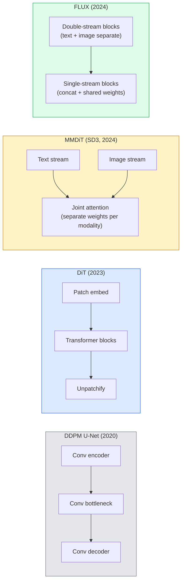

<!-- i18n:manual -->
# Diffusion Transformers и Rectified Flow

> U-Net — не секрет диффузии. Замените его трансформером, поменяйте расписание шума на прямолинейный поток — и вдруг у вас SD3, FLUX и вообще любая text-to-image модель 2026 года.

**Type:** Learn + Build
**Languages:** Python
**Prerequisites:** Phase 4 Lesson 10 (Diffusion DDPM), Phase 4 Lesson 14 (ViT), Phase 7 Lesson 02 (Self-Attention)
**Time:** ~75 minutes

## Learning Objectives

- Проследить эволюцию от U-Net DDPM (урок 10) к Diffusion Transformer (DiT), MMDiT (SD3) и single+double-stream DiT (FLUX)
- Объяснить rectified flow: почему прямолинейная траектория между шумом и данными позволяет модели сэмплировать за 20 шагов вместо 1000
- Реализовать крошечный DiT-блок и цикл обучения rectified flow, каждый меньше 100 строк
- Различать варианты моделей (SD3, FLUX.1-dev, FLUX.1-schnell, Z-Image, Qwen-Image) по архитектуре, числу параметров и лицензии

> 🎒 **На пальцах.** Два независимых изменения, и оба простые. Первое: выкинуть свёрточный U-Net и поставить на его место трансформер — тот же, что в ViT. Второе: вместо кривой траектории «данные → шум» провести прямую линию. Прямая короче кривой, поэтому по ней можно идти большими шагами: 20 вместо 1000.

## The Problem

В уроке 10 мы построили DDPM с деноизером на U-Net. Этот рецепт доминировал в 2020-2023: U-Net + расписание beta + лосс на предсказание шума. Он дал Stable Diffusion 1.5 и 2.1, а также DALL-E 2.

Все text-to-image модели уровня state of the art в 2026 году ушли от него. Stable Diffusion 3, FLUX, SD4, Z-Image, Qwen-Image, Hunyuan-Image — ни одна не использует U-Net. Все используют Diffusion Transformers (DiT). SD3 и FLUX вдобавок меняют расписание шума DDPM на rectified flow, который спрямляет путь от шума к данным и открывает инференс за 1-4 шага в consistency- и дистиллированных вариантах.

Этот сдвиг важен, потому что именно из-за него генерация изображений диффузией стала управляемой, точной по промпту (SD3/SD4 решили задачу отрисовки текста) и быстрой в продакшене. Понять DiT + rectified flow — значит понять весь стек генерации изображений 2026 года.

> 🎒 **На пальцах.** Аналогия с NLP: свёртки в картинках сдали позиции ровно как RNN сдали их в тексте. Список моделей выше — SD3, FLUX, SD4, Z-Image, Qwen-Image, Hunyuan-Image — это шесть из шести без единого U-Net. Когда счёт 6:0, спорить уже не о чем.

## The Concept

### From U-Net to transformer



- **DiT** (Peebles & Xie, 2023) — заменяем U-Net трансформером в духе ViT, работающим по патчам latent. Обусловливание через adaptive layer norm (AdaLN).
- **MMDiT** (SD3, Esser et al., 2024) — два потока с раздельными весами для текстовых и картиночных токенов, у которых общее совместное внимание.
- **FLUX** (Black Forest Labs, 2024) — первые N блоков двухпоточные, как в SD3, дальше блоки склеивают токены и делят веса (однопоточные) ради эффективности на большой глубине.
- **Z-Image** (2025) — эффективный однопоточный DiT на 6B параметров, который спорит с идеей «масштаб любой ценой».

> 🎒 **На пальцах.** Смотрите на диаграмму как на четыре поколения одного и того же ящика-деноизера. U-Net: три свёрточных стадии. DiT: нарезать на патчи → трансформер → собрать обратно. MMDiT: то же, но текст и картинка едут двумя дорожками с общим вниманием. FLUX: сначала две дорожки, потом одна. Никакой магии — просто меняется, кто с кем разговаривает внутри attention.

### Rectified flow in one paragraph

DDPM задаёт прямой процесс как шумное SDE, где `x_t` портится всё сильнее. Обратный процесс — второе SDE, которое решают тысячей мелких шагов.

Rectified flow задаёт **прямолинейную** интерполяцию между чистыми данными и чистым шумом:

```
x_t = (1 - t) * x_0 + t * epsilon,     t in [0, 1]
```

Сеть учат предсказывать скорость `v_theta(x_t, t) = epsilon - x_0` — направление движения вдоль прямой от чистых данных к шуму (`dx_t/dt`). При сэмплировании эту скорость интегрируют в обратную сторону, шагая от шума к данным. Получившееся ОДУ гораздо ближе к прямой линии, поэтому шагов интегрирования нужно куда меньше.

SD3 называет это **Rectified Flow Matching**. FLUX, Z-Image и большинство моделей 2026 года используют ту же целевую функцию. Типичный инференс: 20-30 шагов Эйлера (детерминированных) против 50+ шагов DDIM в старом режиме DDPM. Дистиллированные / turbo / schnell / LCM варианты опускают это до 1-4 шагов.

> 🎒 **На пальцах.** Подставьте `t` = 0,5 в формулу: `x_t` = 0,5 · данные + 0,5 · шум, ровно половина каждого. При `t` = 0,25 это 75% данных и 25% шума. Никакого расписания beta, никаких таблиц — линейная смесь, которую можно посчитать в уме. Сравните с расстоянием: по прямой из точки A в точку B вы дойдёте за 20 крупных шагов, а по извилистой тропе те же 20 шагов срежут все повороты и приведут не туда.

### AdaLN conditioning

DiT обусловливаются на шаг времени и класс/текст через **adaptive layer norm**: из вектора обусловливания предсказывают `scale` и `shift` и применяют их после LayerNorm. Это заметно чище, чем модуляция в стиле FiLM в U-Net, и стало стандартом в каждом современном DiT.

```
cond -> MLP -> (scale, shift, gate)
norm(x) * (1 + scale) + shift, then residual add * gate
```

> 🎒 **На пальцах.** LayerNorm приводит активации к нулевому среднему и единичному разбросу — то есть стирает громкость сигнала. AdaLN возвращает громкость обратно, но уже под контролем условия: маленькая MLP из вектора условия выдаёт три числа на канал — `scale`, `shift`, `gate`. Формула `norm(x) * (1 + scale) + shift` устроена так, что при `scale` = 0 и `shift` = 0 не меняется ничего, то есть нулевой старт безопасен.

### Text encoders in SD3 and FLUX

- **SD3** использует три текстовых энкодера: две модели CLIP + T5-XXL. Эмбеддинги склеиваются и подаются в картиночный поток как текстовое обусловливание.
- **FLUX** использует один CLIP-L + T5-XXL.
- Варианты **Qwen-Image / Z-Image** используют собственные текстовые энкодеры, согласованные с их базовыми LLM.

Текстовый энкодер — большая часть ответа на вопрос, почему SD3/FLUX понимают промпты настолько лучше, чем SD1.5. Один только T5-XXL — это 4,7B параметров.

> 🎒 **На пальцах.** У SD1.5 текстовый энкодер — это CLIP примерно на 123M параметров. У FLUX только T5-XXL весит 4,7B, то есть почти в 40 раз больше. Отсюда и разница: старая модель понимала «рыжий кот», новая понимает «рыжий кот слева от синей кружки, а не справа».

### Classifier-free guidance still holds

Rectified flow меняет сэмплер, а не обусловливание. Classifier-free guidance (во время обучения выбрасывать текст с вероятностью 10%, на инференсе смешивать условное и безусловное предсказания) работает с rectified flow точно так же. Большинство моделей 2026 года используют guidance scale 3,5-5 — ниже, чем 7,5 у SD1.5, потому что модели на rectified flow и без того следуют промпту плотнее.

> 🎒 **На пальцах.** Guidance scale — это ручка «насколько буквально слушаться промпта». Выкрутите её вверх — картинка станет контрастной и перенасыщенной, детали выгорят. У SD1.5 приходилось ставить 7,5, у FLUX.1-dev хватает 3,5. Кстати, у FLUX.1-schnell в коде ниже стоит `guidance_scale=0.0` — эта модель обучена вообще без CFG.

### Consistency, Turbo, Schnell, LCM

Четыре названия для одной идеи: дистиллировать медленную многошаговую модель в быструю малошаговую.

- **LCM (Latent Consistency Model)** — обучить ученика, который из любого промежуточного `x_t` за один шаг предсказывает финальный `x_0`.
- **SDXL Turbo / FLUX schnell** — модели на 1-4 шага, обученные состязательной дистилляцией диффузии.
- **SD Turbo** — Consistency Models в духе OpenAI, адаптированные к латентной диффузии.

Продакшн-раскатка любой новой модели включает и чекпойнт «полного качества», и вариант «turbo / schnell». Schnell («быстрый» по-немецки, конвенция Black Forest Labs) работает за 1-4 шага и вписывается в пайплайны реального времени.

> 🎒 **На пальцах.** Считайте выигрыш: 1000 шагов DDPM против 4 шагов schnell — это в 250 раз меньше проходов сети. Дистилляция здесь как ученик, который выучил ответы наизусть: он не выводит их заново, а сразу выдаёт результат. Платите качеством на сложных промптах, зато получаете картинку за долю секунды.

### Model landscape in 2026

| Model | Size | Architecture | License |
|-------|------|--------------|---------|
| Stable Diffusion 3 Medium | 2B | MMDiT | SAI Community |
| Stable Diffusion 3.5 Large | 8B | MMDiT | SAI Community |
| FLUX.1-dev | 12B | Double + Single Stream DiT | non-commercial |
| FLUX.1-schnell | 12B | та же, дистиллированная | Apache 2.0 |
| FLUX.2 | — | развитие FLUX.1 | смешанная |
| Z-Image | 6B | S3-DiT (Scalable Single-Stream) | разрешительная |
| Qwen-Image | ~20B | DiT + текстовая башня Qwen | Apache 2.0 |
| Hunyuan-Image-3.0 | ~80B | DiT | исследовательская |
| SD4 Turbo | 3B | DiT + дистилляция | SAI Commercial |

FLUX.1-schnell — опенсорсный дефолт 2026 года. Z-Image — лидер по эффективности. FLUX.2 и SD4 — текущие вершины по качеству.

> 🎒 **На пальцах.** Разброс по таблице — от 2B до 80B, то есть в 40 раз. Но обратите внимание: Z-Image на 6B соперничает с моделями вдвое тяжелее, а FLUX.1-schnell на 12B и вовсе под Apache 2.0, тогда как FLUX.1-dev того же размера — non-commercial. Лицензия здесь часто решает выбор быстрее, чем качество.

### Why this phase shift matters

DDPM + U-Net работали. DiT + rectified flow работают **лучше, быстрее и чище масштабируются**. Переход повторяет историю с RNN и трансформерами в NLP: обе архитектуры решали одну задачу, но масштабировались трансформеры, и теперь доминируют они. Каждая статья 2026 года про генерацию изображений, видео или 3D использует деноизер в форме DiT и обычно целевую функцию rectified flow. U-Net DDPM теперь в основном учебный материал (урок 10).

```figure
cv3-rectified-flow
```

## Build It

### Step 1: A DiT block with AdaLN

```python
import torch
import torch.nn as nn


class AdaLNZero(nn.Module):
    """
    Adaptive LayerNorm with a gate. Predicts (scale, shift, gate) from the conditioning.
    Init such that the whole block starts as identity ("zero init").
    """

    def __init__(self, dim, cond_dim):
        super().__init__()
        self.norm = nn.LayerNorm(dim, elementwise_affine=False)
        self.mlp = nn.Linear(cond_dim, dim * 3)
        nn.init.zeros_(self.mlp.weight)
        nn.init.zeros_(self.mlp.bias)

    def forward(self, x, cond):
        scale, shift, gate = self.mlp(cond).chunk(3, dim=-1)
        h = self.norm(x) * (1 + scale.unsqueeze(1)) + shift.unsqueeze(1)
        return h, gate.unsqueeze(1)


class DiTBlock(nn.Module):
    def __init__(self, dim=192, heads=3, mlp_ratio=4, cond_dim=192):
        super().__init__()
        self.adaln1 = AdaLNZero(dim, cond_dim)
        self.attn = nn.MultiheadAttention(dim, heads, batch_first=True)
        self.adaln2 = AdaLNZero(dim, cond_dim)
        self.mlp = nn.Sequential(
            nn.Linear(dim, dim * mlp_ratio),
            nn.GELU(),
            nn.Linear(dim * mlp_ratio, dim),
        )

    def forward(self, x, cond):
        h, gate1 = self.adaln1(x, cond)
        a, _ = self.attn(h, h, h, need_weights=False)
        x = x + gate1 * a
        h, gate2 = self.adaln2(x, cond)
        x = x + gate2 * self.mlp(h)
        return x
```

`AdaLNZero` стартует как тождественное отображение, потому что веса его MLP инициализированы нулями. Обучение постепенно уводит блок от тождественности; это радикально стабилизирует глубокие диффузионные трансформеры.

> 🎒 **На пальцах.** Проследите за нулевой инициализацией по коду. `nn.init.zeros_` обнуляет и веса, и смещения, значит `self.mlp(cond)` в самом начале выдаёт нули, значит `gate` = 0, значит `x = x + 0 * a` — блок не делает ничего. Слой `nn.Linear(cond_dim, dim * 3)` выдаёт втрое больше чисел, чем размерность, потому что `chunk(3, dim=-1)` режет их на три части: `scale`, `shift`, `gate`. При `dim` = 192 это 576 выходов на блок.

### Step 2: A tiny DiT

```python
def timestep_embedding(t, dim):
    import math
    half = dim // 2
    freqs = torch.exp(-math.log(10000) * torch.arange(half, device=t.device) / half)
    args = t[:, None].float() * freqs[None]
    return torch.cat([args.sin(), args.cos()], dim=-1)


class TinyDiT(nn.Module):
    def __init__(self, image_size=16, patch_size=2, in_channels=3, dim=96, depth=4, heads=3):
        super().__init__()
        self.patch_size = patch_size
        self.num_patches = (image_size // patch_size) ** 2
        self.patch = nn.Conv2d(in_channels, dim, kernel_size=patch_size, stride=patch_size)
        self.pos = nn.Parameter(torch.zeros(1, self.num_patches, dim))
        self.time_mlp = nn.Sequential(
            nn.Linear(dim, dim * 2),
            nn.SiLU(),
            nn.Linear(dim * 2, dim),
        )
        self.blocks = nn.ModuleList([DiTBlock(dim, heads, cond_dim=dim) for _ in range(depth)])
        self.norm_out = nn.LayerNorm(dim, elementwise_affine=False)
        self.head = nn.Linear(dim, patch_size * patch_size * in_channels)

    def forward(self, x, t):
        n = x.size(0)
        x = self.patch(x)
        x = x.flatten(2).transpose(1, 2) + self.pos
        t_emb = self.time_mlp(timestep_embedding(t, self.pos.size(-1)))
        for blk in self.blocks:
            x = blk(x, t_emb)
        x = self.norm_out(x)
        x = self.head(x)
        return self._unpatchify(x, n)

    def _unpatchify(self, x, n):
        p = self.patch_size
        h = w = int(self.num_patches ** 0.5)
        x = x.view(n, h, w, p, p, -1).permute(0, 5, 1, 3, 2, 4).reshape(n, -1, h * p, w * p)
        return x
```

> 🎒 **На пальцах.** Посчитайте формы руками. Картинка 16x16, патч 2x2, значит `num_patches` = (16 / 2)² = 64 токена. Каждый токен — вектор длины 96, а голов внимания 3, то есть по 32 измерения на голову. Финальный `head` выдаёт `patch_size * patch_size * in_channels` = 2 × 2 × 3 = 12 чисел на токен — ровно столько, сколько нужно, чтобы собрать обратно свой квадратик 2x2 в трёх каналах.

### Step 3: Rectified flow training

```python
import torch.nn.functional as F

def rectified_flow_train_step(model, x0, optimizer, device):
    model.train()
    x0 = x0.to(device)
    n = x0.size(0)
    t = torch.rand(n, device=device)
    epsilon = torch.randn_like(x0)
    x_t = (1 - t[:, None, None, None]) * x0 + t[:, None, None, None] * epsilon

    target_velocity = epsilon - x0
    pred_velocity = model(x_t, t)

    loss = F.mse_loss(pred_velocity, target_velocity)
    optimizer.zero_grad()
    loss.backward()
    optimizer.step()
    return loss.item()
```

Сравните с лоссом на предсказание шума у DDPM (урок 10): структура та же, цель другая. Вместо шума `epsilon` мы предсказываем **скорость** `epsilon - x_0`, которая указывает от данных к шуму вдоль прямолинейной интерполяции.

> 🎒 **На пальцах.** Весь шаг обучения — шесть строк математики. Бросили случайное `t` из [0, 1], бросили шум, смешали их линейно, и попросили сеть угадать разницу `epsilon - x0`. Заметьте: цель `target_velocity` вообще не зависит от `t` — по прямой скорость постоянная. Именно это и означает слово «rectified»: траектория выпрямлена настолько, что направление движения одно и то же на всём пути.

### Step 4: Euler sampler

Rectified flow — это ОДУ. Метод Эйлера — самый простой, и для хорошо обученной модели rectified flow на 20+ шагах он почти так же точен, как решатели высокого порядка.

```python
@torch.no_grad()
def rectified_flow_sample(model, shape, steps=20, device="cpu"):
    model.eval()
    x = torch.randn(shape, device=device)
    dt = 1.0 / steps
    t = torch.ones(shape[0], device=device)
    for _ in range(steps):
        v = model(x, t)
        x = x - dt * v
        t = t - dt
    return x
```

20 шагов. На обученной модели это даёт сэмплы, сравнимые с 1000-шаговым DDPM.

> 🎒 **На пальцах.** Разберите цикл по шагам: `dt` = 1 / 20 = 0,05, `t` стартует с 1,0 (чистый шум) и после двадцати вычитаний приходит к 0,0 (чистые данные). На каждой итерации `x = x - dt * v` — мы просто идём против скорости на 5% пути. Это школьная формула «путь = скорость × время», применённая двадцать раз.

### Step 5: End-to-end smoke test

```python
import numpy as np

def synthetic_blobs(num=200, size=16, seed=0):
    rng = np.random.default_rng(seed)
    out = np.zeros((num, 3, size, size), dtype=np.float32)
    yy, xx = np.meshgrid(np.arange(size), np.arange(size), indexing="ij")
    for i in range(num):
        cx, cy = rng.uniform(4, size - 4, size=2)
        r = rng.uniform(2, 4)
        mask = (xx - cx) ** 2 + (yy - cy) ** 2 < r ** 2
        colour = rng.uniform(-1, 1, size=3)
        for c in range(3):
            out[i, c][mask] = colour[c]
    return torch.from_numpy(out)
```

Обучите на этом `TinyDiT` через rectified flow. После 500 шагов сэмплы должны выглядеть как блёклые цветные пятна.

> 🎒 **На пальцах.** Датасет намеренно примитивный: 200 картинок 16x16, на каждой один круг радиусом 2-4 пикселя. Площадь такого круга — примерно от 12 до 50 пикселей из 256, то есть от 5% до 20% кадра. Учиться там почти нечему, и в этом смысл smoke test: если после 500 шагов не появились даже пятна, ошибка в коде, а не в гиперпараметрах.

## Use It

Для настоящей генерации изображений через FLUX / SD3 / Z-Image библиотека `diffusers` поставляет их все с единым API:

```python
from diffusers import FluxPipeline, StableDiffusion3Pipeline
import torch

pipe = FluxPipeline.from_pretrained(
    "black-forest-labs/FLUX.1-schnell",
    torch_dtype=torch.bfloat16,
).to("cuda")

out = pipe(
    prompt="a golden retriever surfing a tsunami, hyperrealistic, studio lighting",
    guidance_scale=0.0,           # schnell was trained without CFG
    num_inference_steps=4,
    max_sequence_length=256,
).images[0]
out.save("surf.png")
```

Три строки. `FLUX.1-schnell` за четыре шага. Подмените идентификатор модели на `black-forest-labs/FLUX.1-dev` и получите более высокое качество за 20-30 шагов с CFG.

Для SD3:

```python
pipe = StableDiffusion3Pipeline.from_pretrained(
    "stabilityai/stable-diffusion-3.5-large",
    torch_dtype=torch.bfloat16,
).to("cuda")
out = pipe(prompt, guidance_scale=3.5, num_inference_steps=28).images[0]
```

> 🎒 **На пальцах.** Сравните два вызова: у schnell `num_inference_steps=4` и `guidance_scale=0.0`, у SD3.5 Large — 28 шагов и guidance 3,5. Это в 7 раз больше проходов сети на одну картинку. Если schnell рисует за полсекунды, SD3.5 на том же железе займёт около трёх с половиной — разница между «интерактивно» и «сходил за чаем».

## Ship It

Этот урок производит:

- `outputs/prompt-dit-model-picker.md` — выбирает между SD3, FLUX.1-dev, FLUX.1-schnell, Z-Image и SD4 Turbo с учётом ограничений по качеству, задержке и лицензии.
- `outputs/skill-rectified-flow-trainer.md` — пишет полный цикл обучения rectified flow с DiT на AdaLN и сэмплированием по Эйлеру.

## Exercises

1. **(Easy)** Обучите TinyDiT из урока на синтетическом датасете пятен в течение 500 шагов. Сравните сэмплы, полученные за 10, 20 и 50 шагов Эйлера.
2. **(Medium)** Добавьте текстовое обусловливание: приклейте обучаемый эмбеддинг класса к эмбеддингу времени (10 «классов» пятен по цвету). Просэмплируйте классы 0, 5 и 9 и проверьте, что цвета совпадают.
3. **(Hard)** Посчитайте расстояние Фреше (прокси для FID) между сэмплами из rectified-flow и DDPM версий сети одного размера, обученных на одних данных одинаковое число шагов. Отчитайтесь, какая сходится быстрее.

> 🎒 **На пальцах.** Подсказка к первому заданию: смотрите, где кривая качества выходит на плато. При 10 шагах `dt` = 0,1, и метод Эйлера заметно срезает углы — пятна выйдут смазанными. При 20 шагах `dt` = 0,05, обычно этого уже достаточно. При 50 шагах разницу с 20 глазом вы, скорее всего, не увидите, зато заплатите в 2,5 раза большим временем. Именно этот эффект и делает rectified flow практичным.

## Key Terms

| Term | What people say | What it actually means |
|------|----------------|----------------------|
| DiT | «Диффузионный трансформер» | Трансформер, который заменяет U-Net в роли деноизера диффузии; работает по нарезанным на патчи latent |
| AdaLN | «Адаптивная нормализация слоя» | Обусловливание на шаг времени и текст через выученные scale, shift, gate после LayerNorm; стандарт в каждом современном DiT |
| MMDiT | «Мультимодальный DiT (SD3)» | Раздельные потоки весов для текстовых и картиночных токенов с общим self-attention |
| Single-stream / double-stream | «Трюк FLUX» | Первые N блоков двухпоточные (свои веса на модальность), дальше однопоточные (склейка + общие веса) ради эффективности |
| Rectified flow | «Прямая от шума к данным» | Линейная интерполяция между данными и шумом; сеть предсказывает скорость; на инференсе нужно меньше шагов ОДУ |
| Velocity target | «epsilon - x_0» | Регрессионная цель в rectified flow; указывает от чистых данных к шуму |
| CFG guidance | «classifier-free guidance» | Смешивание условного и безусловного предсказаний; в моделях на rectified flow используется по-прежнему |
| Schnell / turbo / LCM | «Дистилляция в 1-4 шага» | Малошаговые варианты, дистиллированные из полнокачественных моделей; продакшн реального времени |

## Further Reading

- [Scalable Diffusion Models with Transformers (Peebles & Xie, 2023)](https://arxiv.org/abs/2212.09748) — статья про DiT
- [Scaling Rectified Flow Transformers (Esser et al., SD3 paper)](https://arxiv.org/abs/2403.03206) — MMDiT и rectified flow на масштабе
- [FLUX.1 model card and technical report (Black Forest Labs)](https://huggingface.co/black-forest-labs/FLUX.1-dev) — подробности про двойной и одинарный поток
- [Z-Image: Efficient Image Generation Foundation Model (2025)](https://arxiv.org/html/2511.22699v1) — однопоточный DiT на 6B
- [Elucidating the Design Space of Diffusion (Karras et al., 2022)](https://arxiv.org/abs/2206.00364) — справочник по всем компромиссам в устройстве диффузии
- [Latent Consistency Models (Luo et al., 2023)](https://arxiv.org/abs/2310.04378) — как LCM-LoRA даёт инференс за 4 шага
