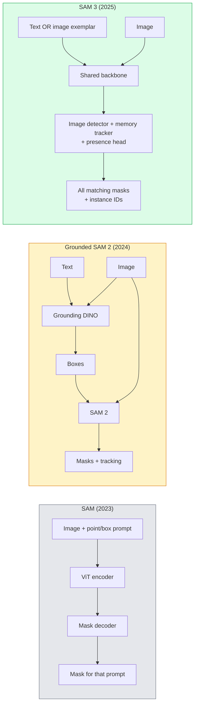

<!-- i18n:manual -->
# SAM 3 и сегментация с открытым словарём

> Дайте модели текстовый промпт и картинку — получите mask для каждого подходящего объекта. SAM 3 уместил это в один прямой проход.

**Type:** Use + Build
**Languages:** Python
**Prerequisites:** Phase 4 Lesson 07 (U-Net), Phase 4 Lesson 08 (Mask R-CNN), Phase 4 Lesson 18 (CLIP)
**Time:** ~60 minutes

## Learning Objectives

- Различать SAM (только визуальные промпты), Grounded SAM / SAM 2 (детектор + SAM) и SAM 3 (родные текстовые промпты через Promptable Concept Segmentation)
- Объяснить архитектуру SAM 3: общий backbone + детектор по кадру + трекер видео на памяти + presence head + разделённая пара «детектор-трекер»
- Использовать интеграцию SAM 3 в Hugging Face `transformers` для детекции, сегментации и трекинга по текстовому промпту
- Выбирать между SAM 3, Grounded SAM 2, YOLO-World и SAM-MI по задержке, сложности концепта и целевой площадке развёртывания

> 🎒 **На пальцах.** Раньше это была эстафета: один сотрудник ищет коробки на фото, второй аккуратно обводит содержимое. SAM 3 совмещает обе роли в одном человеке — и он не переспрашивает, что именно искать, ему достаточно фразы «жёлтый школьный автобус».

## The Problem

SAM образца 2023 года работал только с визуальными промптами: вы кликаете точку или рисуете рамку, он возвращает mask. Для запроса «дай мне все апельсины на этой фотографии» нужен был детектор (Grounding DINO), который выдаст рамки, и затем SAM, который сегментирует каждую. Grounded SAM превратил это в пайплайн, но по сути это был каскад из двух замороженных моделей с неизбежным накоплением ошибок.

SAM 3 (Meta, ноябрь 2025, ICLR 2026) схлопнул каскад. Он принимает короткую именную группу или картинку-образец в качестве промпта и возвращает все подходящие mask вместе с ID экземпляров за один прямой проход. Это и есть **Promptable Concept Segmentation (PCS)**. Вместе с обновлением Object Multiplex от марта 2026 года (SAM 3.1) он эффективно отслеживает много экземпляров одного концепта в видео.

Урок про структурный сдвиг, который за этим стоит. Двумерная сегментация, детекция и связывание текста с изображением слились в одну модель. Продакшн-вопрос больше не звучит как «какой пайплайн мне собрать из кусков» — он звучит как «какая promptable модель закроет мой сценарий целиком».

> 🎒 **На пальцах.** Считайте накопление ошибок в каскаде: если детектор находит 90% объектов, а сегментатор корректно обводит 90% найденных, до конца доживает 0,9 × 0,9 = 0,81, то есть 81%. Каждое звено умножает потери. Один прямой проход убирает второе умножение целиком.

## The Concept

### The three generations



> 🎒 **На пальцах.** Читайте диаграмму сверху вниз как историю упрощения. В 2023 году коробок было три (энкодер, декодер, mask на один промпт). В 2024-м — пять, потому что добавился отдельный детектор. В 2025-м снова три, но теперь текст входит прямо в общий backbone. Схема стала короче, а умеет больше.

### Promptable Concept Segmentation

«Промпт-концепт» — это короткая именная группа (`"yellow school bus"`, `"striped red umbrella"`, `"hand holding a mug"`) или картинка-образец. Модель возвращает mask сегментации для каждого экземпляра на изображении, который подходит под концепт, плюс уникальный ID экземпляра для каждого совпадения.

От классического SAM с визуальными промптами это отличается тремя вещами:

1. Не нужно промптить каждый экземпляр отдельно — один текстовый промпт возвращает все совпадения.
2. Открытый словарь — концептом может быть что угодно, описуемое естественным языком.
3. Возвращается сразу несколько экземпляров, а не одна mask на один промпт.

> 🎒 **На пальцах.** Разница как между «покажи пальцем на каждую машину по очереди» и «обведи все машины». Если на фото 12 машин, старому SAM нужно 12 кликов и 12 проходов, SAM 3 — одна фраза и один проход. И заметьте формулировку промпта: это именная группа, а не предложение. «Жёлтый школьный автобус» работает, «найди мне пожалуйста автобус» — уже хуже.

### Key architectural pieces

- **Shared backbone** — один ViT обрабатывает изображение. И голова детектора, и трекер на памяти читают из него.
- **Presence head** — предсказывает, присутствует ли концепт на изображении вообще. Отделяет вопрос «есть ли это тут?» от вопроса «где именно?». Снижает число ложных срабатываний на отсутствующих концептах.
- **Decoupled detector-tracker** — детекция по кадру и трекинг по видео вынесены в разные головы, чтобы не мешать друг другу.
- **Memory bank** — хранит признаки каждого экземпляра между кадрами для трекинга в видео (тот же механизм, что был в SAM 2).

> 🎒 **На пальцах.** Presence head — самая недооценённая деталь. Без неё модель, которую спросили «где жираф?» на фотографии кухни, всё равно что-нибудь обведёт: холодильник ведь тоже высокий и пятнистый. Отдельная голова сначала отвечает «жирафа тут нет», и только при ответе «есть» запускается поиск координат. Один бинарный вопрос спасает от целого класса ложных срабатываний.

### Training at scale

SAM 3 обучали на **4 миллионах уникальных концептов**, которые сгенерировал data engine: он итеративно размечает и исправляет разметку силами AI + людей-проверяющих. Новый бенчмарк **SA-CO** содержит 270 тысяч уникальных концептов — в 50 раз больше прежних бенчмарков. SAM 3 достигает 75-80% от уровня человека на SA-CO и вдвое превосходит существующие системы на PCS по изображениям и видео.

> 🎒 **На пальцах.** Прикиньте масштаб: 270 тысяч концептов в бенчмарке — это в 50 раз больше, значит раньше в бенчмарках было около 5 400 концептов. А в обучении концептов 4 миллиона, то есть примерно в 15 раз больше, чем даже в новом бенчмарке. Именно этот разрыв и даёт открытый словарь: модель видела столько разных описаний, что незнакомая формулировка её уже не ломает.

### SAM 3.1 Object Multiplex

Обновление марта 2026 года: **Object Multiplex** вводит механизм общей памяти для совместного трекинга множества экземпляров одного концепта сразу. Раньше отслеживать N экземпляров означало держать N отдельных memory bank. Multiplex схлопывает их в одну общую память с запросами по каждому экземпляру. Результат: существенно более быстрый трекинг множества объектов без потери точности.

> 🎒 **На пальцах.** Представьте камеру над парковкой, где 40 машин. По-старому это 40 отдельных блокнотов, каждый со своей копией признаков кадра. Multiplex делает один общий блокнот и 40 закладок в нём. Память перестаёт расти линейно с числом объектов, и именно поэтому трекинг ускоряется.

### Where Grounded SAM still matters in 2026

- Когда нужно подставить конкретный детектор с открытым словарём (DINO-X, Florence-2).
- Когда лицензия SAM 3 (доступ по запросу на HF) становится блокером.
- Когда нужен больший контроль над порогом детектора, чем даёт SAM 3.
- Для исследований и ablation-экспериментов над компонентом-детектором.

Модульные пайплайны никуда не делись. Но для большинства продакшн-задач SAM 3 — более простой ответ.

> 🎒 **На пальцах.** Три из четырёх причин остаться на Grounded SAM — не про качество, а про контроль и лицензию. Это типичная развилка в инженерии: монолит проще, модуль гибче. Если вам нужно крутить порог детектора вручную или подменять его на свой, монолит вам этого не даст.

### YOLO-World vs SAM 3

- **YOLO-World** — только детектор с открытым словарём (без mask). Работает в реальном времени. Лучший выбор, когда нужны рамки на высоком fps.
- **SAM 3** — полноценная сегментация плюс трекинг. Медленнее, но выход богаче.

Разделение в продакшене: YOLO-World для быстрых пайплайнов, где нужна только детекция (навигация роботов, быстрые дашборды), SAM 3 для всего, где нужны mask или трекинг.

> 🎒 **На пальцах.** Вопрос простой: вам нужен контур или достаточно рамки? Роботу-пылесосу хватит рамки «здесь стул» на 60 fps. А вот чтобы вырезать объект с фона или посчитать его площадь в пикселях, рамка бесполезна — нужна mask.

### SAM-MI efficiency

SAM-MI (2025-2026) борется с узким местом в декодере SAM. Ключевые идеи:

- **Sparse point prompting** — использует несколько удачно выбранных точек вместо плотных промптов; сокращает число вызовов декодера на 96%.
- **Shallow mask aggregation** — сливает грубые предсказания mask в одну более чёткую.
- **Decoupled mask injection** — декодер получает заранее посчитанные признаки mask вместо повторного прогона.

Результат: ускорение примерно в 1,6 раза относительно Grounded-SAM на бенчмарках с открытым словарём.

> 🎒 **На пальцах.** Сокращение вызовов декодера на 96% означает, что вместо 100 вызовов остаётся 4. При этом общее ускорение всего в 1,6 раза — потому что декодер был лишь частью бюджета времени, остальное съедает энкодер. Это хорошая иллюстрация закона Амдала: оптимизировать имеет смысл только то, что действительно доминирует.

### Output format for the three models

Все три возвращают одну и ту же общую структуру (рамки + метки + оценки + mask + ID), и это удобно: код ниже по пайплайну не обязан ветвиться в зависимости от того, какая модель отработала.

```figure
cv3-open-vocab
```

## Build It

### Step 1: Prompt construction

Соберём хелпер, который превращает предложение пользователя в список промптов-концептов для SAM 3. Это и есть граница между «что напечатал пользователь» и «что потребляет модель».

```python
def split_concepts(sentence):
    """
    Heuristic splitter for multi-concept prompts.
    Returns list of short noun phrases.
    """
    # Сначала приводим все разделители к запятой, потом режем один раз.
    # Обратите внимание на пробелы вокруг "and" / "or": голое "and" попало бы
    # и внутрь слов "band", "brand", "headband", "thousand".
    normalised = sentence
    for sep in [" and ", " or ", "&", ";"]:
        normalised = normalised.replace(sep, ",")
    if "," in normalised:
        parts = [p.strip() for p in normalised.split(",")]
        return [p for p in parts if p]
    return [sentence.strip()]

print(split_concepts("cats, dogs and balloons"))   # ['cats', 'dogs', 'balloons']
print(split_concepts("mug; spoon & plate"))        # ['mug', 'spoon', 'plate']
print(split_concepts("a red band and a hat"))      # ['a red band', 'a hat']
```

SAM 3 принимает один концепт за прямой проход; для запросов с несколькими концептами делайте цикл или батч.

> 🎒 **На пальцах.** Прогоните первый пример в голове. Строка `"cats, dogs and balloons"` сначала превращается в `"cats, dogs,balloons"` (замена `" and "` на запятую), потом режется по запятым и обрезается по краям — получается три концепта. А значит и три прямых прохода модели, а не один.
>
> Теперь про пробелы вокруг `" and "` — это не косметика, а единственное, что спасает третий пример. Если искать голое `"and"`, то `"a red band and a hat"` порежется ещё и внутри слова `band`, и вы получите обрывок `"a red b"`. Тот же капкан ждёт слова `brand`, `headband`, `thousand`. С пробелами по краям `band` остаётся целым, а разделителем работает только отдельно стоящее слово.
>
> Эвристика всё равно грубая: фраза «bread and butter» развалится на два концепта, хотя человек имел в виду один. Никакая расстановка пробелов от этого не защитит — тут нужен уже разбор смысла, а не строк.

### Step 2: Post-processing helpers

Превратим сырые выходы SAM 3 в чистый список детекций, который соответствует контракту пайплайна из урока 16 фазы 4.

```python
from dataclasses import dataclass
from typing import List

@dataclass
class ConceptDetection:
    concept: str
    instance_id: int
    box: tuple          # (x1, y1, x2, y2)
    score: float
    mask_rle: str       # run-length encoded


def rle_encode(binary_mask):
    flat = binary_mask.flatten().astype("uint8")
    if flat.size == 0:            # empty mask: flat[0] below would raise IndexError
        return ""
    runs = []
    prev, count = int(flat[0]), 0
    for v in flat:
        iv = int(v)
        if iv == prev:
            count += 1
        else:
            runs.append((prev, count))
            prev, count = iv, 1
    runs.append((prev, count))
    return ";".join(f"{v}x{c}" for v, c in runs)
```

RLE держит размер ответа небольшим даже при множестве mask высокого разрешения. Тот же формат работает и в SAM 2, и в SAM 3, и в Grounded SAM 2.

> 🎒 **На пальцах.** RLE — это «сжатие сериями»: вместо тысячи нулей подряд пишется «0 повторить тысячу раз». Разберите строку `"0x100;1x50;0x200"`: сто нулей, пятьдесят единиц, двести нулей. Всего 350 пикселей, из них внутри объекта 50, то есть около 14%. В виде списка это 350 чисел, в виде RLE — три пары. Экономия тем больше, чем крупнее и однороднее mask.

> 🎒 **На пальцах.** Первая же строка после `flatten` — про пустой массив. Модель вполне может вернуть mask нулевого размера (ничего не найдено, пустой crop), и тогда `flat[0]` упадёт с `IndexError` ещё до начала цикла. Проверка `flat.size == 0` возвращает пустую строку — честное «серий нет». Такие защиты в продакшене стоят одну строку, а без них пайплайн валится на самом скучном входе.

### Step 3: A unified open-vocab segmentation interface

Заверните любой доступный вам бэкенд (SAM 3, Grounded SAM 2, YOLO-World + SAM 2) в один метод. Код ниже по течению не меняется при смене бэкенда.

```python
from abc import ABC, abstractmethod
import numpy as np

class OpenVocabSeg(ABC):
    @abstractmethod
    def detect(self, image: np.ndarray, concept: str) -> List[ConceptDetection]:
        ...


class StubOpenVocabSeg(OpenVocabSeg):
    """
    Deterministic stub used for pipeline testing when real models are not loaded.
    """
    def detect(self, image, concept):
        h, w = image.shape[:2]
        return [
            ConceptDetection(
                concept=concept,
                instance_id=0,
                box=(w * 0.2, h * 0.3, w * 0.5, h * 0.8),
                score=0.89,
                mask_rle="0x100;1x50;0x200",
            ),
            ConceptDetection(
                concept=concept,
                instance_id=1,
                box=(w * 0.55, h * 0.25, w * 0.85, h * 0.75),
                score=0.74,
                mask_rle="0x80;1x40;0x220",
            ),
        ]
```

Настоящий подкласс `SAM3OpenVocabSeg` оборачивал бы `transformers.Sam3Model` и `Sam3Processor`.

> 🎒 **На пальцах.** Заглушка возвращает две детекции с оценками 0,89 и 0,74 и рамками, заданными в долях от размера кадра. На картинке 1000x1000 первая рамка — это (200, 300)-(500, 800), то есть прямоугольник 300 × 500 = 150 000 пикселей, 15% кадра. Оценки специально разные: так вы сразу проверите, что ваш порог отсечения (скажем, 0,8) действительно отбрасывает вторую детекцию.

### Step 4: Hugging Face SAM 3 usage (reference)

Для настоящей модели — интеграция в `transformers`:

```python
from transformers import Sam3Processor, Sam3Model
import torch

processor = Sam3Processor.from_pretrained("facebook/sam3")
model = Sam3Model.from_pretrained("facebook/sam3").eval()

inputs = processor(images=pil_image, return_tensors="pt")
inputs = processor.set_text_prompt(inputs, "yellow school bus")

with torch.no_grad():
    outputs = model(**inputs)

masks = processor.post_process_masks(
    outputs.masks, inputs.original_sizes, inputs.reshaped_input_sizes
)
boxes = outputs.boxes
scores = outputs.scores
```

Один промпт, все совпадения возвращаются за один вызов.

> 🎒 **На пальцах.** Обратите внимание на `post_process_masks`: модель работает с картинкой, приведённой к своему размеру, а mask вам нужны в исходном. Поэтому в функцию передают и `original_sizes`, и `reshaped_input_sizes` — без этого шага контуры окажутся смещёнными и растянутыми.

### Step 5: Measure what Grounded SAM 2 gave you for free

Честный бенчмарк: что происходит, когда вы заменяете Grounded SAM 2 на SAM 3 в реальном пайплайне?

- Задержка: SAM 3 экономит один прямой проход (отдельного детектора нет), но сама модель тяжелее; обычно выходит по нулям или чуть быстрее.
- Точность: SAM 3 существенно лучше на редких и составных концептах («полосатый красный зонт»). На частых односложных концептах примерно так же.
- Гибкость: Grounded SAM 2 позволяет менять детекторы (DINO-X, Florence-2, Grounding DINO 1.5); SAM 3 монолитен.

Вывод: SAM 3 — дефолт для сегментации с открытым словарём в 2026 году. Grounded SAM 2 остаётся правильным ответом, когда нужна гибкость по детектору или другие условия лицензии.

> 🎒 **На пальцах.** Главный вывод контринтуитивен: выигрыш по скорости почти нулевой. Один проход тяжёлой модели стоит примерно столько же, сколько два прохода лёгких. Покупаете вы не скорость, а качество на сложных фразах и простоту кода — вместо двух моделей с двумя наборами порогов у вас одна.

## Use It

Продакшн-паттерны развёртывания:

- **Real-time annotation** — SAM 3 + функция CVAT «метка как текстовый промпт». Разметчик выбирает имя метки; SAM 3 предразмечает все подходящие экземпляры. Остаётся проверить и поправить.
- **Video analytics** — SAM 3.1 Object Multiplex для трекинга множества объектов; кадры подаются в трекер на памяти.
- **Robotics** — SAM 3 для манипуляций с открытым словарём («подними красную чашку»); работает как примитив планировщика.
- **Medical imaging** — SAM 3, дообученный на медицинских концептах; требует запроса доступа на HF.

Ultralytics оборачивает SAM 3 в свой Python-пакет:

```python
from ultralytics import SAM

model = SAM("sam3.pt")
results = model(image_path, prompts="yellow school bus")
```

Тот же интерфейс, что у YOLO и SAM 2.

## Ship It

Этот урок производит:

- `outputs/prompt-open-vocab-stack-picker.md` — промпт, который выбирает SAM 3 / Grounded SAM 2 / YOLO-World / SAM-MI по задержке, сложности концепта и лицензии.
- `outputs/skill-concept-prompt-designer.md` — скилл, который превращает реплики пользователя в корректные промпты-концепты для SAM 3 (разбиение, разрешение неоднозначностей, запасные варианты).

## Exercises

1. **(Easy)** Запустите SAM 3 на 10 изображениях с промптами-концептами на ваш выбор. Сравните с SAM 2 + Grounding DINO 1.5 на тех же изображениях. Отчитайтесь, какие концепты пропустила каждая модель.
2. **(Medium)** Постройте поверх SAM 3 интерфейс «клик, чтобы включить / клик, чтобы исключить»: текстовый промпт возвращает кандидатов, пользователь кликами оставляет нужные. Выгрузите итоговый набор концептов в JSON.
3. **(Hard)** Дообучите SAM 3 на своём наборе концептов (например, 5 типов электронных компонентов) по 20 размеченных изображений на каждый. Сравните с zero-shot SAM 3 на той же тестовой выборке; измерьте прирост IoU по mask.

> 🎒 **На пальцах.** Подсказка к первому заданию: подбирайте промпты специально так, чтобы поймать разницу. Односложные концепты вроде «cat» обе модели возьмут одинаково. Разница вылезет на составных: «полосатый красный зонт», «рука, держащая кружку», «левое переднее колесо». Возьмите 5 простых промптов и 5 составных — и вы увидите, где именно SAM 3 отрывается.

## Key Terms

| Term | What people say | What it actually means |
|------|----------------|----------------------|
| Open-vocabulary segmentation | «Сегментация по тексту» | Строить mask для объектов, описанных естественным языком, а не по фиксированному списку меток |
| PCS | «Promptable Concept Segmentation» | Основная задача SAM 3: по именной группе или картинке-образцу сегментировать все подходящие экземпляры |
| Concept prompt | «Текстовый ввод» | Короткая именная группа или картинка-образец; не целое предложение |
| Presence head | «Оно тут вообще есть?» | Модуль SAM 3, который до поиска координат решает, присутствует ли концепт на изображении |
| SA-CO | «Бенчмарк SAM 3» | Бенчмарк сегментации с открытым словарём на 270 тысяч концептов; в 50 раз больше прежних |
| Object Multiplex | «Обновление SAM 3.1» | Трекинг множества объектов на общей памяти; быстрое совместное отслеживание многих экземпляров |
| Grounded SAM 2 | «Модульный пайплайн» | Каскад «детектор + SAM 2»; всё ещё актуален, когда важна подмена детектора |
| SAM-MI | «Эффективный вариант SAM» | Mask Injection ради ускорения в 1,6 раза относительно Grounded-SAM |

## Further Reading

- [SAM 3: Segment Anything with Concepts (arXiv 2511.16719)](https://arxiv.org/abs/2511.16719)
- [SAM 3.1 Object Multiplex (Meta AI, March 2026)](https://ai.meta.com/blog/segment-anything-model-3/)
- [SAM 3 model page on Hugging Face](https://huggingface.co/facebook/sam3)
- [Grounded SAM 2 tutorial (PyImageSearch)](https://pyimagesearch.com/2026/01/19/grounded-sam-2-from-open-set-detection-to-segmentation-and-tracking/)
- [Ultralytics SAM 3 docs](https://docs.ultralytics.com/models/sam-3/)
- [SAM3-I: Instruction-aware SAM (arXiv 2512.04585)](https://arxiv.org/abs/2512.04585)
