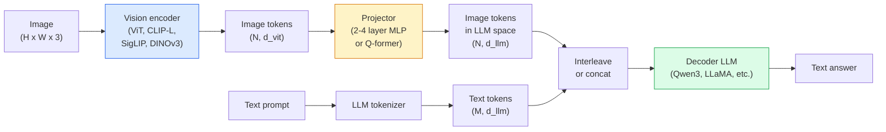

<!-- i18n:manual -->
# Vision-Language Models — паттерн ViT-MLP-LLM

> Vision encoder превращает изображение в tokens. MLP-projector переводит эти tokens в пространство эмбеддингов LLM. Всё остальное делает языковая модель. Этот паттерн — ViT-MLP-LLM — лежит в основе любого production-VLM в 2026 году.

**Type:** Learn + Use
**Languages:** Python
**Prerequisites:** Phase 4 Lesson 14 (ViT), Phase 4 Lesson 18 (CLIP), Phase 7 Lesson 02 (Self-Attention)
**Time:** ~75 minutes

## Learning Objectives

- Описать архитектуру ViT-MLP-LLM и объяснить, что вносит каждый из трёх компонентов
- Сравнить Qwen3-VL, InternVL3.5, LLaVA-Next и GLM-4.6V по числу параметров, длине контекста и результатам на бенчмарках
- Объяснить DeepStack: почему признаки с нескольких уровней ViT выравнивают зрение и язык лучше, чем один признак с последнего слоя
- Измерять галлюцинации VLM в production через Cross-Modal Error Rate (CMER) и действовать по этому сигналу

> 🎒 **На пальцах.** Урок собирается из трёх кубиков: глаз (vision encoder), переводчик (projector) и голова (LLM). Кубиков ровно три, и почти всё обучение уходит в средний. В коде ниже projector — это два слоя nn.Linear, примерно 20 миллионов параметров против 8 миллиардов у самой модели.

## The Problem

CLIP (Phase 4 Lesson 18) даёт общее пространство эмбеддингов для картинок и текста — этого хватает для zero-shot классификации и поиска. Но ответить на вопрос «сколько на этой фотографии красных машин?» CLIP не может: он не генерирует текст, он только считает похожесть.

Vision-Language Models (VLM) — Qwen3-VL, InternVL3.5, LLaVA-Next, GLM-4.6V — приделывают к полноценной языковой модели энкодер картинок из семейства CLIP. Модель видит изображение плюс вопрос и генерирует ответ. В 2026 году open-source VLM соперничают с GPT-5 и Gemini-2.5-Pro на мультимодальных бенчмарках (MMMU, MMBench, DocVQA, ChartQA, MathVista, OSWorld) или обгоняют их.

Тройка деталей (ViT, projector, LLM) — стандарт. Модели различаются тем, какой именно ViT, какой projector, какая LLM, на каких данных обучали и по какому рецепту выравнивали. Когда паттерн понятен, замена любого компонента становится механической работой.

> 🎒 **На пальцах.** CLIP — как турникет: он умеет сказать «этот текст подходит к этой картинке» и всё. VLM — как экскурсовод: смотрит и рассказывает. Разница в том, что к энкодеру приделали генератор текста, а не в том, что энкодер стал умнее.

## The Concept

### The ViT-MLP-LLM architecture



1. **Vision encoder** — предобученный ViT (CLIP-L/14, SigLIP, DINOv3 или дообученный вариант). Выдаёт patch-tokens.
2. **Projector** — маленький модуль (MLP на 2-4 слоя или Q-former), который переводит vision-tokens в размерность эмбеддингов LLM. Именно здесь происходит большая часть дообучения.
3. **LLM** — decoder-only языковая модель (Qwen3, Llama, Mistral, GLM, InternLM). Читает vision- и текстовые tokens подряд и генерирует текст.

В принципе обучаемы все три части. На практике vision encoder и LLM почти всегда заморожены, а учится projector — так за дёшево получают сигнал на несколько миллиардов параметров.

> 🎒 **На пальцах.** Представьте иностранного гостя и хозяина дома: гость (ViT) говорит на своём языке, хозяин (LLM) на своём, между ними сидит переводчик (projector). Дешевле нанять переводчика, чем переучивать обоих. В коде ниже projector переводит вектор из 768 чисел в вектор из 4096 чисел — размерность, на которой «думает» LLM.

### DeepStack

Обычная проекция берёт только последний слой ViT. DeepStack (Qwen3-VL) берёт признаки с нескольких глубин ViT и складывает их стопкой. Глубокие слои несут высокоуровневый смысл; мелкие — точную пространственную информацию и текстуру. Если подать в LLM и то и другое, закрывается разрыв между «что изображено» (смысл) и «где именно» (пространственная привязка).

> 🎒 **На пальцах.** Это как читать книгу и по оглавлению, и по конкретным страницам одновременно. Один последний слой ViT говорит «на фото кухня», ранние слои говорят «вот тут край столешницы, пиксель 412». Стопка из нескольких уровней даёт обе вещи разом.

### Three training stages

Современные VLM учат в несколько этапов:

1. **Alignment** — заморозить ViT и LLM. Учить только projector на парах «картинка — подпись». Так projector учится переводить пространство зрения в пространство языка.
2. **Pre-training** — разморозить всё. Учить на большом объёме перемешанных изображений и текста (500M+ пар). Здесь модель набирает визуальные знания.
3. **Instruction tuning** — дообучение на отобранных тройках (картинка, вопрос, ответ). Учит диалоговому поведению и форматам задач. Именно этот этап превращает «языковую модель, которая что-то видит» в пригодного ассистента.

Большинство LoRA-дообучений нацелены на третий этап и небольшой размеченный датасет.

> 🎒 **На пальцах.** Порядок как у ребёнка: сначала научить связывать слово и картинку, потом дать много книжек с картинками, потом научить отвечать на вопросы вежливо. Обратите внимание на масштаб: второй этап — это 500 миллионов пар, третий — часто всего несколько тысяч примеров.

### Model family comparison (early 2026)

| Model | Params | Vision encoder | LLM | Context | Strengths |
|-------|--------|----------------|-----|---------|-----------|
| Qwen3-VL-235B-A22B (MoE) | 235B (22B active) | кастомный ViT + DeepStack | Qwen3 | 256K | SOTA в общем случае, GUI-агент |
| Qwen3-VL-30B-A3B (MoE) | 30B (3B active) | кастомный ViT + DeepStack | Qwen3 | 256K | Более лёгкая MoE-альтернатива |
| Qwen3-VL-8B (dense) | 8B | кастомный ViT | Qwen3 | 128K | Дефолт для production, dense |
| InternVL3.5-38B | 38B | InternViT-6B | Qwen3 + GPT-OSS | 128K | Сильные MMBench / MMVet |
| InternVL3.5-241B-A28B | 241B (28B active) | InternViT-6B | Qwen3 | 128K | На уровне GPT-4o |
| LLaVA-Next 72B | 72B | SigLIP | Llama-3 | 32K | Открытая, легко дообучать |
| GLM-4.6V | ~70B | кастомный | GLM | 64K | Open-source, сильный OCR |
| MiniCPM-V-2.6 | 8B | SigLIP | MiniCPM | 32K | Подходит для edge |

> 🎒 **На пальцах.** Смотрите на колонку Params внимательнее: у Qwen3-VL-235B-A22B на каждый token работают только 22B из 235B — меньше десятой части. Это MoE: экспертов много, включаются единицы. Поэтому модель «весит как 235B» на диске, а считает почти как 22B.

### Visual agents

Qwen3-VL-235B показывает лучший в мире результат на OSWorld — бенчмарке для **visual agents**, которые управляют графическими интерфейсами (десктоп, мобильные, веб). Модель видит скриншот, понимает интерфейс и выдаёт действия (клик, ввод текста, скролл). Вместе с инструментами это замыкает цикл на типовых десктопных задачах. Именно это крутится под капотом у большинства демо «AI PC» образца 2026 года.

> 🎒 **На пальцах.** Это модель, которая вместо ответа «нажмите кнопку Сохранить» сама возвращает координаты клика. Смотрит на скриншот 1920×1080 и говорит: клик в точку (1840, 22). Дальше скрипт реально двигает мышь.

### Agentic capabilities + RoPE variants

VLM должна понимать, **когда** в видео произошёл кадр. Qwen3-VL прошёл путь от T-RoPE (temporal rotary position embeddings) до **выравнивания времени через текст** — явные текстовые tokens с таймкодами, перемешанные с кадрами видео. Модель видит «`<timestamp 00:32>` кадр, запрос» и может рассуждать о временных связях.

> 🎒 **На пальцах.** Вместо хитрой математики в позиционных эмбеддингах модели просто пишут время словами, как подпись под фотографией в альбоме. Кадр на 32-й секунде получает метку `00:32`, и вопрос «что было раньше?» превращается в обычное сравнение двух чисел.

### The alignment problem

12% пар «картинка — текст» в собранном из интернета датасете содержат описания, не полностью подтверждённые изображением. VLM, обученная на таких данных, незаметно учится галлюцинировать — выдумывать объекты, неверно читать числа, изобретать связи. В production это главный режим отказа.

Skywork.ai предложили метрику **Cross-Modal Error Rate (CMER)**, чтобы это отслеживать:

```
CMER = fraction of outputs where the text confidence is high but the image-text similarity (via a CLIP-family checker) is low
```

Высокий CMER значит, что модель уверенно говорит вещи, не подтверждённые картинкой. Мониторинг CMER как production-KPI снизил у них долю галлюцинаций примерно на 35%. Фокус не в том, чтобы «починить модель», а в том, чтобы отправлять выводы с высоким CMER на проверку человеку.

> 🎒 **На пальцах.** Это как ученик, который отвечает уверенно, но не по учебнику. CMER ловит именно такое сочетание: уверенность выше 0.8, а похожесть текста на картинку ниже 0.25. Из 12% мусора в обучающих данных вырастает привычка врать, и вылечить её проще фильтром на выходе, чем переучиванием.

### Fine-tuning with LoRA / QLoRA

Полное дообучение VLM на 70B недоступно большинству команд. LoRA (rank 16-64) на attention и слоях projector, либо QLoRA с базовыми весами в 4 битах, помещаются в одну A100 / H100. Цена вопроса: 5,000-50,000 примеров, $100-$5,000 на вычисления, 2-10 часов обучения.

> 🎒 **На пальцах.** LoRA — это как приклеить стикеры на страницы учебника вместо того, чтобы переписывать учебник. Разница в масштабе: полное дообучение 70B требует кластера, а LoRA rank 16 укладывается в одну карту и $100-$5,000 — иногда это дешевле, чем зарплата разметчика за неделю.

### Spatial reasoning is still weak

Сегодняшние VLM набирают 50-60% на бенчмарках пространственного рассуждения (выше-ниже, слева-справа, подсчёт, расстояние). Если ваш сценарий зависит от «какой объект лежит на каком», проверяйте это отдельно и тщательно — в среднем VLM здесь слабее человека. Что работает лучше на чисто пространственных задачах: специализированный оценщик ключевых точек или позы, модель глубины либо детектор с постобработкой геометрии рамок.

> 🎒 **На пальцах.** 50-60% на задаче с двумя вариантами («слева или справа») — это чуть лучше монетки. Человек тут даёт около 95%. Поэтому «посчитай коробки на паллете» лучше отдавать детектору, а не VLM.

```figure
v4-vlm-projector
```

## Build It

### Step 1: The projector

Та часть, которую вы будете обучать чаще всего. MLP на 2-4 слоя с GELU.

```python
import torch
import torch.nn as nn


class Projector(nn.Module):
    def __init__(self, vit_dim=768, llm_dim=4096, hidden=4096):
        super().__init__()
        self.net = nn.Sequential(
            nn.Linear(vit_dim, hidden),
            nn.GELU(),
            nn.Linear(hidden, llm_dim),
        )

    def forward(self, x):
        return self.net(x)
```

На вход подаётся тензор tokens формы `(N_patches, d_vit)`. На выходе `(N_patches, d_llm)`. Для LLM каждая строка выхода — просто ещё один token.

> 🎒 **На пальцах.** Посчитаем размер этого переводчика: 768 × 4096 + 4096 × 4096 ≈ 20 миллионов параметров. Рядом с 8-миллиардной LLM это 0.25% — четверть процента весов делает всю работу по стыковке зрения и языка.

### Step 2: Assemble ViT-MLP-LLM end-to-end

Скелет прямого прохода минимального VLM. Настоящий код использует `transformers`; здесь показана концептуальная схема.

```python
class MinimalVLM(nn.Module):
    def __init__(self, vit, projector, llm, image_token_id):
        super().__init__()
        self.vit = vit
        self.projector = projector
        self.llm = llm
        self.image_token_id = image_token_id  # placeholder token in text prompt

    def forward(self, image, input_ids, attention_mask):
        # 1. vision features
        vision_tokens = self.vit(image)                     # (B, N_patches, d_vit)
        vision_embeds = self.projector(vision_tokens)       # (B, N_patches, d_llm)

        # 2. text embeddings
        text_embeds = self.llm.get_input_embeddings()(input_ids)  # (B, M, d_llm)

        # 3. replace image placeholder tokens with vision embeds
        merged = self._merge(text_embeds, vision_embeds, input_ids)

        # 4. run LLM
        return self.llm(inputs_embeds=merged, attention_mask=attention_mask)

    def _merge(self, text_embeds, vision_embeds, input_ids):
        out = text_embeds.clone()
        expected = vision_embeds.size(1)
        for b in range(input_ids.size(0)):
            positions = (input_ids[b] == self.image_token_id).nonzero(as_tuple=True)[0]
            if len(positions) != expected:
                raise ValueError(
                    f"batch item {b} has {len(positions)} image tokens but vision_embeds has {expected} patches."
                    " Every sample in the batch must be pre-padded to the same number of image placeholder tokens.")
            out[b, positions] = vision_embeds[b]
        return out
```

Placeholder-token `<image>` в тексте подменяется настоящими эмбеддингами изображения — тот же приём используют LLaVA, Qwen-VL и InternVL.

> 🎒 **На пальцах.** В тексте промпта стоит пустое место, как прочерк в бланке: «Что изображено на ___?». Метод `_merge` вписывает в этот прочерк векторы картинки. И он специально падает с ошибкой, если прочерков не столько же, сколько патчей, — иначе строки перепутаются молча.

### Step 3: CMER computation

Лёгкая проверка во время работы.

```python
import torch.nn.functional as F


def cross_modal_error_rate(image_emb, text_emb, text_confidence, sim_threshold=0.25, conf_threshold=0.8):
    """
    image_emb, text_emb: embeddings of image and generated text (normalised internally)
    text_confidence:     mean per-token probability in [0, 1]
    Returns:             fraction of high-confidence outputs with low image-text alignment
    """
    image_emb = F.normalize(image_emb, dim=-1)
    text_emb = F.normalize(text_emb, dim=-1)
    sim = (image_emb * text_emb).sum(dim=-1)        # cosine similarity
    high_conf_low_sim = (text_confidence > conf_threshold) & (sim < sim_threshold)
    return high_conf_low_sim.float().mean().item()
```

Относитесь к CMER как к production-KPI. Мониторьте его по каждой ручке, по типу промпта, по клиенту. Рост CMER означает, что модель начала галлюцинировать на каком-то распределении входов.

> 🎒 **На пальцах.** Два порога делают всю работу: уверенность выше 0.8 и косинусная похожесть ниже 0.25. Если из 1000 ответов 30 попали в эту зону, CMER = 0.03. Выросло до 0.09 — что-то изменилось во входных данных, идите смотреть.

### Step 4: Toy VLM classifier (runnable)

Показать, что projector обучается. На вход идут фейковые «ViT-признаки»; крошечный token в стиле LLM предсказывает класс.

```python
class ToyVLM(nn.Module):
    def __init__(self, vit_dim=32, llm_dim=64, num_classes=5):
        super().__init__()
        self.projector = Projector(vit_dim, llm_dim, hidden=64)
        self.head = nn.Linear(llm_dim, num_classes)

    def forward(self, vision_tokens):
        projected = self.projector(vision_tokens)
        pooled = projected.mean(dim=1)
        return self.head(pooled)
```

Эту модель можно обучить на синтетических парах (признак, класс) меньше чем за 200 шагов — достаточно, чтобы убедиться: паттерн с projector работает.

> 🎒 **На пальцах.** Это та же архитектура, ужатая до игрушечного размера: 32 вместо 768, 64 вместо 4096. Всего около 6600 параметров — обучается на ноутбуке за секунды. Смысл не в качестве, а в том, чтобы своими глазами увидеть, как падает loss.

## Use It

Три способа, которыми production-команды используют VLM в 2026 году:

- **Hosted API** — OpenAI Vision, Anthropic Claude Vision, Google Gemini Vision. Никакой инфраструктуры, зато зависимость от вендора.
- **Open-source self-host** — Qwen3-VL или InternVL3.5 через `transformers` и `vllm`. Полный контроль, больше усилий на старте.
- **Fine-tune on domain** — взять Qwen2.5-VL-7B или LLaVA-1.6-7B, обучить LoRA на 5k-50k своих примеров, обслуживать через `vllm` или `TGI`.

```python
from transformers import AutoProcessor, AutoModelForVision2Seq
import torch
from PIL import Image

model_id = "Qwen/Qwen3-VL-8B-Instruct"
processor = AutoProcessor.from_pretrained(model_id)
model = AutoModelForVision2Seq.from_pretrained(model_id, torch_dtype=torch.bfloat16, device_map="auto")

messages = [{
    "role": "user",
    "content": [
        {"type": "image", "image": Image.open("plot.png")},
        {"type": "text", "text": "What does this chart show?"},
    ],
}]
inputs = processor.apply_chat_template(messages, add_generation_prompt=True, tokenize=True, return_dict=True, return_tensors="pt").to("cuda")
generated = model.generate(**inputs, max_new_tokens=256)
answer = processor.decode(generated[0][inputs["input_ids"].shape[1]:], skip_special_tokens=True)
```

`apply_chat_template` прячет токенизацию placeholder-а `<image>`; слияние модель делает внутри себя.

## Ship It

Этот урок производит:

- `outputs/prompt-vlm-selector.md` — выбирает между Qwen3-VL / InternVL3.5 / LLaVA-Next / API по точности, задержке, длине контекста и бюджету.
- `outputs/skill-cmer-monitor.md` — выдаёт код, который обвешивает production-эндпоинт VLM метрикой cross-modal error rate, дашбордами по эндпоинтам и порогами алертов.

## Exercises

1. **(Easy)** Прогоните три промпта («что это?», «посчитай объекты», «опиши сцену») через любой открытый VLM на пяти изображениях. Оцените каждый ответ вручную как верный / частично верный / галлюцинация. Посчитайте первое приближение CMER.
2. **(Medium)** Дообучите Qwen2.5-VL-3B или LLaVA-1.6-7B с LoRA (rank 16) на 500 изображениях целевой предметной области с подписями. Сравните точность zero-shot и после дообучения на задачах в стиле MMBench.
3. **(Hard)** Замените энкодер изображений в VLM на DINOv3 вместо штатного SigLIP/CLIP. Переобучите только projector (LLM и DINOv3 заморожены). Проверьте, улучшились ли задачи плотного предсказания (подсчёт, пространственное рассуждение).

> 🎒 **На пальцах.** Подсказка к первому заданию: 5 картинок × 3 промпта = 15 ответов. Если галлюцинациями оказались 3 из 15, ваш ручной CMER равен 0.2 — и это уже число, с которым можно сравнивать следующую модель. Начинайте с картинок, где есть что считать: цифры на ценниках, количество стульев.

## Key Terms

| Term | What people say | What it actually means |
|------|----------------|----------------------|
| ViT-MLP-LLM | «Тот самый паттерн VLM» | Vision encoder + projector + языковая модель; так устроен любой VLM 2026 года |
| Projector | «Мост» | MLP на 2-4 слоя (или Q-former), переводящий vision-tokens в пространство эмбеддингов LLM |
| DeepStack | «Фишка Qwen3-VL с признаками» | Признаки с нескольких уровней ViT, сложенные стопкой, вместо одного последнего слоя |
| Image token | «Placeholder <image>» | Специальный token в потоке текста, который заменяется спроецированными эмбеддингами изображения |
| CMER | «KPI по галлюцинациям» | Cross-Modal Error Rate; высокий, когда уверенность текста высокая, а похожесть картинки и текста низкая |
| Visual agent | «VLM, который кликает» | VLM, управляющий интерфейсами (OSWorld, мобильные, веб) через вызовы инструментов |
| Q-former | «Мост с фиксированным числом tokens» | Projector в стиле BLIP-2, выдающий фиксированное количество визуальных query-tokens |
| Alignment / pre-training / instruction tuning | «Три этапа» | Стандартный конвейер обучения VLM |

## Further Reading

- [Qwen3-VL Technical Report (arXiv 2511.21631)](https://arxiv.org/abs/2511.21631)
- [InternVL3.5 Advancing Open-Source Multimodal Models (arXiv 2508.18265)](https://arxiv.org/html/2508.18265v1)
- [LLaVA-Next series](https://llava-vl.github.io/blog/2024-05-10-llava-next-stronger-llms/)
- [BentoML: Best Open-Source VLMs 2026](https://www.bentoml.com/blog/multimodal-ai-a-guide-to-open-source-vision-language-models)
- [MMMU: Multi-discipline Multimodal Understanding benchmark](https://mmmu-benchmark.github.io/)
- [VLMs in manufacturing (Robotics Tomorrow, March 2026)](https://www.roboticstomorrow.com/story/2026/03/when-machines-learn-to-see-like-experts-the-rise-of-vision-language-models-in-manufacturing/26335/)
