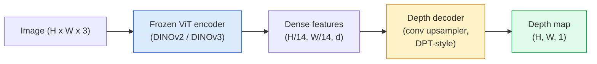

<!-- i18n:manual -->
# Monocular-оценка глубины и геометрии

> Depth map — это одноканальное изображение, где каждый пиксель хранит расстояние до камеры. Раньше предсказать его по одному RGB-кадру было невозможно без стерео или LiDAR. В 2026 году замороженный ViT-энкодер плюс лёгкая голова подбираются к истинным значениям на считаные проценты.

**Type:** Build + Use
**Languages:** Python
**Prerequisites:** Phase 4 Lesson 14 (ViT), Phase 4 Lesson 17 (Self-Supervised Vision), Phase 4 Lesson 07 (U-Net)
**Time:** ~60 minutes

## Learning Objectives

- Различать относительную и метрическую глубину и знать, какую из них решает каждая production-модель (MiDaS, Marigold, Depth Anything V3, ZoeDepth)
- Использовать Depth Anything V3 (backbone DINOv2), чтобы предсказывать глубину для произвольных одиночных изображений без калибровки
- Объяснять, почему monocular-глубина вообще работает по одному изображению (перспективные признаки, градиенты текстуры, выученные априорные знания) и что она не может восстановить (абсолютный масштаб, скрытую геометрию)
- Поднимать 2D-детекции в 3D-точки с помощью depth map и внутренних параметров камеры-обскуры

> 🎒 **На пальцах.** Глубина — это третья координата, которой у картинки нет. Урок учит доставать её из плоского кадра и превращать в 3D-точки. В конце из картинки 240×320 у вас получится облако из 76 800 точек — по одной на каждый пиксель.

## The Problem

Глубина — это недостающая ось в 2D-зрении. По RGB вы знаете, где объекты находятся в плоскости изображения; насколько они далеко — не знаете. Датчики глубины (стереопары, LiDAR, time-of-flight) решают задачу напрямую, но они дорогие, хрупкие и ограничены по дальности.

Monocular-оценка глубины — предсказание глубины по одному RGB-кадру — раньше давала размытый и ненадёжный результат. К 2026 году большие предобученные энкодеры это изменили: Depth Anything V3 использует замороженный backbone DINOv2 и выдаёт depth map, которые обобщаются на помещения, улицу, медицину и снимки со спутника. Marigold переформулирует глубину как задачу условной диффузии. ZoeDepth предсказывает настоящие метрические расстояния.

Глубина ещё и мост между 2D-детекцией и 3D-пониманием: умножьте пиксели найденной рамки на глубину — и 2D-объект поднимется в облако 3D-точек. На этом держится любая система AR-перекрытий, любой пайплайн объезда препятствий и любой робот, который «возьми чашку».

> 🎒 **На пальцах.** Закройте один глаз и попробуйте налить воду в стакан — станет труднее, но не невозможно: мозг достраивает расстояние по размерам и перекрытиям. Monocular-модель делает ровно то же самое, только вместо опыта жизни у неё миллиарды просмотренных картинок.

## The Concept

### Relative vs metric depth

- **Relative depth** — упорядоченные значения `z` без реальной единицы измерения. «Пиксель A ближе пикселя B, но отношение расстояний не привязано к метрам».
- **Metric depth** — абсолютное расстояние от камеры в метрах. Требует, чтобы модель выучила статистическую связь между признаками картинки и настоящим расстоянием.

MiDaS и Depth Anything V3 выдают relative depth. Marigold выдаёт relative depth. ZoeDepth, UniDepth и Metric3D выдают metric depth. Метрические модели чувствительны к внутренним параметрам камеры, относительные — нет.

> 🎒 **На пальцах.** Relative depth — это фотография горного хребта: видно, какая гряда дальше, но не видно, сколько до неё километров. Metric depth — это карта с масштабом: «до второй гряды 4.2 км». Первое достаточно для размытия фона на портрете, второе обязательно, если робот тянется к чашке.

### The encoder-decoder pattern



Depth Anything V3 замораживает энкодер и обучает только декодер в стиле DPT. Энкодер даёт богатые признаки; декодер интерполирует их обратно к разрешению картинки и предсказывает глубину.

> 🎒 **На пальцах.** ViT режет картинку на патчи 14×14 пикселей. При входе 518×518 это 518 / 14 = 37 патчей по стороне, то есть 37 × 37 = 1369 «клеток». Декодер берёт эту грубую сетку и разворачивает обратно до полного разрешения — как увеличить эскиз до плаката, дорисовывая детали.

### Why a single image produces depth at all

2D-изображение содержит много monocular-признаков, которые коррелируют с глубиной:

- **Perspective** — параллельные в 3D линии сходятся в 2D.
- **Texture gradient** — у далёких поверхностей текстура мельче и плотнее.
- **Occlusion order** — ближние объекты перекрывают дальние.
- **Size constancy** — знакомые объекты (машины, люди) задают примерный масштаб.
- **Atmospheric perspective** — на улице далёкие объекты кажутся более блёклыми и синеватыми.

ViT, обученный на миллиардах изображений, усваивает эти признаки. При достаточном объёме данных и сильном backbone monocular-глубина достигает разумной точности вообще без явного 3D-обучения.

> 🎒 **На пальцах.** Пять признаков из списка вы применяете каждый день, не замечая. Рельсы, сходящиеся в точку, — perspective. Человек ростом в 20 пикселей на кадре — size constancy: раз человек 1.7 м, а на фото он вчетверо меньше ближнего, значит он примерно вчетверо дальше.

### What monocular depth cannot do

- **Absolute metric scale** без внутренних параметров камеры или известного объекта в кадре. Сеть может сказать «чашка вдвое дальше ложки», не зная, 1 метр до чашки или 10.
- **Occluded geometry** — заднюю сторону стула не видно, и надёжно вывести её нельзя.
- **Truly untextured / reflective surfaces** — зеркала, стекло, однотонные стены. Сеть выдаёт правдоподобную, но неверную глубину.

> 🎒 **На пальцах.** Фотография модели самолёта в руках и фотография настоящего самолёта могут дать одинаковую картину глубины: модель видит форму, но не знает размер. Отсюда правило: если нужны метры, дайте камере калибровку или положите в кадр линейку.

### Depth Anything V3 in 2026

- Обычный DINOv2 ViT-L/14 в роли энкодера (заморожен).
- Декодер DPT.
- Обучен на парах изображений с известными позами из разнородных источников (явная разметка глубины не нужна, хватает фотометрической согласованности).
- Предсказывает пространственно согласованную геометрию по **произвольному числу визуальных входов, с известными позами камеры или без них**.
- SOTA по monocular-глубине, геометрии с любых ракурсов, визуальному рендерингу и оценке позы камеры.

Это та модель, которую нужно просто взять и вызвать, когда в 2026 году вам понадобилась глубина.

### Marigold — diffusion for depth

Marigold (Ke et al., CVPR 2024) переформулирует оценку глубины как условную диффузию из картинки в картинку. Условие: RGB. Цель: depth map. В роли backbone — предобученный U-Net из Stable Diffusion 2. Выходные depth map исключительно резкие на границах объектов. Плата: инференс медленнее, чем у прямых моделей (10-50 шагов расшумления).

> 🎒 **На пальцах.** Разница как между фотоснимком и рисунком по слоям: прямая модель выдаёт ответ за один проход, Marigold делает 10-50 проходов и каждый раз чуть уточняет. В 10-50 раз дольше, зато края объектов не мажутся. Для одной картинки в редакторе — отлично, для видео 30 кадров в секунду — нет.

### Intrinsics and the pinhole camera

Чтобы поднять пиксель `(u, v)` с глубиной `d` в 3D-точку `(X, Y, Z)` в координатах камеры:

```
fx, fy, cx, cy = camera intrinsics
X = (u - cx) * d / fx
Y = (v - cy) * d / fy
Z = d
```

Внутренние параметры берутся из EXIF, из калибровочного шаблона или из monocular-оценщика параметров (Perspective Fields, UniDepth). Без них облако точек всё равно можно построить, приняв FOV в 60-70° и главную точку в центре кадра — годится для визуализации, но не для измерений.

> 🎒 **На пальцах.** Формула проще, чем выглядит. Возьмите значения из кода ниже: fx = fy = 320, cx = 160, cy = 120. Пиксель (240, 120) с глубиной 2 м даёт X = (240 − 160) × 2 / 320 = 0.5 м, Y = 0, Z = 2 м. То есть точка в полуметре правее оси камеры и в двух метрах впереди.

### Evaluation

Две стандартные метрики:

- **AbsRel** (absolute relative error): `mean(|d_pred - d_gt| / d_gt)`. Меньше — лучше. У production-моделей 0.05-0.1.
- **delta < 1.25** (threshold accuracy): доля пикселей, где `max(d_pred/d_gt, d_gt/d_pred) < 1.25`. Больше — лучше. У SOTA 0.9 и выше.

Для relative depth (Depth Anything V3, MiDaS) обе метрики считают в вариантах, инвариантных к масштабу и сдвигу.

> 🎒 **На пальцах.** AbsRel 0.05 значит: при истинных 4 метрах модель в среднем ошибается на 20 сантиметров. Порог 1.25 значит «попал в пределах 25%»: для настоящих 4 метров засчитывается всё от 3.2 до 5.0 м. Доля 0.9 — девять пикселей из десяти уложились в эту вилку.

```figure
depth-sweep
```

## Build It

### Step 1: Depth metrics

```python
import torch

def abs_rel_error(pred, target, mask=None):
    if mask is not None:
        pred = pred[mask]
        target = target[mask]
    return (torch.abs(pred - target) / target.clamp(min=1e-6)).mean().item()


def delta_accuracy(pred, target, threshold=1.25, mask=None):
    if mask is not None:
        pred = pred[mask]
        target = target[mask]
    ratio = torch.maximum(pred / target.clamp(min=1e-6), target / pred.clamp(min=1e-6))
    return (ratio < threshold).float().mean().item()
```

Всегда маскируйте некорректные пиксели глубины (нули, NaN, пересвет) перед подсчётом метрик.

> 🎒 **На пальцах.** Обратите внимание на `clamp(min=1e-6)` в знаменателе: без него нулевой пиксель глубины превратит всю метрику в бесконечность. Одна такая дырка в LiDAR-разметке — и средняя ошибка по миллиону пикселей станет числом `inf`.

### Step 2: Scale-and-shift alignment

У моделей относительной глубины нужно выровнять предсказание к истинным значениям перед подсчётом метрик. Метод наименьших квадратов подбирает `a * pred + b = target`:

```python
def align_scale_shift(pred, target, mask=None):
    if mask is not None:
        p = pred[mask]
        t = target[mask]
    else:
        p = pred.flatten()
        t = target.flatten()
    A = torch.stack([p, torch.ones_like(p)], dim=1)
    coeffs, *_ = torch.linalg.lstsq(A, t.unsqueeze(-1))
    a, b = coeffs[:2, 0]
    return a * pred + b
```

Запускайте `align_scale_shift` перед `abs_rel_error`, когда оцениваете MiDaS / Depth Anything.

> 🎒 **На пальцах.** Это как перевести градусы Фаренгейта в Цельсии: два числа, умножить и прибавить. Модель угадала форму сцены правильно, но в своих условных единицах; `a` растягивает шкалу, `b` двигает нулевую отметку. Без этого шага правильное предсказание получит абсурдно плохой AbsRel.

### Step 3: Lift depth to a point cloud

```python
import numpy as np

def depth_to_point_cloud(depth, intrinsics):
    H, W = depth.shape
    fx, fy, cx, cy = intrinsics
    v, u = np.meshgrid(np.arange(H), np.arange(W), indexing="ij")
    z = depth
    x = (u - cx) * z / fx
    y = (v - cy) * z / fy
    return np.stack([x, y, z], axis=-1)


depth = np.random.uniform(0.5, 4.0, (240, 320))
intr = (320.0, 320.0, 160.0, 120.0)
pc = depth_to_point_cloud(depth, intr)
print(f"point cloud shape: {pc.shape}  (H, W, 3)")
```

Одна функция — и все приложения с подъёмом в 3D. Экспортируйте облако точек в `.ply` и откройте в MeshLab или CloudCompare.

> 🎒 **На пальцах.** Форма результата (240, 320, 3) — это 240 × 320 = 76 800 точек, у каждой три координаты. Каждый пиксель картинки стал точкой в пространстве. Отсюда и вес: одна фотография среднего разрешения превращается в облако на миллионы точек.

### Step 4: Smoke test with a synthetic depth scene

```python
def synthetic_depth(size=96):
    yy, xx = np.meshgrid(np.arange(size), np.arange(size), indexing="ij")
    # Floor: linear gradient from near (top) to far (bottom)
    depth = 1.0 + (yy / size) * 4.0
    # Box in the middle: closer
    mask = (np.abs(xx - size / 2) < size / 6) & (np.abs(yy - size * 0.6) < size / 6)
    depth[mask] = 2.0
    return depth.astype(np.float32)


gt = torch.from_numpy(synthetic_depth(96))
pred = gt + 0.3 * torch.randn_like(gt)  # simulated prediction
aligned = align_scale_shift(pred, gt)
print(f"before align  absRel = {abs_rel_error(pred, gt):.3f}")
print(f"after align   absRel = {abs_rel_error(aligned, gt):.3f}")
```

> 🎒 **На пальцах.** Сцена собрана из двух вещей: пол-градиент от 1.0 м вверху кадра до примерно 4.96 м внизу и коробка на фиксированных 2.0 м посередине. К этому добавляют шум `0.3 * randn` — и смотрят, насколько выравнивание чинит AbsRel. Именно так проверяют метрики: сначала на сцене, где правильный ответ известен заранее.

### Step 5: Depth Anything V3 usage (reference)

```python
import torch
from transformers import pipeline
from PIL import Image

pipe = pipeline(task="depth-estimation", model="LiheYoung/depth-anything-v2-large")

image = Image.open("street.jpg").convert("RGB")
out = pipe(image)
depth_np = np.array(out["depth"])
```

Три строки. `out["depth"]` — это PIL в градациях серого; для вычислений переведите в numpy. Конкретно для Depth Anything V3 просто поменяйте идентификатор модели, когда её выложат; API не меняется.

> 🎒 **На пальцах.** Вся сложность урока сворачивается в один вызов `pipeline`. Но помните, что вернётся: relative depth. Серый PNG красив, а метров в нём нет — яркость 200 не значит «2 метра», она значит «ближе, чем яркость 100».

## Use It

- **Depth Anything V3** (Meta AI / ByteDance, 2024-2026) — дефолт для относительной глубины. Самая быстрая production-модель с backbone ViT-large.
- **Marigold** (ETH, 2024) — лучшее визуальное качество, медленный инференс.
- **UniDepth** (ETH, 2024) — метрическая глубина с оценкой внутренних параметров камеры.
- **ZoeDepth** (Intel, 2023) — метрическая глубина; постарше, но по-прежнему надёжна.
- **MiDaS v3.1** — легаси, но стабильна; хороший базовый уровень для сравнения.

Типовая схема интеграции:

1. Приходит RGB-кадр.
2. Модель глубины выдаёт depth map.
3. Детектор выдаёт рамки.
4. Поднять центры рамок через глубину в 3D; при наличии объединить с облаком точек.
5. Дальше по цепочке: AR-перекрытия, планирование пути, оценка размеров объектов, замена стереопары.

Для реального времени Depth Anything V2 Small (квантованная в INT8) даёт около 30 fps на потребительской видеокарте при 518x518.

> 🎒 **На пальцах.** 30 fps означает 33 миллисекунды на кадр — как раз укладывается в один кадр видео. Если модель тратит 50 мс, вы уже не успеваете, и придётся считать глубину через кадр. Marigold с её 10-50 шагами здесь не участвует вообще.

## Ship It

Этот урок производит:

- `outputs/prompt-depth-model-picker.md` — выбирает между Depth Anything V3, Marigold, UniDepth и MiDaS по задержке, потребности в метрической или относительной глубине и типу сцены.
- `outputs/skill-depth-to-pointcloud.md` — навык, который строит облака точек из depth map с корректной обработкой внутренних параметров камеры и экспортом в `.ply`.

## Exercises

1. **(Easy)** Прогоните Depth Anything V2 на любых 10 фотографиях вашего стола. Сохраните глубину как серые PNG и рассмотрите их. Найдите один объект, у которого предсказанная глубина выглядит неверно, и объясните, какие monocular-признаки подвели.
2. **(Medium)** Имея RGB и глубину от Depth Anything V2, поднимите сцену в облако точек и отрисуйте через `open3d`. Сравните две сцены (в помещении и на улице) и отметьте, какая выглядит правдоподобнее.
3. **(Hard)** Возьмите пять пар изображений, отличающихся только положением известного объекта (например, бутылку придвинули на 30 см). Предскажите метрическую глубину на обеих через UniDepth. Сравните предсказанную разницу расстояний с настоящими 30 см.

> 🎒 **На пальцах.** Подсказка к третьему заданию: сдвиг на 30 см при расстоянии 2 метра — это 15% изменения. Порог delta < 1.25 такую разницу пропустит как «попадание», поэтому смотрите не на метрику, а на сами числа: было 2.05, стало 1.78 — разница 27 см, ошибка 3 см. Начинайте с зеркала или стекла в кадре, чтобы заодно увидеть, где модель ломается.

## Key Terms

| Term | What people say | What it actually means |
|------|----------------|----------------------|
| Monocular depth | «Глубина по одной картинке» | Оценка глубины по одному RGB-кадру, без стерео и LiDAR |
| Relative depth | «Упорядоченная глубина» | Упорядоченные значения z без реальных единиц измерения |
| Metric depth | «Абсолютное расстояние» | Глубина в метрах; нужна калибровка или обучение с метрической разметкой |
| AbsRel | «Средняя относительная ошибка» | Среднее от |d_pred - d_gt| / d_gt; стандартная метрика глубины |
| Delta accuracy | «delta < 1.25» | Доля пикселей, где предсказание попало в пределы 25% от истинного значения |
| Pinhole camera | «fx, fy, cx, cy» | Модель камеры, по которой (u, v, d) поднимают в (X, Y, Z) |
| DPT | «Dense Prediction Transformer» | Свёрточный декодер поверх замороженных ViT-энкодеров для глубины |
| DINOv2 backbone | «Причина, почему это работает» | Self-supervised признаки, обобщающиеся на разные домены без разметки глубины |

## Further Reading

- [Depth Anything V3 paper page](https://depth-anything.github.io/) — SOTA в monocular-глубине с энкодером DINOv2
- [Marigold (Ke et al., CVPR 2024)](https://marigoldmonodepth.github.io/) — оценка глубины на основе диффузии
- [UniDepth (Piccinelli et al., 2024)](https://arxiv.org/abs/2403.18913) — метрическая глубина с внутренними параметрами камеры
- [MiDaS v3.1 (Intel ISL)](https://github.com/isl-org/MiDaS) — канонический базовый уровень для относительной глубины
- [DINOv3 blog post (Meta)](https://ai.meta.com/blog/dinov3-self-supervised-vision-model/) — семейство энкодеров, поднимающее точность глубины
