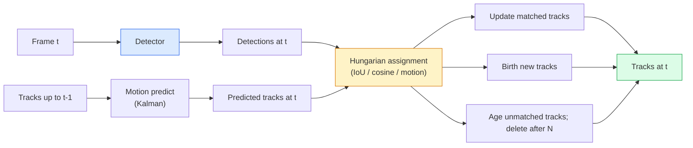

<!-- i18n:manual -->
# Multi-Object Tracking и память видео

> Tracking — это детекция плюс association. Детектируйте каждый кадр. Сопоставляйте детекции этого кадра с треками прошлого кадра по ID.

**Type:** Build
**Languages:** Python
**Prerequisites:** Phase 4 Lesson 06 (YOLO Detection), Phase 4 Lesson 08 (Mask R-CNN), Phase 4 Lesson 24 (SAM 3)
**Time:** ~60 minutes

## Learning Objectives

- Отличать tracking-by-detection от query-based tracking и называть семейства алгоритмов (SORT, DeepSORT, ByteTrack, BoT-SORT, SAM 2 memory tracker, SAM 3.1 Object Multiplex)
- Реализовать с нуля IoU + Hungarian assignment для классического tracking-by-detection
- Объяснить memory bank в SAM 2 и почему он переживает перекрытия лучше, чем association по IoU
- Читать три метрики tracking (MOTA, IDF1, HOTA) и выбирать ту, которая важна для конкретной задачи

> 🎒 **На пальцах.** Детектор — это фотограф: он говорит «здесь машина» на каждом кадре отдельно. Tracker — это вахтёр со списком: он помнит, что вот эта машина — та же самая, что была секунду назад, и зовёт её «машина №4». На 30 fps за минуту видео детектор выдаёт 1800 кадров отдельных ответов; tracker сшивает их в несколько десятков непрерывных историй.

## The Problem

Детектор говорит, где находятся объекты на одном кадре. Tracker говорит, какая детекция на кадре `t` — тот же объект, что детекция на кадре `t-1`. Без этого нельзя посчитать объекты, пересекающие линию, вести мяч сквозь перекрытие или сказать «машина №4 стоит в полосе уже 8 секунд».

Tracking нужен любому продукту, который работает с видео: спортивная аналитика, видеонаблюдение, автономное вождение, анализ медицинского видео, наблюдение за дикими животными, подсчёт логотипов. Кирпичи везде одинаковые: покадровый детектор, модель движения (Kalman filter или что-то посложнее), шаг association (Hungarian algorithm по IoU / косинусу / обученным признакам) и жизненный цикл трека (рождение, обновление, смерть).

2026 год принёс два новых паттерна: **SAM 2 memory-based tracking** (association по памяти признаков вместо модели движения) и **SAM 3.1 Object Multiplex** (общая память для многих экземпляров одного концепта). Сначала разберём классический стек, потом подход с памятью.

> 🎒 **На пальцах.** Представьте турникет на входе в метро: посчитать «сколько человек прошло» можно только если вы отличаете нового человека от того же самого, который потоптался на месте два кадра. Детектор без tracking насчитал бы одного и того же человека 30 раз за секунду.

## The Concept

### Tracking-by-detection



Любой tracker, который вы встретите в 2026 году, — вариация этого цикла. Различия:

- **SORT** (2016): Kalman filter + Hungarian по IoU. Просто, быстро, без модели внешнего вида.
- **DeepSORT** (2017): SORT + CNN-признак внешнего вида на каждый трек (ReID embedding). Лучше переживает пересечения.
- **ByteTrack** (2021): вторым проходом привязывает детекции с низкой уверенностью; признаки внешнего вида не нужны, но результат на MOT17 — лучший.
- **BoT-SORT** (2022): Byte + компенсация движения камеры + ReID.
- **StrongSORT / OC-SORT** — потомки ByteTrack с лучшей моделью движения и внешнего вида.

> 🎒 **На пальцах.** Схема выше читается как конвейер на почте: детектор выкладывает новые посылки, Kalman filter подсказывает, куда за это время уехали старые, Hungarian algorithm распределяет посылки по полкам. Что не попало ни на одну полку — новый трек. Полка, к которой ничего не пришло N кадров подряд, выбрасывается.

### Kalman filter in one paragraph

Kalman filter хранит для каждого трека состояние `(x, y, w, h, dx, dy, dw, dh)` вместе с ковариацией. На каждом кадре он сначала **предсказывает** состояние по модели постоянной скорости, потом **обновляет** его привязанной детекцией. Обновление доверяет детекции тем сильнее, чем выше неопределённость предсказания. Так получаются гладкие траектории и возможность продолжить трек через короткое перекрытие (1-5 кадров).

Любой классический tracker использует Kalman filter на шаге предсказания движения.

> 🎒 **На пальцах.** Восемь чисел на трек: четыре про рамку (где и какого размера) и четыре про скорость (куда и как быстро едет и растёт). Для 50 треков это всего 400 чисел — меньше, чем в одной строке пикселей кадра. Именно поэтому Kalman filter практически ничего не стоит по времени.

### The Hungarian algorithm

Дана матрица стоимостей `M x N` (треки x детекции); нужно найти назначение один-к-одному с минимальной суммарной стоимостью. Стоимость обычно равна `1 - IoU(track_bbox, detection_bbox)` или косинусной близости признаков внешнего вида со знаком минус. Сложность O((M+N)^3); при M, N до ~1000 в Python это достаточно быстро через `scipy.optimize.linear_sum_assignment`.

> 🎒 **На пальцах.** Это задача «кто с кем танцует»: 50 треков, 60 детекций, надо разбить на пары так, чтобы суммарное несовпадение было минимальным. Перебор всех вариантов невозможен, а Hungarian algorithm решает это за (50+60)^3 ≈ 1,3 млн шагов — доли миллисекунды.

### ByteTrack's key idea

Обычные трекеры выбрасывают детекции с низкой уверенностью (< 0.5). ByteTrack оставляет их как **кандидатов второго прохода**: после привязки треков к уверенным детекциям непривязанные треки пробуют дотянуться до неуверенных детекций с чуть более мягким порогом IoU. Это возвращает объекты после коротких перекрытий и убирает переключения ID в толпе.

> 🎒 **На пальцах.** Человек зашёл за столб — детектор видит его наполовину и ставит уверенность 0.35. Обычный tracker это выбросит и через 5 кадров заведёт новый ID. ByteTrack говорит: «слабая детекция всё равно лучше пустоты», привязывает её к старому треку, и ID сохраняется.

### SAM 2 memory-based tracking

SAM 2 работает с видео, держа **memory bank** — пространственно-временные признаки на каждый экземпляр. По подсказке (клик, рамка, текст) на одном кадре он кодирует экземпляр в память. На следующих кадрах память проходит cross-attention с признаками нового кадра, и декодер выдаёт маску того же экземпляра на новом кадре.

Ни Kalman filter, ни Hungarian assignment. Association спрятан внутри операции внимания к памяти.

Плюсы:
- Устойчив к длинным перекрытиям (память переносит идентичность через много кадров).
- Open-vocabulary в связке с текстовыми подсказками SAM 3.
- Работает без отдельной модели движения.

Минусы:
- Медленнее ByteTrack, когда объектов много.
- Memory bank растёт и упирается в размер контекстного окна.

> 🎒 **На пальцах.** IoU-tracker помнит только «где рамка была вчера»; если объект исчез на 10 кадров, связь порвана. Memory bank помнит, как объект выглядит: рыжая куртка ушла за автобус на две секунды (60 кадров) и вышла с другой стороны — модель узнаёт её по внешности, а не по координатам.

### SAM 3.1 Object Multiplex

Раньше tracking в SAM 2 / SAM 3 держал отдельный memory bank на каждый экземпляр. Для 50 объектов — 50 memory bank. Object Multiplex (март 2026) схлопывает их в одну общую память с **query-токенами на каждый экземпляр**. Стоимость растёт сублинейно по числу экземпляров.

Multiplex — новый стандарт для tracking в толпе в 2026 году: концертная толпа, рабочие на складе, перекрёстки.

> 🎒 **На пальцах.** Было: 50 человек — 50 отдельных блокнотов, и каждый кадр надо перечитать все 50. Стало: один общий блокнот и 50 закладок в нём. Память читается один раз, а не 50, поэтому 50 объектов стоят далеко не в 50 раз дороже одного.

### Three metrics to know

- **MOTA (Multi-Object Tracking Accuracy)** — 1 - (FN + FP + переключения ID) / GT. Взвешена по типу ошибки; одна метрика, которая смешивает провалы детекции и провалы association.
- **IDF1 (ID F1)** — гармоническое среднее ID precision и ID recall. Смотрит именно на то, насколько хорошо каждый ground-truth трек сохраняет свой ID во времени. Лучше MOTA для задач, чувствительных к переключениям ID.
- **HOTA (Higher Order Tracking Accuracy)** — раскладывается на точность детекции (DetA) и точность association (AssA). Стандарт сообщества с 2020 года; самая полная метрика.

Для видеонаблюдения (кто есть кто) отчитываются по IDF1. Для спортивной аналитики (подсчёт передач) — HOTA. Для общего академического сравнения — HOTA.

> 🎒 **На пальцах.** Пусть в разметке 1000 объекто-кадров, вы пропустили 50, придумали 30 лишних и 20 раз перепутали ID. MOTA = 1 - (50 + 30 + 20) / 1000 = 0.90. Красиво, но эти 20 переключений ID утонули среди ошибок детекции — а для видеонаблюдения важны именно они. Поэтому и берут IDF1.

```figure
cv3-track-assoc
```

## Build It

### Step 1: IoU-based cost matrix

```python
import numpy as np


def bbox_iou(a, b):
    """
    a, b: (N, 4) arrays of [x1, y1, x2, y2].
    Returns (N_a, N_b) IoU matrix.
    """
    ax1, ay1, ax2, ay2 = a[:, 0], a[:, 1], a[:, 2], a[:, 3]
    bx1, by1, bx2, by2 = b[:, 0], b[:, 1], b[:, 2], b[:, 3]
    inter_x1 = np.maximum(ax1[:, None], bx1[None, :])
    inter_y1 = np.maximum(ay1[:, None], by1[None, :])
    inter_x2 = np.minimum(ax2[:, None], bx2[None, :])
    inter_y2 = np.minimum(ay2[:, None], by2[None, :])
    inter = np.clip(inter_x2 - inter_x1, 0, None) * np.clip(inter_y2 - inter_y1, 0, None)
    area_a = (ax2 - ax1) * (ay2 - ay1)
    area_b = (bx2 - bx1) * (by2 - by1)
    union = area_a[:, None] + area_b[None, :] - inter
    return inter / np.clip(union, 1e-8, None)
```

> 🎒 **На пальцах.** IoU — это «площадь пересечения делить на площадь объединения». Две рамки 20x20, сдвинутые на 5 пикселей по горизонтали: пересечение 15 × 20 = 300, объединение 400 + 400 - 300 = 500, IoU = 0.6. Одинаковые рамки дают 1.0, непересекающиеся — 0.0. Деление на `np.clip(union, 1e-8, None)` нужно, чтобы пустые рамки не уронили код делением на ноль.

### Step 2: Minimal SORT-style tracker

Фиксированный Kalman с постоянной скоростью для краткости опущен — здесь используется простая association по IoU; в продакшене шаг предсказания Kalman обязателен. Полную версию даёт Python-пакет `sort`.

```python
from scipy.optimize import linear_sum_assignment


class Track:
    def __init__(self, tid, bbox, frame):
        self.id = tid
        self.bbox = bbox
        self.last_frame = frame
        self.hits = 1

    def update(self, bbox, frame):
        self.bbox = bbox
        self.last_frame = frame
        self.hits += 1


class SimpleTracker:
    def __init__(self, iou_threshold=0.3, max_age=5):
        self.tracks = []
        self.next_id = 1
        self.iou_threshold = iou_threshold
        self.max_age = max_age

    def step(self, detections, frame):
        # Приводим к массиву один раз, чтобы у каждого Track был bbox одного типа —
        # и у только что созданного здесь, и у обновлённого ниже.
        det_boxes = (np.array(detections, dtype=np.float32) if len(detections)
                     else np.empty((0, 4), dtype=np.float32))

        if not self.tracks:
            for d in det_boxes:
                self.tracks.append(Track(self.next_id, d, frame))
                self.next_id += 1
            return [(t.id, t.bbox.tolist()) for t in self.tracks]

        track_boxes = np.array([t.bbox for t in self.tracks])

        iou = bbox_iou(track_boxes, det_boxes) if len(det_boxes) else np.zeros((len(track_boxes), 0))
        cost = 1 - iou
        cost[iou < self.iou_threshold] = 1e6

        matched_det = set()
        if cost.size > 0:
            row, col = linear_sum_assignment(cost)
            for r, c in zip(row, col):
                if cost[r, c] < 1.0:
                    self.tracks[r].update(det_boxes[c], frame)
                    matched_det.add(c)

        for i, d in enumerate(det_boxes):
            if i not in matched_det:
                self.tracks.append(Track(self.next_id, d, frame))
                self.next_id += 1

        # Несовпавшие треки не трогаем: их last_frame остаётся в прошлом, так что
        # отправляет их на пенсию именно фильтр по max_age строкой ниже.
        self.tracks = [t for t in self.tracks if frame - t.last_frame <= self.max_age]
        return [(t.id, t.bbox.tolist()) for t in self.tracks]
```

60 строк. На вход — покадровые детекции, на выход — покадровые ID треков. Реальные системы добавляют предсказание Kalman, второй проход ByteTrack и признаки внешнего вида.

> 🎒 **На пальцах.** Разберите три числа в коде. `iou_threshold=0.3`: пара с перекрытием меньше 30% получает стоимость 1e6, то есть «никогда не соединяй». `cost = 1 - iou`: IoU 0.6 превращается в стоимость 0.4, и Hungarian algorithm минимизирует сумму таких стоимостей. `max_age=5`: трек, к которому 5 кадров подряд ничего не привязалось, удаляется — на 30 fps это примерно 0.17 секунды терпения.

> 🎒 **На пальцах.** Заметьте, чего в коде нет: множества совпавших треков. Оно и не нужно — трек, которому в этом кадре ничего не досталось, просто остаётся с прежним `last_frame`, и разница `frame - t.last_frame` растёт сама. Через `max_age` кадров он вылетает по фильтру. Так что «забыть про несовпавшие треки» здесь — не недосмотр, а ровно то поведение SORT: объект, пропавший на 2-3 кадра (кто-то прошёл перед ним), возвращается с тем же ID, а исчезнувший навсегда тихо удаляется.

> 🎒 **На пальцах.** Ещё одна деталь про типы. `det_boxes` строится один раз в начале `step`, поэтому `bbox` внутри любого `Track` — всегда массив numpy, а не список: и у трека, рождённого на первом кадре, и у трека, обновлённого на сотом. Наружу же оба возвращаются через `.tolist()`, то есть вызывающий код всегда получает обычные списки Python. Такие мелочи экономят часы отладки: смешивать список и массив в одном поле — верный способ получить `TypeError` через месяц в самом неожиданном месте.

### Step 3: Synthetic trajectory test

```python
def synthetic_frames(num_frames=20, num_objects=3, H=240, W=320, seed=0):
    rng = np.random.default_rng(seed)
    starts = rng.uniform(20, 200, size=(num_objects, 2))
    velocities = rng.uniform(-5, 5, size=(num_objects, 2))
    frames = []
    for f in range(num_frames):
        dets = []
        for i in range(num_objects):
            cx, cy = starts[i] + f * velocities[i]
            dets.append([cx - 10, cy - 10, cx + 10, cy + 10])
        frames.append(dets)
    return frames


tracker = SimpleTracker()
for f, dets in enumerate(synthetic_frames()):
    tracks = tracker.step(dets, f)
```

Три объекта, движущиеся по прямым, должны сохранить свои ID на всех 20 кадрах.

> 🎒 **На пальцах.** Скорости берутся из диапазона от -5 до 5 пикселей за кадр, а рамки — 20x20. Даже при максимальном сдвиге в 5 пикселей IoU между соседними кадрами около 0.6, то есть вдвое выше порога 0.3. Поэтому тест обязан пройти чисто: 0 переключений ID. Если поставить скорость 25 пикселей за кадр, рамки перестанут пересекаться и IoU-association развалится.

### Step 4: ID-switch metric

```python
def count_id_switches(tracks_per_frame, gt_per_frame):
    """
    tracks_per_frame:  list of list of (track_id, bbox)
    gt_per_frame:      list of list of (gt_id, bbox)
    Returns number of ID switches.
    """
    prev_assignment = {}
    switches = 0
    for tracks, gts in zip(tracks_per_frame, gt_per_frame):
        if not tracks or not gts:
            continue
        t_boxes = np.array([b for _, b in tracks])
        g_boxes = np.array([b for _, b in gts])
        iou = bbox_iou(g_boxes, t_boxes)
        for g_idx, (gt_id, _) in enumerate(gts):
            j = iou[g_idx].argmax()
            if iou[g_idx, j] > 0.5:
                t_id = tracks[j][0]
                if gt_id in prev_assignment and prev_assignment[gt_id] != t_id:
                    switches += 1
                prev_assignment[gt_id] = t_id
    return switches
```

Это упрощённая метрика в духе IDF1: считаем, сколько раз объект из разметки меняет назначенный ему предсказанный ID трека. Настоящий инструментарий MOTA / IDF1 / HOTA живёт в `py-motmetrics` и `TrackEval`.

> 🎒 **На пальцах.** Порог `> 0.5` здесь — правило «считаем совпадением только если рамки перекрываются больше чем наполовину». Логика простая: помним, какой ID трека был у объекта раньше; если сегодня к нему приклеился другой ID — это +1 к счётчику. Два человека прошли друг сквозь друга и обменялись номерами — это 2 переключения, а не одно.

## Use It

Продакшн-трекеры в 2026 году:

- `ultralytics` — YOLOv8 + встроенные ByteTrack / BoT-SORT. `results = model.track(source, tracker="bytetrack.yaml")`. Выбор по умолчанию.
- `supervision` (Roboflow) — обёртки над ByteTrack плюс утилиты для отрисовки.
- SAM 2 / SAM 3.1 — tracking на памяти через `processor.track()`.
- Свой стек: детектор (YOLOv8 / RT-DETR) + `sort-tracker` / `OC-SORT` / `StrongSORT`.

Как выбирать:

- Пешеходы / машины / коробки на 30+ fps: **ByteTrack with ultralytics**.
- Много экземпляров одного класса в толпе: **SAM 3.1 Object Multiplex**.
- Сильные перекрытия при различимой внешности: **DeepSORT / StrongSORT** (признаки ReID).
- Спорт / сложные взаимодействия: **BoT-SORT** или обучаемые трекеры (MOTRv3).

> 🎒 **На пальцах.** Практическое правило: пока объектов немного и они не пропадают надолго, берите ByteTrack — одна строка `model.track(...)` и 30+ fps на обычной видеокарте. Как только объекты пропадают на секунды или их полсотни в кадре, переходите к памяти SAM 3.1 и платите скоростью за сохранённые ID.

## Ship It

Этот урок производит:

- `outputs/prompt-tracker-picker.md` — выбирает SORT / ByteTrack / BoT-SORT / SAM 2 / SAM 3.1 по типу сцены, характеру перекрытий и бюджету задержки.
- `outputs/skill-mot-evaluator.md` — пишет полную обвязку для оценки MOTA / IDF1 / HOTA относительно эталонных треков.

## Exercises

1. **(Easy)** Запустите синтетический tracker выше на 3, 10 и 30 объектах. Отчитайтесь о числе переключений ID в каждом случае. Определите, где простая association только по IoU начинает ломаться.
2. **(Medium)** Добавьте шаг предсказания Kalman с постоянной скоростью перед association. Покажите, что короткие (2-3 кадра) перекрытия больше не вызывают переключений ID.
3. **(Hard)** Подключите memory-based tracker из SAM 2 (через `transformers`) как альтернативный бэкенд трекинга. Прогоните SimpleTracker и SAM 2 на 30-секундном ролике с толпой и сравните число переключений ID, разметив вручную эталонные ID для 5 заметных людей.

> 🎒 **На пальцах.** Подсказка к первому заданию: чем больше объектов, тем чаще рамки пересекаются между собой. При 3 объектах на кадре 320x240 они почти не встречаются, при 30 объектах на тот же кадр приходится 30 рамок 20x20 — это 12000 пикселей площади из 76800, каждый шестой пиксель занят. Именно на такой плотности IoU перестаёт быть уникальной подсказкой и ID начинают прыгать.

## Key Terms

| Term | What people say | What it actually means |
|------|----------------|----------------------|
| Tracking-by-detection | «Задетектить, потом связать» | Покадровый детектор + Hungarian assignment по IoU / внешнему виду |
| Kalman filter | «Предсказание движения» | Линейная динамика + ковариация для гладких предсказаний трека и работы с перекрытиями |
| Hungarian algorithm | «Оптимальное назначение» | Решает задачу двудольного паросочетания минимальной стоимости; `scipy.optimize.linear_sum_assignment` |
| ByteTrack | «Второй проход по слабым детекциям» | Повторно привязывает непривязанные треки к неуверенным детекциям, чтобы вернуть объекты после коротких перекрытий |
| DeepSORT | «SORT плюс внешность» | Добавляет признак ReID для сопоставления между кадрами; лучше сохраняет ID |
| Memory bank | «Фокус SAM 2» | Пространственно-временные признаки на экземпляр, хранимые через кадры; cross-attention заменяет явный association |
| Object Multiplex | «Общая память SAM 3.1» | Одна общая память с запросами на каждый экземпляр для быстрого tracking множества объектов |
| HOTA | «Современная метрика tracking» | Раскладывается на точность детекции и точность association; стандарт сообщества |

## Further Reading

- [SORT (Bewley et al., 2016)](https://arxiv.org/abs/1602.00763) — минимальная статья про tracking-by-detection
- [DeepSORT (Wojke et al., 2017)](https://arxiv.org/abs/1703.07402) — добавляет признак внешнего вида
- [ByteTrack (Zhang et al., 2022)](https://arxiv.org/abs/2110.06864) — второй проход по слабым детекциям
- [BoT-SORT (Aharon et al., 2022)](https://arxiv.org/abs/2206.14651) — компенсация движения камеры
- [HOTA (Luiten et al., 2020)](https://arxiv.org/abs/2009.07736) — разложимая метрика tracking
- [SAM 2 video segmentation (Meta, 2024)](https://ai.meta.com/sam2/) — tracker на памяти
- [SAM 3.1 Object Multiplex (Meta, March 2026)](https://ai.meta.com/blog/segment-anything-model-3/)
