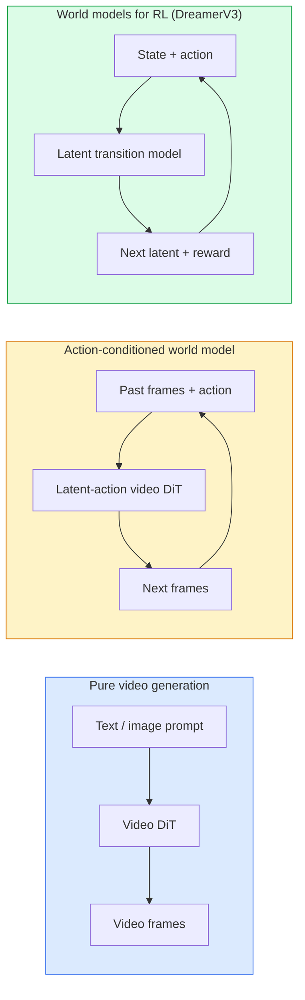

<!-- i18n:manual -->
# World models и video diffusion

> Видеомодель, предсказывающая следующие секунды сцены, — это симулятор мира. Обусловьте это предсказание действиями, и вы получите выученный игровой движок.

**Type:** Learn + Build
**Languages:** Python
**Prerequisites:** Phase 4 Lesson 10 (Diffusion), Phase 4 Lesson 12 (Video Understanding), Phase 4 Lesson 23 (DiT + Rectified Flow)
**Time:** ~75 minutes

## Learning Objectives

- Объяснить разницу между чистой моделью генерации видео (Sora 2) и world model с обусловливанием на действия (Genie 3, DreamerV3)
- Описать video DiT: пространственно-временные патчи, 3D-кодирование позиции, совместное внимание по токенам (T, H, W)
- Проследить, как world model встраивается в робототехнику: VLM планирует → видеомодель симулирует → inverse dynamics выдаёт действия
- Выбирать между Sora 2, Genie 3, Runway GWM-1 Worlds, Wan-Video и HunyuanVideo под конкретную задачу (креативное видео, интерактивная симуляция, синтез данных для автономного вождения)

> 🎒 **На пальцах.** Ребёнок, который сотню раз ронял чашку, умеет предсказать, что будет через секунду после того, как чашку столкнули со стола. Это и есть world model — только выученная не из опыта, а из миллионов видео. Дальше урок показывает, как из такого предсказателя сделать игровой движок и тренажёр для робота.

## The Problem

Генерация видео и моделирование мира сошлись в одну задачу в 2026 году. Модель, способная сгенерировать связную минуту видео, в каком-то смысле выучила, как устроено движение мира: постоянство объектов, гравитацию, причинность, стиль. Если обусловить это предсказание действиями (иди влево, открой дверь), видеомодель превращается в обучаемый симулятор, который заменяет игровой движок, симулятор вождения или среду для робототехники.

Ставки вполне конкретны. Genie 3 генерирует играбельные среды из одной картинки. Runway GWM-1 Worlds синтезирует бесконечные исследуемые сцены. Sora 2 выдаёт минутные видео с синхронным звуком и смоделированной физикой. NVIDIA Cosmos-Drive, Wayve Gaia-2 и Tesla DrivingWorld генерируют реалистичное видео вождения как обучающие данные для автономных машин. Парадигма world model тихо забирает себе sim-to-real в робототехнике.

Этот урок — «взгляд с высоты» для Phase 4. Он связывает генерацию изображений, понимание видео и агентные рассуждения в один архитектурный паттерн, к которому движется передовое исследование.

> 🎒 **На пальцах.** Симулятор вождения писали годами вручную: физика колёс, погода, поведение пешеходов. World model делает то же самое, просто досматривая видео до конца. Одна редкая ситуация вроде «пешеход выбегает ночью на обледенелом перекрёстке» стоит миллионов километров реального пробега — а модель порождает её за минуты.

## The Concept

### Three families of world-modelling



- **Sora 2** — чистая генерация видео с обусловливанием на промпт. Интерфейса действий нет. «Порулить» ею посреди rollout нельзя.
- **Genie 3**, **GWM-1 Worlds**, **Mirage / Magica** — world models с обусловливанием на действия. Выводят latent-действия из наблюдаемого видео, а потом обусловливают предсказание будущих кадров действиями. Интерактивно: вы жмёте клавиши или двигаете камеру, и сцена откликается.
- **DreamerV3** и классическое семейство world models для RL предсказывают в latent-пространстве с явным обусловливанием на действия и обучаются на сигнале награды. Менее визуально; полезнее для RL с малым числом примеров.

> 🎒 **На пальцах.** Разница как между фильмом, игрой и шахматным движком. Sora 2 — фильм: нажали «пуск», смотрите до конца, вмешаться нельзя. Genie 3 — игра: жмёте стрелку влево, картинка едет влево. DreamerV3 — движок, который вообще не показывает картинку, а считает «после этого хода счёт станет таким-то».

### Video DiT architecture

```
Video latent:          (C, T, H, W)
Patchify (spatial):    grid of P_h x P_w patches per frame
Patchify (temporal):   group P_t frames into a temporal patch
Resulting tokens:      (T / P_t) * (H / P_h) * (W / P_w) tokens
```

Кодирование позиции трёхмерное: rotary или обучаемый embedding на каждую координату (t, h, w). Внимание бывает:

- **Full joint** — все токены смотрят на все токены. O(N^2) при N токенах. Для длинных видео непозволительно.
- **Divided** — чередование временного внимания (одна пространственная позиция, по времени: `(H*W) * T^2`) и пространственного внимания (один момент времени, по пространству: `T * (H*W)^2`). Так делают TimeSformer и большинство video DiT.
- **Window** — локальные окна в (t, h, w). Так делает Video Swin.

Любая видеомодель diffusion 2026 года использует один из этих трёх паттернов плюс обусловливание AdaLN (Lesson 23) и rectified flow.

> 🎒 **На пальцах.** Патчификация — это нарезка видео на кубики, как торт. Возьмём latent 8 кадров по 16x16 и кубик 2x2x2: получится (8/2) × (16/2) × (16/2) = 4 × 8 × 8 = 256 токенов. Full joint внимание сравнит каждый токен с каждым: 256² = 65536 пар. Для минутного 1080p-видео токенов будут сотни тысяч, и квадрат от этого числа уже не помещается ни в какую память.

### Conditioning on actions: latent action models

Genie выучивает **latent action** на каждый кадр, дискриминативно предсказывая действие между парой соседних кадров. Декодер модели затем обусловливается на выведенное latent-действие, а не на явные нажатия клавиш. На инференсе пользователь может задать latent-действие (или сэмплировать его из свежего априорного распределения), и модель порождает следующий кадр, согласованный с этим действием.

Sora обходится вообще без интерфейса действий. Её декодер предсказывает следующие пространственно-временные токены по прошлым. Промпт задаёт начало; посреди генерации ничто ею не управляет.

> 🎒 **На пальцах.** Модели никто не размечал «здесь нажали пробел». Она сама смотрит на пару соседних кадров и спрашивает: «какое короткое действие могло превратить первый кадр во второй?» Ответ сжимается в маленький вектор — это и есть latent action. Дальше вы подсовываете такой вектор вручную, и получаете управление, которого в данных явно не было.

### Physical plausibility

Релиз Sora 2 в 2026 году явно рекламировал **физическую правдоподобность**: вес, равновесие, постоянство объектов, причину и следствие. Команда мерила её оценками правдоподобности вручную; модель заметно лучше Sora 1 справляется с падающими предметами, столкновениями персонажей и намеренными неудачами (неудачный прыжок).

Правдоподобность остаётся главным типом провала. Видео 2024-2025 годов, где люди едят спагетти или пьют из стаканов, показывали, что у модели нет устойчивого представления объекта. Модели 2026 года (Sora 2, Runway Gen-5, HunyuanVideo) уменьшают эту проблему, но не убирают.

> 🎒 **На пальцах.** Классический тест — спагетти: макаронина заходит в рот, но на следующем кадре её конец снова висит в воздухе. Модель рисует правдоподобный кадр, но не помнит, что объект уже съеден. Проверять это дёшево: сгенерируйте 10 роликов, где предмет заслоняют рукой на секунду, и посчитайте, в скольких он вернулся тем же самым.

### Autonomous driving world models

Driving world models генерируют реалистичные дорожные сцены с обусловливанием на траектории, ограничивающие рамки или навигационные карты. Применение:

- **Cosmos-Drive-Dreams** (NVIDIA) — генерирует минуты видео вождения для обучения RL.
- **Gaia-2** (Wayve) — синтез сцен по траектории для оценки политик.
- **DrivingWorld** (Tesla) — симулирует разную погоду, время суток, дорожную обстановку.
- **Vista** (ByteDance) — реактивный синтез сцен вождения.

Они заменяют дорогой сбор реальных данных для краевых случаев — пешеход перебегает дорогу ночью, обледенелый перекрёсток, необычный тип транспорта, — на которые иначе ушли бы миллионы километров пробега.

> 🎒 **На пальцах.** Чтобы естественным путём собрать сотню записей «пешеход выбегает на красный ночью», нужно ездить годами. Cosmos-Drive порождает минуты такого видео по заданной траектории за один прогон. Данные ненастоящие, зато редкая ситуация встречается ровно столько раз, сколько вам нужно для обучения.

### Robotics stack: VLM + video model + inverse dynamics

Складывающийся трёхкомпонентный цикл в робототехнике:

1. **VLM** разбирает цель («возьми красную чашку») и планирует последовательность действий верхнего уровня.
2. **Video generation model** симулирует, как будет выглядеть выполнение каждого действия — предсказывает наблюдения на N кадров вперёд.
3. **Inverse dynamics model** извлекает конкретные команды моторам, которые дадут такие наблюдения.

Это заменяет подгонку функции награды и прожорливый по данным RL. World model берёт на себя воображение; inverse dynamics замыкает цикл на исполнении. Genie Envisioner — одна из реализаций; к этой же структуре сходятся многие исследовательские группы.

> 🎒 **На пальцах.** Человек тоже так делает: сначала решает «взять чашку» (VLM), потом представляет движение руки (видеомодель), потом мышцы отрабатывают представленную картинку (inverse dynamics). Ключевой трюк в том, что робот тренируется в воображаемых roll-out и ломает воображаемую посуду, а не настоящую.

### Evaluation

- **Visual quality** — FVD (Fréchet Video Distance), пользовательские опросы.
- **Prompt alignment** — CLIPScore по кадрам, оценка в стиле VQA.
- **Physical plausibility** — оценка вручную по набору тестов (внутренний бенчмарк Sora 2, VBench).
- **Controllability** (для интерактивных world models) — согласованность «действие → наблюдение»; можно ли вернуться в прежнее состояние?

### Model landscape in 2026

| Model | Use | Parameters | Output | License |
|-------|-----|------------|--------|---------|
| Sora 2 | текст-в-видео, звук | — | 1 минута 1080p + звук | только API |
| Runway Gen-5 | текст/картинка-в-видео | — | ролики по 10 с | API |
| Runway GWM-1 Worlds | интерактивный мир | — | бесконечный 3D rollout | API |
| Genie 3 | интерактивный мир из картинки | 11B+ | играбельные кадры | исследовательский превью |
| Wan-Video 2.1 | открытая текст-в-видео | 14B | ролики высокого качества | некоммерческая |
| HunyuanVideo | открытая текст-в-видео | 13B | ролики по 10 с | разрешительная |
| Cosmos / Cosmos-Drive | симуляция автономного вождения | 7-14B | сцены вождения | открытая от NVIDIA |
| Magica / Mirage 2 | AI-нативный игровой движок | — | изменяемые миры | продукт |

> 🎒 **На пальцах.** Читайте таблицу по столбцу License, а не по качеству. Хотите крутить модель у себя на своих данных — остаются HunyuanVideo (13B) и Cosmos, у Wan-Video 2.1 при 14B лицензия некоммерческая. 13-14 миллиардов параметров в fp16 — это примерно 26-28 ГБ весов, то есть одна карта на 40-80 ГБ или квантизация.

```figure
v4-world-rollout
```

## Build It

### Step 1: 3D patchify for video

```python
import torch
import torch.nn as nn


class VideoPatch3D(nn.Module):
    def __init__(self, in_channels=4, dim=64, patch_t=2, patch_h=2, patch_w=2):
        super().__init__()
        self.proj = nn.Conv3d(
            in_channels, dim,
            kernel_size=(patch_t, patch_h, patch_w),
            stride=(patch_t, patch_h, patch_w),
        )
        self.patch_t = patch_t
        self.patch_h = patch_h
        self.patch_w = patch_w

    def forward(self, x):
        # x: (N, C, T, H, W)
        x = self.proj(x)
        n, c, t, h, w = x.shape
        tokens = x.reshape(n, c, t * h * w).transpose(1, 2)
        return tokens, (t, h, w)
```

3D-свёртка с шагом, равным ядру, работает как пространственно-временной патчификатор. Сетка токенов `(T, H, W) -> (T/2, H/2, W/2)`.

> 🎒 **На пальцах.** Тот же приём, что в ViT, только кубиками вместо квадратов. Свёртка с ядром 2x2x2 и шагом 2x2x2 не перекрывается сама с собой, поэтому каждый кубик из 8 вокселей превращается ровно в один токен. Вход (1, 4, 8, 16, 16) даёт сетку (4, 8, 8) — сжатие в 8 раз по числу позиций.

### Step 2: 3D position encoding

По одному позиционному кодированию на каждую ось (`t`, `h`, `w`), склеенные по размерности каналов. Настоящие видео-DiT используют здесь rotary embeddings (RoPE); версия ниже — более простая аддитивная sin/cos форма, которая несёт ту же позиционную информацию и читается легче:

```python
def sincos_pos_3d(tokens, t_dim, h_dim, w_dim, grid):
    """
    tokens: (N, T*H*W, D)
    grid: (T, H, W) sizes
    t_dim + h_dim + w_dim == D, and each of the three must be even
    """
    T, H, W = grid
    n, seq, d = tokens.shape
    if t_dim + h_dim + w_dim != d:
        raise ValueError(f"t_dim+h_dim+w_dim ({t_dim}+{h_dim}+{w_dim}) must equal D={d}")
    # Each axis contributes sin and cos over dim // 2 frequencies, i.e. 2 * (dim // 2)
    # channels. An odd dim would silently lose a channel and the concatenation below
    # would come out shorter than D.
    for name, dim in [("t_dim", t_dim), ("h_dim", h_dim), ("w_dim", w_dim)]:
        if dim % 2 != 0:
            raise ValueError(f"{name} must be even, got {dim}")
    assert seq == T * H * W
    t_idx = torch.arange(T, device=tokens.device).repeat_interleave(H * W)
    h_idx = torch.arange(H, device=tokens.device).repeat_interleave(W).repeat(T)
    w_idx = torch.arange(W, device=tokens.device).repeat(T * H)
    # Additive sin/cos over a geometric frequency ladder. Real RoPE rotates channel pairs.
    freqs_t = torch.exp(-torch.log(torch.tensor(10000.0)) * torch.arange(t_dim // 2, device=tokens.device) / (t_dim // 2))
    freqs_h = torch.exp(-torch.log(torch.tensor(10000.0)) * torch.arange(h_dim // 2, device=tokens.device) / (h_dim // 2))
    freqs_w = torch.exp(-torch.log(torch.tensor(10000.0)) * torch.arange(w_dim // 2, device=tokens.device) / (w_dim // 2))
    emb_t = torch.cat([torch.sin(t_idx[:, None] * freqs_t), torch.cos(t_idx[:, None] * freqs_t)], dim=-1)
    emb_h = torch.cat([torch.sin(h_idx[:, None] * freqs_h), torch.cos(h_idx[:, None] * freqs_h)], dim=-1)
    emb_w = torch.cat([torch.sin(w_idx[:, None] * freqs_w), torch.cos(w_idx[:, None] * freqs_w)], dim=-1)
    return tokens + torch.cat([emb_t, emb_h, emb_w], dim=-1)
```

Упрощённая аддитивная форма — и, несмотря на заголовок «3D position encoding», это *не* RoPE. Настоящий RoPE вращает пары каналов на тех же частотах внутри самой операции внимания, а не прибавляется к токену; позиционная информация при этом та же самая.

> 🎒 **На пальцах.** Без позиций внимание видит мешок токенов и не знает, какой кадр был раньше. Здесь размерность D просто делится на три части: `t_dim` отвечает за «когда», `h_dim` и `w_dim` — за «где». Проверка `t_dim + h_dim + w_dim != d` падает с ошибкой именно потому, что три куска обязаны в сумме дать всю ширину токена.

> 🎒 **На пальцах.** Вторая проверка — про чётность — из той же серии, но ловушка тоньше. Каждая ось берёт `dim // 2` частот и на каждую выдаёт синус и косинус, то есть занимает `2 * (dim // 2)` каналов. Для чётного `dim` это ровно `dim`, а для нечётного — на один меньше: при `t_dim = 21` получится `2 * 10 = 20`. Ошибки не будет, просто склейка трёх кусков выйдет короче D, и `tokens + ...` упадёт где-то дальше с невнятным сообщением про формы. Поэтому лучше сказать «`t_dim` must be even, got 21» сразу.

### Step 3: Divided attention block

```python
class DividedAttentionBlock(nn.Module):
    def __init__(self, dim=64, heads=2):
        super().__init__()
        self.time_attn = nn.MultiheadAttention(dim, heads, batch_first=True)
        self.space_attn = nn.MultiheadAttention(dim, heads, batch_first=True)
        self.ln1 = nn.LayerNorm(dim)
        self.ln2 = nn.LayerNorm(dim)
        self.ln3 = nn.LayerNorm(dim)
        self.mlp = nn.Sequential(nn.Linear(dim, 4 * dim), nn.GELU(), nn.Linear(4 * dim, dim))

    def forward(self, x, grid):
        T, H, W = grid
        n, seq, d = x.shape
        # time attention: same (h, w), across t
        xt = x.view(n, T, H * W, d).permute(0, 2, 1, 3).reshape(n * H * W, T, d)
        a, _ = self.time_attn(self.ln1(xt), self.ln1(xt), self.ln1(xt), need_weights=False)
        xt = (xt + a).reshape(n, H * W, T, d).permute(0, 2, 1, 3).reshape(n, seq, d)
        # space attention: same t, across (h, w)
        xs = xt.view(n, T, H * W, d).reshape(n * T, H * W, d)
        a, _ = self.space_attn(self.ln2(xs), self.ln2(xs), self.ln2(xs), need_weights=False)
        xs = (xs + a).reshape(n, T, H * W, d).reshape(n, seq, d)
        xs = xs + self.mlp(self.ln3(xs))
        return xs
```

Временное внимание работает внутри каждой пространственной позиции по времени; пространственное — внутри каждого кадра по позициям. Две операции O(T^2 + (HW)^2) вместо одной O((THW)^2). Это ядро TimeSformer и любого современного video DiT.

> 🎒 **На пальцах.** Посчитаем на нашей сетке T=4, H*W=64. Full joint: 256² = 65536 пар. Divided: временное 64 × 4² = 1024 плюс пространственное 4 × 64² = 16384, итого 17408 — почти в 4 раза меньше. На реальном видео сетка в сотни раз больше, и разрыв становится не в 4 раза, а в тысячи.

### Step 4: Compose a tiny video DiT

```python
class TinyVideoDiT(nn.Module):
    def __init__(self, in_channels=4, dim=64, depth=2, heads=2):
        super().__init__()
        self.patch = VideoPatch3D(in_channels=in_channels, dim=dim, patch_t=2, patch_h=2, patch_w=2)
        self.blocks = nn.ModuleList([DividedAttentionBlock(dim, heads) for _ in range(depth)])
        self.out = nn.Linear(dim, in_channels * 2 * 2 * 2)

    def forward(self, x):
        tokens, grid = self.patch(x)
        for blk in self.blocks:
            tokens = blk(tokens, grid)
        return self.out(tokens), grid
```

Не рабочий генератор видео; структурная демонстрация того, что все куски стыкуются по формам.

> 🎒 **На пальцах.** Схема ровно та же, что у обычного трансформера: нарезать вход на токены, прогнать через `depth` одинаковых блоков, спроецировать обратно. Выходной `nn.Linear(dim, in_channels * 2 * 2 * 2)` возвращает 4 × 8 = 32 числа на токен — ровно содержимое одного кубика 2x2x2 по 4 каналам, чтобы его можно было собрать назад в видео.

### Step 5: Check shapes

```python
vid = torch.randn(1, 4, 8, 16, 16)  # (N, C, T, H, W)
model = TinyVideoDiT()
out, grid = model(vid)
print(f"input  {tuple(vid.shape)}")
print(f"tokens grid {grid}")
print(f"output {tuple(out.shape)}")
```

Ожидаем `grid = (4, 8, 8)` и `out = (1, 256, 32)` после патчификации; голова затем проецирует в пространственно-временные патчи на каждый токен, готовые к обратной сборке в видео.

> 🎒 **На пальцах.** Сверьте числа руками. Вход (1, 4, 8, 16, 16): 8 кадров 16x16 по 4 канала. Кубик 2x2x2 даёт сетку 4 × 8 × 8, а 4 × 8 × 8 = 256 токенов. На токен 32 числа. Итого 256 × 32 = 8192 значений на выходе против 4 × 8 × 16 × 16 = 8192 на входе — ни одно число не потерялось, просто переупаковано.

## Use It

Как это доступно в проде в 2026 году:

- **Sora 2 API** (OpenAI) — текст-в-видео, синхронный звук. Премиальная цена.
- **Runway Gen-5 / GWM-1** (Runway) — картинка-в-видео, интерактивные миры.
- **Wan-Video 2.1 / HunyuanVideo** — открытый код, разворачивается у себя.
- **Cosmos / Cosmos-Drive** (NVIDIA) — открытые веса для симуляции вождения.
- **Genie 3** — исследовательский превью, доступ по заявке.

Для демо интерактивной world model: начните с Wan-Video ради качества и надстройте адаптер latent-действий ради интерактивности. Для симуляции автономного вождения открытый эталон 2026 года — Cosmos-Drive.

В робототехнике живой стек выглядит так:

1. Языковая цель -> VLM (Qwen3-VL) -> план верхнего уровня.
2. План -> видеомодель с latent-действиями -> воображаемый rollout.
3. Rollout -> inverse dynamics model -> действия нижнего уровня.
4. Действия исполнены -> наблюдение возвращается в шаг 1.

> 🎒 **На пальцах.** Обратите внимание на цикл: шаг 4 отправляет наблюдение обратно в шаг 1. Именно поэтому ошибки не накапливаются бесконечно — каждый круг модель сверяется с реальностью. Воображаемый rollout длиной 30-60 кадров (1-2 секунды) обычно и есть тот горизонт, на котором предсказание ещё можно доверять.

## Ship It

Этот урок производит:

- `outputs/prompt-video-model-picker.md` — выбирает между Sora 2 / Runway / Wan / HunyuanVideo / Cosmos по задаче, лицензии и задержке.
- `outputs/skill-physical-plausibility-checks.md` — навык, который определяет автоматические проверки (постоянство объектов, гравитация, непрерывность), запускаемые на любом сгенерированном видео перед выкаткой.

## Exercises

1. **(Easy)** Посчитайте число токенов для 5-секундного видео 360p при 30 fps (150 кадров 480x360) с patch-t=2, patch-h=8, patch-w=8. Прикиньте, сколько памяти займёт внимание на таком размере.
2. **(Medium)** Замените блок divided attention выше на блок полного совместного внимания и измерьте формы и число параметров. Объясните, почему divided attention необходим для настоящих видеомоделей.
3. **(Hard)** Постройте минимальную видеомодель с latent-действиями: возьмите датасет троек (frame_t, action_t, frame_{t+1}) из любой простой 2D-игры, обучите крошечный video DiT с обусловливанием на embedding действия и покажите, что разные действия дают разные следующие кадры.

> 🎒 **На пальцах.** Подсказка к первому заданию: все числа уже даны в условии — 150 кадров размером 480x360. Токенов получается (150/2) × (360/8) × (480/8) = 75 × 45 × 60 = 202500. Матрица полного внимания — это 202500², то есть примерно 4,1 × 10^10 чисел: даже в fp16 по 2 байта это около 82 ГБ на одну голову одного слоя. В H100 влезает 80 ГБ. Отсюда и весь смысл divided attention.

## Key Terms

| Term | What people say | What it actually means |
|------|----------------|----------------------|
| World model | «Выученный симулятор» | Модель, предсказывающая будущие наблюдения по состоянию и действию |
| Video DiT | «Пространственно-временной трансформер» | Diffusion-трансформер с 3D-патчификацией и divided attention |
| Latent action | «Выведенное управление» | Дискретный или непрерывный latent действия, выведенный из пары кадров; используется для обусловливания генерации следующего кадра |
| Divided attention | «Сначала время, потом пространство» | Две операции внимания на блок — по времени, затем по пространству, — чтобы удержать O(N^2) в разумных пределах |
| Object permanence | «Вещи не исчезают» | Свойство сцены, которое видеомодели обязаны выучить; классический провал на еде и стеклянной посуде |
| FVD | «Fréchet Video Distance» | Видеоаналог FID; основная метрика визуального качества |
| Inverse dynamics model | «Из наблюдений в действия» | По паре (состояние, следующее состояние) выдаёт связывающее их действие; замыкает цикл в робототехнике |
| Cosmos-Drive | «Симулятор вождения от NVIDIA» | World model автономного вождения с открытыми весами для RL и оценки |

## Further Reading

- [Sora technical report (OpenAI)](https://openai.com/index/video-generation-models-as-world-simulators/)
- [Genie: Generative Interactive Environments (Bruce et al., 2024)](https://arxiv.org/abs/2402.15391) — world models с latent-действиями
- [TimeSformer (Bertasius et al., 2021)](https://arxiv.org/abs/2102.05095) — divided attention для видеотрансформеров
- [DreamerV3 (Hafner et al., 2023)](https://arxiv.org/abs/2301.04104) — world models для RL
- [Cosmos-Drive-Dreams (NVIDIA, 2025)](https://research.nvidia.com/labs/toronto-ai/cosmos-drive-dreams/) — world model для вождения
- [Top 10 Video Generation Models 2026 (DataCamp)](https://www.datacamp.com/blog/top-video-generation-models)
- [From Video Generation to World Model — survey repo](https://github.com/ziqihuangg/Awesome-From-Video-Generation-to-World-Model/)
