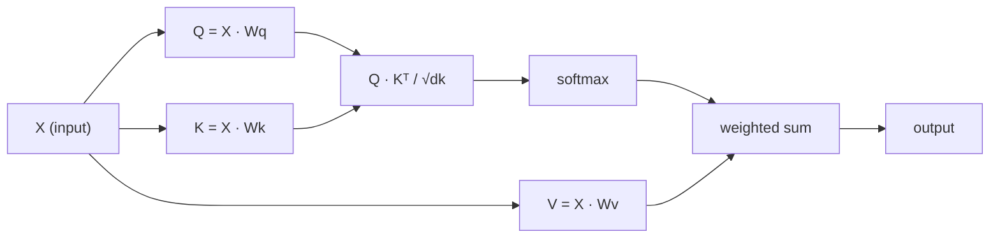

<!-- i18n:manual -->
# Self-attention с нуля

> Attention — это таблица поиска, в которой каждое слово спрашивает «кто для меня важен?» — и учится отвечать.

**Type:** Build
**Languages:** Python
**Prerequisites:** Phase 3 (Deep Learning Core), Phase 5 · 09 (Sequence-to-Sequence), Phase 5 · 10 (Attention Mechanism)
**Time:** ~90 minutes

## Learning Objectives

- Реализовать scaled dot-product self-attention с нуля на одном NumPy, включая проекции query/key/value и взвешенную softmax сумму
- Собрать слой multi-head attention, который режет данные на головы, считает attention параллельно и склеивает результаты
- Проследить, как матрица attention улавливает связи между токенами, и объяснить, почему деление на sqrt(d_k) спасает softmax от насыщения
- Применить причинную маску, чтобы превратить двунаправленный attention в авторегрессионный (декодерный)

## The Problem

RNN обрабатывают последовательности по одному токену за раз. К тому моменту, как вы доберётесь до токена 50, информация из токена 1 уже прошла через 50 шагов сжатия. Дальние зависимости расплющиваются в скрытое состояние фиксированного размера — бутылочное горлышко, которое не лечится никаким количеством гейтов LSTM.

Статья Бахданау 2014 года показала лекарство: пусть декодер оглядывается на все позиции энкодера и сам решает, какие из них важны на текущем шаге. Но attention там всё ещё был прикручен к RNN. Статья 2017 года «Attention Is All You Need» задала вопрос жёстче: а что если attention — *единственный* механизм? Никакой рекуррентности. Никаких свёрток. Только attention.

Self-attention позволяет каждой позиции последовательности посмотреть на каждую другую за один параллельный шаг. Именно это делает трансформеры быстрыми, масштабируемыми и доминирующими.

> 🎒 **На пальцах.** Слово «self» здесь означает ровно одно: раньше декодер смотрел на *другую* последовательность (исходное предложение), а теперь предложение смотрит само на себя. В «кот сидел на коврике» слово «сидел» спрашивает у всех шести слов сразу: кто мой подлежащий, где место действия. И получает ответ за один шаг, а не за шесть.

## The Concept

### The Database Lookup Analogy

Представьте attention как мягкий поиск по базе данных:

```
Traditional database:
  Query: "capital of France"  -->  exact match  -->  "Paris"

Attention:
  Query: "capital of France"  -->  similarity to ALL keys  -->  weighted blend of ALL values
```

Каждый токен порождает три вектора:
- **Query (Q)**: «Что я ищу?»
- **Key (K)**: «Что во мне содержится?»
- **Value (V)**: «Какую информацию я отдам, если меня выберут?»

Скалярное произведение между query и всеми key даёт оценки attention. Высокая оценка означает «этот key подходит под мой запрос». Оценки взвешивают values. Выход — взвешенная сумма values.

> 🎒 **На пальцах.** Обычная база данных отвечает «Париж» или не отвечает ничего. Attention так не умеет — он всегда возвращает смесь. Если ключи похожи на запрос на 0.7, 0.2 и 0.1, ответом будет `0.7 * value1 + 0.2 * value2 + 0.1 * value3`. Точного попадания нет никогда, зато нет и промаха.

### Q, K, V Computation

Каждый эмбеддинг токена прогоняется через три обучаемые матрицы весов:

```
Input embeddings (sequence of n tokens, each d-dimensional):

  X = [x1, x2, x3, ..., xn]       shape: (n, d)

Three weight matrices:

  Wq  shape: (d, dk)
  Wk  shape: (d, dk)
  Wv  shape: (d, dv)

Projections:

  Q = X @ Wq    shape: (n, dk)      each token's query
  K = X @ Wk    shape: (n, dk)      each token's key
  V = X @ Wv    shape: (n, dv)      each token's value
```

Наглядно, для одного токена:

```
             Wq
  x_i ------[*]------> q_i    "What am I looking for?"
       |
       |     Wk
       +----[*]------> k_i    "What do I contain?"
       |
       |     Wv
       +----[*]------> v_i    "What do I offer?"
```

> 🎒 **На пальцах.** Подставьте числа: 6 слов, эмбеддинг размером 8, `dk = 4`. Тогда `X` — таблица 6 × 8, `Wq` — 8 × 4, а `Q = X @ Wq` — таблица 6 × 4. То есть у каждого из шести слов появился свой запрос из четырёх чисел. И обратите внимание: матрицы `Wq`, `Wk`, `Wv` одни на всё предложение, слово-специфичным результат делает только сам эмбеддинг.

### The Attention Matrix

Когда Q, K, V посчитаны для всех токенов, оценки attention складываются в матрицу:

```
Scores = Q @ K^T    shape: (n, n)

              k1    k2    k3    k4    k5
        +-----+-----+-----+-----+-----+
   q1   | 2.1 | 0.3 | 0.1 | 0.8 | 0.2 |   <- how much q1 attends to each key
        +-----+-----+-----+-----+-----+
   q2   | 0.4 | 1.9 | 0.7 | 0.1 | 0.3 |
        +-----+-----+-----+-----+-----+
   q3   | 0.2 | 0.6 | 2.3 | 0.5 | 0.1 |
        +-----+-----+-----+-----+-----+
   q4   | 0.9 | 0.1 | 0.4 | 1.7 | 0.6 |
        +-----+-----+-----+-----+-----+
   q5   | 0.1 | 0.3 | 0.2 | 0.5 | 2.0 |
        +-----+-----+-----+-----+-----+

Each row: one token's attention over the entire sequence
```

Проследите за одним query за раз, как он проходит по ключам: каждая строка оценивает все токены, softmax превращает оценки в веса, и вектор контекста — это взвешенная смесь values.

> 🎒 **На пальцах.** Посмотрите на диагональ таблицы выше: 2.1, 1.9, 2.3, 1.7, 2.0 — самые большие числа в каждой строке. Это токены, смотрящие на самих себя, и ничего удивительного: собственный key похож на собственный query сильнее всего. Матрица N × N для 5 токенов — это 25 чисел; для предложения из 100 слов их уже 10 000.

```figure
attention-matrix
```

### Why Scale?

Скалярные произведения растут вместе с размерностью dk. При dk = 64 они запросто уходят в десятки, загоняя softmax в область, где градиенты исчезают. Лечение: поделить на sqrt(dk).

```
Scaled scores = (Q @ K^T) / sqrt(dk)
```

Так значения остаются в диапазоне, где softmax даёт полезные градиенты.

> 🎒 **На пальцах.** Почему растёт: скалярное произведение — это сумма dk слагаемых, и чем их больше, тем больше типичная сумма. Для случайных векторов масштаб оценки растёт примерно как sqrt(dk), поэтому на него и делят. Прочувствуйте разницу: softmax от `[10, 2]` даёт примерно `[0.9997, 0.0003]` — модель уже уверена на 99.97% и учиться ей нечему, а softmax от `[1.25, 0.25]` даёт `[0.73, 0.27]`, где градиент ещё живой.

### Softmax Turns Scores into Weights

Softmax превращает сырые оценки в распределение вероятностей по каждой строке:

```
Raw scores for q1:   [2.1, 0.3, 0.1, 0.8, 0.2]
                            |
                         softmax
                            |
Attention weights:   [0.52, 0.09, 0.07, 0.14, 0.08]   (sums to ~1.0)
```

Теперь у каждого токена есть набор весов, говорящий, насколько сильно смотреть на каждый другой токен.

> 🎒 **На пальцах.** Проверьте сумму весов из примера: 0.52 + 0.09 + 0.07 + 0.14 + 0.08 = 0.90 — авторы округлили до сотых, поэтому и написано «сумма ~1.0». Важнее другое: оценка 2.1 против 0.3 отличается в 7 раз, а вес — в 5.8 раза. Softmax усиливает разрыв через экспоненту, но не превращает его в выбор «всё или ничего».

### Weighted Sum of Values

Итоговый выход для каждого токена — взвешенная сумма всех векторов value:

```
output_i = sum( attention_weight[i][j] * v_j  for all j )

For token 1:
  output_1 = 0.52 * v1 + 0.09 * v2 + 0.07 * v3 + 0.14 * v4 + 0.08 * v5
```

> 🎒 **На пальцах.** Если бы `v1 = [1, 0]`, а все остальные `v` были нулевыми, выход первого токена был бы `[0.52, 0]`. В реальности складываются пять ненулевых векторов, и выход — это новое представление слова, в котором 52% его самого и 48% контекста. Именно так слово «банк» после attention начинает отличаться в «берег реки» и «взял кредит».

### Full Pipeline



Формула в одну строку:

```
Attention(Q, K, V) = softmax( Q @ K^T / sqrt(dk) ) @ V
```

```figure
softmax-attention-scaling
```

> 🎒 **На пальцах.** Читайте формулу справа налево, как конвейер: `Q @ K^T` — «кто на кого похож», деление на `sqrt(dk)` — «сбавь громкость», `softmax` — «переведи в доли», `@ V` — «собери смесь по этим долям». Четыре действия, и это весь трансформер по существу. Всё остальное в архитектуре — обвязка вокруг этих четырёх шагов.

## Build It

### Step 1: Softmax from scratch

Softmax превращает сырые логиты в вероятности. Вычитаем максимум ради численной устойчивости.

```python
import numpy as np

def softmax(x):
    shifted = x - np.max(x, axis=-1, keepdims=True)
    exp_x = np.exp(shifted)
    return exp_x / np.sum(exp_x, axis=-1, keepdims=True)

logits = np.array([2.0, 1.0, 0.1])
print(f"logits:  {logits}")
print(f"softmax: {softmax(logits)}")
print(f"sum:     {softmax(logits).sum():.4f}")
```

> 🎒 **На пальцах.** Посчитайте вручную для `[2.0, 1.0, 0.1]`: после вычитания максимума получим `[0, -1, -1.9]`, экспоненты дадут `1, 0.368, 0.150`, сумма 1.518, а доли — `0.659, 0.242, 0.099`. Заметьте `axis=-1`: softmax считается по последней оси, то есть отдельно по каждой строке матрицы. Перепутать ось — самая частая ошибка в этом коде.

### Step 2: Scaled dot-product attention

Главная функция. Принимает матрицы Q, K, V и возвращает выход attention плюс матрицу весов.

```python
def scaled_dot_product_attention(Q, K, V):
    dk = Q.shape[-1]
    scores = Q @ K.T / np.sqrt(dk)
    weights = softmax(scores)
    output = weights @ V
    return output, weights
```

> 🎒 **На пальцах.** Четыре строки — и это буквально сердце всех современных LLM. Проверьте формы: `Q` размером (n, dk), `K.T` — (dk, n), значит `scores` — (n, n). Дальше `weights` тоже (n, n), а `weights @ V` возвращает (n, dv) — столько же строк, сколько токенов. Вошла последовательность, вышла последовательность той же длины, но обогащённая контекстом.

### Step 3: Self-attention class with learned projections

Полноценный модуль self-attention с матрицами весов Wq, Wk, Wv, инициализированными в стиле Xavier.

```python
class SelfAttention:
    def __init__(self, d_model, dk, dv, seed=42):
        rng = np.random.default_rng(seed)
        scale = np.sqrt(2.0 / (d_model + dk))
        self.Wq = rng.normal(0, scale, (d_model, dk))
        self.Wk = rng.normal(0, scale, (d_model, dk))
        scale_v = np.sqrt(2.0 / (d_model + dv))
        self.Wv = rng.normal(0, scale_v, (d_model, dv))
        self.dk = dk

    def forward(self, X):
        Q = X @ self.Wq
        K = X @ self.Wk
        V = X @ self.Wv
        output, weights = scaled_dot_product_attention(Q, K, V)
        return output, weights
```

> 🎒 **На пальцах.** `scale = np.sqrt(2.0 / (d_model + dk))` — это не магия, а рецепт: чем шире слой, тем мельче стартовые веса, чтобы сигнал не разгонялся и не затухал при проходе через сеть. При `d_model = 8` и `dk = 4` получается `sqrt(2/12) ≈ 0.41`. И `seed=42` тут ради воспроизводимости: у вас на экране появятся ровно те же числа, что в уроке.

### Step 4: Run it on a sentence

Создаём фейковые эмбеддинги для предложения и смотрим на веса attention.

```python
sentence = ["The", "cat", "sat", "on", "the", "mat"]
n_tokens = len(sentence)
d_model = 8
dk = 4
dv = 4

rng = np.random.default_rng(42)
X = rng.normal(0, 1, (n_tokens, d_model))

attn = SelfAttention(d_model, dk, dv, seed=42)
output, weights = attn.forward(X)

print("Attention weights (each row: where that token looks):\n")
print(f"{'':>6}", end="")
for token in sentence:
    print(f"{token:>6}", end="")
print()

for i, token in enumerate(sentence):
    print(f"{token:>6}", end="")
    for j in range(n_tokens):
        w = weights[i][j]
        print(f"{w:6.3f}", end="")
    print()
```

> 🎒 **На пальцах.** Эмбеддинги здесь случайные, а не обученные, поэтому «the» и «cat» для модели пока не значат ничего — картинка покажет структуру, а не смысл. Читайте вывод построчно: строка «cat» показывает, куда смотрит слово «cat», и её шесть чисел в сумме дают 1. Строки, а не столбцы — это второе место, где все путаются.

### Step 5: Visualize attention with ASCII heatmap

Отображаем веса attention в символы, чтобы быстро увидеть картину.

```python
def ascii_heatmap(weights, tokens, chars=" ░▒▓█"):
    n = len(tokens)
    print(f"\n{'':>6}", end="")
    for t in tokens:
        print(f"{t:>6}", end="")
    print()

    for i in range(n):
        print(f"{tokens[i]:>6}", end="")
        for j in range(n):
            level = int(weights[i][j] * (len(chars) - 1) / weights.max())
            level = min(level, len(chars) - 1)
            print(f"{'  ' + chars[level] + '   '}", end="")
        print()

ascii_heatmap(weights, sentence)
```

> 🎒 **На пальцах.** Пять символов `" ░▒▓█"` — это пять уровней яркости. Вес делится на максимальный вес в матрице, умножается на 4 и округляется до целого: вес 1.0 от максимума даст `█`, половина максимума — `▒`, почти ноль — пробел. Бедняцкая версия тепловой карты, которая при этом работает в любом терминале без matplotlib.

## Use It

`nn.MultiheadAttention` из PyTorch делает ровно то, что мы собрали, плюс разбиение на головы и выходную проекцию:

```python
import torch
import torch.nn as nn

d_model = 8
n_heads = 2
seq_len = 6

mha = nn.MultiheadAttention(embed_dim=d_model, num_heads=n_heads, batch_first=True)

X_torch = torch.randn(1, seq_len, d_model)

output, attn_weights = mha(X_torch, X_torch, X_torch)

print(f"Input shape:            {X_torch.shape}")
print(f"Output shape:           {output.shape}")
print(f"Attention weight shape: {attn_weights.shape}")
print(f"\nAttn weights (averaged over heads):")
print(attn_weights[0].detach().numpy().round(3))
```

Ключевое отличие: multi-head attention запускает несколько функций attention параллельно, у каждой свои проекции Q, K, V размера dk = d_model / n_heads, а потом склеивает результаты. Это позволяет модели одновременно отслеживать разные типы связей.

> 🎒 **На пальцах.** Считаем на числах из кода: `d_model = 8`, `n_heads = 2`, значит каждой голове достаётся по 4 измерения. Одна голова может выучить «кто с кем согласован по числу», другая — «где здесь предлог места». Форма весов будет (1, 6, 6): один пример в батче, шесть токенов, шесть токенов. И `embed_dim` обязан делиться на `num_heads` — иначе куски не нарежутся ровно.

## Ship It

Этот урок производит:
- `outputs/prompt-attention-explainer.md` — промпт, который объясняет attention через аналогию с поиском по базе данных

> 🎒 **На пальцах.** Аналогия с базой данных выбрана не случайно: она даёт человеку три вещи (запрос, ключ, содержимое) вместо семи формул. Если вы сможете объяснить Q, K и V коллеге за минуту без доски, урок усвоен. Промпт нужен ровно для того, чтобы эта минута повторялась одинаково.

## Exercises

1. Доработайте `scaled_dot_product_attention` так, чтобы он принимал необязательную матрицу маски, которая ставит в определённые позиции минус бесконечность перед softmax (именно так работает причинное/декодерное маскирование)
2. Реализуйте multi-head attention с нуля: разрежьте Q, K, V на `n_heads` кусков, посчитайте attention на каждом, склейте и прогоните через финальную матрицу весов Wo
3. Возьмите два разных предложения одинаковой длины, пропустите их через один и тот же экземпляр SelfAttention и сравните картины attention. Что изменилось? Что осталось прежним?

> 🎒 **На пальцах.** Подсказка к первому заданию: причинная маска — это верхнетреугольная матрица, в которую вписан `-inf` выше главной диагонали. Токен 3 тогда видит позиции 1, 2, 3 и не видит 4, 5, 6, потому что `exp(-inf) = 0`. Подсказка к третьему: `Wq`, `Wk`, `Wv` не изменятся ни на йоту, ведь они не зависят от входа, — а вот веса attention изменятся полностью.

## Key Terms

| Term | What people say | What it actually means |
|------|----------------|----------------------|
| Query (Q) | «Вектор вопроса» | Обучаемая проекция входа, представляющая то, какую информацию ищет этот токен |
| Key (K) | «Вектор метки» | Обучаемая проекция, представляющая то, что этот токен содержит; именно её сравнивают с query |
| Value (V) | «Вектор содержимого» | Обучаемая проекция, несущая ту самую информацию, которая суммируется по весам attention |
| Scaled dot-product attention | «Формула attention» | softmax(QK^T / sqrt(dk)) @ V — деление на масштаб спасает softmax от насыщения в больших размерностях |
| Self-attention | «Токен смотрит на себя и на других» | Attention, где Q, K и V берутся из одной последовательности, так что каждая позиция видит каждую |
| Attention weights | «Насколько сильно смотрим» | Распределение вероятностей по позициям, полученное softmax от масштабированных скалярных произведений |
| Multi-head attention | «Параллельный attention» | Несколько функций attention с разными проекциями, чьи результаты склеиваются ради более богатого представления |

## Further Reading

- [Attention Is All You Need (Vaswani et al., 2017)](https://arxiv.org/abs/1706.03762) — оригинальная статья про трансформер
- [The Illustrated Transformer (Jay Alammar)](https://jalammar.github.io/illustrated-transformer/) — лучший визуальный разбор всей архитектуры
- [The Annotated Transformer (Harvard NLP)](https://nlp.seas.harvard.edu/annotated-transformer/) — построчная реализация на PyTorch с пояснениями
