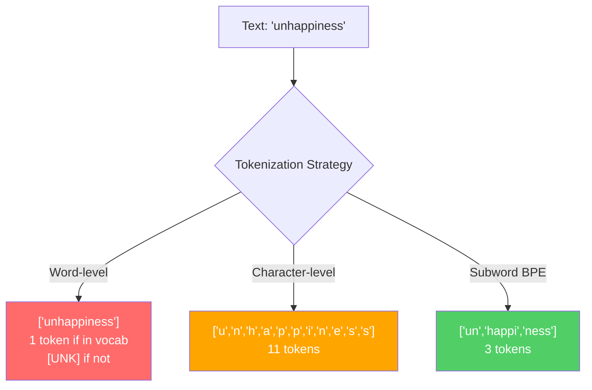
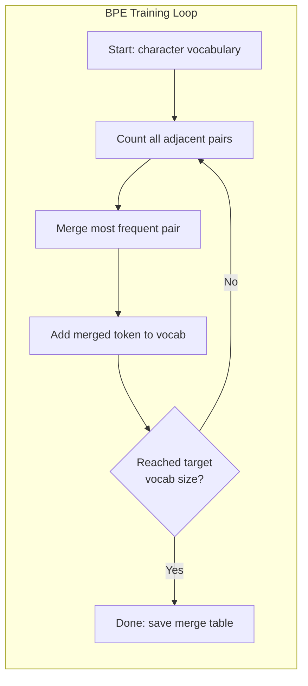
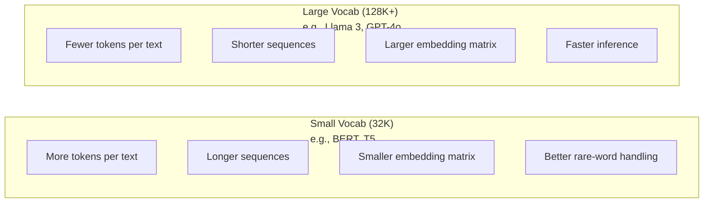

<!-- i18n:manual -->
# Токенизаторы: BPE, WordPiece, SentencePiece

> Ваша LLM не читает по-английски. Она читает целые числа. Токенизатор решает, несут эти числа смысл или тратят его впустую.

**Type:** Build
**Languages:** Python
**Prerequisites:** Phase 05 (NLP Foundations)
**Time:** ~90 minutes

## Learning Objectives

- Реализовать с нуля алгоритмы токенизации BPE, WordPiece и Unigram и сравнить их стратегии merge
- Объяснить, как размер vocabulary влияет на эффективность модели: слишком маленький даёт длинные последовательности, слишком большой транжирит параметры эмбеддингов
- Разобрать артефакты токенизации на разных языках и на коде, найдя места, где конкретные токенизаторы ломаются
- Пользоваться библиотеками tiktoken и sentencepiece, чтобы токенизировать текст и посмотреть на получившиеся ID токенов

## The Problem

Ваша LLM не читает по-английски. Она вообще не читает ни на каком языке. Она читает числа.

Расстояние между "Hello, world!" и [15496, 11, 995, 0] — это и есть токенизатор. Каждое слово, каждый пробел, каждый знак препинания должны превратиться в целое число, прежде чем модель сможет их обработать. Это преобразование не нейтрально. Оно зашивает в модель допущения, которые потом уже не отменить.

Ошибётесь — и модель тратит ёмкость, кодируя частые слова несколькими токенами. "unfortunately" превращается в четыре токена вместо одного. Ваше контекстное окно на 128K только что сжалось на 75 % для текста, богатого многосложными словами. Сделаете правильно — то же самое окно вместит вдвое больше смысла. Разница между «эта модель хорошо работает с кодом» и «эта модель давится Python» часто сводится к тому, на чём обучали токенизатор.

Каждый ваш вызов API GPT-4 или Claude оплачивается по токенам. Каждый токен, который порождает модель, стоит вычислений. Чем меньше токенов нужно на ответ, тем быстрее весь инференс от начала до конца. Токенизация — это не препроцессинг. Это архитектура.

> 🎒 **На пальцах.** Токен — это единица счёта, и за неё платят. Если слово "unfortunately" разваливается на 4 токена вместо 1, то в окно на 128 000 токенов влезет вчетверо меньше таких слов. Как если бы вы возили песок не самосвалом, а вёдрами: груз тот же, рейсов в четыре раза больше.

## The Concept

### Three Approaches That Failed (and One That Won)

Есть три очевидных способа превратить текст в числа. Два из них не работают на больших масштабах.

**Word-level tokenization** режет по пробелам и знакам препинания. "The cat sat" превращается в ["The", "cat", "sat"]. Просто. Но что делать с "tokenization"? Или с "GPT-4o"? Или с немецким составным словом вроде "Geschwindigkeitsbegrenzung"? Пословному подходу нужен огромный vocabulary, чтобы покрыть каждое слово каждого языка. Промахнулись мимо слова — получаете тот самый несчастный токен `[UNK]`, то есть «я понятия не имею, что это». В одном только английском больше миллиона словоформ. Добавьте код, URL, научную нотацию и ещё 100 языков — и вам понадобится бесконечный vocabulary.

**Character-level tokenization** идёт в другую сторону. "hello" превращается в ["h", "e", "l", "l", "o"]. Vocabulary крошечный (пара сотен символов). Неизвестных токенов не бывает вообще. Но последовательности становятся чудовищно длинными. Предложение на 10 пословных токенов превращается в 50 посимвольных. Модель вынуждена выучивать, что "t", "h", "e" вместе означают "the", — сжигая ёмкость внимания на то, что человек осваивает в три года.

**Subword tokenization** нащупывает золотую середину. Частые слова остаются целыми: "the" — один токен. Редкие слова распадаются на осмысленные куски: "unhappiness" превращается в ["un", "happi", "ness"]. Vocabulary остаётся подъёмным (от 30K до 128K токенов). Последовательности остаются короткими. Неизвестные токены практически исчезают, потому что любое слово можно собрать из subword-кусков.

Каждая современная LLM использует subword-токенизацию. GPT-2, GPT-4, BERT, Llama 3, Claude — все они. Вопрос только в том, какой алгоритм.



> 🎒 **На пальцах.** Посмотрите на схему выше: одно и то же слово "unhappiness" даёт 1 токен (или `[UNK]`) пословно, 11 токенов посимвольно и 3 токена по BPE. Три — это компромисс: коротко и без «непонятного слова». Как с адресом: писать целиком «Санкт-Петербург» удобно, писать по буквам — долго, а вот «СПб» — в самый раз.

### BPE: Byte Pair Encoding

BPE — это жадный алгоритм сжатия, приспособленный под токенизацию. Идея настолько простая, что помещается на визитке.

Начните с отдельных символов. Посчитайте каждую пару соседей в обучающем корпусе. Слейте самую частую пару в новый токен. Повторяйте, пока не дойдёте до нужного размера vocabulary.

```figure
tokenizer-bpe
```

Вот как BPE работает на крошечном корпусе из слов "lower", "lowest" и "newest":

```
Corpus (with word frequencies):
  "lower"  x5
  "lowest" x2
  "newest" x6

Step 0 -- Start with characters:
  l o w e r       (x5)
  l o w e s t     (x2)
  n e w e s t     (x6)

Step 1 -- Count adjacent pairs:
  (e,s): 8    (s,t): 8    (l,o): 7    (o,w): 7
  (w,e): 13   (e,r): 5    (n,e): 6    ...

Step 2 -- Merge most frequent pair (w,e) -> "we":
  l o we r        (x5)
  l o we s t      (x2)
  n e we s t      (x6)

Step 3 -- Recount and merge (e,s) -> "es":
  l o we r        (x5)
  l o we s t      (x2)    <- 'es' only forms from 'e'+'s', not 'we'+'s'
  n e we s t      (x6)    <- wait, the 'e' before 'we' and 's' after 'we'

Actually tracking this precisely:
  After "we" merge, remaining pairs:
  (l,o): 7   (o,we): 7   (we,r): 5   (we,s): 8
  (s,t): 8   (n,e): 6    (e,we): 6

Step 3 -- Merge (we,s) -> "wes" or (s,t) -> "st" (tied at 8, pick first):
  Merge (we,s) -> "wes":
  l o we r        (x5)
  l o wes t       (x2)
  n e wes t       (x6)

Step 4 -- Merge (wes,t) -> "west":
  l o we r        (x5)
  l o west        (x2)
  n e west        (x6)

...continue until target vocab size reached.
```

Таблица merges — это и есть токенизатор. Чтобы закодировать новый текст, применяйте merges в том порядке, в котором они были выучены. Обучающий корпус определяет, какие merges существуют, и этот выбор навсегда формирует то, что видит модель.

> 🎒 **На пальцах.** Проследите за счётом в примере: пара (w,e) встречается 13 раз — она и сливается первой, потому что чаще всех. Дальше (we,s) и (s,t) идут ноздря в ноздрю по 8. То есть алгоритм тупо смотрит, что чаще, и склеивает. Никакой лингвистики, чистая статистика.



### Byte-Level BPE (GPT-2, GPT-3, GPT-4)

Обычный BPE работает с символами Unicode. Byte-level BPE работает с сырыми байтами (0-255). Это даёт базовый vocabulary ровно из 256 штук, справляется с любым языком и любой кодировкой и никогда не порождает неизвестный токен.

Такой подход ввёл GPT-2. Базовый vocabulary покрывает все возможные байты. Merges надстраиваются поверх. Библиотека tiktoken от OpenAI реализует byte-level BPE с такими размерами vocabulary:

- GPT-2: 50 257 токенов
- GPT-3.5/GPT-4: ~100 256 токенов (кодировка cl100k_base)
- GPT-4o: 200 019 токенов (кодировка o200k_base)

> 🎒 **На пальцах.** Байт — это число от 0 до 255, и любой файл на свете состоит из байтов. Поэтому 256 базовых токенов покрывают вообще всё: эмодзи, иероглифы, битые данные. У GPT-2 из 50 257 токенов первые 256 — просто байты, а остальные 50 001 надстроены сверху.

### WordPiece (BERT)

WordPiece выглядит похоже на BPE, но выбирает merges иначе. Вместо голой частоты он максимизирует правдоподобие обучающих данных:

```
BPE merge criterion:      count(A, B)
WordPiece merge criterion: count(AB) / (count(A) * count(B))
```

BPE спрашивает: «Какая пара встречается чаще всего?» WordPiece спрашивает: «Какая пара встречается вместе чаще, чем можно ожидать по случайности?» Эта тонкая разница даёт разные vocabulary. WordPiece предпочитает merges, где совместная встречаемость удивительна, а не просто велика.

WordPiece ещё и помечает продолжающие subword-куски префиксом "##":

```
"unhappiness" -> ["un", "##happi", "##ness"]
"embedding"   -> ["em", "##bed", "##ding"]
```

Префикс "##" говорит вам, что этот кусок продолжает предыдущий токен. BERT использует WordPiece с vocabulary на 30 522 токена. Каждый вариант BERT — DistilBERT, у RoBERTa токенизатор на самом деле BPE, но сам BERT — это WordPiece.

> 🎒 **На пальцах.** Формула `count(AB) / (count(A) * count(B))` наказывает пары, где обе части и так частые. Буква "e" встречается везде, поэтому знаменатель большой и пара с ней проигрывает. А вот "##ness" редко ходит отдельно, зато почти всегда после корня — числитель к знаменателю выигрышный, merge случится.

### SentencePiece (Llama, T5)

SentencePiece смотрит на вход как на сырой поток символов Unicode, включая пробелы. Никакого этапа предварительной токенизации. Никаких языкозависимых правил про границы слов. Это делает его по-настоящему языконезависимым — он работает на китайском, японском, тайском и других языках, где пробелы не разделяют слова.

SentencePiece поддерживает два алгоритма:
- **BPE mode**: та же логика merge, что и в обычном BPE, только применённая к сырым последовательностям символов
- **Unigram mode**: начинает с большого vocabulary и последовательно выбрасывает токены, которые меньше всего влияют на общее правдоподобие. Обратный BPE — отсекать вместо того, чтобы сливать.

Llama 2 использует SentencePiece BPE с vocabulary на 32 000 токенов. T5 использует SentencePiece Unigram на 32 000 токенов. Обратите внимание: Llama 3 перешла на byte-level BPE в духе tiktoken со 128 256 токенами.

> 🎒 **На пальцах.** В китайском предложении пробелов нет вообще, так что «резать по пробелам» там бессмысленно. SentencePiece просто не режет заранее — он видит строку целиком и учит куски сам. Заодно пробел для него обычный символ, поэтому " hello" и "hello" честно различаются.

### Vocabulary Size Tradeoffs

Это настоящее инженерное решение с измеримыми последствиями.



Конкретные числа. Для vocabulary на 128K с эмбеддингами размерности 4096 одна только матрица эмбеддингов — это 128 000 x 4096 = 524 миллиона параметров. Для vocabulary на 32K — 131 миллион параметров. То есть разница в 400 миллионов параметров возникает от одного лишь выбора токенизатора.

Но большие vocabulary агрессивнее сжимают текст. Тот же английский абзац, который занимает 100 токенов при vocabulary на 32K, может занять 70 токенов при 128K. А это на 30 % меньше forward-проходов при генерации. Для модели, обслуживающей миллионы запросов, это прямое сокращение расходов на вычисления.

Тренд очевиден: размеры vocabulary растут. GPT-2 использовал 50 257. GPT-4 использует ~100K. Llama 3 использует 128K. GPT-4o использует 200K.

| Model | Vocab Size | Tokenizer Type | Avg Tokens per English Word |
|-------|-----------|----------------|---------------------------|
| BERT | 30,522 | WordPiece | ~1.4 |
| GPT-2 | 50,257 | Byte-level BPE | ~1.3 |
| Llama 2 | 32,000 | SentencePiece BPE | ~1.4 |
| GPT-4 | ~100,256 | Byte-level BPE | ~1.2 |
| Llama 3 | 128,256 | Byte-level BPE (tiktoken) | ~1.1 |
| GPT-4o | 200,019 | Byte-level BPE | ~1.0 |

> 🎒 **На пальцах.** Последний столбец — это цена за слово. У BERT 1,4 токена на английское слово, у GPT-4o — 1,0. Значит на одном и том же тексте GPT-4o потратит примерно на 40 % меньше токенов. Платите вы ровно за эту разницу, каждый запрос.

### The Multilingual Tax

Токенизаторы, обученные в основном на английском, беспощадны к другим языкам. Корейский текст в токенизаторе GPT-2 даёт в среднем 2-3 токена на слово. С китайским может быть хуже. Это значит, что у корейского пользователя контекстное окно фактически вдвое меньше, чем у английского, — при той же цене он получает меньшую плотность информации.

Именно поэтому Llama 3 учетверила свой vocabulary с 32K до 128K. Больше токенов, отданных неанглийским письменностям, — честнее сжатие по всем языкам.

```figure
tokenizer-tradeoff
```

> 🎒 **На пальцах.** Возьмите одно и то же предложение по-английски и по-корейски. Английское — скажем, 10 токенов, корейское — 25. Смысл один, счёт за API в 2,5 раза больше, а в окно влезает в 2,5 раза меньше истории диалога. Это и есть «мультиязычный налог», и платит его пользователь, который ничего не сделал не так.

## Build It

### Step 1: Character-Level Tokenizer

Начнём с фундамента. Посимвольный токенизатор сопоставляет каждому символу его кодовую точку Unicode. Обучать нечего. Неизвестных токенов нет. Просто прямое отображение.

```python
class CharTokenizer:
    def encode(self, text):
        return [ord(c) for c in text]

    def decode(self, tokens):
        return "".join(chr(t) for t in tokens)
```

"hello" превращается в [104, 101, 108, 108, 111]. Каждый символ — отдельный токен. Это базовая линия, которую мы будем улучшать.

> 🎒 **На пальцах.** `ord("h")` — это 104, `ord("e")` — 101. Всё, весь «алгоритм». Пять символов дали ровно пять токенов — сжатия ноль. Зато сломать такой токенизатор невозможно: у любого символа есть номер.

### Step 2: BPE Tokenizer from Scratch

А теперь настоящая реализация. Мы обучаемся на сырых байтах (как GPT-2), считаем пары, сливаем самую частую и записываем каждый merge по порядку. Таблица merges — это и есть токенизатор.

```python
from collections import Counter

class BPETokenizer:
    def __init__(self):
        self.merges = {}
        self.vocab = {}

    def _get_pairs(self, tokens):
        pairs = Counter()
        for i in range(len(tokens) - 1):
            pairs[(tokens[i], tokens[i + 1])] += 1
        return pairs

    def _merge_pair(self, tokens, pair, new_token):
        merged = []
        i = 0
        while i < len(tokens):
            if i < len(tokens) - 1 and tokens[i] == pair[0] and tokens[i + 1] == pair[1]:
                merged.append(new_token)
                i += 2
            else:
                merged.append(tokens[i])
                i += 1
        return merged

    def train(self, text, num_merges):
        tokens = list(text.encode("utf-8"))
        self.vocab = {i: bytes([i]) for i in range(256)}

        for i in range(num_merges):
            pairs = self._get_pairs(tokens)
            if not pairs:
                break
            best_pair = max(pairs, key=pairs.get)
            new_token = 256 + i
            tokens = self._merge_pair(tokens, best_pair, new_token)
            self.merges[best_pair] = new_token
            self.vocab[new_token] = self.vocab[best_pair[0]] + self.vocab[best_pair[1]]

        return self

    def encode(self, text):
        tokens = list(text.encode("utf-8"))
        for pair, new_token in self.merges.items():
            tokens = self._merge_pair(tokens, pair, new_token)
        return tokens

    def decode(self, tokens):
        byte_sequence = b"".join(self.vocab[t] for t in tokens)
        return byte_sequence.decode("utf-8", errors="replace")
```

Обучающий цикл — это сердце BPE: посчитать пары, слить победителя, повторить. Каждый merge уменьшает общее число токенов. После `num_merges` раундов vocabulary вырастает с 256 (базовые байты) до 256 + num_merges.

Кодирование применяет merges ровно в том порядке, в котором они были выучены. Это важно. Если merge номер 1 создал "th", а merge номер 5 создал "the", то при кодировании merge 1 должен примениться первым, чтобы "the" смог собраться из "th" + "e" на пятом шаге.

Декодирование — обратная операция: найти каждый ID токена в vocabulary, склеить байты, декодировать в UTF-8.

> 🎒 **На пальцах.** Новым токенам выдаются номера подряд начиная с 256: `new_token = 256 + i`. То есть первый merge — это токен 256, сороковой — токен 295. А `self.vocab[new_token]` просто хранит склейку байтов обеих половинок, чтобы потом было чем декодировать обратно.

### Step 3: Encode and Decode Roundtrip

```python
corpus = (
    "The cat sat on the mat. The cat ate the rat. "
    "The dog sat on the log. The dog ate the frog. "
    "Natural language processing is the study of how computers "
    "understand and generate human language. "
    "Tokenization is the first step in any NLP pipeline."
)

tokenizer = BPETokenizer()
tokenizer.train(corpus, num_merges=40)

test_sentences = [
    "The cat sat on the mat.",
    "Natural language processing",
    "tokenization pipeline",
    "unhappiness",
]

for sentence in test_sentences:
    encoded = tokenizer.encode(sentence)
    decoded = tokenizer.decode(encoded)
    raw_bytes = len(sentence.encode("utf-8"))
    ratio = len(encoded) / raw_bytes
    print(f"'{sentence}'")
    print(f"  Tokens: {len(encoded)} (from {raw_bytes} bytes) -- ratio: {ratio:.2f}")
    print(f"  Roundtrip: {'PASS' if decoded == sentence else 'FAIL'}")
```

Коэффициент сжатия показывает, насколько эффективен токенизатор. Коэффициент 0.50 означает, что токенизатор ужал текст до вдвое меньшего числа токенов, чем сырых байтов. Меньше — лучше. На обучающем корпусе коэффициент будет хорошим. На тексте вне распределения — вроде "unhappiness", которого в корпусе нет, — коэффициент окажется хуже: на невиданных сочетаниях токенизатор откатывается к посимвольному кодированию.

> 🎒 **На пальцах.** Проверьте на "The cat sat on the mat." — это 23 байта. Если после обучения на 40 merges получилось, скажем, 12 токенов, коэффициент 12/23 ≈ 0,52. А "unhappiness" в корпусе не встречалось ни разу, поэтому там коэффициент будет близок к 1,0 — почти побайтово.

### Step 4: Compare with tiktoken

```python
import tiktoken

enc = tiktoken.get_encoding("cl100k_base")

texts = [
    "The cat sat on the mat.",
    "unhappiness",
    "Hello, world!",
    "def fibonacci(n): return n if n < 2 else fibonacci(n-1) + fibonacci(n-2)",
    "Geschwindigkeitsbegrenzung",
]

for text in texts:
    our_tokens = tokenizer.encode(text)
    tiktoken_tokens = enc.encode(text)
    tiktoken_pieces = [enc.decode([t]) for t in tiktoken_tokens]
    print(f"'{text}'")
    print(f"  Our BPE:   {len(our_tokens)} tokens")
    print(f"  tiktoken:  {len(tiktoken_tokens)} tokens -> {tiktoken_pieces}")
```

tiktoken использует ровно тот же алгоритм, но обучен на сотнях гигабайт текста со 100 000 merges. Алгоритм идентичен. Разница — в обучающих данных и числе merges. Ваш токенизатор, обученный на одном абзаце с 40 merges, не может тягаться со 100K merges tiktoken на огромном корпусе. Но механизм — тот же самый.

> 🎒 **На пальцах.** 40 merges против 100 000 — разница в 2500 раз. Поэтому строка `def fibonacci(n): ...` у вашего токенизатора развалится почти по байтам, а tiktoken узнает целиком и `def`, и `return`, и скобки. Дело не в уме алгоритма, а в объёме увиденного текста.

### Step 5: Vocabulary Analysis

```python
def analyze_vocabulary(tokenizer, test_texts):
    total_tokens = 0
    total_chars = 0
    token_usage = Counter()

    for text in test_texts:
        encoded = tokenizer.encode(text)
        total_tokens += len(encoded)
        total_chars += len(text)
        for t in encoded:
            token_usage[t] += 1

    print(f"Vocabulary size: {len(tokenizer.vocab)}")
    print(f"Total tokens across all texts: {total_tokens}")
    print(f"Total characters: {total_chars}")
    print(f"Avg tokens per character: {total_tokens / total_chars:.2f}")

    print(f"\nMost used tokens:")
    for token_id, count in token_usage.most_common(10):
        token_bytes = tokenizer.vocab[token_id]
        display = token_bytes.decode("utf-8", errors="replace")
        print(f"  Token {token_id:4d}: '{display}' (used {count} times)")

    unused = [t for t in tokenizer.vocab if t not in token_usage]
    print(f"\nUnused tokens: {len(unused)} out of {len(tokenizer.vocab)}")
```

Здесь становится видно распределение Ципфа внутри вашего vocabulary. Несколько токенов доминируют (пробелы, "the", "e"). Большинство токенов используется редко. Продакшен-токенизаторы затачиваются под это распределение: частым сочетаниям достаются короткие ID токенов, редким — более длинные представления.

> 🎒 **На пальцах.** Запустите и посмотрите на `Unused tokens`. Из 296 токенов (256 байтов + 40 merges) в тестовых текстах реально всплывут десятки, а сотни не встретятся ни разу. Это нормально: в любом языке горстка слов даёт больше половины всего текста, а длинный хвост почти не используется.

## Use It

Ваш самодельный BPE работает. Теперь посмотрим, как выглядят продакшен-инструменты.

### tiktoken (OpenAI)

```python
import tiktoken

enc = tiktoken.get_encoding("cl100k_base")

text = "Tokenizers convert text to integers"
tokens = enc.encode(text)
print(f"Tokens: {tokens}")
print(f"Pieces: {[enc.decode([t]) for t in tokens]}")
print(f"Roundtrip: {enc.decode(tokens)}")
```

tiktoken написан на Rust с биндингами на Python. Он кодирует миллионы токенов в секунду. Тот же алгоритм BPE, промышленная реализация.

### Hugging Face tokenizers

```python
from tokenizers import Tokenizer
from tokenizers.models import BPE
from tokenizers.trainers import BpeTrainer
from tokenizers.pre_tokenizers import ByteLevel

tokenizer = Tokenizer(BPE())
tokenizer.pre_tokenizer = ByteLevel()

trainer = BpeTrainer(vocab_size=1000, special_tokens=["<pad>", "<eos>", "<unk>"])
tokenizer.train(["corpus.txt"], trainer)

output = tokenizer.encode("The cat sat on the mat.")
print(f"Tokens: {output.tokens}")
print(f"IDs: {output.ids}")
```

Библиотека tokenizers от Hugging Face тоже под капотом на Rust. Она обучает BPE на корпусах в гигабайты за секунды. Именно ею вы пользуетесь, когда обучаете собственную модель.

> 🎒 **На пальцах.** Обратите внимание на `special_tokens=["<pad>", "<eos>", "<unk>"]`. Эти три служебных токена не встречаются в тексте — они нужны модели, чтобы добить строку до нужной длины, отметить конец и обозначить неизвестное. Их резервируют заранее, иначе потом придётся пересчитывать все ID.

### Loading Llama's Tokenizer

```python
from transformers import AutoTokenizer

tokenizer = AutoTokenizer.from_pretrained("meta-llama/Llama-3.1-8B")

text = "Tokenizers are the unsung heroes of LLMs"
tokens = tokenizer.encode(text)
print(f"Token IDs: {tokens}")
print(f"Tokens: {tokenizer.convert_ids_to_tokens(tokens)}")
print(f"Vocab size: {tokenizer.vocab_size}")

multilingual = ["Hello world", "Hola mundo", "Bonjour le monde"]
for text in multilingual:
    ids = tokenizer.encode(text)
    print(f"'{text}' -> {len(ids)} tokens")
```

Vocabulary Llama 3 на 128K сжимает неанглийский текст заметно лучше, чем 50K у GPT-2. Проверить это можно самому: закодируйте одно и то же предложение на нескольких языках и посчитайте токены.

> 🎒 **На пальцах.** В примере три перевода одной фразы: "Hello world", "Hola mundo", "Bonjour le monde". Английский почти наверняка даст 2 токена, испанский 3-4, французский 4-5 — при одинаковом смысле. Вот так «налог за язык» и выглядит в одной строчке вывода.

## Ship It

Этот урок производит `outputs/prompt-tokenizer-analyzer.md` — переиспользуемый промпт, который анализирует эффективность токенизации для любой пары «текст + модель». Скармливаете ему кусок текста, а он говорит, чей токенизатор справляется лучше.

## Exercises

1. Доработайте BPE-токенизатор так, чтобы он печатал vocabulary на каждом шаге merge. Посмотрите, как "t" + "h" становится "th", а потом "th" + "e" становится "the". Проследите, как частые английские слова собираются кусок за куском.

2. Добавьте в BPE-токенизатор специальные токены (`<pad>`, `<eos>`, `<unk>`). Отдайте им ID 0, 1, 2 и сдвиньте все остальные токены. Реализуйте этап предварительной токенизации, который режет по пробелам до запуска BPE.

3. Реализуйте критерий merge из WordPiece (отношение правдоподобий вместо частоты). Обучите BPE и WordPiece на одном корпусе с одинаковым числом merges. Сравните получившиеся vocabulary — какой даёт более осмысленные с лингвистической точки зрения subword-куски?

4. Соберите бенчмарк эффективности мультиязычной токенизации. Возьмите по 10 предложений на английском, испанском, китайском, корейском и арабском. Токенизируйте каждое через tiktoken (cl100k_base) и измерьте среднее число токенов на символ. Оцифруйте «мультиязычный налог» для каждого языка.

5. Обучите свой BPE-токенизатор на корпусе побольше (скачайте статью из Википедии). Подберите число merges так, чтобы коэффициент сжатия оказался в пределах 10 % от tiktoken на том же тексте. Это заставит вас понять связь между размером корпуса, числом merges и качеством сжатия.

> 🎒 **На пальцах.** Начните со второго задания — оно самое отрезвляющее. Как только вы сдвинете все ID на 3 из-за трёх служебных токенов, любой старый закодированный текст декодируется в мусор. Ровно так ломаются модели в проде, когда токенизатор поменяли, а веса остались прежними.

## Key Terms

| Term | What people say | What it actually means |
|------|----------------|----------------------|
| Token | "A word" | Единица vocabulary модели — может быть символом, subword-куском, словом или даже куском из нескольких слов |
| BPE | "Some compression thing" | Byte Pair Encoding — итеративное слияние самой частой пары соседних токенов, пока не набран нужный размер vocabulary |
| WordPiece | "BERT's tokenizer" | Как BPE, но merges максимизируют отношение правдоподобий count(AB)/(count(A)*count(B)), а не голую частоту |
| SentencePiece | "A tokenizer library" | Языконезависимый токенизатор, работающий на сыром Unicode без предварительной токенизации; поддерживает алгоритмы BPE и Unigram |
| Vocabulary size | "How many words it knows" | Общее число уникальных токенов: у GPT-2 их 50 257, у BERT 30 522, у Llama 3 128 256 |
| Fertility | "Not a tokenizer term" | Среднее число токенов на слово — мера эффективности токенизатора на разных языках (1.0 — идеал, 3.0 значит, что модель работает втрое больше) |
| Byte-level BPE | "GPT's tokenizer" | BPE поверх сырых байтов (0-255) вместо символов Unicode; гарантирует отсутствие неизвестных токенов на любом входе |
| Merge table | "The tokenizer file" | Упорядоченный список слияний пар, выученных при обучении, — это и ЕСТЬ токенизатор, и порядок важен |
| Pre-tokenization | "Splitting on spaces" | Правила, применяемые до subword-токенизации: разбиение по пробелам, отделение цифр, обработка пунктуации |
| Compression ratio | "How efficient the tokenizer is" | Число полученных токенов, делённое на число входных байтов, — чем меньше, тем лучше сжатие и быстрее инференс |

## Further Reading

- [Sennrich et al., 2016 -- "Neural Machine Translation of Rare Words with Subword Units"](https://arxiv.org/abs/1508.07909) — статья, которая принесла BPE в NLP, превратив алгоритм сжатия 1994 года в фундамент современной токенизации
- [Kudo & Richardson, 2018 -- "SentencePiece: A simple and language independent subword tokenizer"](https://arxiv.org/abs/1808.06226) — языконезависимая токенизация, которая сделала мультиязычные модели практичными
- [OpenAI tiktoken repository](https://github.com/openai/tiktoken) — продакшен-реализация BPE на Rust с биндингами на Python, используется в GPT-3.5/4/4o
- [Hugging Face Tokenizers documentation](https://huggingface.co/docs/tokenizers) — обучение токенизаторов промышленного уровня со скоростью Rust
