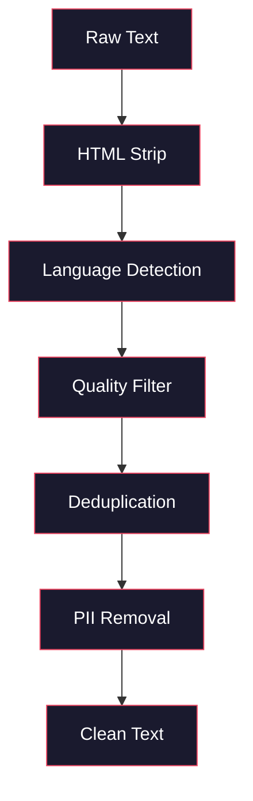
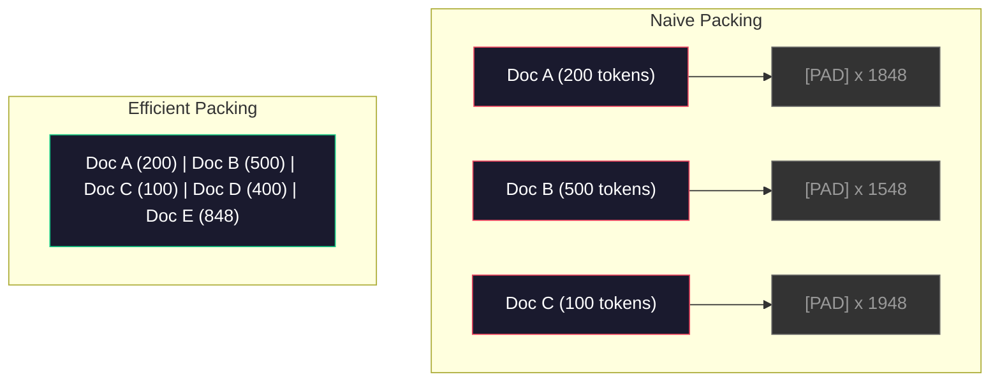

<!-- i18n:manual -->
# Пайплайны данных для предобучения

> Модель — зеркало. Она отражает всё, чем вы её кормите. Скормите мусор — она отразит мусор с идеальной беглостью.

**Type:** Build
**Languages:** Python
**Prerequisites:** Phase 10, Lessons 01-02 (Tokenizers, Building a Tokenizer)
**Time:** ~90 minutes

## Learning Objectives

- Собрать потоковый пайплайн данных, который токенизирует, режет на куски, перемешивает и раздаёт батчами терабайты текста, ни разу не загружая всё в память
- Реализовать фильтры качества данных (дедупликация, определение языка, фильтрация контента), которые применяются в настоящих пайплайнах предобучения
- Собирать обучающие последовательности фиксированной длины с корректными attention masks и аккуратной обработкой границ документов
- Замерить пропускную способность пайплайна и убедиться, что dataloader успевает за скоростью обучения на GPU

## The Problem

У вас есть токенизатор. Теперь нужны данные.

Не датасет. Не CSV-файл. Терабайты текста — очищенного, дедуплицированного, отфильтрованного по качеству, токенизированного в последовательности фиксированной длины и отдаваемого случайными батчами достаточно быстро, чтобы ваш кластер из 8 GPU никогда не ждал следующий батч.

Большинство думает, что обучение LLM — это про архитектуру модели. Это не так. Llama 3 обучали на 15.6 триллионах токенов. GPT-3 — на 300 миллиардах. DeepSeek-V2 — на 8.1 триллионах. Архитектура у всех трёх примерно одна и та же: стопка трансформерных блоков с attention и feedforward-слоями. Разница в качестве вывода почти целиком идёт от данных.

Статья Chinchilla от DeepMind сделала это точным. Для заданного бюджета compute существует оптимальное соотношение между числом параметров модели и числом обучающих токенов. Chinchilla показала, что большинство моделей 2022 года были драматически недообучены — параметров у них было слишком много для того объёма данных, который они увидели. Модель на 70B параметров, обученная на 1.4 триллиона токенов (Chinchilla-оптимум), обошла модель на 280B, обученную на 300 миллиардах токенов (Gopher).

> 🎒 **На пальцах.** Посчитайте отношение: у Chinchilla 1.4T токенов на 70B параметров — это 20 токенов на параметр. У Gopher 300B на 280B — примерно 1 токен на параметр. Модель вчетверо меньше выиграла просто потому, что ей дали в двадцать раз больше «прочитать». Параметры — это объём головы, токены — это прочитанные книги; голова без книг ничего не знает.

Ваш пайплайн данных определяет, выучит модель язык или выучит шум.

## The Concept

### Where the Data Comes From

Каждая большая языковая модель обучается на смеси источников. Точный состав у большинства лабораторий — тщательно охраняемый секрет, но категорий мы знаем достаточно.

| Source | Size | Quality | Used By |
|--------|------|---------|---------|
| Common Crawl | ~250 ТБ сырых | Низкое (нужна тяжёлая фильтрация) | GPT-3, Llama, большинство открытых моделей |
| Wikipedia | ~20 ГБ | Высокое | Каждая крупная LLM |
| GitHub code | ~1 ТБ+ | Среднее (много дублей и мёртвого кода) | StarCoder, CodeLlama, DeepSeek-Coder |
| Books (BookCorpus, Pile) | ~100 ГБ | Высокое | GPT-2, GPT-3, ранние модели |
| Academic papers (arXiv, S2ORC) | ~100 ГБ | Высокое для STEM | Llama, Galactica |
| StackOverflow, Reddit | ~100 ГБ | Среднее | Llama, Falcon |
| Curated web (C4, RefinedWeb) | ~5 ТБ | Средне-высокое (уже отфильтровано) | T5, Falcon |

Llama 3 раскрыла свою смесь данных: примерно 50% веб-данных, 25% кода, 13% книг и научных статей, 8% математики и 4% многоязычного веба. В сумме 15.6 триллиона токенов из источников общим объёмом больше 5 ТБ сырого текста.

Пропорция важна не меньше общего размера. Слишком много веба — модель становится реддитным попугаем. Слишком мало кода — она не умеет программировать. Слишком мало математики — проваливает рассуждения. Подобрать эту смесь — одна из самых сложных частей обучения LLM, и формулы тут нет: только эксперименты и оценка.

> 🎒 **На пальцах.** Смесь данных — это как рацион спортсмена: не «побольше еды», а конкретные пропорции белков и углеводов. Возьмите цифры Llama 3: 25% кода от 15.6T — это 3.9 триллиона токенов только кода, примерно вчетверо больше, чем весь обучающий корпус GPT-3 целиком. Отсюда и умение писать программы.

### Data Cleaning

Сырые веб-данные грязные. Типичный дамп Common Crawl содержит:

- HTML-теги и JavaScript
- Шаблонные шапки, подвалы, навигационные меню
- Дублирующиеся страницы (точные копии и почти-копии)
- Машинно-сгенерированный спам
- Персональные данные (PII)
- Низкокачественный текст (списки ключевых слов, SEO-спам)
- Нетекстовый контент, закодированный как текст

Чистить это не опция. Именно тут проходит граница между моделью, которая пишет связные абзацы, и моделью, которая выдаёт HTML-теги вперемешку с карточками товаров.



Каждый шаг убирает свою категорию шума:

**HTML stripping:** Убрать всю разметку. Оставить только видимый текст. Библиотеки вроде `trafilatura` или `readability` вытаскивают содержимое статьи и выбрасывают навигацию, рекламу и шаблонные куски.

**Language detection:** Использовать модель определения языка из fastText (lid.176.bin), чтобы классифицировать каждый документ. Оставить только целевые языки. Документ, признанный английским с уверенностью ниже 0.8, скорее всего, не чистый английский.

**Quality filtering:** Вот тут начинается интересное. RefinedWeb (датасет, на котором стоит Falcon) использует фильтр по perplexity: обучаем маленькую языковую модель на Wikipedia, потом оцениваем ею каждый документ. Высокая perplexity значит, что документ не похож на Wikipedia — вероятно, это спам, списки ключевых слов или машинная генерация. Документы с perplexity выше порога удаляются.

**Deduplication:** Самый влиятельный шаг очистки. В Common Crawl огромное количество дублирующихся страниц — юридические оговорки, уведомления про cookie, пользовательские соглашения. Обучение на дублях жжёт compute впустую и может заставить модель заучить и дословно выдавать конкретные куски текста.

**PII removal:** Имена, адреса почты, телефоны, номера страховок. Регулярки — для структурированных PII, NER-модели — для имён в контексте.

> 🎒 **На пальцах.** Пайплайн очистки — это конвейер сортировки мусора: на каждом посту снимают свою фракцию. Из семи узлов на схеме выше самый прибыльный — дедупликация: она одна выкидывает больше данных, чем все остальные вместе. А порог 0.8 у определения языка означает буквально следующее: если модель «на 79% уверена», что текст английский, документ летит в корзину.

### Deduplication with MinHash

Точная дедупликация — это просто: хешируем каждый документ, удаляем повторы. Но настоящая проблема — почти-дубли. Две копии одной новостной статьи с чуть разной рекламой вокруг — это почти-дубли. Содержимое совпадает на 95%, а побайтово они разные.

MinHash + Locality-Sensitive Hashing (LSH) решает это эффективно.


Идея:

1. **Shingling:** Превратить каждый документ в множество n-грамм (например, 5-грамм слов или символов). "the quick brown fox" с шинглами по 3 слова превращается в {"the quick brown", "quick brown fox"}.

2. **MinHash:** Для множества шинглов каждого документа посчитать k хеш-значений. Каждое значение — это минимальный хеш по всем шинглам под очередной хеш-функцией. Получается «подпись» фиксированного размера, которая приближает Jaccard-сходство между любыми двумя документами.

3. **LSH:** Разложить документы по корзинам на основе полос (bands) их MinHash-подписи. Документы из одной корзины — кандидаты в почти-дубли. Так мы не сравниваем каждую пару со всеми — только кандидатов.

4. **Verify:** Для каждой пары-кандидата посчитать точное Jaccard-сходство. Удалить одну копию, если сходство выше порога (обычно 0.8).

Команда Llama сообщила, что дедупликация убрала примерно 38% их веб-данных. Это не маленькое число. Больше трети Common Crawl — дубли и почти-дубли.

> 🎒 **На пальцах.** MinHash — это как узнавать книгу по десятку случайно выбранных фраз вместо чтения целиком. Считайте: "the quick brown fox" при шинглах по 3 слова даёт всего 2 шингла, а подпись всё равно будет из 128 чисел — размер подписи не зависит от размера документа. И ещё одна цифра: 38% выброшенных данных Llama означает, что из 100 ГБ скачанного веба до обучения доживает 62 ГБ.

### Sequence Packing

Ваша модель ждёт входы фиксированной длины. Ваши документы — переменной. Один на 50 токенов. Другой на 50 000.

Наивный подход: дополнять каждый документ паддингом до максимальной длины последовательности. Так вы жжёте огромное количество compute на паддинг-токенах, которые ничему не учат.

Подход получше: упаковать несколько документов в одну последовательность, разделив их end-of-sequence токенами. Последовательность на 2048 токенов может содержать три коротких документа, склеенных через [EOS].



Attention mask должна быть выставлена правильно. Токены документа A не должны смотреть на токены документа B внутри одной упакованной последовательности. Для этого нужна блочно-диагональная attention mask.

Длинные документы обрезаются или режутся на куски по границам последовательностей. Место разреза имеет значение: разрез посреди предложения заставляет модель видеть обрывки мыслей. Некоторые пайплайны по возможности выравнивают разрезы по границам абзацев или предложений.

> 🎒 **На пальцах.** Паддинг — это возить полупустые фуры. Посчитайте по схеме выше: три документа на 200, 500 и 100 токенов при наивном подходе занимают три последовательности по 2048 — это 6144 позиции, из которых полезны 800, то есть 13%. Упаковка складывает те же документы в одну последовательность на 2048 и добивает её ещё двумя — заполнение 100% вместо 13%.

### The Chinchilla Scaling Law

Для фиксированного бюджета compute C (в FLOPs) оптимальный размер модели N и размер датасета D подчиняются:

```
N_opt ~ C^0.5
D_opt ~ C^0.5
```

На практике это значит, что размер модели и размер датасета надо масштабировать примерно одинаково. Модели с параметрами в 10 раз больше нужно примерно в 10 раз больше обучающих токенов, чтобы дойти до того же loss.

| Model | Parameters | Training Tokens | Chinchilla-Optimal? |
|-------|-----------|----------------|-------------------|
| GPT-3 | 175B | 300B | Нет (недообучена в 3-4 раза) |
| Chinchilla | 70B | 1.4T | Да (так и задумано) |
| Llama 2 | 70B | 2T | Перетренирована (намеренно) |
| Llama 3 | 70B | 15T | Сильно перетренирована |

Llama 3 намеренно нарушает закон Chinchilla. В Meta обнаружили, что перетренировка на большем объёме данных — далеко за compute-оптимальным соотношением — даёт модели лучше для инференса. Лишняя стоимость обучения платится один раз, а модель поменьше дешевле обслуживать вечно. Такой подход иногда называют «inference-optimal» масштабированием, и с 2024 года он стал индустриальным стандартом.

> 🎒 **На пальцах.** Проверьте по таблице: у Llama 3 на 70B параметров пришлось 15T токенов — это 214 токенов на параметр вместо «оптимальных» 20, то есть перебор в десять с лишним раз. Зачем? Обучение оплачивается один раз, а инференс — каждый день до конца жизни модели. Меньшая модель с лишними часами обучения окупается на первом же миллиарде запросов.

```figure
l5-data-pipeline
```

## Build It

### Step 1: Text Cleaning

Убрать HTML, нормализовать пробелы, выкинуть нетекстовый контент. Мы возьмём текст из общественного достояния (Project Gutenberg) как наш маленький корпус.

```python
import re

def clean_text(text):
    text = re.sub(r"<[^>]+>", "", text)
    text = re.sub(r"http\S+", "", text)
    text = re.sub(r"[^\x20-\x7E\n]", "", text)
    text = re.sub(r"\n{3,}", "\n\n", text)
    text = re.sub(r" {2,}", " ", text)
    return text.strip()

def quality_filter(text, min_words=50, max_ratio_caps=0.3, max_ratio_special=0.1):
    words = text.split()
    if len(words) < min_words:
        return False
    caps_ratio = sum(1 for w in words if w.isupper()) / len(words)
    if caps_ratio > max_ratio_caps:
        return False
    special_chars = sum(1 for c in text if not c.isalnum() and not c.isspace())
    if special_chars / max(len(text), 1) > max_ratio_special:
        return False
    return True
```

Фильтр качества ловит SEO-спам (СПЛОШНЫЕ ЗАГЛАВНЫЕ), машинный шум (высокая доля спецсимволов) и страницы-заглушки (слишком короткие). Одни только эти три проверки убирают удивительно много мусора из веб-краулов.

> 🎒 **На пальцах.** Это три вопроса на входе, как фейсконтроль. Возьмите документ на 100 слов, из которых 40 написаны капсом: `caps_ratio` = 40/100 = 0.4, а порог `max_ratio_caps` — 0.3, значит документ не проходит. А документ на 49 слов не проходит ещё раньше, на проверке `min_words=50`, даже если он идеальный.

### Step 2: MinHash Deduplication

Реализуем MinHash с нуля. Внешние библиотеки не нужны — хватит `hashlib`.

```python
import hashlib
from collections import defaultdict

def get_shingles(text, k=5):
    words = text.lower().split()
    if len(words) < k:
        return set()
    return {" ".join(words[i:i+k]) for i in range(len(words) - k + 1)}

def minhash_signature(shingles, num_hashes=128):
    signature = []
    for i in range(num_hashes):
        min_hash = float("inf")
        for shingle in shingles:
            h = int(hashlib.sha256(f"{i}:{shingle}".encode()).hexdigest(), 16)
            min_hash = min(min_hash, h)
        signature.append(min_hash)
    return signature

def lsh_buckets(signature, bands=16):
    rows_per_band = len(signature) // bands
    buckets = []
    for b in range(bands):
        start = b * rows_per_band
        band_data = tuple(signature[start:start + rows_per_band])
        bucket_hash = hashlib.md5(str(band_data).encode()).hexdigest()
        buckets.append((b, bucket_hash))
    return buckets

def deduplicate(documents, threshold=0.8, num_hashes=128, bands=16):
    signatures = []
    shingle_sets = []
    for doc in documents:
        shingles = get_shingles(doc)
        shingle_sets.append(shingles)
        signatures.append(minhash_signature(shingles, num_hashes))

    bucket_map = defaultdict(list)
    for doc_idx, sig in enumerate(signatures):
        for band_id, bucket_hash in lsh_buckets(sig, bands):
            bucket_map[(band_id, bucket_hash)].append(doc_idx)

    duplicate_pairs = set()
    for bucket_docs in bucket_map.values():
        if len(bucket_docs) < 2:
            continue
        for i in range(len(bucket_docs)):
            for j in range(i + 1, len(bucket_docs)):
                duplicate_pairs.add((bucket_docs[i], bucket_docs[j]))

    removed = set()
    for i, j in duplicate_pairs:
        if i in removed or j in removed:
            continue
        s1, s2 = shingle_sets[i], shingle_sets[j]
        if not s1 or not s2:
            continue
        jaccard = len(s1 & s2) / len(s1 | s2)
        if jaccard >= threshold:
            removed.add(j)

    return [doc for idx, doc in enumerate(documents) if idx not in removed], len(removed)
```

Параметры `num_hashes=128` и `bands=16` управляют компромиссом между точностью и полнотой. Больше хешей — точнее оценка сходства. Больше полос — выше полнота (ловится больше дублей) ценой большего числа ложных срабатываний. Эти значения хорошо работают на типичном веб-тексте.

> 🎒 **На пальцах.** Полосы (bands) — это как искать однокурсников по совпадению любых восьми цифр студенческого, а не всего номера целиком. Посчитайте: 128 хешей разложены на 16 полос, значит `rows_per_band` = 128 / 16 = 8. Два документа попадут в кандидаты, если совпадёт хотя бы одна восьмёрка чисел из шестнадцати — и только после этого мы честно считаем Jaccard и сравниваем с порогом 0.8.

### Step 3: Tokenize and Pack Sequences

Берём чистый дедуплицированный текст, токенизируем и упаковываем в последовательности фиксированной длины для обучения.

```python
def tokenize_corpus(documents, tokenizer):
    all_tokens = []
    for doc in documents:
        tokens = tokenizer.encode(doc)
        all_tokens.extend(tokens)
        all_tokens.append(tokenizer.eos_id)
    return all_tokens

def pack_sequences(token_ids, seq_length, pad_id=0):
    sequences = []
    attention_masks = []
    for i in range(0, len(token_ids), seq_length):
        seq = token_ids[i:i + seq_length]
        mask = [1] * len(seq)
        if len(seq) < seq_length:
            pad_count = seq_length - len(seq)
            seq = seq + [pad_id] * pad_count
            mask = mask + [0] * pad_count
        sequences.append(seq)
        attention_masks.append(mask)
    return sequences, attention_masks
```

> 🎒 **На пальцах.** `tokenize_corpus` склеивает весь корпус в одну длинную ленту токенов, вставляя `eos_id` после каждого документа — три документа дадут три служебных токена-разделителя. Потом `pack_sequences` режет ленту ножницами каждые `seq_length` символов: 5000 токенов при `seq_length=2048` дадут 3 последовательности, причём в последней будет 5000 − 4096 = 904 настоящих токена и 1144 паддинга, у которых в маске стоит 0.

### Step 4: DataLoader for Training

Выдаём перемешанные батчи упакованных последовательностей. Именно это потребляет обучающий цикл.

```python
import random

class PreTrainingDataLoader:
    def __init__(self, sequences, attention_masks, batch_size, shuffle=True):
        self.sequences = sequences
        self.attention_masks = attention_masks
        self.batch_size = batch_size
        self.shuffle = shuffle

    def __len__(self):
        return (len(self.sequences) + self.batch_size - 1) // self.batch_size

    def __iter__(self):
        indices = list(range(len(self.sequences)))
        if self.shuffle:
            random.shuffle(indices)
        for start in range(0, len(indices), self.batch_size):
            batch_idx = indices[start:start + self.batch_size]
            batch_seqs = [self.sequences[i] for i in batch_idx]
            batch_masks = [self.attention_masks[i] for i in batch_idx]
            yield batch_seqs, batch_masks
```

> 🎒 **На пальцах.** Dataloader — это раздатчик карт: он тасует колоду индексов, а не сами данные (тасовать список номеров дёшево, тасовать мегабайты — дорого). Формула `__len__` — это деление с округлением вверх: 10 последовательностей при `batch_size=4` дают (10 + 4 − 1) // 4 = 3 батча, где последний неполный, всего на 2 элемента.

### Step 5: Dataset Statistics

Считаем числа, которые важны: всего токенов, уникальных токенов, коэффициент сжатия, распределение длин документов.

```python
from collections import Counter

def compute_statistics(documents, token_ids, sequences, tokenizer_vocab_size):
    total_chars = sum(len(d) for d in documents)
    total_tokens = len(token_ids)
    unique_tokens = len(set(token_ids))
    compression_ratio = total_chars / total_tokens

    doc_lengths = [len(d.split()) for d in documents]
    avg_doc_length = sum(doc_lengths) / max(len(doc_lengths), 1)
    max_doc_length = max(doc_lengths) if doc_lengths else 0
    min_doc_length = min(doc_lengths) if doc_lengths else 0

    token_counts = Counter(token_ids)
    top_tokens = token_counts.most_common(10)

    non_pad_tokens = sum(sum(1 for t in seq if t != 0) for seq in sequences)
    total_positions = sum(len(seq) for seq in sequences)
    utilization = non_pad_tokens / max(total_positions, 1)

    stats = {
        "total_documents": len(documents),
        "total_characters": total_chars,
        "total_tokens": total_tokens,
        "unique_tokens": unique_tokens,
        "vocab_utilization": unique_tokens / tokenizer_vocab_size,
        "compression_ratio": compression_ratio,
        "avg_doc_length_words": avg_doc_length,
        "max_doc_length_words": max_doc_length,
        "min_doc_length_words": min_doc_length,
        "num_sequences": len(sequences),
        "sequence_utilization": utilization,
        "top_10_tokens": top_tokens,
    }
    return stats
```

Коэффициент сжатия говорит, насколько эффективен токенизатор на этом корпусе. Английский текст обычно сжимается примерно до 3-4 символов на токен. Если вы видите 1.5 символа на токен — токенизатор дробит слишком агрессивно. Если 8 и больше — он выучил очень доменно-специфичные merges.

Sequence utilization говорит, какая доля ваших упакованных последовательностей — настоящие данные, а не паддинг. Ниже 90% значит, что упаковка неэффективна: вы жжёте compute на паддинг-токенах.

> 🎒 **На пальцах.** Обе метрики — это чеки, которые надо смотреть глазами. Корпус на 1 000 000 символов, давший 280 000 токенов, имеет `compression_ratio` = 3.57 символа на токен — нормальный английский. А 5000 настоящих токенов, разложенных по 3 последовательностям на 2048, дают utilization = 5000 / 6144 = 81%: ниже 90%, то есть каждый пятый шаг GPU считает пустоту.

## Use It

### Compare With HuggingFace Datasets

Загрузим тот же корпус через библиотеку datasets от HuggingFace и сравним скорость пайплайна.

```python
from datasets import load_dataset
from transformers import AutoTokenizer

ds = load_dataset("wikitext", "wikitext-2-raw-v1", split="train")
tokenizer = AutoTokenizer.from_pretrained("meta-llama/Meta-Llama-3-8B")

import time

start = time.time()
tokenized = ds.map(
    lambda x: tokenizer(x["text"], truncation=True, max_length=2048),
    batched=True,
    num_proc=4,
)
hf_time = time.time() - start
total_tokens = sum(len(t) for t in tokenized["input_ids"])
print(f"HuggingFace: {total_tokens:,} tokens in {hf_time:.2f}s ({total_tokens/hf_time:,.0f} tokens/sec)")
```

Пайплайн HuggingFace под капотом использует Rust-токенизаторы и параллельную обработку на 4 ядрах. Ваш чисто питоновский пайплайн будет в 10-50 раз медленнее. Именно этот разрыв — причина, по которой продакшен-команды берут скомпилированные токенизаторы. Алгоритм тот же самый. Разница — в языке реализации.

> 🎒 **На пальцах.** Разрыв в 10-50 раз — это не мелочь на масштабе. Если на питоне корпус токенизируется 10 часов, на Rust с четырьмя процессами он уйдёт за 12-60 минут. На 15 триллионах токенов Llama 3 эта разница превращается из «подождать за кофе» в «подождать несколько месяцев».

## Ship It

Этот урок производит промпт для валидации и отладки качества данных в пайплайнах обучения LLM. Смотрите `outputs/prompt-data-quality-checker.md`.

## Exercises

1. **Easy:** Добавьте определение языка в пайплайн очистки, используя простую эвристику (анализ набора символов). Оставьте только английские документы и измерьте, сколько документов удалилось.
2. **Medium:** Реализуйте точную дедупликацию по хешам SHA-256 рядом с почти-дедупликацией по MinHash. Сравните количество дублей, пойманных каждым методом, на корпусе, скачанном из веба.
3. **Hard:** Постройте фильтр качества на основе perplexity. Обучите маленькую биграммную языковую модель на текстах Wikipedia, оцените каждый документ по perplexity и удалите нижние 20%. Сравните качество вывода модели при обучении на отфильтрованных и неотфильтрованных данных.

> 🎒 **На пальцах.** Упражнения идут по возрастанию цены ошибки. Первое просто считает, сколько документов ушло. Второе покажет главное: точный хеш поймает единицы дублей, а MinHash с порогом 0.8 — десятки процентов, потому что почти-копий в вебе гораздо больше, чем точных. Третье — самое честное: вы выкидываете пятую часть корпуса и проверяете, стала ли модель лучше от того, что данных стало меньше.

## Key Terms

| Term | What people say | What it actually means |
|------|----------------|----------------------|
| Common Crawl | «Интернет» | Некоммерческая организация, которая обходит веб каждый месяц — ~250 ТБ сырых данных, точка старта для большинства обучающих корпусов LLM |
| MinHash | «Какой-то трюк с хешами» | Способ оценить Jaccard-сходство множеств через подписи фиксированного размера — позволяет искать почти-дубли на масштабе |
| LSH | «Locality-Sensitive Hashing» | Метод класть похожие объекты в одну корзину — снижает число попарных сравнений с O(n^2) почти до линейного |
| Sequence packing | «Склеивание документов» | Укладка нескольких документов в последовательности фиксированной длины с корректными attention masks — убирает потери на паддинг |
| Chinchilla scaling | «Обучать на большем объёме данных» | При фиксированном бюджете compute оптимум требует масштабировать размер модели и число обучающих токенов примерно одинаково |
| Fertility | «Токенов на слово» | Среднее число токенов на слово — 1.3 для английского в GPT-4, выше для нелатинских письменностей |
| Data mixing | «Выбор обучающих данных» | Пропорция кода, текста, математики и многоязычных данных — формулы нет, нужны эксперименты |
| Perplexity filter | «Оценка качества» | Оценивать документы маленькой языковой моделью — высокая perplexity значит, что текст не похож на чистые эталонные данные |
| Deduplication | «Удаление копий» | Устранение точных и почти-дублирующихся документов — обычно убирает 30-40% сырых веб-данных |
| Attention mask | «На какие токены смотреть» | Бинарная маска, которая запрещает attention пересекать границы документов внутри упакованной последовательности |

## Further Reading

- [Hoffmann et al., 2022 -- Training Compute-Optimal Large Language Models (Chinchilla)](https://arxiv.org/abs/2203.15556) — статья, которая изменила наше представление о масштабе данных
- [Penedo et al., 2023 -- The RefinedWeb Dataset for Falcon LLM](https://arxiv.org/abs/2306.01116) — как отфильтровать Common Crawl до высокого качества
- [Touvron et al., 2023 -- Llama 2: Open Foundation and Fine-Tuned Chat Models](https://arxiv.org/abs/2307.09288) — детали пайплайна данных для Llama 2
- [Lee et al., 2022 -- Deduplicating Training Data Makes Language Models Better](https://arxiv.org/abs/2107.06499) — почему дедупликация важнее, чем кажется
- [Broder, 1997 -- On the Resemblance and Containment of Documents](https://ieeexplore.ieee.org/document/666900) — оригинальная статья про MinHash
- [Meta, 2024 -- Llama 3 Technical Report](https://arxiv.org/abs/2407.21783) — 15.6T токенов, пропорции смеси данных, пайплайн фильтрации
