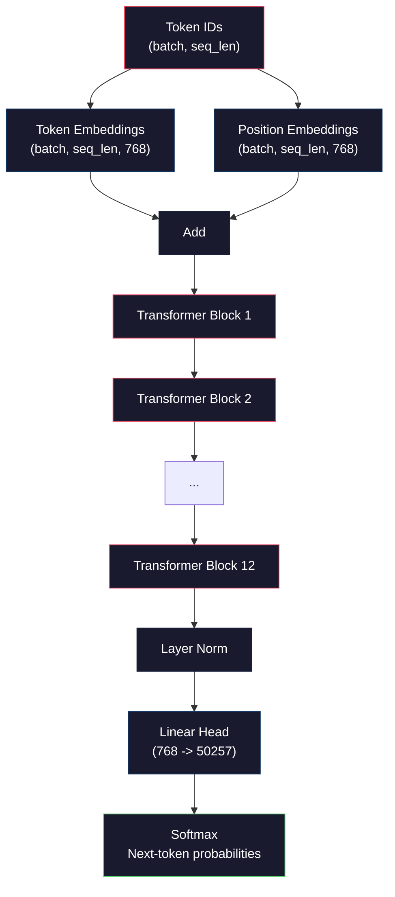
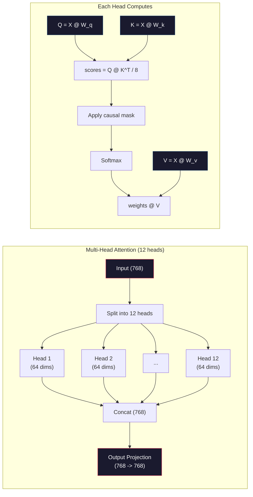
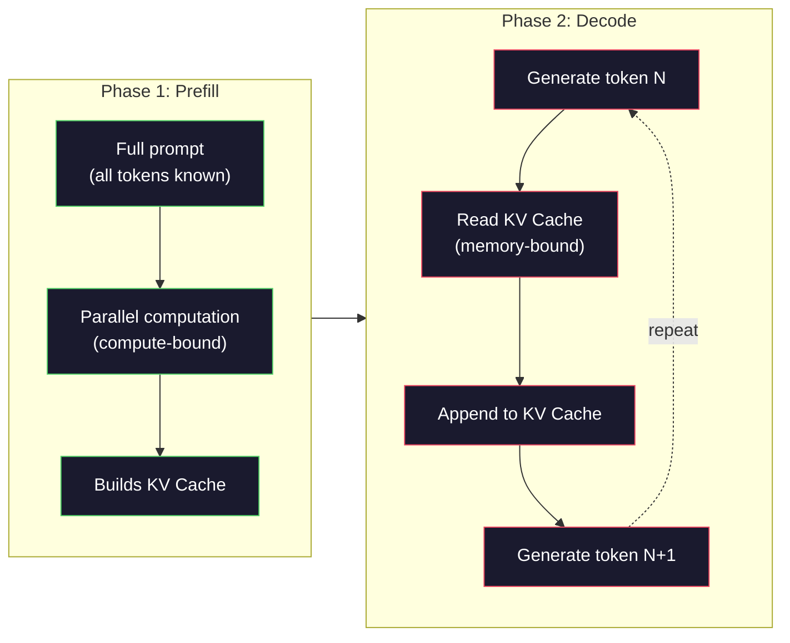

<!-- i18n:manual -->
# Предобучение мини-GPT (124M параметров)

> В GPT-2 Small 124 миллиона параметров. Это 12 слоёв трансформера, 12 attention-голов и эмбеддинги размерности 768. Такую модель можно обучить с нуля на одной GPU за несколько часов. Почти никто этого не делает — все берут готовые предобученные чекпойнты. Но пока вы не обучили модель сами, вы не понимаете по-настоящему, что происходит внутри той модели, на которой строите продукт.

**Type:** Build
**Languages:** Python (with numpy)
**Prerequisites:** Phase 10, Lessons 01-03 (Tokenizers, Building a Tokenizer, Data Pipelines)
**Time:** ~120 minutes

## Learning Objectives

- Реализовать полную архитектуру GPT-2 (124M параметров) с нуля: token embeddings, positional embeddings, блоки трансформера и языковую голову
- Обучить GPT-модель на текстовом корпусе через next-token prediction с cross-entropy loss
- Реализовать авторегрессионную генерацию текста с temperature-сэмплированием и фильтрацией top-k/top-p
- Следить за кривой training loss и убедиться, что модель действительно выучивает связные языковые закономерности

## The Problem

Вы знаете, что такое трансформер. Вы видели схемы. Вы можете произнести «attention is all you need» и нарисовать на доске коробочки с подписью «Multi-Head Attention».

Ничто из этого не означает, что вы понимаете, что происходит, когда модель генерирует текст.

В GPT-2 Small ровно 124 438 272 параметра (с weight tying). Каждый из них был выставлен обучающим циклом: forward pass, считаем loss, backward pass, обновляем веса. Двенадцать блоков трансформера. Двенадцать attention-голов в каждом блоке. Пространство эмбеддингов размерности 768. Словарь из 50 257 токенов. Каждый раз, когда модель порождает токен, все 124 миллиона параметров участвуют в одной цепочке матричных умножений, которая берёт последовательность ID токенов и выдаёт распределение вероятностей над следующим токеном.

Если вы никогда не собирали это своими руками, вы работаете с чёрным ящиком. Можно дёргать API. Можно файнтюнить. Но когда что-то ломается — модель галлюцинирует, зацикливается, отказывается следовать инструкции — у вас нет ни одной ментальной модели, объясняющей *почему*.

Этот урок собирает GPT-2 Small с нуля. Не на PyTorch. На numpy. Каждое матричное умножение видно глазами. Каждый градиент считает ваш собственный код. Вы увидите ровно то, как 124 миллиона чисел сговариваются, чтобы предсказать следующее слово.

> 🎒 **На пальцах.** Разница между «я читал про трансформер» и «я его собрал» — как между «я видел схему двигателя» и «я его перебрал». 124 438 272 параметра — это примерно 500 МБ в fp32, файл размером с фильм. И весь этот файл — просто числа, которые кто-то подкрутил обучающим циклом из четырёх шагов.

## The Concept

### The GPT Architecture

GPT — это авторегрессионная языковая модель. «Авторегрессионная» означает, что она порождает по одному токену за раз, и каждый следующий обусловлен всеми предыдущими. Архитектура — стопка decoder-блоков трансформера.

Вот полный граф вычислений от ID токенов до вероятностей следующего токена:

1. На вход приходят ID токенов. Форма: (batch_size, seq_len).
2. Поиск в таблице token embeddings. Каждый ID превращается в 768-мерный вектор. Форма: (batch_size, seq_len, 768).
3. Поиск в таблице position embeddings. Каждая позиция (0, 1, 2, ...) превращается в 768-мерный вектор. Форма та же.
4. Складываем token embeddings + position embeddings.
5. Прогоняем через 12 блоков трансформера.
6. Финальная layer normalization.
7. Линейная проекция в размер словаря. Форма: (batch_size, seq_len, vocab_size).
8. Softmax, чтобы получить вероятности.

Вот и вся модель. Никаких свёрток. Никакой рекуррентности. Только эмбеддинги, attention, feedforward-сети и layer norm — стопкой в 12 этажей.



> 🎒 **На пальцах.** Пройдите по схеме сверху вниз как по конвейеру. Батч из 4 последовательностей по 128 токенов входит как таблица 4 × 128 чисел, сразу после эмбеддингов раздувается до 4 × 128 × 768 ≈ 393 тысяч чисел, тащится в таком виде через все 12 блоков и в самом конце разворачивается в 4 × 128 × 50257 ≈ 25 миллионов логитов. Форма меняется всего дважды: на входе и на выходе.

### The Transformer Block

Каждый из 12 блоков устроен одинаково. Архитектура pre-norm (GPT-2 использует pre-norm, а не post-norm, как оригинальный трансформер):

1. LayerNorm
2. Multi-Head Self-Attention
3. Residual-связь (прибавляем вход обратно)
4. LayerNorm
5. Feed-Forward Network (MLP)
6. Residual-связь (прибавляем вход обратно)

Residual-связи критичны. Без них градиенты затухают, не доходя до первого блока при backpropagation. С ними градиент может течь прямо от loss к любому слою по «пропускному» пути. Именно поэтому можно ставить 12, 32 и даже 96 блоков подряд (по слухам, в GPT-4 их 120).

> 🎒 **На пальцах.** Residual — это лестница с перилами: даже если ступенька скользкая, есть за что держаться. Если каждый блок умножает градиент на 0.7, то через 12 блоков останется 0.7^12 ≈ 0.014 — почти ничего. Residual добавляет к этому пути прямое слагаемое «×1», и сигнал доходит до первого слоя целым.

### Attention: The Core Mechanism

Self-attention позволяет каждому токену посмотреть на все предыдущие токены и решить, на какой из них обращать внимание и насколько. Вот математика.

Для каждой позиции считаем из входа три вектора:
- **Query (Q)**: «что я ищу?»
- **Key (K)**: «что во мне содержится?»
- **Value (V)**: «какую информацию я несу?»

```
Q = input @ W_q    (768 -> 768)
K = input @ W_k    (768 -> 768)
V = input @ W_v    (768 -> 768)

attention_scores = Q @ K^T / sqrt(d_k)
attention_scores = mask(attention_scores)   # causal mask: -inf for future positions
attention_weights = softmax(attention_scores)
output = attention_weights @ V
```

Causal-маска — это то, что делает GPT авторегрессионным. Позиция 5 может смотреть на позиции 0-5, но не на 6, 7, 8 и далее. Это не даёт модели «жульничать», подглядывая будущие токены во время обучения.

> 🎒 **На пальцах.** Q, K и V — как поиск в библиотеке. Query — ваш запрос, Key — корешок книги, Value — её содержимое. Скоры `Q @ K^T` для последовательности из 64 токенов дают матрицу 64 × 64 = 4096 чисел, и маска зануляет верхний треугольник — ровно 64 × 63 / 2 = 2016 клеток. Остаётся 2080 разрешённых пар «кто на кого смотрит».

**Multi-head attention** разбивает 768-мерное пространство на 12 голов по 64 измерения. Каждая голова учит свой паттерн внимания. Одна может отслеживать синтаксис (согласование подлежащего и сказуемого). Другая — семантическую близость (синонимы). Третья — позиционную близость (соседние слова). Выходы всех 12 голов конкатенируются и проецируются обратно в 768 измерений.



Деление на sqrt(d_k) — sqrt(64) = 8 — это масштабирование. Без него скалярные произведения для векторов большой размерности становятся огромными, и softmax уходит в зону, где градиенты почти нулевые. Это было одно из ключевых наблюдений в оригинальной статье «Attention Is All You Need».

> 🎒 **На пальцах.** Масштабирование — как убавить громкость перед тем, как звук уйдёт в клиппинг. Скоры вида `[8, 4, 2]` после softmax дают примерно `[0.98, 0.02, 0.00]` — одна голова «залипла» на одном токене, градиента почти нет. Поделите на 8, получите `[1.0, 0.5, 0.25]`, а после softmax — `[0.51, 0.31, 0.18]`. Модель ещё может учиться.

### KV Cache: Why Inference Is Fast

На обучении вы обрабатываете всю последовательность разом. На инференсе вы генерируете по одному токену. Без оптимизации генерация токена N требует пересчитать attention для всех N-1 предыдущих токенов. Это O(N^2) на каждый порождённый токен, то есть O(N^3) суммарно на последовательность длины N.

KV Cache решает эту проблему. Посчитав K и V для очередного токена, вы их сохраняете. Когда генерируете токен N+1, достаточно вычислить Q только для нового токена и достать закешированные K и V всех предыдущих. Это снижает стоимость вычисления K и V с O(N) до O(1) на токен. Сам подсчёт attention-скоров всё ещё O(N), потому что вы смотрите на все прошлые позиции, но вы больше не повторяете одни и те же матричные умножения над входом.

Для GPT-2 с 12 слоями и 12 головами KV cache хранит 2 (K + V) x 12 слоёв x 12 голов x 64 измерения = 18 432 числа на токен. Для последовательности в 1024 токена это примерно 75 МБ в FP32. Для Llama 3 405B со 128 слоями KV cache одной-единственной последовательности может перевалить за 10 ГБ. Вот почему инференс с длинным контекстом упирается в память.

> 🎒 **На пальцах.** KV cache — это конспект: вы не перечитываете всю книгу перед каждым новым предложением, а заглядываете в уже записанное. Проверьте арифметику: 2 × 12 × 12 × 64 = 18 432 числа на токен, по 4 байта в FP32 → 73.7 КБ на токен, а на 1024 токена → около 75 МБ. Забудете про кеш — и генерация 1000 токенов вместо тысячи проходов превратится в полмиллиона.

### Prefill vs Decode: Two Phases of Inference

Когда вы отправляете промпт в LLM, инференс проходит в две разные фазы.

**Prefill** обрабатывает весь ваш промпт параллельно. Все токены известны, поэтому модель может посчитать attention для всех позиций одновременно. Эта фаза compute-bound — GPU молотит матричные умножения на полную. Для промпта в 1000 токенов на A100 prefill занимает примерно 20-50 мс.

**Decode** генерирует токены по одному. Каждый новый токен зависит от всех предыдущих. Эта фаза memory-bound — узкое место в чтении весов модели и KV cache из памяти GPU, а не в самой арифметике. Вычислительные ядра простаивают в ожидании чтений из памяти. Для GPT-2 каждый шаг decode занимает примерно одинаковое время независимо от того, сколько FLOPs требуют матричные умножения, потому что ограничение — пропускная способность памяти.

Это различие важно для продакшена. Пропускная способность prefill растёт вместе с вычислительной мощностью GPU (больше FLOPS = быстрее prefill). Пропускная способность decode растёт вместе с пропускной способностью памяти (быстрее память = быстрее decode). Именно поэтому в H100 от NVIDIA основной упор был сделан на память, а не на вычисления по сравнению с A100 — это напрямую ускоряет генерацию токенов.



> 🎒 **На пальцах.** Prefill — как прочитать вопрос целиком одним взглядом; decode — как писать ответ по букве, и каждый раз перечитывать всё написанное. Первая фаза на 1000 токенов занимает 20-50 мс на всё сразу, а вторая тратит примерно столько же на каждый отдельный токен. Поэтому «время до первого токена» и «токенов в секунду» — это две разные метрики, которые чинят разным железом.

### The Training Loop

Обучение LLM — это предсказание следующего токена. Даны токены [0, 1, 2, ..., N-1] — предскажи токены [1, 2, 3, ..., N]. Функция потерь — cross-entropy между предсказанным распределением вероятностей и настоящим следующим токеном.

Один шаг обучения:

1. **Forward pass**: прогоняем батч через все 12 блоков. Получаем логиты (скоры до softmax) для каждой позиции.
2. **Compute loss**: cross-entropy между логитами и целевыми токенами (тот же вход, сдвинутый на одну позицию).
3. **Backward pass**: считаем градиенты для всех 124M параметров через backpropagation.
4. **Optimizer step**: обновляем веса. GPT-2 использует Adam с прогревом learning rate и косинусным затуханием.

Расписание learning rate значит больше, чем кажется. GPT-2 прогревается от 0 до пикового learning rate за первые 2000 шагов, а потом затухает по косинусу. Старт с высокого learning rate уводит модель в расходимость. Постоянно высокий learning rate вызывает болтанку на поздних этапах. Схему «прогрев, потом затухание» использует каждая крупная LLM.

> 🎒 **На пальцах.** Learning rate — это размер шага; прогрев нужен, чтобы не прыгнуть с обрыва на первом же шаге, пока веса случайные. Представьте спуск с горы в тумане: сначала идёте мелкими шажками, разогнавшись — широкими, а у самой цели снова мелкими, чтобы не проскочить. 2000 шагов прогрева из, скажем, 100 000 — это всего 2% обучения, но без них весь остальной 98% может не случиться.

### GPT-2 Small: The Numbers

| Component | Shape | Parameters |
|-----------|-------|------------|
| Token embeddings | (50257, 768) | 38,597,376 |
| Position embeddings | (1024, 768) | 786,432 |
| Per-block attention (W_q, W_k, W_v, W_out) | 4 x (768, 768) | 2,359,296 |
| Per-block FFN (up + down) | (768, 3072) + (3072, 768) | 4,718,592 |
| Per-block LayerNorms (2x) | 2 x 768 x 2 | 3,072 |
| Final LayerNorm | 768 x 2 | 1,536 |
| **Total per block** | | **7,080,960** |
| **Total (12 blocks)** | | **85,054,464 + 39,383,808 = 124,438,272** |

Выходная проекция (голова, дающая логиты) делит веса с матрицей token embeddings. Это называется weight tying — приём снижает число параметров на 38M и улучшает качество, потому что заставляет модель использовать одно и то же пространство представлений и на входе, и на выходе.

> 🎒 **На пальцах.** Посмотрите на распределение по таблице: один блок весит 7 080 960 параметров, двенадцать блоков — 85 миллионов, а таблица эмбеддингов одна тянет на 38.6 миллиона. То есть треть «мозга» модели — это просто словарь векторов для 50 257 токенов. И благодаря weight tying этот словарь работает дважды: и на вход, и на выход.

## Build It

### Step 1: Embedding Layer

Token embeddings отображают каждый из 50 257 возможных токенов в 768-мерный вектор. Position embeddings добавляют информацию о том, на каком месте в последовательности стоит токен. Оба вектора складываются.

```python
import numpy as np

class Embedding:
    def __init__(self, vocab_size, embed_dim, max_seq_len):
        self.token_embed = np.random.randn(vocab_size, embed_dim) * 0.02
        self.pos_embed = np.random.randn(max_seq_len, embed_dim) * 0.02

    def forward(self, token_ids):
        seq_len = token_ids.shape[-1]
        tok_emb = self.token_embed[token_ids]
        pos_emb = self.pos_embed[:seq_len]
        return tok_emb + pos_emb
```

Стандартное отклонение 0.02 при инициализации взято из статьи про GPT-2. Больше — и первые forward pass дадут экстремальные значения, которые расшатают обучение. Меньше — и начальные выходы будут почти одинаковыми для любых входов, так что ранний градиентный сигнал окажется бесполезным.

> 🎒 **На пальцах.** Инициализация — это как раздать всем участникам случайные, но негромкие мнения: если кто-то с самого начала орёт, его никто не переспорит. При 768 слагаемых с σ = 0.02 скалярное произведение двух таких векторов по порядку величины будет около `0.02 × 0.02 × sqrt(768) ≈ 0.011` — маленькое и безопасное. Поставьте σ = 1.0, и то же произведение улетит примерно в 28.

### Step 2: Self-Attention with Causal Mask

Сначала attention с одной головой. Causal-маска ставит будущим позициям минус бесконечность перед softmax, гарантируя, что каждая позиция видит только себя и то, что было раньше.

```python
def attention(Q, K, V, mask=None):
    d_k = Q.shape[-1]
    scores = Q @ K.transpose(0, -1, -2 if Q.ndim == 4 else 1) / np.sqrt(d_k)
    if mask is not None:
        scores = scores + mask
    weights = np.exp(scores - scores.max(axis=-1, keepdims=True))
    weights = weights / weights.sum(axis=-1, keepdims=True)
    return weights @ V
```

Реализация softmax вычитает максимум перед возведением в экспоненту. Без этого exp(большое_число) переполняется в бесконечность. Это трюк численной устойчивости, и на результат он не влияет, потому что softmax(x - c) = softmax(x) для любой константы c.

> 🎒 **На пальцах.** Вычитание максимума — это как перевести все цены в «на сколько дороже самого дешёвого»: соотношения сохраняются, а числа становятся человеческими. `exp(800)` в float64 — это inf и мгновенный NaN дальше по цепочке. А `exp(800 - 800) = 1` и `exp(795 - 800) ≈ 0.0067` — те же самые пропорции, только считаются без взрыва.

### Step 3: Multi-Head Attention

Разбиваем 768-мерный вход на 12 голов по 64 измерения. Каждая голова считает attention независимо. Результаты конкатенируются и проецируются обратно в 768 измерений.

```python
class MultiHeadAttention:
    def __init__(self, embed_dim, num_heads):
        self.num_heads = num_heads
        self.head_dim = embed_dim // num_heads
        self.W_q = np.random.randn(embed_dim, embed_dim) * 0.02
        self.W_k = np.random.randn(embed_dim, embed_dim) * 0.02
        self.W_v = np.random.randn(embed_dim, embed_dim) * 0.02
        self.W_out = np.random.randn(embed_dim, embed_dim) * 0.02

    def forward(self, x, mask=None):
        batch, seq_len, d = x.shape
        Q = (x @ self.W_q).reshape(batch, seq_len, self.num_heads, self.head_dim).transpose(0, 2, 1, 3)
        K = (x @ self.W_k).reshape(batch, seq_len, self.num_heads, self.head_dim).transpose(0, 2, 1, 3)
        V = (x @ self.W_v).reshape(batch, seq_len, self.num_heads, self.head_dim).transpose(0, 2, 1, 3)

        scores = Q @ K.transpose(0, 1, 3, 2) / np.sqrt(self.head_dim)
        if mask is not None:
            scores = scores + mask
        weights = np.exp(scores - scores.max(axis=-1, keepdims=True))
        weights = weights / weights.sum(axis=-1, keepdims=True)
        attn_out = weights @ V

        attn_out = attn_out.transpose(0, 2, 1, 3).reshape(batch, seq_len, d)
        return attn_out @ self.W_out
```

Танец reshape-transpose-reshape — самая запутанная часть multi-head attention. Вот что происходит: тензор (batch, seq_len, 768) становится (batch, seq_len, 12, 64), затем (batch, 12, seq_len, 64). Теперь у каждой из 12 голов есть своя матрица (seq_len, 64), на которой она считает attention. После attention процесс разворачивается обратно: (batch, 12, seq_len, 64) становится (batch, seq_len, 12, 64) и затем (batch, seq_len, 768).

> 🎒 **На пальцах.** Reshape ничего не считает — он только переставляет одни и те же числа по-другому. 768 = 12 × 64, поэтому вектор токена просто нарезается на 12 кусочков по 64, и каждый кусочек уходит своей голове. Никаких данных не теряется и не появляется: сколько чисел вошло, столько и вышло, просто сгруппированных иначе.

### Step 4: Transformer Block

Один полный блок трансформера: LayerNorm, multi-head attention с residual, LayerNorm, feedforward с residual.

```python
class LayerNorm:
    def __init__(self, dim, eps=1e-5):
        self.gamma = np.ones(dim)
        self.beta = np.zeros(dim)
        self.eps = eps

    def forward(self, x):
        mean = x.mean(axis=-1, keepdims=True)
        var = x.var(axis=-1, keepdims=True)
        return self.gamma * (x - mean) / np.sqrt(var + self.eps) + self.beta


class FeedForward:
    def __init__(self, embed_dim, ff_dim):
        self.W1 = np.random.randn(embed_dim, ff_dim) * 0.02
        self.b1 = np.zeros(ff_dim)
        self.W2 = np.random.randn(ff_dim, embed_dim) * 0.02
        self.b2 = np.zeros(embed_dim)

    def forward(self, x):
        h = x @ self.W1 + self.b1
        h = np.maximum(0, h)  # GELU approximation: ReLU for simplicity
        return h @ self.W2 + self.b2


class TransformerBlock:
    def __init__(self, embed_dim, num_heads, ff_dim):
        self.ln1 = LayerNorm(embed_dim)
        self.attn = MultiHeadAttention(embed_dim, num_heads)
        self.ln2 = LayerNorm(embed_dim)
        self.ffn = FeedForward(embed_dim, ff_dim)

    def forward(self, x, mask=None):
        x = x + self.attn.forward(self.ln1.forward(x), mask)
        x = x + self.ffn.forward(self.ln2.forward(x))
        return x
```

Feedforward-сеть расширяет 768-мерный вход до 3072 измерений (в 4 раза), применяет нелинейность, а затем проецирует обратно в 768. Схема «расширить-сжать» даёт модели более «широкое» внутреннее представление на каждой позиции. GPT-2 использует активацию GELU, но здесь мы для простоты берём ReLU — для понимания архитектуры разница несущественна.

> 🎒 **На пальцах.** FFN — это черновик: чтобы аккуратно сформулировать мысль, сначала полезно расписать её подробно, а потом сжать до одного предложения. По параметрам этот черновик стоит дорого: 768 × 3072 × 2 = 4 718 592 против 2 359 296 у attention. То есть две трети веса блока сидят не в attention, а в обычной двухслойной сети.

### Step 5: Full GPT Model

Складываем 12 блоков трансформера. Спереди добавляем слой эмбеддингов, сзади — выходную проекцию.

```python
class MiniGPT:
    def __init__(self, vocab_size=50257, embed_dim=768, num_heads=12,
                 num_layers=12, max_seq_len=1024, ff_dim=3072):
        self.embedding = Embedding(vocab_size, embed_dim, max_seq_len)
        self.blocks = [
            TransformerBlock(embed_dim, num_heads, ff_dim)
            for _ in range(num_layers)
        ]
        self.ln_f = LayerNorm(embed_dim)
        self.vocab_size = vocab_size
        self.embed_dim = embed_dim

    def forward(self, token_ids):
        seq_len = token_ids.shape[-1]
        mask = np.triu(np.full((seq_len, seq_len), -1e9), k=1)

        x = self.embedding.forward(token_ids)
        for block in self.blocks:
            x = block.forward(x, mask)
        x = self.ln_f.forward(x)

        logits = x @ self.embedding.token_embed.T
        return logits

    def count_parameters(self):
        total = 0
        total += self.embedding.token_embed.size
        total += self.embedding.pos_embed.size
        for block in self.blocks:
            total += block.attn.W_q.size + block.attn.W_k.size
            total += block.attn.W_v.size + block.attn.W_out.size
            total += block.ffn.W1.size + block.ffn.b1.size
            total += block.ffn.W2.size + block.ffn.b2.size
            total += block.ln1.gamma.size + block.ln1.beta.size
            total += block.ln2.gamma.size + block.ln2.beta.size
        total += self.ln_f.gamma.size + self.ln_f.beta.size
        return total
```

Обратите внимание на weight tying: `logits = x @ self.embedding.token_embed.T`. Выходная проекция переиспользует матрицу token embeddings (транспонированную). Это не просто трюк ради экономии параметров. Это значит, что модель использует одно и то же векторное пространство и для понимания токенов (эмбеддинги), и для их предсказания (выход).

### Step 6: Training Loop

Для настоящего обучения 124M параметров вам понадобятся GPU и PyTorch. Этот обучающий цикл показывает механику на маленькой модели, которая работает на чистом numpy. Мы берём крошечную конфигурацию (4 слоя, 4 головы, 128 измерений), чтобы всё считалось за разумное время.

```python
def cross_entropy_loss(logits, targets):
    batch, seq_len, vocab_size = logits.shape
    logits_flat = logits.reshape(-1, vocab_size)
    targets_flat = targets.reshape(-1)

    max_logits = logits_flat.max(axis=-1, keepdims=True)
    log_softmax = logits_flat - max_logits - np.log(
        np.exp(logits_flat - max_logits).sum(axis=-1, keepdims=True)
    )

    loss = -log_softmax[np.arange(len(targets_flat)), targets_flat].mean()
    return loss


def train_mini_gpt(text, vocab_size=256, embed_dim=128, num_heads=4,
                   num_layers=4, seq_len=64, num_steps=200, lr=3e-4):
    tokens = np.array(list(text.encode("utf-8")[:2048]))
    model = MiniGPT(
        vocab_size=vocab_size, embed_dim=embed_dim, num_heads=num_heads,
        num_layers=num_layers, max_seq_len=seq_len, ff_dim=embed_dim * 4
    )

    print(f"Model parameters: {model.count_parameters():,}")
    print(f"Training tokens: {len(tokens):,}")
    print(f"Config: {num_layers} layers, {num_heads} heads, {embed_dim} dims")
    print()

    for step in range(num_steps):
        start_idx = np.random.randint(0, max(1, len(tokens) - seq_len - 1))
        batch_tokens = tokens[start_idx:start_idx + seq_len + 1]

        input_ids = batch_tokens[:-1].reshape(1, -1)
        target_ids = batch_tokens[1:].reshape(1, -1)

        logits = model.forward(input_ids)
        loss = cross_entropy_loss(logits, target_ids)

        if step % 20 == 0:
            print(f"Step {step:4d} | Loss: {loss:.4f}")

    return model
```

Loss стартует около ln(vocab_size) — для побайтового словаря из 256 токенов это ln(256) = 5.55. Случайная модель раздаёт всем токенам одинаковую вероятность. По ходу обучения loss падает, потому что модель выучивает частые закономерности: «h» после «t», пробел после точки и так далее.

В продакшене вы бы взяли оптимизатор Adam с накоплением градиентов, прогревом learning rate и клиппингом градиентов. Цикл forward-loss-backward-update остаётся тем же самым. Сложнее становится только оптимизатор.

> 🎒 **На пальцах.** Стартовый loss — это ваш тест на «код вообще работает». 256 равновероятных байтов дают вероятность 1/256 правильному, а `-log(1/256) = 5.55`. Увидели 5.5 на нулевом шаге — отлично. Увидели 0.3 или 40 — где-то баг в разметке целей или в softmax, а не «модель уже гений».

### Step 7: Text Generation

Генерация использует обученную модель, чтобы предсказывать по одному токену за раз. Каждое предсказание сэмплируется из выходного распределения (или берётся жадно как argmax).

```python
def generate(model, prompt_tokens, max_new_tokens=100, temperature=0.8):
    tokens = list(prompt_tokens)
    seq_len = model.embedding.pos_embed.shape[0]

    for _ in range(max_new_tokens):
        context = np.array(tokens[-seq_len:]).reshape(1, -1)
        logits = model.forward(context)
        next_logits = logits[0, -1, :]

        next_logits = next_logits / temperature
        probs = np.exp(next_logits - next_logits.max())
        probs = probs / probs.sum()

        next_token = np.random.choice(len(probs), p=probs)
        tokens.append(next_token)

    return tokens
```

Temperature управляет случайностью. Temperature 1.0 использует распределение как есть. Temperature 0.5 заостряет его (более детерминированно — модель чаще берёт свои топовые варианты). Temperature 1.5 сглаживает его (больше случайности — у маловероятных токенов появляется шанс). Temperature 0.0 — это greedy decoding (всегда берём самый вероятный токен).

Окно `tokens[-seq_len:]` необходимо, потому что у модели есть максимальная длина контекста (1024 у GPT-2). Как только вы её превысили, приходится выбрасывать самые старые токены. Это и есть то самое «контекстное окно», о котором все говорят.

> 🎒 **На пальцах.** Temperature — это просто деление логитов перед softmax. Логиты `[2.0, 1.0]` при T = 1 дают `[0.73, 0.27]`, при T = 0.5 — `[0.88, 0.12]`, при T = 1.5 — `[0.66, 0.34]`. А окно контекста работает как блокнот на 1024 строки: чтобы записать 1025-ю, приходится стереть первую, и модель буквально забывает начало разговора.

```figure
sampling-decoder
```

## Use It

### Full Training and Generation Demo

```python
corpus = """The transformer architecture has revolutionized natural language processing.
Attention mechanisms allow the model to focus on relevant parts of the input.
Self-attention computes relationships between all pairs of positions in a sequence.
Multi-head attention splits the representation into multiple subspaces.
Each attention head can learn different types of relationships.
The feedforward network provides nonlinear transformations at each position.
Residual connections enable gradient flow through deep networks.
Layer normalization stabilizes training by normalizing activations.
Position embeddings give the model information about token ordering.
The causal mask ensures autoregressive generation during training.
Pre-training on large text corpora teaches the model general language understanding.
Fine-tuning adapts the pre-trained model to specific downstream tasks."""

model = train_mini_gpt(corpus, num_steps=200)

prompt = list("The transformer".encode("utf-8"))
output_tokens = generate(model, prompt, max_new_tokens=100, temperature=0.8)
generated_text = bytes(output_tokens).decode("utf-8", errors="replace")
print(f"\nGenerated: {generated_text}")
```

На маленьком корпусе и маленькой модели сгенерированный текст будет в лучшем случае полусвязным. Модель подхватит какие-то побайтовые закономерности из обучающего текста, но не сможет обобщать так, как GPT-2 с её 40 ГБ данных и полной архитектурой на 124M параметров. Смысл здесь не в качестве вывода. Смысл в том, что вы можете проследить каждый шаг: поиск в таблице эмбеддингов, вычисление attention, преобразование в feedforward, проекцию в логиты, softmax и сэмплирование. Каждая операция видна.

## Ship It

Этот урок производит `outputs/prompt-gpt-architecture-analyzer.md` — промпт, который разбирает архитектурные решения любой модели в стиле GPT. Скормите ему карточку модели или технический отчёт, и он разложит по полочкам распределение параметров, устройство attention и решения по масштабированию.

## Exercises

1. Переделайте модель на 24 слоя и 16 голов вместо 12/12. Посчитайте параметры. Как удвоение глубины соотносится с удвоением ширины (размерности эмбеддингов)?

2. Реализуйте функцию активации GELU (GELU(x) = x * 0.5 * (1 + erf(x / sqrt(2)))) и замените ею ReLU в feedforward-сети. Прогоните обучение на 500 шагов с каждой активацией и сравните итоговый loss.

3. Добавьте KV cache в функцию генерации. Сохраняйте тензоры K и V каждого слоя после первого forward pass и переиспользуйте их для следующих токенов. Измерьте ускорение: сгенерируйте 200 токенов с кешем и без, сравните время по часам.

4. Реализуйте top-k сэмплирование (рассматриваем только k самых вероятных токенов) и top-p сэмплирование (nucleus sampling: берём наименьшее множество токенов, суммарная вероятность которых превышает p). Сравните качество вывода при temperature 0.8 с top-k=50 и с top-p=0.95.

5. Соберите построитель кривой обучения. Обучите модель 1000 шагов и нарисуйте график loss от шага. Найдите три фазы: быстрый начальный спуск (учим частые байты), более медленная середина (учим побайтовые паттерны) и плато (переобучение на маленьком корпусе). Форма этой кривой одинакова и для модели на 128 измерений, и для GPT-4.

> 🎒 **На пальцах.** Подсказка ко второму заданию: разница между ReLU и GELU обычно даёт улучшение loss на пару сотых — не переживайте, если не увидите драмы. А в третьем задании ускорение от KV cache растёт с длиной: на 10 токенах вы почти ничего не заметите, а на 200 разница уже в разы, потому что экономия квадратично зависит от того, сколько прошлого вы перестали пересчитывать.

## Key Terms

| Term | What people say | What it actually means |
|------|----------------|----------------------|
| Autoregressive | «Генерирует по одному слову за раз» | Каждый выходной токен обусловлен всеми предыдущими — модель предсказывает P(token_n \| token_0, ..., token_{n-1}) |
| Causal mask | «Она не видит будущего» | Верхнетреугольная матрица из значений -infinity, которая запрещает attention смотреть на будущие позиции при обучении |
| Multi-head attention | «Несколько паттернов внимания» | Разбиение Q, K, V на параллельные головы (например, 12 голов по 64 измерения у GPT-2), чтобы каждая учила свой тип связей |
| KV Cache | «Кеширование ради скорости» | Хранение посчитанных тензоров Key и Value предыдущих токенов, чтобы не считать их заново при авторегрессионной генерации |
| Prefill | «Обработка промпта» | Первая фаза инференса, где все токены промпта обрабатываются параллельно — упирается в вычислительную мощность GPU |
| Decode | «Генерация токенов» | Вторая фаза инференса, где токены порождаются по одному — упирается в пропускную способность памяти GPU |
| Weight tying | «Общие эмбеддинги» | Использование одной и той же матрицы для входных token embeddings и выходной проекции — экономит 38M параметров в GPT-2 |
| Residual connection | «Skip-связь» | Прибавление входа напрямую к выходу подслоя (x + sublayer(x)) — обеспечивает поток градиента в глубоких сетях |
| Layer normalization | «Нормализация активаций» | Нормализация вдоль оси признаков к среднему 0 и дисперсии 1, с обучаемыми параметрами масштаба и сдвига |
| Cross-entropy loss | «Насколько предсказания неверны» | -log(вероятность, назначенная правильному следующему токену), усреднённый по всем позициям — стандартная целевая функция обучения LLM |

## Further Reading

- [Radford et al., 2019 -- "Language Models are Unsupervised Multitask Learners" (GPT-2)](https://cdn.openai.com/better-language-models/language_models_are_unsupervised_multitask_learners.pdf) -- статья про GPT-2, представившая семейство моделей от 124M до 1.5B параметров
- [Vaswani et al., 2017 -- "Attention Is All You Need"](https://arxiv.org/abs/1706.03762) -- оригинальная статья про трансформер со scaled dot-product attention и multi-head attention
- [Llama 3 Technical Report](https://arxiv.org/abs/2407.21783) -- как Meta отмасштабировала архитектуру GPT до 405B параметров на 16 тысячах GPU
- [Pope et al., 2022 -- "Efficiently Scaling Transformer Inference"](https://arxiv.org/abs/2211.05102) -- статья, формализовавшая разделение prefill и decode и анализ KV cache
