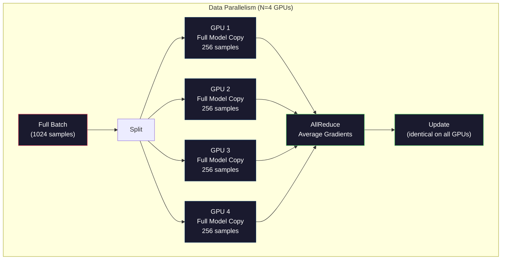
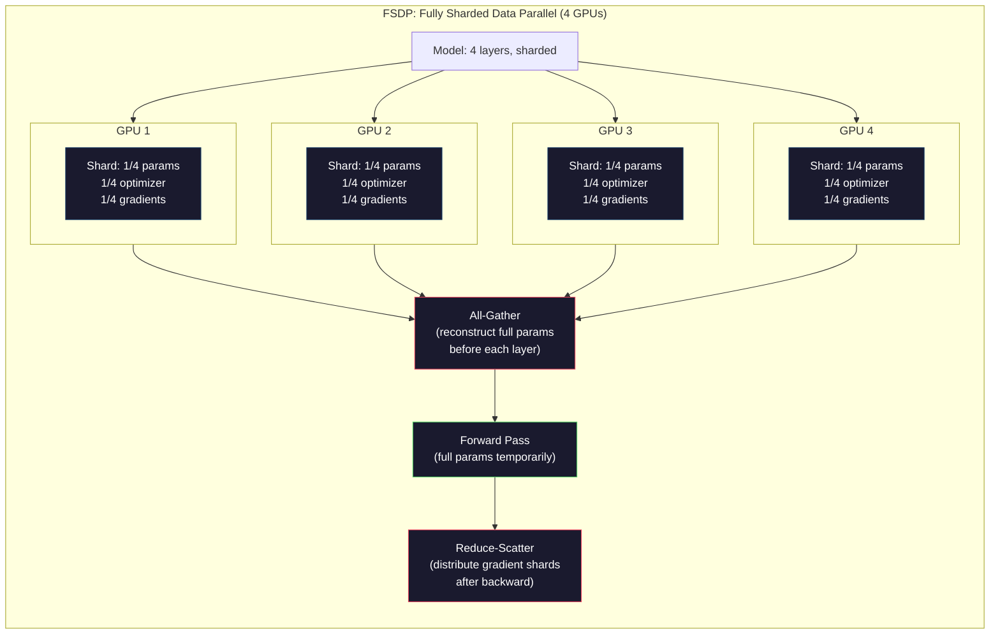
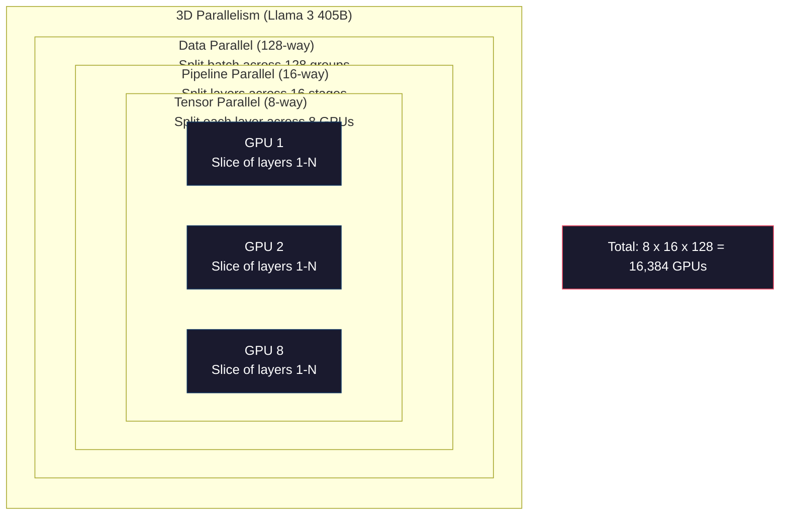

<!-- i18n:manual -->
# Масштабирование: распределённое обучение, FSDP, DeepSpeed

> Ваша модель на 124M обучилась на одной GPU. Теперь попробуйте 7 миллиардов параметров. Модель не влезает в память. Данные на одной машине считаются неделями. На масштабе распределённое обучение — не опция. Это единственный путь.

**Type:** Build
**Languages:** Python
**Prerequisites:** Phase 10, Lesson 04 (Pre-Training a Mini GPT)
**Time:** ~120 minutes

## Learning Objectives

- Объяснить три вида параллелизма (data, tensor, pipeline) и понять, когда каждый становится необходим — в зависимости от размера модели и кластера
- Реализовать data-parallel обучение на PyTorch DDP с синхронизацией градиентов между несколькими GPU
- Посчитать бюджет памяти для заданного размера модели (веса + состояния оптимизатора + градиенты + активации) и определить минимальное железо
- Настроить FSDP или стадии DeepSpeed ZeRO так, чтобы шардировать состояние модели по GPU и уместить модель, которая не влезает в одну карту

## The Problem

Модель на 7B параметров в FP16 требует 14 ГБ только под веса. Оптимизатор Adam хранит ещё две копии каждого параметра (оценки первого и второго момента). Это ещё 28 ГБ. Градиенты во время обратного прохода добавляют ещё 14 ГБ. Итого 56 ГБ — и это до того, как сохранена хоть одна активация.

У NVIDIA A100 памяти 80 ГБ.

56 ГБ из 80 съедено. Остаётся 24 ГБ на активации — промежуточные значения, посчитанные на прямом проходе, которые надо держать живыми ради обратного. Для последовательности в 2048 токенов при размерности модели 4096 активации одного слоя занимают примерно 64 МБ. При 32 слоях это 2 ГБ на один сэмпл. Батч из 8 требует 16 ГБ. У вас есть 24 ГБ. Батч из 12 уже взрывается.

Теперь возьмите 70B параметров. Одни веса: 140 ГБ в FP16. В одну GPU не влезает. Нужно минимум 2 A100 (2 × 80 ГБ = 160 ГБ) только чтобы держать веса. Добавьте состояния оптимизатора и градиенты — и нужно намного больше: минимум 3+ GPU, а реально 8–16 в зависимости от стратегии шардирования.

> 🎒 **На пальцах.** Память GPU — это столешница, а не склад: работать можно только с тем, что на неё выложено. Посчитайте сами для 7B: 14 (веса) + 28 (Adam) + 14 (градиенты) = 56 ГБ из 80, свободно 24 ГБ. Каждый сэмпл в батче стоит ещё 2 ГБ активаций, поэтому 8 сэмплов помещаются, а 12 — уже нет.

Llama 3 405B обучали на 16 384 GPU NVIDIA H100. Прогон обучения стоил, по оценкам, 100 миллионов долларов compute. DeepSeek V3 обучили сопоставимую модель примерно за 5,6 миллиона — за счёт умной архитектуры (Mixture of Experts означает, что на каждый токен активируется лишь часть параметров) и эффективности обучения.

Этот урок разбирает четыре стратегии, которые делают крупномасштабное обучение возможным: data parallelism, tensor parallelism, pipeline parallelism и fully sharded data parallelism. Вы смоделируете каждую на чистом Python, чтобы понять механику до того, как впервые запустите настоящий фреймворк распределённого обучения.

## The Concept

### Why Distribution is Required

Вот арифметика памяти для реальных моделей. Каждое число посчитано, а не прикинуто на глаз.

| Model | Params | Weights (FP16) | Adam States | Gradients (FP16) | Total (no activations) |
|-------|--------|----------------|-------------|------------------|----------------------|
| GPT-2 Small | 124M | 248 МБ | 992 МБ | 248 МБ | 1,5 ГБ |
| Llama 3 8B | 8B | 16 ГБ | 64 ГБ | 16 ГБ | 96 ГБ |
| Llama 3 70B | 70B | 140 ГБ | 560 ГБ | 140 ГБ | 840 ГБ |
| Llama 3 405B | 405B | 810 ГБ | 3 240 ГБ | 810 ГБ | 4 860 ГБ |

Колонка «Adam States» — вот что убивает. Adam хранит скользящее среднее (m) и скользящую дисперсию (v) для каждого параметра, оба в FP32. Для модели на 70B это 70B × 4 байта × 2 = 560 ГБ. Один только оптимизатор требует семь A100.

У одной H100 память 80 ГБ. Llama 3 405B нужно минимум 61 H100, чтобы уместить веса, оптимизатор и градиенты. Добавьте активации — и число вырастет дальше. Meta использовала 16 384 GPU не потому, что хотела, а потому что иначе было нельзя.

> 🎒 **На пальцах.** Adam — это дорогой бухгалтер: на каждый параметр он ведёт две дополнительные записи, и обе в FP32, то есть по 4 байта. Посмотрите на строку 70B в таблице: веса 140 ГБ, а оптимизатор 560 ГБ — в четыре раза больше самой модели. Именно эта колонка, а не веса, решает, сколько GPU вам придётся арендовать.

### Data Parallelism

Самая простая распределённая стратегия. Копируем всю модель на N GPU. Делим каждый обучающий батч на N равных частей. Каждая GPU гоняет прямой и обратный проход на своём куске данных. После обратного прохода градиенты усредняются по всем GPU. Каждая GPU обновляет свою копию весов одними и теми же усреднёнными градиентами, поэтому все копии остаются одинаковыми.

**The good:** линейный рост пропускной способности. N GPU обрабатывают в N раз больше данных за шаг. Обмен ограничен усреднением градиентов, и он перекрывается с вычислениями.

**The bad:** каждая GPU держит полную копию модели, состояний оптимизатора и градиентов. Для модели на 70B каждой GPU нужно 840 ГБ. Data parallelism вообще не уменьшает память на одну GPU. Он сокращает только время обучения.

**The math:** эффективный размер батча = per_gpu_batch_size × N. Для N=64 GPU с батчем 16 на карту эффективный батч равен 1024. Llama 3 использовала эффективный батч в 16 миллионов токенов на шаг.



> 🎒 **На пальцах.** Это как раздать одну и ту же книгу четырём людям и попросить каждого прочитать свою четверть, а потом свести заметки в одну. Читают вчетверо быстрее, но книг всё равно нужно четыре — по одной на человека. Поэтому 4 GPU дают батч 1024 вместо 256, но памяти на карту требуют ровно столько же, сколько одна.

### Tensor Parallelism

Разрезаем отдельные слои по GPU. Одно матричное умножение делится между GPU, каждая считает часть результата.

Возьмите матрицу весов формы (8192, 8192) в feedforward-слое. При 4-way tensor parallelism каждая GPU держит шард (8192, 2048). Каждая GPU умножает вход на свой шард и получает частичный результат. Частичные результаты собираются вместе (через all-reduce или all-gather) в полный выход.

**The good:** уменьшает память под веса модели на каждой GPU. Модель на 70B, разрезанная на 8 GPU, означает, что каждая GPU держит веса примерно на 8,75B параметров.

**The bad:** требует быстрой связи между GPU после каждого слоя. All-reduce после каждого matmul добавляет задержку. Это хорошо работает с NVLink (900 ГБ/с между GPU внутри одного узла) и плохо — между узлами через InfiniBand (400 Гбит/с, то есть около 50 ГБ/с). Tensor parallelism почти всегда ограничен одним узлом (8 GPU).

**Real usage:** Megatron-LM был первым, кто применил tensor parallelism. Llama 3 405B использует 8-way tensor parallelism внутри каждого узла.

> 🎒 **На пальцах.** Представьте, что восемь человек чистят один длинный забор: каждому достаётся своя секция, и в конце секции просто стыкуются. Матрица (8192, 8192) на 4 GPU превращается в четыре куска (8192, 2048), и каждая карта хранит вчетверо меньше весов. Но после каждой секции все обязаны сверить работу — вот почему нужен NVLink на 900 ГБ/с, а не сеть на 50 ГБ/с.

### Pipeline Parallelism

Режем модель по слоям. GPU 1 считает слои 1–8. GPU 2 — слои 9–16. GPU 3 — слои 17–24. GPU 4 — слои 25–32. Данные текут по конвейеру: GPU 1 считает свои слои и передаёт активации на GPU 2, та считает свои и передаёт на GPU 3, и так далее.

**The good:** минимальный обмен между GPU — только активации на границах слоёв, а они малы по сравнению с градиентами или весами. Работает и между узлами, потому что требования к пропускной способности низкие.

**The bad:** пузыри конвейера. Пока GPU 4 считает прямой проход по микробатчу 1, GPU 1, 2 и 3 простаивают (свою часть они уже прогнали). На обратном проходе картина зеркальная. При наивном конвейере утилизация GPU составляет всего 1/N для N стадий.

**GPipe and PipeDream** решают проблему пузыря, разбивая батч на микробатчи. GPU 1 берётся за микробатч 2, как только закончила прямой проход по микробатчу 1. Так вычисления на разных стадиях перекрываются. При M микробатчах и N стадиях доля пузыря падает до (N-1)/M. Возьмите M=16 микробатчей при N=4 стадиях — и пузырь равен 3/16 = 18,75% простоя.

> 🎒 **На пальцах.** Это конвейер на заводе: пока первая деталь доедет до последнего рабочего, все остальные стоят без дела. Лечится тем, что деталей запускают много подряд. Подставьте формулу (N-1)/M: при 4 стадиях и 1 микробатче простой 3/1 — то есть 75%, а при 16 микробатчах уже 3/16 ≈ 19%.

### FSDP: Fully Sharded Data Parallel

FSDP соединяет масштабируемость data parallelism с экономией памяти от шардирования. Вместо того чтобы каждая GPU держала полную копию модели, каждая GPU держит только 1/N параметров, градиентов и состояний оптимизатора.

Перед прямым проходом слоя FSDP выполняет **all-gather**, чтобы собрать полные параметры со всех GPU в память каждой GPU. После прямого прохода каждая GPU выбрасывает чужие параметры. На обратном проходе all-gather запускается снова, чтобы восстановить параметры для расчёта градиентов. После обратного прохода **reduce-scatter** раздаёт шарды градиентов так, чтобы каждая GPU хранила только 1/N градиентов.

**The math for a 70B model on 8 GPUs:**

| Component | Without FSDP | With FSDP |
|-----------|-------------|-----------|
| Веса (FP16) | 140 ГБ на GPU | 17,5 ГБ на GPU |
| Состояния Adam (FP32) | 560 ГБ на GPU | 70 ГБ на GPU |
| Градиенты (FP16) | 140 ГБ на GPU | 17,5 ГБ на GPU |
| **Итого** | **840 ГБ на GPU** | **105 ГБ на GPU** |

Без FSDP модель на 70B не влезает в одну GPU на 80 ГБ. С FSDP на 8 GPU каждая карта занимает 105 ГБ — стоп, это тоже не влезает. Нужно минимум 16 GPU, чтобы уйти ниже 80 ГБ на карту, либо совместить FSDP с activation checkpointing (пересчитывать активации на обратном проходе вместо того, чтобы хранить их).

Цена обмена выше, чем у обычного data parallelism, из-за all-gather перед каждым слоем. Но экономия памяти делает возможными прогоны обучения, которые раньше были невозможны.



> 🎒 **На пальцах.** FSDP — это как складчина: никто не держит весь инвентарь дома, вещь достают со склада ровно на время работы и сразу возвращают. Посмотрите на таблицу: 840 ГБ на карту превращаются в 105 ГБ на 8 GPU — ровно в 8 раз меньше. Но 105 всё ещё больше 80, поэтому и нужны 16 карт: 840 / 16 = 52,5 ГБ.

### DeepSpeed ZeRO

ZeRO от DeepSpeed (Zero Redundancy Optimizer) концептуально идентичен FSDP, но был разработан независимо в Microsoft. В нём определены три стадии, каждая шардирует агрессивнее предыдущей:

| Stage | Shards | Memory Savings | Communication |
|-------|--------|---------------|---------------|
| ZeRO-1 | Только состояния оптимизатора | Примерно в 4 раза меньше | Как у data parallel |
| ZeRO-2 | + градиенты | Примерно в 8 раз меньше | Чуть больше |
| ZeRO-3 | + параметры | Примерно в N раз меньше (N GPU) | All-gather на каждый слой |

ZeRO-3 эквивалентен FSDP. Названия разные, механизм тот же. PyTorch добавил FSDP как родную реализацию после того, как DeepSpeed доказал состоятельность идеи.

DeepSpeed также ввёл ZeRO-Offload (выгрузка состояний оптимизатора в CPU RAM, которая дешевле и больше) и ZeRO-Infinity (выгрузка на NVMe SSD). Это размен скорости на объём памяти: выгруженные операции работают медленнее, но освобождают память GPU.

> 🎒 **На пальцах.** Три стадии ZeRO — это три уровня «а что ещё можно не дублировать». Сначала перестаём копировать состояния оптимизатора (их больше всего — вспомните 560 ГБ из 840), потом градиенты, потом сами параметры. Отсюда и цифры: ~4×, ~8×, ~N×.

### Mixed Precision Training

Современное обучение одновременно использует несколько форматов чисел с плавающей точкой:

- **Forward pass**: FP16 или BF16 (16 бит). Вдвое меньше памяти, чем у FP32. Matmul-ы идут в 2 раза быстрее на тензорных ядрах.
- **Master weights**: FP32 (32 бита). Оптимизатор держит их ради численной точности при обновлении весов.
- **Loss scaling**: умножить loss на большую константу перед обратным проходом, чтобы FP16-градиенты не проваливались в ноль. Разделить на ту же константу перед шагом оптимизатора.

У BF16 (Brain Float 16) такой же диапазон экспоненты, как у FP32 (8 бит экспоненты), но меньшая точность (7 бит мантиссы против 23 у FP32). Ему почти никогда не нужен loss scaling, потому что он покрывает тот же диапазон значений. У FP16 5 бит экспоненты и 10 бит мантиссы — он различает мелкие детали, но переполняется и обнуляется на крайних величинах.

TPU от Google работают с BF16 нативно. A100 и H100 от NVIDIA поддерживают и FP16, и BF16. Индустрия в основном перешла на BF16, потому что он снимает головную боль с loss scaling.

**Memory comparison for a 7B model:**

| Precision | Weights | Optimizer | Gradients | Total |
|-----------|---------|-----------|-----------|-------|
| FP32 везде | 28 ГБ | 56 ГБ | 28 ГБ | 112 ГБ |
| Смешанная (BF16 + FP32 master) | 14 ГБ | 56 ГБ | 14 ГБ | 84 ГБ |

Смешанная точность экономит на этой модели 28 ГБ. Состояния оптимизатора всё равно остаются в FP32 — именно туда уходит основная часть памяти.

> 🎒 **На пальцах.** Ожидание: «перешли на 16 бит — памяти вдвое меньше». Реальность из таблицы: 112 ГБ превратились в 84 ГБ, то есть минус 25%, а не 50%. Причина в колонке Optimizer: 56 ГБ как были в FP32, так и остались, потому что маленькие обновления весов в FP16 просто теряются.

### Megatron-LM and 3D Parallelism

Настоящее крупномасштабное обучение сочетает все три вида параллелизма:

- **Data parallelism** между группами узлов (масштабируем размер батча)
- **Tensor parallelism** внутри узла (режем слои на 8 GPU)
- **Pipeline parallelism** между узлами (раскидываем группы слоёв по машинам)

Llama 3 405B на 16 384 H100:
- 8-way tensor parallelism внутри каждого узла (8 GPU на узел)
- 16-way pipeline parallelism между узлами (16 стадий конвейера)
- 128-way data parallelism по оставшемуся измерению (16 384 / 8 / 16 = 128)

Эта трёхмерная декомпозиция (8 × 16 × 128 = 16 384) и есть способ дойти до тысяч GPU. Каждая GPU видит свой шард данных (data parallel), держит один срез каждого слоя (tensor parallel) и считает свой набор слоёв (pipeline parallel).

DeepSeek V3 пошли другим путём. Их архитектура Mixture of Experts активирует лишь 37B из 671B параметров на токен. Значит, каждой GPU надо считать (и хранить активации) только для активных параметров. Обучали на 2048 GPU H800 — меньше 1/8 от парка Meta — за 5,6 миллиона против примерно 100 миллионов у Meta.



> 🎒 **На пальцах.** Трёхмерность здесь буквальная: у каждой GPU есть три «координаты» — какой кусок данных, какой срез слоя, какая группа слоёв. Проверьте арифметику: 8 × 16 × 128 = 16 384, и это ровно число карт в кластере Meta. Уберите любое из трёх измерений — и либо модель не влезет, либо сеть захлебнётся.

```figure
paged-kv-cache
```

## Build It

### Step 1: Simulate Data Parallelism

Разделите батч между виртуальными GPU. Каждая GPU считает прямой проход на своём куске. Усредните «градиенты» (мы моделируем их значениями loss).

```python
import numpy as np

def simulate_data_parallelism(data, num_gpus, model_fn):
    batch_size = len(data)
    shard_size = batch_size // num_gpus
    remainder = batch_size % num_gpus

    gpu_losses = []
    gpu_gradients = []

    offset = 0
    for gpu_id in range(num_gpus):
        extra = 1 if gpu_id < remainder else 0
        shard = data[offset:offset + shard_size + extra]
        offset += shard_size + extra

        loss, grad = model_fn(shard)
        gpu_losses.append(loss)
        gpu_gradients.append(grad)

    avg_loss = np.mean(gpu_losses)
    avg_gradient = np.mean(gpu_gradients, axis=0)

    return avg_loss, avg_gradient
```

Операция all-reduce (усреднение градиентов) — единственный обмен в data parallelism. На практике этим занимается библиотека NCCL на GPU NVIDIA, где реализован ring all-reduce: каждая GPU отправляет 1/N своих градиентов соседу, получает 1/N от другого соседа, и через N-1 шагов у каждой GPU есть полное среднее. Суммарный объём обмена: 2 × размер_градиентов × (N-1)/N, то есть при больших N он стремится к двум размерам градиентов.

> 🎒 **На пальцах.** Ring all-reduce — это как передавать по кругу коробку, в которую каждый докладывает свою часть. Наивный вариант «все шлют всем» стоил бы N × размер градиентов, а кольцо укладывается примерно в 2 размера — и это не зависит от числа GPU. Поэтому data parallelism нормально живёт и на 64 картах, и на 1024.

### Step 2: Simulate Tensor Parallelism

Разрежьте матрицу весов между GPU. Каждая GPU считает частичное матричное умножение. Соберите результаты вместе.

```python
def simulate_tensor_parallelism(input_data, weight_matrix, num_gpus):
    d_in, d_out = weight_matrix.shape
    assert d_out % num_gpus == 0, f"d_out {d_out} not divisible by num_gpus {num_gpus}"
    shard_size = d_out // num_gpus

    partial_results = []
    for gpu_id in range(num_gpus):
        start = gpu_id * shard_size
        end = start + shard_size
        weight_shard = weight_matrix[:, start:end]

        partial = input_data @ weight_shard
        partial_results.append(partial)

    full_output = np.concatenate(partial_results, axis=-1)

    direct_output = input_data @ weight_matrix
    error = np.abs(full_output - direct_output).max()

    return full_output, error
```

Ошибка должна быть ровно нулевой (или на уровне машинного эпсилон). Tensor parallelism математически точен — он даёт тот же результат, что и полный matmul на одной GPU. Разрез идёт по выходной размерности, поэтому каждая GPU выдаёт свой набор столбцов, а конкатенация восстанавливает полный результат.

Для column-parallel линейных слоёв (разрез по выходной размерности) результаты конкатенируются. Для row-parallel (разрез по входной размерности) — суммируются. В FFN трансформера первый линейный слой (расширение) делают column-parallel, а второй (сжатие) — row-parallel. Так удаётся обойтись без all-reduce между этими двумя слоями.

> 🎒 **На пальцах.** Разрезать по столбцам — как раздать четверым по своей колонке таблицы: в конце колонки просто приставляются друг к другу, ничего складывать не надо. Именно поэтому в коде стоит `np.concatenate`, а не сумма, и `max_error` выходит нулевым. Пара «column-parallel, потом row-parallel» экономит целый all-reduce в середине FFN.

### Step 3: Simulate Pipeline Parallelism

Разложите слои модели по виртуальным GPU. Покажите проблему пузыря, когда ранние стадии простаивают, пока считают поздние.

```python
def simulate_pipeline_parallelism(num_layers, num_stages, num_microbatches):
    layers_per_stage = num_layers // num_stages

    timeline = {}
    clock = 0

    for mb in range(num_microbatches):
        for stage in range(num_stages):
            start_time = max(
                timeline.get((stage, mb - 1, "fwd"), (0, 0))[1] if mb > 0 else 0,
                timeline.get((stage - 1, mb, "fwd"), (0, 0))[1] if stage > 0 else 0,
            )
            end_time = start_time + layers_per_stage
            timeline[(stage, mb, "fwd")] = (start_time, end_time)

    last_fwd_end = max(v[1] for v in timeline.values())

    for mb in range(num_microbatches - 1, -1, -1):
        for stage in range(num_stages - 1, -1, -1):
            deps = [last_fwd_end]
            if mb < num_microbatches - 1 and (stage, mb + 1, "bwd") in timeline:
                deps.append(timeline[(stage, mb + 1, "bwd")][1])
            if stage < num_stages - 1 and (stage + 1, mb, "bwd") in timeline:
                deps.append(timeline[(stage + 1, mb, "bwd")][1])
            start_time = max(deps)
            end_time = start_time + layers_per_stage
            timeline[(stage, mb, "bwd")] = (start_time, end_time)

    total_time = max(v[1] for v in timeline.values())
    compute_time = num_microbatches * num_stages * layers_per_stage * 2
    bubble_fraction = 1.0 - compute_time / (total_time * num_stages)

    return timeline, total_time, bubble_fraction
```

При 4 стадиях и 1 микробатче доля пузыря равна 75% — три GPU из четырёх простаивают в любой момент времени. При 16 микробатчах она падает примерно до 19%. Плата за устранение пузырей — память: нужно одновременно хранить активации для всех микробатчей, которые находятся в полёте.

> 🎒 **На пальцах.** Пузырь — это простой на конвейере, и его лечат количеством деталей, а не скоростью рабочих. Цена видна сразу: 16 микробатчей в полёте — это 16 наборов активаций в памяти вместо одного. Отсюда вечный компромисс: меньше пузырь — больше памяти.

### Step 4: Memory Calculator

Посчитайте точные требования к памяти для обучения модели любого размера.

```python
def memory_calculator(
    params_billions,
    precision_bytes=2,
    optimizer="adam",
    num_gpus=1,
    sharding="none",
    sequence_length=2048,
    batch_size_per_gpu=1,
    hidden_dim=None,
    num_layers=None,
):
    params = params_billions * 1e9

    weight_memory = params * precision_bytes

    if optimizer == "adam":
        optimizer_memory = params * 4 * 2
    elif optimizer == "sgd":
        optimizer_memory = params * 4
    else:
        optimizer_memory = 0

    gradient_memory = params * precision_bytes

    total_no_activation = weight_memory + optimizer_memory + gradient_memory

    if hidden_dim and num_layers:
        activation_per_layer = (
            sequence_length * batch_size_per_gpu * hidden_dim * precision_bytes * 4
        )
        activation_memory = activation_per_layer * num_layers
    else:
        activation_memory = params * precision_bytes * 0.5

    if sharding == "fsdp" or sharding == "zero3":
        weight_memory /= num_gpus
        optimizer_memory /= num_gpus
        gradient_memory /= num_gpus
    elif sharding == "zero2":
        optimizer_memory /= num_gpus
        gradient_memory /= num_gpus
    elif sharding == "zero1":
        optimizer_memory /= num_gpus

    per_gpu_total = weight_memory + optimizer_memory + gradient_memory + activation_memory

    return {
        "params_billions": params_billions,
        "weights_gb": weight_memory / 1e9,
        "optimizer_gb": optimizer_memory / 1e9,
        "gradients_gb": gradient_memory / 1e9,
        "activations_gb": activation_memory / 1e9,
        "per_gpu_total_gb": per_gpu_total / 1e9,
        "total_across_gpus_gb": per_gpu_total * num_gpus / 1e9,
        "fits_on_80gb": per_gpu_total / 1e9 <= 80,
        "num_gpus": num_gpus,
        "sharding": sharding,
    }
```

Этот калькулятор отвечает на вопрос, который задаёт каждый ML-инженер: «Сколько мне нужно GPU?» Скормите ему размер модели и посмотрите, влезает ли она. Меняйте стратегию шардирования, пока итог на одну GPU не опустится ниже 80 ГБ.

> 🎒 **На пальцах.** Обратите внимание на ветку `sharding`: у `zero1` на число GPU делится только память оптимизатора, у `zero2` — ещё и градиенты, у `fsdp`/`zero3` — всё три статьи расходов. Активации не делятся никогда, потому что они у каждой GPU свои. Поэтому калькулятор для 405B на 128 GPU всё равно упирается не в веса, а в активации.

### Step 5: Mixed Precision Simulation

Сравните расход памяти между FP32, FP16 и обучением в смешанной точности.

```python
def mixed_precision_comparison(params_billions):
    params = params_billions * 1e9

    fp32_weights = params * 4
    fp32_optimizer = params * 4 * 2
    fp32_gradients = params * 4
    fp32_total = fp32_weights + fp32_optimizer + fp32_gradients

    fp16_weights = params * 2
    fp16_master = params * 4
    fp16_optimizer = params * 4 * 2
    fp16_gradients = params * 2
    fp16_total = fp16_weights + fp16_master + fp16_optimizer + fp16_gradients

    mixed_weights = params * 2
    mixed_optimizer = params * 4 * 2
    mixed_gradients = params * 2
    mixed_total = mixed_weights + mixed_optimizer + mixed_gradients

    return {
        "fp32_total_gb": fp32_total / 1e9,
        "fp16_with_master_gb": fp16_total / 1e9,
        "mixed_bf16_gb": mixed_total / 1e9,
        "savings_vs_fp32": 1 - mixed_total / fp32_total,
    }
```

Самый большой сюрприз для большинства: смешанная точность не уменьшает память вдвое. Состояния оптимизатора (m и v у Adam) остаются в FP32 при любой точности. Для модели на 7B обучение в FP32 занимает 112 ГБ. Смешанная точность — 84 ГБ. Это сокращение на 25%, а не на 50%. Оптимизатор доминирует.

> 🎒 **На пальцах.** Посчитайте по коду для 7B: `fp32_optimizer` = 7e9 × 4 × 2 = 56 ГБ, и в смешанной ветке `mixed_optimizer` считается ровно той же формулой. Ужимаются только веса и градиенты: 28 + 28 превращаются в 14 + 14. Отсюда и `savings_vs_fp32` = 1 − 84/112 = 0,25.

## Use It

### Run All Simulations

```python
def run_all_demos():
    print("=" * 70)
    print("DATA PARALLELISM SIMULATION")
    print("=" * 70)

    np.random.seed(42)
    data = np.random.randn(64, 32)
    weight = np.random.randn(32, 16)

    def model_fn(batch):
        output = batch @ weight
        loss = np.mean(output ** 2)
        grad = 2 * batch.T @ (batch @ weight) / len(batch)
        return loss, grad

    for n_gpus in [1, 2, 4, 8]:
        loss, grad = simulate_data_parallelism(data, n_gpus, model_fn)
        print(f"  {n_gpus} GPUs: loss={loss:.4f}, grad_norm={np.linalg.norm(grad):.4f}")

    print()
    print("=" * 70)
    print("TENSOR PARALLELISM SIMULATION")
    print("=" * 70)

    x = np.random.randn(4, 8192)
    W = np.random.randn(8192, 8192)

    for n_gpus in [1, 2, 4, 8]:
        output, error = simulate_tensor_parallelism(x, W, n_gpus)
        print(f"  {n_gpus} GPUs: output_shape={output.shape}, max_error={error:.2e}")

    print()
    print("=" * 70)
    print("PIPELINE PARALLELISM SIMULATION")
    print("=" * 70)

    for n_mb in [1, 4, 8, 16, 32]:
        _, total_t, bubble = simulate_pipeline_parallelism(32, 4, n_mb)
        print(f"  {n_mb:2d} micro-batches: total_time={total_t:4d}, bubble={bubble:.1%}")

    print()
    print("=" * 70)
    print("MEMORY CALCULATOR")
    print("=" * 70)

    configs = [
        (7, "none", 1),
        (7, "fsdp", 8),
        (70, "none", 1),
        (70, "fsdp", 8),
        (70, "fsdp", 16),
        (405, "fsdp", 64),
        (405, "fsdp", 128),
    ]

    print(f"  {'Model':>8} {'Sharding':>8} {'GPUs':>5} {'Per-GPU':>10} {'Fits 80GB':>10}")
    print("  " + "-" * 50)
    for params, shard, gpus in configs:
        result = memory_calculator(params, num_gpus=gpus, sharding=shard)
        fits = "Yes" if result["fits_on_80gb"] else "No"
        print(f"  {params:>6}B {shard:>8} {gpus:>5} {result['per_gpu_total_gb']:>8.1f}GB {fits:>10}")

    print()
    print("=" * 70)
    print("MIXED PRECISION COMPARISON")
    print("=" * 70)

    for params_b in [7, 13, 70, 405]:
        result = mixed_precision_comparison(params_b)
        print(f"  {params_b}B: FP32={result['fp32_total_gb']:.0f}GB, "
              f"Mixed BF16={result['mixed_bf16_gb']:.0f}GB, "
              f"Savings={result['savings_vs_fp32']:.0%}")
```

## Ship It

Этот урок производит `outputs/prompt-distributed-training-planner.md` — промпт, который принимает размер модели и доступное железо, а затем выдаёт полный план распределённого обучения: стратегию параллелизма, бюджет памяти, накладные расходы на обмен и ожидаемую пропускную способность.

## Exercises

1. Доработайте калькулятор памяти так, чтобы он учитывал activation checkpointing. При чекпоинтинге активации хранятся только на каждом K-м слое (типично K=1, то есть пересчитывается всё). Покажите размен памяти на compute: сколько памяти экономит чекпоинтинг и насколько он замедляет обучение (примерно на 33% больше вычислений при полном чекпоинтинге)?

2. Расширьте симуляцию pipeline parallelism, реализовав расписание 1F1B (one forward, one backward), которое использует PipeDream. Сравните долю пузыря с наивным расписанием для 4 стадий и 8 микробатчей. У расписания 1F1B пиковая память должна быть меньше, потому что обратные проходы стартуют раньше.

3. Реализуйте симулятор накопления градиентов. Вместо all-reduce после каждого микробатча копите градиенты локально K шагов, а потом делайте all-reduce. Покажите, что так обмен сокращается в K раз, а итоговые градиенты остаются идентичными (а значит, идентичным будет и обучение).

4. Постройте оценщик стоимости. По размеру модели, целевому числу токенов, типу GPU (A100 по $2/час, H100 по $3,50/час) и стратегии параллелизма оцените полную стоимость обучения в долларах. Сверьтесь с известными числами: Llama 3 405B, по сообщениям, стоила примерно $100M, DeepSeek V3 — примерно $5,6M.

5. Добавьте ZeRO-Offload в калькулятор памяти. Считайте, что CPU RAM — 512 ГБ на узел, а NVMe — 2 ТБ. Покажите, как выгрузка состояний оптимизатора в CPU позволяет обучать модель на 70B на 4 GPU вместо 16 ценой замедления шагов оптимизатора на 30–50%.

> 🎒 **На пальцах.** Возьмите четвёртое задание и прикиньте порядок сами: 16 384 H100 по $3,50 в час — это примерно $57 000 в час, то есть около $1,4 млн в сутки. За два месяца непрерывного прогона набегает как раз тот самый порядок в $100M. Такие оценки полезно уметь делать до аренды кластера, а не после.

## Key Terms

| Term | What people say | What it actually means |
|------|----------------|----------------------|
| Data parallelism | «Скопируй модель на каждую GPU» | Каждая GPU обрабатывает свой шард данных; после каждого шага градиенты усредняются через all-reduce |
| Tensor parallelism | «Разрежь слой между GPU» | Матрицы весов делятся так, что каждая GPU считает часть matmul; нужен быстрый интерконнект NVLink |
| Pipeline parallelism | «Разложи слои по GPU» | Каждая GPU считает свою группу слоёв; данные текут по конвейеру микробатчами, чтобы уменьшить пузыри |
| FSDP | «Шардируй всё» | Fully Sharded Data Parallel — каждая GPU держит 1/N весов, градиентов и состояний оптимизатора; all-gather перед вычислением |
| ZeRO | «Версия FSDP от DeepSpeed» | Zero Redundancy Optimizer с 3 стадиями: шардируем оптимизатор (Stage 1), + градиенты (Stage 2), + параметры (Stage 3) |
| All-reduce | «Усредни по всем GPU» | Коллективная операция, после которой у каждой GPU лежит сумма (или среднее) входов всех GPU — обычно реализуется как ring all-reduce |
| All-gather | «Собери со всех GPU» | Коллективная операция, после которой у каждой GPU лежит конкатенация данных всех GPU — в FSDP восстанавливает полные параметры |
| Reduce-scatter | «Сложи и раздай» | Коллективная операция, которая складывает данные и раздаёт разные куски разным GPU — в FSDP используется для шардирования градиентов |
| Mixed precision | «Учим в половинной точности» | FP16/BF16 на прямом и обратном проходе, FP32 для состояний оптимизатора — экономит около 25% памяти, а не 50%, потому что доминирует оптимизатор |
| Pipeline bubble | «Простой в конвейере» | Доля времени, когда GPU простаивают в ожидании данных с предыдущей стадии — уменьшается за счёт большего числа микробатчей |

## Further Reading

- [Rajbhandari et al., 2020 -- "ZeRO: Memory Optimizations Toward Training Trillion Parameter Models"](https://arxiv.org/abs/1910.02054) — статья про DeepSpeed ZeRO, где определены три стадии шардирования
- [Shoeybi et al., 2020 -- "Megatron-LM: Training Multi-Billion Parameter Language Models Using Model Parallelism"](https://arxiv.org/abs/1909.08053) — tensor parallelism для трансформеров от NVIDIA
- [Narayanan et al., 2021 -- "Efficient Large-Scale Language Model Training on GPU Clusters Using Megatron-LM"](https://arxiv.org/abs/2104.04473) — 3D-параллелизм, объединяющий data, tensor и pipeline
- [Zhao et al., 2023 -- "PyTorch FSDP: Experiences on Scaling Fully Sharded Data Parallel"](https://arxiv.org/abs/2304.11277) — родная реализация FSDP в PyTorch
- [Llama 3 Technical Report](https://arxiv.org/abs/2407.21783) — обучение на 16 384 GPU с деталями 3D-параллелизма
- [DeepSeek-V3 Technical Report](https://arxiv.org/abs/2412.19437) — как архитектура MoE снижает стоимость обучения на порядок
