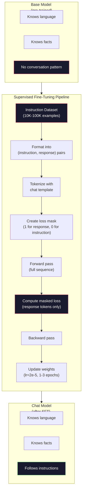

<!-- i18n:manual -->
# Дообучение на инструкциях (SFT)

> Базовая модель предсказывает следующий токен. И всё. Она не выполняет инструкции, не отвечает на вопросы и не отказывается от вредных запросов. SFT — это мост между предсказателем токенов и полезным ассистентом. Каждая модель, с которой вы когда-либо разговаривали — Claude, GPT, Llama Chat, — прошла через этот шаг.

**Type:** Build
**Languages:** Python (with numpy)
**Prerequisites:** Phase 10, Lesson 04 (Pre-Training a Mini GPT)
**Time:** ~90 minutes

## Learning Objectives

- Реализовать supervised fine-tuning (SFT), который превращает базовую языковую модель в ассистента, выполняющего инструкции
- Форматировать обучающие данные шаблонами промпта с ролями system, user и assistant и маскировать потери на всех токенах, кроме ответа ассистента
- Объяснить, зачем нужен SFT: базовые модели продолжают текст, а не отвечают на вопросы
- Оценивать качество SFT, сравнивая ответы базовой и дообученной модели на отложенном наборе инструкций

## The Problem

В уроке 04 вы обучили модель. Она умеет предсказывать следующий токен по последовательности. Дайте ей «The transformer architecture» — и она может продолжить «has revolutionized natural language processing». Для предсказателя следующего токена это впечатляет.

Теперь попробуйте вот что: дайте ей «What is the capital of France?». Базовая модель не ответит «Paris». Она продолжит шаблон. Она может выдать «What is the capital of Germany? What is the capital of Spain?», потому что училась на документах со списками вопросов. Или выдать «is a question that many people ask», потому что это правдоподобное продолжение. У модели вообще нет понятия *ответа*. Она знает только *продолжение*.

Это и есть разрыв между GPT-3 (базовая модель, июнь 2020) и ChatGPT (дообученной на инструкциях, ноябрь 2022). Та же архитектура. То же предобучение. Разница — 20 000–100 000 тщательно составленных пар (инструкция, ответ), которые научили модель шаблону диалога.

Stanford Alpaca доказал, что миллионы примеров не нужны. В марте 2023 года команда дообучила Llama 7B всего на 52 000 пар инструкция-ответ, сгенерированных GPT-3.5. Общая стоимость: 600 долларов. Получился чат-бот, который выполняет инструкции, отвечает на вопросы и поддерживает диалог. Не так хорошо, как ChatGPT, но пугающе близко за 600 долларов и несколько часов обучения.

Llama 2 Chat от Meta использовала для первой стадии SFT всего ~27 000 качественных примеров. Ключевая мысль: качество важнее количества. 27 000 примеров, написанных умелыми разметчиками, бьют миллион шумных примеров, соскрапленных из интернета.

> 🎒 **На пальцах.** Базовая модель — как человек, который наизусть выучил всю библиотеку, но не понимает, что к нему обращаются. Скажете ему «Какая столица Франции?» — он продолжит зачитывать похожие строчки из книги. SFT не добавляет ему знаний, он и так знает про Париж; SFT объясняет, что вопрос надо *закрыть ответом*. И это дёшево: Alpaca справилась за 52 000 примеров и 600 долларов, а Llama 2 Chat — вообще за 27 000.

## The Concept

### What SFT Actually Does

Supervised Fine-Tuning продолжает тот же цикл обучения, что и предобучение — прямой проход, вычисление потерь, обратный проход, обновление весов, — но на данных другого рода. Вместо сырого текста вы обучаетесь на структурированных диалогах:

```json
{
  "system": "You are a helpful assistant.",
  "user": "What is the capital of France?",
  "assistant": "The capital of France is Paris."
}
```

Модель уже знает, что столица Франции — Париж. Она выучила это на предобучении по Википедии, учебникам и веб-страницам. SFT не учит модель новым фактам. Он учит её новому *поведению*: увидел вопрос — выдай ответ. Увидел инструкцию — выдай выполнение. Увидел вредный запрос — выдай отказ.

Думайте об этом так. Предобучение даёт модели знания. SFT даёт модели манеры.

> 🎒 **На пальцах.** Представьте эрудита, который знает ответ на любой вопрос, но за столом чавкает и перебивает. Знания у него есть — не хватает воспитания. В примере выше в поле `assistant` нет ни одного нового факта: «The capital of France is Paris» модель могла бы выдать и до SFT. Меняется только то, *когда* и *в какой форме* она это скажет.

### Data Formats

В индустрии господствуют три формата. Каждый кодирует одно и то же — кто что сказал — просто разными разделителями.

**Alpaca Format** (Stanford, март 2023):

```json
{
  "instruction": "Summarize the following article in 3 sentences.",
  "input": "The European Central Bank raised interest rates...",
  "output": "The ECB increased rates by 25 basis points..."
}
```

Простой и очень распространённый. Поле `input` необязательное — многим инструкциям дополнительный контекст не нужен. Stanford выложил 52 000 примеров в этом формате, сгенерированных GPT-3.5 за 600 долларов. С этого началось движение открытого дообучения на инструкциях.

**ShareGPT Format** (сообщество, 2023):

```json
{
  "conversations": [
    {"from": "system", "value": "You are a helpful assistant."},
    {"from": "human", "value": "What causes tides?"},
    {"from": "gpt", "value": "Tides are caused by the gravitational pull of the Moon..."},
    {"from": "human", "value": "How often do they occur?"},
    {"from": "gpt", "value": "Most coastal areas experience two high tides and two low tides per day..."}
  ]
}
```

Поддерживает многоходовые диалоги. Поле «from» по традиции использует значения «human» и «gpt» независимо от того, какая модель на самом деле отвечала. Vicuna обучали на 70 000 диалогов ShareGPT, собранных из расшаренных пользователями логов ChatGPT.

**ChatML Format** (OpenAI, используется многими открытыми моделями):

```
<|im_start|>system
You are a helpful assistant.<|im_end|>
<|im_start|>user
What is the capital of France?<|im_end|>
<|im_start|>assistant
The capital of France is Paris.<|im_end|>
```

Использует специальные токены (`<|im_start|>`, `<|im_end|>`) для разметки ролей. Эти токены добавляют в словарь токенизатора во время дообучения. ChatML используют Qwen, Yi и многие другие модели.

Все три формата делают одно и то же: говорят модели «вот это инструкция, вот это ответ, выучи шаблон».

> 🎒 **На пальцах.** Это как один и тот же диалог, записанный тремя способами: в виде анкеты (Alpaca: поля instruction/input/output), в виде сценария пьесы (ShareGPT: список реплик с именами говорящих) и в виде сплошного текста со служебными скобками (ChatML: `<|im_start|>user`). Информация одна, отличаются только разделители. Обратите внимание: только ShareGPT в примере выше держит четыре реплики подряд — Alpaca-строка физически не умеет хранить диалог длиннее одного обмена.

### Why It Works

Модель уже знает язык после предобучения. Она видела миллиарды примеров вопросов с ответами, инструкций с выполнением и разговоров между людьми. Эти шаблоны уже закодированы в весах.

SFT концентрирует эту скрытую способность. Вместо того чтобы модель гадала по контексту, надо ей отвечать на вопрос или продолжать документ, SFT явно обучает её шаблону диалога. После нескольких тысяч примеров модель усваивает: увидел маркер роли assistant — выдай полезный ответ.

Вот почему 27 000 примеров хватает. Вы не учите модель английскому. Вы не учите её фактам о мире. Вы учите её одному простому поведению: отвечать на инструкции. Знания уже были на месте.

> 🎒 **На пальцах.** Это как человек, который свободно говорит на языке, но никогда не работал в поддержке. Ему не нужен курс языка — ему нужна неделя стажировки, чтобы понять, что на сообщение клиента полагается отвечать, а не рассуждать вслух. Отсюда и цифры: предобучению нужны 2 триллиона токенов, а SFT — 27 000 примеров, это разница примерно в сто тысяч раз.

### The Masked Loss

Это самая важная техническая деталь SFT, и большинство туториалов её пропускают.

На предобучении вы считаете потери на каждом токене. Модель учится предсказывать каждый следующий токен последовательности. На SFT вы считаете потери только на токенах *ответа*. Токены инструкции присутствуют ради контекста, но модель не штрафуют за то, что она их «предсказала» неправильно.

Почему? Потому что вы не хотите, чтобы модель училась *генерировать* инструкции. Вы хотите, чтобы она училась *отвечать на* инструкции. Если считать потери на токенах инструкции, вы обучаете модель предсказывать «What is the capital of France?», как будто это она задаёт вопрос. Это тратит впустую сигнал градиента и может запутать модель насчёт её роли.

На практике вы строите маску потерь: 1 для токенов ответа, 0 для токенов инструкции. Перед усреднением умножаете потери каждого токена на эту маску.

```
Tokens:    [SYS] You are helpful [USER] What is the capital? [ASST] Paris is the capital [EOS]
Loss mask:   0    0    0     0      0     0   0  0     0       1     1    1   1     1      1
```

В потери вносят вклад только токены после `[ASST]`. На прямом проходе модель видит весь диалог целиком (без инструкции она не выдаст правильный ответ), но обновляет веса только по тому, насколько хорошо предсказала ответ.

> 🎒 **На пальцах.** Это как школьное сочинение: тема на доске написана учителем, оценивают только ваш текст. Посмотрите на маску выше — там девять нулей на служебных токенах и словах вопроса и шесть единиц на «Paris is the capital [EOS]». То есть градиент придёт только с этих шести позиций, а первые девять просто дают контекст. Без маски модель училась бы ещё и сама сочинять вопросы.

### Training Hyperparameters

У SFT радикально другие гиперпараметры, чем у предобучения. Вы не обучаете с нуля. Вы подстраиваете модель, которая уже работает.

| Parameter | Pre-Training (Llama 2 7B) | SFT (Llama 2 Chat) |
|-----------|---------------------------|---------------------|
| Learning rate | 3e-4 (пиковый) | 2e-5 |
| Epochs | 1 (один проход по данным) | 2 |
| Batch size | 4 млн токенов | 64 примера |
| Warmup steps | 2 000 | 0-100 |
| Weight decay | 0.1 | 0.0-0.1 |
| Data size | 2 трлн токенов | 27 000 примеров |

Learning rate у SFT в 15 раз меньше. Это критично. Высокий learning rate во время дообучения разрушает предобученные знания. Модель «забывает» выученное и переобучается на маленьком датасете дообучения. Это и есть катастрофическое забывание.

Две эпохи означают, что модель видит каждый обучающий пример дважды. Больше трёх эпох на маленьком датасете ведёт к запоминанию — модель начинает воспроизводить обучающие примеры дословно вместо обобщения.

> 🎒 **На пальцах.** Learning rate — это размер шага. При предобучении вы идёте по пустому полю и шагаете широко (3e-4). При SFT вы уже стоите на нужной точке и лишь поправляете позу, поэтому шаг в 15 раз мельче (2e-5). И объём другой: 2 триллиона токенов против 27 тысяч примеров — если по такой крошечной выборке шагать широко, вы просто затопчете всё, что выучили раньше.

### Catastrophic Forgetting

Дообучение может уничтожить общие способности. Обучайте слишком долго на данных с инструкциями — и модель потеряет умение писать код, считать и сочинять. Она станет очень хороша в конкретном формате своих обучающих данных и ужасна во всём остальном.

Три способа смягчить это:

1. **Low learning rate.** От 1e-5 до 5e-5. Меньше шаг — меньше разрушения предобученных признаков.

2. **Short training.** 1-3 эпохи. Останавливайтесь до переобучения.

3. **Mix in pre-training data.** Llama 2 Chat подмешивала небольшой процент (2-5%) сырых предобучающих данных в SFT-датасет. Это «напоминает» модели о её общих способностях, пока она осваивает новое поведение с инструкциями.

> 🎒 **На пальцах.** Представьте программиста широкого профиля, которого на полгода посадили писать только однотипные отчёты: он начнёт забывать всё остальное. Три лекарства ровно те же, что и у человека: делать маленькие шаги (lr 1e-5–5e-5), не затягивать (1-3 эпохи) и время от времени решать задачи из старой области (те самые 2-5% предобучающих данных в датасете).

### Real Numbers

Дообучение модели на 7B параметров на 10 000 качественных пар инструкций занимает примерно час на одной NVIDIA A100 80GB. Вот арифметика:

- 10 000 примеров x 512 токенов в среднем = 5,12 млн токенов
- 2 эпохи = 10,24 млн токенов всего
- Пропускная способность A100 на дообучении модели 7B: ~3 000 токенов в секунду
- 10,24 млн / 3 000 = ~3 400 секунд = ~57 минут

Для нашего мини-GPT (4 слоя, 128 измерений) обучение почти мгновенное. Смысл в понимании механики, а не в масштабе.



```figure
loss-masking
```

> 🎒 **На пальцах.** Пересчитайте сами: 10 000 × 512 = 5,12 млн токенов, два прохода дают 10,24 млн, делим на 3 000 токенов в секунду — час работы одной видеокарты. Час аренды A100 стоит порядка нескольких долларов. Именно поэтому SFT доступен одиночке, а предобучение на 2 триллионах токенов — нет: там та же формула даёт десятки тысяч GPU-часов.

## Build It

### Step 1: Instruction Dataset

Создадим синтетический датасет инструкций. В продакшене такие пишут живые разметчики компаний вроде Scale AI и Anthropic. Мы сгенерируем их программно, чтобы показать формат.

```python
import numpy as np

INSTRUCTION_DATA = [
    {
        "instruction": "What is the capital of France?",
        "response": "The capital of France is Paris."
    },
    {
        "instruction": "Explain gravity in one sentence.",
        "response": "Gravity is the force that attracts objects with mass toward each other."
    },
    {
        "instruction": "Write a haiku about the ocean.",
        "response": "Waves crash on the shore, salt and foam beneath the sun, endless blue expanse."
    },
    {
        "instruction": "What is 15 multiplied by 7?",
        "response": "15 multiplied by 7 is 105."
    },
    {
        "instruction": "Name three programming languages.",
        "response": "Three programming languages are Python, Rust, and TypeScript."
    },
    {
        "instruction": "Summarize photosynthesis.",
        "response": "Photosynthesis converts sunlight, water, and carbon dioxide into glucose and oxygen."
    },
    {
        "instruction": "What year did World War II end?",
        "response": "World War II ended in 1945."
    },
    {
        "instruction": "Define machine learning.",
        "response": "Machine learning is a field where algorithms learn patterns from data to make predictions."
    },
]
```

Восемь примеров — это ничтожно мало. Stanford Alpaca использовал 52 000. Но механика одинаковая, что при восьми примерах, что при 52 000: токенизировать, замаскировать, посчитать потери только на ответах.

> 🎒 **На пальцах.** Посмотрите на восемь пар выше: там и факт («capital of France»), и арифметика («15 multiplied by 7»), и творчество («haiku about the ocean»), и определение («machine learning»). Это не случайность — разнообразие типов задач важнее их количества. Модель учится не восьми ответам, а самому правилу «после инструкции идёт ответ по существу».

### Step 2: Tokenize with Chat Template

Превращаем пары инструкция-ответ в последовательности токенов со специальными маркерами ролей. Маркеры сообщают модели, где кончается инструкция и где начинается ответ.

```python
SPECIAL_TOKENS = {
    "INST_START": 253,
    "INST_END": 254,
    "RESP_START": 255,
}


def tokenize_instruction_pair(instruction, response, vocab_size=256):
    inst_tokens = list(instruction.encode("utf-8"))
    resp_tokens = list(response.encode("utf-8"))

    inst_tokens = [min(t, vocab_size - 4) for t in inst_tokens]
    resp_tokens = [min(t, vocab_size - 4) for t in resp_tokens]

    tokens = (
        [SPECIAL_TOKENS["INST_START"]]
        + inst_tokens
        + [SPECIAL_TOKENS["INST_END"]]
        + [SPECIAL_TOKENS["RESP_START"]]
        + resp_tokens
    )

    return tokens


def create_loss_mask(tokens):
    mask = np.zeros(len(tokens), dtype=np.float32)
    in_response = False

    for i, token in enumerate(tokens):
        if token == SPECIAL_TOKENS["RESP_START"]:
            in_response = True
            continue
        if in_response:
            mask[i] = 1.0

    return mask
```

Маска потерь состоит из нулей на токенах инструкции и единиц на токенах ответа. Сам токен `RESP_START` получает маску 0, потому что он разделитель, а не часть содержимого ответа.

> 🎒 **На пальцах.** Тут словарь всего на 256 токенов, поэтому «токен» — это просто байт UTF-8, а под служебные маркеры отведены номера 253, 254 и 255. Возьмём инструкцию «Define gravity.» (15 байт) и ответ «Gravity pulls.» (14 байт): всего получится 1 + 15 + 1 + 1 + 14 = 32 токена, из которых единиц в маске будет ровно 14 — последние. Функция `create_loss_mask` просто идёт слева направо и включает запись после встречи `RESP_START`.

### Step 3: Masked Cross-Entropy Loss

Обычная перекрёстная энтропия, но умноженная на маску потерь. В градиент вносят вклад только токены ответа.

```python
def masked_cross_entropy_loss(logits, targets, loss_mask):
    batch, seq_len, vocab_size = logits.shape
    logits_flat = logits.reshape(-1, vocab_size)
    targets_flat = targets.reshape(-1)
    mask_flat = loss_mask.reshape(-1)

    max_logits = logits_flat.max(axis=-1, keepdims=True)
    log_softmax = logits_flat - max_logits - np.log(
        np.exp(logits_flat - max_logits).sum(axis=-1, keepdims=True)
    )

    per_token_loss = -log_softmax[np.arange(len(targets_flat)), targets_flat]

    masked_loss = per_token_loss * mask_flat
    num_response_tokens = mask_flat.sum()
    if num_response_tokens == 0:
        return 0.0
    loss = masked_loss.sum() / num_response_tokens

    return loss
```

В знаменателе стоит `num_response_tokens`, а не `seq_len`. Если делить на общую длину последовательности, длинные инструкции размывают сигнал градиента. Деление на число токенов ответа даёт одинаковый вес каждому токену ответа независимо от длины инструкции.

> 🎒 **На пальцах.** Пусть сумма потерь по ответу равна 28.0, ответ занимает 14 токенов, а вся последовательность — 32. Правильный ответ: 28.0 / 14 = 2.0. Если бы поделили на 32, вышло бы 0.875 — то же качество, но заниженные потери просто потому, что вопрос был длинный. Тогда примеры с короткими вопросами обучали бы модель сильнее, чем с длинными, а это чистая случайность разметки.

### Step 4: SFT Training Loop

Переиспользуем MiniGPT из урока 04. Цикл обучения выглядит почти так же, как при предобучении, но с форматированием инструкций и маскированными потерями.

```python
import sys
import os
sys.path.insert(0, os.path.join(os.path.dirname(__file__), "..", "..", "04-pre-training-mini-gpt", "code"))
from main import MiniGPT, LayerNorm, FeedForward, MultiHeadAttention, TransformerBlock, Embedding


def sft_train(model, dataset, num_epochs=2, lr=2e-5, seq_len=64):
    formatted_data = []
    for example in dataset:
        tokens = tokenize_instruction_pair(example["instruction"], example["response"])
        mask = create_loss_mask(tokens)
        formatted_data.append((tokens, mask))

    print(f"SFT Training: {len(formatted_data)} examples, {num_epochs} epochs, lr={lr}")
    print(f"Total tokens: {sum(len(t) for t, _ in formatted_data):,}")
    print()

    losses = []

    for epoch in range(num_epochs):
        epoch_loss = 0.0
        num_batches = 0

        indices = np.random.permutation(len(formatted_data))

        for idx in indices:
            tokens, mask = formatted_data[idx]

            if len(tokens) < 3:
                continue
            if len(tokens) > seq_len:
                tokens = tokens[:seq_len]
                mask = mask[:seq_len]

            input_ids = np.array(tokens[:-1]).reshape(1, -1)
            target_ids = np.array(tokens[1:]).reshape(1, -1)
            loss_mask = np.array(mask[1:]).reshape(1, -1)

            logits = model.forward(input_ids)
            loss = masked_cross_entropy_loss(logits, target_ids, loss_mask)

            batch_size, s_len, v_size = logits.shape
            probs = np.exp(logits - logits.max(axis=-1, keepdims=True))
            probs = probs / probs.sum(axis=-1, keepdims=True)
            dlogits = probs.copy()
            dlogits[np.arange(batch_size)[:, None], np.arange(s_len), target_ids] -= 1.0

            mask_expanded = loss_mask[:, :, np.newaxis]
            num_resp = loss_mask.sum()
            if num_resp > 0:
                dlogits = dlogits * mask_expanded / num_resp

            for block in model.blocks:
                block.ffn.W1 -= lr * np.random.randn(*block.ffn.W1.shape) * 0.01
                block.ffn.W2 -= lr * np.random.randn(*block.ffn.W2.shape) * 0.01
                block.ffn.b1 -= lr * np.random.randn(*block.ffn.b1.shape) * 0.01
                block.ffn.b2 -= lr * np.random.randn(*block.ffn.b2.shape) * 0.01

            epoch_loss += loss
            num_batches += 1
            losses.append(loss)

        avg_loss = epoch_loss / max(num_batches, 1)
        print(f"Epoch {epoch + 1}/{num_epochs} | Avg Loss: {avg_loss:.4f}")

    return model, losses
```

Learning rate равен 2e-5 — как у Llama 2 Chat. Сравните с 3e-4 при предобучении: в 15 раз меньше. Градиент маскирован: токены инструкции дают нулевой градиент. Веса двигают только токены ответа.

> 🎒 **На пальцах.** Смотрите на строку `input_ids = np.array(tokens[:-1])` и `target_ids = np.array(tokens[1:])` — это стандартный сдвиг на один токен: модель по позиции i предсказывает токен i+1. Маска тоже сдвигается (`mask[1:]`), иначе единицы съедут на позицию раньше и вы начнёте штрафовать модель за предсказание разделителя. Такой сдвиг маски на единицу — классическая ошибка в самописных SFT-скриптах.

### Step 5: Compare Base vs SFT Model

Весь смысл SFT — в изменении поведения. Измерим его: посмотрим, как модель отвечает на входы в формате инструкции по сравнению с продолжением сырого текста.

```python
def generate_response(model, prompt_tokens, max_new_tokens=50, temperature=0.8):
    tokens = list(prompt_tokens)
    seq_len = model.embedding.pos_embed.shape[0]

    for _ in range(max_new_tokens):
        context = np.array(tokens[-seq_len:]).reshape(1, -1)
        logits = model.forward(context)
        next_logits = logits[0, -1, :]

        next_logits = next_logits / max(temperature, 1e-8)
        probs = np.exp(next_logits - next_logits.max())
        probs = probs / probs.sum()
        probs = np.clip(probs, 1e-10, 1.0)
        probs = probs / probs.sum()

        next_token = np.random.choice(len(probs), p=probs)
        tokens.append(int(next_token))

    return tokens


def evaluate_instruction_following(model, instructions):
    print("Evaluating instruction following:")
    print("-" * 50)

    for instruction in instructions:
        tokens = (
            [SPECIAL_TOKENS["INST_START"]]
            + [min(t, 252) for t in list(instruction.encode("utf-8"))]
            + [SPECIAL_TOKENS["INST_END"]]
            + [SPECIAL_TOKENS["RESP_START"]]
        )

        output = generate_response(model, tokens, max_new_tokens=30, temperature=0.6)
        response_start = len(tokens)
        response_tokens = output[response_start:]
        response_bytes = bytes([t for t in response_tokens if t < 128])
        response_text = response_bytes.decode("utf-8", errors="replace")

        print(f"  Q: {instruction}")
        print(f"  A: {response_text[:80]}")
        print()
```

На крошечной модели с восемью примерами ответы не будут осмысленными. Так и должно быть. Важна *структура*: модель учится выдавать вывод после маркера ответа, а не продолжать генерировать новые инструкции.

> 🎒 **На пальцах.** Обратите внимание, чем заканчивается промпт в `evaluate_instruction_following`: последним идёт `RESP_START`. То есть мы ставим модель ровно в ту позицию, где на обучении всегда начинался ответ, и смотрим, что она сделает. Температура 0.6 (а не 1.0) чуть заостряет распределение, чтобы ответ был менее случайным. Здесь на выходе получится байтовый мусор — модель обучали три эпохи на восьми примерах, — и это нормально.

### Step 6: Measure Catastrophic Forgetting

Сравним способность модели предсказывать следующий токен до и после SFT. Если SFT портит общие способности, потери на сыром тексте вырастут.

```python
def measure_forgetting(model, test_text, seq_len=64):
    tokens = np.array(list(test_text.encode("utf-8")[:512]))

    total_loss = 0.0
    num_windows = 0

    for start in range(0, len(tokens) - seq_len - 1, seq_len):
        input_ids = tokens[start:start + seq_len].reshape(1, -1)
        target_ids = tokens[start + 1:start + seq_len + 1].reshape(1, -1)

        logits = model.forward(input_ids)

        batch, s_len, vocab_size = logits.shape
        logits_flat = logits.reshape(-1, vocab_size)
        targets_flat = target_ids.reshape(-1)

        max_logits = logits_flat.max(axis=-1, keepdims=True)
        log_softmax = logits_flat - max_logits - np.log(
            np.exp(logits_flat - max_logits).sum(axis=-1, keepdims=True)
        )

        loss = -log_softmax[np.arange(len(targets_flat)), targets_flat].mean()
        total_loss += loss
        num_windows += 1

    return total_loss / max(num_windows, 1)
```

В реальном дообучении эту метрику отслеживают на всём протяжении обучения. Если потери на сыром тексте выросли больше чем на 10-15%, ваш SFT слишком агрессивен. Снижайте learning rate или уменьшайте число эпох.

> 🎒 **На пальцах.** Это контрольная по старому материалу. Берём текст, которого в SFT-датасете не было, и меряем на нём обычные потери — без всякой маски, на каждом токене. Было 5.60, стало 5.70 — рост 1.8%, всё в порядке. Стало 7.00 — рост 25%, модель платит за манеры знаниями, обучение пора откатывать.

## Use It

### Full SFT Pipeline Demo

```python
if __name__ == "__main__":
    np.random.seed(42)

    test_text = """The transformer architecture processes sequences through self-attention.
Each layer applies multi-head attention followed by a feedforward network.
Residual connections and layer normalization stabilize deep networks.
The model learns to predict the next token given all previous tokens."""

    print("=" * 70)
    print("INSTRUCTION TUNING (SFT) DEMO")
    print("=" * 70)
    print()

    model = MiniGPT(
        vocab_size=256, embed_dim=128, num_heads=4,
        num_layers=4, max_seq_len=128, ff_dim=512
    )
    print(f"Model: {model.count_parameters():,} parameters")
    print(f"Config: 4 layers, 4 heads, 128 dims (mini GPT from Lesson 04)")
    print()

    print("PRE-SFT: Measuring base model loss on raw text")
    base_loss = measure_forgetting(model, test_text)
    print(f"  Base model loss: {base_loss:.4f}")
    print()

    print("=" * 70)
    print("SFT TRAINING")
    print("=" * 70)

    model, losses = sft_train(
        model, INSTRUCTION_DATA, num_epochs=3, lr=2e-5, seq_len=128
    )

    print()
    print("POST-SFT: Measuring fine-tuned model loss on raw text")
    sft_loss = measure_forgetting(model, test_text)
    print(f"  SFT model loss: {sft_loss:.4f}")
    print(f"  Change: {((sft_loss - base_loss) / base_loss * 100):+.1f}%")
    if abs(sft_loss - base_loss) / base_loss < 0.15:
        print("  Minimal forgetting (< 15% change)")
    else:
        print("  Significant forgetting detected")
    print()

    print("=" * 70)
    print("INSTRUCTION FOLLOWING EVALUATION")
    print("=" * 70)
    print()

    test_instructions = [
        "What is the capital of France?",
        "Name a programming language.",
        "Define gravity.",
    ]
    evaluate_instruction_following(model, test_instructions)

    print("=" * 70)
    print("DATA FORMAT EXAMPLES")
    print("=" * 70)
    print()

    for i, example in enumerate(INSTRUCTION_DATA[:3]):
        tokens = tokenize_instruction_pair(example["instruction"], example["response"])
        mask = create_loss_mask(tokens)
        resp_count = int(mask.sum())
        total_count = len(tokens)
        print(f"  Example {i + 1}: {total_count} tokens, {resp_count} response tokens ({resp_count/total_count:.0%} of sequence)")
        print(f"    Instruction: {example['instruction']}")
        print(f"    Response: {example['response']}")
        print()

    print("=" * 70)
    print("TRAINING LOSS CURVE")
    print("=" * 70)
    print()

    if losses:
        window = max(1, len(losses) // 5)
        for i in range(0, len(losses), window):
            chunk = losses[i:i + window]
            avg = sum(chunk) / len(chunk)
            print(f"  Steps {i:3d}-{i + len(chunk) - 1:3d}: avg loss = {avg:.4f}")
```

> 🎒 **На пальцах.** Демо честно печатает три вещи подряд: изменение потерь на сыром тексте (детектор забывания), ответы на три отложенные инструкции («What is the capital of France?» в обучении была, «Define gravity.» — нет) и долю токенов ответа в каждой последовательности. Последняя цифра важнее, чем кажется: если ответ занимает 30% последовательности, то 70% токенов работают только контекстом и в градиент не попадают.

## Ship It

Этот урок производит `outputs/prompt-sft-data-curator.md` — промпт, который помогает проектировать и курировать датасеты инструкций для SFT. По заданной целевой способности (генерация кода, математика, диалог) он выдаёт план сбора данных со спецификацией формата, критериями качества и требованиями к разнообразию.

## Exercises

1. Добавьте поддержку системного промпта. Измените `tokenize_instruction_pair` так, чтобы он принимал системное сообщение и ставил его перед инструкцией. Создайте 5 примеров с разными системными промптами («You are a poet», «You are a math tutor») и убедитесь, что модель видит разные системные промпты во время обучения.

2. Реализуйте подмешивание данных. Напишите функцию, которая берёт SFT-датасет и корпус сырого текста, а затем формирует обучающие батчи, где 5% примеров — сырой текст (без маскирования), а 95% — пары инструкций (с маской). Прогоните 3 эпохи и сравните метрики забывания с чистым SFT-обучением.

3. Постройте оценщик качества данных. Для каждой пары инструкция-ответ посчитайте: (a) длину ответа в токенах, (b) отношение длины инструкции к длине ответа, (c) разнообразие словаря (уникальные токены / все токены). Отфильтруйте примеры с длиной ответа меньше 10 токенов или разнообразием ниже 0.3. Покажите, как фильтрация влияет на итоговые потери.

4. Реализуйте обучение на многоходовых диалогах. Расширьте токенизацию до диалогов из трёх обменов (user-assistant-user-assistant-user-assistant). Маска потерь должна покрывать все три реплики ассистента. Проверьте корректность маски, напечатав выравнивание токенов и маски для одного примера.

5. Сравните learning rate. Обучите одну и ту же модель три раза с lr=1e-4, lr=2e-5 и lr=1e-6. Постройте графики потерь. Прогон с 1e-4 должен показать быстрый начальный спад, но более высокие итоговые потери (переобучение). Прогон с 1e-6 почти не сдвинется. Прогон с 2e-5 должен оказаться золотой серединой.

> 🎒 **На пальцах.** Начните с задания 4 — оно самое поучительное. В диалоге из трёх обменов маска будет выглядеть как три отдельных островка единиц среди нулей: реплики пользователя между ними остаются нулями, хотя стоят в середине последовательности. Именно поэтому маску строят проходом по токенам с переключателем, а не одним срезом «всё после первого маркера».

## Key Terms

| Term | What people say | What it actually means |
|------|----------------|----------------------|
| SFT | «Дообучение на диалогах» | Supervised Fine-Tuning: продолжение обучения на парах (инструкция, ответ) с потерями, посчитанными только на токенах ответа |
| Instruction tuning | «Учим модель выполнять инструкции» | Обучение на явных парах инструкция-ответ, чтобы базовая модель усвоила шаблон диалога, а не новые знания |
| Loss masking | «Игнорируем промпт» | Обнуление потерь на токенах инструкции, чтобы градиенты шли только с предсказаний токенов ответа |
| ChatML | «Chat Markup Language» | Формат токенов с разделителями `<\|im_start\|>` и `<\|im_end\|>`, размечающими роли говорящих в данных диалогов |
| Alpaca format | «Формат Стэнфорда» | JSON-формат с полями instruction/input/output, использованный для 52 тысяч примеров от GPT-3.5 стоимостью 600 долларов |
| Catastrophic forgetting | «Модель тупеет» | Дообучение разрушает предобученные способности, потому что обновления градиента затирают общие знания шаблонами конкретной задачи |
| Weight tying | «Общие эмбеддинги» | Использование одной матрицы для входных эмбеддингов токенов и выходной головы предсказания: экономит параметры и улучшает связность |
| Chat template | «Как форматировать промпт» | Конкретная последовательность токенов (маркеры ролей, разделители), которая структурирует диалог для модели |

## Further Reading

- [Ouyang et al., 2022 -- "Training language models to follow instructions with human feedback" (InstructGPT)](https://arxiv.org/abs/2203.02155) — статья, представившая связку дообучения на инструкциях и RLHF в OpenAI
- [Taori et al., 2023 -- "Stanford Alpaca: An Instruction-following LLaMA Model"](https://github.com/tatsu-lab/stanford_alpaca) — 52 тысячи примеров инструкций за 600 долларов, доказательство, что SFT работает на маленьких датасетах
- [Touvron et al., 2023 -- "Llama 2: Open Foundation and Fine-Tuned Chat Models"](https://arxiv.org/abs/2307.09288) — пайплайн SFT + RLHF от Meta на 27 тысячах качественных примеров
- [Chiang et al., 2023 -- "Vicuna: An Open-Source Chatbot Impressing GPT-4"](https://lmsys.org/blog/2023-03-30-vicuna/) — обучение на 70 тысячах диалогов ShareGPT
- [Zhou et al., 2023 -- "LIMA: Less Is More for Alignment"](https://arxiv.org/abs/2305.11206) — доказательство, что 1 000 тщательно отобранных примеров не уступают SFT на гораздо больших датасетах
