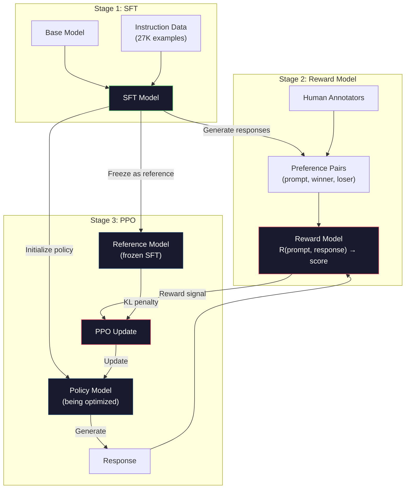
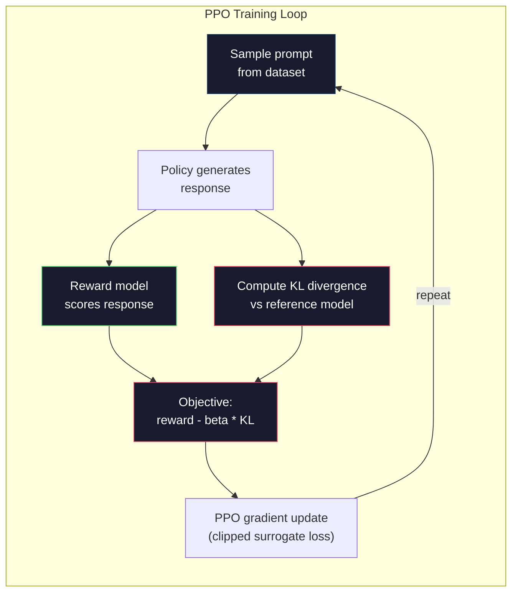

<!-- i18n:manual -->
# RLHF: модель награды + PPO

> SFT учит модель следовать инструкциям. Но он не учит её понимать, какой ответ ЛУЧШЕ. Два ответа могут быть одинаково грамотными и одинаково правдивыми — и при этом отличаться по полезности как небо и земля. RLHF — это способ зашить человеческое суждение в поведение модели. Именно он делает Claude полезным, а GPT вежливым.

**Type:** Build
**Languages:** Python (with numpy)
**Prerequisites:** Phase 10, Lesson 06 (Instruction Tuning / SFT)
**Time:** ~90 minutes

## Learning Objectives

- Построить модель награды, которая оценивает качество ответа, обучившись на человеческих парах предпочтений (chosen против rejected)
- Реализовать цикл обучения PPO, который оптимизирует политику языковой модели против модели награды с KL-штрафом
- Объяснить, почему RLHF требует трёх моделей (SFT, награда, политика) и как KL-ограничение предотвращает взлом награды
- Оценить эффект RLHF, сравнив качество ответов до и после оптимизации по предпочтениям

## The Problem

Спросите у модели «Explain quantum computing» — и она может выдать вот такое:

**Response A:** «Квантовые вычисления используют кубиты, которые могут находиться в суперпозиции: быть 0, 1 или тем и другим одновременно. Это позволяет квантовым компьютерам выполнять некоторые вычисления экспоненциально быстрее классических. Ключевые алгоритмы — алгоритм Шора для факторизации больших чисел и алгоритм Гровера для поиска в неупорядоченных базах данных.»

**Response B:** «Квантовые вычисления — это вид вычислений, использующий квантовомеханические явления. Впервые их предложили в 1980-х. Ричард Фейнман предположил, что квантовые системы можно моделировать квантовыми компьютерами. С тех пор область сильно выросла. Сейчас над квантовыми компьютерами работает много компаний. IBM, Google и другие добились прогресса. О квантовом превосходстве заявила Google в 2019 году.»

Оба ответа фактически верны. Оба грамотно написаны. Оба следуют инструкции. Но Response A явно лучше. Он короче, информативнее и лучше структурирован. Человек выберет A каждый раз.

SFT не умеет ловить эту разницу. Он учит модель на «правильных» ответах, но у него нет механизма сказать «вот этот ответ лучше того». Для него все обучающие примеры одинаково хороши. Если бы и A, и B попали в SFT-датасет, модель училась бы на обоих в равной мере.

RLHF решает эту задачу. Он обучает модель награды предсказывать, какой ответ предпочтёт человек, а потом использует этот сигнал награды, чтобы подтолкнуть языковую модель к более качественным выходам. InstructGPT (предшественник ChatGPT) с помощью RLHF резко улучшил полезность, правдивость и безвредность GPT-3. Внутренние оценщики OpenAI предпочитали ответы InstructGPT ответам GPT-3 в 85% случаев — при том что InstructGPT был в 135 раз меньше (1.3B против 175B параметров).

> 🎒 **На пальцах.** Представьте, что вы просите двух школьников написать сочинение, и оба сдают текст без единой ошибки. Оценить «правильность» тут бесполезно — надо сказать, какое сочинение лучше. Ровно это и произошло выше: и Response A, и Response B верны, но A укладывается в три предложения, а B тратит семь на пересказ истории вопроса. SFT видит два одинаково «правильных» текста, RLHF видит победителя.

## The Concept

### The Three Stages

RLHF — это не один прогон обучения. Это конвейер из трёх последовательных стадий, каждая опирается на предыдущую.

**Stage 1: SFT.** Обучаем базовую модель на парах «инструкция — ответ» (урок 06). На выходе получаем модель, которая умеет следовать инструкциям, но не знает, какие ответы лучше других.

**Stage 2: Reward Model.** Собираем данные человеческих предпочтений: показываем разметчикам два ответа на один и тот же промпт и спрашиваем «какой лучше?». Обучаем модель предсказывать эти предпочтения. Модель награды принимает на вход (промпт, ответ) и выдаёт скалярный балл.

**Stage 3: PPO.** Используем модель награды, чтобы получить обучающий сигнал для языковой модели. Языковая модель генерирует ответы, модель награды их оценивает, а PPO обновляет языковую модель так, чтобы она выдавала ответы с более высоким баллом. KL-штраф не даёт языковой модели уйти слишком далеко от SFT-чекпоинта.



> 🎒 **На пальцах.** Три стадии — это три разные роли, как в кулинарной школе. SFT — ученик, который научился готовить по рецептам. Модель награды — дегустатор, которого натаскали на сравнениях «это блюдо вкуснее того». PPO — сами тренировки: ученик готовит, дегустатор ставит балл, ученик подстраивается. Обратите внимание на схему: SFT-модель используется трижды — как источник модели награды, как стартовая политика и как замороженный референс.

### The Reward Model

Модель награды — это языковая модель, переделанная в оценщика. Берём SFT-модель и заменяем языковую голову (которая выдаёт распределение по словарю) на скалярную голову (которая выдаёт одно число). Архитектура идентична вплоть до последнего слоя.

Вход: промпт, склеенный с ответом. Выход: один скалярный балл награды.

Обучающие данные — человеческие пары предпочтений. Для каждого промпта разметчики видят два ответа и выбирают лучший. Так получаются обучающие тройки: (промпт, preferred_response, rejected_response).

Функция потерь использует модель попарных предпочтений Брэдли-Терри:

```
loss = -log(sigmoid(reward(preferred) - reward(rejected)))
```

Это ключевое уравнение. `sigmoid(reward(A) - reward(B))` даёт вероятность того, что ответ A предпочтут ответу B. Потери толкают модель награды присвоить более высокий балл предпочтённому ответу.

Почему попарные сравнения, а не абсолютные оценки? Потому что люди ужасно ставят абсолютные баллы качества («этот ответ на 7.3 или на 7.5 из 10?»), но отлично справляются с относительными сравнениями («A лучше B?»). Модель Брэдли-Терри превращает относительные сравнения в согласованную абсолютную шкалу.

**InstructGPT numbers:** OpenAI собрала 33 000 пар сравнений силами 40 подрядчиков. Каждое сравнение занимало около 5 минут. Итого 2750 человеко-часов только на обучающие данные для модели награды.

> 🎒 **На пальцах.** Скалярная голова — это буквально один вектор вместо матрицы: в коде ниже `self.reward_head = np.random.randn(embed_dim)`, то есть 128 чисел вместо матрицы 128×256 для словаря. Посчитайте цену данных: 33 000 сравнений × 5 минут = 2750 часов, это полтора года работы одного человека без выходных. Именно поэтому пары дороги и их берегут.

### PPO: Proximal Policy Optimization

PPO — это алгоритм обучения с подкреплением. В RLHF «средой» выступает модель награды, «агентом» — языковая модель, а «действием» — генерация токена.

Целевая функция:

```
maximize: E[R(prompt, response)] - beta * KL(policy || reference)
```

Первое слагаемое толкает модель генерировать ответы с высокой наградой. Второе (KL-штраф) не даёт модели отклониться слишком далеко от SFT-чекпоинта.

Зачем KL-штраф? Без него модель находит вырожденные решения. Модель награды обучена на конечном наборе человеческих предпочтений. У неё есть слепые зоны. Языковая модель эти слепые зоны обязательно найдёт и начнёт эксплуатировать — выдавать тексты, которые получают высокий балл у модели награды, но по сути бессмысленны. Классические примеры:

- Повторять «I'm so helpful and harmless!» — модели награды за полезность и безвредность ставят такому высокий балл
- Выдавать многословные, формально звучащие, но пустые ответы, которые внешне похожи на «высокое качество»
- Эксплуатировать конкретные фразы, которые в обучающих данных случайно коррелировали с высокой наградой

KL-штраф говорит: улучшаться можно, но становиться совсем другой моделью нельзя. Держись рядом с SFT-версией, она уже была вменяемой. Уйдёшь слишком далеко — цена KL перевесит награду.

**InstructGPT numbers:** обучение PPO шло с lr=1.5e-5, коэффициентом KL beta=0.02, 256 тысячами эпизодов (пар «промпт — ответ») и 4 эпохами PPO на батч. Весь пайплайн RLHF занял несколько суток на кластере GPU.



> 🎒 **На пальцах.** Подставьте числа из формулы: пусть модель награды дала 4.0, а KL до референса дорос до 30. При beta=0.02 итог равен 4.0 − 0.02 · 30 = 3.4. А если политика уползла ещё дальше и KL стал 200, останется 4.0 − 4.0 = 0.0 — вся выигранная награда съедена штрафом. Это и есть поводок: близко к референсу он почти не чувствуется, далеко — тянет назад изо всех сил.

### The PPO Objective in Detail

PPO использует «клиппированный суррогат», чтобы не допускать слишком больших обновлений. Отношение вероятностей новой политики к старой обрезается диапазоном [1 - epsilon, 1 + epsilon], где epsilon обычно равен 0.2.

```
ratio = pi_new(action | state) / pi_old(action | state)
clipped_ratio = clip(ratio, 1 - epsilon, 1 + epsilon)
loss = -min(ratio * advantage, clipped_ratio * advantage)
```

Функция преимущества оценивает, насколько текущий ответ лучше ожидаемого качества. В RLHF:

```
advantage = reward(prompt, response) - baseline
```

Базовый уровень (baseline) обычно берут как среднюю награду по недавним ответам. Положительное преимущество означает, что ответ был лучше среднего; отрицательное — что хуже. PPO повышает вероятность ответов выше среднего и понижает вероятность ответов ниже среднего.

Клиппинг предотвращает катастрофические обновления. Если один ответ вдруг получил необычно высокую награду, необрезанное отношение могло бы стать очень большим и резко сдвинуть модель в сторону этого ответа. Клиппинг ограничивает шаг сверху и сохраняет стабильность обучения.

> 🎒 **На пальцах.** При epsilon = 0.2 коридор — это [0.8, 1.2]. Пусть преимущество равно +5, а отношение разогналось до 3.0: необрезанный член даёт 3.0 · 5 = 15, обрезанный — 1.2 · 5 = 6, и `min` выбирает 6. Модель получает шаг «на 20% увереннее», а не «в три раза увереннее» из-за одной удачной генерации. Ровно так один везучий ответ перестаёт разносить всё обучение.

### Reward Hacking

Тёмная сторона RLHF. Языковая модель оптимизируется против модели награды, а та — лишь несовершенный заменитель человеческих предпочтений. Чем лучше языковая модель максимизирует награду, тем активнее она эксплуатирует слабости модели награды.

Типичные режимы отказа:

| Failure | What happens | Why |
|---------|-------------|-----|
| Verbosity | Модель выдаёт всё более длинные ответы | Разметчики часто предпочитали длинные подробные ответы, поэтому модель награды ставит более высокий балл за длину |
| Sycophancy | Модель соглашается со всем, что говорит пользователь | Разметчики предпочитали ответы, которые соглашались с посылкой вопроса |
| Hedging | Модель отказывается давать определённый ответ | Обтекаемые ответы («это сложная тема, у неё много сторон...») почти никогда не помечают как неверные |
| Format gaming | Модель до неприличия увлекается списками и заголовками | Отформатированные ответы выглядели для разметчиков более «вылизанными» |

Способы смягчения: более сильный KL-штраф (не даёт модели уйти достаточно далеко, чтобы эксплуатировать слабости), обучение модели награды на состязательных примерах (латаем известные дыры) и использование нескольких моделей награды с разными архитектурами (взломать все сразу труднее).

> 🎒 **На пальцах.** Все четыре строки таблицы — это один и тот же сюжет: модель выучила не то, что вы хотели, а то, что коррелировало с оценками разметчиков. Проверить легко: логируйте среднюю длину ответа рядом с наградой. Если балл RM пополз с 1.5 до 4.0, а средняя длина — с 200 токенов до 800, вы обучаете не полезность, а болтливость.

### Real RLHF Pipelines

| Model | Comparison Pairs | Annotators | RM Size | PPO Steps | KL Coeff |
|-------|-----------------|------------|---------|-----------|----------|
| InstructGPT | 33K | 40 | 6B | 256K | 0.02 |
| Llama 2 Chat | ~1M | не раскрыто | 70B | не раскрыто | 0.01 |
| Claude | не раскрыто | не раскрыто | не раскрыто | не раскрыто | не раскрыто |
| Anthropic RLHF paper | 22K | 20 | 52B | 50K | 0.001 |

Статья Anthropic 2022 года описывает модель награды на 52B параметров, обученную на 22 000 сравнений. Более крупные модели награды дают более надёжный сигнал, а от этого стабильнее идёт обучение PPO. Обучать большую языковую модель маленькой моделью награды рискованно — у неё просто не хватает ёмкости, чтобы уловить нюансы «хороший ответ против плохого».

```figure
rlhf-pipeline
```

> 🎒 **На пальцах.** Сравните первую и последнюю строки таблицы: у Anthropic пар меньше (22K против 33K), а модель награды почти в девять раз больше (52B против 6B) — и KL-коэффициент в двадцать раз меньше (0.001 против 0.02). Логика простая: чем умнее модель награды, тем меньше в ней дыр, тем длиннее можно отпустить поводок. Слабую RM приходится компенсировать жёстким KL.

## Build It

### Step 1: Synthetic Preference Data

В продакшене данные предпочтений создают живые разметчики. Мы соберём синтетические пары, где «предпочтённый» ответ объективно лучше (короче, точнее, полезнее).

```python
import numpy as np

PREFERENCE_DATA = [
    {
        "prompt": "What is the capital of France?",
        "preferred": "The capital of France is Paris.",
        "rejected": "France is a country in Europe. It has many cities. The capital is Paris. Paris is known for the Eiffel Tower.",
    },
    {
        "prompt": "Explain gravity in one sentence.",
        "preferred": "Gravity is the force that attracts objects with mass toward each other.",
        "rejected": "Gravity is something that makes things fall down when you drop them.",
    },
    {
        "prompt": "What is 15 times 7?",
        "preferred": "15 times 7 is 105.",
        "rejected": "Let me think about this. 15 times 7. Well, 10 times 7 is 70, and 5 times 7 is 35, so the answer might be around 105.",
    },
    {
        "prompt": "Name three programming languages.",
        "preferred": "Python, Rust, and TypeScript.",
        "rejected": "There are many programming languages. Some popular ones include various languages like Python and others.",
    },
    {
        "prompt": "What year did World War II end?",
        "preferred": "World War II ended in 1945.",
        "rejected": "World War II was a major global conflict. It involved many countries. The war ended in the mid-1940s, specifically in 1945.",
    },
    {
        "prompt": "Define machine learning.",
        "preferred": "Machine learning is a field where algorithms learn patterns from data to make predictions without being explicitly programmed.",
        "rejected": "Machine learning is a type of AI. AI stands for artificial intelligence. Machine learning uses data to learn.",
    },
]
```

Предпочтённые ответы короткие и по делу. Отвергнутые демонстрируют типичные режимы отказа: лишний наполнитель, обтекаемость, повтор одного и того же и неточность. Это ровно та разница, которую SFT поймать не может, а RLHF может.

> 🎒 **На пальцах.** Возьмите вторую пару: на «Explain gravity in one sentence» предпочтённый ответ говорит про силу притяжения между массами, а отвергнутый — «что-то, из-за чего вещи падают». Оба не врут, но второй бесполезен для того, кто спросил. И заметьте: отвергнутый ответ на вопрос про 15 × 7 даёт правильные 105 — просто перед этим он вслух размышляет три строки. Наказываем не за ошибку, а за форму.

### Step 2: Reward Model Architecture

Модель награды переиспользует архитектуру трансформера из мини-GPT, но меняет выходную голову размером со словарь на одну скалярную проекцию.

```python
import sys
import os
sys.path.insert(0, os.path.join(os.path.dirname(__file__), "..", "..", "04-pre-training-mini-gpt", "code"))
from main import MiniGPT, LayerNorm, Embedding, TransformerBlock


class RewardModel:
    def __init__(self, vocab_size=256, embed_dim=128, num_heads=4,
                 num_layers=4, max_seq_len=128, ff_dim=512):
        self.embedding = Embedding(vocab_size, embed_dim, max_seq_len)
        self.blocks = [
            TransformerBlock(embed_dim, num_heads, ff_dim)
            for _ in range(num_layers)
        ]
        self.ln_f = LayerNorm(embed_dim)
        self.reward_head = np.random.randn(embed_dim) * 0.02

    def forward(self, token_ids):
        seq_len = token_ids.shape[-1]
        mask = np.triu(np.full((seq_len, seq_len), -1e9), k=1)

        x = self.embedding.forward(token_ids)
        for block in self.blocks:
            x = block.forward(x, mask)
        x = self.ln_f.forward(x)

        last_hidden = x[:, -1, :]
        reward = last_hidden @ self.reward_head

        return reward
```

Модель награды берёт скрытое состояние на *последней* позиции токена и проецирует его в скаляр. Почему последний токен? Потому что из-за причинной маски внимания именно последняя позиция «видела» все предыдущие токены. У неё самое полное представление всей последовательности (промпт, ответ).

> 🎒 **На пальцах.** Смотрите на две строки: `last_hidden = x[:, -1, :]` берёт вектор длиной 128 с самой последней позиции, а `last_hidden @ self.reward_head` схлопывает его в одно число скалярным произведением. Вся оценка ответа длиной в сотню токенов сводится к 128 умножениям. Первый токен так использовать нельзя: он из-за причинной маски не видел вообще ничего, кроме себя.

### Step 3: Bradley-Terry Loss

Обучаем модель награды на парах предпочтений попарными потерями Брэдли-Терри.

```python
def tokenize_for_reward(prompt, response, vocab_size=256):
    prompt_tokens = [min(t, vocab_size - 1) for t in list(prompt.encode("utf-8"))]
    response_tokens = [min(t, vocab_size - 1) for t in list(response.encode("utf-8"))]
    return prompt_tokens + [0] + response_tokens


def sigmoid(x):
    return np.where(
        x >= 0,
        1.0 / (1.0 + np.exp(-x)),
        np.exp(x) / (1.0 + np.exp(x))
    )


def bradley_terry_loss(reward_preferred, reward_rejected):
    diff = reward_preferred - reward_rejected
    loss = -np.log(sigmoid(diff) + 1e-8)
    return loss


def train_reward_model(rm, preference_data, num_epochs=10, lr=1e-4, max_seq_len=128):
    print(f"Training Reward Model: {len(preference_data)} preference pairs, {num_epochs} epochs")
    print()

    losses = []
    accuracies = []

    for epoch in range(num_epochs):
        epoch_loss = 0.0
        epoch_correct = 0
        num_pairs = 0

        indices = np.random.permutation(len(preference_data))

        for idx in indices:
            pair = preference_data[idx]

            preferred_tokens = tokenize_for_reward(pair["prompt"], pair["preferred"])
            rejected_tokens = tokenize_for_reward(pair["prompt"], pair["rejected"])

            preferred_tokens = preferred_tokens[:max_seq_len]
            rejected_tokens = rejected_tokens[:max_seq_len]

            preferred_ids = np.array(preferred_tokens).reshape(1, -1)
            rejected_ids = np.array(rejected_tokens).reshape(1, -1)

            r_preferred = rm.forward(preferred_ids)[0]
            r_rejected = rm.forward(rejected_ids)[0]

            loss = bradley_terry_loss(r_preferred, r_rejected)

            if r_preferred > r_rejected:
                epoch_correct += 1

            diff = r_preferred - r_rejected
            grad = sigmoid(diff) - 1.0

            rm.reward_head -= lr * grad * rm.ln_f.forward(
                rm.embedding.forward(preferred_ids)
            )[:, -1, :].flatten()

            epoch_loss += loss
            num_pairs += 1

        avg_loss = epoch_loss / max(num_pairs, 1)
        accuracy = epoch_correct / max(num_pairs, 1)
        losses.append(avg_loss)
        accuracies.append(accuracy)

        if epoch % 2 == 0:
            print(f"  Epoch {epoch + 1:3d} | Loss: {avg_loss:.4f} | Accuracy: {accuracy:.1%}")

    return rm, losses, accuracies
```

Метрика точности здесь прямолинейная: какую долю пар предпочтений модель награды ранжирует правильно? Случайная модель даст 50%. Хорошо обученная модель на чистых данных должна перевалить за 70%. Модель награды InstructGPT достигла примерно 72% точности на отложенных сравнениях — звучит невысоко, но на деле это хороший результат: многие пары предпочтений неоднозначны даже для людей (согласие между разметчиками было около 73%).

> 🎒 **На пальцах.** Разберём градиент из кода. `grad = sigmoid(diff) - 1.0`: если модель уже уверенно права и `diff` большой, `sigmoid` близка к 1, градиент близок к нулю — шага почти нет. Если модель ошиблась и `diff` отрицательный, `sigmoid` близка к 0, градиент около −1 — шаг максимальный. Обучение само тратит силы только на те пары, где оно ещё путается.

### Step 4: Simplified PPO Loop

Полноценный PPO сложен. Эта реализация схватывает суть механизма: сгенерировать ответы, оценить их, посчитать преимущество и обновить политику с KL-штрафом.

```python
def compute_kl_divergence(policy_logits, reference_logits):
    policy_probs = np.exp(policy_logits - policy_logits.max(axis=-1, keepdims=True))
    policy_probs = policy_probs / policy_probs.sum(axis=-1, keepdims=True)
    policy_probs = np.clip(policy_probs, 1e-10, 1.0)

    ref_probs = np.exp(reference_logits - reference_logits.max(axis=-1, keepdims=True))
    ref_probs = ref_probs / ref_probs.sum(axis=-1, keepdims=True)
    ref_probs = np.clip(ref_probs, 1e-10, 1.0)

    kl = np.sum(policy_probs * np.log(policy_probs / ref_probs), axis=-1)
    return kl.mean()


def generate_response(model, prompt_tokens, max_new_tokens=30, temperature=0.8, max_seq_len=128):
    tokens = list(prompt_tokens)

    for _ in range(max_new_tokens):
        context = np.array(tokens[-max_seq_len:]).reshape(1, -1)
        logits = model.forward(context)
        next_logits = logits[0, -1, :]

        next_logits = next_logits / max(temperature, 1e-8)
        probs = np.exp(next_logits - next_logits.max())
        probs = probs / probs.sum()
        probs = np.clip(probs, 1e-10, 1.0)
        probs = probs / probs.sum()

        next_token = np.random.choice(len(probs), p=probs)
        tokens.append(int(next_token))

    return tokens


def copy_model_weights(source, target):
    target.embedding.token_embed = source.embedding.token_embed.copy()
    target.embedding.pos_embed = source.embedding.pos_embed.copy()
    target.ln_f.gamma = source.ln_f.gamma.copy()
    target.ln_f.beta = source.ln_f.beta.copy()
    for s_block, t_block in zip(source.blocks, target.blocks):
        t_block.attn.W_q = s_block.attn.W_q.copy()
        t_block.attn.W_k = s_block.attn.W_k.copy()
        t_block.attn.W_v = s_block.attn.W_v.copy()
        t_block.attn.W_out = s_block.attn.W_out.copy()
        t_block.ffn.W1 = s_block.ffn.W1.copy()
        t_block.ffn.W2 = s_block.ffn.W2.copy()
        t_block.ffn.b1 = s_block.ffn.b1.copy()
        t_block.ffn.b2 = s_block.ffn.b2.copy()
        t_block.ln1.gamma = s_block.ln1.gamma.copy()
        t_block.ln1.beta = s_block.ln1.beta.copy()
        t_block.ln2.gamma = s_block.ln2.gamma.copy()
        t_block.ln2.beta = s_block.ln2.beta.copy()


def ppo_training(policy_model, reference_model, reward_model, prompts,
                 num_episodes=20, lr=1.5e-5, kl_coeff=0.02, max_seq_len=128):
    print(f"PPO Training: {num_episodes} episodes, lr={lr}, KL coeff={kl_coeff}")
    print()

    rewards_history = []
    kl_history = []

    for episode in range(num_episodes):
        prompt_text = prompts[episode % len(prompts)]
        prompt_tokens = [min(t, 252) for t in list(prompt_text.encode("utf-8"))]

        response_tokens = generate_response(
            policy_model, prompt_tokens,
            max_new_tokens=20, temperature=0.8, max_seq_len=max_seq_len
        )

        response_ids = np.array(response_tokens[:max_seq_len]).reshape(1, -1)
        reward = reward_model.forward(response_ids)[0]

        policy_logits = policy_model.forward(response_ids)
        ref_logits = reference_model.forward(response_ids)
        kl = compute_kl_divergence(policy_logits, ref_logits)

        total_reward = reward - kl_coeff * kl

        rewards_history.append(float(reward))
        kl_history.append(float(kl))

        for block in policy_model.blocks:
            update_scale = lr * total_reward
            block.ffn.W1 += update_scale * np.random.randn(*block.ffn.W1.shape) * 0.01
            block.ffn.W2 += update_scale * np.random.randn(*block.ffn.W2.shape) * 0.01

        if episode % 5 == 0:
            avg_reward = np.mean(rewards_history[-5:]) if rewards_history else 0
            avg_kl = np.mean(kl_history[-5:]) if kl_history else 0
            print(f"  Episode {episode:3d} | Reward: {reward:.4f} | KL: {kl:.4f} | "
                  f"Avg Reward: {avg_reward:.4f}")

    return policy_model, rewards_history, kl_history
```

Основной цикл: (1) берём промпт, (2) генерируем ответ, (3) оцениваем его моделью награды, (4) считаем KL-дивергенцию относительно замороженного референса, (5) считаем скорректированную награду (награда минус KL-штраф), (6) обновляем политику. KL-штраф растёт по мере того, как политика расходится с референсом, и автоматически мешает взлому награды.

> 🎒 **На пальцах.** Ключевая строка — `total_reward = reward - kl_coeff * kl`, и это буквально формула из раздела Concept, записанная кодом. Референсная модель тут — та же самая архитектура, но её веса никто не трогает: в цикле обновления `for block in policy_model.blocks` фигурирует только `policy_model`. Именно поэтому копий SFT-модели нужно две — одну учим, вторую держим неподвижной как линейку.

### Step 5: Reward Score Comparison

После RLHF ответы модели-политики должны получать у модели награды более высокий балл, чем ответы исходной SFT-модели.

```python
def compare_models(sft_model, rlhf_model, reward_model, prompts, max_seq_len=128):
    print("Model Comparison (reward scores)")
    print("-" * 60)
    print(f"  {'Prompt':<35} {'SFT':>10} {'RLHF':>10}")
    print("  " + "-" * 55)

    sft_total = 0.0
    rlhf_total = 0.0

    for prompt in prompts:
        prompt_tokens = [min(t, 252) for t in list(prompt.encode("utf-8"))]

        sft_response = generate_response(
            sft_model, prompt_tokens,
            max_new_tokens=20, temperature=0.6, max_seq_len=max_seq_len
        )
        rlhf_response = generate_response(
            rlhf_model, prompt_tokens,
            max_new_tokens=20, temperature=0.6, max_seq_len=max_seq_len
        )

        sft_ids = np.array(sft_response[:max_seq_len]).reshape(1, -1)
        rlhf_ids = np.array(rlhf_response[:max_seq_len]).reshape(1, -1)

        sft_reward = reward_model.forward(sft_ids)[0]
        rlhf_reward = reward_model.forward(rlhf_ids)[0]

        sft_total += sft_reward
        rlhf_total += rlhf_reward

        truncated_prompt = prompt[:33] + ".." if len(prompt) > 35 else prompt
        print(f"  {truncated_prompt:<35} {sft_reward:>10.4f} {rlhf_reward:>10.4f}")

    n = len(prompts)
    print("  " + "-" * 55)
    print(f"  {'Average':<35} {sft_total/n:>10.4f} {rlhf_total/n:>10.4f}")

    return sft_total / n, rlhf_total / n
```

> 🎒 **На пальцах.** Обратите внимание на `temperature=0.6` в сравнении против `0.8` в обучении: на замере мы хотим более предсказуемую генерацию, чтобы разница в баллах шла от весов, а не от случайности сэмплирования. И сравниваем обе модели на одном и том же промпте — иначе числа в колонках SFT и RLHF просто не о чем.

## Use It

### Full RLHF Pipeline Demo

```python
if __name__ == "__main__":
    np.random.seed(42)

    print("=" * 70)
    print("RLHF PIPELINE: REWARD MODEL + PPO")
    print("=" * 70)
    print()

    print("STAGE 1: SFT Model (from Lesson 06)")
    print("-" * 40)
    sft_model = MiniGPT(
        vocab_size=256, embed_dim=128, num_heads=4,
        num_layers=4, max_seq_len=128, ff_dim=512
    )
    print(f"  Parameters: {sft_model.count_parameters():,}")
    print()

    print("STAGE 2: Train Reward Model")
    print("-" * 40)
    rm = RewardModel(
        vocab_size=256, embed_dim=128, num_heads=4,
        num_layers=4, max_seq_len=128, ff_dim=512
    )

    rm, rm_losses, rm_accuracies = train_reward_model(rm, PREFERENCE_DATA, num_epochs=10, lr=1e-4)
    print()

    print("Reward Model Evaluation:")
    print("-" * 40)
    correct = 0
    for pair in PREFERENCE_DATA:
        pref_tokens = tokenize_for_reward(pair["prompt"], pair["preferred"])[:128]
        rej_tokens = tokenize_for_reward(pair["prompt"], pair["rejected"])[:128]

        r_pref = rm.forward(np.array(pref_tokens).reshape(1, -1))[0]
        r_rej = rm.forward(np.array(rej_tokens).reshape(1, -1))[0]

        if r_pref > r_rej:
            correct += 1
        print(f"  Preferred: {r_pref:+.4f} | Rejected: {r_rej:+.4f} | {'Correct' if r_pref > r_rej else 'Wrong'}")

    print(f"\n  Accuracy: {correct}/{len(PREFERENCE_DATA)} = {correct/len(PREFERENCE_DATA):.1%}")
    print()

    print("STAGE 3: PPO Training")
    print("-" * 40)

    policy_model = MiniGPT(
        vocab_size=256, embed_dim=128, num_heads=4,
        num_layers=4, max_seq_len=128, ff_dim=512
    )
    reference_model = MiniGPT(
        vocab_size=256, embed_dim=128, num_heads=4,
        num_layers=4, max_seq_len=128, ff_dim=512
    )

    copy_model_weights(sft_model, policy_model)
    copy_model_weights(sft_model, reference_model)

    train_prompts = [pair["prompt"] for pair in PREFERENCE_DATA]

    policy_model, rewards, kls = ppo_training(
        policy_model, reference_model, rm,
        train_prompts, num_episodes=20, lr=1.5e-5, kl_coeff=0.02
    )
    print()

    print("=" * 70)
    print("COMPARISON: SFT vs RLHF")
    print("=" * 70)
    print()

    eval_prompts = [
        "What is the capital of France?",
        "Explain gravity.",
        "Name three programming languages.",
    ]

    sft_avg, rlhf_avg = compare_models(sft_model, policy_model, rm, eval_prompts)
    print()

    print("=" * 70)
    print("KL DIVERGENCE ANALYSIS")
    print("=" * 70)
    print()

    if kls:
        print(f"  Initial KL: {kls[0]:.4f}")
        print(f"  Final KL:   {kls[-1]:.4f}")
        print(f"  Max KL:     {max(kls):.4f}")
        kl_threshold = 0.1
        print(f"  KL > {kl_threshold}: {'Yes (model drifted significantly)' if max(kls) > kl_threshold else 'No (model stayed close to reference)'}")
```

> 🎒 **На пальцах.** Проследите порядок вызовов: `MiniGPT` создаётся трижды (SFT, политика, референс), а `copy_model_weights` вызывается дважды — политика и референс стартуют из одинаковых весов SFT. В момент запуска KL между ними ровно 0, и растёт он только за счёт обновлений политики. Финальная проверка `max(kls) > 0.1` — это и есть автоматический детектор «модель уползла».

## Ship It

Этот урок производит `outputs/prompt-reward-model-designer.md` — промпт для проектирования пайплайнов обучения моделей награды. По заданному целевому поведению (полезность, умение писать код, безопасность) он выдаёт протокол сбора данных, инструкции для разметчиков и критерии оценки модели награды.

> 🎒 **На пальцах.** Самая ценная часть такого промпта — инструкции для разметчиков. Модель награды выучит ровно те привычки, которые заложены в инструкцию: напишете «предпочитайте подробные ответы» — получите Verbosity из таблицы выше уже через неделю обучения. Инструкция для разметчиков — это на самом деле исходный код вашей функции награды.

## Exercises

1. Переделайте модель награды так, чтобы она использовала среднее по всем скрытым состояниям вместо только последней позиции. Сравните точность. Усреднение даёт каждому токену равный вес, а вариант с последней позицией опирается на причинное внимание для агрегации информации. Проверьте на 6 парах предпочтений и скажите, у какого подхода точность выше.

2. Реализуйте калибровку модели награды. После обучения прогоните все пары предпочтений через модель награды и посчитайте: (a) среднюю награду предпочтённых ответов, (b) среднюю награду отвергнутых, (c) зазор (предпочтённые минус отвергнутые). У хорошо откалиброванной модели зазор должен быть отчётливым. Затем добавьте 4 новые пары предпочтений и проверьте, сохраняется ли зазор на невиданных данных.

3. Смоделируйте взлом награды. Сделайте модель награды, которая даёт высокий балл длинным ответам (reward = len(response) / 100). Запустите PPO с этой кривой моделью награды и понаблюдайте, как политика генерирует всё более длинные и повторяющиеся тексты. Затем добавьте KL-штраф 0.1 и покажите, что он предотвращает вырожденное поведение.

4. Реализуйте многокритериальную награду. Обучите две модели награды — одну на полезность, другую на краткость. Скомбинируйте их как R = 0.7 * R_helpful + 0.3 * R_concise. Покажите, что совмещённая цель даёт ответы одновременно полезные и короткие, обходя ловушку многословия, в которую попадает одна только награда за полезность.

5. Сравните разные коэффициенты KL. Прогоните PPO с beta=0.001 (слишком мало, взлом награды), beta=0.02 (стандарт) и beta=0.5 (слишком много, обучения нет). Постройте для каждого прогона график награды и график KL. Прогон с beta=0.02 должен показать устойчивый рост награды при ограниченном KL.

> 🎒 **На пальцах.** Задание 3 — самое наглядное во всём уроке, начните с него. Награда `len(response) / 100` означает, что ответ на 800 токенов получает балл 8.0, а на 200 — всего 2.0, поэтому политика буквально за десяток эпизодов научится лить воду. Дальше включите KL-штраф 0.1 и посмотрите, как та же самая модель награды перестаёт работать наживкой: штраф за уход от референса растёт быстрее, чем награда за лишние токены.

## Key Terms

| Term | What people say | What it actually means |
|------|----------------|----------------------|
| RLHF | «Обучение на человеческой обратной связи» | Reinforcement Learning from Human Feedback: конвейер из трёх стадий (SFT, модель награды, PPO), который оптимизирует выходы языковой модели по сигналу человеческих предпочтений |
| Reward model | «Модель, которая ставит баллы ответам» | Трансформер со скалярной выходной головой, обученный на попарных человеческих предпочтениях функцией потерь Брэдли-Терри |
| Bradley-Terry | «Модель сравнений» | Вероятностная модель, где P(A > B) = sigmoid(score(A) - score(B)); превращает попарные предпочтения в согласованную функцию оценки |
| PPO | «Тот самый RL-алгоритм» | Proximal Policy Optimization: обновляет политику ради максимума награды, обрезая величину шага, чтобы не потерять устойчивость |
| KL divergence | «Насколько два распределения различаются» | Мера различия между распределением токенов у политики и у референсной модели — используется как штраф против взлома награды |
| KL penalty | «Поводок для модели» | Beta * KL(policy \|\| reference), вычитаемое из сигнала награды — не даёт политике уйти слишком далеко от SFT-чекпоинта |
| Reward hacking | «Игра против награды» | Когда политика находит вырожденные ответы с высоким баллом, эксплуатируя слабости модели награды вместо того, чтобы реально становиться лучше |
| Preference pair | «Что лучше, A или B?» | Обучающий пример вида (промпт, preferred_response, rejected_response) — базовая единица обучающих данных RLHF |
| Reference model | «Замороженный SFT-чекпоинт» | Копия SFT-модели, веса которой никогда не меняются — якорь для расчёта KL-дивергенции |

## Further Reading

- [Ouyang et al., 2022 -- "Training language models to follow instructions with human feedback" (InstructGPT)](https://arxiv.org/abs/2203.02155) — статья, которая сделала RLHF практичным для больших языковых моделей
- [Schulman et al., 2017 -- "Proximal Policy Optimization Algorithms"](https://arxiv.org/abs/1707.06347) — оригинальная статья про PPO от OpenAI
- [Bai et al., 2022 -- "Training a Helpful and Harmless Assistant with Reinforcement Learning from Human Feedback"](https://arxiv.org/abs/2204.05862) — статья Anthropic про RLHF с подробным разбором взлома награды и KL-штрафа
- [Stiennon et al., 2020 -- "Learning to summarize with human feedback"](https://arxiv.org/abs/2009.01325) — RLHF в задаче суммаризации; показывает, что модели награды улавливают тонкие суждения о качестве
- [Christiano et al., 2017 -- "Deep reinforcement learning from human preferences"](https://arxiv.org/abs/1706.03741) — основополагающая работа про обучение функций награды из человеческих сравнений

