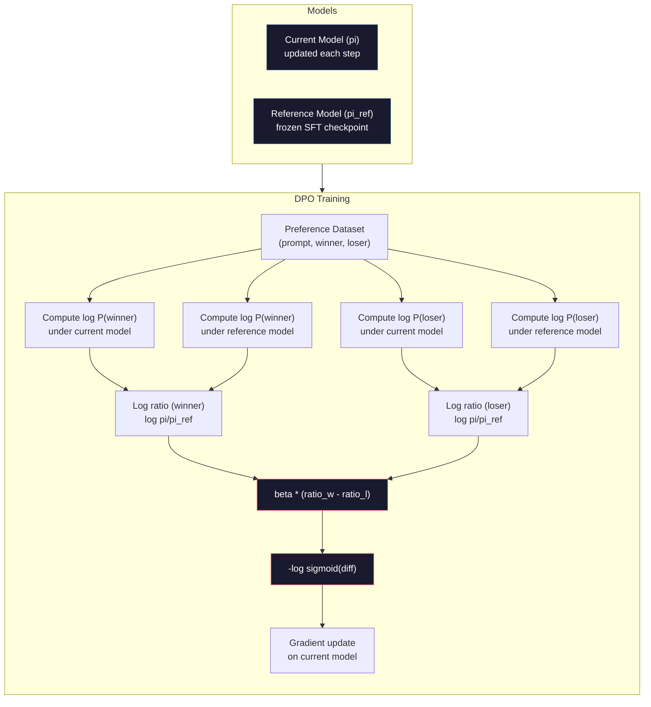

<!-- i18n:manual -->
# DPO: прямая оптимизация предпочтений

> RLHF работает. Но он требует обучить три модели (SFT, модель награды, политику), справиться с нестабильностью PPO и подобрать KL-штраф. DPO спрашивает: а что если всё это пропустить? DPO оптимизирует языковую модель прямо на парах предпочтений. Ни модели награды. Ни PPO. Один цикл обучения. Тот же результат.

**Type:** Build
**Languages:** Python (with numpy)
**Prerequisites:** Phase 10, Lesson 07 (RLHF)
**Time:** ~90 minutes

## Learning Objectives

- Реализовать обучение DPO, которое оптимизирует языковую модель прямо на парах предпочтений без отдельной модели награды
- Вывести функцию потерь DPO и объяснить, как она неявно задаёт модель награды через логарифмы вероятностей политики
- Сравнить DPO и RLHF по стабильности обучения, стоимости вычислений и количеству нужных моделей
- Настроить параметр beta, который управляет тем, насколько далеко обученная политика уходит от reference-модели

## The Problem

В уроке 07 вы собрали пайплайн RLHF. Три этапа. Три модели. SFT-модель, модель награды и политика, оптимизированная через PPO. Одна только модель награды потребовала тысячи человеческих пар предпочтений и отдельный цикл обучения. PPO потребовал аккуратной настройки KL-коэффициента, скорости обучения, clip-отношения и числа эпох.

На практике обучение PPO знаменито своей нестабильностью. Маленькое изменение гиперпараметров — и обучение расходится. Модель награды — несовершенный заменитель человеческих предпочтений, и политика находит способы эксплуатировать её слабости. KL-штраф помогает, но требует собственной настройки: слишком маленький — получаете взлом награды, слишком большой — модель почти не учится.

Именно из-за этой сложности открытые модели годами мучились с RLHF после публикации InstructGPT. Трёхэтапный пайплайн хрупкий. У каждого этапа свои режимы отказа, и ошибки накапливаются.

В мае 2023 года Рафаэль Рафаилов, Арчит Шарма и коллеги из Стэнфорда опубликовали работу «Direct Preference Optimization: Your Language Model is Secretly a Reward Model». Ключевая идея: отдельная модель награды не нужна. Оптимальная функция награды математически определяется собственными вероятностями токенов языковой модели. Модель награды можно выбросить целиком и оптимизировать языковую модель напрямую на парах предпочтений.

DPO сводит RLHF к одному шагу обычного обучения с учителем. Одна модель. Одна функция потерь. Один цикл обучения. Никакого обучения с подкреплением. Zephyr-7B, одна из первых моделей, где DPO применили в масштабе, сравнялась или обошла модели с полным RLHF на нескольких бенчмарках. Meta использовала DPO как часть пайплайна выравнивания Llama 3. Anthropic упоминала методы в духе DPO в своих исследованиях по выравниванию.

> 🎒 **На пальцах.** RLHF — это когда вы нанимаете отдельного дегустатора (модель награды), учите его на людских оценках, а потом повар готовит под его вкус. DPO говорит: дегустатор не нужен, повар и так знает разницу — просто покажите ему две тарелки и скажите, какая лучше. Экономия огромная: три цикла обучения превращаются в два, а три-четыре модели в памяти — в две.

## The Concept

### The Key Insight

RLHF оптимизирует такую целевую функцию:

```
maximize: E[R(x, y)] - beta * KL(pi || pi_ref)
```

где R — модель награды, pi — политика, pi_ref — reference-модель, а beta — KL-коэффициент.

Статья про DPO показала, что у этой задачи есть решение в замкнутой форме. Для любой функции награды R оптимальная политика равна:

```
pi*(y | x) = pi_ref(y | x) * exp(R(x, y) / beta) / Z(x)
```

где Z(x) — нормировочная константа. Переставим члены:

```
R(x, y) = beta * log(pi*(y | x) / pi_ref(y | x)) + beta * log Z(x)
```

Вот в этом и прорыв. Награда выражена целиком через вероятности модели-политики и вероятности reference-модели. Отдельную модель награды обучать не нужно. Награда *неявно* сидит в отношении вероятностей.

Подставим это в модель предпочтений Брэдли-Терри:

```
P(y_w > y_l | x) = sigmoid(R(x, y_w) - R(x, y_l))
                  = sigmoid(beta * (log pi(y_w|x)/pi_ref(y_w|x) - log pi(y_l|x)/pi_ref(y_l|x)))
```

Члены Z(x) сокращаются, потому что оба ответа обусловлены одним и тем же промптом x. Остаётся функция только от логарифмов вероятностей модели-политики и reference-модели на предпочитаемом и отвергнутом ответах.

> 🎒 **На пальцах.** Вся магия — в сокращении Z(x). Нормировочная константа зависит только от промпта, а промпт у обоих ответов один и тот же, поэтому при вычитании R(x, y_w) − R(x, y_l) она исчезает. Именно поэтому DPO работает с *парами*: одиночному ответу нужна была бы Z(x), а её никто посчитать не может.

### The DPO Loss

```
L_DPO = -log(sigmoid(beta * (log pi(y_w|x)/pi_ref(y_w|x) - log pi(y_l|x)/pi_ref(y_l|x))))
```

Разберём по частям:

- **y_w** = предпочитаемый (победивший) ответ
- **y_l** = отвергнутый (проигравший) ответ
- **x** = промпт
- **pi** = текущая модель (та, которую обучаем)
- **pi_ref** = reference-модель (замороженный SFT-чекпоинт)
- **beta** = температурный параметр, задающий допустимое отклонение от референса (обычно от 0.1 до 0.5)

Отношение `log pi(y|x) / pi_ref(y|x)` — это логарифм отношения вероятностей. Когда оно положительное, текущая модель даёт ответу y большую вероятность, чем референс. Когда отрицательное — меньшую.

Функция потерь DPO толкает модель повышать логарифм отношения вероятностей для предпочитаемых ответов и понижать для отвергнутых. Параметр beta задаёт, насколько агрессивно модели разрешено уходить от референса: маленькая beta — большие отклонения допустимы, большая beta — модель держится рядом с референсом.

> 🎒 **На пальцах.** Представьте два ползунка: один для хорошего ответа, другой для плохого. Потери говорят «разведи их подальше». Пусть отношение для хорошего ответа выросло до +2.0, для плохого упало до −1.0, а beta = 0.1. Тогда logit = 0.1 · (2.0 − (−1.0)) = 0.3, sigmoid(0.3) ≈ 0.57, потери = −log(0.57) ≈ 0.56. Разведите ползунки до +10 и −10 — logit станет 2.0, а потери упадут до 0.13.



### Why DPO is Simpler

| Aspect | RLHF (PPO) | DPO |
|--------|-----------|-----|
| Models to train | 3 (SFT + модель награды + политика) | 1 (только политика) |
| Training loops | 3 (SFT, обучение RM, PPO) | 2 (SFT, DPO) |
| Hyperparameters | lr, KL-коэффициент, clip-отношение, lr для RM, эпохи ×3 | lr, beta, эпохи |
| Reward model | Обязательна (отдельное обучение) | Неявно сидит в вероятностях модели |
| RL algorithm | PPO (сложный, нестабильный) | Обучение с учителем (стабильное) |
| GPU memory | 3-4 модели в памяти во время PPO | 2 модели (текущая + референс) |
| Training stability | Чувствительна к гиперпараметрам | Устойчиво, примерно как SFT |

DPO держит в памяти во время обучения две модели — текущую и замороженный референс. RLHF нужны три или четыре: политика, референс, модель награды и опционально базовая линия в виде функции ценности. Для модели на 70B каждая копия занимает 140 ГБ в FP16. Экономия памяти от выброшенной модели награды получается существенная.

> 🎒 **На пальцах.** Посчитайте по строке GPU memory: 70B в FP16 — это 140 ГБ на копию. RLHF с четырьмя копиями = 560 ГБ, то есть семь карт H100 по 80 ГБ только под веса. DPO с двумя копиями = 280 ГБ, то есть четыре карты. Одно решение убрать модель награды экономит вам половину кластера.

### When DPO Beats RLHF

**Small datasets.** На 5 000-20 000 пар предпочтений DPO часто не уступает RLHF или обходит его. Модели награды в RLHF нужно достаточно данных, чтобы обобщать: на маленькой выборке она переобучается и выдаёт ненадёжный сигнал награды. DPO обходит эту проблему тем, что модель награды ему вообще не нужна.

**Limited compute.** DPO требует примерно треть вычислений полного RLHF (один цикл обучения вместо трёх). Для команд без больших GPU-кластеров это практичный выбор.

**Rapid iteration.** Хотите попробовать 10 разных датасетов предпочтений и посмотреть, какой даёт лучшую модель? С DPO каждый эксперимент занимает часы. RLHF требует переобучать модель награды под каждый датасет.

### When RLHF Beats DPO

**Large-scale training.** На масштабе GPT-4 или Claude отдельная модель награды в RLHF способна уловить более тонкие сигналы предпочтений. Модель награды работает как выученная функция потерь, подстраивающаяся под сложные критерии качества.

**Complex reward signals.** Когда «лучше» складывается из нескольких измерений (полезность, безвредность, честность), модель награды может выучить этот многокритериальный компромисс. DPO же трактует каждую пару предпочтений как бинарный сигнал — один ответ лучше, другой хуже — не моделируя, почему.

**Iterative alignment.** Пайплайны RLHF умеют генерировать новые ответы текущей политикой, отдавать их людям на оценку и переобучать модель награды в онлайн-цикле. DPO работает на фиксированном датасете пар. Constitutional AI (подход Anthropic) активно использует именно это свойство RLHF.

> 🎒 **На пальцах.** Правило простое: мало данных и мало железа — берите DPO, много того и другого — RLHF окупается. На 10 000 пар модель награды видит каждый промпт по разу и запоминает шум; DPO той же выборкой просто двигает вероятности и не создаёт лишнего звена, где шум мог бы усилиться. А вот на миллионах пар модель награды начинает обобщать лучше, чем бинарный сигнал «лучше/хуже».

### Beyond DPO: KTO, ORPO, SimPO

DPO породил целое семейство упрощённых методов выравнивания.

**KTO (Kahneman-Tversky Optimization, 2024):** пары вообще не нужны. KTO работает с непарной обратной связью — достаточно пометить каждый ответ как «хороший» или «плохой», не сравнивая его с альтернативой. Это резко упрощает сбор данных. Вместо того чтобы показывать разметчику два ответа и спрашивать «какой лучше?», вы показываете один и спрашиваете «это хорошо?». Функция потерь применяет неприятие потерь из теории перспектив: плохие ответы штрафуются сильнее, чем поощряются хорошие.

**ORPO (Odds Ratio Preference Optimization, 2024):** объединяет SFT и выравнивание в один шаг обучения. Вместо «сначала SFT, потом DPO» ORPO встраивает сигнал предпочтений прямо в функцию потерь SFT. У потерь два слагаемых: обычное предсказание следующего токена на предпочитаемых ответах плюс член с отношением шансов, который увеличивает разрыв между вероятностями предпочитаемого и отвергнутого ответов. Один цикл обучения вместо двух.

**SimPO (Simple Preference Optimization, 2024):** убирает reference-модель целиком. Вместо логарифмов отношения вероятностей к замороженному референсу SimPO берёт средний логарифм вероятности ответа (нормированный на длину) как неявную награду. Это экономит память (reference-модель не нужна) и упрощает обучение. Нормировка по длине не даёт модели скатиться к предпочтению коротких ответов.

| Method | Year | Models in Memory | Needs Pairs? | Needs Reference? | Training Loops |
|--------|------|-----------------|-------------|-----------------|----------------|
| RLHF | 2022 | 3-4 | Да (для RM) | Да | 3 |
| DPO | 2023 | 2 | Да | Да | 2 |
| KTO | 2024 | 2 | Нет (непарные) | Да | 2 |
| ORPO | 2024 | 1 | Да | Нет | 1 |
| SimPO | 2024 | 1 | Да | Нет | 1 |

Тренд очевиден: каждый следующий метод выбрасывает ещё один кусок сложности. RLHF нужны были модель награды и PPO. DPO убрал оба. KTO убрал парные данные. ORPO убрал отдельный этап SFT. SimPO убрал reference-модель. Налог на выравнивание — стоимость вычислений и сложности при переходе от базовой модели к выровненной — продолжает падать.

> 🎒 **На пальцах.** Прочитайте таблицу как лестницу вниз по колонке Models in Memory: 3-4 → 2 → 2 → 1 → 1. За два года требования к железу упали вчетверо. Для модели на 7B это разница между «нужен сервер с четырьмя картами» и «влезет в одну A100 на 80 ГБ». Именно поэтому SimPO и ORPO так быстро разошлись по опенсорсу.

### Real DPO Deployments

**Zephyr-7B (HuggingFace, October 2023):** база Mistral 7B, SFT на UltraChat (200 тысяч примеров), затем DPO на UltraFeedback (60 тысяч пар предпочтений). Набрала 6.47 на MT-Bench — лучший результат среди 7B-моделей на тот момент. Для сравнения, Llama 2 Chat 70B набрала 6.86, то есть Zephyr подобралась к модели в 10 раз крупнее на расстояние 6%, используя одно только выравнивание через DPO.

**Llama 3 (Meta, April 2024):** DPO применяли после начальных этапов RLHF. Такая комбинация намекает, что DPO и RLHF дополняют друг друга: RLHF для широкого выравнивания, DPO для точечной доводки.

**Neural Magic / nm-chat (2024):** применили DPO к нескольким открытым моделям и стабильно получали улучшение на 5-15% по бенчмаркам выравнивания относительно базовой линии «только SFT».

> 🎒 **На пальцах.** Цифры Zephyr стоит запомнить: 6.47 против 6.86 у модели в десять раз больше. Разрыв всего 0.39 балла, а стоимость инференса отличается на порядок. Вывод не «DPO творит чудеса», а «хорошее выравнивание дешёвой модели часто важнее, чем размер».

```figure
dpo-loss
```

## Build It

### Step 1: Preference Dataset

Формат тот же, что в RLHF — тройки (промпт, предпочитаемый, отвергнутый). DPO потребляет эти данные напрямую, без промежуточной модели награды.

```python
import numpy as np
import sys
import os
sys.path.insert(0, os.path.join(os.path.dirname(__file__), "..", "..", "04-pre-training-mini-gpt", "code"))
from main import MiniGPT, LayerNorm, Embedding, TransformerBlock

PREFERENCE_DATA = [
    {
        "prompt": "What is the capital of France?",
        "preferred": "The capital of France is Paris.",
        "rejected": "France is a country in Europe. It has many cities. The capital is Paris. Paris is known for the Eiffel Tower.",
    },
    {
        "prompt": "Explain gravity in one sentence.",
        "preferred": "Gravity is the force that attracts objects with mass toward each other.",
        "rejected": "Gravity is something that makes things fall down when you drop them.",
    },
    {
        "prompt": "What is 15 times 7?",
        "preferred": "15 times 7 is 105.",
        "rejected": "Let me think about this. 15 times 7. Well, 10 times 7 is 70, and 5 times 7 is 35, so the answer might be around 105.",
    },
    {
        "prompt": "Name three programming languages.",
        "preferred": "Python, Rust, and TypeScript.",
        "rejected": "There are many programming languages. Some popular ones include various languages like Python and others.",
    },
    {
        "prompt": "What year did World War II end?",
        "preferred": "World War II ended in 1945.",
        "rejected": "World War II was a major global conflict. It involved many countries. The war ended in the mid-1940s, specifically in 1945.",
    },
    {
        "prompt": "Define machine learning.",
        "preferred": "Machine learning is a field where algorithms learn patterns from data to make predictions without being explicitly programmed.",
        "rejected": "Machine learning is a type of AI. AI stands for artificial intelligence. Machine learning uses data to learn.",
    },
]
```

> 🎒 **На пальцах.** Заметьте, чем отличаются пары: предпочитаемый ответ «The capital of France is Paris.» — прямой и короткий, отвергнутый растекается на четыре предложения и лишь в третьем доходит до сути. Мы учим не фактам (Париж есть в обоих), а *стилю*: отвечай сразу. Шесть пар — игрушечный масштаб, в Zephyr их было 60 000.

### Step 2: Sequence Log-Probability

Функция потерь DPO требует суммарного логарифма вероятности ответа при данном промпте. То есть надо прогнать модель по всей последовательности (промпт + ответ) и просуммировать логарифмы вероятностей каждого токена ответа.

```python
def tokenize_sequence(text, vocab_size=256):
    return [min(t, vocab_size - 1) for t in list(text.encode("utf-8"))]


def compute_sequence_log_prob(model, prompt_tokens, response_tokens, max_seq_len=128):
    full_sequence = prompt_tokens + response_tokens
    if len(full_sequence) > max_seq_len:
        full_sequence = full_sequence[:max_seq_len]

    if len(full_sequence) < 2:
        return 0.0

    input_ids = np.array(full_sequence[:-1]).reshape(1, -1)
    target_ids = np.array(full_sequence[1:])

    logits = model.forward(input_ids)
    logits = logits[0]

    max_logits = logits.max(axis=-1, keepdims=True)
    log_probs = logits - max_logits - np.log(
        np.exp(logits - max_logits).sum(axis=-1, keepdims=True)
    )

    prompt_len = len(prompt_tokens)
    response_start = max(0, prompt_len - 1)
    response_end = len(target_ids)

    if response_start >= response_end:
        return 0.0

    response_log_probs = log_probs[response_start:response_end, :]
    response_targets = target_ids[response_start:response_end]

    total_log_prob = 0.0
    for i, target in enumerate(response_targets):
        total_log_prob += response_log_probs[i, target]

    return total_log_prob
```

Эта функция — рабочая лошадка DPO. Для каждой пары предпочтений она запускается четыре раза: модель на предпочитаемом ответе, модель на отвергнутом, референс на предпочитаемом, референс на отвергнутом. Итого 4 прямых прохода на обучающий пример против связки «генерация + оценка наградой + оценка ценности + обновление PPO» в RLHF. Проще, быстрее, стабильнее.

> 🎒 **На пальцах.** Логарифм вероятности всей последовательности — это просто сумма логарифмов по токенам, потому что вероятности перемножаются. Если ответ из 10 токенов и каждый имеет вероятность 0.5, то log P = 10 · log(0.5) ≈ −6.93. Отсюда важное следствие: длинные ответы всегда получают более отрицательный логарифм вероятности — именно из-за этого в упражнении 2 появляется нормировка на длину.

### Step 3: The DPO Loss

Сердце статьи в коде. Одна функция. Одни потери. Никакой модели награды.

```python
def sigmoid(x):
    return np.where(
        x >= 0,
        1.0 / (1.0 + np.exp(-x)),
        np.exp(x) / (1.0 + np.exp(x))
    )


def dpo_loss(policy_logprob_preferred, policy_logprob_rejected,
             ref_logprob_preferred, ref_logprob_rejected, beta=0.1):
    preferred_ratio = policy_logprob_preferred - ref_logprob_preferred
    rejected_ratio = policy_logprob_rejected - ref_logprob_rejected

    logit = beta * (preferred_ratio - rejected_ratio)

    loss = -np.log(sigmoid(logit) + 1e-8)

    preferred_reward = beta * preferred_ratio
    rejected_reward = beta * rejected_ratio

    return loss, {
        "preferred_ratio": float(preferred_ratio),
        "rejected_ratio": float(rejected_ratio),
        "logit": float(logit),
        "implicit_preferred_reward": float(preferred_reward),
        "implicit_rejected_reward": float(rejected_reward),
        "reward_margin": float(preferred_reward - rejected_reward),
    }
```

Величины `preferred_ratio` и `rejected_ratio` — это те самые логарифмы отношения вероятностей из вывода DPO. Когда текущая модель даёт предпочитаемому ответу более высокую вероятность (относительно референса), а отвергнутому более низкую, logit положителен и потери малы. Обучающий сигнал толкает модель ровно в этом направлении.

Величины `implicit_preferred_reward` и `implicit_rejected_reward` — это награды, которые функция потерь DPO назначает неявно. Их можно вытащить и проверить, что обучение идёт: разрыв между наградой предпочитаемого и отвергнутого ответов должен расти по ходу обучения.

> 🎒 **На пальцах.** Пройдите по коду с числами. Пусть policy дала предпочитаемому −20.0, референс −22.0, значит `preferred_ratio` = 2.0. Отвергнутому policy дала −30.0, референс −29.0, значит `rejected_ratio` = −1.0. При beta = 0.1: logit = 0.1 · 3.0 = 0.3, потери ≈ 0.56, а `reward_margin` = 0.2 − (−0.1) = 0.3. Именно эту margin вы и хотите видеть растущей на графике.

### Step 4: DPO Training Loop

Обычный цикл обучения с учителем. Ни PPO. Ни модели награды. Только прямые проходы и обновления градиентом.

```python
def copy_model_weights(source, target):
    target.embedding.token_embed = source.embedding.token_embed.copy()
    target.embedding.pos_embed = source.embedding.pos_embed.copy()
    target.ln_f.gamma = source.ln_f.gamma.copy()
    target.ln_f.beta = source.ln_f.beta.copy()
    for s_block, t_block in zip(source.blocks, target.blocks):
        t_block.attn.W_q = s_block.attn.W_q.copy()
        t_block.attn.W_k = s_block.attn.W_k.copy()
        t_block.attn.W_v = s_block.attn.W_v.copy()
        t_block.attn.W_out = s_block.attn.W_out.copy()
        t_block.ffn.W1 = s_block.ffn.W1.copy()
        t_block.ffn.W2 = s_block.ffn.W2.copy()
        t_block.ffn.b1 = s_block.ffn.b1.copy()
        t_block.ffn.b2 = s_block.ffn.b2.copy()
        t_block.ln1.gamma = s_block.ln1.gamma.copy()
        t_block.ln1.beta = s_block.ln1.beta.copy()
        t_block.ln2.gamma = s_block.ln2.gamma.copy()
        t_block.ln2.beta = s_block.ln2.beta.copy()


def dpo_train(policy_model, reference_model, preference_data,
              num_epochs=5, lr=5e-6, beta=0.1, max_seq_len=128):
    print(f"DPO Training: {len(preference_data)} pairs, {num_epochs} epochs, "
          f"lr={lr}, beta={beta}")
    print()

    losses = []
    margins = []

    for epoch in range(num_epochs):
        epoch_loss = 0.0
        epoch_margin = 0.0
        num_examples = 0

        indices = np.random.permutation(len(preference_data))

        for idx in indices:
            pair = preference_data[idx]

            prompt_tokens = tokenize_sequence(pair["prompt"])
            preferred_tokens = tokenize_sequence(pair["preferred"])
            rejected_tokens = tokenize_sequence(pair["rejected"])

            pi_logprob_w = compute_sequence_log_prob(
                policy_model, prompt_tokens, preferred_tokens, max_seq_len
            )
            pi_logprob_l = compute_sequence_log_prob(
                policy_model, prompt_tokens, rejected_tokens, max_seq_len
            )
            ref_logprob_w = compute_sequence_log_prob(
                reference_model, prompt_tokens, preferred_tokens, max_seq_len
            )
            ref_logprob_l = compute_sequence_log_prob(
                reference_model, prompt_tokens, rejected_tokens, max_seq_len
            )

            loss, metrics = dpo_loss(
                pi_logprob_w, pi_logprob_l,
                ref_logprob_w, ref_logprob_l, beta
            )

            update_direction = 1.0 if metrics["logit"] < 0 else -0.1
            for block in policy_model.blocks:
                block.ffn.W1 += lr * update_direction * np.random.randn(*block.ffn.W1.shape) * 0.01
                block.ffn.W2 += lr * update_direction * np.random.randn(*block.ffn.W2.shape) * 0.01

            epoch_loss += loss
            epoch_margin += metrics["reward_margin"]
            num_examples += 1
            losses.append(float(loss))
            margins.append(metrics["reward_margin"])

        avg_loss = epoch_loss / max(num_examples, 1)
        avg_margin = epoch_margin / max(num_examples, 1)

        print(f"  Epoch {epoch + 1}/{num_epochs} | Loss: {avg_loss:.4f} | "
              f"Avg Margin: {avg_margin:.4f}")

    return policy_model, losses, margins
```

Цикл обучения освежающе прост по сравнению с RLHF. Для каждой пары предпочтений: посчитать четыре логарифма вероятностей (две модели, два ответа), подставить их в функцию потерь DPO, посчитать градиент, обновить политику. Никакой генерации. Никакого прогона модели награды. Никакой оценки преимуществ. Никакого клиппинга.

> 🎒 **На пальцах.** Посчитайте объём работы на одну эпоху: 6 пар × 4 прямых прохода = 24 прогона модели. В RLHF на те же 6 промптов пришлось бы генерировать ответы токен за токеном, потом прогонять модель награды, потом функцию ценности, потом несколько эпох PPO поверх одной и той же партии. Отсюда и берётся «примерно треть вычислений».

### Step 5: Compare DPO vs RLHF

Измерим неявные разрывы наград и сдвиги логарифмов вероятностей, чтобы сравнить DPO с RLHF-моделью из урока 07.

```python
def evaluate_preference_accuracy(model, reference_model, preference_data, beta=0.1, max_seq_len=128):
    correct = 0
    total = 0

    for pair in preference_data:
        prompt_tokens = tokenize_sequence(pair["prompt"])
        preferred_tokens = tokenize_sequence(pair["preferred"])
        rejected_tokens = tokenize_sequence(pair["rejected"])

        pi_w = compute_sequence_log_prob(model, prompt_tokens, preferred_tokens, max_seq_len)
        pi_l = compute_sequence_log_prob(model, prompt_tokens, rejected_tokens, max_seq_len)
        ref_w = compute_sequence_log_prob(reference_model, prompt_tokens, preferred_tokens, max_seq_len)
        ref_l = compute_sequence_log_prob(reference_model, prompt_tokens, rejected_tokens, max_seq_len)

        preferred_reward = beta * (pi_w - ref_w)
        rejected_reward = beta * (pi_l - ref_l)

        if preferred_reward > rejected_reward:
            correct += 1
        total += 1

    return correct / max(total, 1)


def analyze_implicit_rewards(model, reference_model, preference_data, beta=0.1, max_seq_len=128):
    print("Implicit Reward Analysis:")
    print("-" * 65)
    print(f"  {'Prompt':<30} {'Pref Reward':>12} {'Rej Reward':>12} {'Margin':>10}")
    print("  " + "-" * 60)

    for pair in preference_data:
        prompt_tokens = tokenize_sequence(pair["prompt"])
        preferred_tokens = tokenize_sequence(pair["preferred"])
        rejected_tokens = tokenize_sequence(pair["rejected"])

        pi_w = compute_sequence_log_prob(model, prompt_tokens, preferred_tokens, max_seq_len)
        pi_l = compute_sequence_log_prob(model, prompt_tokens, rejected_tokens, max_seq_len)
        ref_w = compute_sequence_log_prob(reference_model, prompt_tokens, preferred_tokens, max_seq_len)
        ref_l = compute_sequence_log_prob(reference_model, prompt_tokens, rejected_tokens, max_seq_len)

        pref_reward = beta * (pi_w - ref_w)
        rej_reward = beta * (pi_l - ref_l)
        margin = pref_reward - rej_reward

        truncated = pair["prompt"][:28] + ".." if len(pair["prompt"]) > 30 else pair["prompt"]
        print(f"  {truncated:<30} {pref_reward:>12.4f} {rej_reward:>12.4f} {margin:>10.4f}")

    print()
```

> 🎒 **На пальцах.** Функция `evaluate_preference_accuracy` не считает никаких потерь — она просто спрашивает «награда предпочитаемого больше награды отвергнутого?» и складывает попадания. На шести парах каждое попадание стоит 16.7%. До обучения policy — точная копия референса, все ratio нулевые, награды равны, и точность выпадает в 0%: строгое неравенство ни разу не выполняется.

### Step 6: Beta Sensitivity Analysis

Параметр beta — это аналог KL-коэффициента из RLHF. Он управляет тем, насколько модели разрешено отклоняться от референса. Этот эксперимент показывает его эффект.

```python
def beta_sensitivity_analysis(sft_model, preference_data, betas, max_seq_len=128):
    print("Beta Sensitivity Analysis")
    print("-" * 60)
    print(f"  {'Beta':>8} {'Final Loss':>12} {'Final Margin':>14} {'Accuracy':>10}")
    print("  " + "-" * 55)

    results = []

    for beta in betas:
        policy = MiniGPT(
            vocab_size=256, embed_dim=128, num_heads=4,
            num_layers=4, max_seq_len=max_seq_len, ff_dim=512
        )
        reference = MiniGPT(
            vocab_size=256, embed_dim=128, num_heads=4,
            num_layers=4, max_seq_len=max_seq_len, ff_dim=512
        )
        copy_model_weights(sft_model, policy)
        copy_model_weights(sft_model, reference)

        policy, losses, margins_list = dpo_train(
            policy, reference, preference_data,
            num_epochs=3, lr=5e-6, beta=beta, max_seq_len=max_seq_len
        )

        accuracy = evaluate_preference_accuracy(
            policy, reference, preference_data, beta, max_seq_len
        )

        final_loss = losses[-1] if losses else 0
        final_margin = margins_list[-1] if margins_list else 0

        print(f"  {beta:>8.3f} {final_loss:>12.4f} {final_margin:>14.4f} {accuracy:>10.1%}")
        results.append({
            "beta": beta,
            "final_loss": final_loss,
            "final_margin": final_margin,
            "accuracy": accuracy,
        })

        print()

    return results
```

Маленькая beta (0.01) позволяет модели свободно уходить от референса — быстрое обучение, но риск вырожденных решений. Большая beta (1.0) держит модель рядом с референсом — стабильно, но обучение медленное. Золотая середина для большинства задач — от 0.1 до 0.3.

> 🎒 **На пальцах.** Beta стоит множителем прямо перед разностью отношений, поэтому её роль видно на числах. Разность отношений 3.0: при beta = 0.01 logit = 0.03 и потери ≈ 0.68 — модель почти не чувствует, что уже права, и продолжает толкать. При beta = 1.0 logit = 3.0 и потери ≈ 0.05 — сигнал почти исчез, обучение встало. При beta = 0.1 logit = 0.3, потери ≈ 0.56 — есть куда двигаться, но без фанатизма.

## Use It

### Full DPO Pipeline Demo

```python
if __name__ == "__main__":
    np.random.seed(42)

    print("=" * 70)
    print("DPO: DIRECT PREFERENCE OPTIMIZATION")
    print("=" * 70)
    print()

    print("STEP 1: Initialize SFT Model (from Lesson 06)")
    print("-" * 50)
    sft_model = MiniGPT(
        vocab_size=256, embed_dim=128, num_heads=4,
        num_layers=4, max_seq_len=128, ff_dim=512
    )
    print(f"  Parameters: {sft_model.count_parameters():,}")
    print()

    print("STEP 2: DPO Training")
    print("-" * 50)

    policy_model = MiniGPT(
        vocab_size=256, embed_dim=128, num_heads=4,
        num_layers=4, max_seq_len=128, ff_dim=512
    )
    reference_model = MiniGPT(
        vocab_size=256, embed_dim=128, num_heads=4,
        num_layers=4, max_seq_len=128, ff_dim=512
    )
    copy_model_weights(sft_model, policy_model)
    copy_model_weights(sft_model, reference_model)

    policy_model, losses, margins = dpo_train(
        policy_model, reference_model, PREFERENCE_DATA,
        num_epochs=5, lr=5e-6, beta=0.1
    )
    print()

    print("=" * 70)
    print("STEP 3: Evaluate")
    print("=" * 70)
    print()

    pre_accuracy = evaluate_preference_accuracy(
        sft_model, reference_model, PREFERENCE_DATA, beta=0.1
    )
    post_accuracy = evaluate_preference_accuracy(
        policy_model, reference_model, PREFERENCE_DATA, beta=0.1
    )

    print(f"  Preference accuracy (pre-DPO):  {pre_accuracy:.1%}")
    print(f"  Preference accuracy (post-DPO): {post_accuracy:.1%}")
    print()

    analyze_implicit_rewards(policy_model, reference_model, PREFERENCE_DATA, beta=0.1)

    print("=" * 70)
    print("STEP 4: Training Dynamics")
    print("=" * 70)
    print()

    if losses:
        print("  Loss curve:")
        window = max(1, len(losses) // 5)
        for i in range(0, len(losses), window):
            chunk = losses[i:i + window]
            avg = sum(chunk) / len(chunk)
            print(f"    Steps {i:3d}-{i + len(chunk) - 1:3d}: loss = {avg:.4f}")
        print()

    if margins:
        print("  Reward margin curve:")
        window = max(1, len(margins) // 5)
        for i in range(0, len(margins), window):
            chunk = margins[i:i + window]
            avg = sum(chunk) / len(chunk)
            print(f"    Steps {i:3d}-{i + len(chunk) - 1:3d}: margin = {avg:.4f}")
        print()

    print("=" * 70)
    print("STEP 5: Beta Sensitivity")
    print("=" * 70)
    print()

    beta_results = beta_sensitivity_analysis(
        sft_model, PREFERENCE_DATA, betas=[0.01, 0.1, 0.3, 1.0]
    )

    print("=" * 70)
    print("DPO vs RLHF COMPARISON")
    print("=" * 70)
    print()
    print("  DPO advantages:")
    print("    - 1 training loop (vs 3 for RLHF)")
    print("    - 2 models in memory (vs 3-4 for RLHF)")
    print("    - Supervised learning (vs RL, more stable)")
    print("    - No reward model to train or maintain")
    print()
    print("  RLHF advantages:")
    print("    - Separate reward model captures complex preferences")
    print("    - Online learning: generate, rate, retrain")
    print("    - Better for multi-objective alignment")
    print("    - Proven at largest scales (GPT-4, Claude)")
    print()
    print("  Practical guidance:")
    print("    - Start with DPO. It's simpler and often sufficient.")
    print("    - Switch to RLHF if DPO plateaus on your eval metrics.")
    print("    - Many production systems use both: RLHF first, DPO to refine.")
```

> 🎒 **На пальцах.** Обратите внимание на порядок в демо: сначала считается точность до DPO, потом после — и обе против одного и того же `reference_model`. Это принципиально: если менять референс вместе с политикой, сравнивать будет не с чем, все ratio снова обнулятся. Референс — это неподвижная точка отсчёта, ровно как замороженная `π_ref` в KL-штрафе RLHF.

## Ship It

Этот урок производит `outputs/prompt-alignment-method-selector.md` — промпт, который помогает выбрать подходящий метод выравнивания (SFT, RLHF, DPO, KTO, ORPO, SimPO) под вашу задачу. По доступным данным, бюджету вычислений и целям выравнивания он рекомендует метод и план обучения.

## Exercises

1. Реализуйте KTO (Kahneman-Tversky Optimization). KTO не нужны пары — достаточно пометить каждый ответ как «хороший» или «плохой». Потери для хорошего ответа — `-log(sigmoid(beta * log_ratio))`, для плохого — `-log(1 - sigmoid(beta * log_ratio))` с множителем неприятия потерь (обычно 1.5×) на потерях плохого ответа. Обучите на тех же данных (считая предпочитаемые «хорошими», а отвергнутые «плохими» независимо друг от друга) и сравните точность с DPO.

2. Реализуйте DPO с нормировкой по длине. Вместо сырых логарифмов вероятностей делите их на число токенов ответа: `normalized_logprob = total_logprob / num_tokens`. Это не даёт модели предпочитать короткие ответы (у них суммарный логарифм вероятности выше). Сравните неявные разрывы наград с нормировкой и без.

3. Соберите комбинированную функцию потерь в стиле ORPO. Добавьте к потерям DPO обычные потери предсказания следующего токена на предпочитаемом ответе: `L = L_sft(preferred) + alpha * L_dpo`. Попробуйте alpha равным 0.1, 0.5 и 1.0. Комбинированные потери должны дать модель, которая и следует инструкциям (за счёт SFT-слагаемого), и предпочитает лучшие ответы (за счёт DPO-слагаемого), избавляя вас от отдельного этапа SFT.

4. Реализуйте итеративный DPO. Прогоните DPO 3 эпохи, затем сгенерируйте новые ответы обученной моделью, соедините их с исходными предпочитаемыми ответами в новые пары предпочтений и прогоните DPO снова. Два раунда такого «самообучения». Сравните точность на предпочтениях после раунда 1 и раунда 2 — помогает ли итеративная доводка.

5. Сравните DPO с разными reference-моделями. Вместо SFT-чекпоинта в роли референса попробуйте: (a) базовую модель (до SFT), (b) чекпоинт после первой эпохи DPO, (c) экспоненциальное скользящее среднее модели-политики. Отчитайтесь, какой референс даёт наибольшую точность на предпочтениях и самую стабильную кривую обучения.

> 🎒 **На пальцах.** Начните со второго задания — оно самое наглядное. В нашем датасете отвергнутые ответы длиннее предпочитаемых, поэтому их суммарный логарифм вероятности сильнее отрицателен, и часть «победы» DPO берётся просто из длины, а не из качества. Поделите на число токенов — и увидите, насколько сжались разрывы наград. Именно эту проблему SimPO чинит нормировкой по длине.

## Key Terms

| Term | What people say | What it actually means |
|------|----------------|----------------------|
| DPO | «RLHF без RL» | Direct Preference Optimization: алгоритм обучения с учителем, который оптимизирует языковую модель прямо на парах предпочтений в обход модели награды и PPO |
| Implicit reward | «Награда сидит в модели» | Функция награды задаётся логарифмом отношения вероятностей между политикой и reference-моделью — отдельная модель награды не нужна |
| Beta (DPO) | «Температура» | Задаёт, насколько далеко политика может уйти от reference-модели: маленькая beta допускает большие отклонения, большая держит модель рядом |
| Log-probability ratio | «Насколько модель изменилась» | log pi(y\|x) - log pi_ref(y\|x) — положительное значение означает, что текущая модель даёт большую вероятность, чем референс |
| Reference model | «Замороженный чекпоинт» | Копия SFT-модели, веса которой никогда не меняются, — якорь для вычисления отношений вероятностей |
| KTO | «DPO без пар» | Kahneman-Tversky Optimization: работает с непарными метками «хорошо»/«плохо» вместо обязательных пар предпочтений |
| ORPO | «Выравнивание в один шаг» | Odds Ratio Preference Optimization: объединяет SFT и выравнивание в один цикл обучения, добавляя член предпочтений в потери SFT |
| SimPO | «Референс не нужен» | Simple Preference Optimization: убирает reference-модель, беря в качестве неявной награды средний логарифм вероятности с нормировкой по длине |
| Alignment tax | «Цена безопасности моделей» | Дополнительные вычисления, данные и сложность на пути от базовой модели к выровненной — DPO снижает эту цену заметно |

## Further Reading

- [Rafailov et al., 2023 -- "Direct Preference Optimization: Your Language Model is Secretly a Reward Model"](https://arxiv.org/abs/2305.18290) — та самая статья про DPO, упростившая выравнивание с RLHF до обучения с учителем
- [Tunstall et al., 2023 -- "Zephyr: Direct Distillation of LM Alignment"](https://arxiv.org/abs/2310.16944) — Zephyr-7B: DPO на UltraFeedback догоняет RLHF на бенчмарках
- [Ethayarajh et al., 2024 -- "KTO: Model Alignment as Prospect Theoretic Optimization"](https://arxiv.org/abs/2402.01306) — как избавиться от необходимости в парных предпочтениях
- [Hong et al., 2024 -- "ORPO: Monolithic Preference Optimization without Reference Model"](https://arxiv.org/abs/2403.07691) — объединение SFT и выравнивания в один шаг
- [Meng et al., 2024 -- "SimPO: Simple Preference Optimization with a Reference-Free Reward"](https://arxiv.org/abs/2405.14734) — полный отказ от reference-модели
- [Llama 3 Technical Report](https://arxiv.org/abs/2407.21783) — пайплайн выравнивания Meta, сочетающий RLHF и DPO
