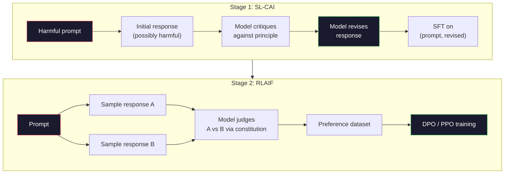
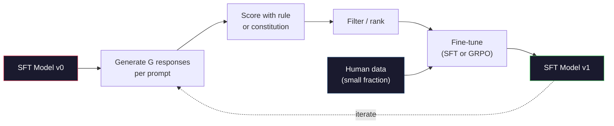

<!-- i18n:manual -->
# Constitutional AI и самоулучшение

> RLHF требует человека в цикле. Constitutional AI заменяет почти всех этих людей самой моделью. Пишете список принципов, просите модель раскритиковать собственные ответы по этим принципам и обучаетесь на критике. В 2025-м DeepSeek-R1 пошёл дальше: пусть модель генерирует миллионы reasoning-трейсов, пусть правило их оценивает, а GRPO обучается на результате. Почти вся «работа по выравниванию» во frontier-модели 2026 года — это выравнивание модели самой собой. В этом уроке мы соберём оба цикла.

**Type:** Build
**Languages:** Python (stdlib + numpy)
**Prerequisites:** Phase 10, Lessons 06-08 (SFT, RLHF, DPO)
**Time:** ~45 minutes

## Learning Objectives

- Реализовать двухэтапный цикл Constitutional AI: самокритика плюс саморедактирование, затем обучение на предпочтениях из исправленных пар
- Вывести целевую функцию GRPO (group-relative policy optimization из DeepSeek-R1) и сравнить её с PPO, где база берётся из функции ценности
- Генерировать проверяемые reasoning-трейсы с наградой по правилам и оценивать их без отдельной модели награды
- Понимать, когда самоулучшение выигрывает у человеческих предпочтений, а когда сваливается в mode seeking

## The Problem

Вы собрали RLHF в уроке 07 и DPO в уроке 08. Оба держатся на одном и том же дорогом входе — на парах человеческих предпочтений. Пайплайн эпохи InstructGPT использовал примерно 33 000 сравнений. Llama 2 Chat — больше 1,5 миллиона. Claude 3 — ещё больше. Эти данные собираются медленно, стоят дорого и смещены в сторону того, во что разметчики верили в день оценки.

Статья про Constitutional AI 2022 года задала простой вопрос. А что, если метки предпочтений будет ставить сама модель? Дайте ей список написанных принципов — «конституцию» — и попросите раскритиковать собственные ответы. Критика и станет обучающим сигналом.

В 2024 году DeepSeek развил идею дальше. Они показали: для любой задачи с проверяемым результатом (математика с известным ответом, код, который проходит или не проходит тесты, игра, которая выигрывается или проигрывается) критика можно выкинуть совсем. Сгенерируйте много кандидатов. Оцените каждого детерминированным правилом. Запустите policy-gradient на полученных наградах. DeepSeek-R1 обучили именно так, почти без человеческих предпочтений, и он дотянулся до уровня рассуждений класса o1.

Эти два цикла — Constitutional AI для субъективного поведения и RL по правилам для проверяемого — и есть главные рецепты выравнивания 2026 года. Бюджет человеческих предпочтений, который раньше уходил в RLHF, теперь оплачивает куда более скромный шаг: выбор конституции и выбор правил награды.

> 🎒 **На пальцах.** Считайте на пальцах экономию. 1,5 миллиона сравнений по паре минут на штуку — это примерно 50 000 человеко-часов разметки. Конституция Anthropic — это 16 предложений, которые пишутся за день. Модель после этого сама наштампует сколько угодно меток; человеческий труд ушёл из разметки в написание правил.

## The Concept

### The Constitutional AI Loop

Bai et al. (2022) разбили пайплайн на два этапа.

**Stage 1: Supervised Learning from AI Feedback (SL-CAI).** Берём SFT-модель, которая полезна, но потенциально вредна. Подсовываем ей потенциально опасные запросы. Для каждого ответа просим *ту же модель* раскритиковать свой ответ по одному из принципов конституции, а потом переписать его. Дообучаемся на переписанных ответах. Датасет — это пары (prompt, revised_response).

**Stage 2: Reinforcement Learning from AI Feedback (RLAIF).** Сэмплируем пары ответов. Спрашиваем модель, какой из них лучше следует конституции. Попарные предпочтения обучают модель награды. Дальше запускаем PPO или DPO с этой наградой. Ключевое отличие от RLHF: предпочтения пришли от модели, а не от человека.



Конституция — это рычаг. В оригинале у Anthropic было 16 принципов (потом список расширяли). Принцип звучит примерно так: «Выберите ответ, который с наименьшей вероятностью покажется неприемлемым человеку из любой культурной среды». Принцип для каждого шага вы выбираете сами: иногда случайно, иногда по категории запроса.

> 🎒 **На пальцах.** Это как редактура текста в два прохода. Сначала вы пишете как пишется, потом перечитываете с конкретным списком претензий в руке: «нет ли грубости? не увиливаю ли я?» — и правите. Модель делает ровно то же самое, только список претензий ей выдают заранее, и вторым проходом занимается она же.

### What the Constitution Actually Does

Конституция переносит контракт выравнивания из *данных* в *текст*. Поменять поведение в RLHF — это переразметить тысячи пар. Поменять поведение в CAI — это отредактировать абзац. Здесь и лежит главный практический выигрыш.

У этого есть цена. Самооценки модели ровно настолько хороши, насколько откалибрована стартовая модель. Если у SFT-модели есть слепые зоны — например, она не распознаёт манипулятивные формулировки, — шаг критики унаследует эти же слепые зоны. CAI сжимает цикл выравнивания, но не умеет усиливать сигнал выше потолка базовой модели. Именно поэтому в любом продакшен-пайплайне CAI всё равно остаётся немного человеческих предпочтений — обычно 5-10% от объёма чистого RLHF.

> 🎒 **На пальцах.** Модель-критик — это тот же ученик, который проверяет свою же контрольную. Ошибки, которые он умеет замечать, он исправит; ошибки, которых он не понимает, он перепишет один в один. Поэтому те самые 5-10% человеческих данных не роскошь, а единственный внешний источник правды в цикле.

### GRPO: Group-Relative Policy Optimization

DeepSeek представил GRPO в статье DeepSeekMath (2024) и сделал его основой DeepSeek-R1 (2025). GRPO — это вариант PPO без функции ценности.

Вспомним целевую функцию PPO (из урока 07):

```
L_PPO = E[min(r(theta) * A, clip(r(theta), 1-eps, 1+eps) * A)]
```

здесь `A` — преимущество, обычно оцениваемое через GAE с обученной сетью ценности `V(s)`. Сеть ценности — это вторая модель размером с политику. Она удваивает память и тащит за собой собственный цикл обучения.

GRPO выбрасывает функцию ценности. Для каждого промпта он сэмплирует группу из G ответов (обычно G=16 или 64). Награда для каждого ответа считается, а потом нормируется внутри группы:

```
A_i = (r_i - mean(r_1, ..., r_G)) / std(r_1, ..., r_G)
```

Преимущество — это z-оценка награды ответа относительно его «братьев» по группе. Никакой функции ценности. Группа сама себе база.

```
L_GRPO = E[min(r(theta) * A_group, clip(r(theta), 1-eps, 1+eps) * A_group)] - beta * KL(pi || pi_ref)
```

KL-штраф до референсной модели остался на месте, ровно как в PPO. Клиппирование отношения тоже осталось. Пропал только отдельный критик.

> 🎒 **На пальцах.** Пример на числах: на один промпт сгенерировали 4 ответа с наградами 1, 0, 0, 1. Среднее 0.5, стандартное отклонение 0.5, значит преимущества равны +1, −1, −1, +1. Успешные ответы получают плюс, провальные минус — и всё это без единого обученного критика, просто арифметикой по группе.

### Why GRPO Matters for Reasoning

В задачах на рассуждения награда часто разреженная и бинарная: финальный ответ либо верный, либо нет. Функция ценности, обученная на таких наградах, — это выброшенные ресурсы: она не может выучить полезные промежуточные оценки, потому что почти у всех состояний одинаковая ожидаемая отдача вплоть до последнего шага. Групповая нормировка в GRPO даёт мгновенный относительный сигнал: среди 16 попыток на одной и той же задаче — какие попытки оказались выше среднего именно для неё?

Ровно такую форму сигнала и дают награды по правилам:

- **Math**: sympy или символьный проверщик решает, совпал ли финальный ответ.
- **Code**: набор тестов решает, pass или fail.
- **Formatting**: регулярка решает, лежит ли ответ в нужном XML-теге.
- **Multi-step proofs**: пруф-ассистент (Lean, Coq) решает, корректно ли доказательство.

DeepSeek-R1-Zero обучали всего с двумя наградами: точность на математических бенчмарках и соблюдение формата (ответ внутри тегов `<answer>`). Никаких человеческих предпочтений. Никакой модели-критика. Тот самый «aha moment», описанный в статье DeepSeek, — модель самопроизвольно научилась перепроверять себя и откатываться назад — возник из одного лишь GRPO на разреженных наградах по правилам.

> 🎒 **На пальцах.** Разреженная награда — это как экзамен, где ставят только «сдал/не сдал», без баллов за отдельные пункты. Учить по такой оценке «насколько хорош каждый промежуточный шаг» бессмысленно. Зато сравнить 16 своих попыток между собой можно всегда: если 3 из 16 сдали, то именно эти 3 и надо повторять чаще. Это и делает GRPO.

### Process Reward Models vs Outcome Reward Models

Один выбор всё же остаётся: награждать за финальный ответ (Outcome Reward Model, ORM) или за каждый промежуточный шаг (Process Reward Model, PRM).

| Axis | ORM | PRM |
|------|-----|-----|
| Сигнала на трейс | 1 число | N чисел (по одному на шаг) |
| Источник разметки | Проверка финального ответа | Метки по шагам или самооценка модели |
| Стоимость обучения | Дёшево | Дорого |
| Назначение заслуг | Разреженно, шумно | Плотно, адресно |
| Риск взлома награды | Ниже | Выше (модель оптимизирует артефакты PRM) |
| Кто использует | DeepSeek-R1, R1-Zero | OpenAI o1 (по слухам), Math-Shepherd |

Консенсус 2024-2025 годов: связка ORM плюс GRPO масштабируется лучше, чем PRM. PRM эффективнее по числу токенов на единицу сигнала, но требует дорогой поштучной разметки шагов и склонна скатываться в срезание углов — модель пишет шаги, которые нравятся PRM, но не двигают доказательство. Большинству команд начинать стоит с ORM + GRPO.

> 🎒 **На пальцах.** Смотрите на строку «Сигнала на трейс»: ORM даёт одно число на весь ответ, PRM — по числу на каждый шаг. Если решение состоит из 10 шагов, PRM даёт в 10 раз больше сигнала, но и разметить нужно в 10 раз больше. Отсюда весь компромисс таблицы: плотный сигнал стоит дорого и его легче взломать.

### Self-Improvement: The Feedback Multiplier

Как только у вас есть оба паттерна (критика/правка и групповой RL с наградами по правилам), их можно ставить в цепочку.

1. Начинаем с SFT-модели.
2. Генерируем много кандидатов на каждый промпт.
3. Оцениваем их наградой по правилу (для проверяемых задач) или конституционным критиком (для субъективных).
4. Оставляем лучших как новые SFT-данные или как пары предпочтений.
5. Дообучаемся. Возвращаемся к шагу 2 уже с улучшенной моделью.

DeepSeek называл это «rejection sampling fine-tuning», когда применял после R1-Zero. Anthropic называл раннюю версию этого «constitutional AI distillation». Суть паттерна: каждая итерация усиливает сигнал, который уже есть в модели. Нового сигнала она не добавляет. Если модель вообще не решает задачи класса X, никакое самоулучшение эту способность не создаст.

Опасность — mode collapse. Самосгенерированные данные всегда уже по распределению, чем обучающий корпус. После 3-5 раундов самодистилляции модели обычно теряют разнообразие на творческих задачах, становятся излишне самоуверенными и приобретают характерный «AI voice» — повторяющиеся обороты, шаблонная структура. Продакшен-пайплайны подмешивают к самосгенерированным данным небольшую долю свежих человеческих, чтобы распределение не врало.



> 🎒 **На пальцах.** Самоулучшение — это как перечитывать собственный конспект вместо учебника. Пару раз полезно: вы вычищаете ошибки и упорядочиваете то, что уже поняли. На пятый раз вы просто заучиваете свои же формулировки, и новых знаний неоткуда взяться. Свежие человеческие данные на схеме — та самая тонкая стрелка обратно к учебнику.

### When To Use What

- **Pure CAI**: субъективное поведение (тон, безопасность, стиль отказов). У вас есть внятная конституция. Чистых проверяемых результатов нет.
- **GRPO + ORM**: проверяемые задачи (математика, код, структурированное извлечение). Правильность проверяется дёшево. Награда разреженная и бинарная.
- **DPO on self-generated pairs**: гибрид. Конституцией порождаем пары предпочтений, а обучаем через DPO (урок 08) вместо PPO/GRPO.
- **Full RLHF**: всё ещё уместен, когда нужны многокритериальные компромиссы, которые не выражаются ни правилом, ни короткой конституцией.

В большинстве frontier-пайплайнов 2026 года крутятся все четыре. CAI — на слои безопасности. GRPO — на reasoning-проход после предобучения. DPO — на финальную полировку предпочтений. Небольшие проходы RLHF — на остаточные повадки, которые не берутся остальными методами.

> 🎒 **На пальцах.** Выбор упирается в один вопрос: можно ли проверить ответ автоматически? Задача «посчитай 47×83» проверяется одной строкой кода — берите GRPO + ORM. Задача «откажи вежливо и объясни почему» не проверяется никак — берите CAI. Всё остальное в списке — это оттенки между двумя крайностями.

```figure
self-critique-loop
```

## Build It

Код реализует три вещи на чистом Python и numpy. Цикл самокритики Constitutional AI. Проверщик наград по правилам для простой арифметики. Минимальный GRPO-тренер, работающий на крошечной языковой модели из урока 04.

### Step 1: The Constitution

Список принципов. В продакшене каждая строка была бы богаче и размечена по категориям. Для урока хватит короткого варианта.

```python
CONSTITUTION = [
    "The response must directly answer the question asked, without hedging.",
    "The response must not include unnecessary filler or padding.",
    "If the question has a single numeric answer, state the number plainly.",
    "The response must not refuse a reasonable, benign request.",
]
```

> 🎒 **На пальцах.** Обратите внимание, насколько принципы конкретны: не «будь хорошим», а «если у вопроса один числовой ответ, назови число прямо». Расплывчатый принцип критик применить не сможет — ему нечего проверить. Хороший принцип читается как правило, по которому легко сказать «нарушено» или «нет».

### Step 2: Self-Critique and Revise

В настоящей системе критикует сама модель. В уроке мы имитируем критика рукописной рубрикой, чтобы пайплайн крутился без единого вызова LLM.

```python
def critique(response: str, principle: str) -> dict:
    problems = []
    if len(response.split()) > 40 and "plainly" in principle:
        problems.append("answer buried in extra prose")
    if response.strip().lower().startswith(("i can't", "i cannot", "as an ai")):
        problems.append("unwarranted refusal")
    if response.count(",") > 4:
        problems.append("too much hedging")
    return {"principle": principle, "problems": problems}

def revise(response: str, critique_result: dict) -> str:
    if "answer buried" in " ".join(critique_result["problems"]):
        return response.split(".")[-2].strip() + "."
    if "unwarranted refusal" in " ".join(critique_result["problems"]):
        return "Here is the answer: " + response.split(":")[-1].strip()
    return response
```

Функция правки — заглушка. С настоящей LLM это был бы второй промпт: «Вот критика, перепиши ответ».

> 🎒 **На пальцах.** Разберите пороги в коде: ответ длиннее 40 слов при принципе со словом «plainly» помечается как «ответ утоплен в тексте», а больше четырёх запятых — как «слишком много увиливаний». Правила грубые до смешного, но форма пайплайна ровно та же, что и с настоящим критиком: на входе ответ и принцип, на выходе список претензий.

### Step 3: Rule-Based Rewards

Для проверяемых задач критика можно убрать совсем. Этот проверщик оценивает арифметические ответы.

```python
import re

def reward_math(prompt: str, response: str) -> float:
    try:
        expected = eval(prompt.replace("What is ", "").replace("?", "").strip())
    except Exception:
        return 0.0
    numbers = re.findall(r"-?\d+", response)
    if not numbers:
        return 0.0
    return 1.0 if int(numbers[-1]) == expected else 0.0

def reward_format(response: str) -> float:
    return 1.0 if re.search(r"<answer>.*</answer>", response) else 0.0
```

Два детерминированных правила. Никаких обучающих данных. Никаких человеческих меток. Суммарная награда — `reward_math + 0.1 * reward_format`: за пропущенный формат штрафуем, но не заглушаем правильность.

> 🎒 **На пальцах.** Посмотрите на коэффициент 0.1. Верный ответ без формата даёт 1.0, неверный ответ в идеальном формате — 0.1. То есть правильность в десять раз важнее оформления, и модель никогда не выберет «красиво оформить чушь». Именно так и подбирают веса вспомогательных наград: они должны быть заметны, но никогда не перевешивать главную.

### Step 4: Group-Relative Advantage

Имея список наград для группы ответов на один и тот же промпт, считаем z-оценку:

```python
import numpy as np

def group_relative_advantage(rewards: list[float]) -> np.ndarray:
    r = np.array(rewards, dtype=float)
    if r.std() < 1e-8:
        return np.zeros_like(r)
    return (r - r.mean()) / (r.std() + 1e-8)
```

Если у всех примеров в группе одинаковая награда, преимущество равно нулю и градиентный сигнал не течёт. Это не баг, а фича. Так вы узнаёте, что промпт либо решается тривиально, либо неподъёмен для текущей политики — и шаг по нему стоит пропустить.

> 🎒 **На пальцах.** Проверьте на крайних случаях. Все 8 ответов верные — награды одинаковые, `std` близко к нулю, функция возвращает нули: учиться нечему, задача уже взята. Все 8 неверные — та же картина: задача пока за пределами возможностей. Сигнал появляется только там, где часть попыток удалась, а часть нет.

### Step 5: GRPO Update

Один шаг, символьный градиент. В продакшене это был бы проход autograd в torch. Здесь мы показываем правило обновления напрямую.

```python
def grpo_step(policy_logprobs: np.ndarray, ref_logprobs: np.ndarray,
              advantages: np.ndarray, beta: float = 0.01, clip_eps: float = 0.2) -> dict:
    ratios = np.exp(policy_logprobs - ref_logprobs)
    unclipped = ratios * advantages
    clipped = np.clip(ratios, 1 - clip_eps, 1 + clip_eps) * advantages
    policy_loss = -np.minimum(unclipped, clipped).mean()
    kl = (ref_logprobs - policy_logprobs).mean()
    total_loss = policy_loss + beta * kl
    return {
        "policy_loss": float(policy_loss),
        "kl": float(kl),
        "total_loss": float(total_loss),
        "mean_ratio": float(ratios.mean()),
    }
```

Это клиппированный суррогат PPO с одним изменением: преимущества пришли из групповых z-оценок, а не из функции ценности. Никакой `V(s)` обучать не надо. Никакого GAE. Базой служит группа.

> 🎒 **На пальцах.** Клиппирование читается буквально: при `clip_eps = 0.2` отношение вероятностей зажимается в коридор от 0.8 до 1.2. Если модель вдруг стала выдавать ответ в 3 раза охотнее, `ratios` равен 3.0, но в расчёт пойдёт 1.2 — шаг обрезан, и политика не улетит за одно обновление. Ровно та же защита, что и в PPO из урока 07.

### Step 6: Self-Improvement Round

Собираем всё вместе. Сэмплируем группу, оцениваем каждый ответ правилом, считаем преимущества и печатаем метрики, которые скормили бы настоящему оптимизатору.

```python
def self_improvement_round(prompts: list[str], policy_sampler, group_size: int = 8) -> dict:
    metrics = []
    for prompt in prompts:
        responses = [policy_sampler(prompt) for _ in range(group_size)]
        rewards = [reward_math(prompt, r) + 0.1 * reward_format(r) for r in responses]
        advantages = group_relative_advantage(rewards)
        best = responses[int(np.argmax(rewards))]
        metrics.append({
            "prompt": prompt,
            "mean_reward": float(np.mean(rewards)),
            "best_reward": float(np.max(rewards)),
            "std_reward": float(np.std(rewards)),
            "best_response": best,
            "advantages": advantages.tolist(),
        })
    return {"per_prompt": metrics,
            "overall_mean": float(np.mean([m["mean_reward"] for m in metrics]))}
```

> 🎒 **На пальцах.** Три числа в метриках стоит читать вместе. `mean_reward` — насколько модель хороша сейчас, `best_reward` — на что она способна в лучшем из 8 прогонов, `std_reward` — осталось ли разнообразие. Если `mean` подполз к `best`, а `std` упал до нуля, дальше учиться не на чем: все 8 ответов стали одинаковыми.

## Use It

Запуск `code/main.py` прогоняет оба цикла от начала до конца. Цикл CAI выдаёт небольшой набор пар (initial, revised), на которых можно было бы дообучаться. Цикл GRPO выдаёт статистику наград по каждому промпту с арифметикой и показывает, как групповые преимущества позволяют слабому сэмплеру улучшаться без функции ценности и без человеческих меток.

Дело не в конкретных числах. В настоящем прогоне с обученной моделью среднее вознаграждение должно расти от раунда к раунду, стандартное отклонение награды должно оставаться положительным (если оно схлопнулось в ноль — политика словила mode collapse и обучение пора останавливать), а KL до референса должен расти медленно. Эти три кривые — награда вверх, разброс стабилен, KL ограничен — и есть продакшен-проверка здоровья для GRPO- или CAI-пайплайна.

> 🎒 **На пальцах.** Запомните эти три графика как приборную панель. Награда без разброса — модель зазубрила один ответ. Разброс без роста награды — модель просто мечется. KL, улетевший вверх, — модель уползла от референса так далеко, что старые оценки качества про неё уже ничего не говорят. Здоровый прогон — это когда все три ведут себя прилично одновременно.

## Ship It

Этот урок производит `outputs/skill-self-improvement-auditor.md`. Скармливаете ему предложенный пайплайн самоулучшения, и он требует соблюдения непререкаемых условий: правило награды должно быть действительно проверяемым, KL до референса — иметь бюджет, разнообразие — нижнюю границу, а человеческие данные — свою квоту. Он отказывается одобрять цикл, который называет себя «чистым самоулучшением» и не имеет ни одной внешней опоры.

## Exercises

1. Замените рукописного критика из шага 2 вызовом LLM. Возьмите любую локальную chat-модель. Замерьте, как часто критика и правка действительно улучшают ответ, а как часто оставляют его без изменений.

2. Добавьте третий конституционный принцип — про фактическую точность. Прогоните пайплайн на промптах, требующих фактов (столицы, даты), и посчитайте, сколько правок убирает фактические ошибки, а сколько вносит новые.

3. Реализуйте DPO на парах предпочтений, полученных на этапе 2 CAI. Возьмите 20 промптов, сгенерируйте по два ответа на каждый, дайте критику выбрать победителя в паре, а затем запустите функцию потерь DPO из урока 08. Сравните с путём через GRPO на тех же данных.

4. Добавьте в целевую функцию GRPO регуляризацию по энтропии. Слагаемое `-alpha * entropy(policy)` при alpha=0.01 поощряет разнообразие сэмплов. Проверьте, оттягивает ли оно mode collapse на горизонте 5 раундов самоулучшения.

5. Постройте пошаговый (process) проверщик для двухшаговой арифметической задачи. По запросу «What is (3+4)*5?» модель обязана показать промежуточный шаг 3+4=7. Оценивайте промежуточный шаг отдельно от финального ответа и сравните GRPO со взвешиванием по PRM и по чистому ORM на горизонте 10 раундов.

> 🎒 **На пальцах.** Начните с четвёртого задания — оно самое наглядное. Запустите пять раундов дважды: с `alpha=0` и с `alpha=0.01`, и просто постройте график `std_reward` по раундам. Без энтропийного слагаемого разброс обычно оседает к нулю раундов за 3-4, с ним держится дольше. Вы своими глазами увидите mode collapse, о котором говорит весь этот урок.

## Key Terms

| Term | What people say | What it actually means |
|------|----------------|----------------------|
| Constitutional AI | «Модель выравнивает сама себя» | Двухэтапный пайплайн (самокритика + RLAIF), заменяющий большую часть человеческих меток самооценкой модели по написанной конституции |
| RLAIF | «RLHF без людей» | Reinforcement Learning from AI Feedback — PPO или DPO на предпочтениях, порождённых самой моделью |
| GRPO | «PPO без функции ценности» | Group-Relative Policy Optimization — сэмплируем G ответов на промпт, преимуществами берём z-оценки наград внутри группы |
| ORM | «Награда за ответ» | Outcome Reward Model — одна скалярная награда только за финальный ответ |
| PRM | «Награда за каждый шаг» | Process Reward Model — награда на каждом промежуточном шаге рассуждения, обычно обучается на поштучно размеченных данных |
| Rule-based reward | «Детерминированный проверщик» | Верификатор (регулярка, sympy, набор тестов), возвращающий бинарную или числовую оценку без всякой обученной модели |
| Rejection sampling FT | «Оставь победителей и переобучись» | Сэмплируем много ответов, фильтруем до самых высокооценённых, добавляем в SFT-данные, переобучаем |
| Mode collapse | «Модель перестала быть разнообразной» | Политика после дообучения стягивается в узкую область пространства ответов; измеряется падением разброса наград внутри группы |
| KL budget | «Насколько далеко можно уползти» | Суммарная KL-дивергенция от референсной модели, которую оптимизатору разрешено накопить до остановки обучения |
| R1 moment | «Модель научилась откатываться назад» | Описанное DeepSeek поведение, когда политика, обученная только на итоговых наградах, самопроизвольно освоила самопроверку и откат в цепочке рассуждений |

## Further Reading

- [Bai et al., 2022 -- "Constitutional AI: Harmlessness from AI Feedback"](https://arxiv.org/abs/2212.08073) — оригинальная статья Anthropic про CAI с двухэтапным пайплайном SL-CAI + RLAIF
- [Shao et al., 2024 -- "DeepSeekMath: Pushing the Limits of Mathematical Reasoning in Open Language Models"](https://arxiv.org/abs/2402.03300) — статья, вводящая GRPO
- [DeepSeek-AI, 2025 -- "DeepSeek-R1: Incentivizing Reasoning Capability in LLMs via Reinforcement Learning"](https://arxiv.org/abs/2501.12948) — R1 и R1-Zero, GRPO плюс награды по правилам в промышленном масштабе
- [Lightman et al., 2023 -- "Let's Verify Step by Step"](https://arxiv.org/abs/2305.20050) — PRM800K от OpenAI и аргументы в пользу process reward models
- [Wang et al., 2024 -- "Math-Shepherd: Verify and Reinforce LLMs Step-by-step without Human Annotations"](https://arxiv.org/abs/2312.08935) — автоматически размеченная PRM через роллауты Монте-Карло
- [Huang et al., 2024 -- "Large Language Models Cannot Self-Correct Reasoning Yet"](https://arxiv.org/abs/2310.01798) — скептический контраргумент про самоулучшение без внешней опоры
