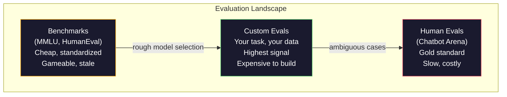
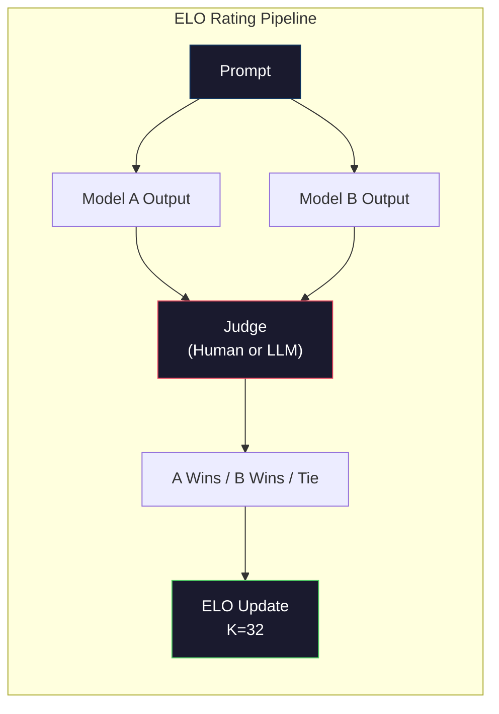

<!-- i18n:manual -->
# Оценка: бенчмарки, evals, LM Harness

> Закон Гудхарта: когда мера становится целью, она перестаёт быть хорошей мерой. Каждая передовая лаборатория подгоняет модели под бенчмарки. Баллы MMLU растут, а модели по-прежнему не могут надёжно посчитать количество букв R в слове "strawberry". Единственный eval, который имеет значение, — ВАШ eval: на ВАШЕЙ задаче и с ВАШИМИ данными.

**Type:** Build
**Languages:** Python
**Prerequisites:** Phase 10, Lessons 01-05 (LLMs from Scratch)
**Time:** ~90 minutes

## Learning Objectives

- Собрать свой evaluation harness, который прогоняет по языковой модели бенчмарки с выбором ответа и с открытым ответом
- Объяснить, почему стандартные бенчмарки (MMLU, HumanEval) насыщаются и перестают различать передовые модели
- Реализовать evals под конкретную задачу с правильными метриками: exact match, F1, BLEU и оценка через LLM-судью
- Спроектировать свой набор тестов под ваш сценарий использования вместо того, чтобы полагаться только на публичные лидерборды

## The Problem

MMLU опубликовали в 2020 году: 15 908 вопросов по 57 предметам. За три года передовые модели его насытили. GPT-4 набрала 86,4%. Claude 3 Opus — 86,8%. Llama 3 405B — 88,6%. Лидерборд сжался в диапазон шириной 3 пункта, где разница — это статистический шум, а не реальный разрыв в способностях.

При этом те же самые модели проваливают задачи, с которыми десятилетний ребёнок справляется не задумываясь. Claude 3.5 Sonnet с её 88,7% на MMLU поначалу не могла посчитать буквы в слове "strawberry" — задача, где не нужно ни знаний о мире, ни рассуждений, только перебор символов. HumanEval проверяет генерацию кода на 164 задачах. Модели набирают там 90% и выше, продолжая писать код, который падает на граничных случаях, заметных любому джуниору.

Разрыв между результатом на бенчмарке и надёжностью в реальной работе — центральная проблема оценки LLM. Бенчмарк говорит вам, как модель выступает на бенчмарке. И почти ничего не говорит о том, как она справится с вашей конкретной задачей, на ваших данных, при ваших сценариях отказа. Если вы строите бота поддержки клиентов, MMLU не про вас. Если вы строите ассистента для кода, HumanEval покрывает только генерацию отдельных функций — и молчит про отладку, рефакторинг и объяснение кода, размазанного по нескольким файлам.

Вам нужны свои evals. Не потому, что бенчмарки бесполезны — для грубого выбора модели они как раз годятся, — а потому, что финальная оценка обязана точно повторять условия вашего продакшена.

> 🎒 **На пальцах.** Представьте школу, где выпускной экзамен один и тот же двадцать лет подряд, и все репетиторы натаскивают именно на него. Стобалльник не обязательно умён — он просто видел эти задачи. Посмотрите на цифры выше: 86,4%, 86,8%, 88,6% — разброс всего 2,2 пункта на 15 908 вопросах, то есть примерно 350 вопросов разницы. Этого мало, чтобы всерьёз сказать, какая модель лучше.

## The Concept

### The Eval Landscape

Есть три категории оценки, и у каждой своя цена и своё качество сигнала.

**Benchmarks** — это стандартизированные наборы тестов. MMLU, HumanEval, SWE-bench, MATH, ARC, HellaSwag. Вы прогоняете модель по бенчмарку и получаете балл. Плюс: все используют один и тот же тест, поэтому модели можно сравнивать. Минус: модели и обучающие данные всё сильнее загрязняют эти бенчмарки. Лаборатории обучаются на данных, куда попадают вопросы из бенчмарков. Баллы растут. Способности — не обязательно.

**Custom evals** — наборы тестов, которые вы собираете под свой сценарий. Вы сами задаёте входы, ожидаемые выходы и функцию оценивания. Суммаризатор юридических документов оценивается на юридических документах. Генератор SQL — на схеме вашей базы. Такие наборы дорого создавать, но только они предсказывают поведение в продакшене.

**Human evals** — платные разметчики судят выходы модели по критериям вроде полезности, корректности, беглости и безопасности. Золотой стандарт для открытых задач, где автоматическая оценка не работает. Chatbot Arena собрала больше 2 миллионов человеческих голосов-предпочтений по 100+ моделям. Обратная сторона: цена ($0,10-$2,00 за одно суждение) и скорость (от часов до дней).



> 🎒 **На пальцах.** Это как проверить нового повара: сначала спросить диплом (бенчмарк — дёшево и быстро), потом дать приготовить блюдо из вашего меню (custom eval), и только в спорных случаях позвать дегустатора (human eval). Стрелки на схеме идут именно в этом порядке. И цена растёт так же: бенчмарк почти бесплатен, а 100 человеческих суждений по $2 — это уже $200 за один прогон.

### Why Benchmarks Break

Есть три механизма, из-за которых баллы на бенчмарках перестают отражать реальные способности.

**Data contamination.** Обучающие корпуса выкачивают интернет. Вопросы бенчмарков живут в интернете. Модель видит ответы во время обучения. Это не жульничество в привычном смысле — лаборатории не подкладывают данные бенчмарков нарочно. Но при сборе данных в масштабе всей сети исключить их почти невозможно.

**Teaching to the test.** Лаборатории подбирают состав обучающей смеси так, чтобы вырос балл на бенчмарке. Если 5% смеси — вопросы с выбором ответа в стиле MMLU, модель выучивает формат и распределение ответов. В MMLU четыре варианта ответа. Модель усваивает, что правильные ответы распределены между A/B/C/D примерно равномерно, и это помогает ей даже тогда, когда она не знает ответа.

**Saturation.** Когда каждая передовая модель набирает 85-90%, бенчмарк перестаёт различать. Оставшиеся 10-15% вопросов могут быть двусмысленными, размеченными с ошибками или требовать очень узких знаний. Рост с 87% до 89% на MMLU может означать, что модель запомнила ещё пару редких вопросов, а не что она поумнела.

> 🎒 **На пальцах.** Про равномерность ответов в MMLU: если модель вообще ничего не знает и тычет наугад в один из четырёх вариантов, она получит 25%. Но если она выучила, что правильные ответы распределены поровну между A/B/C/D, и уже отбросила два явно неверных варианта, шанс становится 50%. Так балл растёт от знания формата, а не предмета.

### Perplexity: A Quick Health Check

Perplexity измеряет, насколько модель удивлена последовательностью токенов. Формально это экспонента от среднего отрицательного логарифма правдоподобия:

```
PPL = exp(-1/N * sum(log P(token_i | context)))
```

Perplexity, равная 10, означает: в среднем модель на каждой позиции токена настолько же не уверена, как если бы выбирала равновероятно из 10 вариантов. Меньше — лучше. GPT-2 даёт perplexity около 30 на WikiText-103. GPT-3 — около 20. Llama 3 8B — около 7.

Perplexity полезна для сравнения моделей на одном и том же тестовом наборе, но у неё есть слепые зоны. Модель может иметь низкую perplexity за счёт того, что хорошо предсказывает частые куски текста, и при этом ужасно вести себя на редких, но важных. Ещё она ничего не говорит про следование инструкциям, рассуждения и фактическую точность. Используйте её как проверку на вменяемость, а не как финальный вердикт.

> 🎒 **На пальцах.** Perplexity — это «сколько вариантов модель реально перебирает на каждом шаге». У GPT-2 это около 30, у Llama 3 8B около 7: вторая как будто выбирает из семи слов, а первая из тридцати. Разница в 4 раза по неопределённости. Но низкая perplexity не спасёт, если модель не выполняет инструкцию, — она может отлично угадывать следующее слово и при этом отвечать не на тот вопрос.

### LLM-as-Judge

Берём сильную модель, чтобы оценивать выход более слабой. Идея простая: попросить GPT-4o или Claude Sonnet поставить ответу оценку от 1 до 5 за корректность, полезность и безопасность. С GPT-4o-mini это стоит примерно $0,01 за одно суждение и на удивление хорошо согласуется с оценками людей — около 80% совпадений на большинстве задач.

Промпт для оценивания важнее, чем сама модель. Расплывчатый промпт («Оцени этот ответ») даёт шумные оценки. Структурированный промпт с рубрикой («Ставь 5, если ответ фактически верен и ссылается на источник; 4 — если верен, но без источника; 3 — если верен частично...») даёт стабильные и воспроизводимые оценки.

Сценарии отказа: модели-судьи страдают позиционным смещением (предпочитают первый ответ при попарном сравнении), смещением к многословности (предпочитают длинные ответы) и самопредпочтением (GPT-4 оценивает выходы GPT-4 выше, чем равноценные выходы Claude). Чем лечить: перемешивать порядок, нормировать на длину, брать судью не из того семейства, что оцениваемая модель.

> 🎒 **На пальцах.** Судья без рубрики — это учитель, который ставит оценку «по настроению». Дайте ему чёткие критерии («5 — верно и со ссылкой, 4 — верно без ссылки»), и два разных прогона дадут один и тот же балл. Про самопредпочтение: если GPT-4 судит саму себя, она завысит оценку, поэтому судью берут из чужого семейства — например, оценивайте выходы GPT моделью Claude, и наоборот.

### ELO Ratings from Pairwise Comparisons

Подход Chatbot Arena. Показываем два ответа на один и тот же промпт от разных моделей. Человек (или LLM-судья) выбирает лучший. По тысячам таких сравнений считаем рейтинг ELO для каждой модели — ту же систему используют в шахматах.

Плюсы ELO: относительный рейтинг надёжнее абсолютных баллов, ничьи обрабатываются без костылей, и сходимость наступает быстрее, чем если оценивать каждый выход по отдельности. На начало 2026 года в рейтинге Chatbot Arena GPT-4o, Claude 3.5 Sonnet и Gemini 1.5 Pro стоят на вершине в пределах 20 пунктов ELO друг от друга.



> 🎒 **На пальцах.** ELO не спрашивает «сколько баллов из ста», а спрашивает «кто кого». Точно как в шахматах: победа над сильным даёт много очков, над слабым — почти ничего. На схеме один промпт идёт в две модели, судья выбирает победителя, и рейтинг двигается на шаг с коэффициентом K=32. Разрыв в 20 пунктов ELO на вершине означает, что модель выигрывает примерно 53 матча из 100 — то есть почти ничью.

### Eval Frameworks

**lm-evaluation-harness** (EleutherAI): стандартный опенсорсный фреймворк для оценки. Поддерживает 200+ бенчмарков. Одной командой прогоняет любую модель с Hugging Face по MMLU, HellaSwag, ARC и так далее. На нём работает Open LLM Leaderboard.

**RAGAS**: фреймворк оценки специально для RAG-пайплайнов. Измеряет faithfulness (взят ли ответ из найденного контекста?), релевантность (относится ли найденный контекст к вопросу?) и корректность ответа.

**promptfoo**: оценка через конфиги для промпт-инжиниринга. Описываете тест-кейсы в YAML, прогоняете по нескольким моделям, получаете отчёт pass/fail. Удобно для регрессионных проверок промптов — чтобы правка промпта не сломала уже работающие случаи.

### Building Custom Evals

Единственный eval, который имеет значение для продакшена. Процесс такой:

1. **Define the task.** Что именно должна делать модель? Формулируйте точно. «Отвечать на вопросы» — слишком расплывчато. «По письму с жалобой клиента извлечь название продукта, категорию проблемы и тональность» — уже задача, которую можно оценивать.

2. **Create test cases.** Минимум 50 для прототипа, 200+ для продакшена. Каждый тест-кейс — пара (вход, ожидаемый_выход). Включайте граничные случаи: пустые входы, состязательные входы, двусмысленные входы, входы на других языках.

3. **Define scoring.** Exact match для структурированных выходов. BLEU/ROUGE для похожести текстов. LLM-судья для открытого качества. F1 для задач извлечения. Несколько метрик комбинируйте с весами.

4. **Automate.** Любой eval запускается одной командой. Никаких ручных шагов. Результаты храните в формате, который позволяет сравнивать прогоны во времени.

5. **Track over time.** Отдельный балл eval сам по себе ничего не значит. Вам нужен тренд. Стало ли лучше после последней правки промпта? Не откатилось ли качество после смены модели? Версионируйте eval вместе с промптами.

| Eval Type | Cost per judgment | Agreement with humans | Best for |
|-----------|------------------|----------------------|----------|
| Exact match | ~$0 | 100% (когда применимо) | Структурированный выход, классификация |
| BLEU/ROUGE | ~$0 | ~60% | Перевод, суммаризация |
| LLM-as-judge | ~$0.01 | ~80% | Открытая генерация |
| Human eval | $0.10-$2.00 | нет (это и есть эталон) | Двусмысленные, критичные задачи |

> 🎒 **На пальцах.** Прочитайте таблицу как прайс-лист. 200 тест-кейсов через exact match стоят $0, через LLM-судью — $2, а через людей — от $20 до $400. Поэтому схема почти всегда такая: exact match гоняем на каждом коммите, LLM-судью раз в день, а людей зовём только на спорные случаи. Обратите внимание: BLEU/ROUGE дёшев, но согласие с людьми всего 60% — то есть каждый четвёртый его вердикт человек бы оспорил.

```figure
perplexity-loss
```

## Build It

### Step 1: A Minimal Eval Framework

Опишем базовые абстракции. У eval-кейса есть вход, ожидаемый выход и необязательный словарь метаданных. Скорер принимает предсказание и эталон и возвращает оценку от 0 до 1.

```python
import json
from collections import Counter

class EvalCase:
    def __init__(self, input_text, expected, metadata=None):
        self.input_text = input_text
        self.expected = expected
        self.metadata = metadata or {}

class EvalSuite:
    def __init__(self, name, cases, scorers):
        self.name = name
        self.cases = cases
        self.scorers = scorers

    def run(self, model_fn):
        results = []
        for case in self.cases:
            prediction = model_fn(case.input_text)
            scores = {}
            for scorer_name, scorer_fn in self.scorers.items():
                scores[scorer_name] = scorer_fn(prediction, case.expected)
            results.append({
                "input": case.input_text,
                "expected": case.expected,
                "prediction": prediction,
                "scores": scores,
            })
        return results
```

> 🎒 **На пальцах.** Весь каркас — два класса и один цикл. `EvalSuite.run` берёт вашу функцию-модель, прогоняет через неё каждый кейс и складывает результат в словарь с полями input, expected, prediction, scores. Никакой магии: если у вас 5 кейсов и 3 скорера, на выходе будет 5 словарей по 3 оценки в каждом, то есть 15 чисел. Модель тут — просто функция «строка на входе, строка на выходе», поэтому подставить можно что угодно: API, локальную модель или заглушку.

### Step 2: Scoring Functions

Собираем exact match, token F1 и имитацию LLM-судьи.

```python
def exact_match(prediction, expected):
    return 1.0 if prediction.strip().lower() == expected.strip().lower() else 0.0

def token_f1(prediction, expected):
    pred_tokens = set(prediction.lower().split())
    exp_tokens = set(expected.lower().split())
    if not pred_tokens or not exp_tokens:
        return 0.0
    common = pred_tokens & exp_tokens
    precision = len(common) / len(pred_tokens)
    recall = len(common) / len(exp_tokens)
    if precision + recall == 0:
        return 0.0
    return 2 * (precision * recall) / (precision + recall)

def llm_judge_simulated(prediction, expected):
    pred_words = set(prediction.lower().split())
    exp_words = set(expected.lower().split())
    if not exp_words:
        return 0.0
    overlap = len(pred_words & exp_words) / len(exp_words)
    length_penalty = min(1.0, len(prediction) / max(len(expected), 1))
    return round(overlap * 0.7 + length_penalty * 0.3, 3)
```

> 🎒 **На пальцах.** Возьмём ответ «Shakespeare» при эталоне «William Shakespeare». `exact_match` даёт 0 — строки не равны. `token_f1` считает так: общее слово одно, precision = 1/1 = 1,0, recall = 1/2 = 0,5, значит F1 = 2·1,0·0,5 / 1,5 ≈ 0,67. Одна и та же пара ответов, а числа отличаются в разы — вот почему метрику выбирают до, а не после прогона.

### Step 3: ELO Rating System

Реализуем попарные сравнения с обновлением ELO. Это ровно та система, по которой Chatbot Arena ранжирует модели.

```python
class ELOTracker:
    def __init__(self, k=32, initial_rating=1500):
        self.ratings = {}
        self.k = k
        self.initial_rating = initial_rating
        self.history = []

    def _ensure_player(self, name):
        if name not in self.ratings:
            self.ratings[name] = self.initial_rating

    def expected_score(self, rating_a, rating_b):
        return 1 / (1 + 10 ** ((rating_b - rating_a) / 400))

    def record_match(self, player_a, player_b, outcome):
        self._ensure_player(player_a)
        self._ensure_player(player_b)

        ea = self.expected_score(self.ratings[player_a], self.ratings[player_b])
        eb = 1 - ea

        if outcome == "a":
            sa, sb = 1.0, 0.0
        elif outcome == "b":
            sa, sb = 0.0, 1.0
        else:
            sa, sb = 0.5, 0.5

        self.ratings[player_a] += self.k * (sa - ea)
        self.ratings[player_b] += self.k * (sb - eb)

        self.history.append({
            "a": player_a, "b": player_b,
            "outcome": outcome,
            "rating_a": round(self.ratings[player_a], 1),
            "rating_b": round(self.ratings[player_b], 1),
        })

    def leaderboard(self):
        return sorted(self.ratings.items(), key=lambda x: -x[1])
```

> 🎒 **На пальцах.** Обе модели стартуют с 1500. `expected_score` для равных рейтингов даёт ровно 0,5 — ничья ожидалась. Если модель A выигрывает, её рейтинг растёт на K·(1 − 0,5) = 32·0,5 = 16, до 1516, а у B падает до 1484. Дальше разрыв растёт медленнее: чем выше рейтинг фаворита, тем меньше он получает за победу над слабым. Именно поэтому рейтинг сходится, а не улетает в бесконечность.

### Step 4: Perplexity Calculation

Считаем perplexity по вероятностям токенов. На практике вы берёте их из логитов модели. Здесь мы имитируем их распределением вероятностей.

```python
import numpy as np

def perplexity(log_probs):
    if not log_probs:
        return float("inf")
    avg_neg_log_prob = -np.mean(log_probs)
    return float(np.exp(avg_neg_log_prob))

def token_log_probs_simulated(text, model_quality=0.8):
    np.random.seed(hash(text) % 2**31)
    tokens = text.split()
    log_probs = []
    for i, token in enumerate(tokens):
        base_prob = model_quality
        if len(token) > 8:
            base_prob *= 0.6
        if i == 0:
            base_prob *= 0.7
        prob = np.clip(base_prob + np.random.normal(0, 0.1), 0.01, 0.99)
        log_probs.append(float(np.log(prob)))
    return log_probs
```

> 🎒 **На пальцах.** Perplexity — это просто «единица делить на среднюю вероятность» в логарифмическом виде. Если модель на каждом токене даёт вероятность 0,8, то средний −log равен 0,223, а exp(0,223) ≈ 1,25. Почти идеально. При вероятности 0,1 получится 10 — модель как будто гадает из десяти вариантов. В `token_log_probs_simulated` длинные токены штрафуются множителем 0,6, а первый токен — 0,7: начало текста и редкие слова предсказывать всегда труднее.

### Step 5: Aggregate Results

Считаем сводную статистику по прогону eval: среднее, медиану, долю прошедших порог и разбивку по метрикам.

```python
def summarize_results(results, threshold=0.8):
    all_scores = {}
    for r in results:
        for metric, score in r["scores"].items():
            all_scores.setdefault(metric, []).append(score)

    summary = {}
    for metric, scores in all_scores.items():
        arr = np.array(scores)
        summary[metric] = {
            "mean": round(float(np.mean(arr)), 3),
            "median": round(float(np.median(arr)), 3),
            "std": round(float(np.std(arr)), 3),
            "min": round(float(np.min(arr)), 3),
            "max": round(float(np.max(arr)), 3),
            "pass_rate": round(float(np.mean(arr >= threshold)), 3),
            "n": len(scores),
        }
    return summary

def print_summary(summary, suite_name="Eval"):
    print(f"\n{'=' * 60}")
    print(f"  {suite_name} Summary")
    print(f"{'=' * 60}")
    for metric, stats in summary.items():
        print(f"\n  {metric}:")
        print(f"    Mean:      {stats['mean']:.3f}")
        print(f"    Median:    {stats['median']:.3f}")
        print(f"    Std:       {stats['std']:.3f}")
        print(f"    Range:     [{stats['min']:.3f}, {stats['max']:.3f}]")
        print(f"    Pass rate: {stats['pass_rate']:.1%} (threshold >= 0.8)")
        print(f"    N:         {stats['n']}")
```

### Step 6: Run the Full Pipeline

Собираем всё вместе. Определяем задачу, создаём тест-кейсы, имитируем две модели, прогоняем evals, считаем ELO по попарным сравнениям и печатаем лидерборд.

```python
def demo_model_good(prompt):
    responses = {
        "What is the capital of France?": "Paris",
        "What is 2 + 2?": "4",
        "Who wrote Hamlet?": "William Shakespeare",
        "What language is PyTorch written in?": "Python and C++",
        "What is the boiling point of water?": "100 degrees Celsius",
    }
    return responses.get(prompt, "I don't know")

def demo_model_bad(prompt):
    responses = {
        "What is the capital of France?": "Paris is the capital city of France",
        "What is 2 + 2?": "The answer is four",
        "Who wrote Hamlet?": "Shakespeare",
        "What language is PyTorch written in?": "Python",
        "What is the boiling point of water?": "212 Fahrenheit",
    }
    return responses.get(prompt, "Unknown")

cases = [
    EvalCase("What is the capital of France?", "Paris"),
    EvalCase("What is 2 + 2?", "4"),
    EvalCase("Who wrote Hamlet?", "William Shakespeare"),
    EvalCase("What language is PyTorch written in?", "Python and C++"),
    EvalCase("What is the boiling point of water?", "100 degrees Celsius"),
]

suite = EvalSuite(
    name="General Knowledge",
    cases=cases,
    scorers={
        "exact_match": exact_match,
        "token_f1": token_f1,
        "llm_judge": llm_judge_simulated,
    },
)

results_good = suite.run(demo_model_good)
results_bad = suite.run(demo_model_bad)

print_summary(summarize_results(results_good), "Model A (concise)")
print_summary(summarize_results(results_bad), "Model B (verbose)")
```

«Хорошая» модель отвечает точно. «Плохая» отвечает многословными пересказами. Exact match жестоко наказывает многословную модель. Token F1 и LLM-судья снисходительнее. Отсюда видно, почему выбор метрики так важен: одна и та же модель выглядит отличной или ужасной в зависимости от того, как вы считаете.

> 🎒 **На пальцах.** Посмотрите на пару «What is 2 + 2?». Модель A отвечает "4" — exact match 1,0. Модель B отвечает "The answer is four" — exact match 0,0, хотя человек засчитал бы. По exact match разрыв выглядит как пропасть, по token F1 он сжимается. Мораль простая: прежде чем радоваться, что модель A «в два раза лучше», проверьте, не меряете ли вы форматирование вместо знаний.

### Step 7: ELO Tournament

Прогоняем попарные сравнения между моделями по нескольким раундам.

```python
elo = ELOTracker(k=32)

for case in cases:
    pred_a = demo_model_good(case.input_text)
    pred_b = demo_model_bad(case.input_text)

    score_a = token_f1(pred_a, case.expected)
    score_b = token_f1(pred_b, case.expected)

    if score_a > score_b:
        outcome = "a"
    elif score_b > score_a:
        outcome = "b"
    else:
        outcome = "tie"

    elo.record_match("model_a_concise", "model_b_verbose", outcome)

print("\nELO Leaderboard:")
for name, rating in elo.leaderboard():
    print(f"  {name}: {rating:.0f}")
```

### Step 8: Perplexity Comparison

Сравниваем perplexity у «моделей» разного уровня качества.

```python
test_text = "The quick brown fox jumps over the lazy dog in the garden"

for quality, label in [(0.9, "Strong model"), (0.7, "Medium model"), (0.4, "Weak model")]:
    log_probs = token_log_probs_simulated(test_text, model_quality=quality)
    ppl = perplexity(log_probs)
    print(f"  {label} (quality={quality}): perplexity = {ppl:.2f}")
```

> 🎒 **На пальцах.** Три «модели» с качеством 0,9, 0,7 и 0,4 дадут perplexity примерно 1,2, 1,6 и 3,0 на одном и том же предложении. Текст один, метрика одна, различаются только модели — это и есть правильный способ сравнивать perplexity. Сравнивать её между разными текстами бессмысленно: техническая статья всегда будет «сложнее» детской сказки, и цифры окажутся несопоставимы.

## Use It

### lm-evaluation-harness (EleutherAI)

Стандартный инструмент, чтобы прогонять бенчмарки на любой модели.

```python
# pip install lm-eval
# Command line:
# lm_eval --model hf --model_args pretrained=meta-llama/Llama-3.1-8B --tasks mmlu --batch_size 8

# Python API:
# import lm_eval
# results = lm_eval.simple_evaluate(
#     model="hf",
#     model_args="pretrained=meta-llama/Llama-3.1-8B",
#     tasks=["mmlu", "hellaswag", "arc_easy"],
#     batch_size=8,
# )
# print(results["results"])
```

### promptfoo

Оценка через конфиги для промпт-инжиниринга. Описываете тесты в YAML и прогоняете по нескольким провайдерам.

```yaml
# promptfoo.yaml
providers:
  - openai:gpt-4o-mini
  - anthropic:claude-3-haiku

prompts:
  - "Answer in one word: {{question}}"

tests:
  - vars:
      question: "What is the capital of France?"
    assert:
      - type: contains
        value: "Paris"
  - vars:
      question: "What is 2 + 2?"
    assert:
      - type: equals
        value: "4"
```

### RAGAS for RAG evaluation

```python
# pip install ragas
# from ragas import evaluate
# from ragas.metrics import faithfulness, answer_relevancy, context_precision
#
# result = evaluate(
#     dataset,
#     metrics=[faithfulness, answer_relevancy, context_precision],
# )
# print(result)
```

RAGAS измеряет то, что обычные evals пропускают: опирается ли ответ модели на найденный контекст, а не просто «правильный» ли он сам по себе.

> 🎒 **На пальцах.** Разница вот в чём. Обычный eval спрашивает: «столица Франции — Париж?» Да, верно. RAGAS спрашивает: «а слово Париж вообще было в найденных документах, или модель вспомнила это из головы?» Ответ может быть верным по счастливой случайности, и в RAG это опасно: сегодня повезло, а завтра на вашем внутреннем документе модель так же уверенно выдумает цифру.

## Ship It

Этот урок даёт `outputs/prompt-eval-designer.md` — переиспользуемый промпт, который проектирует наборы evals под любую задачу. Вы даёте описание задачи, он выдаёт тест-кейсы, функции оценивания и рекомендованный порог pass/fail.

Ещё он даёт `outputs/skill-llm-evaluation.md` — схему принятия решений: какую стратегию оценки выбрать исходя из типа задачи, бюджета и требований по задержке.

## Exercises

1. Добавьте скорер «consistency», который прогоняет один и тот же вход через модель 5 раз и меряет, как часто выходы совпадают. Непостоянные ответы на детерминированных входах выдают хрупкие промпты или слишком высокую temperature.

2. Расширьте ELO-трекер так, чтобы он поддерживал несколько функций-судей (exact match, F1, LLM-судья) и взвешивал их. Сравните, как меняется лидерборд, когда вы даёте большой вес exact match против большого веса F1.

3. Соберите набор evals под конкретную задачу: классификация писем по 5 категориям. Создайте 100 тест-кейсов с разнообразными примерами, включая граничные (письма, подходящие сразу под несколько категорий, пустые письма, письма на других языках). Измерьте, как справляются разные «модели» (на правилах, по ключевым словам, имитация LLM).

4. Реализуйте детекцию загрязнения: имея набор eval-вопросов и обучающий корпус, посчитайте, какой процент вопросов (или их близких пересказов) встречается в обучающих данных. Именно так исследователи проверяют, чего стоит бенчмарк.

5. Соберите инструмент «model diff». Имея результаты evals двух версий модели, подсветите, какие конкретно тест-кейсы улучшились, какие откатились и какие не изменились. Это eval-аналог диффа кода — без него не понять, помогло изменение или навредило.

> 🎒 **На пальцах.** Начните с первого задания — оно самое дешёвое и самое отрезвляющее. Прогоните один вопрос 5 раз при temperature 0,7 и посчитайте, сколько раз ответы совпали. Если совпало 3 из 5, ваш «балл 0,9» на самом деле означает 0,9 в конкретном прогоне, а в следующем будет другое число. Пятое задание, «model diff», в реальной работе экономит больше всего времени: среднее выросло на 0,02, а вы увидите, что 8 кейсов улучшились и 5 сломались.

## Key Terms

| Term | What people say | What it actually means |
|------|----------------|----------------------|
| MMLU | «Тот самый бенчмарк» | Massive Multitask Language Understanding — 15 908 вопросов с выбором ответа по 57 предметам, к 2025 году насыщен выше 88% |
| HumanEval | «Оценка кода» | 164 задачи на дописывание функций на Python от OpenAI, проверяет только генерацию изолированной функции |
| SWE-bench | «Настоящая оценка кодинга» | 2294 issue с GitHub из 12 Python-репозиториев, меряет починку багов от начала до конца, включая написание тестов |
| Perplexity | «Насколько модель растеряна» | exp(-avg(log P(token_i при данном контексте))) — меньше означает, что модель даёт настоящим токенам большую вероятность |
| ELO rating | «Шахматный рейтинг для моделей» | Относительный рейтинг силы, посчитанный по попарным победам и поражениям; по нему Chatbot Arena ранжирует 100+ моделей |
| LLM-as-judge | «Оцениваем ИИ с помощью ИИ» | Сильная модель оценивает выходы слабой по рубрике, около 80% согласия с людьми при цене около $0,01 за суждение |
| Data contamination | «Модель видела тест» | В обучающих данных есть вопросы бенчмарка, что задирает баллы, не улучшая реальных способностей |
| Eval suite | «Просто куча тестов» | Версионируемый набор троек (вход, ожидаемый_выход, скорер), измеряющий конкретную способность |
| Pass rate | «Сколько процентов угадал» | Доля eval-кейсов с оценкой выше порога — полезнее среднего балла, потому что меряет надёжность |
| Chatbot Arena | «Сайт с рейтингом моделей» | Платформа LMSYS с 2+ млн человеческих голосов, дающая самый доверенный лидерборд LLM через рейтинги ELO |

## Further Reading

- [Hendrycks et al., 2021 -- "Measuring Massive Multitask Language Understanding"](https://arxiv.org/abs/2009.03300) — статья про MMLU, до сих пор самый цитируемый бенчмарк LLM, несмотря на насыщение
- [Chen et al., 2021 -- "Evaluating Large Language Models Trained on Code"](https://arxiv.org/abs/2107.03374) — статья про HumanEval от OpenAI, задала методологию оценки генерации кода
- [Zheng et al., 2023 -- "Judging LLM-as-a-Judge"](https://arxiv.org/abs/2306.05685) — системный разбор оценки LLM с помощью LLM, включая позиционное смещение и смещение к многословности
- [LMSYS Chatbot Arena](https://chat.lmsys.org/) — краудсорсинговая площадка сравнения моделей с 2+ млн голосов, самый доверенный рейтинг LLM по реальному использованию
