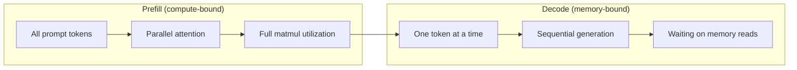
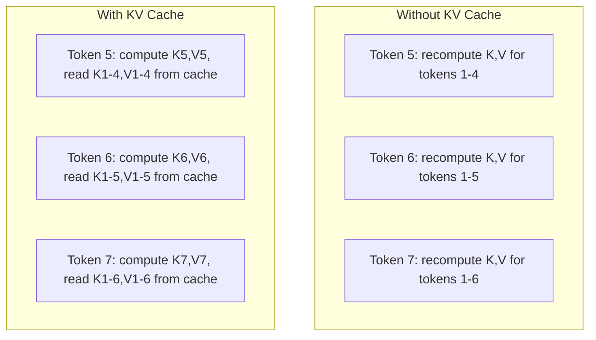
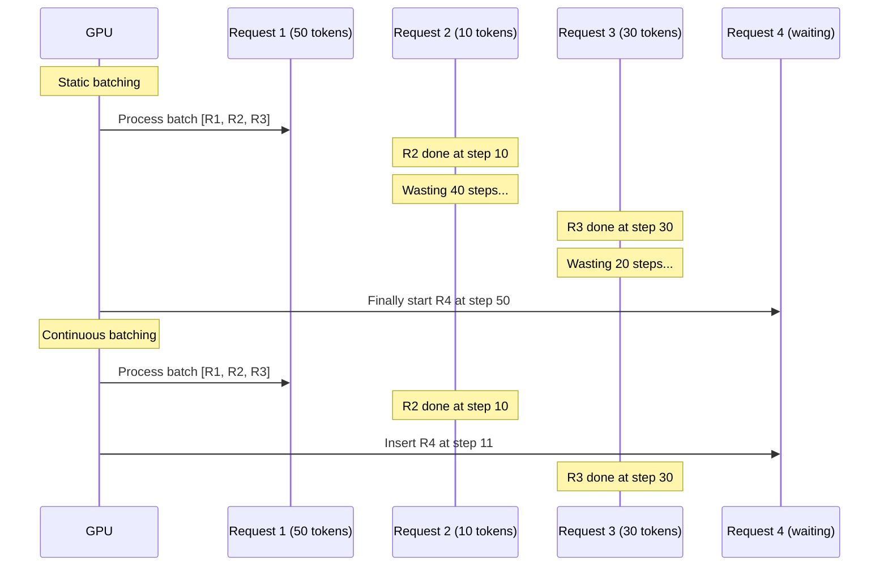
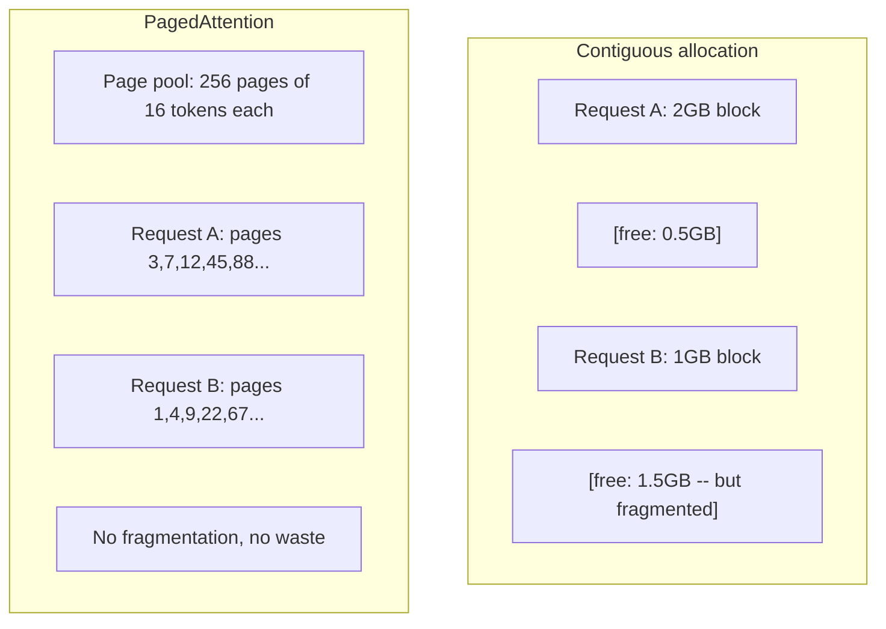
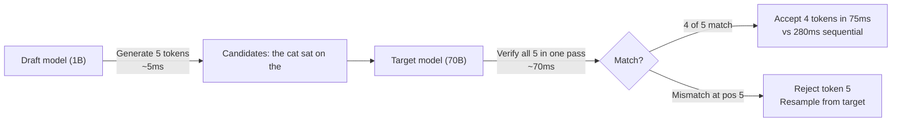

<!-- i18n:manual -->
# Оптимизация инференса

> Инференс LLM состоит из двух фаз. Prefill обрабатывает ваш промпт параллельно — упирается в вычисления. Decode генерирует токены по одному — упирается в память. Любая оптимизация целится в одну из фаз или в обе.

**Type:** Build
**Languages:** Python
**Prerequisites:** Phase 10, Lessons 01-08 (Transformer architecture, attention)
**Time:** ~120 minutes

## Learning Objectives

- Реализовать KV-кэш, чтобы убрать лишние вычисления при авторегрессионной генерации токенов
- Объяснить фазы prefill и decode при инференсе LLM и почему у каждой своё узкое место (compute-bound против memory-bound)
- Реализовать идеи continuous batching и PagedAttention, чтобы выжать максимум из GPU при одновременных запросах
- Сравнить техники оптимизации инференса (KV-кэш, speculative decoding, flash attention) и их компромиссы между пропускной способностью и задержкой

## The Problem

Вы разворачиваете Llama 3 70B на четырёх A100. Один пользователь получает примерно 50 токенов в секунду. Ощущается быстро. Потом в эндпоинт одновременно приходят 100 пользователей. Пропускная способность падает до 3 токенов в секунду на пользователя. Ваш счёт за GPU на $25 000 в месяц отдаёт ответы медленнее, чем человек печатает.

Сама модель между одним пользователем и сотней не меняется. Те же веса, та же архитектура, та же математика. Меняется то, как вы планируете работу. Наивный инференс выбрасывает на ветер 90 % и больше доступных вычислений GPU. Пользователь, ждущий 47-й токен, держит занятым целый слот батча, пока шина памяти GPU простаивает между матричными умножениями. А ведь промпт нового пользователя на 2000 токенов мог бы заполнить это мёртвое время полезной работой.

Это не проблема масштабирования. Это проблема планирования. Техники из этого урока — KV-кэширование, continuous batching, PagedAttention, speculative decoding, кэширование префиксов — и есть разница между счётом на $25 тысяч в месяц и счётом на $5 тысяч при том же трафике.

vLLM с Llama 3 70B на 4×A100-80GB выдаёт около 50 токенов в секунду на пользователя при низкой нагрузке и держит 15-25 токенов в секунду на пользователя при 100 одновременных запросах — за счёт continuous batching и PagedAttention. Без этих оптимизаций то же железо отдаёт 5 токенов в секунду на пользователя при той же нагрузке. Те же GPU, та же модель, пропускная способность в 4 раза выше.

> 🎒 **На пальцах.** Посчитайте деньги на токен. При 100 пользователях наивный сервер даёт 100 × 5 = 500 токенов в секунду со всего кластера, а vLLM — 100 × 20 = 2000. Железо одно и то же, счёт один и тот же, но цена одного токена отличается в четыре раза. Это как автобус: если возить по одному пассажиру, бензин на человека выходит вчетверо дороже, хотя автобус тот же.

## The Concept

### Prefill vs Decode

У каждого запроса на инференс LLM есть две разные фазы.

**Prefill** обрабатывает весь входной промпт. Все токены известны, поэтому attention считается параллельно по всей последовательности. Это большое матричное умножение — ядра GPU заняты делом. Узкое место здесь — вычисления: сколько FLOPS ваше железо выдаёт в секунду. A100 делает 312 TFLOPS (BF16). Prefill для промпта на 4096 токенов на модели 70B занимает около 400 мс на одной A100.

**Decode** генерирует выходные токены по одному. Каждый новый токен смотрит на все предыдущие, но за один forward pass рождается ровно один токен. Матрицы весов такие же, как при prefill, только теперь вы умножаете их на один вектор, а не на матрицу. Ядра GPU справляются за микросекунды, а потом ждут, пока из памяти приедет следующая порция весов. Узкое место — пропускная способность памяти: как быстро вы прокачиваете веса модели из HBM в вычислительные блоки. У A100 это 2 ТБ/с. Модель на 70B в FP16 весит 140 ГБ. Прочитать её целиком один раз — 70 мс, и это ваш пол для одного шага decode.



**Отношение ops:byte** (его же называют арифметической интенсивностью) описывает этот компромисс. Оно измеряет, сколько операций вы выполняете на каждый байт, загруженный из памяти.

```
ops:byte ratio = FLOPs per token / bytes read from memory
```

При prefill с батчем в 4096 токенов вы делаете около 4096 операций умножения-накопления на каждый загруженный вес. Отношение высокое — вы compute-bound. При decode с батчем 1 вы делаете примерно 1 операцию на загруженный вес. Отношение низкое — вы memory-bound.

Главная мысль: *decode упирается в память, потому что ради одного токена вы читаете модель целиком*. Каждая оптимизация ниже либо уменьшает объём чтения, либо увеличивает число токенов, обработанных за одно чтение, либо избавляется от чтения вовсе.

> 🎒 **На пальцах.** Ощутите разрыв в цифрах: prefill промпта на 4096 токенов — 400 мс, а один шаг decode — 70 мс. То есть за время prefill целого промпта вы породили бы всего 6 токенов. Аналогия: прочитать страницу глазами быстро, а писать ответ приходится по букве, и перед каждой буквой заново открывать весь учебник.

### KV Cache

При attention query каждого токена обращается к ключам и значениям всех предыдущих токенов. Без кэша генерация токена N требует пересчёта проекций key и value для всех N-1 предыдущих токенов. Токен 1 проецируется при генерации токена 2, потом снова для токена 3, потом снова для токена 4. К тысячному токену вы спроецировали токен 1 ровно 999 раз.

KV-кэш хранит проекции key и value всех предыдущих токенов. При генерации токена N вы считаете key и value только для токена N, а потом склеиваете их с закэшированными K/V токенов с 1 по N-1.



**Memory formula for KV cache:**

```
KV cache size = 2 * num_layers * num_kv_heads * head_dim * seq_len * bytes_per_param
```

Для Llama 3 70B (80 слоёв, 8 KV-голов с GQA, head_dim=128, BF16):

```
per token: 2 * 80 * 8 * 128 * 2 bytes = 327,680 bytes = 320 KB
at 4,096 tokens: 320 KB * 4,096 = 1.28 GB
at 128K tokens: 320 KB * 131,072 = 40 GB
```

Один диалог с контекстом 128K на Llama 3 70B съедает 40 ГБ KV-кэша — половину памяти A100. При 100 одновременных пользователях по 4K токенов один только KV-кэш требует 128 ГБ. Вот почему управление KV-кэшем — центральная задача оптимизации инференса.

> 🎒 **На пальцах.** Пройдите арифметику пальцем: 2 (это K и V) × 80 слоёв × 8 KV-голов × 128 чисел × 2 байта = 327 680 байт, то есть 320 КБ на один токен. Умножаем на 4096 токенов — 1.28 ГБ на один диалог. Сто таких диалогов — 128 ГБ, а во всех четырёх A100 памяти всего 320 ГБ, и 140 из них уже заняты весами модели.

### Continuous Batching

Статический батчинг ждёт, пока накопится N запросов, обрабатывает их вместе и не принимает новые, пока не закончат *все*. Если одному запросу нужно 500 токенов, а другому 10, короткий запрос простаивает 490 шагов decode после того, как закончил.

Continuous batching (его же называют батчингом на уровне итераций) подсовывает новые запросы в батч сразу, как только любой запрос завершился. Батч пересматривается на каждом шаге decode. Запрос, закончившийся после 10 токенов, тут же заменяется ожидающим.



Насколько вырастет пропускная способность, зависит от разброса длин ответов. При одинаковых длинах continuous batching равен статическому. При разных длинах (а это обычный случай) continuous batching даёт в 2-5 раз больше пропускной способности, потому что слоты GPU никогда не пустуют.

> 🎒 **На пальцах.** Возьмите диаграмму выше: R2 закончил на шаге 10, а следующий запрос при статическом батчинге стартует только на шаге 50. Это 40 шагов, где один из трёх слотов GPU крутит пустоту — треть железа в мусор. Continuous batching заводит R4 на шаге 11, и слот не остывает. Ровно как касса в супермаркете, которая зовёт следующего сразу, а не ждёт, пока разойдётся вся очередь.

### PagedAttention

KV-кэш каждого запроса — это непрерывный кусок памяти. Запросы приходят и уходят, память фрагментируется — точно так же, как оперативка в операционной системе. Запросу на 4K токенов нужно 1.28 ГБ подряд. Даже если суммарно свободно 2 ГБ, у вас может не найтись 1.28 ГБ *подряд*. Тогда вы либо теряете память, либо отклоняете запрос.

PagedAttention (из vLLM) применяет к KV-кэшу виртуальную память в духе операционных систем. Вместо одного непрерывного блока на запрос он выделяет «страницы» фиксированного размера (обычно по 16 токенов). Страницы могут лежать где угодно в физической памяти GPU. Таблица страниц отображает логические позиции последовательности запроса в физические адреса страниц.



PagedAttention ещё и включает **copy-on-write** для общих префиксов. Если 50 запросов делят один системный промпт, страницы KV-кэша этого промпта хранятся один раз, а ссылаются на них все 50 запросов. Свои страницы запрос получает только там, где он разошёлся с остальными (разные сообщения пользователя). Для приложений с общим системным промптом это режет расход памяти в разы.

vLLM сообщает о почти нулевых потерях памяти (около 4 % против 60-80 % при наивном выделении) благодаря PagedAttention.

> 🎒 **На пальцах.** Считаем потери: наивный аллокатор бронирует место под максимальную длину, и если ответ вышел на 300 токенов вместо забронированных 4096, то 90 % брони пропало. PagedAttention выдаёт кусочки по 16 токенов по мере надобности, поэтому перерасход не больше 15 токенов на запрос — те самые 4 %. Это как снимать номер в отеле посуточно, а не бронировать месяц вперёд на всякий случай.

### Speculative Decoding

Decode медленный, потому что он последовательный: сгенерировали токен, скормили обратно, генерируем следующий. А что если дёшево угадать сразу 5 следующих токенов, а потом проверить их все разом?

Speculative decoding использует маленькую быструю **draft-модель**, чтобы породить K токенов-кандидатов. Большая **target-модель** затем прогоняет все K кандидатов за один forward pass (а это выглядит как prefill — параллельно, compute-bound, эффективно). Если target-модель согласна с предсказаниями draft-модели, вы принимаете все K токенов за время одного прохода большой модели. Если она не согласна на позиции j, вы принимаете токены с 1 по j-1, а остальные выбрасываете.



Ускорение зависит от **доли принятия** — как часто предсказания draft-модели совпадают с target. Для Llama 3 8B в роли черновика для Llama 3 70B типична доля принятия 70-85 % на естественном языке. В переводе на скорость это ускорение decode в 2-3 раза.

Три подхода к speculative decoding:

| Method | Draft source | Acceptance rate | Overhead |
|--------|-------------|-----------------|----------|
| Draft-target (Leviathan et al.) | Отдельная маленькая модель | 70-85% | Память под draft-модель |
| EAGLE (Li et al.) | Лёгкая голова на target-модели | 75-90% | ~1% лишних параметров |
| N-gram lookup | Таблица n-грамм токенов | 40-60% | Пренебрежимо мало |

**EAGLE** обучает маленькую авторегрессионную голову поверх скрытых состояний target-модели. Она предсказывает эмбеддинг следующего токена по признакам предпоследнего слоя target-модели. Поскольку она работает на собственных представлениях target-модели, а не чужой модели, она достигает более высокой доли принятия при минимальном расходе памяти. EAGLE-2 добавляет динамическое дерево черновиков, которое подстраивает число кандидатов под контекст.

**N-gram speculative decoding** держит таблицу продолжений n-грамм из текущего контекста или из заранее собранного корпуса. Если черновик совпадает с тем, что уже встречалось в этом же диалоге (повторяющиеся паттерны, код, структурированный вывод), он срабатывает без единого прогона нейросети. Доля принятия в среднем ниже, но одна спекуляция обходится практически даром.

Speculative decoding *математически точен* — выходное распределение в точности совпадает с распределением target-модели. Это не приближение. Шаг проверки гарантирует, что у каждого принятого токена ровно та вероятность, которую назначила бы target-модель.

> 🎒 **На пальцах.** Посчитайте по диаграмме: черновик набрасывает 5 токенов за 5 мс, большая модель проверяет их все за один проход в 70 мс, приняли 4 — итого 75 мс на четыре токена. Поштучно те же четыре токена стоили бы 4 × 70 = 280 мс. Работает это потому, что большой модели почти всё равно, обрабатывать один токен или пять: она упирается в чтение весов из памяти, а не в арифметику.

### Prefix Caching

Многие запросы делят один и тот же префикс. Системный промпт чат-бота. Блок контекста в RAG. Набор few-shot примеров. Без кэширования префиксов каждый запрос пересчитывает KV-кэш для этих общих токенов с нуля.

Кэширование префиксов сохраняет KV-кэш для частых префиксов и переиспользует его между запросами. Когда приходит новый запрос с известным префиксом, система копирует (или ссылается на) закэшированные записи KV и считает KV только для уникального хвоста.

Для системного промпта на 2000 токенов, общего для всех запросов, кэширование префиксов убирает около 400 мс prefill на каждый запрос. При 100 запросах в секунду это экономит 40 секунд работы GPU каждую секунду — больше, чем выдаёт целая видеокарта.

RadixAttention из SGLang реализует кэширование префиксов через радиксное дерево (trie), которое индексирует префиксы по содержимому токенов. Любой запрос, совпавший с сохранённым префиксом, получает свой KV-кэш даром. Дерево умеет и частичные совпадения: если вы делите 1500 из 2000 токенов префикса с закэшированной записью, вы переиспользуете эти 1500 и пересчитываете только 500.

> 🎒 **На пальцах.** Откуда взялись 40 секунд в секунду: один запрос экономит 0.4 секунды работы GPU, запросов сотня в секунду, 0.4 × 100 = 40. Одна GPU выдаёт одну секунду работы в секунду, значит кэш префиксов заменил вам сорок видеокарт. Это как не перепечатывать шапку договора для каждого клиента, а держать готовый бланк и дописывать только имя.

### Inference Engines

В продакшен-обслуживании LLM правят три движка:

| Engine | Key innovation | Best for |
|--------|---------------|----------|
| vLLM | PagedAttention, continuous batching | Универсальный сервинг, максимальная совместимость |
| SGLang | RadixAttention (кэш префиксов), структурированная генерация | Многоходовые чат-боты, декодирование с ограничениями |
| TensorRT-LLM | Слияние ядер от NVIDIA, квантизация FP8 | Максимальная пропускная способность на одной GPU от NVIDIA |

**vLLM** — точка входа по умолчанию. Он поддерживает самый широкий набор моделей, работает на GPU любого вендора (NVIDIA, AMD, Intel) и даёт высокую пропускную способность за счёт PagedAttention плюс continuous batching. API, совместимый с OpenAI, означает, что вы подставляете его вместо любого вызова OpenAI API без переделок.

**SGLang** стоит на тех же основаниях, что и vLLM, но добавляет RadixAttention для кэширования префиксов и предметный язык для структурированных программ поверх LLM. Если ваша нагрузка — многоходовые диалоги, вызовы инструментов или декодирование с ограничениями (вывод JSON, генерация по регулярке), SGLang часто обгоняет vLLM в 2-5 раз за счёт переиспользования префиксов.

**TensorRT-LLM** компилирует модели в оптимизированные ядра для GPU NVIDIA. Он сливает операции (attention плюс linear плюс активация в одном ядре), использует FP8 на H100 и интегрируется с NVIDIA Triton Inference Server для продакшен-развёртывания. Он даёт наивысшую пропускную способность на одной GPU от NVIDIA, но требует больше возни при настройке и работает только на NVIDIA.

Реальные числа для Llama 3 70B (4×A100-80GB, BF16):

| Metric | vLLM | SGLang | TensorRT-LLM |
|--------|------|--------|---------------|
| Пропускная способность (1 пользователь) | ~50 TPS | ~55 TPS | ~65 TPS |
| Пропускная способность (100 пользователей) | ~2500 TPS суммарно | ~3200 TPS суммарно | ~3000 TPS суммарно |
| Время до первого токена | ~400 мс | ~300 мс (попадание в префикс) | ~350 мс |
| Максимальный контекст | 128K | 128K | 128K |

> 🎒 **На пальцах.** Обратите внимание на разрыв между строками таблицы: у одного пользователя разница между движками всего 50 против 65 токенов в секунду, а на сотне пользователей — 2500 против 3200 суммарно. Один пользователь меряет latency, сотня меряет пропускную способность, и это разные вещи. Выбирайте движок под ту строку, которая у вас в SLA, а не под ту, что красивее в бенчмарке.

### The Ops:Byte Framework

Нельзя оптимизировать то, что вы не измеряете. Отношение ops:byte говорит, во что вы упёрлись — в вычисления или в память, — а это определяет, какие оптимизации вообще имеют смысл.

```
Compute roof: peak FLOPS of the GPU
Memory roof:  peak bandwidth * ops:byte ratio
```

Когда ops:byte низкое (decode, маленькие батчи), вы упираетесь в потолок пропускной способности памяти. Добавлять вычислительную мощность (выше частота, больше ядер) бесполезно. Нужно сокращать чтения из памяти (квантизация, сжатие KV-кэша) или увеличивать батч, чтобы размазать чтения по большему объёму полезной работы.

Когда ops:byte высокое (prefill, большие батчи), вы упираетесь в потолок вычислений. Оптимизация памяти не поможет. Нужны более быстрые GPU, слияние ядер или пониженная точность, чтобы выжать больше FLOPS.

| Scenario | ops:byte | Bound | Optimize with |
|----------|----------|-------|---------------|
| Prefill, батч=1 | ~4096 | Вычисления | Слияние ядер, FP8 |
| Decode, батч=1 | ~1 | Память | Квантизация, сжатие KV |
| Decode, батч=32 | ~32 | Память | Батч побольше, continuous batching |
| Decode, батч=256 | ~256 | Переходная зона | Важно и то, и другое |
| Decode, батч=1024 | ~1024 | Вычисления | Слияние ядер, тензорный параллелизм |

Точка перехода на A100 — примерно ops:byte = 156 (312 TFLOPS / 2 ТБ/с). Ниже 156 вы memory-bound. Выше 156 вы compute-bound. Continuous batching толкает decode к этой точке, упаковывая больше токенов в одну итерацию.

```figure
context-window-slide
```

> 🎒 **На пальцах.** Число 156 получается делением: 312 триллионов операций в секунду на 2 триллиона байт в секунду — столько операций надо сделать на каждый байт, чтобы железо было загружено ровно. Теперь посмотрите в таблицу: decode с батчем 32 даёт ops:byte около 32, то есть загрузка примерно 32/156 ≈ 20 %. Именно поэтому батч 256 из следующей строки — не жадность, а способ догнать железо до его же потолка.

## Build It

### Step 1: KV Cache from Scratch

Мы строим многоголовый KV-кэш, который хранит проекции key и value по слоям и по головам и наглядно показывает, как растёт память.

```python
import numpy as np

class KVCache:
    def __init__(self, num_layers, num_heads, head_dim, max_seq_len, dtype=np.float16):
        self.num_layers = num_layers
        self.num_heads = num_heads
        self.head_dim = head_dim
        self.max_seq_len = max_seq_len
        self.dtype = dtype

        self.k_cache = np.zeros(
            (num_layers, num_heads, max_seq_len, head_dim), dtype=dtype
        )
        self.v_cache = np.zeros(
            (num_layers, num_heads, max_seq_len, head_dim), dtype=dtype
        )
        self.seq_len = 0

    def update(self, layer_idx, new_keys, new_values):
        num_new = new_keys.shape[1]
        end = self.seq_len + num_new
        self.k_cache[layer_idx, :, self.seq_len:end, :] = new_keys
        self.v_cache[layer_idx, :, self.seq_len:end, :] = new_values
        return (
            self.k_cache[layer_idx, :, :end, :],
            self.v_cache[layer_idx, :, :end, :]
        )

    def advance(self, num_tokens):
        self.seq_len += num_tokens

    def memory_bytes(self):
        return self.k_cache.nbytes + self.v_cache.nbytes

    def used_bytes(self):
        per_token = 2 * self.num_layers * self.num_heads * self.head_dim * np.dtype(self.dtype).itemsize
        return per_token * self.seq_len
```

> 🎒 **На пальцах.** Смотрите на `np.zeros`: кэш выделяется сразу под `max_seq_len`, поэтому `memory_bytes()` — это забронированный объём, а `used_bytes()` — реально занятый. Для 32 слоёв, 32 голов, head_dim=128 и fp16 один токен стоит 2 × 32 × 32 × 128 × 2 = 524 288 байт, то есть полмегабайта. Метод `advance` двигает единственный счётчик `seq_len` — вся «магия» кэша сводится к тому, чтобы писать в правильное окно массива.

### Step 2: Attention with KV Cache

Упрощённый multi-head attention, который использует KV-кэш на шагах decode.

```python
def scaled_dot_product_attention(query, keys, values):
    head_dim = query.shape[-1]
    scores = np.matmul(query, keys.transpose(0, 1, 3, 2)) / np.sqrt(head_dim)
    seq_len_q = scores.shape[-2]
    seq_len_k = scores.shape[-1]
    if seq_len_q > 1:
        mask = np.triu(np.ones((seq_len_q, seq_len_k), dtype=np.float32), k=seq_len_k - seq_len_q + 1)
        scores = scores + mask * (-1e9)
    max_scores = np.max(scores, axis=-1, keepdims=True)
    exp_scores = np.exp(scores - max_scores)
    attn_weights = exp_scores / np.sum(exp_scores, axis=-1, keepdims=True)
    return np.matmul(attn_weights, values)


class MultiHeadAttention:
    def __init__(self, d_model, num_heads):
        self.num_heads = num_heads
        self.head_dim = d_model // num_heads
        scale = np.sqrt(2.0 / d_model)
        self.W_q = np.random.randn(d_model, d_model).astype(np.float32) * scale
        self.W_k = np.random.randn(d_model, d_model).astype(np.float32) * scale
        self.W_v = np.random.randn(d_model, d_model).astype(np.float32) * scale
        self.W_o = np.random.randn(d_model, d_model).astype(np.float32) * scale

    def forward(self, x, kv_cache=None, layer_idx=0):
        batch, seq_len, d_model = x.shape
        Q = np.matmul(x, self.W_q).reshape(batch, seq_len, self.num_heads, self.head_dim).transpose(0, 2, 1, 3)
        K = np.matmul(x, self.W_k).reshape(batch, seq_len, self.num_heads, self.head_dim).transpose(0, 2, 1, 3)
        V = np.matmul(x, self.W_v).reshape(batch, seq_len, self.num_heads, self.head_dim).transpose(0, 2, 1, 3)

        if kv_cache is not None:
            K_full, V_full = kv_cache.update(layer_idx, K[0], V[0])
            K = K_full[np.newaxis, :, :, :]
            V = V_full[np.newaxis, :, :, :]
            if seq_len == 1:
                kv_cache.advance(1)

        attn_out = scaled_dot_product_attention(Q, K, V)
        attn_out = attn_out.transpose(0, 2, 1, 3).reshape(batch, -1, d_model)
        return np.matmul(attn_out, self.W_o)
```

### Step 3: Continuous Batching Simulator

Здесь мы моделируем разницу в планировании между статическим и continuous батчингом.

```python
import heapq

class Request:
    def __init__(self, request_id, prompt_tokens, output_tokens, arrival_step):
        self.request_id = request_id
        self.prompt_tokens = prompt_tokens
        self.output_tokens = output_tokens
        self.arrival_step = arrival_step
        self.tokens_generated = 0
        self.start_step = None
        self.end_step = None

    def is_done(self):
        return self.tokens_generated >= self.output_tokens


def simulate_static_batching(requests, batch_size):
    step = 0
    completed = []
    queue = list(requests)
    queue.sort(key=lambda r: r.arrival_step)

    while queue:
        batch = []
        while queue and len(batch) < batch_size:
            r = queue.pop(0)
            r.start_step = max(step, r.arrival_step)
            batch.append(r)

        if batch:
            step = max(step, max(r.start_step for r in batch))
            max_output = max(r.output_tokens for r in batch)
            for r in batch:
                r.tokens_generated = r.output_tokens
                r.end_step = step + max_output
            step += max_output
            completed.extend(batch)

    return completed


def simulate_continuous_batching(requests, batch_size):
    step = 0
    completed = []
    queue = sorted(requests, key=lambda r: r.arrival_step)
    queue_idx = 0
    active = []
    waiting = []

    while queue_idx < len(queue) or active or waiting:
        while queue_idx < len(queue) and queue[queue_idx].arrival_step <= step:
            waiting.append(queue[queue_idx])
            queue_idx += 1

        while waiting and len(active) < batch_size:
            r = waiting.pop(0)
            r.start_step = step
            active.append(r)

        if not active:
            if waiting:
                step += 1
                continue
            elif queue_idx < len(queue):
                step = queue[queue_idx].arrival_step
                continue
            else:
                break

        for r in active:
            r.tokens_generated += 1

        done = [r for r in active if r.is_done()]
        for r in done:
            r.end_step = step + 1
            completed.append(r)
        active = [r for r in active if not r.is_done()]

        step += 1

    return completed


def batching_stats(completed):
    latencies = [r.end_step - r.arrival_step for r in completed]
    total_time = max(r.end_step for r in completed) - min(r.arrival_step for r in completed)
    total_tokens = sum(r.output_tokens for r in completed)
    return {
        "avg_latency": np.mean(latencies),
        "p50_latency": np.median(latencies),
        "p99_latency": np.percentile(latencies, 99),
        "total_time": total_time,
        "throughput": total_tokens / total_time if total_time > 0 else 0,
    }
```

> 🎒 **На пальцах.** Сравните две функции построчно. В `simulate_static_batching` есть строка `max_output = max(r.output_tokens for r in batch)` — весь батч платит по самому длинному запросу. В `simulate_continuous_batching` такой строки нет: каждый шаг цикла делает `r.tokens_generated += 1` для активных, выкидывает готовых и тут же добирает новых из `waiting`. Если в батче ответы на 500 и на 10 токенов, первая функция задержит короткий на 490 шагов, вторая — ни на один.

### Step 4: Prefix Cache

Кэш префиксов на основе trie, который хранит записи KV для общих префиксов.

```python
class TrieNode:
    def __init__(self):
        self.children = {}
        self.kv_data = None
        self.hit_count = 0


class PrefixCache:
    def __init__(self, max_entries=1000):
        self.root = TrieNode()
        self.max_entries = max_entries
        self.total_entries = 0
        self.hits = 0
        self.misses = 0

    def _walk(self, token_ids):
        node = self.root
        depth = 0
        for tid in token_ids:
            if tid not in node.children:
                break
            node = node.children[tid]
            depth += 1
        return node, depth

    def lookup(self, token_ids):
        node, depth = self._walk(token_ids)
        if depth > 0:
            self.hits += 1
            current = self.root
            for tid in token_ids[:depth]:
                current = current.children[tid]
                current.hit_count += 1
            kv_entries = []
            current = self.root
            for tid in token_ids[:depth]:
                current = current.children[tid]
                if current.kv_data is not None:
                    kv_entries.append(current.kv_data)
            return depth, kv_entries
        self.misses += 1
        return 0, []

    def insert(self, token_ids, kv_per_token):
        node = self.root
        for i, tid in enumerate(token_ids):
            if tid not in node.children:
                if self.total_entries >= self.max_entries:
                    return i
                node.children[tid] = TrieNode()
                self.total_entries += 1
            node = node.children[tid]
            if i < len(kv_per_token):
                node.kv_data = kv_per_token[i]
        return len(token_ids)

    def hit_rate(self):
        total = self.hits + self.misses
        return self.hits / total if total > 0 else 0.0
```

> 🎒 **На пальцах.** Trie — это дерево, где путь от корня и есть последовательность токенов. Метод `_walk` идёт по дереву, пока токены совпадают, и возвращает `depth` — длину совпавшего префикса. Если два запроса начинаются с одного системного промпта на 2000 токенов, `_walk` вернёт 2000 и весь этот prefill будет пропущен. Так же работает подсказка в адресной строке браузера: общее начало ищется по дереву, а не перебором всех строк.

### Step 5: Speculative Decoding Simulator

Мы моделируем speculative decoding по схеме draft-target с настраиваемой долей принятия.

```python
class DraftModel:
    def __init__(self, vocab_size, acceptance_rate=0.8):
        self.vocab_size = vocab_size
        self.acceptance_rate = acceptance_rate

    def generate(self, context, num_tokens):
        tokens = np.random.randint(0, self.vocab_size, size=num_tokens)
        return tokens

    def get_probs(self, context, token):
        probs = np.random.dirichlet(np.ones(self.vocab_size))
        return probs


class TargetModel:
    def __init__(self, vocab_size):
        self.vocab_size = vocab_size

    def get_probs(self, context, tokens=None):
        if tokens is not None:
            return [np.random.dirichlet(np.ones(self.vocab_size)) for _ in tokens]
        return np.random.dirichlet(np.ones(self.vocab_size))


def speculative_decode(draft_model, target_model, context, num_speculative=5,
                       draft_cost=1.0, target_cost=10.0, verify_cost=12.0):
    total_tokens = 0
    total_cost = 0.0
    accepted_counts = []
    context = list(context)

    max_tokens = 100

    while total_tokens < max_tokens:
        draft_tokens = draft_model.generate(context, num_speculative)
        total_cost += draft_cost * num_speculative

        target_probs = target_model.get_probs(context, draft_tokens)
        total_cost += verify_cost

        accepted = 0
        for i, token in enumerate(draft_tokens):
            draft_p = draft_model.get_probs(context + list(draft_tokens[:i]), token)
            target_p = target_probs[i]

            r = np.random.random()
            acceptance_prob = min(1.0, target_p[token] / (draft_p[token] + 1e-10))

            if r < draft_model.acceptance_rate:
                accepted += 1
                context.append(token)
                total_tokens += 1
            else:
                new_token = np.random.choice(draft_model.vocab_size, p=target_p)
                context.append(new_token)
                total_tokens += 1
                break

        accepted_counts.append(accepted)

        if accepted == num_speculative:
            bonus_probs = target_model.get_probs(context)
            bonus_token = np.random.choice(draft_model.vocab_size, p=bonus_probs)
            context.append(bonus_token)
            total_tokens += 1

    sequential_cost = total_tokens * target_cost
    return {
        "total_tokens": total_tokens,
        "speculative_cost": total_cost,
        "sequential_cost": sequential_cost,
        "speedup": sequential_cost / total_cost if total_cost > 0 else 1.0,
        "avg_accepted": np.mean(accepted_counts),
        "acceptance_rate": np.mean(accepted_counts) / num_speculative,
    }


def compare_speculation_strategies(vocab_size=1000, num_trials=20):
    results = {}

    for name, acceptance_rate, spec_tokens in [
        ("Draft-target (8B->70B)", 0.78, 5),
        ("EAGLE", 0.85, 6),
        ("N-gram", 0.50, 4),
        ("No speculation", 0.0, 0),
    ]:
        if spec_tokens == 0:
            results[name] = {
                "speedup": 1.0,
                "acceptance_rate": 0.0,
                "avg_accepted": 0.0,
            }
            continue

        trial_results = []
        for _ in range(num_trials):
            draft = DraftModel(vocab_size, acceptance_rate=acceptance_rate)
            target = TargetModel(vocab_size)
            context = list(np.random.randint(0, vocab_size, size=10))
            result = speculative_decode(draft, target, context, num_speculative=spec_tokens)
            trial_results.append(result)

        results[name] = {
            "speedup": np.mean([r["speedup"] for r in trial_results]),
            "acceptance_rate": np.mean([r["acceptance_rate"] for r in trial_results]),
            "avg_accepted": np.mean([r["avg_accepted"] for r in trial_results]),
        }

    return results
```

### Step 6: KV Cache Memory Profiler

Считаем требования KV-кэша к памяти для реальных конфигураций моделей.

```python
MODEL_CONFIGS = {
    "Llama-3-8B": {
        "num_layers": 32, "num_kv_heads": 8, "head_dim": 128,
        "model_params_b": 8, "gqa": True,
    },
    "Llama-3-70B": {
        "num_layers": 80, "num_kv_heads": 8, "head_dim": 128,
        "model_params_b": 70, "gqa": True,
    },
    "Llama-3-405B": {
        "num_layers": 126, "num_kv_heads": 8, "head_dim": 128,
        "model_params_b": 405, "gqa": True,
    },
    "Mistral-7B": {
        "num_layers": 32, "num_kv_heads": 8, "head_dim": 128,
        "model_params_b": 7, "gqa": True,
    },
    "GPT-4-est": {
        "num_layers": 120, "num_kv_heads": 96, "head_dim": 128,
        "model_params_b": 1800, "gqa": False,
    },
}


def kv_cache_memory(config, seq_len, dtype_bytes=2):
    per_token = 2 * config["num_layers"] * config["num_kv_heads"] * config["head_dim"] * dtype_bytes
    total = per_token * seq_len
    return {
        "per_token_bytes": per_token,
        "per_token_kb": per_token / 1024,
        "total_bytes": total,
        "total_mb": total / (1024 ** 2),
        "total_gb": total / (1024 ** 3),
    }


def memory_budget(config, gpu_memory_gb, model_dtype_bytes=2, kv_dtype_bytes=2):
    model_memory_gb = config["model_params_b"] * 1e9 * model_dtype_bytes / (1024 ** 3)
    overhead_gb = gpu_memory_gb * 0.1
    available_for_kv = gpu_memory_gb - model_memory_gb - overhead_gb

    if available_for_kv <= 0:
        return {"error": "Model does not fit in GPU memory", "model_memory_gb": model_memory_gb}

    per_token = 2 * config["num_layers"] * config["num_kv_heads"] * config["head_dim"] * kv_dtype_bytes
    max_tokens = int(available_for_kv * (1024 ** 3) / per_token)

    return {
        "gpu_memory_gb": gpu_memory_gb,
        "model_memory_gb": round(model_memory_gb, 1),
        "overhead_gb": round(overhead_gb, 1),
        "available_for_kv_gb": round(available_for_kv, 1),
        "max_total_tokens": max_tokens,
        "max_users_at_2k": max_tokens // 2048,
        "max_users_at_4k": max_tokens // 4096,
        "max_users_at_32k": max_tokens // 32768,
    }
```

> 🎒 **На пальцах.** Загляните в `MODEL_CONFIGS` и сравните две строки: у Llama-3-70B восемь KV-голов (GQA), а у GPT-4-est — девяносто шесть без GQA. Подставьте их в `kv_cache_memory`: 2 × 80 × 8 × 128 × 2 = 320 КБ на токен против 2 × 120 × 96 × 128 × 2 = 5.6 МБ. Разница в семнадцать раз — вот почему GQA стал обязательным для длинного контекста. Функция `memory_budget` доводит мысль до конца: она вычитает веса и накладные расходы и говорит, сколько пользователей влезет.

## Use It

С vLLM:

```python
from vllm import LLM, SamplingParams

llm = LLM(
    model="meta-llama/Llama-3-70B-Instruct",
    tensor_parallel_size=4,
    enable_prefix_caching=True,
    max_model_len=8192,
    gpu_memory_utilization=0.9,
)

params = SamplingParams(temperature=0.7, max_tokens=256)
outputs = llm.generate(["Explain inference optimization in one paragraph."], params)
```

С SGLang для кэширования префиксов и структурированного вывода:

```python
import sglang as sgl

@sgl.function
def classify(s, text):
    s += sgl.system("You are a classifier. Output JSON only.")
    s += sgl.user(f"Classify this text: {text}")
    s += sgl.assistant(sgl.gen("result", regex=r'\{"label": "(positive|negative|neutral)"\}'))

runtime = sgl.Runtime(model_path="meta-llama/Llama-3-70B-Instruct", tp_size=4)
sgl.set_default_backend(runtime)

results = classify.run_batch([
    {"text": "This product is amazing!"},
    {"text": "Terrible experience."},
    {"text": "It was okay I guess."},
])
```

С TensorRT-LLM:

```python
import tensorrt_llm
from tensorrt_llm.runtime import ModelRunner

runner = ModelRunner.from_dir("./llama-70b-trt-engine/", rank=0)

outputs = runner.generate(
    batch_input_ids=[tokenizer.encode("Explain KV caching.")],
    max_new_tokens=256,
    temperature=0.7,
)
```

## Ship It

Этот урок производит:
- `outputs/skill-inference-optimization.md` — навык для диагностики и оптимизации сервинга LLM

## Exercises

1. Доработайте профайлер KV-кэша, чтобы сравнить квантизацию кэша в FP16, FP8 и INT4. Для Llama 3 70B на контексте 4K посчитайте максимальное число одновременных пользователей для каждого варианта на 4×A100-80GB. Квантизация KV в INT4 должна поднять вместимость примерно вчетверо.

2. Расширьте симулятор continuous batching, чтобы он отслеживал загрузку GPU (доля заполненных слотов батча на каждом шаге). Постройте график загрузки во времени для статического и continuous батчинга на 50 запросах, длины ответов которых распределены по Парето (shape=1.5, scale=20). Continuous batching должен держать загрузку выше 80 %.

3. Реализуйте вариант KV-кэша с grouped-query attention (GQA), где `num_kv_heads < num_query_heads`. Llama 3 70B использует 64 query-головы и всего 8 KV-голов. Посчитайте экономию памяти против полного multi-head attention (KV-кэш меньше в 8 раз).

4. Постройте кэш префиксов с вытеснением по LRU. Задайте max_entries равным 500 и сгенерируйте 1000 запросов, где 60 % делят один из 5 популярных префиксов. Измерьте долю попаданий и сравните с кэшем без ограничений. При хорошем вытеснении доля попаданий должна остаться выше 55 %.

5. Расширьте симулятор speculative decoding до древовидной спекуляции в духе EAGLE-2. Вместо одной цепочки из K черновых токенов порождайте дерево кандидатов (например, 2 ветки на каждом из 3 уровней — 8 листьев-кандидатов). Сравните число принятых токенов за раунд проверки с линейной спекуляцией.

> 🎒 **На пальцах.** Подсказка к третьему заданию: экономия считается прямо в формуле KV-кэша. Замените в ней 64 на 8 — размер падает ровно в 8 раз, с 2.56 МБ на токен до 320 КБ. Query-голов по-прежнему 64, просто восемь из них делят один комплект ключей и значений. Это как 64 читателя на 8 экземпляров книги вместо 64 экземпляров на полке.

## Key Terms

| Term | What people say | What it actually means |
|------|----------------|----------------------|
| Prefill | «Обработка промпта» | Вычисление attention по всем входным токенам параллельно — упирается в вычисления, потому что большое матричное умножение загружает ядра GPU. |
| Decode | «Генерация токенов» | Один токен за один forward pass с полным чтением весов модели каждый раз — упирается в память, потому что счёт заканчивается раньше, чем приезжают следующие веса. |
| KV cache | «Кэширование состояний attention» | Хранение проекций key и value всех предыдущих токенов, чтобы не пересчитывать их на каждом шаге decode — меняем память на вычисления. |
| Continuous batching | «Динамический батчинг» | Вставка новых запросов в работающий батч сразу после завершения любого запроса, с пересмотром на каждой итерации decode вместо ожидания всего батча. |
| PagedAttention | «Виртуальная память для KV-кэша» | Выделение KV-кэша страницами фиксированного размера вместо непрерывных блоков — убирает фрагментацию и включает copy-on-write для общих префиксов. |
| Speculative decoding | «Черновик и проверка» | Быстрая draft-модель предлагает несколько токенов, target-модель проверяет их все за один проход — математически точно, ускорение в 2-3 раза. |
| EAGLE | «Само-спекулятивное декодирование» | Вариант speculative decoding, где лёгкая голова обучается на собственных скрытых состояниях target-модели и даёт долю принятия выше, чем отдельная draft-модель. |
| Prefix caching | «Переиспользование KV системного промпта» | Хранение готовых записей KV-кэша для частых префиксов (системные промпты, few-shot примеры) и их переиспользование между запросами, чтобы пропустить лишний prefill. |
| Ops:byte ratio | «Арифметическая интенсивность» | Отношение числа операций к числу прочитанных байт — определяет, упирается ли нагрузка в вычисления (высокое отношение) или в память (низкое). |
| Time to first token | «TTFT» | Задержка от получения запроса до выдачи первого выходного токена — на длинных промптах определяется временем prefill. |

## Further Reading

- Kwon et al., "Efficient Memory Management for Large Language Model Serving with PagedAttention" (2023) — статья про vLLM, которая ввела постраничное управление KV-кэшем; сегодня это индустриальный стандарт сервинга инференса
- Leviathan et al., "Fast Inference from Transformers via Speculative Decoding" (2023) — основополагающая работа, доказавшая, что схема «черновик плюс проверка» даёт в точности распределение target-модели и при этом ускоряет в 2-3 раза
- Li et al., "EAGLE: Speculative Sampling Requires Rethinking Feature Uncertainty" (2024) — поднимает долю принятия за счёт обучения головы на собственных признаках target-модели вместо отдельной draft-модели
- Zheng et al., "SGLang: Efficient Execution of Structured Language Model Programs" (2024) — вводит RadixAttention для кэширования префиксов и модель программирования для многовызовных LLM-программ
- Williams et al., "Roofline: An Insightful Visual Performance Model for Multicore Architectures" (2009) — исходная статья про roofline, формализовавшая подход ops:byte для рассуждений о вычислительных и memory-узких местах
