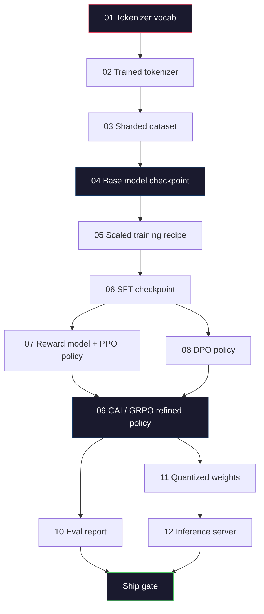
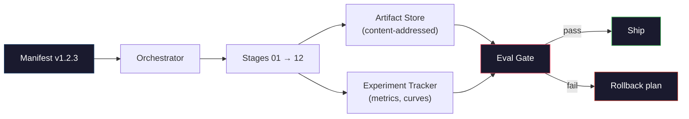

<!-- i18n:manual -->
# Собираем полный пайплайн LLM

> Всё из уроков 01-12 — это по одной стадии одного пайплайна. Этот урок — каркас, который превращает те стадии в единый сквозной прогон: токенизация, предобучение, масштабирование, SFT, выравнивание, оценка, квантизация, обслуживание. Модель на 70B вы на ноутбуке не обучите. Зато вы соберёте слой оркестрации, манифест, eval-гейт и план отката — то, чем frontier-команда 2026 года решает, что вообще идёт в релиз. Это капстоун.

**Type:** Build
**Languages:** Python (stdlib)
**Prerequisites:** All Phase 10 lessons 01-12
**Time:** ~120 minutes

## Learning Objectives

- Собрать одиннадцать предыдущих уроков (токенизатор, данные, предобучение, масштабирование, SFT, RLHF, DPO, CAI, оценка, квантизация, инференс) в одну воспроизводимую спецификацию пайплайна
- Определить контракт артефактов между стадиями: что каждая стадия потребляет, что производит и как следующая проверяет вход
- Построить оркестратор, который ведёт учёт экспериментов, хеширует артефакты и пропускает решение о релизе только через пороги на метриках
- Продумать план отката: какие артефакты дёшево пересчитать, какие дорого и сколько стоит испорченный чекпоинт

## The Problem

Каждый предыдущий урок работает. Токенизатор обучен. Крошечный GPT предобучен. Датасет для SFT собран. Модель награды обучена. DPO прогнан. Метрики измерены. Квантованные веса выгружены. Сервер инференса поднят. Каждый из них — блокнот. У каждого свои соглашения, свои пути вывода, свой seed.

Frontier-прогон обучения — это не блокнот. Llama 3 405B потребовала 30 миллионов H100-часов примерно за 54 дня. DeepSeek-V3 — около 2,8 миллиона H800-часов. За это время один испорченный чекпоинт, одно загрязнение данных, одна регрессия на метриках стоят команде недели календарного времени и месяца GPU-бюджета. Выживают за счёт гигиены пайплайна: у каждой стадии детерминированный вход, детерминированный выход, манифест, хеш и гейт.

Это капстоун. Прогонять пайплайн целиком на ноутбуке вы не будете. Вы напишете оркестратор, который координирует стадии, манифест, который описывает прогон, верификатор, который решает вопрос релиза, и план повтора, позволяющий постороннему человеку воспроизвести вашу работу по одному файлу. Кода мало; дисциплины много.

Паттерн масштабируется от 100M до 1T параметров без изменений. Те же четыре компонента — манифест, оркестратор, eval-гейт, хранилище артефактов — обслуживают и Llama 3, и ваш домашний GPT. Отличается размер чисел внутри конфига каждой стадии, а не форма пайплайна.

> 🎒 **На пальцах.** 30 миллионов GPU-часов при аренде около $2.5 за час — это порядка $75 миллионов. Разделите на 54 дня: примерно $1.4 миллиона в сутки. Теперь понятно, почему манифест и хеши не бюрократия: сутки, потерянные на испорченном чекпоинте, стоят как хорошая квартира.

## The Concept

### The Twelve Stages

Каждый урок Phase 10 — это стадия. Вот полный граф зависимостей.



Стадии 07 и 08 можно гонять параллельно. Всё остальное — жёсткие зависимости. Изменение в стадии 02 (токенизатор) обесценивает каждый артефакт ниже по течению. Изменение в стадии 10 (оценка) обесценивает только решение о релизе.

> 🎒 **На пальцах.** Граф читается как рецепт с ветвлением. Поменяли токенизатор — все двенадцать шагов насмарку, потому что модель училась на других номерах токенов. Поменяли только набор бенчмарков — веса остались прежними, пересчитать надо один отчёт. Разница в цене между этими двумя правками — недели против часа.

### The Manifest

Манифест — это один файл, описывающий прогон достаточно полно, чтобы его повторить. Ничто из произведённого пайплайном не должно зависеть от состояния, которого нет в манифесте. Поля скучные и обязательные.

```
pipeline_version: 1.2.3
seed: 42
git_commit: a1b2c3d4
stages:
  01_tokenizer:
    recipe: bpe_32k
    input_hash: sha256:...
    output_hash: sha256:...
    wall_clock_sec: 3600
    cost_usd: 12
```

Выходной хеш стадии N — это входной хеш стадии N+1. Любое расхождение — и пайплайн останавливается. Так вы ловите порчу данных на ранней стадии. Так же коллега с другого континента убеждается, что его повтор дал тот же артефакт, что и ваш.

На практике команды берут небольшую схему YAML плюс проверщик манифеста, который диффает текущий прогон с предыдущим успешным. Любая дельта вне ожидаемых полей (стоимость, время) — красный флаг.

> 🎒 **На пальцах.** Хеш здесь работает как пломба на посылке. Стадия 03 выдала датасет с отпечатком `sha256:abc…`, и стадия 04 отказывается стартовать, если на входе лежит что-то с другим отпечатком. Кто-то дописал в датасет ещё сто файлов — пломба сорвана, прогон встал сразу, а не через две недели обучения.

### Artifact Typing

Выход каждой стадии — типизированный артефакт. Не каталог с чем попало, не pickle, а именованный тип с известной схемой.

| Stage | Artifact Type | Key Fields |
|-------|--------------|-----------|
| 01-02 | Tokenizer | vocab.json, merges.txt, config.json, хеш |
| 03 | Dataset | shards[], число строк, число токенов, статистика дедупликации |
| 04-05 | Checkpoint | weights.safetensors, config.json, состояние оптимизатора, номер шага |
| 06 | SFT Model | чекпоинт + рецепт SFT + состав данных |
| 07 | Reward Model | чекпоинт RM + хеш данных предпочтений |
| 08-09 | Policy | чекпоинт + хеш референса + beta + израсходованный KL-бюджет |
| 10 | Eval Report | баллы на бенчмарках + диффы регрессий + хеш данных оценки |
| 11 | Quantized Model | квантованные веса + калибровочные данные + просадка точности против FP16 |
| 12 | Server Spec | эндпоинт + хеш модели + конфиг + хуки наблюдаемости |

Типизация предотвращает самый частый провал: подсунуть выход стадии 08 на вход стадии 06 и отправить обученную через DPO модель по пути SFT. Типизированные артефакты и типизированные сигнатуры стадий превращают такие ошибки в отказ на этапе сборки, а не в сюрприз на пятый день.

> 🎒 **На пальцах.** Это как разъёмы у зарядок: USB-C физически не влезет в HDMI, поэтому перепутать невозможно. Здесь роль формы разъёма играет тип артефакта. Без него `model.pt` от DPO и `model.pt` от SFT выглядят одинаково, и различие обнаружится только по странным метрикам через неделю.

### The Eval Gate

Релиз — это не «обучение закончилось». Релиз — это «обучение закончилось и eval-гейт пройден». Гейт определяют до старта прогона.

```
gates:
  mmlu:      >= baseline + 0.5   # no regression
  humaneval: >= baseline + 1.0
  truthfulqa: >= baseline         # no drop
  safety_refusal_rate: <= 0.05
  kl_from_reference: <= 25.0
  cost_total_usd: <= 50000
```

Каждый гейт — числовой порог. Никаких гейтов «вроде норм». Никаких субъективных виз. Если все пороги пройдены, артефакт помечается пригодным к релизу. Если хоть один провален, прогон встаёт до явного override от поимённо названного ревьюера, и сам override тоже пишется в манифест.

Два гейта ловят большинство катастроф. Гейт на *регрессию* (новая модель должна быть не хуже предыдущей на основных бенчмарках) ловит баги обучения. Гейт на *KL-бюджет* (выровненная политика не должна уползти от референса дальше чем на X) ловит перевыравнивание. В любом продакшен-пайплайне есть оба.

> 🎒 **На пальцах.** Посмотрите на строку `safety_refusal_rate: <= 0.05`. Это не «модель кажется безопасной», а «на нашем наборе провокаций она обязана отказывать не реже, чем в 95% случаев». Число можно проверить скриптом в три часа ночи без совещания. В этом весь смысл гейтов: решение о релизе принимает арифметика, а не усталый человек.

### The Orchestrator

Небольшой кусок кода, который читает манифест, запускает стадии, отслеживает артефакты и останавливается при любом нарушении контракта. Это не Airflow. Это не Kubeflow. Для гигиены пайплайна нужна скучная штука, написанная вами.

Работа оркестратора узкая:

1. Развернуть DAG из манифеста.
2. Для каждой стадии проверить, не лежит ли ожидаемый выход с правильным хешем уже на месте (если да — пропустить).
3. Запустить стадию, собрать stdout/stderr, замерить время и стоимость.
4. Сверить выходной хеш с ожидаемым входным хешем следующей стадии.
5. При падении записать частичный манифест с точным указанием упавшей стадии и выйти с ненулевым кодом.

Это 200 строк Python. Выглядеть будет как файл `code/main.py` в этом уроке. Под капотом настоящий пайплайн запускает отдельные стадии на кластере через `torchrun` или `ray`, но сам оркестратор живёт на одной машине.

> 🎒 **На пальцах.** Пункт 2 экономит больше всего денег. Упала стадия 11 из 12 — при перезапуске оркестратор видит, что у стадий 01-10 хеши на месте, и просто их пропускает. Вместо повторных недель обучения вы платите за один шаг. Кеширование по хешу, а не по имени файла, — вся хитрость.

### Experiment Tracking and Artifact Storage

Пайплайн держится на двух внешних системах.

**Experiment tracker (wandb, neptune, mlflow).** Пишет кривые лосса, метрики оценки, системную телеметрию по каждой стадии. Трекер — это то место, куда вы придёте через три недели сравнивать прогон A с прогоном B. Команды почти всегда берут готовый хостинг: писать свой — это время, которое должно уходить в обучение.

**Artifact store (S3, R2, GCS).** Неизменяемое объектное хранилище для чекпоинтов, датасетов, токенизаторов, отчётов об оценке. Артефакты адресуются хешем, а не именем файла. Имя вроде `latest.pt` — это граната с выдернутой чекой; `ckpt-7b-step-20000-sha256:abc123.safetensors` — это контракт.

Оркестратор пишет в оба. Трекер — для людей, которые смотрят графики. Хранилище артефактов — для следующей стадии, которая ищет свои входы.

> 🎒 **На пальцах.** Почему `latest.pt` опасен: два человека выложили под этим именем разные веса, и теперь никто не знает, чей чекпоинт сейчас в проде. Имя с хешем такого не допускает — содержимое изменилось, значит изменилось и имя. Ссылаться на артефакт по хешу — то же самое, что ссылаться на коммит по SHA, а не по «последний в main».

### Costing

У frontier-прогона есть ценник в долларах. Бюджетная дисциплина живёт в двух местах.

**Pre-run estimate.** По манифесту считаем ожидаемые FLOPs (для предобучения: 6 × параметры × токены), ожидаемые GPU-часы (FLOPs / пиковая пропускная способность / утилизация) и стоимость по текущей арендной ставке. Если оценка выходит за бюджетный гейт, пайплайн отказывается стартовать.

**In-run tracking.** Время и стоимость каждой стадии пишутся в манифест. После каждой стадии проверяется остаток бюджета. Если стадия перерасходовала, гейт следующей считается уже от нового остатка. Вы не узнаёте, что деньги кончились, из звонка инвестора.

Заявленная стоимость Llama 3 — $61M. DeepSeek-V3 сообщил о $5.6M за основной прогон предобучения. Разница в основном из-за эффективности железа плюс mixture-of-experts, но само число видно только потому, что обе команды считали стоимость по стадиям, а не по прогону целиком.

> 🎒 **На пальцах.** Посчитаем по формуле: 7B параметров на 2T токенов дают 6 × 7e9 × 2e12 ≈ 8.4e22 FLOPs. H100 при 989 TFLOPs и утилизации 40% выдаёт около 4e14 FLOPs в секунду, то есть примерно 2.1e8 секунд — около 58 000 GPU-часов. По $2.5 за час это ~$145 тысяч. Оценка делается за минуту, до того как вы потратите первый доллар.

### Reproducibility vs Determinism

Это не одно и то же. *Reproducible* значит, что тот же манифест плюс тот же код плюс та же инфраструктура дают чекпоинт с эквивалентными метриками ниже по течению. *Deterministic* значит побитово одинаковый результат.

Современное обучение LLM воспроизводимо, но не детерминировано. Порядок редукций в распределённом обучении, недетерминированность GPU-ядер (cuBLAS, flash-attn) и округления смешанной точности вместе дают числа, расходящиеся на уровне 1e-5 между прогонами. Для финальных метрик это неважно — они не двигаются. Зато это смертельно, если вы пытаетесь отлаживаться побитовыми диффами. Лечение: логируйте у каждой стадии входной хеш, выходной хеш и ключевые метрики — если они совпали, прогон «воспроизведён», даже когда веса не совпадают побитово.



> 🎒 **На пальцах.** Разница как между «испечь тот же торт» и «испечь тот же торт с точностью до крошки». Два прогона на одинаковых данных дадут лосс 2.1043 и 2.1041 — это один и тот же результат по любой осмысленной мерке. Требовать побитового совпадения на кластере из тысяч GPU бессмысленно; требовать совпадения хешей входов и метрик — вполне.

### Rollback Plan

До старта прогона запишите, что происходит при падении каждой стадии. Три категории.

- **Cheap to re-run** (часы): токенизатор, оценка, квантизация, сервер инференса. Просто перезапустить.
- **Medium** (дни): SFT, DPO, CAI. Базовую модель оставляем, перезапускаем только стадии выравнивания.
- **Expensive** (недели и миллионы долларов): предобучение. План отката здесь не «перезапустить». План — «взять последний хороший чекпоинт и заново прогнать дешёвые стадии ниже по течению с исправленными данными».

Поскольку зависимости стадий типизированы и захешированы, оркестратор способен вычислить множество отката автоматически: инвалидируем упавшую стадию плюс всех её потомков. Падение на стадии 06 (SFT) инвалидирует 06, 07, 08, 09, 10, 11, 12. Падение на стадии 11 (квантизация) инвалидирует только 11 и 12. Написав это заранее, вы не будете импровизировать в четыре утра с выжатой командой.

> 🎒 **На пальцах.** Считайте цену падения по номеру стадии: чем раньше сломалось, тем больше потомков сгорает. Падение на 11-й стоит два пересчёта, падение на 6-й — семь. Поэтому дешёвые проверки (валидация данных, sanity-прогон на 100 шагах) ставят как можно раньше: там ошибка ещё стоит копейки.

### Production Recipes Observed in 2026

Большинство frontier-команд сошлись на одном и том же скелете.

- Токенизатор: 128k BPE с байтовым фолбэком. Обучен на небольшом сбалансированном многоязычном срезе.
- Предобучение: 10-20T токенов, в основном веб плюс код плюс синтетика. Оптимизатор Muon или AdamW. FSDP2 или DeepSpeed ZeRO-3. Gradient checkpointing. Веса в BF16, мастер-копия в FP32.
- SFT: 500k-2M пар с инструкциями, микс человеческих и синтетических, со строгой дедупликацией против набора для оценки.
- Выравнивание: DPO или CAI + GRPO. RLHF только там, где сигнал предпочтений слишком многомерен для DPO.
- Оценка: MMLU-Pro, MATH, HumanEval+, GPQA, SWE-Bench Verified, LiveBench плюс закрытый отложенный набор, которого публика не видит никогда.
- Квантизация: 4-битный GPTQ или AWQ для обслуживания, 8 бит для оценок безопасности, где просадки точности критичны.
- Обслуживание: vLLM, TensorRT-LLM или собственная разработка. Continuous batching. Speculative decoding. Вытеснение KV-кеша.

Числа меняются каждые полгода. Скелет — нет.

```figure
beam-search
```

> 🎒 **На пальцах.** Самый недооценённый пункт — приватный отложенный набор. Публичные бенчмарки рано или поздно утекают в обучающие данные, и модель начинает не решать задачи, а вспоминать ответы. Свои 500 задач, которые никогда не публиковались, — единственный способ отличить одно от другого.

## Build It

Код урока — это оркестратор и проверщик манифеста, а не двенадцать скриптов обучения. Каждая стадия имитируется заглушкой, которая производит выходной артефакт правильной формы и с правильным хешем. Сквозной прогон оркестратора доказывает, что проводка пайплайна работает, до того как вы сожжёте деньги на GPU в настоящих стадиях.

Полная реализация — в `code/main.py`. Ключевые части:

- Датакласс `Manifest`: версия пайплайна, seed, git-коммит, стадии, гейты.
- Датакласс `Stage`: имя, тип, входы (хеши), выход (хеш), время, стоимость.
- `Orchestrator.run()`: разворачивает DAG, запускает стадии, сверяет хеши, обновляет манифест.
- `EvalGate.check()`: читает пороги, сравнивает с последним отчётом об оценке, возвращает pass/fail.
- `ArtifactStore` (заглушка в памяти): put/get по хешу, имитирует S3.
- `CostTracker`: по стадиям и суммарно, останавливает прогон при превышении потолка.

Пайплайн в `main.py` прогоняет двенадцать стадий-заглушек, производит манифест и намеренно проваливает eval-гейт, чтобы показать, как выглядит остановленный прогон. Замените каждую заглушку настоящим скриптом обучения из соответствующего урока — и у вас скелет, который использует настоящий frontier-пайплайн.

> 🎒 **На пальцах.** Смысл заглушек в том, что проводку надо проверять на дешёвом. Двенадцать пустышек прогоняются за секунду и ловят перепутанный хеш или забытый гейт. Найти ту же ошибку в настоящем прогоне — значит заметить её после первой недели обучения.

## Use It

Канонический рабочий процесс — три команды.

```
python code/main.py plan    # validate manifest, compute cost estimate, print DAG
python code/main.py run     # execute stages, writing to manifest.out.yaml
python code/main.py gate    # read manifest.out.yaml, apply eval gates, ship-or-hold
```

Всегда запускайте `plan` первым. Большинство багов пайплайна вылезают именно на этапе планирования: отсутствующие пороги гейтов, устаревшие хеши, перерасход бюджета. `plan` бесплатен. `run` дорог. Экономьте, отлавливая баги на дешёвой стороне.

Вывод `gate` — это либо `SHIP`, либо `HOLD: <reason>`. Остановленный прогон не провал, а точка принятия решения. Названный поимённо ревьюер либо продавливает override (и override логируется), либо утверждает откат.

> 🎒 **На пальцах.** Пара `plan` и `run` — это как «примерить перед покупкой». `plan` за секунду скажет, что у гейта `humaneval` не задан baseline или что оценка вылезла за бюджет. Тот же баг, найденный командой `run`, обойдётся в дни GPU. Привычка «сначала plan» окупается на первой же ошибке.

## Ship It

Этот урок производит `outputs/skill-llm-pipeline-reviewer.md`. Скармливаете ему предложенный манифест пайплайна, и он проверяет все контракты: типизацию стадий, цепочку хешей, гейты, план отката, оценку стоимости. Он отказывается одобрять манифест без eval-гейта, с неограниченным KL-бюджетом или с прогоном, где смешаны данные оценки и обучения.

> 🎒 **На пальцах.** Три отказа в этом списке — это ровно три самые дорогие ошибки урока. Нет гейта — вы отгружаете модель хуже предыдущей. Нет KL-бюджета — выравнивание переваривает модель. Смешаны данные — метрики врут в плюс, и вы узнаёте об этом от пользователей.

## Exercises

1. Расширьте оркестратор до параллельного выполнения стадий 07 и 08. Возьмите стандартный модуль `concurrent.futures`. Убедитесь, что итоговый манифест записывает выходы обеих стадий и что входной хеш стадии 09 — детерминированная комбинация обоих.

2. Добавьте гейт на проверку загрязнения. По хешу набора для оценки и шардам обучающего датасета посчитайте пересечение (точное совпадение строк или совпадение по 13-граммам). Гейт проваливается, если пересечение больше 0.1%. Скормите ему загрязнённый обучающий набор и убедитесь, что гейт останавливает прогон.

3. Реализуйте оценщик стоимости из первых принципов. Для стадии 04 (предобучение) оцените FLOPs как 6 × параметры × токены, примите MFU (утилизацию FLOPs модели) 40% на H100 с 989 TFLOPs в BF16 при $2.50 за GPU-час. Дайте оценку для модели 7B, обученной на 2T токенов. Сравните с опубликованными числами Llama 2.

4. Сделайте частичный откат. Сымитируйте падение на стадии 09 (CAI), затем перезапустите стадии с 09 по 12, оставив 01-08 в кеше. Оркестратор должен обнаружить закешированные артефакты по хешу и пропустить их. Замерьте выигрыш по времени против полного перезапуска.

5. Добавьте наблюдаемость. Отправляйте спаны OpenTelemetry для каждой стадии с атрибутами: параметры, увиденные токены, лосс, стоимость. Заведите спаны в локальный коллектор. Дело не в дашбордах, а в том, что здоровье любой стадии прослеживается по одному trace ID.

> 🎒 **На пальцах.** Задание 2 стоит сделать первым — загрязнение самая коварная из бед. Достаточно, чтобы 1 из 1000 обучающих документов содержал задачи MMLU, и балл вырастет без единой новой способности. Порог 0.1% как раз про это: цифра маленькая, а последствия огромные, потому что модель запоминает ответы дословно.

## Key Terms

| Term | What people say | What it actually means |
|------|----------------|----------------------|
| Manifest | «Файл-рецепт» | YAML или JSON с версией пайплайна, seed, конфигом каждой стадии и порогами гейтов — достаточно, чтобы повторить прогон |
| Content-addressed | «По хешу, а не по имени» | Артефакты хранятся под SHA-256 своего содержимого, поэтому версию A невозможно спутать с версией B |
| Eval gate | «Критерии релиза» | Числовые пороги на метриках бенчмарков и оценках безопасности, которые обязаны пройти до пометки артефакта пригодным к релизу |
| KL budget | «Насколько далеко уползло выравнивание» | Потолок на суммарную KL(policy || reference) по всем стадиям выравнивания, проверяемый как гейт |
| MFU | «Сколько GPU реально использовано» | Model FLOPs Utilization — достигнутые FLOPs, делённые на теоретический пик. 40% типично на масштабе 70B, 55% на 7B |
| Rollback plan | «Что делаем, когда сломалось» | Заранее написанный набор действий на падение каждой стадии: перезапустить, откатиться, переобучить на исправленных входах |
| Orchestrator | «Дирижёр» | Процесс, который читает манифест, запускает стадии, сверяет хеши и останавливается при любом нарушении контракта |
| Artifact store | «Версионированный S3 для весов» | Неизменяемое объектное хранилище с адресацией по содержимому — единственный источник правды для чекпоинтов, датасетов и отчётов |
| Reproducible | «Те же метрики при повторе» | Веса отличаются на битовом уровне, но метрики ниже по течению эквивалентны — реалистичная цель для распределённого обучения LLM |
| Cost gate | «Дороже X нельзя» | Оценка стоимости до прогона плюс трекер в процессе — пайплайн отказывается стартовать, если оценка превышает бюджет |

## Further Reading

- [Dubey et al., 2024 -- "The Llama 3 Herd of Models"](https://arxiv.org/abs/2407.21783) — самое подробное публичное описание frontier-пайплайна: данные, обучение, выравнивание, оценка
- [DeepSeek-AI, 2024 -- "DeepSeek-V3 Technical Report"](https://arxiv.org/abs/2412.19437) — пайплайн, заточенный под эффективность, примерно за одну десятую стоимости обучения класса Llama 3
- [Kaplan et al., 2020 -- "Scaling Laws for Neural Language Models"](https://arxiv.org/abs/2001.08361) — исходная связь между вычислениями, данными и параметрами
- [Hoffmann et al., 2022 -- "Training Compute-Optimal Large Language Models (Chinchilla)"](https://arxiv.org/abs/2203.15556) — поправка к Каплану, перекалибровавшая современные бюджеты данных
- [PyTorch FSDP2 documentation](https://pytorch.org/docs/stable/fsdp.html) — примитив распределённого обучения, заменивший FSDP1 в PyTorch 2.4+
- [Weights & Biases LLM Reports](https://wandb.ai/site/llms) — настоящие манифесты и вывод трекера экспериментов для открытых прогонов LLM, годятся как шаблоны для копирования
