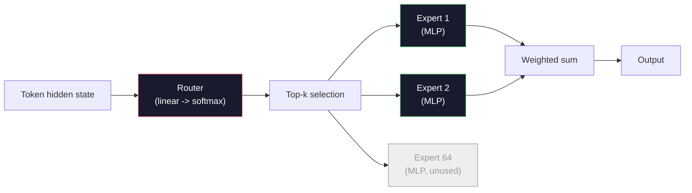

<!-- i18n:manual -->
# Открытые модели: разбор архитектур

> В уроке 04 вы собрали GPT-2 Small с нуля. Фронтирные открытые модели 2026 года — это то же самое семейство с пятью-шестью конкретными изменениями. RMSNorm вместо LayerNorm. SwiGLU вместо GELU. RoPE вместо обучаемых позиций. GQA или MLA вместо полной MHA. Mixture-of-Experts на больших масштабах. Математика, которую вы уже знаете, покрывает 95% всего этого. В этом уроке мы читаем Llama 3, DeepSeek-V3, Mixtral, Qwen и Gemma бок о бок и называем точную строку, где каждая архитектура расходится с базой.

**Type:** Learn
**Languages:** Python (stdlib)
**Prerequisites:** Phase 10, Lessons 04, 05, 12 (Pre-training, Scaling, Inference)
**Time:** ~45 minutes

## Learning Objectives

- Читать config.json моделей Llama 3, Mistral, Mixtral, Gemma 2, Qwen 2.5 и DeepSeek-V3 и объяснять каждое поле
- Называть конкретное архитектурное изменение, которое сделала каждая модель относительно GPT-2 Small, и обосновывать его из первых принципов
- Считать число параметров, размер KV cache и память под активации для любой открытой модели по одному только конфигу
- Выбирать подходящую открытую модель под конкретный деплой с учётом ограничений по latency, памяти и способностям

## The Problem

В уроке 04 вы написали 350 строк numpy и получили модель формы GPT-2. У Llama 3 405B технический отчёт на 200 страниц. Интуиция подсказывает, что это разные звери. Это не так. Двести страниц описывают тот же самый объект с пятью-шестью хорошо обоснованными модификациями плюс тысячей инженерных деталей про масштабирование. Скелет — эмбеддинг, блоки трансформера, attention, MLP, норма, голова — не изменился.

Этот урок — диф. Для каждого крупного семейства открытых моделей мы перечисляем ровно то, что поменялось относительно GPT-2, зачем и какой ценой. К концу вы сможете прочитать свежую карточку модели и мысленно перевести её обратно на базовый GPT-2.

Практическая польза в том, что когда Meta выпустит Llama 5, а DeepSeek — V4, вам не понадобится новая ментальная модель. Вы посмотрите в конфиг, увидите, какая из известных ручек сдвинулась, и поймёте, что из этого следует. Архитектуры 2026 года — это конечный набор инструментов. Каждая новая модель выбирает своё подмножество.

## The Concept

### The Invariant Core

У всех авторегрессивных открытых моделей общее:

- Матрица эмбеддингов токенов (vocab_size x hidden_dim).
- Стопка из N декодерных блоков: норма, self-attention, residual, норма, MLP, residual.
- Финальная норма и линейная голова, проецирующая в vocab_size (часто веса связаны с эмбеддингами).
- Причинная маска, кросс-энтропия на предсказание следующего токена.

Вот и вся форма. Всё остальное — ручки.

> 🎒 **На пальцах.** Представьте панельный дом: каркас, лифтовая шахта и лестница одинаковы во всех сериях, отличается только отделка. Здесь каркас — это четыре пункта выше, и они не менялись с 2019 года. Когда вы открываете статью про новую модель на 671B, ищите не «что тут нового вообще», а «какая из шести отделок другая».

### The Six Knobs That Actually Move

Во всех фронтирных открытых моделях 2024-2026 годов раз за разом выбираются одни и те же шесть проектных решений:

1. **Normalization.** LayerNorm -> RMSNorm.
2. **Positional encoding.** Learned absolute -> RoPE (плюс варианты: YaRN, NTK).
3. **Activation.** GELU -> SwiGLU (или GeGLU).
4. **Attention head sharing.** MHA -> GQA -> MQA -> MLA, всё меньше KV-голов.
5. **Dense vs sparse MLP.** Dense -> Mixture-of-Experts, редкая активация экспертов.
6. **Pre-norm placement.** Pre-norm остаётся. Post-norm ушёл.

Всё остальное (расписание learning rate, состав данных, размер батча, длина контекста) живёт в конфиге обучения, а не в архитектуре. Шесть ручек.

> 🎒 **На пальцах.** Шесть ручек — это как шесть переключателей на панели: каждая модель выставляет их по-своему, но новых переключателей почти не появляется. Ручка 6 вообще заклинена: post-norm никто не выбирает уже семь лет. Реально спорят только про две последние — GQA против MLA и dense против MoE.

### Knob 1: RMSNorm

LayerNorm вычитает среднее, делит на стандартное отклонение, масштабирует и сдвигает. RMSNorm оставляет только масштабирование:

```
RMSNorm(x) = x / sqrt(mean(x^2) + eps) * gamma
```

Никакого вычитания среднего. Никакого сдвига. На один matmul меньше на токен. Zhang и Sennrich (2019) показали, что на машинном переводе это не уступает LayerNorm и при этом на 10% быстрее. Все современные открытые модели используют RMSNorm.

Цена: нулевая. Выгода: небольшой прирост пропускной способности, код проще.

> 🎒 **На пальцах.** Возьмите вектор `[3, -4]`. LayerNorm сначала посчитает среднее (-0.5), вычтет его и только потом поделит. RMSNorm пропускает этот шаг: `sqrt((9 + 16) / 2) = 3.54`, делим — получаем `[0.85, -1.13]`. Оказалось, что вычитание среднего трансформеру просто не нужно, а операций стало меньше.

### Knob 2: RoPE

Обучаемые позиционные эмбеддинги в GPT-2 были таблицей на 1024 слота. Позиция 1025 — уже за краем таблицы. Такие модели не умеют экстраполировать дальше своей длины обучения.

Rotary Position Embedding (RoPE, Su et al. 2021) вносит позицию, поворачивая каждый вектор Q и K попарно перед скалярным произведением attention. Угол поворота — детерминированная функция позиции, поэтому учить нечего и кончиться нечему. С трюками масштабирования (NTK-aware интерполяция, YaRN) модель, обученная на контексте 8k, растягивается до 128k на инференсе с умеренной потерей точности.

```
q_rotated = rotate(q, angle(pos))
k_rotated = rotate(k, angle(pos))
score = q_rotated . k_rotated
```

Все Llama, Mistral, Qwen, DeepSeek и Gemma используют RoPE. Gemma 2 использует гибрид (RoPE на большинстве слоёв, локальный sliding-window attention на остальных).

> 🎒 **На пальцах.** Обучаемые позиции — это пронумерованные ячейки в шкафу: их ровно 1024, и тысяча двадцать пятой вещи класть некуда. RoPE вместо этого поворачивает стрелку часов на угол, пропорциональный позиции, — угол можно посчитать для любого числа, хоть для 131072. Экстраполяция становится вопросом арифметики, а не размера таблицы.

### Knob 3: SwiGLU

MLP в GPT-2 — это `x -> gelu(xW1 + b1) -> (...)W2 + b2`. SwiGLU (Shazeer 2020) заменяет активацию на воротное произведение:

```
SwiGLU(x) = (xW1) * sigmoid(xW1) * xV
```

Две проекции параллельно вместо одной, перемножаемые через активацию Swish. Эмпирически даёт лучшую перплексию на параметр. Llama 2 внедрила SwiGLU, остальные подтянулись. Скрытый размер MLP обычно подбирают так, чтобы суммарное число параметров совпало с исходным плотным MLP: если GPT-2 использовала `ff_dim = 4 * hidden`, то SwiGLU берёт `ff_dim = (2/3) * 4 * hidden = 8/3 * hidden`.

> 🎒 **На пальцах.** Проверьте коэффициент 8/3 на реальном конфиге: у Llama 3 8B `hidden_size = 4096`, значит `8/3 * 4096 = 10922`. В конфиге стоит 14336 — Meta округлила вверх до кратного 1024 и добавила запас. Смысл множителя в том, что проекций теперь три (W1, V, W2) вместо двух, и ширину приходится ужимать, чтобы параметры не выросли в полтора раза.

### Knob 4: Attention Head Sharing

GPT-2 использовала **Multi-Head Attention (MHA)**: у каждой головы своя проекция Q, K и V.

**Multi-Query Attention (MQA, Shazeer 2019)** делит один K и один V на все головы. Урезает KV cache в num_heads раз, то есть в 12-32 раза на типичной модели. Точность на сложных бенчмарках слегка проседает.

**Grouped-Query Attention (GQA, Ainslie et al. 2023)** — золотая середина: G групп Q-голов делят один K и один V. Llama 3 8B использует GQA с 32 Q-головами и 8 KV-головами (G=8), поэтому KV cache уменьшается в 4 раза относительно полной MHA.

**Multi-Head Latent Attention (MLA, DeepSeek 2024)** сжимает K и V в общий низкоранговый латент и разжимает их обратно для каждой головы. Урезает KV cache ещё сильнее, сохраняя выразительность на голову. DeepSeek-V2 и V3 держатся на этом в длинном контексте.

| Scheme | KV Heads | KV Cache | Accuracy |
|--------|----------|----------|----------|
| MHA    | num_heads | полный | лучшая |
| GQA    | num_groups (G < num_heads) | меньше в num_heads / G раз | почти как MHA |
| MQA    | 1 | меньше в num_heads раз | небольшая просадка |
| MLA    | латент, распаковка на голову | меньше, чем у MQA | почти как MHA |

Для любой модели крупнее примерно 13B параметров GQA или MLA фактически обязательны. Полная MHA на таком масштабе — катастрофа по KV cache.

> 🎒 **На пальцах.** Считаем на Llama 3 8B: 32 Q-головы, 8 KV-голов. При полной MHA пришлось бы хранить K и V для всех 32 голов, при GQA — только для 8, то есть в четыре раза меньше байт. Четыре Q-головы смотрят в один и тот же набор ключей — как четыре человека, читающие одну книгу через плечо друг друга вместо покупки четырёх экземпляров.

### Knob 5: Mixture of Experts

Плотный MLP активирует все свои параметры на каждый токен. MoE-MLP имеет K экспертов на блок и роутер, который выбирает top-k экспертов на токен (обычно top-2). Только веса выбранных экспертов участвуют в forward pass для этого токена.

```
router_logits = xW_r
indices, weights = top_k(router_logits, k=2)
output = sum_i weights[i] * expert[indices[i]](x)
```

Соблазн вот в чём: можно держать 64 эксперта по 7B каждый (то есть суммарное число параметров огромно), запуская только двоих на токен (то есть вычисления на токен как у плотной модели на 7B). У Mixtral 8x7B 47B параметров всего, но активируется только 13B на токен. У DeepSeek-V3 671B всего, но активируется только 37B.



Плюсы: те же вычисления, больше параметров, выше ёмкость. Минусы: память под экспертов всё равно надо где-то держать (значит, для сервинга нужно больше VRAM, чем у плотного аналога), балансировка нагрузки роутера — сложная задача, а дообучение роутера на этапе элайнмента — отдельная область исследований.

> 🎒 **На пальцах.** Схема выше читается слева направо: скрытое состояние токена идёт в роутер, роутер даёт оценку каждому из 64 экспертов, top-k берёт двух лучших, и только они считают. Серый «Expert 64» на диаграмме — это остальные 62, чьи веса лежат в памяти и молчат. Отсюда главный подвох MoE: платите за память как за 671B, а за вычисления — как за 37B.

### Knob 6: Pre-norm stays

Исходный трансформер применял layer norm после каждого подслоя. Все открытые модели начиная с GPT-2 ставят её *перед* каждым подслоем. Pre-norm однозначно проще обучать на большой глубине. Спорить тут не о чем.

### Model-by-Model Diff

Вот таблица, которая делает всё сказанное конкретным.

| Model | Year | Total Params | Active Params | Norm | Activation | Position | Attention | MoE | Context |
|-------|------|-------------|---------------|------|-----------|----------|-----------|-----|---------|
| GPT-2 Small | 2019 | 124M | 124M | LayerNorm | GELU | обучаемые | MHA (12 голов) | нет | 1k |
| Llama 3 8B | 2024 | 8B | 8B | RMSNorm | SwiGLU | RoPE | GQA (32/8) | нет | 128k |
| Llama 3 70B | 2024 | 70B | 70B | RMSNorm | SwiGLU | RoPE | GQA (64/8) | нет | 128k |
| Llama 3 405B | 2024 | 405B | 405B | RMSNorm | SwiGLU | RoPE | GQA (128/16) | нет | 128k |
| Mistral 7B | 2023 | 7.2B | 7.2B | RMSNorm | SwiGLU | RoPE | GQA | нет | 32k |
| Mixtral 8x7B | 2023 | 47B | 13B | RMSNorm | SwiGLU | RoPE | GQA | да (8 экспертов, top-2) | 32k |
| Gemma 2 9B | 2024 | 9B | 9B | RMSNorm (pre+post) | GeGLU | RoPE + скользящее окно | GQA | нет | 8k |
| Qwen 2.5 72B | 2024 | 72B | 72B | RMSNorm | SwiGLU | RoPE (YaRN) | GQA (64/8) | нет | 128k |
| DeepSeek V2 236B | 2024 | 236B | 21B | RMSNorm | SwiGLU | RoPE | MLA | да (160 экспертов, top-6) | 128k |
| DeepSeek V3 | 2024 | 671B | 37B | RMSNorm | SwiGLU | RoPE | MLA | да (256 экспертов, top-8) | 128k |

Пробегитесь по колонкам. RMSNorm — везде. SwiGLU или его родственник GeGLU — везде. RoPE — везде. GQA стоит во всём, что крупнее 7B, кроме случаев, где её заменили на MLA. MoE — вот что различает верхний эшелон.

> 🎒 **На пальцах.** Читайте таблицу по вертикали, а не по горизонтали: колонки Norm, Activation и Position — это сплошные повторения, там выбор давно сделан. Живые колонки только две: Attention (GQA против MLA) и MoE (нет против да). Сравните строки Mixtral и Llama 3 70B: 47B суммарных параметров против 70B, но активных 13B против 70B — Mixtral считает в пять раз меньше, а качество сопоставимо.

### Reading a config.json

Конфиг Llama 3 8B:

```
{
  "hidden_size": 4096,
  "intermediate_size": 14336,
  "num_hidden_layers": 32,
  "num_attention_heads": 32,
  "num_key_value_heads": 8,
  "max_position_embeddings": 131072,
  "rope_theta": 500000.0,
  "rms_norm_eps": 1e-5,
  "vocab_size": 128256
}
```

Каждое поле соответствует чему-то, что вы уже реализовали.

- `hidden_size`: размерность эмбеддинга.
- `intermediate_size`: скрытый размер MLP (3.5x от hidden — арифметика SwiGLU).
- `num_hidden_layers`: глубина стопки.
- `num_attention_heads`: число Q-голов.
- `num_key_value_heads`: число KV-голов (GQA).
- `max_position_embeddings`: длина контекста при обучении.
- `rope_theta`: базовая частота RoPE. Meta подняла её с дефолтных 10k до 500k ради экстраполяции на длинный контекст.
- `rms_norm_eps`: численная устойчивость.
- `vocab_size`: количество токенов.

По одним только этим числам вы вычисляете суммарное число параметров, KV cache и пиковую память под активации. Точные формулы смотрите в `code/main.py`.

> 🎒 **На пальцах.** Проверьте связку GQA прямо в конфиге: `num_attention_heads` равно 32, `num_key_value_heads` равно 8, отношение 4 — это и есть та самая экономия KV cache вчетверо. А `14336 / 4096 = 3.5` — это ручка 3, SwiGLU, видимая невооружённым глазом. Конфиг из девяти строк полностью описывает, какие ручки выкручены.

### Activation memory budget

Активации доминируют в памяти при обучении всего, что крупнее пары миллиардов параметров. Эмпирическое правило для предобучения (с gradient checkpointing):

```
activation_mem ~ batch_size * seq_len * hidden_size * num_layers * bytes_per_element
```

Для Llama 3 8B при batch 1, seq 8192, BF16, 32 слоях и hidden 4096: примерно 8 ГБ на одни только активации с чекпоинтингом и 40 ГБ без него. Именно поэтому важны flash-attention и ring-attention — они переписывают вычисление attention так, чтобы активации помещались.

> 🎒 **На пальцах.** Подставьте числа в формулу сами: `1 * 8192 * 4096 * 32 * 2` байта — это примерно 2 ГБ на один тензор активаций, а их в блоке несколько, отсюда и 8 ГБ. Разница между 8 и 40 ГБ — цена gradient checkpointing: вы не храните промежуточные активации, а пересчитываете их на обратном проходе, платя примерно 30% лишних вычислений за пятикратную экономию памяти.

### KV Cache budget

Для инференса на максимальном контексте:

```
kv_cache = 2 * num_layers * num_kv_heads * head_dim * max_seq_len * bytes_per_element
```

Llama 3 8B при контексте 128k, BF16, head_dim = hidden / num_heads = 128:
`2 * 32 * 8 * 128 * 131072 * 2 = 17.2 GB` на одну последовательность.

Веса 8B в BF16 занимают 16 ГБ. KV cache для одной-единственной последовательности на 128k больше, чем сами веса. Вот это давление на память и породило GQA, MLA и исследования по квантизации KV cache.

> 🎒 **На пальцах.** Разберите двойки в формуле: первая — это K и V (два тензора), последняя — два байта на число в BF16. Восьмёрка — это `num_kv_heads`, и без GQA там стояло бы 32, то есть кеш вырос бы до 69 ГБ и просто не влез бы в H100. Один пользователь с длинным контекстом съедает больше памяти, чем вся модель, — поэтому продакшен-сервинг живёт короткими контекстами и агрессивным вытеснением кеша.

### When Each Model Wins

- **Single 80GB GPU, no MoE**: Llama 3 8B, Mistral 7B, Gemma 2 9B. Легко сервить, широкая экосистема.
- **Single node (8x80GB), big capacity**: Llama 3 70B, Qwen 2.5 72B. Максимум из плотных открытых моделей.
- **Biggest open capability, accept MoE complexity**: DeepSeek V3, Mixtral 8x22B. Лучшее качество на активный FLOP.
- **Long-context needs**: Llama 3 (128k с масштабированием RoPE), DeepSeek (преимущество MLA).
- **Low-latency serving**: Gemma 2 9B (скользящее окно урезает вычисления на длинном контексте).

```figure
rmsnorm-vs-layernorm
```

> 🎒 **На пальцах.** Список читается как «сколько у вас железа». Одна карта на 80 ГБ — берите 8B, потому что веса в BF16 займут 16 ГБ и останется место под кеш. Восемь карт — тянете 70B (140 ГБ весов). DeepSeek V3 требует сотен гигабайт под экспертов, зато считает на токен как модель на 37B, то есть отвечает быстро, когда уже влез в память.

## Build It

Код урока — это калькулятор. По любому config.json он печатает число параметров по компонентам, KV cache на максимальном контексте, коэффициент SwiGLU MLP и короткий вердикт по архитектуре (dense / GQA / MLA / MoE).

```python
config = {
    "hidden_size": 4096, "intermediate_size": 14336,
    "num_hidden_layers": 32, "num_attention_heads": 32,
    "num_key_value_heads": 8, "vocab_size": 128256,
    "max_position_embeddings": 131072,
}
```

Скрипт проходит по архитектуре поле за полем, считает параметры для эмбеддинга, attention (с учётом урезания по GQA), MLP (с расширением SwiGLU), нормировок и головы. Затем он считает KV cache на заявленной длине контекста и печатает сводку.

Реализацию смотрите в `code/main.py`.

> 🎒 **На пальцах.** Обратите внимание, чего в этом словаре нет: ни `rope_theta`, ни `rms_norm_eps` на число параметров не влияют, потому что RoPE ничего не учит, а eps — просто константа. Считать надо по шести числам: словарь, hidden, слои, Q-головы, KV-головы и intermediate. Всё остальное в конфиге — про поведение, а не про размер.

## Use It

Запустите калькулятор на конфигах Llama 3 8B, Mistral 7B, Mixtral 8x7B и DeepSeek V3, вшитых в скрипт. Сравните разбивки по параметрам. Заметьте, что у MoE-моделей суммарное число параметров затмевает плотные модели, а активное число часто оказывается меньше. Заметьте, что KV cache у DeepSeek V3 меньше, чем у Llama 3 405B, несмотря на большее суммарное число параметров, — это MLA в действии.

Потом подставьте конфиг любой модели, которая лежит у вас локально, прочитайте сводку и решите, влезает ли она в вашу видеокарту.

> 🎒 **На пальцах.** Главное упражнение здесь — увидеть, что «размер модели» это три разных числа, а не одно. Суммарные параметры определяют, сколько нужно VRAM. Активные параметры определяют скорость. KV cache определяет, сколько пользователей вы обслужите одновременно. У DeepSeek V3 первое число рекордно большое, а второе и третье — скромные.

## Ship It

Этот урок производит `outputs/skill-open-model-picker.md`. По целевому деплою (тип GPU, объём VRAM, длина контекста, бюджет по latency) и профилю задачи (чат, код, рассуждения, длинный контекст) скилл рекомендует открытую модель, схему квантизации из урока 11 и стек инференса из урока 12, явно рассуждая о шести архитектурных ручках.

## Exercises

1. Прочитайте конфиг Qwen 2.5 72B на HuggingFace. Посчитайте суммарное число параметров с нуля. Сравните со значением, заявленным на HF, и определите, откуда взялось расхождение (округление head dim, коэффициент разделения KV и так далее).

2. DeepSeek V3 использует 256 экспертов с маршрутизацией top-8. Посчитайте отношение активированных экспертов к общему числу и сравните с top-2 из 8 у Mixtral 8x7B. О чём говорит переход от разреженности 25% к более плотной разреженности 3% в терминах ёмкости на FLOP?

3. Посчитайте KV cache для Llama 3 405B на контексте 128k в FP8 и в BF16. В FP8 получится ровно половина от BF16. Сколько параллельных последовательностей вы обслужите на одном узле 8xH100 (по 80 ГБ каждая, итого 640 ГБ, минус память под веса)?

4. Gemma 2 чередует слои полного attention и sliding-window attention. Выпишите математику KV cache для случая, когда половина слоёв использует скользящее окно на 4096 токенов вместо полного контекста. Сколько памяти это экономит при общем контексте 8k?

5. Найдите свежую фронтирную открытую модель, вышедшую уже после написания этого урока. Определите, какие из шести ручек она выбрала и не завела ли она седьмую. Курс будет казаться устаревшим в момент выхода любой новой архитектуры — задача в том, чтобы обновить таблицу, не перестраивая ментальную модель.

> 🎒 **На пальцах.** Задание 2 решается в одну строку: у Mixtral активны 2 эксперта из 8, то есть 25%, у DeepSeek V3 — 8 из 256, то есть 3.1%. Чем мельче эксперты и чем их больше, тем больше комбинаций может собрать роутер под конкретный токен при том же бюджете вычислений. Это и называется fine-grained MoE, и именно поэтому счётчик экспертов растёт от модели к модели.

## Key Terms

| Term | What people say | What it actually means |
|------|----------------|----------------------|
| RMSNorm | "LayerNorm without the mean" | Нормировка только по среднеквадратичному значению с обучаемым масштабом — дешевле LayerNorm и не хуже по качеству |
| RoPE | "Rotary positions" | Поворот каждого вектора Q и K парами координат на угол, зависящий от позиции — с трюками масштабирования экстраполируется за длину обучения |
| SwiGLU | "The new MLP activation" | Воротный линейный блок со Swish: `(xW1) * sigmoid(xW1) * xV` — стандарт во всех открытых моделях с 2024 года |
| GQA | "Middle ground attention" | Grouped-Query Attention: G групп Q-голов делят одну голову K и одну V — урезает KV cache без просадки точности, как у MQA |
| MLA | "DeepSeek's attention" | Multi-Head Latent Attention: сжатие K/V в общий низкоранговый латент с распаковкой на голову — самый маленький KV cache для больших моделей |
| MoE | "Sparse experts" | Mixture of Experts: N штук MLP на блок, роутер выбирает top-k на токен — огромное суммарное число параметров, маленькое активное |
| Top-k routing | "Pick k experts per token" | Роутер считает оценку для каждого эксперта и активирует k лучших — типичное k от 2 (Mixtral) до 8 (DeepSeek) |
| YaRN | "Stretch RoPE" | Ещё одно расширение RoPE — интерполирует углы поворота, растягивая контекст с 8k до 128k и больше прямо на инференсе |
| Sliding-window attention | "Don't attend to everything" | Каждый токен смотрит только на последние W токенов — ограничивает стоимость attention величиной O(W) на токен, применяется в Gemma 2 и ранних Mistral |
| Active params | "What runs per token" | Для MoE-моделей — число параметров, участвующих в forward pass на каждый токен (сильно меньше суммарного) — именно оно задаёт FLOPs на токен |

## Further Reading

- [Dubey et al., 2024 -- "The Llama 3 Herd of Models"](https://arxiv.org/abs/2407.21783) -- архитектурный и тренировочный справочник по плотному семейству Llama 3
- [DeepSeek-AI, 2024 -- "DeepSeek-V3 Technical Report"](https://arxiv.org/abs/2412.19437) -- MLA плюс балансировка нагрузки без вспомогательного лосса плюс MoE на 671B
- [Jiang et al., 2024 -- "Mixtral of Experts"](https://arxiv.org/abs/2401.04088) -- каноническая статья про открытую MoE-модель
- [Su et al., 2021 -- "RoFormer: Enhanced Transformer with Rotary Position Embedding"](https://arxiv.org/abs/2104.09864) -- статья про RoPE
- [Shazeer, 2020 -- "GLU Variants Improve Transformer"](https://arxiv.org/abs/2002.05202) -- SwiGLU, GeGLU и компания
- [Ainslie et al., 2023 -- "GQA: Training Generalized Multi-Query Transformer Models"](https://arxiv.org/abs/2305.13245) -- статья про GQA
- [Gemma 2 Team, 2024 -- "Gemma 2: Improving Open Language Models at a Practical Size"](https://arxiv.org/abs/2408.00118) -- гибрид полного и скользящего attention, pre+post-norm
- [Qwen Team, 2024 -- "Qwen 2.5 Technical Report"](https://arxiv.org/abs/2412.15115) -- расширение контекста через YaRN и рецепты обучения на длинном контексте
