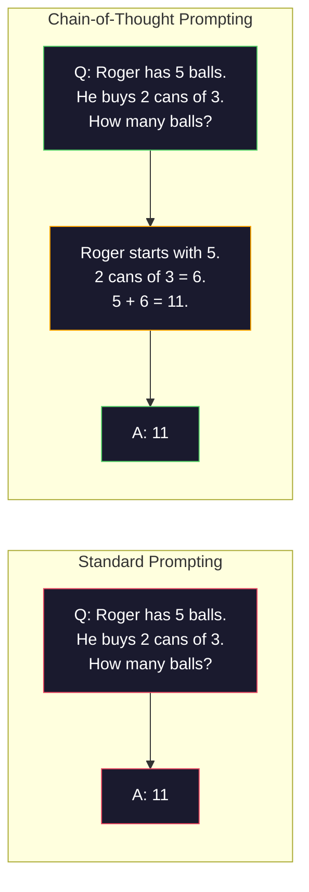
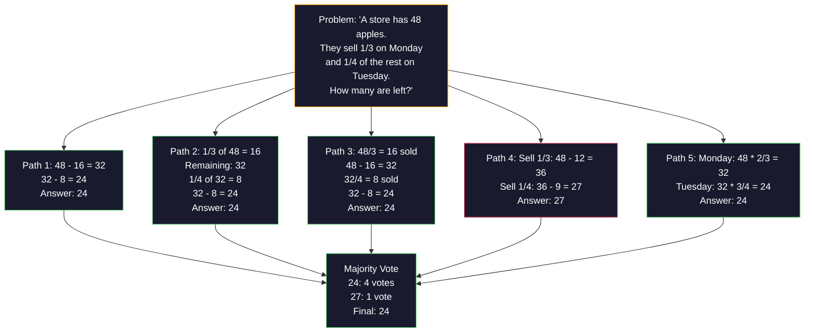
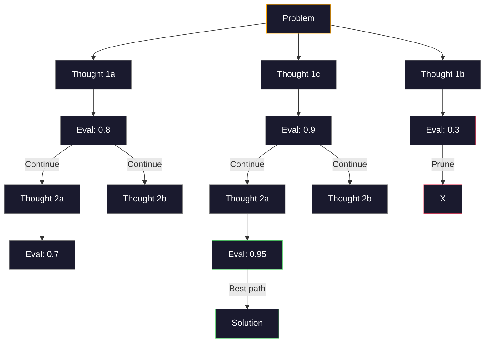

<!-- i18n:manual -->
# Few-shot, цепочка рассуждений и дерево мыслей

> Сказать модели, что делать, — это промптинг. Показать ей, как думать, — это инженерия. Разрыв между 78% и 91% точности на той же модели, той же задаче и тех же данных — это не более умная модель. Это более удачная стратегия рассуждения.

**Type:** Build
**Languages:** Python
**Prerequisites:** Lesson 11.01 (Prompt Engineering)
**Time:** ~45 minutes

## Learning Objectives

- Реализовать few-shot промптинг: подбирать и форматировать примеры-демонстрации так, чтобы точность на задаче была максимальной
- Применять цепочку рассуждений (chain-of-thought, CoT) для повышения точности на многошаговых задачах вроде текстовых задач по математике
- Собрать tree-of-thought промпт, который исследует несколько путей рассуждения и выбирает лучший
- Измерить прирост точности от zero-shot к few-shot и к CoT на стандартном бенчмарке

## The Problem

Вы делаете приложение-репетитор по математике. Ваш промпт говорит: «Solve this word problem.» GPT-5 отвечает правильно в 94% случаев на GSM8K — стандартном бенчмарке школьных задач. Вам кажется, что потолок уже достигнут. Нет — цепочка рассуждений добавляет ещё 3-4 пункта.

Добавьте пять слов — «Let's think step by step» — и точность подскакивает до 91%. Добавьте несколько разобранных примеров — и она доходит до 95%. Та же модель. Та же температура. Та же цена запроса к API. Единственная разница в том, что вы дали модели черновик.

Это не хак. Так устроено рассуждение. Люди не решают многошаговые задачи одним мысленным прыжком. Трансформеры тоже. Когда вы заставляете модель сгенерировать промежуточные токены, эти токены становятся частью контекста для следующего токена. Каждый шаг рассуждения питает следующий. Модель буквально *вычисляет* себе путь к ответу.

Но «think step by step» — это начало, а не конец. А что если насэмплировать пять путей рассуждения и взять большинство голосов? А что если дать модели исследовать дерево возможностей, оценивая и отсекая ветки? А что если переплести рассуждение с использованием инструментов? Это не фантазии. Это опубликованные техники с измеренным приростом, и в этом уроке вы соберёте их все.

> 🎒 **На пальцах.** Представьте контрольную по математике, где нельзя ничего писать в черновике: считай в уме и сразу пиши ответ. Ошибок будет много. Дайте черновик — и та же голова решает лучше. Пять слов «Let's think step by step» и есть выдача черновика: у GPT-4o это 78% → 91%, а с разобранными примерами — 95%.

## The Concept

### Zero-Shot vs Few-Shot: When Examples Beat Instructions

Zero-shot промптинг даёт модели задачу и больше ничего. Few-shot промптинг сначала даёт ей примеры.

Wei et al. (2022) измерили это на 8 бенчмарках. На простых задачах вроде классификации тональности zero-shot и few-shot отличались друг от друга не больше чем на 2%. На сложных — многошаговой арифметике и символьных рассуждениях — few-shot поднимал точность на 10-25%.

Интуиция такая: примеры — это сжатые инструкции. Вместо того чтобы описывать формат вывода, вы его показываете. Вместо того чтобы объяснять процесс рассуждения, вы его демонстрируете. Модель надёжнее подхватывает шаблон по примерам, чем интерпретирует абстрактные инструкции.


**When few-shot wins:** задачи, чувствительные к формату, классификация, структурированное извлечение, узкоспециальный жаргон — всё, где модели нужно попасть в конкретный шаблон.

**When zero-shot wins:** простые фактические вопросы, творческие задачи, где примеры сковывают фантазию, и задачи, где найти хорошие примеры сложнее, чем написать хорошую инструкцию.

> 🎒 **На пальцах.** Объяснять словами, как складывать оригами, — мучение; показать один раз сложенную фигурку — и всё понятно. Ровно поэтому на схеме выше zero-shot даёт 78% на GSM8K, а те же три примера в промпте — 85%. Но если надо просто назвать столицу Франции, примеры не помогут: там нечего показывать.

### Example Selection: Similar Beats Random

Не все примеры равноценны. Подбор примеров, похожих на целевой вход, обгоняет случайный выбор на 5-15% на задачах классификации (Liu et al., 2022). Три принципа:

1. **Semantic similarity**: берите примеры, ближайшие ко входу в пространстве эмбеддингов
2. **Label diversity**: покройте примерами все категории вывода
3. **Difficulty matching**: подгоняйте уровень сложности под целевую задачу

Оптимальное число примеров для большинства задач — 3-5. Меньше трёх — модели не хватает сигнала, чтобы вытащить шаблон. Больше пяти — вы упираетесь в убывающую отдачу и жжёте токены контекстного окна. Для классификации с большим числом меток берите по одному примеру на метку.

> 🎒 **На пальцах.** Готовясь к контрольной, вы решаете задачи из того же параграфа, а не случайные из всего учебника. Так же и здесь: похожие примеры дают +5-15% против случайных. И правило «3-5 примеров» простое — на двух модель ещё не видит закономерности, на десяти вы уже платите за токены впустую.

### Chain-of-Thought: Giving Models Scratch Paper

Chain-of-Thought (CoT) промптинг предложили Wei et al. (2022) в Google Brain. Идея простая: вместо того чтобы просить у модели только ответ, попросите её сначала показать шаги рассуждения.



Почему это работает механически? Каждый токен, который генерирует трансформер, становится контекстом для следующего токена. Без CoT модель обязана упаковать всё рассуждение в скрытое состояние одного прямого прохода. С CoT она выносит промежуточные вычисления наружу в виде токенов. Каждый токен рассуждения увеличивает фактическую глубину вычисления.

**GSM8K benchmarks (grade-school math, 8.5K problems):**

| Model | Zero-Shot | Zero-Shot CoT | Few-Shot CoT |
|-------|-----------|---------------|--------------|
| GPT-4o | 78% | 91% | 95% |
| GPT-5 | 94% | 97% | 98% |
| o4-mini (reasoning) | 97% | — | — |
| Claude Opus 4.7 | 93% | 97% | 98% |
| Gemini 3 Pro | 92% | 96% | 98% |
| Llama 4 70B | 80% | 89% | 94% |
| DeepSeek-V3.1 | 89% | 94% | 96% |

**Note on reasoning models.** Модели вроде o-серии от OpenAI (o3, o4-mini) и DeepSeek-R1 прогоняют цепочку рассуждений внутри себя, прежде чем выдать ответ. Добавлять «Let's think step by step» к reasoning-модели избыточно, а иногда и вредно — она это уже сделала.

Два вкуса CoT:

**Zero-shot CoT**: припишите к промпту «Let's think step by step». Примеры не нужны. Kojima et al. (2022) показали, что одна эта фраза поднимает точность на арифметике, здравом смысле и символьных рассуждениях.

**Few-shot CoT**: дайте примеры, в которых уже расписаны шаги рассуждения. Работает лучше zero-shot CoT, потому что модель видит ровно тот формат рассуждения, которого вы от неё ждёте.

**When CoT hurts**: простое припоминание фактов («Какая столица Франции?»), одношаговая классификация, задачи, где скорость важнее точности. CoT добавляет 50-200 токенов рассуждения на каждый запрос. Для высоконагруженных простых задач это выброшенные деньги.

> 🎒 **На пальцах.** У Роджера 5 мячей, он купил 2 банки по 3 — сколько мячей? Схема выше показывает разницу: без CoT модель обязана выдать «11» сразу, а с CoT она сначала пишет «2 × 3 = 6», потом «5 + 6 = 11». Второе — это как записать промежуточный результат на бумажке, чтобы не держать его в голове. Отсюда и скачок 78% → 91% у GPT-4o в таблице.

### Self-Consistency: Sample Many, Vote Once

Wang et al. (2023) предложили self-consistency. Суть: одна цепочка рассуждений может содержать ошибку. Но если насэмплировать N независимых путей рассуждения (при temperature > 0) и взять большинство голосов по финальному ответу, ошибки взаимно погасятся.



Self-consistency подняла точность на GSM8K с 56.5% (одиночный CoT) до 74.4% при N=40 в исходных экспериментах на PaLM 540B. На GPT-5 прирост маленький (97% → 98%), потому что базовая точность уже упёрлась в потолок. Техника ярче всего проявляется на моделях с базовой CoT-точностью 60-85% — это та зона, где ошибки одиночного пути часты, но не систематичны. Для reasoning-моделей (o-серия, R1) self-consistency поглощается встроенным внутренним сэмплированием.

Компромисс: N сэмплов означают N-кратную цену запросов и задержку. На практике N=5 забирает почти всю выгоду. N=3 — минимум, при котором голосование вообще имеет смысл. При N > 10 отдача для большинства задач падает.

> 🎒 **На пальцах.** Это как спросить пятерых одноклассников одну задачу и поверить тому ответу, который назвали большинство. На схеме выше четыре пути пришли к 24, один ошибся и выдал 27 — большинство побеждает, ответ 24. Платите вы за это пятикратно: пять запросов вместо одного.

### Tree-of-Thought: Branching Exploration

Yao et al. (2023) предложили Tree-of-Thought (ToT). Если CoT идёт по одному линейному пути рассуждения, то ToT исследует несколько веток и оценивает, какие из них перспективнее, прежде чем идти дальше.



У ToT три компонента:

1. **Thought generation**: породить несколько кандидатов на следующий шаг
2. **State evaluation**: оценить каждого кандидата (оценщиком может быть сама LLM)
3. **Search algorithm**: обход дерева в ширину или в глубину с отсечением слабых веток

На задаче Game of 24 (скомбинировать 4 числа арифметикой так, чтобы получилось 24) GPT-4 со стандартным промптингом решает 7.3% задач. С CoT — 4.0% (здесь CoT реально мешает, потому что пространство поиска широкое). С ToT — 74%.

ToT дорогой. Каждый узел дерева — это запрос к LLM. Дерево с ветвлением 3 и глубиной 3 требует до 39 запросов. Используйте его только там, где пространство поиска большое, но поддаётся оценке: планирование, головоломки, творческие задачи с ограничениями.

> 🎒 **На пальцах.** Представьте лабиринт: CoT идёт одним коридором до конца, а ToT на каждой развилке заглядывает во все проходы и бросает те, что явно ведут в тупик. На схеме ветка с оценкой 0.3 отсекается сразу, а из веток 0.8 и 0.9 растут новые. Цена честная: 39 запросов вместо одного, зато на Game of 24 это 7.3% → 74%.

### ReAct: Thinking + Doing

Yao et al. (2022) соединили следы рассуждений с действиями. Модель чередует размышление (генерацию рассуждения) и действие (вызов инструментов, поиск, вычисления).

```mermaid
graph LR
    Q["Question:\nWhat is the\npopulation of the\ncountry where\nthe Eiffel Tower\nis located?"]
    T1["Thought: I need to\nfind which country\nhas the Eiffel Tower"]
    A1["Action: search\n'Eiffel Tower location'"]
    O1["Observation:\nParis, France"]
    T2["Thought: Now I need\nFrance's population"]
    A2["Action: search\n'France population 2024'"]
    O2["Observation:\n68.4 million"]
    T3["Thought: I have\nthe answer"]
    F["Answer:\n68.4 million"]

    Q --> T1 --> A1 --> O1 --> T2 --> A2 --> O2 --> T3 --> F

    style Q fill:#1a1a2e,stroke:#ffa500,color:#fff
    style T1 fill:#1a1a2e,stroke:#51cf66,color:#fff
    style A1 fill:#1a1a2e,stroke:#e94560,color:#fff
    style O1 fill:#1a1a2e,stroke:#808080,color:#fff
    style T2 fill:#1a1a2e,stroke:#51cf66,color:#fff
    style A2 fill:#1a1a2e,stroke:#e94560,color:#fff
    style O2 fill:#1a1a2e,stroke:#808080,color:#fff
    style T3 fill:#1a1a2e,stroke:#51cf66,color:#fff
    style F fill:#1a1a2e,stroke:#51cf66,color:#fff
```



ReAct обгоняет чистый CoT на задачах, требующих знаний, потому что умеет заземлять рассуждение на реальных данных. На HotpotQA (многошаговые вопросы-ответы) ReAct с GPT-4 даёт 35.1% точных совпадений против 29.4% у одного CoT. Настоящая сила в том, что ошибки рассуждения исправляются наблюдениями — модель может поменять план прямо по ходу выполнения.

ReAct — фундамент современных AI-агентов. Каждый агентный фреймворк (LangChain, CrewAI, AutoGen) реализует какой-нибудь вариант цикла Thought-Action-Observation. Полноценных агентов вы будете строить в фазе 14. Этот урок покрывает сам паттерн промптинга.

> 🎒 **На пальцах.** Это разница между «вспомнить население Франции по памяти» и «загуглить». На схеме модель сама себе говорит: сначала выясню, где Эйфелева башня, потом посмотрю население Франции — и получает 68.4 миллиона из наблюдения, а не из головы. Отсюда 35.1% против 29.4% у чистого CoT на HotpotQA.

### Structured Prompting: XML Tags, Delimiters, Headers

Когда промпты усложняются, структура не даёт модели перепутать разделы. Три подхода:

**XML tags** (лучше всего с Claude, надёжно везде):

```
<context>
You are reviewing a pull request.
The codebase uses TypeScript and React.
</context>

<task>
Review the following diff for bugs, security issues, and style violations.
</task>

<diff>
{diff_content}
</diff>

<output_format>
List each issue with: file, line, severity (critical/warning/info), description.
</output_format>
```

**Markdown headers** (универсальный вариант):

```
## Role
Senior security engineer at a fintech company.

## Task
Analyze this API endpoint for vulnerabilities.

## Input
{api_code}

## Rules
- Focus on OWASP Top 10
- Rate each finding: critical, high, medium, low
- Include remediation steps
```

**Delimiters** (минималистично, но работает):

```
---INPUT---
{user_text}
---END INPUT---

---INSTRUCTIONS---
Summarize the above in 3 bullet points.
---END INSTRUCTIONS---
```

### Prompt Chaining: Sequential Decomposition

Некоторые задачи слишком сложны для одного промпта. Prompt chaining разбивает их на шаги, где вывод одного промпта становится входом следующего.


Цепочка бьёт одиночный промпт по трём причинам:

1. **Each step is simpler**: модель решает одну сфокусированную задачу вместо того, чтобы жонглировать всем сразу
2. **Intermediate outputs are inspectable**: между шагами можно проверить и поправить результат
3. **Different steps can use different models**: дешёвая модель на извлечение, дорогая — на рассуждение

### Performance Comparison

| Technique | Best For | GSM8K Accuracy (GPT-5) | API Calls | Token Overhead | Complexity |
|-----------|----------|------------------------|-----------|----------------|------------|
| Zero-Shot | простые задачи | 94% | 1 | нет | тривиальная |
| Few-Shot | попадание в формат | 96% | 1 | 200-500 токенов | низкая |
| Zero-Shot CoT | быстрый прирост на рассуждениях | 97% | 1 | 50-200 токенов | тривиальная |
| Few-Shot CoT | максимум точности за один вызов | 98% | 1 | 300-600 токенов | низкая |
| Self-Consistency (N=5) | рассуждения с высокой ценой ошибки | 98.5% | 5 | 5x по токенам | средняя |
| Reasoning model (o4-mini) | замена CoT «из коробки» | 97% | 1 | скрытая (2-10x внутри) | тривиальная |
| Tree-of-Thought | поиск и планирование | N/A (74% on Game of 24) | 10-40+ | 10-40x по токенам | высокая |
| ReAct | рассуждения с опорой на знания | N/A (35.1% on HotpotQA) | 3-10+ | переменная | высокая |
| Prompt Chaining | сложные многошаговые задачи | 96% (pipeline) | 2-5 | 2-5x по токенам | средняя |

Выбор техники зависит от трёх вещей: требуемой точности, бюджета по задержке и терпимости к затратам. Для большинства продакшн-систем few-shot CoT с откатом на self-consistency из 3 сэмплов закрывает 90% случаев.

```figure
few-shot-curve
```

> 🎒 **На пальцах.** Читайте таблицу как ценник: Zero-Shot CoT даёт 97% за один запрос и 50-200 лишних токенов, а Tree-of-Thought — до 40 запросов и в 40 раз больше токенов. Если задача не про поиск в широком пространстве, платить в 40 раз дороже за те же проценты просто незачем.

## Build It

Мы соберём решатель математических задач, который объединяет few-shot промптинг, цепочку рассуждений и голосование self-consistency в один пайплайн. Потом добавим tree-of-thought для трудных задач.

Полная реализация лежит в `code/advanced_prompting.py`. Ниже — ключевые компоненты.

### Step 1: Few-Shot Example Store

Первый компонент хранит few-shot примеры и выбирает самые подходящие под конкретную задачу.

```python
GSM8K_EXAMPLES = [
    {
        "question": "Janet's ducks lay 16 eggs per day. She eats three for breakfast every morning and bakes muffins for her friends every day with four. She sells every egg at the farmers' market for $2. How much does she make every day at the farmers' market?",
        "reasoning": "Janet's ducks lay 16 eggs per day. She eats 3 and bakes 4, using 3 + 4 = 7 eggs. So she has 16 - 7 = 9 eggs left. She sells each for $2, so she makes 9 * 2 = $18 per day.",
        "answer": "18"
    },
    ...
]
```

У каждого примера три части: вопрос, цепочка рассуждения и финальный ответ. Именно цепочка рассуждения превращает обычный few-shot пример в CoT few-shot пример.

> 🎒 **На пальцах.** Смотрите на поле `reasoning`: без него пример говорит «16 яиц → 18 долларов», и модели остаётся гадать, откуда взялось 18. С ним видно всю арифметику: 3 + 4 = 7, 16 − 7 = 9, 9 × 2 = 18. Это как решебник с разбором вместо голых ответов в конце учебника.

### Step 2: Chain-of-Thought Prompt Builder

Сборщик промпта склеивает системное сообщение, few-shot примеры с цепочками рассуждений и целевой вопрос в один промпт.

```python
def build_cot_prompt(question, examples, num_examples=3):
    system = (
        "You are a math problem solver. "
        "For each problem, show your step-by-step reasoning, "
        "then give the final numerical answer on the last line "
        "in the format: 'The answer is [number]'."
    )

    example_text = ""
    for ex in examples[:num_examples]:
        example_text += f"Q: {ex['question']}\n"
        example_text += f"A: {ex['reasoning']} The answer is {ex['answer']}.\n\n"

    user = f"{example_text}Q: {question}\nA:"
    return system, user
```

Ограничение формата («The answer is [number]») критично. Без него self-consistency не сможет вытащить и сравнить ответы разных сэмплов.

> 🎒 **На пальцах.** Представьте, что вы собираете 5 контрольных и ищете ответ, а каждый писал по-своему: «получается 18», «ответ: восемнадцать», «$18». Сравнивать невозможно. Строка «The answer is 18» — это как требование обвести ответ в рамочку: дальше его вытаскивает простая регулярка.

### Step 3: Self-Consistency Voting

Сэмплируем N путей рассуждения и берём ответ большинства.

```python
def self_consistency_solve(question, examples, client, model, n_samples=5):
    system, user = build_cot_prompt(question, examples)

    answers = []
    reasonings = []
    for _ in range(n_samples):
        response = client.chat.completions.create(
            model=model,
            messages=[
                {"role": "system", "content": system},
                {"role": "user", "content": user}
            ],
            temperature=0.7
        )
        text = response.choices[0].message.content
        reasonings.append(text)
        answer = extract_answer(text)
        if answer is not None:
            answers.append(answer)

    vote_counts = Counter(answers)
    best_answer = vote_counts.most_common(1)[0][0] if vote_counts else None
    confidence = vote_counts[best_answer] / len(answers) if best_answer else 0

    return best_answer, confidence, reasonings, vote_counts
```

Температура 0.7 здесь важна. При температуре 0.0 все N сэмплов были бы одинаковыми, и смысл пропал бы. Нужно достаточно случайности для разнообразных путей рассуждения, но не столько, чтобы модель начала нести чушь.

> 🎒 **На пальцах.** `Counter` просто считает голоса: если из 5 сэмплов четыре сказали «24», а один «27», то `most_common(1)` даёт 24, а `confidence` = 4/5 = 0.8. Температура — регулятор разброса: на 0.0 вы пять раз спрашиваете одного и того же человека, на 0.7 — пятерых разных.

### Step 4: Tree-of-Thought Solver

Там, где линейное рассуждение не справляется, ToT исследует несколько подходов и оценивает, какое направление перспективнее.

```python
def tree_of_thought_solve(question, client, model, breadth=3, depth=3):
    thoughts = generate_initial_thoughts(question, client, model, breadth)
    scored = [(t, evaluate_thought(t, question, client, model)) for t in thoughts]
    scored.sort(key=lambda x: x[1], reverse=True)

    for current_depth in range(1, depth):
        next_thoughts = []
        for thought, score in scored[:2]:
            extensions = extend_thought(thought, question, client, model, breadth)
            for ext in extensions:
                ext_score = evaluate_thought(ext, question, client, model)
                next_thoughts.append((ext, ext_score))
        scored = sorted(next_thoughts, key=lambda x: x[1], reverse=True)

    best_thought = scored[0][0] if scored else ""
    return extract_answer(best_thought), best_thought
```

Оценщик — это тоже вызов LLM. Вы спрашиваете модель: «По шкале от 0.0 до 1.0, насколько перспективен этот путь рассуждения для решения задачи?» В этом и главная идея ToT — модель оценивает собственные частичные решения.

> 🎒 **На пальцах.** Разберите строку `scored[:2]`: на каждом уровне выживают только две лучшие ветки, остальные отбрасываются. При `breadth=3` это 2 × 3 = 6 новых мыслей за шаг вместо экспоненциального взрыва. Как в шахматах: вы всерьёз считаете только пару сильнейших ходов, а не все двадцать.

### Step 5: Full Pipeline

Пайплайн объединяет все техники со стратегией эскалации.

```python
def solve_with_escalation(question, examples, client, model):
    system, user = build_cot_prompt(question, examples)
    single_response = call_llm(client, model, system, user, temperature=0.0)
    single_answer = extract_answer(single_response)

    sc_answer, confidence, _, _ = self_consistency_solve(
        question, examples, client, model, n_samples=5
    )

    if confidence >= 0.8:
        return sc_answer, "self_consistency", confidence

    tot_answer, _ = tree_of_thought_solve(question, client, model)
    return tot_answer, "tree_of_thought", None
```

Логика эскалации: сначала пробуем дёшево (одиночный CoT). Если уверенность self-consistency ниже 0.8 (согласны меньше 4 сэмплов из 5), поднимаемся до ToT. Так балансируются цена и точность: большинство задач решается дёшево, а трудные получают больше вычислений.

> 🎒 **На пальцах.** Это как приёмный покой: сначала быстрый осмотр, и только неясные случаи идут на дорогое обследование. Порог 0.8 буквально означает «4 из 5 сэмплов сошлись» — если сошлись только 3, задача считается спорной и уходит в ToT.

## Use It

### Template-Driven Few-Shot Prompts

LangChain даёт готовую поддержку шаблонов промптов и разбора вывода, которая упрощает few-shot и CoT паттерны:

```python
from langchain_core.prompts import FewShotPromptTemplate, PromptTemplate
from langchain_openai import ChatOpenAI

example_prompt = PromptTemplate(
    input_variables=["question", "reasoning", "answer"],
    template="Q: {question}\nA: {reasoning} The answer is {answer}."
)

few_shot_prompt = FewShotPromptTemplate(
    examples=examples,
    example_prompt=example_prompt,
    suffix="Q: {input}\nA: Let's think step by step.",
    input_variables=["input"]
)

llm = ChatOpenAI(model="gpt-4o", temperature=0.7)
chain = few_shot_prompt | llm
result = chain.invoke({"input": "If a train travels 120 km in 2 hours..."})
```

В LangChain также есть классы `ExampleSelector` для отбора по семантической близости:

```python
from langchain_core.example_selectors import SemanticSimilarityExampleSelector
from langchain_openai import OpenAIEmbeddings

selector = SemanticSimilarityExampleSelector.from_examples(
    examples,
    OpenAIEmbeddings(),
    k=3
)
```

> 🎒 **На пальцах.** `FewShotPromptTemplate` делает ровно то же, что ваш цикл из шага 2, — склеивает примеры в текст, только за вас. А `SemanticSimilarityExampleSelector` с `k=3` сам достаёт три ближайших примера по эмбеддингам, вместо того чтобы каждый раз брать первые три из списка.

### Compiled Prompts

DSPy относится к стратегиям промптинга как к оптимизируемым модулям. Вместо того чтобы вручную мастерить CoT-промпт, вы описываете сигнатуру, а DSPy оптимизирует промпт сам:

```python
import dspy

dspy.configure(lm=dspy.LM("openai/gpt-4o", temperature=0.7))

class MathSolver(dspy.Module):
    def __init__(self):
        self.solve = dspy.ChainOfThought("question -> answer")

    def forward(self, question):
        return self.solve(question=question)

solver = MathSolver()
result = solver(question="Janet's ducks lay 16 eggs per day...")
```

`ChainOfThought` из DSPy автоматически добавляет следы рассуждений. `dspy.majority` реализует self-consistency:

```python
result = dspy.majority(
    [solver(question=q) for _ in range(5)],
    field="answer"
)
```

> 🎒 **На пальцах.** Сигнатура `"question -> answer"` — это как заказ «на входе вопрос, на выходе ответ», а как именно формулировать промпт, решает библиотека. И весь ваш шаг 3 с голосованием здесь сжимается до одной строки `dspy.majority` по пяти запускам.

### Comparison: From-Scratch vs Frameworks

| Feature | From-Scratch (this lesson) | LangChain | DSPy |
|---------|--------------------------|-----------|------|
| Control over prompt format | полный | по шаблонам | автоматический |
| Self-consistency | голосование вручную | вручную | встроено (`dspy.majority`) |
| Example selection | своя логика | `ExampleSelector` | `dspy.BootstrapFewShot` |
| Tree-of-Thought | свой поиск по дереву | цепочки от сообщества | не встроено |
| Prompt optimization | ручные итерации | вручную | автоматическая компиляция |
| Best for | обучение, кастомные пайплайны | стандартные сценарии | исследования, оптимизация |

## Ship It

Этот урок даёт два артефакта.

**1. Reasoning Chain Prompt** (`outputs/prompt-reasoning-chain.md`): готовый к продакшену шаблон промпта для few-shot CoT с self-consistency. Подставьте свои примеры и свою предметную область.

**2. CoT Pattern Selection Skill** (`outputs/skill-cot-patterns.md`): схема принятия решения о том, какую технику рассуждения выбрать, исходя из типа задачи, требований к точности и ограничений по стоимости.

## Exercises

1. **Measure the gap**: возьмите 10 задач из GSM8K. Решите каждую через zero-shot, few-shot, zero-shot CoT и few-shot CoT. Запишите точность для каждого варианта. Какая техника даёт наибольший прирост на вашей модели?

2. **Example selection experiment**: на тех же 10 задачах сравните случайный подбор примеров с вручную подобранными похожими. Измерьте разницу в точности. В какой момент качество примеров становится важнее их количества?

3. **Self-consistency cost curve**: прогоните self-consistency с N=1, 3, 5, 7, 10 на 20 задачах GSM8K. Постройте график точности против стоимости (суммарных токенов). Где у вашей модели перегиб кривой?

4. **Build a ReAct loop**: расширьте пайплайн инструментом-калькулятором. Когда модель генерирует математическое выражение, выполните его через `eval()` в Python (в песочнице) и верните результат обратно. Проверьте, обгоняет ли рассуждение с инструментом чистый CoT.

5. **ToT for creative tasks**: приспособьте решатель Tree-of-Thought к творческой задаче: «Write a 6-word story that is both funny and sad.» В роли оценщика используйте LLM. Даёт ли исследование ветвлением лучший творческий результат, чем генерация с одного захода?

> 🎒 **На пальцах.** Начните с упражнения 1 — оно самое дешёвое и самое показательное: 10 задач × 4 техники = 40 запросов, и вы своими глазами увидите разрыв 78% против 95% из таблицы, а не поверите на слово. Упражнение 3 добавит второе измерение — цену: N=10 стоит в десять раз дороже N=1, но прибавляет считанные проценты.

## Key Terms

| Term | What people say | What it actually means |
|------|----------------|----------------------|
| Few-shot prompting | «Дай ему пару примеров» | Включение в промпт демонстраций «вход-выход», чтобы закрепить формат вывода и поведение модели |
| Chain-of-Thought | «Заставь думать по шагам» | Вытягивание промежуточных токенов рассуждения, которые расширяют фактическое вычисление модели до выдачи финального ответа |
| Self-Consistency | «Запусти несколько раз» | Сэмплирование N разных путей рассуждения при temperature > 0 и выбор самого частого финального ответа большинством голосов |
| Tree-of-Thought | «Пусть переберёт варианты» | Структурированный поиск по веткам рассуждения, где каждое частичное решение оценивается, а разворачиваются только перспективные пути |
| ReAct | «Мышление плюс инструменты» | Чередование следов рассуждения с внешними действиями (поиск, вычисления, вызовы API) в цикле Thought-Action-Observation |
| Prompt chaining | «Разбей на шаги» | Разложение сложной задачи на последовательные промпты, где каждый вывод становится входом следующего |
| Zero-shot CoT | «Просто добавь „think step by step“» | Приписывание к промпту фразы-триггера рассуждения без единого примера, с опорой на скрытую способность модели рассуждать |

## Further Reading

- [Chain-of-Thought Prompting Elicits Reasoning in Large Language Models](https://arxiv.org/abs/2201.11903) -- Wei et al. 2022. Оригинальная статья про CoT из Google Brain. Читайте разделы 2-3 ради основных результатов.
- [Self-Consistency Improves Chain of Thought Reasoning in Language Models](https://arxiv.org/abs/2203.11171) -- Wang et al. 2023. Статья про self-consistency. В таблице 1 все нужные цифры.
- [Tree of Thoughts: Deliberate Problem Solving with Large Language Models](https://arxiv.org/abs/2305.10601) -- Yao et al. 2023. Статья про ToT. Главное — результаты на Game of 24 в разделе 4.
- [ReAct: Synergizing Reasoning and Acting in Language Models](https://arxiv.org/abs/2210.03629) -- Yao et al. 2022. Фундамент современных AI-агентов. Раздел 3 объясняет цикл Thought-Action-Observation.
- [Large Language Models are Zero-Shot Reasoners](https://arxiv.org/abs/2205.11916) -- Kojima et al. 2022. Та самая статья про «Let's think step by step». Удивительно эффективно для такой простоты.
- [DSPy: Compiling Declarative Language Model Calls into Self-Improving Pipelines](https://arxiv.org/abs/2310.03714) -- Khattab et al. 2023. Рассматривает промптинг как задачу компиляции. Читайте, если хотите уйти дальше ручной работы с промптами.
- [OpenAI — Reasoning models guide](https://platform.openai.com/docs/guides/reasoning) -- рекомендации вендора о том, когда цепочка рассуждений становится внутренним режимом «reasoning» с оплатой по токенам, а когда остаётся трюком на уровне промпта.
- [Lightman et al., "Let's Verify Step by Step" (2023)](https://arxiv.org/abs/2305.20050) -- process reward models (PRM), которые оценивают каждый шаг цепочки; сигнал супервизии рассуждения, приходящий на смену наградам только за итог.
- [Snell et al., "Scaling LLM Test-Time Compute Optimally" (2024)](https://arxiv.org/abs/2408.03314) -- систематическое исследование длины CoT, сэмплирования self-consistency и MCTS; куда уходит «think step by step», когда точность важнее задержки.
