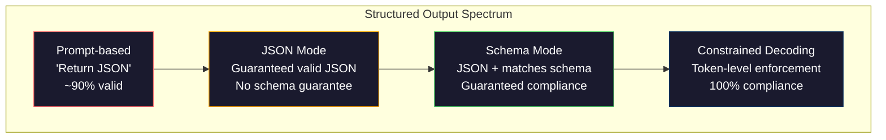
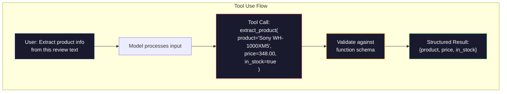

<!-- i18n:manual -->
# Структурированные ответы: JSON, валидация схемы, constrained decoding

> Ваша LLM возвращает строку. Вашему приложению нужен JSON. Этот зазор уронил больше продакшен-систем, чем любые галлюцинации модели. Структурированный вывод — мост между естественным языком и типизированными данными. Сделаете правильно — LLM превращается в надёжный API. Сделаете неправильно — будете в три часа ночи разбирать свободный текст регулярками.

**Type:** Build
**Languages:** Python
**Prerequisites:** Phase 10, Lessons 01-05 (LLMs from Scratch)
**Time:** ~90 minutes
**Related:** Phase 5 · 20 (Structured Outputs & Constrained Decoding) разбирает теорию на уровне декодера (логит-процессоры на FSM/CFG, Outlines, XGrammar). Этот урок — про продакшен-поверхность SDK (OpenAI `response_format`, tool use у Anthropic, Instructor). Прочитайте сначала Phase 5 · 20, если хотите понимать, что происходит под API.

## Learning Objectives

- Включать JSON-режим и вывод, ограниченный схемой, через параметры API у OpenAI и Anthropic
- Собрать слой валидации на Pydantic, который отбраковывает кривой вывод LLM и повторяет запрос с текстом ошибки
- Объяснять, как constrained decoding принуждает к валидному JSON на уровне токенов, без постобработки
- Проектировать устойчивые промпты извлечения, которые надёжно превращают неструктурированный текст в типизированные структуры данных

## The Problem

Вы просите LLM: «Извлеки название товара, цену и наличие из этого текста». Она отвечает:

```
The product is the Sony WH-1000XM5 headphones, which cost $348.00 and are currently in stock.
```

Это совершенно правильный ответ. И совершенно бесполезный для вашего приложения. Складской системе нужен `{"product": "Sony WH-1000XM5", "price": 348.00, "in_stock": true}`. Вам нужен JSON-объект с конкретными ключами, конкретными типами и конкретными ограничениями на значения. Предложение на английском вам не нужно.

> 🎒 **На пальцах.** Представьте, что вы попросили курьера принести чек, а он вернулся и пересказал его вслух. Всё верно, но в бухгалтерию такое не подошьёшь. Из фразы «cost $348.00 and are currently in stock» программе надо вытащить ровно три поля: строку, число 348.0 и булево `true` — а она видит одну длинную строку.

Наивное решение: дописать в промпт «Отвечай в JSON». Это работает в 90 % случаев. В оставшихся 10 % модель заворачивает JSON в markdown-заборчик, или добавляет вступление вроде «Here's the JSON:», или выдаёт синтаксически невалидный JSON, потому что закрыла скобку слишком рано. Ваш JSON-парсер падает. Конвейер встаёт. Вы добавляете try/except и цикл повторов. Повтор иногда даёт другие данные. Теперь к проблеме разбора добавилась проблема согласованности.

Это не проблема prompt engineering. Это проблема декодирования. Модель генерирует токены слева направо. В каждой позиции она выбирает самый вероятный следующий токен из словаря в 100 тысяч с лишним вариантов. Большинство этих вариантов в любой конкретной позиции дадут невалидный JSON. Если модель только что выдала `{"price":`, то следующим токеном обязан быть цифра, кавычка (для строки), `null`, `true`, `false` или минус. Всё остальное ломает JSON. Без ограничений модель может выбрать абсолютно разумное английское слово, катастрофически неверное синтаксически.

> 🎒 **На пальцах.** Сравните числа: словарь — примерно 100 000 токенов, а после `{"price":` допустимых продолжений от силы пара десятков. Значит примерно 99,98 % вариантов — ошибка. Промпт может только сместить вероятности в нужную сторону, но не обнулить остальные, и рано или поздно один запрос из десяти уходит не туда.

## The Concept

### The Structured Output Spectrum

Есть четыре уровня контроля над структурой вывода, каждый следующий надёжнее предыдущего.



**Prompt-based** («Respond in valid JSON»): никакого принуждения. Модель обычно слушается, но иногда нет. Надёжность: около 90 %. Как ломается: markdown-заборчики, вступительный текст, обрезанный вывод, неверная структура.

**JSON mode**: API гарантирует, что вывод — валидный JSON. У OpenAI это включает `response_format: { type: "json_object" }`. Вывод разберётся без ошибок. Но он может не совпасть с ожидаемой схемой: лишние ключи, не те типы, пропущенные поля.

**Schema mode**: API принимает JSON Schema и гарантирует, что вывод ей соответствует. В 2026 году это умеет каждый крупный провайдер нативно: `response_format: { type: "json_schema", json_schema: {...} }` у OpenAI (а также `tool_choice="required"`), tool use с `input_schema` у Anthropic, `response_schema` + `response_mime_type: "application/json"` у Gemini. На выходе ровно те ключи, типы и ограничения, которые вы задали.

**Constrained decoding**: в каждой позиции токена во время генерации декодер маскирует все токены, которые дали бы невалидный вывод. Если схема требует число, а модель собирается выдать букву, вероятность этого токена ставится в ноль. Модель физически может выдать только те токены, что ведут к валидному выводу. Именно это реализовано под капотом у режима structured output в OpenAI и у библиотек вроде Outlines и Guidance.

> 🎒 **На пальцах.** Четыре уровня — это как четыре способа заставить человека заполнить анкету. Просьба — записка «пишите разборчиво». JSON mode — бланк с рамками. Schema mode — бланк, который не примут без подписи и даты. Constrained decoding — ручка, которой в графе «возраст» физически можно написать только цифры. Разница между 90 % и 100 % на 100 000 запросов — это 10 000 упавших разборов против нуля.

### JSON Schema: The Contract Language

JSON Schema — это способ сообщить модели (или слою валидации), какой формы должен быть вывод. Её использует любая серьёзная система структурированного вывода.

```json
{
  "type": "object",
  "properties": {
    "product": { "type": "string" },
    "price": { "type": "number", "minimum": 0 },
    "in_stock": { "type": "boolean" },
    "categories": {
      "type": "array",
      "items": { "type": "string" }
    }
  },
  "required": ["product", "price", "in_stock"]
}
```

Эта схема говорит: вывод должен быть объектом со строкой `product`, неотрицательным числом `price`, булевым `in_stock` и необязательным массивом строк `categories`. Всё, что не подходит, отклоняется.

Схемы вытягивают и сложные случаи: вложенные объекты, массивы с типизированными элементами, enum (ограничить строку конкретным набором значений), сопоставление с шаблоном (регулярка на строках) и комбинаторы (oneOf, anyOf, allOf для полиморфных выводов).

> 🎒 **На пальцах.** Схема — это бланк заказа, а не пожелание. Обратите внимание на `"required": ["product", "price", "in_stock"]`: там три поля из четырёх, значит вывод без `categories` пройдёт валидацию, а вывод без `price` — нет. А `"minimum": 0` отсекает цену −5, хотя по типу это нормальное число.

### The Pydantic Pattern

В Python вы не пишете JSON Schema руками. Вы описываете модель Pydantic, а схему она сгенерирует за вас.

```python
from pydantic import BaseModel

class Product(BaseModel):
    product: str
    price: float
    in_stock: bool
    categories: list[str] = []
```

Это даёт ту же JSON Schema, что и выше. Библиотека Instructor (и SDK от OpenAI) принимают модели Pydantic напрямую: передаёте класс, получаете провалидированный экземпляр. Если вывод LLM не подошёл, Instructor повторяет запрос сам.

> 🎒 **На пальцах.** Четыре строки объявления полей заменяют пятнадцать строк JSON Schema из блока выше. `categories: list[str] = []` со значением по умолчанию — это ровно то поле, которого нет в `required`; остальные три без умолчания и потому обязательны. Один и тот же контракт, только на Python.

### Function Calling / Tool Use

Другой интерфейс к той же задаче. Вместо того чтобы просить модель выдать JSON напрямую, вы описываете «инструменты» (функции) с типизированными параметрами. Модель выдаёт вызов функции со структурированными аргументами. OpenAI называет это «function calling». Anthropic — «tool use». Результат один и тот же: структурированные данные.



Tool use предпочтительнее, когда модель должна выбрать, какую функцию звать, а не просто заполнить параметры. Если у вас 10 разных схем извлечения и модель обязана подобрать нужную по входу, tool use даёт вам сразу и выбор схемы, и структурированный вывод.

> 🎒 **На пальцах.** Разница как между «напиши мне данные на листочке» и «заполни вот эту конкретную форму из десяти на стойке». На схеме выше модель не пишет JSON — она вызывает `extract_product(product=..., price=..., in_stock=...)`, а провайдер уже сам проверяет аргументы по схеме функции и отдаёт вам готовый объект.

### Common Failure Modes

Даже с принуждением по схеме структурированный вывод ломается тонкими способами.

**Hallucinated values**: вывод соответствует схеме, но данные выдуманы. Модель выдаёт `{"price": 299.99}`, хотя в тексте написано $348. Валидация схемы этого не поймает — тип верный, значение неверное.

**Enum confusion**: вы ограничили поле набором `["in_stock", "out_of_stock", "preorder"]`. Модель выдаёт `"available"` — по смыслу верно, но не из разрешённого набора. Нормальный constrained decoding это предотвращает. Подходы на одном промпте — нет.

**Nested object depth**: глубоко вложенные схемы (4+ уровня) дают больше ошибок. Каждый уровень вложенности — ещё одно место, где модель может потерять нить структуры.

**Array length**: модель может выдать слишком много или слишком мало элементов в массиве. Схемы поддерживают `minItems` и `maxItems`, но не все провайдеры принуждают к ним на уровне декодирования.

**Optional field omission**: модель пропускает поля, которые формально необязательны, но по смыслу важны для вашей задачи. Объявляйте их обязательными в схеме, даже если данных иногда нет, — пусть модель явно выдаёт `null`.

```figure
mx-schema-funnel
```

> 🎒 **На пальцах.** Первая ловушка — самая злая: `{"price": 299.99}` пройдёт любую валидацию, потому что 299.99 это число не меньше нуля. Схема проверяет форму, а не правду. От вранья спасает не валидатор, а сверка с исходным текстом или второй прогон и сравнение ответов.

## Build It

### Step 1: JSON Schema Validator

Соберите валидатор с нуля: он проверяет, соответствует ли Python-объект JSON Schema. Именно это работает на выходной стороне и подтверждает соответствие.

```python
import json

def validate_schema(data, schema):
    errors = []
    _validate(data, schema, "", errors)
    return errors

def _validate(data, schema, path, errors):
    schema_type = schema.get("type")

    if schema_type == "object":
        if not isinstance(data, dict):
            errors.append(f"{path}: expected object, got {type(data).__name__}")
            return
        for key in schema.get("required", []):
            if key not in data:
                errors.append(f"{path}.{key}: required field missing")
        properties = schema.get("properties", {})
        for key, value in data.items():
            if key in properties:
                _validate(value, properties[key], f"{path}.{key}", errors)

    elif schema_type == "array":
        if not isinstance(data, list):
            errors.append(f"{path}: expected array, got {type(data).__name__}")
            return
        min_items = schema.get("minItems", 0)
        max_items = schema.get("maxItems", float("inf"))
        if len(data) < min_items:
            errors.append(f"{path}: array has {len(data)} items, minimum is {min_items}")
        if len(data) > max_items:
            errors.append(f"{path}: array has {len(data)} items, maximum is {max_items}")
        items_schema = schema.get("items", {})
        for i, item in enumerate(data):
            _validate(item, items_schema, f"{path}[{i}]", errors)

    elif schema_type == "string":
        if not isinstance(data, str):
            errors.append(f"{path}: expected string, got {type(data).__name__}")
            return
        enum_values = schema.get("enum")
        if enum_values and data not in enum_values:
            errors.append(f"{path}: '{data}' not in allowed values {enum_values}")

    elif schema_type == "number":
        if not isinstance(data, (int, float)):
            errors.append(f"{path}: expected number, got {type(data).__name__}")
            return
        minimum = schema.get("minimum")
        maximum = schema.get("maximum")
        if minimum is not None and data < minimum:
            errors.append(f"{path}: {data} is less than minimum {minimum}")
        if maximum is not None and data > maximum:
            errors.append(f"{path}: {data} is greater than maximum {maximum}")

    elif schema_type == "boolean":
        if not isinstance(data, bool):
            errors.append(f"{path}: expected boolean, got {type(data).__name__}")

    elif schema_type == "integer":
        if not isinstance(data, int) or isinstance(data, bool):
            errors.append(f"{path}: expected integer, got {type(data).__name__}")
```

> 🎒 **На пальцах.** Валидатор просто ходит по дереву и складывает жалобы в список `errors`. Пустой список — значит всё хорошо. Обратите внимание на строку `if not isinstance(data, int) or isinstance(data, bool)` для `integer`: в Python `True` это на самом деле единица, и без этой проверки `{"count": true}` прошло бы как целое число.

### Step 2: Pydantic-Style Model to Schema

Напишите минимальный конвертер класса в схему. Описываете Python-класс — JSON Schema получается автоматически.

```python
class SchemaField:
    def __init__(self, field_type, required=True, default=None, enum=None, minimum=None, maximum=None):
        self.field_type = field_type
        self.required = required
        self.default = default
        self.enum = enum
        self.minimum = minimum
        self.maximum = maximum

def python_type_to_schema(field):
    type_map = {
        str: "string",
        int: "integer",
        float: "number",
        bool: "boolean",
    }

    schema = {}

    if field.field_type in type_map:
        schema["type"] = type_map[field.field_type]
    elif field.field_type == list:
        schema["type"] = "array"
        schema["items"] = {"type": "string"}
    elif isinstance(field.field_type, dict):
        schema = field.field_type

    if field.enum:
        schema["enum"] = field.enum
    if field.minimum is not None:
        schema["minimum"] = field.minimum
    if field.maximum is not None:
        schema["maximum"] = field.maximum

    return schema

def model_to_schema(name, fields):
    properties = {}
    required = []

    for field_name, field in fields.items():
        properties[field_name] = python_type_to_schema(field)
        if field.required:
            required.append(field_name)

    return {
        "type": "object",
        "properties": properties,
        "required": required,
    }
```

> 🎒 **На пальцах.** Это Pydantic в миниатюре: словарик `type_map` переводит `str` в `"string"`, `int` в `"integer"`, `float` в `"number"`, `bool` в `"boolean"`. Поле с `required=True` попадает в список `required`, с `required=False` — нет. Настоящий Pydantic делает то же самое, только читает типы прямо из аннотаций.

### Step 3: Constrained Token Filter

Смоделируйте constrained decoding. По частично сгенерированной строке JSON и схеме определите, какие категории токенов допустимы в текущей позиции.

```python
def next_valid_tokens(partial_json, schema):
    stripped = partial_json.strip()

    if not stripped:
        return ["{"]

    try:
        json.loads(stripped)
        return ["<EOS>"]
    except json.JSONDecodeError:
        pass

    last_char = stripped[-1] if stripped else ""

    if last_char == "{":
        return ['"', "}"]
    elif last_char == '"':
        if stripped.endswith('":'):
            return ['"', "0-9", "true", "false", "null", "[", "{"]
        return ["a-z", '"']
    elif last_char == ":":
        return [" ", '"', "0-9", "true", "false", "null", "[", "{"]
    elif last_char == ",":
        return [" ", '"', "{", "["]
    elif last_char in "0123456789":
        return ["0-9", ".", ",", "}", "]"]
    elif last_char == "}":
        return [",", "}", "]", "<EOS>"]
    elif last_char == "]":
        return [",", "}", "<EOS>"]
    elif last_char == "[":
        return ['"', "0-9", "true", "false", "null", "{", "[", "]"]
    else:
        return ["any"]

def demonstrate_constrained_decoding():
    partial_states = [
        '',
        '{',
        '{"product"',
        '{"product":',
        '{"product": "Sony"',
        '{"product": "Sony",',
        '{"product": "Sony", "price":',
        '{"product": "Sony", "price": 348',
        '{"product": "Sony", "price": 348}',
    ]

    print(f"{'Partial JSON':<45} {'Valid Next Tokens'}")
    print("-" * 80)
    for state in partial_states:
        valid = next_valid_tokens(state, {})
        display = state if state else "(empty)"
        print(f"{display:<45} {valid}")
```

> 🎒 **На пальцах.** Это тот самый «забор» в самой простой форме. После `{` допустимы ровно два продолжения: `"` или `}`. После `:` — пробел, кавычка, цифра, `true`, `false`, `null`, `[` или `{`, то есть восемь вариантов вместо ста тысяч. Настоящий декодер делает то же самое, только ставит логиты всех остальных токенов в минус бесконечность.

### Step 4: Extraction Pipeline

Соберите всё в конвейер извлечения: описать схему, сымитировать выдачу структурированного вывода от LLM, провалидировать вывод и обработать повторы.

```python
def simulate_llm_extraction(text, schema, attempt=0):
    if "headphones" in text.lower() or "sony" in text.lower():
        if attempt == 0:
            return '{"product": "Sony WH-1000XM5", "price": 348.00, "in_stock": true, "categories": ["audio", "headphones"]}'
        return '{"product": "Sony WH-1000XM5", "price": 348.00, "in_stock": true}'

    if "laptop" in text.lower():
        return '{"product": "MacBook Pro 16", "price": 2499.00, "in_stock": false, "categories": ["computers"]}'

    return '{"product": "Unknown", "price": 0, "in_stock": false}'

def extract_with_retry(text, schema, max_retries=3):
    for attempt in range(max_retries):
        raw = simulate_llm_extraction(text, schema, attempt)

        try:
            data = json.loads(raw)
        except json.JSONDecodeError as e:
            print(f"  Attempt {attempt + 1}: JSON parse error -- {e}")
            continue

        errors = validate_schema(data, schema)
        if not errors:
            return data

        print(f"  Attempt {attempt + 1}: Schema validation errors -- {errors}")

    return None

product_schema = {
    "type": "object",
    "properties": {
        "product": {"type": "string"},
        "price": {"type": "number", "minimum": 0},
        "in_stock": {"type": "boolean"},
        "categories": {"type": "array", "items": {"type": "string"}},
    },
    "required": ["product", "price", "in_stock"],
}
```

> 🎒 **На пальцах.** `extract_with_retry` крутит цикл максимум `max_retries=3` раза: разобрать JSON, проверить по схеме, при ошибке — следующая попытка. Заметьте, что имитация на первой попытке возвращает `categories`, а на второй нет — это специально, чтобы вы увидели, что необязательное поле не роняет валидацию. Если все три попытки провалились, функция возвращает `None`, и это нормальный сценарий, который надо уметь обработать.

### Step 5: Run the Full Pipeline

```python
def run_demo():
    print("=" * 60)
    print("  Structured Output Pipeline Demo")
    print("=" * 60)

    print("\n--- Schema Definition ---")
    product_fields = {
        "product": SchemaField(str),
        "price": SchemaField(float, minimum=0),
        "in_stock": SchemaField(bool),
        "categories": SchemaField(list, required=False),
    }
    generated_schema = model_to_schema("Product", product_fields)
    print(json.dumps(generated_schema, indent=2))

    print("\n--- Schema Validation ---")
    test_cases = [
        ({"product": "Test", "price": 10.0, "in_stock": True}, "Valid object"),
        ({"product": "Test", "price": -5.0, "in_stock": True}, "Negative price"),
        ({"product": "Test", "in_stock": True}, "Missing price"),
        ({"product": "Test", "price": "ten", "in_stock": True}, "String as price"),
        ("not an object", "String instead of object"),
    ]

    for data, label in test_cases:
        errors = validate_schema(data, product_schema)
        status = "PASS" if not errors else f"FAIL: {errors}"
        print(f"  {label}: {status}")

    print("\n--- Constrained Decoding Simulation ---")
    demonstrate_constrained_decoding()

    print("\n--- Extraction Pipeline ---")
    texts = [
        "The Sony WH-1000XM5 headphones are priced at $348 and currently available.",
        "The new MacBook Pro 16-inch laptop costs $2499 but is sold out.",
        "This is a random sentence with no product info.",
    ]

    for text in texts:
        print(f"\n  Input: {text[:60]}...")
        result = extract_with_retry(text, product_schema)
        if result:
            print(f"  Output: {json.dumps(result)}")
        else:
            print(f"  Output: FAILED after retries")
```

> 🎒 **На пальцах.** В `test_cases` пять случаев: валидный объект, отрицательная цена, пропущенное `price`, строка `"ten"` вместо числа и вообще не объект. Первый пройдёт, остальные четыре дадут понятные сообщения об ошибке с путём до поля. Это ваш мини-набор тестов: каждый тип поломки схемы проверен ровно один раз.

## Use It

### OpenAI Structured Outputs

```python
# from openai import OpenAI
# from pydantic import BaseModel
#
# client = OpenAI()
#
# class Product(BaseModel):
#     product: str
#     price: float
#     in_stock: bool
#
# response = client.beta.chat.completions.parse(
#     model="gpt-5-mini",
#     messages=[
#         {"role": "system", "content": "Extract product information."},
#         {"role": "user", "content": "Sony WH-1000XM5, $348, in stock"},
#     ],
#     response_format=Product,
# )
#
# product = response.choices[0].message.parsed
# print(product.product, product.price, product.in_stock)
```

Режим structured output у OpenAI использует constrained decoding внутри. Каждый токен, который выдаёт модель, гарантированно ведёт к выводу, соответствующему схеме Pydantic. Повторы не нужны. Валидация не нужна. Ограничение вшито в сам процесс декодирования.

> 🎒 **На пальцах.** Ключевая строка тут `response_format=Product` — вы отдаёте класс Python, а SDK сам превращает его в JSON Schema и отправляет на сервер. Назад приходит `response.choices[0].message.parsed` — уже объект `Product`, а не строка. Ни `json.loads`, ни try/except.

### Anthropic Tool Use

```python
# import anthropic
#
# client = anthropic.Anthropic()
#
# response = client.messages.create(
#     model="claude-opus-4-7",
#     max_tokens=1024,
#     tools=[{
#         "name": "extract_product",
#         "description": "Extract product information from text",
#         "input_schema": {
#             "type": "object",
#             "properties": {
#                 "product": {"type": "string"},
#                 "price": {"type": "number"},
#                 "in_stock": {"type": "boolean"},
#             },
#             "required": ["product", "price", "in_stock"],
#         },
#     }],
#     messages=[{"role": "user", "content": "Extract: Sony WH-1000XM5, $348, in stock"}],
# )
```

Anthropic добивается структурированного вывода через tool use. Модель выдаёт вызов инструмента со структурированными аргументами, соответствующими input_schema. Результат тот же, поверхность API другая.

> 🎒 **На пальцах.** Обратите внимание: схема здесь лежит внутри `input_schema` описания инструмента, а не в отдельном параметре формата. Те же три поля и тот же список `required`, что и в схеме из раздела про JSON Schema, — просто упакованы как «функция, которую модель может вызвать».

### Instructor Library

```python
# pip install instructor
# import instructor
# from openai import OpenAI
# from pydantic import BaseModel
#
# client = instructor.from_openai(OpenAI())
#
# class Product(BaseModel):
#     product: str
#     price: float
#     in_stock: bool
#
# product = client.chat.completions.create(
#     model="gpt-5-mini",
#     response_model=Product,
#     messages=[{"role": "user", "content": "Sony WH-1000XM5, $348, in stock"}],
# )
```

Instructor оборачивает любой клиент LLM и добавляет автоматические повторы с валидацией. Если первая попытка не прошла валидацию, он отправляет ошибки обратно модели как контекст и просит починить вывод. Работает с любым провайдером, не только с OpenAI.

> 🎒 **На пальцах.** Разница механизмов: OpenAI не даёт модели ошибиться, Instructor ловит ошибку задним числом. Второе универсальнее (`from_openai`, `from_anthropic` — что угодно), но каждая неудачная попытка стоит вам ещё одного запроса и ещё одной секунды ожидания.

## Ship It

Этот урок производит `outputs/prompt-structured-extractor.md` — переиспользуемый шаблон промпта, который извлекает структурированные данные из любого текста по описанию схемы. Скармливаете ему JSON Schema и неструктурированный текст, получаете провалидированный JSON.

Также он производит `outputs/skill-structured-outputs.md` — фреймворк принятия решения о том, какую стратегию структурированного вывода выбрать, исходя из вашего провайдера, требований к надёжности и сложности схемы.

## Exercises

1. Расширьте валидатор схемы поддержкой `oneOf` (данные должны подойти ровно под одну из нескольких схем). Это нужно для полиморфных выводов — например, поле, в котором может лежать объект `Product` или объект `Service` разной формы.

2. Соберите инструмент «schema diff», который сравнивает две схемы и отличает ломающие изменения (удалённые обязательные поля, смена типов) от неломающих (добавленные необязательные поля, ослабленные ограничения). Без этого в продакшене не получится версионировать схемы извлечения.

3. Реализуйте более реалистичный симулятор constrained decoding. Возьмите JSON Schema и словарь из 100 токенов (буквы, цифры, пунктуация, ключевые слова) и пройдите генерацию по шагам, маскируя невалидные токены в каждой позиции. Измерьте, какой процент словаря допустим на каждом шаге.

4. Соберите набор для оценки извлечения. Сделайте 50 описаний товаров с размеченными вручную JSON-ответами. Прогоните конвейер извлечения на всех 50 и измерьте точное совпадение, точность по отдельным полям и соответствие типам. Выясните, какие поля извлекаются хуже всего.

5. Добавьте в конвейер извлечения «оценки уверенности». Для каждого извлечённого поля прикиньте, насколько модель в нём уверена (по вероятностям токенов или прогнав извлечение 3 раза и сравнив согласованность). Помечайте поля с низкой уверенностью на ручную проверку.

> 🎒 **На пальцах.** Начните с четвёртого задания — оно самое полезное и самое скучное. 50 размеченных примеров превращают «вроде работает» в число: например, точное совпадение 62 %, а по полям — 98 % на `product` и 71 % на `price`. Дальше сразу видно, что чинить, и остальные задания перестают быть догадками.

## Key Terms

| Term | What people say | What it actually means |
|------|----------------|----------------------|
| JSON mode | «Возвращает JSON» | Флаг API, который гарантирует синтаксически валидный JSON на выходе, но не принуждает ни к какой конкретной схеме |
| Structured output | «Типизированный JSON» | Вывод, соответствующий конкретной JSON Schema: верные ключи, типы и ограничения |
| Constrained decoding | «Управляемая генерация» | В каждой позиции токена маскировать токены, которые дали бы невалидный вывод — гарантирует 100 % соответствие схеме |
| JSON Schema | «Шаблон для JSON» | Декларативный язык описания структуры, типов и ограничений JSON-данных (используется в OpenAPI, JSON Forms и прочем) |
| Pydantic | «Питоновские dataclass-ы, но лучше» | Библиотека Python для описания моделей данных с проверкой типов; FastAPI и Instructor используют её для генерации JSON Schema |
| Function calling | «Tool use» | LLM выдаёт структурированный вызов функции (имя + типизированные аргументы) вместо свободного текста — поддерживают и OpenAI, и Anthropic |
| Instructor | «Pydantic для LLM» | Библиотека Python, которая оборачивает клиенты LLM и возвращает провалидированные объекты Pydantic, автоматически повторяя запрос при ошибке валидации |
| Token masking | «Фильтрация словаря» | Обнуление вероятностей конкретных токенов во время генерации, чтобы модель не могла их выдать |
| Schema compliance | «Совпадает по форме» | В выводе есть все обязательные поля, типы верны, значения в границах ограничений и нет лишних запрещённых полей |
| Retry loop | «Пробуем, пока не выйдет» | Отправить ошибки валидации обратно модели и попросить починить вывод — Instructor делает это сам, до настраиваемого максимума |

## Further Reading

- [OpenAI Structured Outputs Guide](https://platform.openai.com/docs/guides/structured-outputs) — официальная документация по constrained decoding на основе JSON Schema в API OpenAI
- [Willard & Louf, 2023 -- "Efficient Guided Generation for Large Language Models"](https://arxiv.org/abs/2307.09702) — статья про Outlines: как компилировать JSON Schema в конечные автоматы для ограничений на уровне токенов
- [Instructor documentation](https://python.useinstructor.com/) — стандартная библиотека для получения структурированных ответов от любой LLM с валидацией Pydantic и повторами
- [Anthropic Tool Use Guide](https://docs.anthropic.com/en/docs/tool-use) — как Claude реализует структурированный вывод через tool use с JSON Schema в input_schema
- [JSON Schema specification](https://json-schema.org/) — полная спецификация языка схем, который использует любая серьёзная система структурированного вывода
- [Outlines library](https://github.com/outlines-dev/outlines) — открытая реализация ограниченной генерации: регулярки и JSON Schema, скомпилированные в конечные автоматы
- [Dong et al., "XGrammar: Flexible and Efficient Structured Generation Engine for Large Language Models" (MLSys 2025)](https://arxiv.org/abs/2411.15100) — сегодняшний state of the art среди движков грамматик; компиляция в автомат с магазинной памятью, маскирование токенов примерно за 100 нс на токен.
- [Beurer-Kellner et al., "Prompting Is Programming: A Query Language for Large Language Models" (LMQL)](https://arxiv.org/abs/2212.06094) — статья про LMQL, где constrained decoding подан как язык запросов с ограничениями на типы и значения.
- [Microsoft Guidance (framework docs)](https://github.com/guidance-ai/guidance) — ограниченная генерация на шаблонах; не привязанное к вендору дополнение к Outlines и XGrammar.
