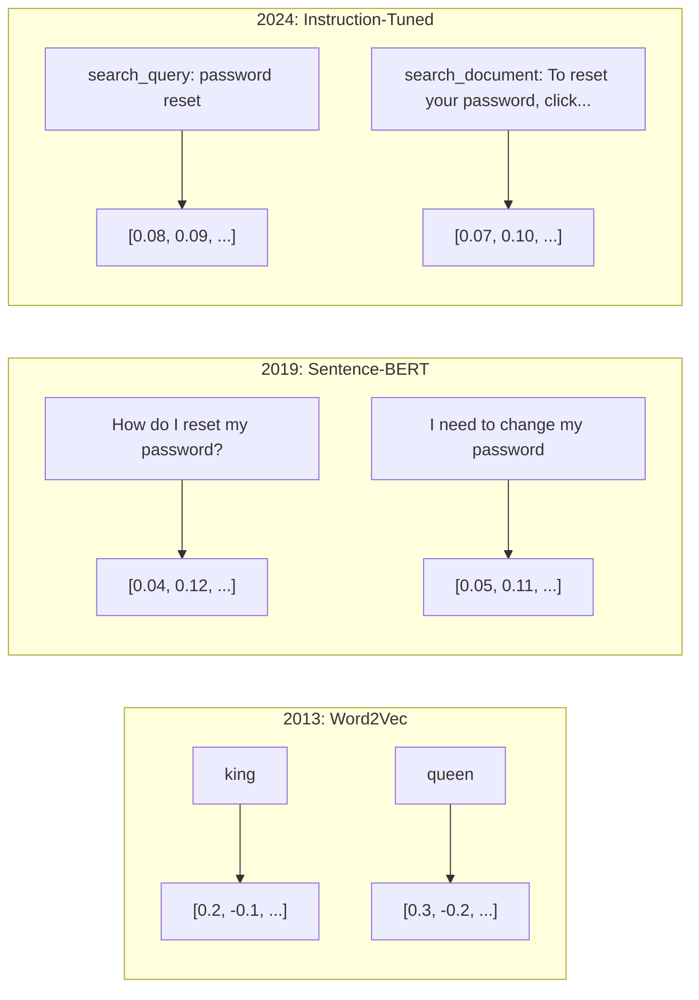
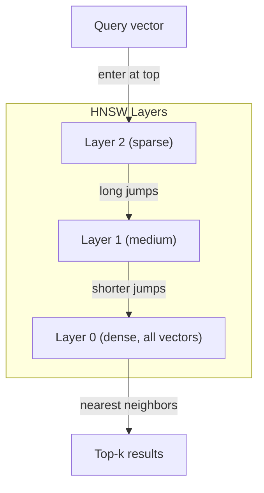

<!-- i18n:manual -->
# Эмбеддинги и векторные представления

> Текст дискретен. Математика непрерывна. Каждый раз, когда вы просите LLM найти «похожие» документы, сравнить смыслы или поискать не по ключевым словам, вы опираетесь на мост между этими двумя мирами. Этот мост — эмбеддинг. Если вы не понимаете эмбеддинги, вы не понимаете современный AI. Вы им просто пользуетесь.

**Type:** Build
**Languages:** Python
**Prerequisites:** Phase 11, Lesson 01 (Prompt Engineering)
**Time:** ~75 minutes
**Related:** Phase 5 · 22 (Embedding Models Deep Dive) разбирает dense против sparse против multi-vector, Matryoshka-усечение и выбор модели по каждой оси. Этот урок — про продакшен-конвейер (векторные базы, HNSW, математика близости). Прочитайте Phase 5 · 22 перед тем, как выбирать модель.

## Learning Objectives

- Генерировать эмбеддинги текста через API-провайдеров и open-source-модели и считать между ними косинусную близость
- Объяснять, почему эмбеддинги решают проблему словарного рассогласования, с которой поиск по ключевым словам не справляется
- Собрать индекс семантического поиска, который достаёт документы по смыслу, а не по точному совпадению слов
- Оценивать качество эмбеддингов по retrieval-бенчмаркам (precision@k, recall) и выбирать подходящую модель под свою задачу

## The Problem

У вас 10 000 тикетов поддержки. Клиент пишет: «мой платёж не прошёл». Нужно найти похожие прошлые тикеты. Поиск по ключевым словам найдёт тикеты со словами «платёж» и «не прошёл». Он пропустит «транзакция сорвалась», «списание отклонено» и «ошибка биллинга». А ведь это те же самые тикеты про ту же самую проблему, только другими словами.

Это и есть проблема словарного рассогласования (vocabulary mismatch). В человеческом языке одну и ту же мысль можно сказать десятком способов. Поиск по ключевым словам видит в каждом слове самостоятельный символ без всякого смысла. Он не может знать, что «отклонено» и «не прошло» — про одно и то же.

Вам нужно такое представление текста, где похожесть определяется смыслом, а не написанием. Нужен способ поместить «мой платёж не прошёл» и «транзакция была отклонена» рядом в каком-то математическом пространстве и одновременно отодвинуть подальше «мой платёж пришёл вовремя», хотя слово «платёж» есть и там, и там.

Это представление и есть эмбеддинг.

> 🎒 **На пальцах.** Поиск по ключевым словам — как искать друга по фамилии в телефонной книге: не знаете точного написания — не найдёте. Эмбеддинг — как искать по адресу: «транзакция сорвалась» живёт в соседнем доме от «платёж не прошёл», хотя ни одного общего слова у них нет. Из четырёх формулировок выше keyword-поиск найдёт одну, а поиск по смыслу — все четыре.

## The Concept

### What Is an Embedding?

Эмбеддинг — это плотный (dense) вектор из чисел с плавающей точкой, который представляет смысл текста. Слово «плотный» здесь важно: каждое измерение несёт информацию, в отличие от разреженных представлений (мешок слов, TF-IDF), где почти все измерения — нули.

«The cat sat on the mat» превращается во что-то вроде `[0.023, -0.041, 0.087, ..., 0.012]` — список из 768-3072 чисел, в зависимости от модели. Эти числа кодируют смысл. Вы никогда не разглядываете их по отдельности. Вы их сравниваете.

> 🎒 **На пальцах.** Представьте, что каждому тексту выдают координаты в очень многомерном городе. Смотреть на сами координаты бессмысленно — что вам скажет число 0.023? Смысл появляется, только когда вы меряете расстояние между двумя точками. Поэтому вектор из 768 чисел — это не «описание текста для человека», а «адрес текста для машины».

### The Word2Vec Breakthrough

В 2013 году Томаш Миколов с коллегами из Google опубликовали Word2Vec. Ключевая идея: обучите нейросеть предсказывать слово по соседям (или соседей по слову) — и веса скрытого слоя сами по себе станут осмысленными векторными представлениями.

Знаменитый результат:

```
king - man + woman = queen
```

Арифметика над векторами слов улавливает смысловые отношения. Направление от «man» к «woman» примерно такое же, как направление от «king» к «queen». В этот момент область поняла: геометрия умеет кодировать смысл.

Word2Vec выдавал 300-мерные векторы. Каждому слову доставался ровно один вектор, независимо от контекста. «Bank» в «river bank» (берег реки) и в «bank account» (банковский счёт) имели один и тот же эмбеддинг. Именно это ограничение задало направление исследований на следующее десятилетие.

> 🎒 **На пальцах.** Это как карта, где шаг «сменить пол» — это всегда одно и то же смещение: от «мужчина» к «женщина», от «король» к «королева», от «актёр» к «актриса». Модель никто этому не учил специально — она просто читала тексты и сама расставила слова так, что стрелки стали параллельными. Но 300 чисел на слово навсегда, без учёта контекста — и «берег реки» неотличим от «банковского счёта».

### From Words to Sentences

Векторы слов представляют отдельные токены. Продакшен-системам нужно кодировать целые предложения, абзацы или документы. Появилось четыре подхода:

**Averaging**: берём среднее всех векторов слов в предложении. Дёшево, теряет информацию, но для коротких текстов работает на удивление сносно. Полностью теряет порядок слов — «dog bites man» и «man bites dog» получат одинаковые эмбеддинги.

**CLS token**: трансформерные модели (BERT, 2018) выдают эмбеддинг специального токена [CLS], который представляет весь вход. Лучше усреднения, но токен [CLS] обучали предсказывать следующее предложение, а не мерить похожесть.

**Contrastive learning**: обучаем модель явно — сближать похожие пары и разводить непохожие. Sentence-BERT (Reimers и Gurevych, 2019) пошёл этим путём и стал фундаментом современных embedding-моделей. Для «How do I reset my password?» и «I need to change my password» модель учится выдавать почти одинаковые векторы.

**Instruction-tuned embeddings**: самый свежий подход. Модели вроде E5 и GTE принимают префикс задачи («search_query:», «search_document:»), который говорит модели, какой именно эмбеддинг нужен. Так одна модель обслуживает сразу несколько задач.



> 🎒 **На пальцах.** Усреднение — как описать фильм средним цветом всех кадров: что-то получится, но «Собака кусает человека» и «Человек кусает собаку» дадут ровно один и тот же серый. Contrastive learning — это когда модели показывают пары «эти два предложения про одно» и «а эти про разное» тысячи раз подряд, пока она не научится их разводить. Разница в качестве огромная: именно поэтому в продакшене берут потомков Sentence-BERT, а не среднее word2vec.

### Modern Embedding Models

Рынок устоялся вокруг горстки продакшен-вариантов (оценки MTEB на начало 2026 года, MTEB v2):

| Model | Provider | Dimensions | MTEB | Context | Cost / 1M tokens |
|-------|----------|-----------|------|---------|------------------|
| Gemini Embedding 2 | Google | 3072 (Matryoshka) | 67.7 (retrieval) | 8192 | $0.15 |
| embed-v4 | Cohere | 1024 (Matryoshka) | 65.2 | 128K | $0.12 |
| voyage-4 | Voyage AI | 1024/2048 (Matryoshka) | 66.8 | 32K | $0.12 |
| text-embedding-3-large | OpenAI | 3072 (Matryoshka) | 64.6 | 8192 | $0.13 |
| text-embedding-3-small | OpenAI | 1536 (Matryoshka) | 62.3 | 8192 | $0.02 |
| BGE-M3 | BAAI | 1024 (dense+sparse+ColBERT) | 63.0 многоязычный | 8192 | Open-weight |
| Qwen3-Embedding | Alibaba | 4096 (Matryoshka) | 66.9 | 32K | Open-weight |
| Nomic-embed-v2 | Nomic | 768 (Matryoshka) | 63.1 | 8192 | Open-weight |

MTEB (Massive Text Embedding Benchmark) v2 покрывает больше 100 задач: retrieval, классификация, кластеризация, переранжирование, суммаризация. Больше — лучше. К 2026 году open-weight-модели (Qwen3-Embedding, BGE-M3) догнали или обошли закрытые хостируемые почти по всем осям. Gemini Embedding 2 лидирует в чистом retrieval; Voyage и Cohere ведут в отдельных доменах (финансы, право, код). Всегда прогоняйте бенчмарк на своих собственных запросах, прежде чем на чём-то остановиться.

> 🎒 **На пальцах.** Посмотрите на две строки OpenAI: `-small` стоит $0.02 за миллион токенов при MTEB 62.3, а `-large` — $0.13 при 64.6. То есть в 6.5 раза дороже за плюс 2.3 балла. Для чата поддержки эти 2.3 балла обычно не видны глазом, а счёт видно сразу. Начинайте с дешёвой модели и повышайте, только если замерили, что она реально не тянет.

### Similarity Metrics

Есть два вектора-эмбеддинга — и три способа измерить, насколько они похожи:

**Cosine similarity**: косинус угла между двумя векторами. Диапазон от -1 (противоположны) до 1 (одно направление). Игнорирует длину вектора — предложение из 10 слов и документ из 500 слов могут дать 1.0, если смотрят в одну сторону. Это выбор по умолчанию для 90% случаев.

```
cosine_sim(a, b) = dot(a, b) / (||a|| * ||b||)
```

**Dot product**: обычное скалярное произведение двух векторов. Совпадает с косинусной близостью, если векторы нормированы (единичной длины). Считается быстрее. Эмбеддинги OpenAI нормированы, поэтому скалярное произведение и косинус дают одинаковый порядок.

```
dot(a, b) = sum(a_i * b_i)
```

**Euclidean (L2) distance**: расстояние по прямой в векторном пространстве. Меньше — похожее. Чувствительно к разнице длин векторов. Берите, когда важно абсолютное положение в пространстве, а не только направление.

```
L2(a, b) = sqrt(sum((a_i - b_i)^2))
```

Что когда использовать:

| Metric | Use when | Avoid when |
|--------|----------|------------|
| Cosine similarity | Сравниваете тексты разной длины; большинство retrieval-задач | Длина вектора несёт информацию |
| Dot product | Эмбеддинги уже нормированы; нужна максимальная скорость | У векторов разная длина |
| Euclidean distance | Кластеризация; пространственные задачи о ближайших соседях | Сравнение документов сильно разной длины |

> 🎒 **На пальцах.** Косинус мерит направление, евклидово расстояние — ещё и длину. Пример: короткая заметка про котов и длинная статья про котов смотрят в одну сторону, косинус даст ~0.95, а вот евклидово расстояние будет большим просто потому, что у длинного текста вектор «длиннее». Поэтому в поиске почти всегда берут косинус: вам важна тема, а не объём текста.

### Vector Databases and HNSW

Поиск в лоб сравнивает запрос с каждым сохранённым вектором. На миллионе векторов по 1536 измерений это 1.5 миллиарда операций умножения-сложения на один запрос. Слишком медленно.

Векторные базы решают это алгоритмами приближённого поиска соседей (Approximate Nearest Neighbor, ANN). Главный алгоритм — HNSW (Hierarchical Navigable Small World):

1. Строим многослойный граф векторов
2. Верхние слои разрежены — длинные связи между далёкими кластерами
3. Нижние слои плотные — мелкие связи между близкими векторами
4. Поиск стартует на верхнем слое и жадно спускается вниз, уточняя результат
5. Возвращает приближённый top-k за O(log n) вместо O(n)

HNSW меняет небольшую потерю точности (обычно 95-99% recall) на огромный выигрыш в скорости. На 10 миллионах векторов поиск в лоб занимает секунды. HNSW — миллисекунды.



Варианты для продакшена:

| Database | Type | Best for | Max scale |
|----------|------|----------|-----------|
| Pinecone | Управляемый SaaS | Продакшен без забот об инфраструктуре | Миллиарды |
| Weaviate | Open source | Свой хостинг, гибридный поиск | 100M+ |
| Qdrant | Open source | Высокая производительность, фильтрация | 100M+ |
| ChromaDB | Встраиваемая | Прототипы, локальная разработка | 1M |
| pgvector | Расширение Postgres | Вы уже используете Postgres | 10M |
| FAISS | Библиотека | Внутри процесса, исследования | 1B+ |

> 🎒 **На пальцах.** HNSW — как поиск дома в чужом городе: сначала едете по трассе до нужного района (верхний слой, длинные прыжки), потом по улицам, потом пешком по дворам (нижний слой). Никто не обходит все дома города подряд. Цена — иногда промахнётесь мимо соседнего дома: 1.5 миллиарда операций превращаются в тысячи, а найдёте вы 97 правильных ответов из 100 вместо 100.

### Chunking Strategies

Документы слишком длинные, чтобы кодировать их одним вектором. PDF на 50 страниц покрывает десятки тем, и его эмбеддинг становится средним по всему сразу — похожим ни на что конкретное. Поэтому документы режут на фрагменты (chunks) и кодируют каждый отдельно.

**Fixed-size chunking**: режем каждые N токенов с перекрытием в M токенов. Просто и предсказуемо. Хорошо работает, когда у документов нет ясной структуры. Фрагмент в 512 токенов с перекрытием 50: первый — токены 0-511, второй — токены 462-973.

**Sentence-based chunking**: режем по границам предложений, набирая предложения, пока не упрёмся в лимит токенов. В каждом фрагменте хотя бы одно целое предложение. Лучше фиксированного размера, потому что вы никогда не разрубаете мысль пополам.

**Recursive chunking**: сначала пробуем резать по самой крупной границе (заголовки разделов). Если всё ещё велико — по абзацам. Потом по предложениям. Потом по символам. Это `RecursiveCharacterTextSplitter` из LangChain, и он хорошо себя ведёт на разнородных корпусах.

**Semantic chunking**: кодируем каждое предложение, потом склеиваем подряд идущие предложения с похожими эмбеддингами. Как только похожесть падает ниже порога — начинаем новый фрагмент. Дорого (нужен эмбеддинг для каждого предложения), зато фрагменты получаются самыми связными.

| Strategy | Complexity | Quality | Best for |
|----------|-----------|---------|----------|
| Fixed-size | Низкая | Сносное | Неструктурированный текст, логи |
| Sentence-based | Низкая | Хорошее | Статьи, письма |
| Recursive | Средняя | Хорошее | Markdown, HTML, смешанные документы |
| Semantic | Высокая | Лучшее | Когда качество поиска критично |

Золотая середина для большинства систем: фрагменты по 256-512 токенов с перекрытием в 50 токенов.

> 🎒 **На пальцах.** Перекрытие — страховка от разрезанной пополам мысли. Считаем на примере из текста: фрагменты по 512 токенов с перекрытием 50 идут 0-511, 462-973, 924-1435 — каждый следующий начинается на 50 токенов раньше конца предыдущего. Значит, фраза на стыке целиком попадёт хотя бы в один фрагмент, а не развалится надвое.

### Bi-Encoders vs Cross-Encoders

Bi-encoder кодирует запрос и документы независимо, а потом сравнивает векторы. Быстро: запрос кодируем один раз и сравниваем с заранее посчитанными векторами документов. Именно это вы используете для retrieval.

Cross-encoder берёт запрос и документ как один общий вход и выдаёт оценку релевантности. Медленно: каждую пару «запрос-документ» приходится прогонять через модель целиком. Зато гораздо точнее, потому что модель может смотреть на токены запроса и документа одновременно.

Продакшен-паттерн: bi-encoder достаёт топ-100 кандидатов, cross-encoder переранжирует их в топ-10. Это конвейер retrieve-then-rerank.


Модели для переранжирования: Cohere Rerank 3.5 ($2 за 1000 запросов), BGE-reranker-v2 (бесплатно, open source), Jina Reranker v2 (бесплатно, open source).

> 🎒 **На пальцах.** Bi-encoder — как отбор резюме по ключевым навыкам: быстро, грубо, из тысячи в стопку сотни. Cross-encoder — как собеседование: долго, зато видно, подходит ли человек именно под эту вакансию. Никто не собеседует тысячу человек и никто не нанимает по одному резюме — поэтому в продакшене стоят оба этапа подряд.

### Matryoshka Embeddings

Обычные эмбеддинги работают по принципу «всё или ничего». Вектор на 1536 измерений занимает 1536 float. Обрезать его до 256 измерений без переобучения нельзя.

Matryoshka Representation Learning (Kusupati и соавторы, 2022) это чинит. Модель обучают так, чтобы первые N измерений несли самую важную информацию — как русская матрёшка. Урезание 1536-мерного Matryoshka-эмбеддинга до 256 измерений отнимает немного точности, но вектор остаётся рабочим.

Модели OpenAI text-embedding-3-small и text-embedding-3-large поддерживают Matryoshka-усечение через параметр `dimensions`. Запросить 256 измерений вместо 1536 — значит сократить хранение в 6 раз ценой примерно 3-5% точности на бенчмарках MTEB.

> 🎒 **На пальцах.** Обычный вектор — как пазл: выкиньте половину деталей, и картинки не будет. Matryoshka-вектор — как книга, где первая глава уже содержит всю суть, а дальше идут подробности. Считаем: 1536 ÷ 256 = 6 раз меньше места, а промахов становится больше на 3-5%, то есть из 100 запросов 3-5 достанут не то. Обычно это выгодный обмен.

### Binary Quantization

Эмбеддинг на 1536 измерений в формате float32 занимает 6144 байта. Умножьте на 10 миллионов документов — 61 ГБ на одни только векторы.

Бинарная квантизация превращает каждое число в один бит: положительное становится 1, отрицательное — 0. Хранение падает с 6144 байт до 192 — в 32 раза. Похожесть считают расстоянием Хэмминга (число различающихся битов), а это процессор делает одной инструкцией.

Точность проседает примерно на 5-10% по retrieval recall. Обычный паттерн: бинарная квантизация для первого прохода по миллионам векторов, потом пересчёт топ-1000 полноточными векторами. Так вы получаете 95%+ от точности полной точности при памяти в 32 раза меньше.

```figure
cosine-similarity
```

> 🎒 **На пальцах.** Считаем сами: 1536 чисел × 4 байта = 6144 байта, а 1536 битов = 192 байта, отсюда и множитель 32. Это как заменить цветное фото чёрно-белым контуром: узнать предмет всё ещё можно, оттенки потеряны. Поэтому контур используют для грубого отсева, а окончательное решение принимают по «цветной» версии тысячи лучших кандидатов.

## Build It

Мы соберём движок семантического поиска с нуля. Без векторной базы. Без внешнего embedding-API. Чистый Python и numpy для математики.

### Step 1: Text Chunking

```python
def chunk_text(text, chunk_size=200, overlap=50):
    words = text.split()
    chunks = []
    start = 0
    while start < len(words):
        end = start + chunk_size
        chunk = " ".join(words[start:end])
        chunks.append(chunk)
        start += chunk_size - overlap
    return chunks


def chunk_by_sentences(text, max_chunk_tokens=200):
    sentences = text.replace("\n", " ").split(".")
    sentences = [s.strip() + "." for s in sentences if s.strip()]
    chunks = []
    current_chunk = []
    current_length = 0
    for sentence in sentences:
        sentence_length = len(sentence.split())
        if current_length + sentence_length > max_chunk_tokens and current_chunk:
            chunks.append(" ".join(current_chunk))
            current_chunk = []
            current_length = 0
        current_chunk.append(sentence)
        current_length += sentence_length
    if current_chunk:
        chunks.append(" ".join(current_chunk))
    return chunks
```

> 🎒 **На пальцах.** Посмотрите на строку `start += chunk_size - overlap`: при chunk_size=200 и overlap=50 указатель двигается на 150 слов, а берём мы 200. Значит, последние 50 слов каждого фрагмента повторяются в начале следующего — это и есть перекрытие. Уберите overlap, и предложение, разрезанное на границе, не найдётся ни по одному фрагменту.

### Step 2: Building Embeddings from Scratch

Мы реализуем простой плотный эмбеддинг на основе TF-IDF с L2-нормализацией. Это не нейросетевой эмбеддинг, но контракт тот же: на входе текст, на выходе вектор фиксированного размера, похожие тексты дают похожие векторы.

```python
import math
import numpy as np
from collections import Counter

class SimpleEmbedder:
    def __init__(self):
        self.vocab = []
        self.idf = []
        self.word_to_idx = {}

    def fit(self, documents):
        vocab_set = set()
        for doc in documents:
            vocab_set.update(doc.lower().split())
        self.vocab = sorted(vocab_set)
        self.word_to_idx = {w: i for i, w in enumerate(self.vocab)}
        n = len(documents)
        self.idf = np.zeros(len(self.vocab))
        for i, word in enumerate(self.vocab):
            doc_count = sum(1 for doc in documents if word in doc.lower().split())
            self.idf[i] = math.log((n + 1) / (doc_count + 1)) + 1

    def embed(self, text):
        words = text.lower().split()
        count = Counter(words)
        total = len(words) if words else 1
        vec = np.zeros(len(self.vocab))
        for word, freq in count.items():
            if word in self.word_to_idx:
                tf = freq / total
                vec[self.word_to_idx[word]] = tf * self.idf[self.word_to_idx[word]]
        norm = np.linalg.norm(vec)
        if norm > 0:
            vec = vec / norm
        return vec
```

> 🎒 **На пальцах.** IDF — это «редкое слово важнее частого». В формуле `math.log((n + 1) / (doc_count + 1)) + 1`: если слово встречается во всех 100 документах, log(101/101)+1 = 1, вес минимальный. Если только в одном — log(101/2)+1 ≈ 4.9, вес в пять раз больше. Поэтому слово «the» ничего не решает, а «рефанд» решает всё. Финальная нормализация делит вектор на его длину, чтобы длинные тексты не побеждали автоматически.

### Step 3: Similarity Functions

```python
def cosine_similarity(a, b):
    dot = np.dot(a, b)
    norm_a = np.linalg.norm(a)
    norm_b = np.linalg.norm(b)
    if norm_a == 0 or norm_b == 0:
        return 0.0
    return float(dot / (norm_a * norm_b))


def dot_product(a, b):
    return float(np.dot(a, b))


def euclidean_distance(a, b):
    return float(np.linalg.norm(a - b))
```

### Step 4: Vector Index with Brute-Force Search

```python
class VectorIndex:
    def __init__(self):
        self.vectors = []
        self.texts = []
        self.metadata = []

    def add(self, vector, text, meta=None):
        self.vectors.append(vector)
        self.texts.append(text)
        self.metadata.append(meta or {})

    def search(self, query_vector, top_k=5, metric="cosine"):
        scores = []
        for i, vec in enumerate(self.vectors):
            if metric == "cosine":
                score = cosine_similarity(query_vector, vec)
            elif metric == "dot":
                score = dot_product(query_vector, vec)
            elif metric == "euclidean":
                score = -euclidean_distance(query_vector, vec)
            else:
                raise ValueError(f"Unknown metric: {metric}")
            scores.append((i, score))
        scores.sort(key=lambda x: x[1], reverse=True)
        results = []
        for idx, score in scores[:top_k]:
            results.append({
                "text": self.texts[idx],
                "score": score,
                "metadata": self.metadata[idx],
                "index": idx
            })
        return results

    def size(self):
        return len(self.vectors)
```

### Step 5: The Semantic Search Engine

```python
class SemanticSearchEngine:
    def __init__(self, chunk_size=200, overlap=50):
        self.embedder = SimpleEmbedder()
        self.index = VectorIndex()
        self.chunk_size = chunk_size
        self.overlap = overlap

    def index_documents(self, documents, source_names=None):
        all_chunks = []
        all_sources = []
        for i, doc in enumerate(documents):
            chunks = chunk_text(doc, self.chunk_size, self.overlap)
            all_chunks.extend(chunks)
            name = source_names[i] if source_names else f"doc_{i}"
            all_sources.extend([name] * len(chunks))
        self.embedder.fit(all_chunks)
        for chunk, source in zip(all_chunks, all_sources):
            vec = self.embedder.embed(chunk)
            self.index.add(vec, chunk, {"source": source})
        return len(all_chunks)

    def search(self, query, top_k=5, metric="cosine"):
        query_vec = self.embedder.embed(query)
        return self.index.search(query_vec, top_k, metric)

    def search_with_scores(self, query, top_k=5):
        results = self.search(query, top_k)
        return [
            {
                "text": r["text"][:200],
                "source": r["metadata"].get("source", "unknown"),
                "score": round(r["score"], 4)
            }
            for r in results
        ]
```

> 🎒 **На пальцах.** Обратите внимание на порядок в `index_documents`: сначала все документы режутся на фрагменты, потом `fit` строит словарь по всем фрагментам сразу, и только потом каждый фрагмент кодируется. Иначе у разных фрагментов получились бы векторы разной длины и разного смысла — сравнивать их было бы нельзя. В `search` для евклидовой метрики стоит минус: `-euclidean_distance(...)`, потому что сортировка идёт по убыванию, а у расстояния меньше значит лучше.

### Step 6: Comparing Similarity Metrics

```python
def compare_metrics(engine, query, top_k=3):
    results = {}
    for metric in ["cosine", "dot", "euclidean"]:
        hits = engine.search(query, top_k=top_k, metric=metric)
        results[metric] = [
            {"score": round(h["score"], 4), "preview": h["text"][:80]}
            for h in hits
        ]
    return results
```

## Use It

С продакшен-API для эмбеддингов архитектура остаётся ровно такой же. Меняется только сам энкодер:

```python
from openai import OpenAI

client = OpenAI()

def openai_embed(texts, model="text-embedding-3-small", dimensions=None):
    kwargs = {"model": model, "input": texts}
    if dimensions:
        kwargs["dimensions"] = dimensions
    response = client.embeddings.create(**kwargs)
    return [item.embedding for item in response.data]
```

Matryoshka-усечение в OpenAI — та же модель, меньше измерений, меньше хранения:

```python
full = openai_embed(["semantic search query"], dimensions=1536)
compact = openai_embed(["semantic search query"], dimensions=256)
```

Вектор на 256 измерений занимает в 6 раз меньше места. На 10 миллионах документов это 10 ГБ против 61 ГБ. Потеря точности — примерно 3-5% на стандартных бенчмарках.

> 🎒 **На пальцах.** Здесь одна строка кода меняет счёт за хранилище. `dimensions=256` вместо `dimensions=1536` — и 61 ГБ превращаются в 10 ГБ. При этом модель и запрос к API те же самые: вы просто просите отдать первые 256 чисел вектора вместо всех 1536.

Для переранжирования через Cohere:

```python
import cohere

co = cohere.ClientV2()

results = co.rerank(
    model="rerank-v3.5",
    query="What is the refund policy?",
    documents=["Full refund within 30 days...", "No refunds after 90 days..."],
    top_n=3
)
```

Для локальных эмбеддингов без зависимости от API:

```python
from sentence_transformers import SentenceTransformer

model = SentenceTransformer("BAAI/bge-small-en-v1.5")
embeddings = model.encode(["semantic search query", "another document"])
```

Класс VectorIndex из нашей сборки работает с любым из этих вариантов. Замените функцию эмбеддинга, логику поиска оставьте как есть.

## Ship It

Этот урок даёт на выходе:
- `outputs/prompt-embedding-advisor.md` — промпт для выбора embedding-моделей и стратегий под конкретные задачи
- `outputs/skill-embedding-patterns.md` — скилл, который учит агентов грамотно применять эмбеддинги в продакшене

## Exercises

1. **Metric comparison**: прогоните одни и те же 5 запросов по примерным документам с косинусной близостью, скалярным произведением и евклидовым расстоянием. Запишите топ-3 для каждой метрики. На каких запросах метрики расходятся? Почему?

2. **Chunk size experiment**: проиндексируйте примерные документы с размерами фрагментов 50, 100, 200 и 500 слов. Для каждого прогоните 5 запросов и запишите оценку топ-1. Постройте график зависимости качества поиска от размера фрагмента. Найдите точку, где увеличение фрагмента начинает вредить.

3. **Matryoshka simulation**: сделайте SimpleEmbedder, который выдаёт 500-мерные векторы. Обрежьте до 50, 100, 200 и 500 измерений. Замерьте, как деградирует recall на каждом усечении. Так вы смоделируете поведение Matryoshka без настоящего трюка с обучением.

4. **Binary quantization**: возьмите эмбеддинги из поискового движка, переведите их в бинарный вид (1 если положительное, 0 если отрицательное) и реализуйте поиск по расстоянию Хэмминга. Сравните топ-10 с полноточной косинусной близостью. Замерьте процент совпадения.

5. **Sentence-based chunking**: замените нарезку фиксированного размера на `chunk_by_sentences`. Прогоните те же запросы и сравните оценки поиска. Улучшает ли результат уважение к границам предложений?

> 🎒 **На пальцах.** Подсказка ко второму заданию: очень маленькие фрагменты (50 слов) теряют контекст — ответ разрывается пополам. Очень большие (500 слов) размывают смысл: один вектор пытается описать сразу три темы, и косинус к любому запросу выходит средненький, вроде 0.3 вместо 0.7. График почти всегда получается горбом с максимумом где-то в районе 200 слов — это и есть та самая золотая середина из раздела про chunking.

## Key Terms

| Term | What people say | What it actually means |
|------|----------------|----------------------|
| Embedding | «Текст в числа» | Плотный вектор, в котором геометрическая близость кодирует смысловое сходство |
| Word2Vec | «Дедушка эмбеддингов» | Модель 2013 года, выучившая векторы слов через предсказание контекста; доказала, что арифметика векторов кодирует смысл |
| Cosine similarity | «Насколько похожи два вектора» | Косинус угла между векторами; 1 — одно направление, 0 — перпендикулярны, -1 — противоположны |
| HNSW | «Быстрый поиск по векторам» | Hierarchical Navigable Small World — многослойный граф, дающий приближённый поиск соседей за O(log n) |
| Bi-encoder | «Кодируем отдельно, сравниваем быстро» | Кодирует запрос и документ независимо; позволяет посчитать векторы заранее и искать быстро |
| Cross-encoder | «Медленный, но точный переранжировщик» | Прогоняет пару «запрос-документ» через модель целиком; точнее, но ничего нельзя посчитать заранее |
| Matryoshka embeddings | «Обрезаемые векторы» | Эмбеддинги, обученные так, что первые N измерений несут самое важное; размер хранения можно выбирать |
| Binary quantization | «Однобитные эмбеддинги» | Перевод float-векторов в биты (только знак) — в 32 раза меньше места, поиск по расстоянию Хэмминга |
| Chunking | «Режем документы под эмбеддинги» | Разбиение документов на куски по 256-512 токенов, чтобы каждый кодировался и находился отдельно |
| Vector database | «Поисковик для эмбеддингов» | Хранилище, заточенное под векторы и приближённый поиск ближайших соседей на больших объёмах |
| Contrastive learning | «Обучение сравнением» | Подход, который сближает эмбеддинги похожих пар и разводит эмбеддинги непохожих |
| MTEB | «Тот самый бенчмарк эмбеддингов» | Massive Text Embedding Benchmark — 56 наборов данных, 8 типов задач; стандарт сравнения embedding-моделей |

## Further Reading

- Mikolov et al., "Efficient Estimation of Word Representations in Vector Space" (2013) — та самая статья про Word2Vec, с которой началась революция эмбеддингов и аналогия king-queen
- Reimers & Gurevych, "Sentence-BERT: Sentence Embeddings using Siamese BERT-Networks" (2019) — как обучать bi-encoder на похожесть предложений; фундамент современных embedding-моделей
- Kusupati et al., "Matryoshka Representation Learning" (2022) — техника векторов переменной размерности, которую OpenAI взяла в text-embedding-3
- Malkov & Yashunin, "Efficient and Robust Approximate Nearest Neighbor using Hierarchical Navigable Small World Graphs" (2018) — статья про HNSW, алгоритм за большинством продакшен-поисков по векторам
- OpenAI Embeddings Guide (platform.openai.com/docs/guides/embeddings) — практический справочник по моделям text-embedding-3, включая уменьшение размерности через Matryoshka
- MTEB Leaderboard (huggingface.co/spaces/mteb/leaderboard) — живой бенчмарк, сравнивающий все embedding-модели по задачам и языкам
- [Muennighoff et al., "MTEB: Massive Text Embedding Benchmark" (EACL 2023)](https://arxiv.org/abs/2210.07316) — бенчмарк, задающий 8 категорий задач (классификация, кластеризация, классификация пар, переранжирование, retrieval, STS, суммаризация, поиск параллельных текстов), по которым отчитывается лидерборд; прочитайте, прежде чем верить одной цифре MTEB.
- [Sentence Transformers documentation](https://www.sbert.net/) — канонический справочник по bi-encoder против cross-encoder, стратегиям пулинга и конвейеру ingest-split-embed-store для RAG, который реализован в этом уроке.
