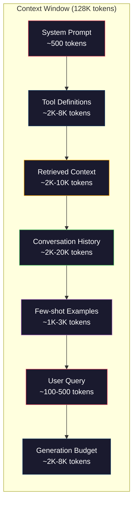
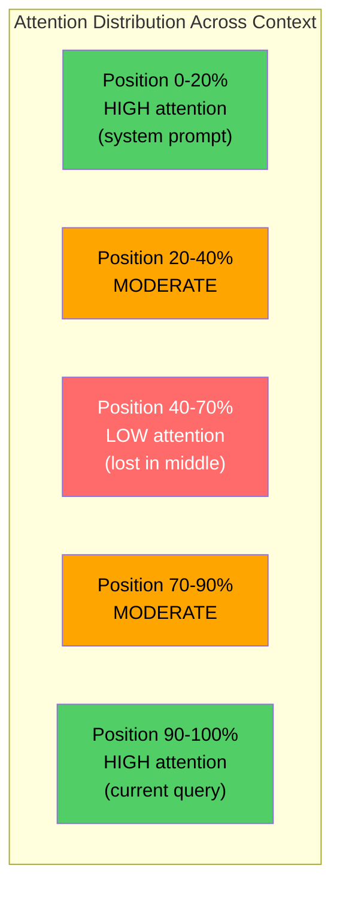
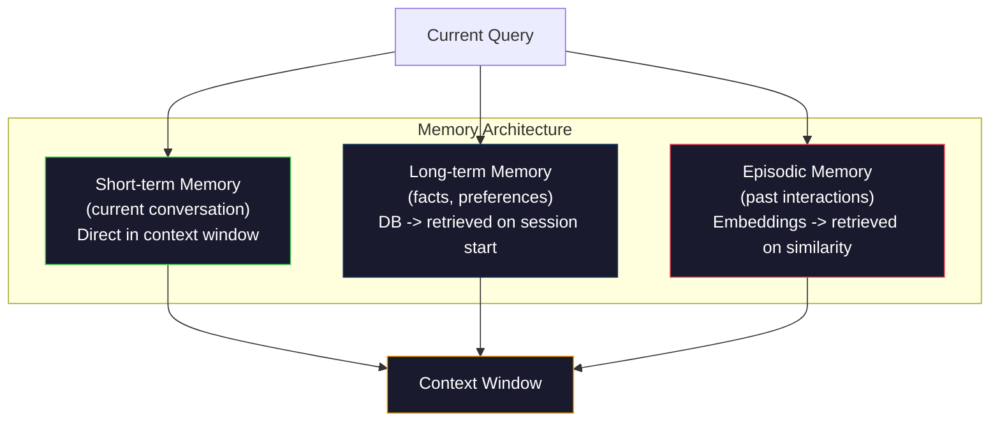

<!-- i18n:manual -->
# Context engineering: окна, бюджеты, память и retrieval

> Prompt engineering — это лишь часть. Context engineering — вся игра целиком. Промпт — это строка, которую вы печатаете. Контекст — это всё, что попадает в окно модели: системные инструкции, найденные документы, определения инструментов, история диалога, few-shot примеры и сам промпт. Лучшие AI-инженеры 2026 года — это context-инженеры. Они решают, что войдёт внутрь, что останется снаружи и в каком порядке.

**Type:** Build
**Languages:** Python
**Prerequisites:** Phase 10 (LLMs from Scratch), Phase 11 Lesson 01-02
**Time:** ~90 minutes
**Related:** Phase 11 · 15 (Prompt Caching) — раскладка, дружелюбная к кэшу, это продолжение context engineering. Phase 5 · 28 (Long-Context Evaluation) — как измерять lost-in-the-middle с помощью NIAH/RULER.

## Learning Objectives

- Считать бюджет токенов по всем компонентам окна контекста (системный промпт, инструменты, история, найденные документы, запас на генерацию)
- Реализовать стратегии управления окном контекста: обрезку, суммаризацию и скользящее окно для истории диалога
- Расставлять компоненты контекста по приоритету и порядку так, чтобы внимание модели попадало на самое важное
- Собрать context assembler, который динамически распределяет токены в зависимости от типа запроса и свободного места в окне

## The Problem

У Claude Opus 4.7 окно на 200K токенов (1M в бете). У GPT-5 — 400K. У Gemini 3 Pro — 2M. Llama 4 заявляет 10M. Эти числа звучат огромными, пока вы их не заполните.

Вот реальная раскладка для кодового ассистента. Системный промпт: 500 токенов. Определения 50 инструментов: 8 000 токенов. Найденная документация: 4 000 токенов. История диалога (10 ходов): 6 000 токенов. Текущий запрос пользователя: 200 токенов. Бюджет генерации (максимум вывода): 4 000 токенов. Итого: 22 700 токенов. Это всего 18% от окна в 128K.

> 🎒 **На пальцах.** Окно контекста — как рюкзак в поход: 128K токенов это объём, а не «сколько угодно». Посчитайте сами: 500 + 8000 + 4000 + 6000 + 200 + 4000 = 22 700, и больше трети этого веса (8 000) съели описания инструментов, которыми модель, скорее всего, даже не воспользуется.

Но внимание не масштабируется линейно с длиной контекста. Модель со 128K токенов контекста платит квадратичную цену за attention (O(n^2) в ванильном трансформере, хотя большинство продакшен-моделей используют эффективные варианты attention). Важнее другое: точность поиска падает. Тест «Needle in a Haystack» показывает, что моделям тяжело найти информацию, помещённую в середину длинного контекста. Исследование Liu et al. (2023) показало, что LLM достают информацию из начала и конца длинного контекста почти со стопроцентной точностью, но для информации в середине (позиции 40-70% контекста) точность падает на 10-20%. Этот эффект «lost-in-the-middle» проявляется по-разному у разных моделей, но задевает все текущие архитектуры.

Практический вывод: наличие 200K токенов не означает, что использовать 200K токенов эффективно. Аккуратно собранный контекст на 10K токенов часто работает лучше, чем сваленные в кучу 100K. Context engineering — это дисциплина максимизации отношения сигнал/шум внутри окна контекста.

Каждый токен, который вы кладёте в окно, вытесняет токен, который мог бы нести больше пользы. Каждое лишнее определение инструмента, каждый протухший ход диалога, каждый найденный кусок текста, который не отвечает на вопрос, — всё это делает модель чуть хуже в задаче.

## The Concept

### The Context Window is a Scarce Resource

Думайте об окне контекста как об оперативной памяти, а не о диске. Оно быстрое и доступно напрямую, но ограничено. Всё туда не влезет. Придётся выбирать.



Каждый компонент конкурирует за место. Больше определений инструментов — меньше места под историю диалога. Больше найденного контекста — меньше места под few-shot примеры. Context engineering — это искусство распределять этот бюджет так, чтобы качество на задаче было максимальным.

> 🎒 **На пальцах.** Это как чемодан с лимитом 20 кг в аэропорту. На схеме выше у tool definitions вилка 2K-8K токенов: положили «полный набор» на 8K — и на историю диалога осталось на 6K меньше. Ничего не «добавляется бесплатно», всё берётся у соседа.

### Lost-in-the-Middle

Самая важная эмпирическая находка в context engineering. Модели лучше воспринимают информацию в начале и в конце контекста. То, что в середине, получает меньшие веса внимания и с большей вероятностью будет проигнорировано.

Liu et al. (2023) проверили это систематически. Они клали релевантный документ среди 20 нерелевантных на разные позиции и мерили точность ответа. Когда релевантный документ был первым или последним, точность была 85-90%. Когда он был в середине (позиция 10 из 20), точность падала до 60-70%.

Отсюда прямые инженерные следствия:

- Кладите самое важное первым (системный промпт, критичные инструкции)
- Кладите текущий запрос и самый релевантный контекст последними (сдвиг в сторону свежего работает вам на пользу)
- Считайте середину контекста зоной самого низкого приоритета
- Если без информации в середине никак — продублируйте ключевой пункт в конце



> 🎒 **На пальцах.** Как список покупок, который вы читаете вслух: первое и последнее запоминаете, а середину забываете в магазине. Цифры из эксперимента честные: 85-90% на краю против 60-70% в середине — это примерно каждый третий пропущенный ответ вместо каждого восьмого.

### Context Components

**System prompt**: задаёт роль, ограничения и правила поведения. Идёт первым и не меняется от хода к ходу. Claude Code тратит примерно 6 000 токенов на системный промпт вместе с определениями инструментов и поведенческими инструкциями. Держите его плотным. Каждое слово системного промпта повторяется в каждом вызове API.

**Tool definitions**: каждый инструмент добавляет 50-200 токенов (имя, описание, схема параметров). 50 инструментов по 150 токенов — это 7 500 токенов ещё до начала разговора. Динамический подбор инструментов — включать только те, что нужны текущему запросу, — снижает это на 60-80%.

**Retrieved context**: документы из векторной базы, результаты поиска, содержимое файлов. Качество retrieval напрямую определяет качество ответа. Плохой retrieval хуже, чем никакого: он забивает окно шумом и активно сбивает модель с толку.

**Conversation history**: все предыдущие сообщения пользователя и ответы ассистента. Растёт линейно с длиной диалога. Разговор на 50 ходов по 200 токенов на ход — это 10 000 токенов истории. Большая её часть к текущему запросу не относится.

**Few-shot examples**: пары вход/выход, которые показывают желаемое поведение. Два-три хорошо подобранных примера часто улучшают качество сильнее, чем тысячи токенов инструкций. Но место они занимают.

**Generation budget**: токены, зарезервированные под ответ модели. Если вы забьёте окно под завязку, модели негде будет отвечать. Оставляйте минимум 2 000-4 000 токенов на генерацию.

> 🎒 **На пальцах.** Представьте бюджет семьи на месяц: аренда фиксирована, а на развлечения — что осталось. Здесь «аренда» — это system prompt и tool definitions, они платятся при каждом вызове API. Именно поэтому 50 инструментов по 150 токенов (7 500) — это не разовая трата, а налог на каждое сообщение.

### Context Compression Strategies

**History summarization**: вместо того чтобы хранить все прошлые ходы дословно, периодически пересказывайте разговор. «Обсудили X, решили Y, пользователь хочет Z» в 100 токенах заменяет 10 ходов на 2 000 токенов. Запускайте суммаризацию, когда история перевалит порог (например, 5 000 токенов).

**Relevance filtering**: оцените каждый найденный документ относительно текущего запроса и выбросьте всё ниже порога. Если достали 10 чанков, а релевантны только 3 — остальные 7 в мусор. Лучше 3 очень релевантных чанка, чем 10 посредственных.

**Tool pruning**: определите намерение запроса пользователя и включайте только инструменты, подходящие под это намерение. Вопросу про код не нужны календарные инструменты. Вопросу про расписание не нужна файловая система. Это сокращает определения инструментов с 8 000 токенов до 1 000.

**Recursive summarization**: для очень длинных документов сжимайте в несколько проходов. Сначала пересказываем каждый раздел, потом пересказываем пересказы. Документ на 50 страниц превращается в выжимку на 500 токенов, где остались главные мысли.

> 🎒 **На пальцах.** Сжатие тут — как конспект лекции вместо диктофонной записи. Считаем экономию tool pruning: было 8 000 токенов на инструменты, стало 1 000 — освободилось 7 000, это ровно место под ту самую историю диалога на 10 ходов, которую вы иначе выбросили бы.

### Memory Systems

Context engineering живёт на трёх горизонтах времени.

**Short-term memory**: текущий разговор. Хранится прямо в окне контекста. Растёт с каждым ходом. Управляется суммаризацией и обрезкой.

**Long-term memory**: факты и предпочтения, которые переживают отдельные разговоры. «Пользователь предпочитает TypeScript». «В проекте используется PostgreSQL». Хранится в базе, достаётся в начале сессии. Claude Code держит это в файлах CLAUDE.md. ChatGPT — в своей фиче памяти.

**Episodic memory**: конкретные прошлые взаимодействия, которые могут пригодиться. «В прошлый вторник мы уже чинили похожую проблему в модуле авторизации». Хранится как embeddings, достаётся, когда текущий разговор похож на прошлый эпизод.



> 🎒 **На пальцах.** Аналогия из школы: short-term — это то, что вы держите в голове на уроке; long-term — правила в тетради, которые открываете каждый раз; episodic — воспоминание «мы такую задачу решали на прошлой контрольной». На схеме все три ведут в один блок Context Window, то есть спорят за одни и те же токены.

### Dynamic Context Assembly

Ключевая мысль: разным запросам нужен разный контекст. Статичный системный промпт + статичный набор инструментов + статичная история — это расточительство. Лучшие системы собирают контекст динамически под каждый запрос.

1. Классифицируем намерение запроса
2. Выбираем релевантные инструменты (не все подряд)
3. Достаём релевантные документы (а не фиксированный набор)
4. Включаем релевантные ходы истории (не всю историю)
5. Добавляем few-shot примеры, подходящие под тип задачи
6. Упорядочиваем всё по важности: критичное первым, важное последним, необязательное в середине

Именно это отличает хорошее AI-приложение от отличного. Модель та же. Разницу делает контекст.

```figure
lost-in-the-middle
```

> 🎒 **На пальцах.** Как собирать рюкзак под конкретный поход, а не таскать всегда одно и то же. Запрос «почини баг в auth.py» получает 4 инструмента для кода вместо 10 всех подряд — и это разом освобождает больше тысячи токенов под реальную документацию.

## Build It

### Step 1: Token Counter

Нельзя планировать бюджет того, что вы не измеряете. Сделаем простой счётчик токенов (приближение через разбиение по пробелам, потому что точное число зависит от токенизатора).

```python
import json
import numpy as np
from collections import OrderedDict

def count_tokens(text):
    if not text:
        return 0
    return int(len(text.split()) * 1.3)

def count_tokens_json(obj):
    return count_tokens(json.dumps(obj))
```

> 🎒 **На пальцах.** Множитель 1.3 — это грубое «в токенах примерно на 30% больше, чем слов»: у моделей слова часто режутся на куски. Строка из 10 слов даст `int(10 * 1.3) = 13` токенов. Неточно, но для планирования бюджета этого хватает.

### Step 2: Context Budget Manager

Главная абстракция. Менеджер бюджета следит, сколько токенов тратит каждый компонент, и не даёт выйти за лимиты.

```python
class ContextBudget:
    def __init__(self, max_tokens=128000, generation_reserve=4000):
        self.max_tokens = max_tokens
        self.generation_reserve = generation_reserve
        self.available = max_tokens - generation_reserve
        self.allocations = OrderedDict()

    def allocate(self, component, content, max_tokens=None):
        tokens = count_tokens(content)
        if max_tokens and tokens > max_tokens:
            words = content.split()
            target_words = int(max_tokens / 1.3)
            content = " ".join(words[:target_words])
            tokens = count_tokens(content)

        used = sum(self.allocations.values())
        if used + tokens > self.available:
            allowed = self.available - used
            if allowed <= 0:
                return None, 0
            words = content.split()
            target_words = int(allowed / 1.3)
            content = " ".join(words[:target_words])
            tokens = count_tokens(content)

        self.allocations[component] = tokens
        return content, tokens

    def remaining(self):
        used = sum(self.allocations.values())
        return self.available - used

    def utilization(self):
        used = sum(self.allocations.values())
        return used / self.max_tokens

    def report(self):
        total_used = sum(self.allocations.values())
        lines = []
        lines.append(f"Context Budget Report ({self.max_tokens:,} token window)")
        lines.append("-" * 50)
        for component, tokens in self.allocations.items():
            pct = tokens / self.max_tokens * 100
            bar = "#" * int(pct / 2)
            lines.append(f"  {component:<25} {tokens:>6} tokens ({pct:>5.1f}%) {bar}")
        lines.append("-" * 50)
        lines.append(f"  {'Used':<25} {total_used:>6} tokens ({total_used/self.max_tokens*100:.1f}%)")
        lines.append(f"  {'Generation reserve':<25} {self.generation_reserve:>6} tokens")
        lines.append(f"  {'Remaining':<25} {self.remaining():>6} tokens")
        return "\n".join(lines)
```

> 🎒 **На пальцах.** `allocate` работает как кассир с ножницами: сначала режет контент до личного лимита компонента, потом — до того, что реально осталось в общем бюджете. При `max_tokens=128000` и `generation_reserve=4000` доступно 124 000; если уже занято 123 900, следующему компоненту достанется 100 токенов, а не отказ.

### Step 3: Lost-in-the-Middle Reordering

Реализуем стратегию перестановки: самое важное идёт в начало и в конец, наименее важное — в середину.

```python
def reorder_lost_in_middle(items, scores):
    paired = sorted(zip(scores, items), reverse=True)
    sorted_items = [item for _, item in paired]

    if len(sorted_items) <= 2:
        return sorted_items

    first_half = sorted_items[::2]
    second_half = sorted_items[1::2]
    second_half.reverse()

    return first_half + second_half

def score_relevance(query, documents):
    query_words = set(query.lower().split())
    scores = []
    for doc in documents:
        doc_words = set(doc.lower().split())
        if not query_words:
            scores.append(0.0)
            continue
        overlap = len(query_words & doc_words) / len(query_words)
        scores.append(round(overlap, 3))
    return scores
```

> 🎒 **На пальцах.** Разберите `[::2]` и `[1::2]` на пальцах: для отсортированных по релевантности документов A B C D E первая половина берёт A C E, вторая — B D и переворачивается в D B. Итог — A C E D B: лучший в начале, второй по силе в конце, слабейший спрятан в середине.

### Step 4: Conversation History Compressor

Пересказываем старые ходы диалога, чтобы вернуть себе бюджет токенов.

```python
class ConversationManager:
    def __init__(self, max_history_tokens=5000):
        self.turns = []
        self.summaries = []
        self.max_history_tokens = max_history_tokens

    def add_turn(self, role, content):
        self.turns.append({"role": role, "content": content})
        self._compress_if_needed()

    def _compress_if_needed(self):
        total = sum(count_tokens(t["content"]) for t in self.turns)
        if total <= self.max_history_tokens:
            return

        while total > self.max_history_tokens and len(self.turns) > 4:
            old_turns = self.turns[:2]
            summary = self._summarize_turns(old_turns)
            self.summaries.append(summary)
            self.turns = self.turns[2:]
            total = sum(count_tokens(t["content"]) for t in self.turns)

    def _summarize_turns(self, turns):
        parts = []
        for t in turns:
            content = t["content"]
            if len(content) > 100:
                content = content[:100] + "..."
            parts.append(f"{t['role']}: {content}")
        return "Previous: " + " | ".join(parts)

    def get_context(self):
        parts = []
        if self.summaries:
            parts.append("[Conversation Summary]")
            for s in self.summaries:
                parts.append(s)
        parts.append("[Recent Conversation]")
        for t in self.turns:
            parts.append(f"{t['role']}: {t['content']}")
        return "\n".join(parts)

    def token_count(self):
        return count_tokens(self.get_context())
```

> 🎒 **На пальцах.** Это как пересказать первые серии сериала одной фразой. Условие `len(self.turns) > 4` защищает от жадности: последние четыре хода никогда не сжимаются, потому что именно они обычно и относятся к делу. Каждый проход цикла съедает по два самых старых хода и кладёт вместо них одну строку `Previous: ...`.

### Step 5: Dynamic Tool Selector

Включаем только те инструменты, что нужны текущему запросу. Классифицируем намерение, потом фильтруем.

```python
TOOL_REGISTRY = {
    "read_file": {
        "description": "Read contents of a file",
        "tokens": 120,
        "categories": ["code", "files"],
    },
    "write_file": {
        "description": "Write content to a file",
        "tokens": 150,
        "categories": ["code", "files"],
    },
    "search_code": {
        "description": "Search for patterns in codebase",
        "tokens": 130,
        "categories": ["code"],
    },
    "run_command": {
        "description": "Execute a shell command",
        "tokens": 140,
        "categories": ["code", "system"],
    },
    "create_calendar_event": {
        "description": "Create a new calendar event",
        "tokens": 180,
        "categories": ["calendar"],
    },
    "list_emails": {
        "description": "List recent emails",
        "tokens": 160,
        "categories": ["email"],
    },
    "send_email": {
        "description": "Send an email message",
        "tokens": 200,
        "categories": ["email"],
    },
    "web_search": {
        "description": "Search the web for information",
        "tokens": 140,
        "categories": ["research"],
    },
    "query_database": {
        "description": "Run a SQL query on the database",
        "tokens": 170,
        "categories": ["code", "data"],
    },
    "generate_chart": {
        "description": "Generate a chart from data",
        "tokens": 190,
        "categories": ["data", "visualization"],
    },
}

def classify_intent(query):
    query_lower = query.lower()

    intent_keywords = {
        "code": ["code", "function", "bug", "error", "file", "implement", "refactor", "debug", "test"],
        "calendar": ["meeting", "schedule", "calendar", "appointment", "event"],
        "email": ["email", "mail", "send", "inbox", "message"],
        "research": ["search", "find", "what is", "how does", "explain", "look up"],
        "data": ["data", "query", "database", "chart", "graph", "analytics", "sql"],
    }

    scores = {}
    for intent, keywords in intent_keywords.items():
        score = sum(1 for kw in keywords if kw in query_lower)
        if score > 0:
            scores[intent] = score

    if not scores:
        return ["code"]

    max_score = max(scores.values())
    return [intent for intent, score in scores.items() if score >= max_score * 0.5]

def select_tools(query, token_budget=2000):
    intents = classify_intent(query)
    relevant = {}
    total_tokens = 0

    for name, tool in TOOL_REGISTRY.items():
        if any(cat in intents for cat in tool["categories"]):
            if total_tokens + tool["tokens"] <= token_budget:
                relevant[name] = tool
                total_tokens += tool["tokens"]

    return relevant, total_tokens
```

> 🎒 **На пальцах.** Посчитайте на запросе «Schedule a meeting with the team for Tuesday»: срабатывают слова meeting и schedule, значит intent — calendar, и в контекст попадает только `create_calendar_event` на 180 токенов. Полный реестр из десяти инструментов стоил бы 1 580 токенов — экономия почти в девять раз.

### Step 6: Full Context Assembly Pipeline

Соединяем всё вместе. По запросу динамически собираем оптимальный контекст.

```python
class ContextEngine:
    def __init__(self, max_tokens=128000, generation_reserve=4000):
        self.budget = ContextBudget(max_tokens, generation_reserve)
        self.conversation = ConversationManager(max_history_tokens=5000)
        self.system_prompt = (
            "You are a helpful AI assistant. You have access to tools for "
            "code editing, file management, web search, and data analysis. "
            "Use the appropriate tools for each task. Be concise and accurate."
        )
        self.knowledge_base = [
            "Python 3.12 introduced type parameter syntax for generic classes using bracket notation.",
            "The project uses PostgreSQL 16 with pgvector for embedding storage.",
            "Authentication is handled by Supabase Auth with JWT tokens.",
            "The frontend is built with Next.js 15 using the App Router.",
            "API rate limits are set to 100 requests per minute per user.",
            "The deployment pipeline uses GitHub Actions with Docker multi-stage builds.",
            "Test coverage must be above 80% for all new modules.",
            "The codebase follows the repository pattern for data access.",
        ]

    def assemble(self, query):
        self.budget = ContextBudget(self.budget.max_tokens, self.budget.generation_reserve)

        system_content, _ = self.budget.allocate("system_prompt", self.system_prompt, max_tokens=1000)

        tools, tool_tokens = select_tools(query, token_budget=2000)
        tool_text = json.dumps(list(tools.keys()))
        tool_content, _ = self.budget.allocate("tools", tool_text, max_tokens=2000)

        relevance = score_relevance(query, self.knowledge_base)
        threshold = 0.1
        relevant_docs = [
            doc for doc, score in zip(self.knowledge_base, relevance)
            if score >= threshold
        ]

        if relevant_docs:
            doc_scores = [s for s in relevance if s >= threshold]
            reordered = reorder_lost_in_middle(relevant_docs, doc_scores)
            doc_text = "\n".join(reordered)
            doc_content, _ = self.budget.allocate("retrieved_context", doc_text, max_tokens=3000)

        history_text = self.conversation.get_context()
        if history_text.strip():
            history_content, _ = self.budget.allocate("conversation_history", history_text, max_tokens=5000)

        query_content, _ = self.budget.allocate("user_query", query, max_tokens=500)

        return self.budget

    def chat(self, query):
        self.conversation.add_turn("user", query)
        budget = self.assemble(query)
        response = f"[Response to: {query[:50]}...]"
        self.conversation.add_turn("assistant", response)
        return budget


def run_demo():
    print("=" * 60)
    print("  Context Engineering Pipeline Demo")
    print("=" * 60)

    engine = ContextEngine(max_tokens=128000, generation_reserve=4000)

    print("\n--- Query 1: Code task ---")
    budget = engine.chat("Fix the bug in the authentication module where JWT tokens expire too early")
    print(budget.report())

    print("\n--- Query 2: Research task ---")
    budget = engine.chat("What is the best approach for implementing vector search in PostgreSQL?")
    print(budget.report())

    print("\n--- Query 3: After conversation history builds up ---")
    for i in range(8):
        engine.conversation.add_turn("user", f"Follow-up question number {i+1} about the implementation details of the system")
        engine.conversation.add_turn("assistant", f"Here is the response to follow-up {i+1} with technical details about the architecture")

    budget = engine.chat("Now implement the changes we discussed")
    print(budget.report())

    print("\n--- Tool Selection Examples ---")
    test_queries = [
        "Fix the bug in auth.py",
        "Schedule a meeting with the team for Tuesday",
        "Show me the database query performance stats",
        "Search for best practices on error handling",
    ]

    for q in test_queries:
        tools, tokens = select_tools(q)
        intents = classify_intent(q)
        print(f"\n  Query: {q}")
        print(f"  Intents: {intents}")
        print(f"  Tools: {list(tools.keys())} ({tokens} tokens)")

    print("\n--- Lost-in-the-Middle Reordering ---")
    docs = ["Doc A (most relevant)", "Doc B (somewhat relevant)", "Doc C (least relevant)",
            "Doc D (relevant)", "Doc E (moderately relevant)"]
    scores = [0.95, 0.60, 0.20, 0.80, 0.50]
    reordered = reorder_lost_in_middle(docs, scores)
    print(f"  Original order: {docs}")
    print(f"  Scores:         {scores}")
    print(f"  Reordered:      {reordered}")
    print(f"  (Most relevant at start and end, least relevant in middle)")
```

> 🎒 **На пальцах.** Обратите внимание: `assemble` каждый раз создаёт новый `ContextBudget` — бюджет считается заново под каждый запрос, а не накапливается. Порядок вызовов `allocate` и есть порядок в окне: сначала system_prompt, потом tools, документы, история и в самом конце user_query — ровно то, что советует lost-in-the-middle.

## Use It

### Harness-Managed Context

Claude Code управляет контекстом послойно. Системный промпт содержит правила поведения и определения инструментов (~6K токенов). Когда вы открываете файл, его содержимое подставляется в контекст. Когда ищете — добавляются результаты. Старые ходы диалога пересказываются. CLAUDE.md даёт долговременную память, которая переживает сессии.

Ключевое инженерное решение: Claude Code не сваливает весь ваш репозиторий в контекст. Он достаёт нужные файлы по запросу. Это и есть context engineering на практике.

### Dynamic Context Loading

Cursor индексирует всю вашу кодовую базу в embeddings. Когда вы пишете запрос, он достаёт самые релевантные файлы и блоки кода по векторной близости. В окно контекста попадают только эти куски. Кодовая база на 500 тысяч строк сжимается до 5-10 самых релевантных блоков.

Вот и весь паттерн: заэмбеддить всё, доставать по запросу, включать только то, что важно.

### Assistant Long-Term Memory

ChatGPT хранит предпочтения и факты о пользователе как долговременную память. В начале каждого разговора релевантные воспоминания достаются и добавляются в системный промпт. «Пользователь предпочитает Python» стоит 5 токенов, но экономит сотни токенов повторяющихся инструкций во всех будущих разговорах.

### RAG as Context Engineering

Retrieval-Augmented Generation — это формализованный context engineering. Вместо того чтобы запихивать знания в веса модели (обучение) или в системный промпт (статичный контекст), вы достаёте нужные документы в момент запроса и вставляете их в окно контекста. Весь пайплайн RAG — chunking, embedding, retrieval, reranking — существует ради одной задачи: положить правильную информацию в окно контекста.

> 🎒 **На пальцах.** Все четыре примера — одна и та же идея под разными вывесками: не носить всю библиотеку с собой, а сходить за нужной книгой. У ChatGPT это доведено до абсурда наглядности: одна строка на 5 токенов вместо того, чтобы вы каждый раз писали «отвечай на Python».

## Ship It

Этот урок производит `outputs/prompt-context-optimizer.md` — переиспользуемый промпт, который аудитирует стратегию сборки контекста и предлагает оптимизации. Скормите ему свой системный промпт, количество инструментов, среднюю длину истории и стратегию retrieval — он найдёт, где утекают токены, и предложит улучшения.

Также он производит `outputs/skill-context-engineering.md` — фреймворк принятия решений для проектирования пайплайнов сборки контекста в зависимости от типа задачи, размера окна контекста и бюджета по задержке.

## Exercises

1. Добавьте «детектор растраты токенов» в класс ContextBudget. Он должен помечать компоненты, съедающие больше 30% бюджета, и предлагать стратегии сжатия под конкретный тип компонента (пересказать историю, урезать инструменты, переранжировать документы).

2. Реализуйте семантическую дедупликацию найденного контекста. Если два найденных документа похожи больше чем на 80% (по пересечению слов или косинусной близости их embeddings), оставляйте только тот, у кого выше оценка. Измерьте, сколько бюджета токенов это возвращает.

3. Соберите инструмент «context replay». По транскрипту разговора прогоните его через ContextEngine и покажите, как распределение бюджета меняется от хода к ходу. Постройте график расхода токенов по компонентам во времени. Найдите ход, на котором контекст начинает сжиматься.

4. Реализуйте подбор инструментов по приоритету. Вместо бинарного «включить/выключить» присвойте каждому инструменту оценку релевантности текущему запросу. Включайте инструменты по убыванию релевантности, пока не исчерпан бюджет на инструменты. Сравните качество на задаче при 5, 10, 20 и 50 включённых инструментах.

5. Соберите многостратегийный компрессор контекста. Реализуйте три стратегии сжатия (обрезка, суммаризация, извлечение ключевых предложений) и прогоните их на наборе из 20 документов. Измерьте компромисс между степенью сжатия и сохранением информации (остался ли в сжатой версии ответ на запрос?).

> 🎒 **На пальцах.** Начните со второго задания — оно самое благодарное. Возьмите knowledge_base из Step 6: две строки про PostgreSQL и pgvector сильно пересекаются по словам, и дедупликация выкинет одну. На восьми коротких фактах это копейки, а на сотне найденных чанков — тысячи сэкономленных токенов.

## Key Terms

| Term | What people say | What it actually means |
|------|----------------|----------------------|
| Context window | «Сколько модель может прочитать» | Максимальное число токенов (вход + выход), которое модель обрабатывает за один прямой проход — 400K у GPT-5, 200K (1M в бете) у Claude Opus 4.7, 2M у Gemini 3 Pro |
| Context engineering | «Продвинутый prompt engineering» | Дисциплина о том, что попадает в окно контекста, в каком порядке и с каким приоритетом — включает retrieval, сжатие, подбор инструментов и управление памятью |
| Lost-in-the-middle | «Модели забывают то, что в середине» | Эмпирическая находка: LLM лучше воспринимают начало и конец контекста, а для информации в середине точность падает на 10-20% |
| Token budget | «Сколько токенов у тебя осталось» | Явное распределение ёмкости окна контекста по компонентам (системный промпт, инструменты, история, retrieval, генерация) с лимитом на каждый компонент |
| Dynamic context | «Подгружаем на лету» | Сборка окна контекста по-разному под каждый запрос на основе классификации намерения, подбора релевантных инструментов и результатов retrieval |
| History summarization | «Сжимаем разговор» | Замена дословных старых ходов диалога кратким пересказом: цена в токенах падает, ключевая информация остаётся |
| Tool pruning | «Включаем только нужные инструменты» | Классификация намерения запроса и включение только подходящих определений инструментов — снижает их стоимость в токенах на 60-80% |
| Long-term memory | «Помнить между сессиями» | Факты и предпочтения, сохранённые в базе и доставаемые в начале сессии — CLAUDE.md, ChatGPT Memory и подобные системы |
| Episodic memory | «Помнить конкретные прошлые события» | Прошлые взаимодействия, сохранённые как embeddings и доставаемые, когда текущий запрос похож на прошлый разговор |
| Generation budget | «Место под ответ» | Токены, зарезервированные под вывод модели — если контекст заполнит окно целиком, модели негде будет отвечать |

## Further Reading

- [Liu et al., 2023 -- "Lost in the Middle: How Language Models Use Long Contexts"](https://arxiv.org/abs/2307.03172) — определяющее исследование позиционно-зависимого внимания, показывает, что моделям тяжело с информацией в середине длинных контекстов
- [Anthropic's Contextual Retrieval blog post](https://www.anthropic.com/news/contextual-retrieval) — как Anthropic подходит к контекстно-осознанному поиску чанков, снижая долю провалов retrieval на 49%
- [Simon Willison's "Context Engineering"](https://simonwillison.net/2025/Jun/27/context-engineering/) — пост, который дал дисциплине имя и отделил её от prompt engineering
- [LangChain documentation on RAG](https://python.langchain.com/docs/tutorials/rag/) — практическая реализация retrieval-augmented generation как паттерна context engineering
- [Greg Kamradt's Needle in a Haystack test](https://github.com/gkamradt/LLMTest_NeedleInAHaystack) — бенчмарк, который вскрыл позиционно-зависимые провалы retrieval у всех крупных моделей
- [Pope et al., "Efficiently Scaling Transformer Inference" (2022)](https://arxiv.org/abs/2211.05102) — почему длина контекста определяет память и задержку и как KV cache, MQA и GQA меняют расчёт бюджета.
- [Agrawal et al., "SARATHI: Efficient LLM Inference by Piggybacking Decodes with Chunked Prefills" (2023)](https://arxiv.org/abs/2308.16369) — две фазы инференса, из-за которых длинные промпты дороги по TTFT, но дёшевы по TPOT; это и есть основа компромиссов при упаковке контекста.
- [Ainslie et al., "GQA: Training Generalized Multi-Query Transformer Models from Multi-Head Checkpoints" (EMNLP 2023)](https://arxiv.org/abs/2305.13245) — статья про grouped-query attention, которая срезала память KV в 8 раз в продакшен-декодерах без потери качества.
