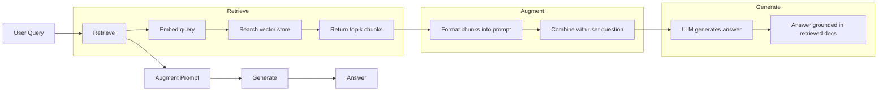
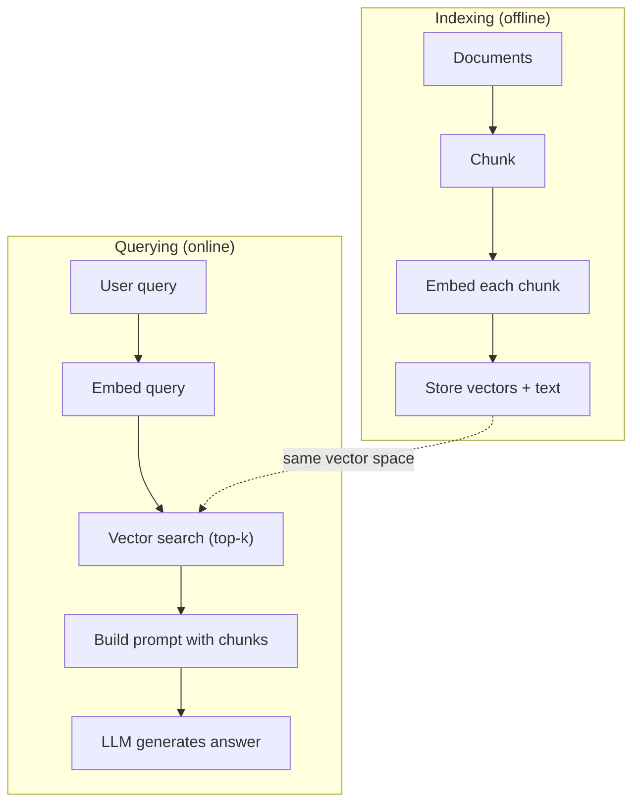

<!-- i18n:manual -->
# RAG — генерация с дополнением через поиск

> Ваша LLM знает всё до даты обучения. И ничего не знает про документы вашей компании, ваш код и заметки со встречи на прошлой неделе. RAG чинит это так: находит нужные документы и вставляет их прямо в промпт. Это самый распространённый паттерн в продакшене. Если вы соберёте из этого курса ровно одну вещь — соберите RAG-пайплайн.

**Type:** Build
**Languages:** Python
**Prerequisites:** Phase 10 (LLMs from Scratch), Phase 11 Lessons 01-05
**Time:** ~90 minutes
**Related:** Phase 5 · 23 (Chunking Strategies for RAG) — шесть алгоритмов chunking и когда какой выигрывает. Phase 5 · 22 (Embedding Models Deep Dive) — как выбрать embedder. Phase 11 · 07 (Advanced RAG) — гибридный поиск, реранкинг и трансформация запросов.

## Learning Objectives

- Собрать полный RAG-пайплайн: загрузка документов, chunking, embedding, векторное хранилище, retrieval и генерация
- Реализовать семантический поиск через векторную базу (ChromaDB, FAISS или Pinecone) с нормальной индексацией
- Объяснить, почему для приложений, опирающихся на знания, RAG предпочтительнее fine-tuning (стоимость, свежесть, атрибуция)
- Оценивать качество RAG метриками retrieval (precision, recall) и метриками генерации (faithfulness, relevance)

## The Problem

Вы делаете чат-бота для своей компании. Клиент спрашивает: «Какие условия возврата для enterprise-тарифа?» LLM выдаёт общий ответ про типичные политики возврата у SaaS. А настоящая политика, зарытая во внутренней вики на 200 страниц, говорит: у enterprise-клиентов окно 60 дней и возврат пропорционально сроку. LLM этот документ никогда не видела. Она не может знать то, на чём её не учили.

Fine-tuning — одно из решений. Берём LLM, дообучаем на внутренних документах, выкатываем обновлённую модель. Работает, но проблем много. Fine-tuning стоит тысячи долларов вычислений. Модель протухает в тот момент, когда меняется хоть один документ. Вы никак не узнаете, из какого источника модель взяла ответ. А если компания через месяц купит ещё одну продуктовую линейку — дообучать заново.

RAG — другое решение. Модель не трогаем вообще. Пришёл вопрос — ищем в своём хранилище документов подходящие куски, вставляем их в промпт перед вопросом и просим модель ответить, опираясь на эти куски как на контекст. Хранилище документов обновляется за минуты. Видно ровно то, что было найдено. Сама модель не меняется никогда. Поэтому в продакшене доминирует именно RAG: дешевле, свежее, проверяемее и работает с любой LLM.

> 🎒 **На пальцах.** Разница как между «выучить справочник наизусть» и «держать справочник открытым на столе». Fine-tuning на 200 страницах вики стоит тысячи долларов и устареет после первой правки документа. RAG на тех же 200 страницах — это ~$0.05 за запрос и переиндексация за минуты.

## The Concept

### The RAG Pattern

Весь паттерн умещается в четыре шага:



Запрос → retrieve → дополнение промпта → генерация. Любая RAG-система идёт по этому маршруту. Разница между продакшен-системами — в деталях каждого шага: как режете на чанки, чем считаете embedding, как ищете и как собираете промпт.

> 🎒 **На пальцах.** Присмотритесь к схеме: LLM появляется только на последнем шаге. Первые три — это обычный поиск, который можно отладить вообще без модели. Поэтому 80% багов RAG чинятся до генерации: если нужный абзац не попал в top-k, никакой промпт его не спасёт.

### Why RAG Beats Fine-Tuning

| Concern | Fine-tuning | RAG |
|---------|------------|-----|
| Cost | $1,000-$100,000+ за один прогон обучения | $0.01-$0.10 за запрос (embedding + LLM) |
| Freshness | Протухает до следующего дообучения | Обновляется за минуты переиндексацией документов |
| Auditability | Нельзя проследить ответ до источника | Можно показать точные найденные фрагменты |
| Hallucination | Всё так же свободно галлюцинирует | Опирается на найденные документы |
| Data privacy | Обучающие данные впечатаны в веса | Документы остаются в вашем векторном хранилище |

Fine-tuning меняет веса модели навсегда. RAG меняет контекст модели на время одного запроса. Для большинства приложений нужен именно временный контекст.

Единственный случай, где выигрывает fine-tuning: когда модель должна усвоить конкретный стиль, тон или способ рассуждения, которого промптом добиться нельзя. Для доставания фактических знаний RAG выигрывает всегда.

> 🎒 **На пальцах.** Посчитайте на пальцах: fine-tuning за $10 000 против $0.05 за запрос. Значит RAG дешевле, пока у вас меньше 200 000 запросов — а после этого дообученную модель всё равно придётся повторять при каждом изменении документов. Плюс строка Auditability: только RAG может показать пользователю, откуда взялся ответ.

### Embedding Models

Embedding-модель превращает текст в плотный вектор. Похожие тексты дают векторы, которые лежат рядом в этом многомерном пространстве. «Как сбросить пароль?» и «мне нужно поменять пароль» дают почти одинаковые векторы, хотя общих слов у них мало. «Кот сидел на коврике» даст совсем другой вектор.

Распространённые embedding-модели (набор 2026 года — полный разбор в Phase 5 · 22):

| Model | Dimensions | Provider | Notes |
|-------|-----------|----------|-------|
| text-embedding-3-small | 1536 (Matryoshka) | OpenAI | Лучшее соотношение цены и качества для большинства задач |
| text-embedding-3-large | 3072 (Matryoshka) | OpenAI | Точнее, обрезается до 256/512/1024 |
| Gemini Embedding 2 | 3072 (Matryoshka) | Google | Топ MTEB по retrieval; контекст 8K |
| voyage-4 | 1024/2048 (Matryoshka) | Voyage AI | Доменные варианты (код, финансы, право) |
| Cohere embed-v4 | 1024 (Matryoshka) | Cohere | Сильная многоязычность, контекст 128K |
| BGE-M3 | 1024 (dense + sparse + ColBERT) | BAAI (open-weight) | Три представления из одной модели |
| Qwen3-Embedding | 4096 (Matryoshka) | Alibaba (open-weight) | Лучший retrieval среди open-weight |
| all-MiniLM-L6-v2 | 384 | Open-weight (Sentence Transformers) | База для прототипов |

В этом уроке мы соберём свой простой embedding на TF-IDF. Не потому, что TF-IDF используют в продакшене, а потому, что так идея становится осязаемой: на вход текст, на выход вектор, похожие тексты дают похожие векторы.

> 🎒 **На пальцах.** Смотрите на колонку Dimensions: от 384 у all-MiniLM до 4096 у Qwen3 — разница в десять раз. Миллион чанков в 384 измерениях по 4 байта займёт около 1.5 ГБ, а в 4096 измерениях — уже 16 ГБ. Точность растёт, но за память и скорость поиска платите вы.

### Vector Similarity

Есть два вектора — чем измерить их похожесть? Три варианта:

**Cosine similarity**: косинус угла между двумя векторами. Диапазон от -1 (противоположны) до 1 (совпадают). Игнорирует длину вектора, смотрит только на направление. Для RAG это вариант по умолчанию.

```
cosine_sim(a, b) = dot(a, b) / (||a|| * ||b||)
```

**Dot product**: сырое скалярное произведение. Длинные векторы получают больший балл. Полезно, когда длина сама по себе несёт информацию (документ длиннее — возможно, релевантнее).

```
dot(a, b) = sum(a_i * b_i)
```

**L2 (Euclidean) distance**: расстояние по прямой в векторном пространстве. Меньше расстояние — больше похожесть. Чувствительно к разнице в длине векторов.

```
L2(a, b) = sqrt(sum((a_i - b_i)^2))
```

Cosine similarity — стандарт. Она спокойно переваривает документы разной длины, потому что делит на длину вектора. Когда говорят «векторный поиск», почти всегда имеют в виду именно косинусную близость.

> 🎒 **На пальцах.** Почему деление на длину так важно: абзац на 500 слов про пароли и предложение на 5 слов про пароли смотрят в одну сторону, но у длинного вектор в разы «больше». По dot product победит длинный просто потому, что он длинный. Косинус выкидывает длину и оставляет только смысл — направление.

### Chunking Strategies

Документы слишком длинные, чтобы кодировать их одним вектором. PDF на 50 страниц даст ужасный embedding, потому что внутри десятки разных тем. Вместо этого документы режут на чанки и считают embedding для каждого чанка отдельно.

**Fixed-size chunking**: резать каждые N токенов. Просто и предсказуемо. Чанк на 512 токенов с overlap в 50 токенов означает: чанк 1 — это токены 0-511, чанк 2 — токены 462-973 и так далее. Overlap страхует от того, что предложение разорвётся ровно на границе.

**Semantic chunking**: резать по естественным границам. Абзацы, разделы, markdown-заголовки. Каждый чанк — цельная единица смысла. Сложнее в реализации, но retrieval получается лучше.

**Recursive chunking**: сначала пробуем резать по самой крупной границе (заголовки разделов). Если раздел всё ещё слишком большой — режем по абзацам. Если абзац всё ещё большой — по предложениям. Это подход `RecursiveCharacterTextSplitter` из LangChain, и на практике он работает хорошо.

Размер чанка важнее, чем принято думать:

- Слишком мелкий (64-128 токенов): чанку не хватает контекста. «Он вырос на 15% в прошлом квартале» ничего не значит, если непонятно, кто такой «он».
- Слишком крупный (2048+ токенов): чанк накрывает несколько тем и размывает релевантность. Ищете данные по выручке — получаете чанк, который на 10% про выручку и на 90% про численность персонала.
- Золотая середина (256-512 токенов): контекста хватает на самодостаточность, но не настолько много, чтобы потерять фокус.

Большинство продакшен-систем RAG берут чанки по 256-512 токенов с overlap в 50 токенов. Рекомендации Anthropic по RAG предлагают тот же диапазон.

> 🎒 **На пальцах.** Разберём арифметику overlap: при чанке 512 и overlap 50 шаг равен 462, а не 512. На тексте в 46 200 токенов вы получите 100 чанков вместо 90 — примерно на 11% больше векторов в индексе. Это цена страховки от того, что ответ разрежет пополам ровно посередине предложения.

### Vector Databases

Embedding есть — теперь его надо где-то хранить и как-то искать. Варианты:

| Database | Type | Best for |
|----------|------|----------|
| FAISS | Library (in-process) | Прототипы, малые и средние наборы данных |
| Chroma | Lightweight DB | Локальная разработка, небольшие развёртывания |
| Pinecone | Managed service | Продакшен без возни с инфраструктурой |
| Weaviate | Open source DB | Продакшен на своих серверах |
| pgvector | Postgres extension | Если Postgres у вас уже есть |
| Qdrant | Open source DB | Быстрый self-hosted вариант |

В этом уроке мы соберём простое векторное хранилище в памяти. Оно держит векторы в списке и перебором считает косинусную близость. По сути это FAISS с плоским индексом. Тысяч до ста векторов хватит, дальше начнёт тормозить. Продакшен-системы используют приближённый поиск ближайших соседей (ANN), например HNSW, и находят нужное среди миллионов векторов за миллисекунды.

> 🎒 **На пальцах.** Перебор — это честное сравнение запроса с каждым вектором по очереди. 100 000 чанков по 1536 чисел — это примерно 150 миллионов умножений на один запрос, доли секунды. На 10 миллионах чанков это уже десятки секунд, и тут появляется HNSW: он смотрит не все векторы, а несколько тысяч, зато находит правильный ответ примерно в 95-99% случаев.

### The Full Pipeline



Фаза индексации выполняется один раз на документ (или когда документ поменялся). Фаза запроса выполняется на каждый пользовательский запрос. В продакшене индексация может перемалывать миллионы документов часами. А запрос обязан отвечать меньше чем за секунду.

> 🎒 **На пальцах.** Ключевая деталь схемы — пунктирная стрелка «same vector space». Индексация и запрос обязаны использовать одну и ту же embedding-модель. Переиндексировали корпус новой моделью, а запросы кодируете старой — поиск сломается полностью и молча, без единой ошибки в логах.

### Real Numbers

Большинство продакшен-систем RAG работают на таких параметрах:

- **k = 5 to 10** найденных чанков на запрос
- **Chunk size = 256 to 512 tokens** с overlap в 50 токенов
- **Context budget**: 2 500-5 000 токенов найденного содержимого на запрос
- **Total prompt**: ~8 000-16 000 токенов (системный промпт + найденные чанки + история диалога + вопрос пользователя)
- **Embedding dimension**: 384-3072 в зависимости от модели
- **Indexing throughput**: 100-1 000 документов в секунду при embedding через API
- **Query latency**: 50-200 мс на retrieval, 500-3000 мс на генерацию

```figure
rag-chunking
```

> 🎒 **На пальцах.** Сложите две строки: 5-10 чанков по 256-512 токенов — это как раз 2 500-5 000 токенов контекста. Числа согласованы не случайно. И заметьте разрыв в задержке: поиск занимает 50-200 мс, генерация — до 3 секунд. Оптимизировать векторный поиск, пока LLM думает три секунды, бессмысленно.

## Build It

### Step 1: Document Chunking

```python
def chunk_text(text, chunk_size=200, overlap=50):
    words = text.split()
    chunks = []
    start = 0
    while start < len(words):
        end = start + chunk_size
        chunk = " ".join(words[start:end])
        chunks.append(chunk)
        start += chunk_size - overlap
    return chunks
```

> 🎒 **На пальцах.** Строка `start += chunk_size - overlap` задаёт шаг. При `chunk_size=200, overlap=50` шаг равен 150, то есть каждый следующий чанк начинается на 50 слов раньше конца предыдущего. Текст на 1 000 слов даст 7 чанков, а не 5, и последние 50 слов каждого чанка повторятся в начале следующего.

### Step 2: TF-IDF Embeddings

Соберём простую функцию embedding. TF-IDF (Term Frequency-Inverse Document Frequency) — не нейросетевой embedding, но он превращает текст в векторы так, что улавливает важность слов. Частые в документе слова получают высокий TF. Редкие по всему корпусу слова получают высокий IDF. Произведение даёт вектор, где у важных и отличительных слов большие значения.

```python
import math
from collections import Counter

def build_vocabulary(documents):
    vocab = set()
    for doc in documents:
        vocab.update(doc.lower().split())
    return sorted(vocab)

def compute_tf(text, vocab):
    words = text.lower().split()
    count = Counter(words)
    total = len(words)
    return [count.get(word, 0) / total for word in vocab]

def compute_idf(documents, vocab):
    n = len(documents)
    idf = []
    for word in vocab:
        doc_count = sum(1 for doc in documents if word in doc.lower().split())
        idf.append(math.log((n + 1) / (doc_count + 1)) + 1)
    return idf

def tfidf_embed(text, vocab, idf):
    tf = compute_tf(text, vocab)
    return [t * i for t, i in zip(tf, idf)]
```

> 🎒 **На пальцах.** Возьмите слово «the»: оно встречается во всех 100 документах, поэтому `math.log(101/101) + 1 = 1.0` — минимальный вес. А слово «enterprise» есть в 2 документах: `math.log(101/3) + 1 ≈ 4.5`. В четыре с половиной раза важнее. Ровно поэтому запрос про enterprise находит нужный абзац, а не любой текст с артиклями.

### Step 3: Cosine Similarity Search

```python
def cosine_similarity(a, b):
    dot = sum(x * y for x, y in zip(a, b))
    norm_a = math.sqrt(sum(x * x for x in a))
    norm_b = math.sqrt(sum(x * x for x in b))
    if norm_a == 0 or norm_b == 0:
        return 0.0
    return dot / (norm_a * norm_b)

def search(query_embedding, stored_embeddings, top_k=5):
    scores = []
    for i, emb in enumerate(stored_embeddings):
        sim = cosine_similarity(query_embedding, emb)
        scores.append((i, sim))
    scores.sort(key=lambda x: x[1], reverse=True)
    return scores[:top_k]
```

### Step 4: Prompt Construction

Вот здесь и происходит то самое «augmented» из RAG. Берём найденные чанки, форматируем их в промпт и просим LLM ответить, опираясь на предоставленный контекст.

```python
def build_rag_prompt(query, retrieved_chunks):
    context = "\n\n---\n\n".join(
        f"[Source {i+1}]\n{chunk}"
        for i, chunk in enumerate(retrieved_chunks)
    )
    return f"""Answer the question based ONLY on the following context.
If the context doesn't contain enough information, say "I don't have enough information to answer that."

Context:
{context}

Question: {query}

Answer:"""
```

> 🎒 **На пальцах.** Две ключевые вещи в этом шаблоне. Слово ONLY заглавными буквами — это запрет отвечать по памяти. И заготовленная фраза «I don't have enough information» — разрешение честно сдаться. Без второй половины модель, которой запретили выдумывать, всё равно что-нибудь выдумает: ей просто некуда деваться.

### Step 5: The Complete RAG Pipeline

```python
class RAGPipeline:
    def __init__(self):
        self.chunks = []
        self.embeddings = []
        self.vocab = []
        self.idf = []

    def index(self, documents):
        all_chunks = []
        for doc in documents:
            all_chunks.extend(chunk_text(doc))
        self.chunks = all_chunks
        self.vocab = build_vocabulary(all_chunks)
        self.idf = compute_idf(all_chunks, self.vocab)
        self.embeddings = [
            tfidf_embed(chunk, self.vocab, self.idf)
            for chunk in all_chunks
        ]

    def query(self, question, top_k=5):
        query_emb = tfidf_embed(question, self.vocab, self.idf)
        results = search(query_emb, self.embeddings, top_k)
        retrieved = [(self.chunks[i], score) for i, score in results]
        prompt = build_rag_prompt(
            question, [chunk for chunk, _ in retrieved]
        )
        return prompt, retrieved
```

> 🎒 **На пальцах.** Заметьте, что `self.vocab` и `self.idf` считаются один раз в `index()` и потом используются в `query()`. Это и есть обязательное правило «одно векторное пространство»: запрос кодируется тем же словарём и теми же весами IDF, что и чанки. Пересчитаете IDF отдельно для запроса — получите два несовместимых пространства и мусор в выдаче.

### Step 6: Generation (simulated)

В продакшене здесь вызывают API языковой модели. В этом уроке мы имитируем генерацию: вытаскиваем из найденного контекста предложение с наибольшим пересечением слов.

```python
def simple_generate(prompt, retrieved_chunks):
    query_words = set(prompt.lower().split("question:")[-1].split())
    best_sentence = ""
    best_score = 0
    for chunk in retrieved_chunks:
        for sentence in chunk.split("."):
            sentence = sentence.strip()
            if not sentence:
                continue
            words = set(sentence.lower().split())
            overlap = len(query_words & words)
            if overlap > best_score:
                best_score = overlap
                best_sentence = sentence
    return best_sentence if best_sentence else "I don't have enough information."
```

## Use It

С настоящей embedding-моделью и настоящей LLM код почти не меняется:

```python
from openai import OpenAI

client = OpenAI()

def embed(text):
    response = client.embeddings.create(
        model="text-embedding-3-small",
        input=text
    )
    return response.data[0].embedding

def generate(prompt):
    response = client.chat.completions.create(
        model="gpt-4o-mini",
        messages=[{"role": "user", "content": prompt}],
        temperature=0
    )
    return response.choices[0].message.content
```

Или с Anthropic:

```python
import anthropic

client = anthropic.Anthropic()

def generate(prompt):
    response = client.messages.create(
        model="claude-sonnet-5",
        max_tokens=1024,
        messages=[{"role": "user", "content": prompt}]
    )
    return response.content[0].text
```

Пайплайн тот же самый. Меняете функцию embedding. Меняете функцию генерации. Логика retrieval, chunking, сборка промпта — всё идентично, какие бы модели вы ни взяли.

> 🎒 **На пальцах.** Сравните два блока выше: отличается имя клиента, имя модели и то, откуда достаётся текст ответа. Всё остальное — тот же промпт из шага 4. Это и значит «RAG не зависит от поставщика»: смена провайдера — правка на пять строк, а не переписывание системы.

Для хранения векторов в больших объёмах замените перебор нормальной векторной базой:

```python
import chromadb

client = chromadb.Client()
collection = client.create_collection("my_docs")

collection.add(
    documents=chunks,
    ids=[f"chunk_{i}" for i in range(len(chunks))]
)

results = collection.query(
    query_texts=["What is the refund policy?"],
    n_results=5
)
```

Chroma сама считает embedding (по умолчанию берёт all-MiniLM-L6-v2) и складывает векторы в локальную базу. Паттерн тот же, обвязка другая.

## Ship It

Этот урок производит:
- `outputs/prompt-rag-architect.md` — промпт для проектирования RAG-систем под конкретные задачи
- `outputs/skill-rag-pipeline.md` — skill, который учит агентов собирать и отлаживать RAG-пайплайны

## Exercises

1. Замените TF-IDF embedding простым bag-of-words (бинарно: 1, если слово есть, 0, если нет). Сравните качество retrieval на тех же документах. TF-IDF должен выиграть, потому что даёт больший вес редким словам.

2. Поэкспериментируйте с размером чанка: попробуйте 50, 100, 200 и 500 слов на одном и том же наборе документов. Для каждого размера прогоните одни и те же 5 запросов и посчитайте, сколько раз релевантный чанк попал в топ-3. Найдите точку, где качество retrieval максимально.

3. Добавьте к каждому чанку метаданные (имя исходного документа, позиция чанка). Поправьте шаблон промпта так, чтобы LLM ссылалась на источники.

4. Реализуйте простую оценку: возьмите 10 пар «вопрос — ответ», прогоните каждый вопрос через RAG-пайплайн и померьте, какой процент найденных чанков содержит ответ. Это retrieval recall at k.

5. Соберите RAG-пайплайн, помнящий диалог: храните последние 3 обмена репликами и подкладывайте их в промпт вместе с найденными чанками. Проверьте на уточняющих вопросах вроде «А что насчёт enterprise?» после вопроса про цены.

> 🎒 **На пальцах.** Начните со второго задания — оно даёт самый наглядный результат. На типичном корпусе вы увидите примерно такую картину: 50 слов — 2 попадания из 5, 200 слов — 4 из 5, 500 слов — снова 3 из 5. Кривая с горбом посередине, ровно как обещает раздел про золотую середину в 256-512 токенов.

## Key Terms

| Term | What people say | What it actually means |
|------|----------------|----------------------|
| RAG | «ИИ, который читает ваши документы» | Найти подходящие документы, вставить их в промпт и сгенерировать ответ, опирающийся на эти документы |
| Embedding | «Превратить текст в числа» | Плотное векторное представление текста, где близкие по смыслу тексты дают близкие векторы |
| Vector database | «Поисковик для ИИ» | Хранилище, заточенное под хранение векторов и поиск ближайших соседей по похожести |
| Chunking | «Порезать документы на куски» | Разбиение документов на мелкие фрагменты (обычно 256-512 токенов), чтобы каждый можно было закодировать и найти отдельно |
| Cosine similarity | «Насколько похожи два вектора» | Косинус угла между двумя векторами; 1 — одинаковое направление, 0 — перпендикулярны, -1 — противоположны |
| Top-k retrieval | «Взять k лучших совпадений» | Вернуть из векторного хранилища k чанков, наиболее похожих на запрос |
| Context window | «Сколько текста видит LLM» | Максимум токенов, который LLM обрабатывает за один запрос; найденные чанки обязаны в него влезть |
| Augmented generation | «Ответ по данному контексту» | Генерация ответа с опорой на найденные документы, а не только на выученные при обучении знания |
| TF-IDF | «Оценка важности слов» | Term Frequency, умноженная на Inverse Document Frequency; взвешивает слова по их отличительности внутри корпуса |
| Indexing | «Подготовка документов к поиску» | Офлайн-процесс: нарезать, закодировать и сложить документы так, чтобы по ним можно было искать во время запроса |

## Further Reading

- Lewis et al., "Retrieval-Augmented Generation for Knowledge-Intensive NLP Tasks" (2020) — оригинальная статья про RAG из Facebook AI Research, где формализован паттерн «сначала найди, потом сгенерируй»
- Anthropic's RAG documentation (docs.anthropic.com) — практические рекомендации по размеру чанков, сборке промпта и оценке
- Pinecone Learning Center, "What is RAG?" — наглядные объяснения RAG-пайплайна с оглядкой на продакшен
- Sentence-BERT: Reimers & Gurevych (2019) — статья, стоящая за моделями all-MiniLM: как обучать би-энкодеры для семантической близости
- [Karpukhin et al., "Dense Passage Retrieval for Open-Domain Question Answering" (EMNLP 2020)](https://arxiv.org/abs/2004.04906) — статья про DPR, доказавшая, что плотный би-энкодер обгоняет BM25 на открытом QA и задавшая образец для современных ретриверов RAG.
- [LlamaIndex High-Level Concepts](https://docs.llamaindex.ai/en/stable/getting_started/concepts.html) — основные понятия для сборки RAG-пайплайнов: загрузчики данных, парсеры узлов, индексы, ретриверы, синтезаторы ответов.
- [LangChain RAG tutorial](https://python.langchain.com/docs/tutorials/rag/) — оркестратор противоположного вкуса; тот же паттерн «найди и сгенерируй», но как цепочка runnable.
