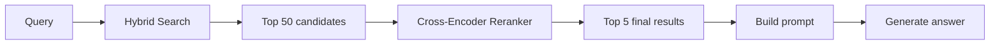
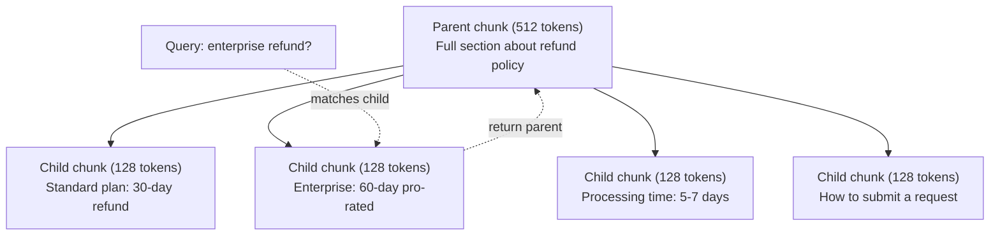
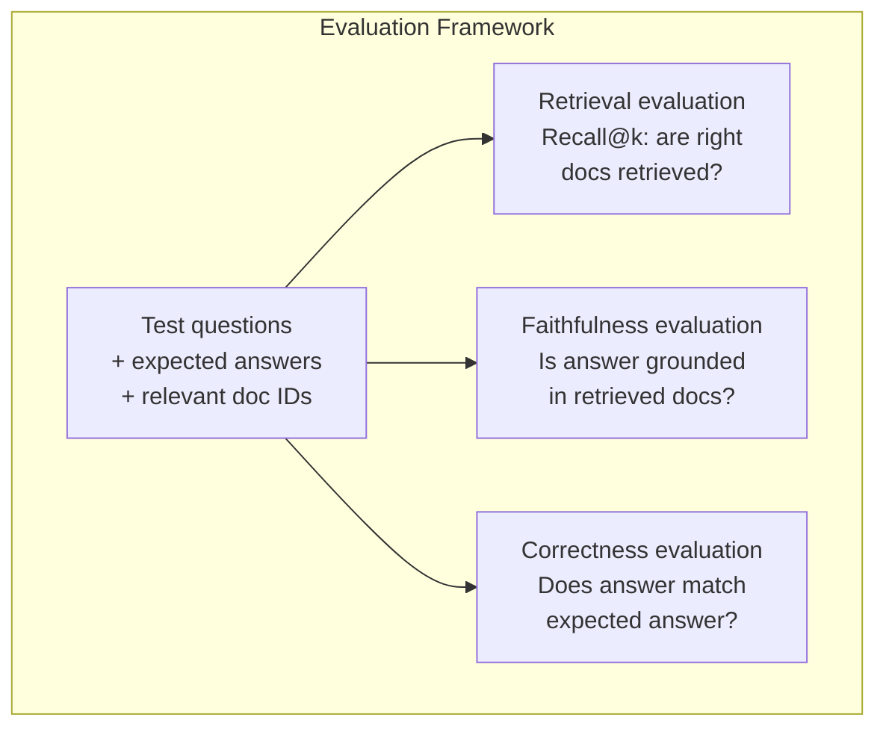

<!-- i18n:manual -->
# Продвинутый RAG (чанкинг, переранжирование, гибридный поиск)

> Базовый RAG достаёт top-k самых похожих чанков. Для простых вопросов этого хватает. На многошаговых рассуждениях, неоднозначных запросах и больших корпусах он рассыпается. Продвинутый RAG — это разница между демо на 10 документах и системой на 10 миллионов.

**Type:** Build
**Languages:** Python
**Prerequisites:** Phase 11, Lesson 06 (RAG)
**Time:** ~90 minutes
**Related:** Phase 5 · 23 (Chunking Strategies for RAG) разбирает все шесть алгоритмов чанкинга — recursive, semantic, sentence, parent-document, late chunking, contextual retrieval — с бенчмарками Vectara и Anthropic. Этот урок строится сверху: гибридный поиск, переранжирование, преобразование запроса.

## Learning Objectives

- Реализовать продвинутые стратегии чанкинга (semantic, recursive, parent-child), которые сохраняют структуру документа и контекст
- Собрать пайплайн гибридного поиска: BM25 по ключевым словам плюс семантический векторный поиск плюс cross-encoder-реранкер
- Применять преобразования запроса (HyDE, multi-query, step-back), чтобы улучшить поиск на неоднозначных и сложных вопросах
- Находить и чинить типовые провалы RAG: достался не тот чанк, ответа нет в контексте, развалилось многошаговое рассуждение

## The Problem

В уроке 06 вы собрали базовый RAG-пайплайн. На прямых вопросах по маленькому корпусу он работает. Теперь попробуйте вот это.

**Ambiguous query**: «Какая была выручка за прошлый квартал?» Семантический поиск возвращает чанки про стратегию выручки, про прогнозы выручки и про размышления финансового директора о росте выручки. Все они семантически близки к слову «выручка». И ни в одном нет самого числа. Нужный чанк говорит «$47.2M in Q3 2025», но использует слово «earnings» вместо «revenue». Embedding-модель считает, что «revenue strategy» ближе к запросу, чем «Q3 earnings were $47.2M».

**Multi-hop question**: «У какой команды сильнее всего вырос показатель удовлетворённости клиентов?» Здесь нужно найти оценки каждой команды, сравнить их и выбрать максимум. Ответа нет ни в одном отдельном чанке. Информация размазана по отчётам разных команд.

**Large corpus problem**: у вас 2 миллиона чанков. Правильный ответ лежит в чанке №1 847 293. Ваш top-5 достаёт чанки №14, №89 201, №1 200 000, №44 и №901 333. Все близко в пространстве эмбеддингов, но ответа нет ни в одном. На таком масштабе приближённый поиск ближайших соседей вносит достаточно ошибки, чтобы релевантные результаты вылетели из top-k.

Базовый RAG проваливается, потому что векторная похожесть — это не то же самое, что релевантность. Чанк может быть семантически похож на запрос и при этом бесполезен для ответа. Продвинутый RAG лечит это четырьмя приёмами: гибридный поиск (добавить совпадение по словам), переранжирование (аккуратнее оценить кандидатов), преобразование запроса (починить запрос до поиска) и лучший чанкинг (искать на правильной гранулярности).

> 🎒 **На пальцах.** Посмотрите на числа третьего случая: ответ в чанке №1 847 293, а достали №14, №89 201, №1 200 000, №44 и №901 333. Ни одного попадания из пяти при двух миллионах кандидатов. Это как искать одну страницу в библиотеке, где книги расставлены «примерно по смыслу»: вы приходите в нужный зал, но берёте с полки не ту книгу. Похожесть привела в правильный район, а точный адрес не дала.

## The Concept

### Hybrid Search: Semantic + Keyword

Семантический поиск (векторная похожесть) хорошо понимает смысл. «How do I cancel my subscription?» находит «Steps to terminate your plan», хотя общих слов нет вообще. Но он мажет по точным совпадениям. «Error code E-4021» может не найти чанк со строкой «E-4021», если embedding-модель принимает её за шум.

Поиск по ключевым словам (BM25) устроен наоборот. Он отлично берёт точные совпадения. «E-4021» находится идеально. Зато «cancel my subscription» вернёт ноль результатов, если в документе написано «terminate your plan».

Гибридный поиск запускает оба и сливает результаты.

**BM25** (Best Matching 25) — стандартный алгоритм поиска по ключевым словам. Он держит на себе поисковые системы с 1990-х. Формула:

```
BM25(q, d) = sum over terms t in q:
    IDF(t) * (tf(t,d) * (k1 + 1)) / (tf(t,d) + k1 * (1 - b + b * |d| / avgdl))
```

Здесь tf(t,d) — частота термина t в документе d, IDF(t) — обратная документная частота, |d| — длина документа, avgdl — средняя длина документа, k1 управляет насыщением по частоте термина (по умолчанию 1.2), а b — нормализацией по длине (по умолчанию 0.75).

Человеческим языком: BM25 даёт документу больше баллов, когда в нём есть слова из запроса (особенно редкие), но с убывающей отдачей от повторов. Документ, где слово «revenue» встречается 50 раз, не в 50 раз релевантнее документа, где оно встречается один раз.

> 🎒 **На пальцах.** Убывающая отдача — это как громкость музыки: с 1 до 2 разница слышна, с 40 до 41 — нет. При k1 = 1.2 второе вхождение слова добавляет примерно вдвое меньше, чем первое, десятое — почти ничего. Поэтому спамить ключевым словом в тексте бесполезно: BM25 упирается в потолок и перестаёт добавлять баллы.

### Reciprocal Rank Fusion (RRF)

У вас два ранжированных списка: один от векторного поиска, другой от BM25. Как их объединить? Reciprocal Rank Fusion — стандартный ответ.

```
RRF_score(d) = sum over rankings R:
    1 / (k + rank_R(d))
```

Здесь k — константа (обычно 60), которая не даёт первому результату задавить всех остальных.

Документ на 1-м месте в векторном поиске и на 5-м в BM25 получает: 1/(60+1) + 1/(60+5) = 0.0164 + 0.0154 = 0.0318

Документ на 3-м месте в векторном поиске и на 2-м в BM25 получает: 1/(60+3) + 1/(60+2) = 0.0159 + 0.0161 = 0.0320

RRF сам по себе балансирует два сигнала. Документ, который высоко в обоих списках, получает лучший балл. Документ на 1-м месте в одном списке и вообще отсутствующий в другом получает средний балл. Приём устойчивый, потому что работает с позициями, а не с сырыми баллами: разница в шкалах двух систем перестаёт мешать.

> 🎒 **На пальцах.** Сравните два числа выше: 0.0318 у документа с позициями 1 и 5 против 0.0320 у документа с позициями 3 и 2. Второй выигрывает, хотя ни разу не был первым. Это как в многоборье: стабильные третьи места обходят одну победу и один провал. Константа 60 в знаменателе как раз и сглаживает разрыв между первым и пятым местом.

### Reranking

Поиск (векторный, по словам или гибридный) быстрый, но грубый. Он работает на bi-encoder: запрос и каждый документ кодируются отдельно, а потом сравниваются. Эмбеддинги считаются один раз и кэшируются. Это масштабируется на миллионы документов.

Переранжирование работает на cross-encoder: запрос и документ-кандидат подаются в модель вместе, и она выдаёт балл релевантности. Модель видит оба текста одновременно и ловит тонкие связи между ними. Cross-encoder понимает, что «What were Q3 earnings?» сильно релевантен чанку с «$47.2M in Q3», даже если bi-encoder эту связь упустил.

Плата за это: cross-encoder в 100-1000 раз медленнее bi-encoder, потому что обрабатывает пару «запрос-документ» целиком. Предпосчитать cross-encoder-баллы для миллиона документов невозможно. Решение: достать набор кандидатов побольше (top-50 гибридным поиском), а потом переранжировать его cross-encoder и получить финальные top-5.



Популярные модели для переранжирования (набор 2026 года):
- Cohere Rerank 3.5: managed API, мультиязычная, лучший прирост recall на смешанных корпусах
- Voyage rerank-2.5: managed API, самая низкая задержка среди хостящихся вариантов
- Jina-Reranker-v2 Multilingual: открытые веса, 100+ языков
- bge-reranker-v2-m3: открытые веса, крепкий базовый вариант
- cross-encoder/ms-marco-MiniLM-L-6-v2: открытые веса, для прототипов запускается на CPU
- ColBERTv2 / Jina-ColBERT-v2: multi-vector-реранкеры с поздним взаимодействием — на этапе оценки это O(tokens), а не O(docs)

> 🎒 **На пальцах.** Цифра «в 100-1000 раз медленнее» решает всю архитектуру. Если bi-encoder обрабатывает миллион документов за секунду, cross-encoder на том же миллионе провозится от 100 секунд до 15 минут — на каждый запрос. А на 50 кандидатах он справится за миллисекунды. Отсюда воронка: дешёвый поиск отсеивает миллион до 50, дорогая модель разбирается с оставшимися 50.

### Query Transformation

Иногда проблема не в поиске, а в самом запросе. «What was that thing about the new policy change?» — ужасный поисковый запрос. В нём нет ни одного конкретного слова. Эмбеддинг размытый. Никакая поисковая система не найдёт по нему нужные документы.

**Query rewriting**: переписать запрос пользователя в нормальный поисковый запрос. LLM это умеет:

```
User: "What was that thing about the new policy change?"
Rewritten: "Recent policy changes and updates"
```

**HyDE (Hypothetical Document Embeddings)**: вместо поиска по запросу сгенерировать гипотетический ответ, закодировать его и искать похожие настоящие документы.

```
Query: "What is the refund policy for enterprise?"
Hypothetical answer: "Enterprise customers are eligible for a full refund
within 60 days of purchase. Refunds are pro-rated based on the remaining
subscription period and processed within 5-7 business days."
```

Кодируем гипотетический ответ и ищем настоящие документы, похожие на него. Интуиция такая: гипотетический ответ лежит в пространстве эмбеддингов ближе к настоящему ответу, чем исходный вопрос. У вопросов и ответов разная языковая структура. Генерируя гипотетический ответ, вы перекидываете мост из «пространства вопросов» в «пространство ответов».

HyDE добавляет один вызов LLM перед поиском. Это плюс 500-2000 мс к задержке. Оправдано, когда на сырых запросах поиск работает плохо.

> 🎒 **На пальцах.** Вопрос «What is the refund policy for enterprise?» и настоящий текст политики почти не пересекаются по словам: в вопросе одни слова, в документе — «pro-rated», «5-7 business days», «60 days». А фальшивый ответ из примера выше содержит ровно такие же слова, как настоящий. Это как искать человека не по описанию «высокий парень в очках», а по его фотороботу. Платите за это одним вызовом LLM и половиной-двумя секундами ожидания.

### Parent-Child Chunking

Обычный чанкинг заставляет выбирать: маленькие чанки дают точный поиск, большие — достаточный контекст. Parent-child-чанкинг убирает этот выбор.

Индексируем маленькие чанки (128 токенов) для поиска. Когда маленький чанк найден, в промпт отдаём его родительский чанк (512 токенов). Маленький чанк точно совпал с запросом. Родительский даёт LLM достаточно контекста, чтобы собрать хороший ответ.



Запрос «enterprise refund?» точно попадает в дочерний чанк C2. Но в промпт уходит целиком родительский чанк P — вместе с окружающим контекстом про сроки обработки и порядок подачи заявки.

> 🎒 **На пальцах.** Считайте по схеме: четыре дочерних чанка по 128 токенов складываются в родительский на 512. Поиск идёт по кусочку в 128 токенов — там мало лишних слов, значит меньше шума и точнее попадание. А в промпт уходит все 512, чтобы модель увидела и срок 60 дней, и порядок подачи заявки. Это как найти нужную строчку по оглавлению, но принести целую страницу.

### Metadata Filtering

Перед векторным поиском отфильтруйте корпус по метаданным: дата, источник, категория, автор, язык. Это сужает пространство поиска и отсекает заведомо ненужное.

Запрос «Что изменилось в политике безопасности за прошлый месяц?» должен искать только по документам за последние 30 дней в категории «безопасность». Без фильтра по метаданным вы ищете по всему корпусу и рискуете достать двухлетний документ по безопасности, который просто оказался семантически похож.

Продакшен-RAG хранит метаданные рядом с каждым чанком: исходный документ, дата создания, категория, автор, версия. Векторные базы умеют пре-фильтрацию по метаданным до поиска по похожести, и на масштабе это критично для скорости.

> 🎒 **На пальцах.** Фильтр по метаданным — это как в интернет-магазине сначала выбрать «размер 42» и «в наличии», а уже потом листать. Если из 2 миллионов чанков к категории «безопасность» за последние 30 дней относятся 3 000, векторный поиск работает по 3 000, а не по 2 000 000: в 600 раз меньше кандидатов и ноль шансов вытащить документ двухлетней давности.

### Evaluation

Вы собрали RAG-систему. Как понять, что она работает? Три метрики.

**Retrieval relevance (Recall@k)**: берём набор тестовых вопросов с известными релевантными документами и смотрим, какой процент релевантных документов попал в top-k. Если ответ на вопрос лежит в чанке №47, оказывается ли чанк №47 в top-5?

**Faithfulness**: опирается ли сгенерированный ответ на найденные документы? Если в найденных чанках написано «60-day refund window», а модель говорит «90-day refund window» — это провал по faithfulness. Модель нагаллюцинировала, хотя правильный контекст у неё был.

**Answer correctness**: совпадает ли сгенерированный ответ с ожидаемым? Это сквозная метрика. Она складывает качество поиска и качество генерации.

Простая проверка faithfulness: взять каждое утверждение из ответа и убедиться, что оно (по сути) встречается в найденных чанках. Если в ответе есть факт, которого нет ни в одном найденном чанке, скорее всего он выдуман.



```figure
agentic-rag-loop
```

> 🎒 **На пальцах.** Три метрики ловят три разные поломки. Recall@k проверяет поиск: нужный чанк вообще достали? Faithfulness проверяет генерацию: модель не сочинила лишнего? Correctness проверяет всё вместе. Пример из текста выше: контекст говорит «60 дней», ответ — «90 дней». Recall тут отличный, чанк нашли, а faithfulness ноль. Без разделения метрик вы бы неделю чинили поиск, который не сломан.

## Build It

### Step 1: BM25 Implementation

```python
import math
from collections import Counter

class BM25:
    def __init__(self, k1=1.2, b=0.75):
        self.k1 = k1
        self.b = b
        self.docs = []
        self.doc_lengths = []
        self.avg_dl = 0
        self.doc_freqs = {}
        self.n_docs = 0

    def index(self, documents):
        self.docs = documents
        self.n_docs = len(documents)
        self.doc_lengths = []
        self.doc_freqs = {}

        for doc in documents:
            words = doc.lower().split()
            self.doc_lengths.append(len(words))
            unique_words = set(words)
            for word in unique_words:
                self.doc_freqs[word] = self.doc_freqs.get(word, 0) + 1

        self.avg_dl = sum(self.doc_lengths) / self.n_docs if self.n_docs else 1

    def score(self, query, doc_idx):
        query_words = query.lower().split()
        doc_words = self.docs[doc_idx].lower().split()
        doc_len = self.doc_lengths[doc_idx]
        word_counts = Counter(doc_words)
        score = 0.0

        for term in query_words:
            if term not in word_counts:
                continue
            tf = word_counts[term]
            df = self.doc_freqs.get(term, 0)
            idf = math.log((self.n_docs - df + 0.5) / (df + 0.5) + 1)
            numerator = tf * (self.k1 + 1)
            denominator = tf + self.k1 * (1 - self.b + self.b * doc_len / self.avg_dl)
            score += idf * numerator / denominator

        return score

    def search(self, query, top_k=10):
        scores = [(i, self.score(query, i)) for i in range(self.n_docs)]
        scores.sort(key=lambda x: x[1], reverse=True)
        return scores[:top_k]
```

> 🎒 **На пальцах.** Разберите строку `idf = math.log((self.n_docs - df + 0.5) / (df + 0.5) + 1)` на числах. Пусть документов 1000. Слово встречается в 900 из них: idf = log((1000-900+0.5)/(900.5)+1) ≈ log(1.11) ≈ 0.11. Слово встречается в 5 документах: idf = log((995.5)/(5.5)+1) ≈ log(182) ≈ 5.2. Редкое слово весит в 47 раз больше частого. Именно поэтому «E-4021» находится, а «the» ни на что не влияет.

### Step 2: Reciprocal Rank Fusion

```python
def reciprocal_rank_fusion(ranked_lists, k=60):
    scores = {}
    for ranked_list in ranked_lists:
        for rank, (doc_id, _) in enumerate(ranked_list):
            if doc_id not in scores:
                scores[doc_id] = 0.0
            scores[doc_id] += 1.0 / (k + rank + 1)
    fused = sorted(scores.items(), key=lambda x: x[1], reverse=True)
    return fused
```

### Step 3: Hybrid Search Pipeline

```python
def hybrid_search(query, chunks, vector_embeddings, vocab, idf, bm25_index, top_k=5, fusion_k=60):
    query_emb = tfidf_embed(query, vocab, idf)
    vector_results = search(query_emb, vector_embeddings, top_k=top_k * 3)
    bm25_results = bm25_index.search(query, top_k=top_k * 3)
    fused = reciprocal_rank_fusion([vector_results, bm25_results], k=fusion_k)
    return fused[:top_k]
```

> 🎒 **На пальцах.** Проследите за числами в `hybrid_search`. При `top_k=5` каждый из двух поисков достаёт `top_k * 3 = 15` кандидатов. RRF сливает их в один список — от 15 до 30 уникальных документов — и наружу возвращаются первые 5. Запас в три раза нужен, чтобы у слияния было из чего выбирать: если бы каждый поиск отдавал ровно 5, пересечение оказалось бы слишком узким.

### Step 4: Simple Reranker

В проде вы бы взяли cross-encoder-модель. Здесь мы строим реранкер, который оценивает релевантность пары «запрос-документ» по пересечению слов, важности терминов и совпадению фраз.

```python
def rerank(query, candidates, chunks):
    query_words = set(query.lower().split())
    stop_words = {"the", "a", "an", "is", "are", "was", "were", "what", "how",
                  "why", "when", "where", "do", "does", "for", "of", "in", "to",
                  "and", "or", "on", "at", "by", "it", "its", "this", "that",
                  "with", "from", "be", "has", "have", "had", "not", "but"}
    query_terms = query_words - stop_words

    scored = []
    for doc_id, initial_score in candidates:
        chunk = chunks[doc_id].lower()
        chunk_words = set(chunk.split())

        term_overlap = len(query_terms & chunk_words)

        query_bigrams = set()
        q_list = [w for w in query.lower().split() if w not in stop_words]
        for i in range(len(q_list) - 1):
            query_bigrams.add(q_list[i] + " " + q_list[i + 1])
        bigram_matches = sum(1 for bg in query_bigrams if bg in chunk)

        position_boost = 0
        for term in query_terms:
            pos = chunk.find(term)
            if pos != -1 and pos < len(chunk) // 3:
                position_boost += 0.5

        rerank_score = (
            term_overlap * 1.0
            + bigram_matches * 2.0
            + position_boost
            + initial_score * 5.0
        )
        scored.append((doc_id, rerank_score))

    scored.sort(key=lambda x: x[1], reverse=True)
    return scored
```

> 🎒 **На пальцах.** Смотрите на веса в `rerank_score`: одиночное слово стоит 1.0, биграмма — 2.0, начало документа — 0.5. Совпадение двух слов подряд ценится вдвое дороже двух отдельных совпадений, и это правильно: «refund policy» рядом — почти наверняка про то же, что запрос, а те же два слова в разных абзацах могут быть про что угодно. Так дешёвыми эвристиками имитируется то, что cross-encoder делает по-настоящему.

### Step 5: HyDE (Hypothetical Document Embeddings)

```python
def hyde_generate_hypothesis(query):
    templates = {
        "what": "The answer to '{query}' is as follows: Based on our documentation, {topic} involves specific policies and procedures that define how the process works.",
        "how": "To address '{query}': The process involves several steps. First, you need to initiate the request. Then, the system processes it according to the defined rules.",
        "default": "Regarding '{query}': Our records indicate specific details and policies related to this topic that provide a comprehensive answer."
    }
    query_lower = query.lower()
    if query_lower.startswith("what"):
        template = templates["what"]
    elif query_lower.startswith("how"):
        template = templates["how"]
    else:
        template = templates["default"]

    topic_words = [w for w in query.lower().split()
                   if w not in {"what", "is", "the", "how", "do", "does", "a", "an",
                                "for", "of", "to", "in", "on", "at", "by", "and", "or"}]
    topic = " ".join(topic_words) if topic_words else "this topic"

    return template.format(query=query, topic=topic)


def hyde_search(query, chunks, vector_embeddings, vocab, idf, top_k=5):
    hypothesis = hyde_generate_hypothesis(query)
    hypothesis_emb = tfidf_embed(hypothesis, vocab, idf)
    results = search(hypothesis_emb, vector_embeddings, top_k)
    return results, hypothesis
```

> 🎒 **На пальцах.** Здесь LLM подменена шаблонами, но приём тот же. Запрос «What is the refund policy?» превращается в абзац со словами «policies», «procedures», «process». Из трёх слов запроса получилось предложение на двадцать с лишним слов — и вектор такого текста гораздо ближе к вектору настоящего раздела документации, чем вектор короткого вопроса.

### Step 6: Parent-Child Chunking

```python
def create_parent_child_chunks(text, parent_size=200, child_size=50):
    words = text.split()
    parents = []
    children = []
    child_to_parent = {}

    parent_idx = 0
    start = 0
    while start < len(words):
        parent_end = min(start + parent_size, len(words))
        parent_text = " ".join(words[start:parent_end])
        parents.append(parent_text)

        child_start = start
        while child_start < parent_end:
            child_end = min(child_start + child_size, parent_end)
            child_text = " ".join(words[child_start:child_end])
            child_idx = len(children)
            children.append(child_text)
            child_to_parent[child_idx] = parent_idx
            child_start += child_size

        parent_idx += 1
        start += parent_size

    return parents, children, child_to_parent
```

> 🎒 **На пальцах.** Подставьте дефолты: `parent_size=200`, `child_size=50`. На каждый родительский чанк приходится ровно 4 дочерних, и `child_to_parent` хранит связь вида {0: 0, 1: 0, 2: 0, 3: 0, 4: 1, ...}. Текст на 1000 слов даёт 5 родителей и 20 детей. Ищем по двадцати мелким, отдаём один из пяти крупных.

### Step 7: Faithfulness Evaluation

```python
def evaluate_faithfulness(answer, retrieved_chunks):
    answer_sentences = [s.strip() for s in answer.split(".") if len(s.strip()) > 10]
    if not answer_sentences:
        return 1.0, []

    grounded = 0
    ungrounded = []
    context = " ".join(retrieved_chunks).lower()

    for sentence in answer_sentences:
        words = set(sentence.lower().split())
        stop_words = {"the", "a", "an", "is", "are", "was", "were", "and", "or",
                      "to", "of", "in", "for", "on", "at", "by", "it", "this", "that"}
        content_words = words - stop_words
        if not content_words:
            grounded += 1
            continue

        matched = sum(1 for w in content_words if w in context)
        ratio = matched / len(content_words) if content_words else 0

        if ratio >= 0.5:
            grounded += 1
        else:
            ungrounded.append(sentence)

    score = grounded / len(answer_sentences) if answer_sentences else 1.0
    return score, ungrounded


def evaluate_retrieval_recall(queries_with_relevant, retrieval_fn, k=5):
    total_recall = 0.0
    results = []

    for query, relevant_indices in queries_with_relevant:
        retrieved = retrieval_fn(query, k)
        retrieved_indices = set(idx for idx, _ in retrieved)
        relevant_set = set(relevant_indices)
        hits = len(retrieved_indices & relevant_set)
        recall = hits / len(relevant_set) if relevant_set else 1.0
        total_recall += recall
        results.append({
            "query": query,
            "recall": recall,
            "hits": hits,
            "total_relevant": len(relevant_set)
        })

    avg_recall = total_recall / len(queries_with_relevant) if queries_with_relevant else 0
    return avg_recall, results
```

> 🎒 **На пальцах.** Порог `ratio >= 0.5` означает: половина значимых слов предложения должна найтись в контексте. Предложение из 8 значимых слов проходит при 4 совпадениях. Это грубо, но ловит откровенную выдумку: если модель написала про «90-day window», а в контексте только «60-day», слово «90-day» не найдётся, доля упадёт, и предложение попадёт в список `ungrounded`.

## Use It

С настоящим cross-encoder для переранжирования:

```python
from sentence_transformers import CrossEncoder

reranker = CrossEncoder("cross-encoder/ms-marco-MiniLM-L-6-v2")

def rerank_with_cross_encoder(query, candidates, chunks, top_k=5):
    pairs = [(query, chunks[doc_id]) for doc_id, _ in candidates]
    scores = reranker.predict(pairs)
    scored = list(zip([doc_id for doc_id, _ in candidates], scores))
    scored.sort(key=lambda x: x[1], reverse=True)
    return scored[:top_k]
```

С managed-реранкером от Cohere:

```python
import cohere

co = cohere.Client()

def rerank_with_cohere(query, candidates, chunks, top_k=5):
    docs = [chunks[doc_id] for doc_id, _ in candidates]
    response = co.rerank(
        model="rerank-english-v3.0",
        query=query,
        documents=docs,
        top_n=top_k
    )
    return [(candidates[r.index][0], r.relevance_score) for r in response.results]
```

Для HyDE с настоящей LLM:

```python
import anthropic

client = anthropic.Anthropic()

def hyde_with_llm(query):
    response = client.messages.create(
        model="claude-sonnet-5",
        max_tokens=256,
        messages=[{
            "role": "user",
            "content": f"Write a short paragraph that would be a good answer to this question. Do not say you don't know. Just write what the answer would look like.\n\nQuestion: {query}"
        }]
    )
    return response.content[0].text
```

Для продакшен-гибрида на Weaviate:

```python
import weaviate

client = weaviate.connect_to_local()

collection = client.collections.get("Documents")
response = collection.query.hybrid(
    query="enterprise refund policy",
    alpha=0.5,
    limit=10
)
```

Параметр alpha управляет балансом: 0.0 — чистые ключевые слова (BM25), 1.0 — чистые векторы, 0.5 — поровну. Большинство продакшен-систем держат alpha между 0.3 и 0.7.

> 🎒 **На пальцах.** Alpha — это ручка громкости между двумя поисками. На 0.3 система больше доверяет ключевым словам: так стоит настраивать поиск по артикулам, кодам ошибок и юридическим статьям. На 0.7 — больше доверия смыслу: справка, инструкции, переписка с поддержкой. Крайние значения 0.0 и 1.0 в проде почти не встречаются, потому что каждое возвращает вас к одной из двух поломок из начала урока.

## Ship It

Этот урок даёт на выходе:
- `outputs/prompt-advanced-rag-debugger.md` -- промпт для диагностики и починки проблем с качеством RAG
- `outputs/skill-advanced-rag.md` -- скилл для сборки продакшен-RAG с гибридным поиском и переранжированием

## Exercises

1. Сравните BM25, векторный поиск и гибридный поиск на примерных документах. Для каждого из 5 тестовых запросов запишите, какой подход вернул самый релевантный чанк на позицию №1. Гибридный поиск должен выиграть минимум в 3 случаях из 5.

2. Реализуйте фильтр по метаданным. Добавьте каждому документу поле «category» (security, billing, api, product). Перед векторным поиском оставляйте только чанки нужной категории. Проверьте на запросе «What encryption is used?» и убедитесь, что поиск идёт только по чанкам категории security.

3. Соберите полный HyDE-пайплайн, используя простую функцию генерации из урока 06. Сравните качество поиска (релевантность top-3) между поиском по прямому запросу и HyDE-поиском на всех 5 тестовых запросах. На размытых запросах HyDE должен улучшить результат.

4. Реализуйте parent-child-чанкинг на примерных документах. Возьмите child_size=30 и parent_size=100. Ищите по дочерним чанкам, а в промпт отдавайте родительские. Сравните полученные ответы с обычным чанкингом при chunk_size=50.

5. Соберите датасет для оценки: 10 вопросов с известными чанками-ответами. Померьте Recall@3, Recall@5 и Recall@10 для (a) только векторного поиска, (b) только BM25, (c) гибридного поиска, (d) гибридного поиска с переранжированием. Постройте график и определите, где переранжирование помогает сильнее всего.

> 🎒 **На пальцах.** Пятое задание — это и есть вся суть урока в одной таблице: четыре строки конфигураций против трёх колонок Recall@3/5/10. Обычно картина такая: BM25 выигрывает на точных совпадениях, векторный — на перефразировках, гибрид обходит обоих, а переранжирование почти не меняет Recall@10, зато заметно поднимает Recall@3. Это логично: реранкер не добавляет новых документов, он лишь двигает правильные вверх.

## Key Terms

| Term | What people say | What it actually means |
|------|----------------|----------------------|
| BM25 | «Поиск по ключевым словам» | Вероятностный алгоритм ранжирования, который оценивает документы по частоте терминов, обратной документной частоте и нормализации на длину документа |
| Hybrid search | «Лучшее из двух миров» | Параллельный запуск семантического (векторного) и словесного (BM25) поиска с последующим слиянием результатов по рангам |
| Reciprocal Rank Fusion | «Слить ранжированные списки» | Объединение нескольких ранжированных списков суммированием 1/(k + ранг) по каждому документу во всех списках |
| Reranking | «Второй проход оценки» | Использование более дорогой cross-encoder-модели, чтобы переоценить набор кандидатов после первичного поиска |
| Cross-encoder | «Совместная модель запроса и документа» | Модель, которая принимает запрос и документ одним входом и выдаёт балл релевантности; точнее bi-encoder, но слишком медленная для поиска по всему корпусу |
| Bi-encoder | «Независимая embedding-модель» | Модель, которая кодирует запросы и документы по отдельности; быстрая за счёт предпосчитанных эмбеддингов, но менее точная, чем cross-encoder |
| HyDE | «Поиск по фальшивому ответу» | Сгенерировать гипотетический ответ на запрос, закодировать его и искать настоящие документы, похожие на него |
| Parent-child chunking | «Маленький поиск, большой контекст» | Индексировать маленькие чанки ради точного поиска, но возвращать больший родительский чанк ради достаточного контекста |
| Metadata filtering | «Сузить до поиска» | Отбор документов по атрибутам (дата, источник, категория) перед векторным поиском, чтобы уменьшить пространство поиска |
| Faithfulness | «Не оторвался ли от источника» | Опирается ли сгенерированный ответ на найденные документы или же выдуман из знаний, полученных при обучении модели |

## Further Reading

- Robertson & Zaragoza, "The Probabilistic Relevance Framework: BM25 and Beyond" (2009) -- главный справочник по BM25: объясняет вероятностные основания формулы
- Cormack et al., "Reciprocal Rank Fusion Outperforms Condorcet and Individual Rank Learning Methods" (2009) -- исходная статья про RRF, показавшая, что он обгоняет более сложные способы слияния
- Gao et al., "Precise Zero-Shot Dense Retrieval without Relevance Labels" (2022) -- статья про HyDE: эмбеддинги гипотетических документов улучшают поиск вообще без обучающих данных
- Nogueira & Cho, "Passage Re-ranking with BERT" (2019) -- показала, что cross-encoder-переранжирование поверх BM25 заметно поднимает качество поиска
- [Khattab et al., "DSPy: Compiling Declarative Language Model Calls into Self-Improving Pipelines" (2023)](https://arxiv.org/abs/2310.03714) -- рассматривает сборку промптов и подбор весов как задачу оптимизации над пайплайнами поиска; читать ради подхода «программировать LLM» вместо «промптить LLM».
- [Edge et al., "From Local to Global: A Graph RAG Approach to Query-Focused Summarization" (Microsoft Research 2024)](https://arxiv.org/abs/2404.16130) -- статья про GraphRAG: извлечение сущностей и связей плюс поиск сообществ алгоритмом Лейдена для суммаризации под запрос; здесь же разница между глобальным и локальным поиском.
- [Asai et al., "Self-RAG: Learning to Retrieve, Generate, and Critique through Self-Reflection" (ICLR 2024)](https://arxiv.org/abs/2310.11511) -- самооценивающийся RAG с рефлексивными токенами; агентная граница за пределами статичного «нашёл — сгенерировал».
- [LangChain Query Construction blog](https://blog.langchain.dev/query-construction/) -- как превращать запросы на естественном языке в структурированные запросы к базе (Text-to-SQL, Cypher) на этапе перед поиском.
