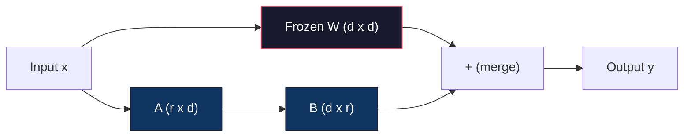
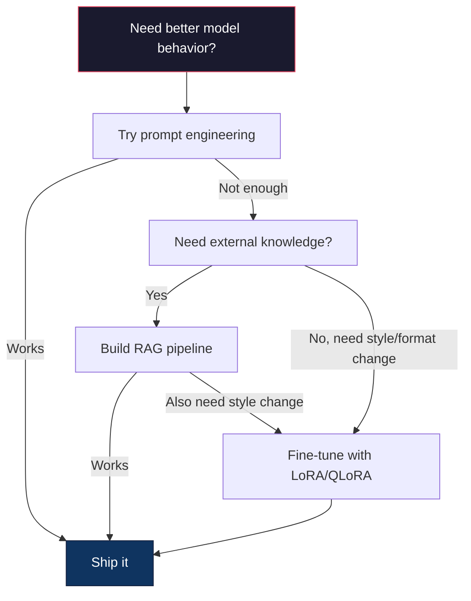

<!-- i18n:manual -->
# Дообучение с LoRA и QLoRA

> Полное дообучение модели на 7B параметров требует 56 ГБ видеопамяти. У вас столько нет. И у большинства компаний тоже. LoRA позволяет дообучить ту же модель в 6 ГБ, обучая меньше 1% параметров. Это не компромисс — на большинстве задач качество совпадает с полным дообучением. Вся экосистема открытого дообучения держится на одном этом трюке.

**Type:** Build
**Languages:** Python
**Prerequisites:** Phase 10, Lesson 06 (Instruction Tuning / SFT)
**Time:** ~75 minutes
**Related:** Фаза 10 разбирает циклы SFT/DPO с нуля. Этот урок подключает их к инструментам PEFT образца 2026 года (PEFT, TRL, Unsloth, Axolotl, LLaMA-Factory).

## Learning Objectives

- Реализовать LoRA, встраивая низкоранговые матрицы адаптера (A и B) в слои внимания предобученной модели
- Посчитать экономию параметров LoRA против полного дообучения: ранг r при размерности d_model обучает 2*r*d параметров вместо d^2
- Дообучить модель через QLoRA (базовая модель в 4-битной квантизации + адаптеры LoRA), уложившись в память потребительской видеокарты
- Вплавить веса LoRA обратно в базовую модель для деплоя и сравнить скорость инференса с адаптерами и без них

## The Problem

У вас есть базовая модель. Llama 3 8B. Вы хотите, чтобы она отвечала на тикеты поддержки голосом вашей компании. Ответ — SFT. Но у SFT есть проблема цены.

Полное дообучение обновляет каждый параметр модели. У Llama 3 8B их 8 миллиардов. В fp16 каждый параметр занимает 2 байта. Это 16 ГБ только на загрузку весов. Во время обучения нужны ещё градиенты (16 ГБ), состояния оптимизатора Adam (32 ГБ на моменты и дисперсии) и активации. Итого примерно 56 ГБ видеопамяти на одну модель 8B.

A100 80GB это еле вмещает. Две A100 стоят 3-4 доллара в час у облачных провайдеров. Обучение на 3 эпохи по 50 000 примеров занимает 6-10 часов. Это 30-40 долларов за эксперимент. Прогоните 10 экспериментов, чтобы подобрать гиперпараметры, — и вы потратили 400 долларов, ещё ничего не задеплоив.

Масштабируйте это до Llama 3 70B — и цифры становятся абсурдными. 140 ГБ на одни только веса. Нужен кластер. 100+ долларов за эксперимент.

Есть и более глубокая проблема. Полное дообучение меняет каждый вес модели. Если дообучить её на данных поддержки, можно испортить общие способности. Это называется катастрофическим забыванием. Модель становится лучше в вашей задаче и хуже во всём остальном.

Нужен метод, который обучает меньше параметров, ест меньше памяти и не разрушает уже накопленные знания модели.

> 🎒 **На пальцах.** Сложите сами: 16 ГБ веса + 16 ГБ градиенты + 32 ГБ состояния Adam — уже 64 ГБ, и это без активаций. То есть оптимизатор ест вдвое больше самой модели. Это как переезжать с одним чемоданом вещей, но тащить ещё два чемодана с упаковочной плёнкой: полезного груза мало, а места нужно втрое больше.

## The Concept

### LoRA: Low-Rank Adaptation

Эдвард Ху с коллегами из Microsoft опубликовали LoRA в июне 2021 года. Ключевая мысль статьи: обновления весов во время дообучения имеют низкий внутренний ранг. Не нужно обновлять все 16,7 миллиона параметров матрицы 4096x4096. Полезную информацию этого обновления можно уместить в матрицу ранга 16 или 32.

Вот математика. Обычный линейный слой вычисляет:

```
y = Wx
```

Где W — матрица d_out x d_in. Для проекции внимания 4096x4096 это 16 777 216 параметров.

LoRA замораживает W и добавляет низкоранговое разложение:

```
y = Wx + BAx
```

Где B имеет размер (d_out x r), а A — (r x d_in). Ранг r сильно меньше d — обычно 8, 16 или 32.

Для r=16 на слое 4096x4096:
- Исходных параметров: 4096 x 4096 = 16 777 216
- Параметров LoRA: (4096 x 16) + (16 x 4096) = 65 536 + 65 536 = 131 072
- Сокращение: 131 072 / 16 777 216 = 0,78%

Вы обучаете 0,78% параметров и получаете 95-100% качества.



A инициализируется случайными числами из нормального распределения. B инициализируется нулями. Значит, вклад LoRA стартует с нуля — модель начинает обучение со своего исходного поведения и постепенно учит поправку.

> 🎒 **На пальцах.** Матрица 4096x4096 — это как таблица на 16,7 миллиона клеток. LoRA говорит: не переписывай таблицу, храни две узкие полоски по 65 536 чисел, а их произведение и даст поправку. 131 072 против 16 777 216 — в 128 раз меньше. И поскольку B стартует нулями, первое произведение BA равно нулю: модель в момент старта ведёт себя ровно как раньше, ничего не сломано.

### The Scaling Factor: Alpha

LoRA вводит масштабирующий коэффициент alpha, который управляет тем, насколько сильно низкоранговая поправка влияет на выход:

```
y = Wx + (alpha / r) * BAx
```

Когда alpha = r, масштаб равен 1x. Когда alpha = 2r (частый дефолт), масштаб 2x. Этот гиперпараметр управляет скоростью обучения ветки LoRA независимо от базового learning rate.

Практические ориентиры:
- alpha = 2 * rank — распространённое соглашение сообщества (в оригинальной статье в большинстве экспериментов брали alpha = rank)
- alpha = rank даёт масштаб 1x: консервативно, зато стабильно
- Больший alpha означает более крупные обновления на шаг, что может ускорить сходимость, а может вызвать нестабильность

> 🎒 **На пальцах.** alpha — это ручка громкости для поправки. При r=16 и alpha=32 множитель равен 32/16 = 2, то есть вклад LoRA удваивается на каждом шаге. При alpha=16 множитель 1 — звучит тише и спокойнее. Ручку крутят отдельно от общего learning rate, поэтому можно оставить осторожный шаг обучения, но сделать саму поправку заметнее.

### Where to Apply LoRA

В трансформере много линейных слоёв. Добавлять LoRA во все не нужно. В оригинальной статье пробовали разные комбинации:

| Target Layers | Trainable Params (7B) | Quality |
|--------------|----------------------|---------|
| q_proj only | 4,7 млн | Хорошо |
| q_proj + v_proj | 9,4 млн | Лучше |
| q_proj + k_proj + v_proj + o_proj | 18,9 млн | Лучший вариант для внимания |
| All linear (attention + MLP) | 37,7 млн | Прирост незначительный, параметров вдвое больше |

Золотая середина для большинства задач: q_proj + v_proj. Это проекции query и value в self-attention, которые определяют, на что модель смотрит и какую информацию оттуда достаёт. Добавление слоёв MLP помогает на сложных задачах вроде генерации кода, но удваивает число параметров ради всё меньшей отдачи на задачах попроще.

### Rank Selection

Ранг r управляет выразительностью поправки:

| Rank | Trainable Params (per layer) | Best For |
|------|---------------------------|----------|
| 4 | 32 768 | Простая классификация, тональность |
| 8 | 65 536 | Вопрос-ответ в одном домене, суммаризация |
| 16 | 131 072 | Мультидоменные задачи, следование инструкциям |
| 32 | 262 144 | Сложные рассуждения, генерация кода |
| 64 | 524 288 | Отдача падает почти на всех задачах |
| 128 | 1 048 576 | Оправдано редко |

Ху с соавторами показали, что r=4 уже вытягивает почти всю поправку на простых задачах. r=8 и r=16 — самые частые значения на практике. Выше r=64 качество почти не растёт, зато теряется само преимущество LoRA по памяти.

> 🎒 **На пальцах.** Ранг — это ширина той самой полоски с правками. Обратите внимание: каждое удвоение ранга ровно вдвое увеличивает число параметров (32 768 → 65 536 → 131 072), а качество растёт всё медленнее. Поэтому начинайте с r=8, поднимайте до 16 или 32, только если модель явно недоучивается, и не гонитесь за 128 — это как покупать грузовик, чтобы возить один рюкзак.

### QLoRA: 4-Bit Quantization + LoRA

Тим Деттмерс с коллегами из Вашингтонского университета опубликовали QLoRA в мае 2023 года. Идея: квантовать замороженную базовую модель до 4 бит, а сверху навесить адаптеры LoRA в fp16.

Это радикально меняет уравнение памяти:

| Method | Weight Memory (7B) | Training Memory (7B) | GPU Required |
|--------|-------------------|---------------------|-------------|
| Full fine-tune (fp16) | 14 ГБ | ~56 ГБ | 1x A100 80GB |
| LoRA (fp16 base) | 14 ГБ | ~18 ГБ | 1x A100 40GB |
| QLoRA (4-bit base) | 3,5 ГБ | ~6 ГБ | 1x RTX 3090 24GB |

У QLoRA три технических вклада:

**NF4 (Normal Float 4-bit)**: новый тип данных, спроектированный специально под веса нейросетей. Веса нейросетей распределены примерно нормально. NF4 расставляет свои 16 уровней квантизации по квантилям стандартного нормального распределения. С точки зрения теории информации это оптимально для нормально распределённых данных. Информации теряется меньше, чем при равномерной 4-битной квантизации (INT4) или обычном Float4.

**Double quantization**: сами константы квантизации тоже занимают память. На каждый блок из 64 весов нужен масштабный коэффициент в fp32 (4 байта). Для модели 7B это лишние 0,4 ГБ. Двойная квантизация сжимает эти константы до fp8, снижая накладные расходы до 0,1 ГБ. Мелочь, но она накапливается.

**Paged optimizers**: во время обучения состояния оптимизатора (моменты и дисперсии Adam) на длинных последовательностях могут не влезть в видеопамять. Пейджинговые оптимизаторы используют унифицированную память NVIDIA, чтобы автоматически выгружать состояния оптимизатора в оперативную память, когда видеопамять кончилась, и подгружать обратно по необходимости. Это спасает от падений по OOM ценой части пропускной способности.

> 🎒 **На пальцах.** Смотрите на нижнюю строку таблицы: 3,5 ГБ весов вместо 14 ГБ и 6 ГБ на обучение вместо 56. Разница между «нужна серверная A100 за 3 доллара в час» и «хватит игровой видеокарты под столом». NF4 — это как хранить рост людей не в миллиметрах, а 16 готовыми категориями: раз почти все попадают в середину, категории и ставят гуще там, где людей больше.

### The Quality Question

Портит ли качество сокращение параметров или квантизация базы? Результаты из нескольких статей:

| Method | MMLU (5-shot) | MT-Bench | HumanEval |
|--------|--------------|----------|-----------|
| Full fine-tune (Llama 2 7B) | 48,3 | 6,72 | 14,6 |
| LoRA r=16 | 47,9 | 6,68 | 14,0 |
| QLoRA r=16 (NF4) | 47,5 | 6,61 | 13,4 |
| QLoRA r=64 (NF4) | 48,1 | 6,70 | 14,2 |

LoRA при r=16 укладывается в 1% от полного дообучения на большинстве бенчмарков. QLoRA при r=16 теряет ещё доли процента. QLoRA при r=64 фактически догоняет полное дообучение, потребляя на 90% меньше памяти.

### Real-World Costs

Дообучение Llama 3 8B на 50 000 примеров (3 эпохи):

| Method | GPU | Time | Cost |
|--------|-----|------|------|
| Full fine-tune | 2x A100 80GB | 8 часов | ~$32 |
| LoRA r=16 | 1x A100 40GB | 4 часа | ~$8 |
| QLoRA r=16 | 1x RTX 4090 24GB | 6 часов | ~$5 |
| QLoRA r=16 (Unsloth) | 1x RTX 4090 24GB | 2,5 часа | ~$2 |
| QLoRA r=16 | 1x T4 16GB | 12 часов | ~$4 |

QLoRA на одной потребительской видеокарте обходится дешевле обеда. Именно поэтому сообщество дообучения открытых моделей взорвалось в 2023 году и поэтому каждый фреймворк обучения ниже по умолчанию поставляется с QLoRA в 2026-м.

> 🎒 **На пальцах.** Посчитайте те самые 10 экспериментов из начала урока: полное дообучение — 320 долларов, QLoRA на Unsloth — 20. За разницу можно купить саму видеокарту. И заметьте строку Unsloth: та же карта, тот же ранг, но 2,5 часа вместо 6 — это выигрыш чисто от переписанных вычислительных ядер, без потери качества.

### The 2026 PEFT stack

| Framework | What it is | Pick when |
|-----------|-----------|-----------|
| **Hugging Face PEFT** | Каноническая библиотека LoRA/QLoRA/DoRA/IA3 | Нужен полный контроль, а цикл обучения уже на `transformers.Trainer` |
| **TRL** | Тренеры обучения с обратной связью от HF (SFT, DPO, GRPO, PPO, ORPO) | После SFT нужен DPO/GRPO; построен поверх PEFT |
| **Unsloth** | Переписанный на ядрах Triton прямой и обратный проход | Нужно ускорение в 2-5 раз и вдвое меньше видеопамяти без потери точности; семейства Llama/Mistral/Qwen |
| **Axolotl** | Обёртка на YAML-конфигах над PEFT + TRL + DeepSpeed + Unsloth | Нужны воспроизводимые прогоны обучения под контролем версий |
| **LLaMA-Factory** | GUI/CLI/API поверх PEFT + TRL | Нужно дообучение без кода; поддержано 100+ семейств моделей |
| **torchtune** | Нативные рецепты PyTorch, без зависимости от `transformers` | Нужен минимум зависимостей, а команда и так стандартизирована на PyTorch |

Практическое правило: исследование или разовый эксперимент → PEFT. Повторяемый продакшен-пайплайн → Axolotl с включёнными ядрами Unsloth. Прототип на выброс → LLaMA-Factory.

> 🎒 **На пальцах.** Все шесть строк делают одно и то же — вставляют матрицы A и B, — различаются только уровнем обёртки. PEFT — это гаечный ключ, Axolotl — конвейер с YAML-конфигом, LLaMA-Factory — кнопка «дообучить». Строчка про Unsloth важнее остальных: это не другой метод, а те же вычисления на переписанных ядрах, отсюда и 2,5 часа вместо 6 в таблице выше.

### Merging Adapters

После обучения у вас две вещи: замороженная базовая модель и маленький адаптер LoRA (обычно 10-100 МБ). Дальше есть два пути:

1. **Keep them separate**: загрузить базовую модель, загрузить адаптер поверх. Менять адаптеры под разные задачи. Именно так одну базовую модель обслуживают сразу несколькими дообученными вариантами.

2. **Merge them permanently**: посчитать W' = W + (alpha/r) * BA и сохранить результат как новую полную модель. Вплавленная модель того же размера, что и исходная. Никаких накладных расходов на инференсе. Никакого адаптера, за которым надо следить.

Если обслуживаете много задач (адаптер поддержки, адаптер кода, адаптер перевода) — держите их раздельно. Если деплоите одну специализированную модель — вплавляйте.

Продвинутые техники слияния для комбинирования нескольких адаптеров:

- **TIES-Merging** (Yadav et al. 2023): отсекает параметры с малой величиной, разрешает конфликты знаков, затем сливает. Снижает интерференцию между адаптерами.
- **DARE** (Yu et al. 2023): случайно выбрасывает часть параметров адаптера перед слиянием, а остальные перемасштабирует. Неожиданно хорошо комбинирует способности.
- **Task arithmetic**: просто складывать или вычитать веса адаптеров. Сложение адаптера «код» и адаптера «математика» часто даёт модель, хорошую в обоих.

> 🎒 **На пальцах.** Адаптер на 50 МБ рядом с базой на 16 ГБ — это как стикер на странице книги. Держите стикеры отдельно, если хотите быстро переключать варианты; вклейте текст в саму страницу, если вариант всего один и важна скорость чтения. Формула вплавления та же самая: W' = W + (alpha/r) * BA, просто посчитанная один раз заранее, а не на каждом прогоне.

### When NOT to Fine-Tune

Дообучение — третий вариант, а не первый.

**First: prompt engineering.** Напишите системный промпт получше. Добавьте few-shot примеров. Используйте chain-of-thought. Это ничего не стоит и занимает минуты. Если промптинг довёл вас до 80% цели, дообучение вам, скорее всего, не нужно.

**Second: RAG.** Если модели нужно знать про ваши конкретные данные (документы, база знаний, каталог товаров), извлечение дешевле и проще в поддержке, чем запекание этого в веса. Смотрите урок 06.

**Third: fine-tuning.** Берите его, когда модель должна усвоить конкретный стиль, формат или способ рассуждения, которого промптингом не добиться. Когда нужен стабильный структурированный вывод. Когда нужно дистиллировать большую модель в маленькую. Когда важна задержка и вы не можете позволить себе лишние токены few-shot промпта.



```figure
lora-params
```

> 🎒 **На пальцах.** Порядок в схеме — это порядок по цене. Промпт переписывается за десять минут и стоит ноль. RAG — это день работы и обновляемая база. Дообучение — часы GPU и новый артефакт, который придётся переобучать при каждом изменении данных. Поэтому дообучение отвечает на вопрос «как модель говорит», а RAG — на вопрос «что модель знает».

## Build It

Реализуем LoRA с нуля на чистом PyTorch. Без библиотек. Без магии. Вы соберёте слой LoRA, встроите его в модель, обучите и вплавите веса обратно.

### Step 1: The LoRA Layer

```python
import torch
import torch.nn as nn
import math

class LoRALayer(nn.Module):
    def __init__(self, in_features, out_features, rank=8, alpha=16):
        super().__init__()
        self.rank = rank
        self.alpha = alpha
        self.scaling = alpha / rank

        self.A = nn.Parameter(torch.randn(in_features, rank) * (1 / math.sqrt(rank)))
        self.B = nn.Parameter(torch.zeros(rank, out_features))

    def forward(self, x):
        return (x @ self.A @ self.B) * self.scaling
```

A инициализируется масштабированными случайными числами. B инициализируется нулями. Произведение BA стартует с нуля, поэтому модель начинает со своего исходного поведения.

### Step 2: LoRA-Wrapped Linear Layer

```python
class LinearWithLoRA(nn.Module):
    def __init__(self, linear, rank=8, alpha=16):
        super().__init__()
        self.linear = linear
        self.lora = LoRALayer(
            linear.in_features, linear.out_features, rank, alpha
        )

        for param in self.linear.parameters():
            param.requires_grad = False

    def forward(self, x):
        return self.linear(x) + self.lora(x)
```

Исходный линейный слой заморожен. Обучаемы только параметры LoRA (A и B).

> 🎒 **На пальцах.** Обёртка делает ровно две вещи: в `forward` складывает выход старого слоя с выходом LoRA, а в конструкторе ставит всем весам старого слоя `requires_grad = False`. Это как оставить оригинал документа неприкосновенным и писать правки на прозрачной плёнке сверху: читаете вы сумму, но менять можно только плёнку.

### Step 3: Inject LoRA into a Model

```python
def inject_lora(model, target_modules, rank=8, alpha=16):
    for param in model.parameters():
        param.requires_grad = False

    lora_layers = {}
    for name, module in model.named_modules():
        if isinstance(module, nn.Linear):
            if any(t in name for t in target_modules):
                parent_name = ".".join(name.split(".")[:-1])
                child_name = name.split(".")[-1]
                parent = dict(model.named_modules())[parent_name]
                lora_linear = LinearWithLoRA(module, rank, alpha)
                setattr(parent, child_name, lora_linear)
                lora_layers[name] = lora_linear
    return lora_layers
```

Сначала заморозить каждый параметр модели. Затем обойти дерево модели, найти линейные слои с подходящими именами и заменить их обёрнутыми в LoRA версиями. Матрицы A и B в LoRA становятся единственными обучаемыми параметрами во всей модели.

### Step 4: Count Parameters

```python
def count_parameters(model):
    total = sum(p.numel() for p in model.parameters())
    trainable = sum(p.numel() for p in model.parameters() if p.requires_grad)
    frozen = total - trainable
    return {
        "total": total,
        "trainable": trainable,
        "frozen": frozen,
        "trainable_pct": 100 * trainable / total if total > 0 else 0
    }
```

> 🎒 **На пальцах.** Функция `inject_lora` работает как поиск с заменой по дереву модулей: находит `nn.Linear` с нужным именем и подставляет вместо него обёртку. `count_parameters` потом честно показывает результат — если в демо ниже вы увидите `trainable_pct` около 1%, значит инъекция сработала. Если там 100%, вы забыли заморозить базу, и обучение пойдёт как полное дообучение со всеми его аппетитами.

### Step 5: Merge Weights Back

```python
def merge_lora_weights(model):
    for name, module in model.named_modules():
        if isinstance(module, LinearWithLoRA):
            with torch.no_grad():
                merged = (
                    module.lora.A @ module.lora.B
                ) * module.lora.scaling
                module.linear.weight.data += merged.T
            parent_name = ".".join(name.split(".")[:-1])
            child_name = name.split(".")[-1]
            if parent_name:
                parent = dict(model.named_modules())[parent_name]
            else:
                parent = model
            setattr(parent, child_name, module.linear)
```

После вплавления слоёв LoRA больше нет. Модель того же размера, что и исходная, а поправка запечена в веса. Никаких накладных расходов на инференсе.

### Step 6: Simulated QLoRA Quantization

```python
def quantize_to_nf4(tensor, block_size=64):
    blocks = tensor.reshape(-1, block_size)
    scales = blocks.abs().max(dim=1, keepdim=True).values / 7.0
    scales = torch.clamp(scales, min=1e-8)
    quantized = torch.round(blocks / scales).clamp(-8, 7).to(torch.int8)
    return quantized, scales

def dequantize_from_nf4(quantized, scales, original_shape):
    dequantized = quantized.float() * scales
    return dequantized.reshape(original_shape)
```

Это симулирует 4-битную квантизацию, раскладывая веса по 16 дискретным уровням внутри блоков по 64. Продакшен-QLoRA использует библиотеку bitsandbytes для настоящего NF4 на GPU.

> 🎒 **На пальцах.** Квантизация здесь — это округление с общим масштабом на блок: делим 64 веса на их максимум, округляем до целого в диапазоне от -8 до 7 и запоминаем масштаб. Как если бы вы записывали цены не «1247 рублей», а «примерно 1200» — точность теряется, но чисел для записи нужно в разы меньше. Именно поэтому масштаб хранится на каждый блок отдельно: у соседних весов разброс похож, а у далёких — уже нет.

### Step 7: Training Loop

```python
def train_lora(model, data, epochs=5, lr=1e-3, batch_size=4):
    optimizer = torch.optim.AdamW(
        [p for p in model.parameters() if p.requires_grad], lr=lr
    )
    criterion = nn.MSELoss()

    losses = []
    for epoch in range(epochs):
        epoch_loss = 0.0
        n_batches = 0
        indices = torch.randperm(len(data["inputs"]))

        for i in range(0, len(indices), batch_size):
            batch_idx = indices[i:i + batch_size]
            x = data["inputs"][batch_idx]
            y = data["targets"][batch_idx]

            output = model(x)
            loss = criterion(output, y)

            optimizer.zero_grad()
            loss.backward()
            optimizer.step()

            epoch_loss += loss.item()
            n_batches += 1

        avg_loss = epoch_loss / n_batches
        losses.append(avg_loss)

    return losses
```

### Step 8: Full Demo

```python
def demo():
    torch.manual_seed(42)
    d_model = 256
    n_classes = 10

    model = nn.Sequential(
        nn.Linear(d_model, 512),
        nn.ReLU(),
        nn.Linear(512, 512),
        nn.ReLU(),
        nn.Linear(512, n_classes),
    )

    n_samples = 500
    x = torch.randn(n_samples, d_model)
    y = torch.randint(0, n_classes, (n_samples,))
    y_onehot = torch.zeros(n_samples, n_classes).scatter_(1, y.unsqueeze(1), 1.0)

    data = {"inputs": x, "targets": y_onehot}

    params_before = count_parameters(model)

    lora_layers = inject_lora(
        model, target_modules=["0", "2"], rank=8, alpha=16
    )

    params_after = count_parameters(model)

    losses = train_lora(model, data, epochs=20, lr=1e-3)

    merge_lora_weights(model)
    params_merged = count_parameters(model)

    return {
        "params_before": params_before,
        "params_after": params_after,
        "params_merged": params_merged,
        "losses": losses,
    }
```

Демо создаёт небольшую модель, встраивает LoRA в два слоя, обучает её и вплавляет веса обратно. Число обучаемых параметров падает с полного до ~1% на время обучения LoRA, а после вплавления модель возвращается к исходной архитектуре.

> 🎒 **На пальцах.** Обратите внимание, что в демо `target_modules=["0", "2"]` — это индексы слоёв внутри `nn.Sequential`, то есть первые два `nn.Linear`, а третий (выходной на 10 классов) остаётся нетронутым. Так и в реальности: LoRA вешают на q_proj и v_proj, а голову модели не трогают. И три замера параметров — до, после инъекции и после вплавления — рассказывают всю историю одним числом `trainable_pct`.

## Use It

С экосистемой Hugging Face LoRA на настоящей модели занимает около 20 строк:

```python
from transformers import AutoModelForCausalLM, AutoTokenizer
from peft import LoraConfig, get_peft_model, TaskType

model = AutoModelForCausalLM.from_pretrained("meta-llama/Llama-3.1-8B")
tokenizer = AutoTokenizer.from_pretrained("meta-llama/Llama-3.1-8B")

lora_config = LoraConfig(
    task_type=TaskType.CAUSAL_LM,
    r=16,
    lora_alpha=32,
    lora_dropout=0.05,
    target_modules=["q_proj", "v_proj"],
)

model = get_peft_model(model, lora_config)
model.print_trainable_parameters()
```

Для QLoRA добавьте квантизацию через bitsandbytes:

```python
from transformers import BitsAndBytesConfig

bnb_config = BitsAndBytesConfig(
    load_in_4bit=True,
    bnb_4bit_quant_type="nf4",
    bnb_4bit_compute_dtype=torch.bfloat16,
    bnb_4bit_use_double_quant=True,
)

model = AutoModelForCausalLM.from_pretrained(
    "meta-llama/Llama-3.1-8B",
    quantization_config=bnb_config,
    device_map="auto",
)

model = get_peft_model(model, lora_config)
```

Вот и всё. Тот же цикл обучения. Тот же пайплайн данных. Базовая модель теперь живёт в 4 битах, адаптеры LoRA обучаются в fp16, и всё вместе влезает в 6 ГБ.

Для обучения через Hugging Face Trainer:

```python
from transformers import TrainingArguments, Trainer
from datasets import load_dataset

dataset = load_dataset("tatsu-lab/alpaca", split="train[:5000]")

training_args = TrainingArguments(
    output_dir="./lora-llama",
    num_train_epochs=3,
    per_device_train_batch_size=4,
    gradient_accumulation_steps=4,
    learning_rate=2e-4,
    fp16=True,
    logging_steps=10,
    save_strategy="epoch",
    optim="paged_adamw_8bit",
)

trainer = Trainer(
    model=model,
    args=training_args,
    train_dataset=dataset,
)

trainer.train()

model.save_pretrained("./lora-adapter")
```

Сохранённый адаптер весит 10-100 МБ. Базовая модель остаётся нетронутой. Адаптеры можно выкладывать на Hugging Face Hub, не распространяя полную модель.

> 🎒 **На пальцах.** Сравните два конфига: `LoraConfig` с `r=16, lora_alpha=32` — это ровно тот множитель alpha/r = 2 из формулы выше, а `target_modules=["q_proj", "v_proj"]` — та самая золотая середина из таблицы. В `BitsAndBytesConfig` включены все три вклада QLoRA: `nf4`, `use_double_quant` и `paged_adamw_8bit` в аргументах обучения. То есть вся теория урока умещается в десяток строк конфига.

## Ship It

Этот урок производит:
- `outputs/prompt-lora-advisor.md` — промпт, который помогает выбрать ранг LoRA, целевые модули и гиперпараметры под вашу конкретную задачу
- `outputs/skill-fine-tuning-guide.md` — навык, который учит агентов дереву решений: когда и как дообучать

## Exercises

1. **Rank ablation study.** Прогоните демо с рангами 2, 4, 8, 16, 32 и 64. Постройте график итоговых потерь от ранга. Найдите точку, где отдача падает и удвоение ранга больше не уменьшает потери вдвое. Для простой классификации на 256-мерных признаках это должно быть примерно r=8-16.

2. **Target module comparison.** Измените inject_lora так, чтобы он цеплялся только к слою «0», только к слою «2», только к слою «4» и ко всем трём сразу. Обучите каждый вариант 20 эпох. Сравните скорость сходимости и итоговые потери. Это зеркалит реальный выбор между q_proj, v_proj и всеми линейными слоями.

3. **Quantization error analysis.** Возьмите матрицы весов обученной модели до и после quantize_to_nf4 / dequantize_from_nf4. Посчитайте среднеквадратичную ошибку, максимальную абсолютную ошибку и корреляцию между исходными и восстановленными весами. Поэкспериментируйте со значениями block_size 32, 64, 128 и 256.

4. **Multi-adapter serving.** Обучите два адаптера LoRA на разных подмножествах данных (чётные индексы против нечётных). Сохраните оба. Загрузите базовую модель один раз, затем переключайте адаптеры и убедитесь, что на одном и том же входе они дают разные выходы. Именно так продакшен-системы обслуживают несколько дообученных моделей из одной базы.

5. **Merge vs. unmerged inference.** Сравните выход модели с LoRA до и после merge_lora_weights на одних и тех же 100 входах. Убедитесь, что выходы совпадают (в пределах допуска чисел с плавающей точкой 1e-5). Затем замерьте скорость инференса для обоих вариантов — вплавленный должен быть чуть быстрее, потому что там одно матричное умножение вместо двух.

> 🎒 **На пальцах.** Начните с задания 5 — оно проверяет, что вы поняли главное. Если после вплавления выходы разошлись сильнее 1e-5, значит вы где-то потеряли множитель alpha/r или перепутали транспонирование при сложении с `weight.data`. А задание 1 даст вам собственную версию таблицы рангов: скорее всего, между r=16 и r=32 потери сдвинутся на единицы процентов, а параметров станет вдвое больше.

## Key Terms

| Term | What people say | What it actually means |
|------|----------------|----------------------|
| LoRA | «Эффективное дообучение» | Low-Rank Adaptation: заморозить базовые веса и обучить две маленькие матрицы A и B, произведение которых приближает полное обновление весов |
| QLoRA | «Дообучение на ноутбуке» | Quantized LoRA: загрузить базовую модель в 4-битном NF4 и обучать поверх адаптеры LoRA в fp16, что позволяет дообучать 7B в 6 ГБ видеопамяти |
| Rank (r) | «Насколько много модель может выучить» | Внутренняя размерность матриц A и B; управляет выразительностью против числа параметров |
| Alpha | «Learning rate для LoRA» | Масштабирующий коэффициент на выходе LoRA; alpha/r задаёт вклад поправки в итоговый выход |
| NF4 | «4-битная квантизация» | Normal Float 4: 4-битный тип данных с уровнями квантизации по квантилям нормального распределения, оптимальный для весов нейросетей |
| Adapter | «Та самая маленькая обученная часть» | Матрицы A и B из LoRA, сохранённые отдельным файлом (10-100 МБ), который грузится поверх любой копии базовой модели |
| Target modules | «На какие слои вешать LoRA» | Конкретные линейные слои (q_proj, v_proj и т.д.), куда встраиваются адаптеры LoRA |
| Merging | «Запечь внутрь» | Вычисление W + (alpha/r) * BA и замена исходного веса, что убирает накладные расходы адаптера на инференсе |
| Paged optimizers | «Не падать по OOM во время обучения» | Выгрузка состояний оптимизатора (моменты и дисперсии Adam) в оперативную память, когда видеопамять закончилась |
| Catastrophic forgetting | «Дообучение сломало всё остальное» | Обновление всех весов приводит к потере ранее выученных способностей модели |

## Further Reading

- Hu et al., "LoRA: Low-Rank Adaptation of Large Language Models" (2021) — оригинальная статья с методом низкорангового разложения, проверенным на GPT-3 175B при ранге всего 4
- Dettmers et al., "QLoRA: Efficient Finetuning of Quantized Language Models" (2023) — вводит NF4, двойную квантизацию и пейджинговые оптимизаторы, что позволяет дообучать 65B на одной видеокарте с 48 ГБ
- PEFT library documentation (huggingface.co/docs/peft) — стандартная библиотека для LoRA, QLoRA и других параметр-эффективных методов в экосистеме Hugging Face
- Yadav et al., "TIES-Merging: Resolving Interference When Merging Models" (2023) — техники объединения нескольких адаптеров LoRA без потери качества
- [Rafailov et al., "Direct Preference Optimization: Your Language Model is Secretly a Reward Model" (NeurIPS 2023)](https://arxiv.org/abs/2305.18290) — вывод DPO; стадия обучения на предпочтениях, которая идёт после SFT, без отдельной модели наград.
- [TRL documentation](https://huggingface.co/docs/trl/) — официальный справочник по `SFTTrainer`, `DPOTrainer`, `KTOTrainer` и стыковке с PEFT/bitsandbytes/Unsloth.
- [Unsloth documentation](https://docs.unsloth.ai/) — слитые ядра, которые удваивают пропускную способность дообучения и вдвое снижают память; слой производительности под TRL.
- [Axolotl documentation](https://axolotl-ai-cloud.github.io/axolotl/) — многокарточный тренер SFT/DPO/QLoRA на YAML-конфигах; альтернатива рукописным скриптам в духе «конфиг как код».
