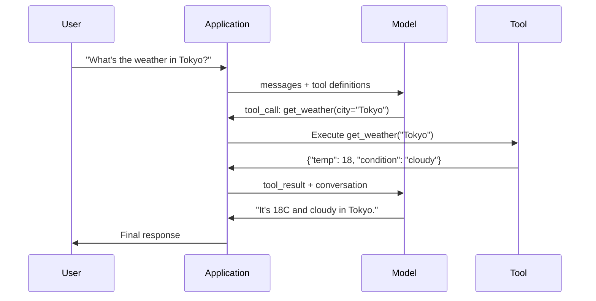

<!-- i18n:manual -->
# Вызов функций и работа с инструментами

> LLM не умеет делать ничего. Она генерирует текст. Это вся её способность. Она не может посмотреть погоду, сходить в базу данных, отправить письмо, запустить код или прочитать файл. Каждый «AI-агент», который вы видели, — это LLM, генерирующая JSON с указанием, какую функцию вызвать, и ваш код, который эту функцию реально вызывает. Модель — мозг. Инструменты — руки. Вызов функций — нервная система между ними.

**Type:** Build
**Languages:** Python
**Prerequisites:** Phase 11 Lesson 03 (Structured Outputs)
**Time:** ~75 minutes
**Related:** Phase 11 · 14 (Model Context Protocol) — когда инструмент нужен сразу нескольким хостам, переходите от встроенного вызова функций к MCP-серверу. Этот урок про встроенный случай, MCP — про протокольный.

## Learning Objectives

- Реализовать цикл вызова функций: описать схемы инструментов, разобрать JSON вызова от модели, выполнить функции и вернуть результаты
- Проектировать схемы инструментов с внятными описаниями и типизированными параметрами, которые модель надёжно вызывает
- Собрать многошаговый цикл агента, который связывает несколько вызовов функций ради ответа на сложный запрос
- Обрабатывать краевые случаи: параллельные вызовы инструментов, проброс ошибок и защиту от бесконечных циклов

## The Problem

Вы делаете чат-бота. Пользователь спрашивает: «Какая сейчас погода в Токио?»

Модель отвечает: «У меня нет доступа к данным о погоде в реальном времени, но с учётом сезона в Токио, вероятно, около 15 градусов Цельсия...»

Это галлюцинация, наряженная в дисклеймер. Модель не знает погоду. И никогда не узнает. Погода меняется каждый час. Данные обучения модели — многомесячной давности.

Правильный ответ требует вызвать API OpenWeatherMap, получить текущую температуру и вернуть настоящее число. Модель не умеет вызывать API. Ваш код умеет. Не хватает одного: структурированного протокола, который позволит модели сказать «мне нужно вызвать погодный API с такими аргументами», а вашему коду — выполнить вызов и подать результат обратно.

Это и есть вызов функций. Модель выдаёт структурированный JSON: какую функцию вызвать и с какими аргументами. Ваше приложение выполняет функцию. Результат возвращается в диалог. Модель использует результат, чтобы выдать финальный ответ.

Без вызова функций LLM — это энциклопедия. С ним она становится агентом.

> 🎒 **На пальцах.** Модель — это очень начитанный человек в комнате без окон и без телефона. Спросите его про погоду за окном — он честно расскажет про среднюю температуру в июне, но не про сегодня. Вызов функций — это дверная щель, через которую он передаёт вам записку «посмотри градусник в Токио», а вы возвращаете ему цифру 18. Ответ становится верным не потому, что модель поумнела, а потому что у неё появился курьер.

## The Concept

### The Function Calling Loop

Любое взаимодействие с инструментом идёт по одному и тому же циклу из 5 шагов.



Шаг 1: пользователь отправляет сообщение. Шаг 2: модель получает сообщение вместе с описаниями инструментов (JSON Schema, описывающая доступные функции). Шаг 3: вместо текстового ответа модель выдаёт вызов инструмента — структурированный JSON-объект с именем функции и аргументами. Шаг 4: ваш код выполняет функцию и забирает результат. Шаг 5: результат уходит обратно в модель, у которой теперь есть настоящие данные для финального ответа.

Модель никогда ничего не выполняет. Она только решает, что вызвать и с какими аргументами. Исполнитель — ваш код.

> 🎒 **На пальцах.** Пять шагов — это как заказ в ресторане. Вы говорите официанту «стейк» (шаг 1-2), он пишет заказ на бумажке (шаг 3), повар готовит (шаг 4), тарелка приезжает обратно (шаг 5). Официант ни разу не подошёл к плите. Если ваш код не выполнит `get_weather("Tokyo")`, модель так и останется с бумажкой в руках и никакой погоды не увидит.

### Tool Definitions: The JSON Schema Contract

Каждый инструмент описан схемой JSON Schema: что функция делает, какие аргументы принимает и какого типа эти аргументы.

```json
{
  "type": "function",
  "function": {
    "name": "get_weather",
    "description": "Get current weather for a city. Returns temperature in Celsius and conditions.",
    "parameters": {
      "type": "object",
      "properties": {
        "city": {
          "type": "string",
          "description": "City name, e.g. 'Tokyo' or 'San Francisco'"
        },
        "units": {
          "type": "string",
          "enum": ["celsius", "fahrenheit"],
          "description": "Temperature units"
        }
      },
      "required": ["city"]
    }
  }
}
```

Поля `description` критичны. Модель читает именно их, чтобы решить, когда и как применить инструмент. Расплывчатое «gets weather» даёт худший выбор инструмента, чем «Get current weather for a city. Returns temperature in Celsius and conditions.». Описание — это промпт для выбора инструмента.

> 🎒 **На пальцах.** Описание инструмента — это подпись на кнопке. На кнопке «жми сюда» человек ошибётся, на кнопке «вызов лифта на 3-й этаж» — нет. В схеме выше поле `units` дополнительно ограничено списком `enum: ["celsius", "fahrenheit"]`, то есть модели физически не из чего выбрать третий вариант, а `required: ["city"]` говорит: без города вызов бессмысленный.

### Provider Comparison

Вызов функций поддерживают все крупные провайдеры, но поверхность API у всех разная.

| Provider | API Parameter | Tool Call Format | Parallel Calls | Forced Calling |
|----------|--------------|-----------------|---------------|----------------|
| OpenAI (GPT-5, o4) | `tools` | `tool_calls[].function` | Да (несколько за ход) | `tool_choice="required"` |
| Anthropic (Claude 4.6/4.7) | `tools` | `content[].type="tool_use"` | Да (несколько блоков) | `tool_choice={"type":"any"}` |
| Google (Gemini 3) | `function_declarations` | `functionCall` | Да | `function_calling_config` |
| Open-weight (Llama 4, Qwen3, DeepSeek-V3) | родное поле `tools` у Llama 4; Hermes или ChatML у остальных | по-разному | зависит от модели | через промпт или `tool_choice`, если поддерживается |

К 2026 году три закрытых провайдера сошлись на почти одинаковых форматах на базе JSON Schema. Llama 4 идёт с родным полем `tools`, повторяющим форму OpenAI. Дообученные открытые модели всё ещё расходятся — формат Hermes (NousResearch) самый частый у сторонних файнтюнов. Если инструмент нужен нескольким хостам сразу, берите MCP (Phase 11 · 14) вместо встроенного вызова функций: сервер там один на всех.

> 🎒 **На пальцах.** Таблица говорит простую вещь: розетка одна, вилки разные. У OpenAI параметры лежат в `parameters`, у Anthropic — в `input_schema`, у Google поле вообще называется `function_declarations`. Смысл везде один — имя, описание, типы аргументов. Переписать интеграцию с одного провайдера на другого — это работа на полчаса, а не на неделю.

### Tool Choice: Auto, Required, Specific

Вы управляете тем, когда модель берётся за инструменты.

**Auto** (default): модель сама решает, вызвать инструмент или ответить напрямую. «Сколько будет 2+2?» — отвечает сама. «Какая погода?» — вызывает инструмент.

**Required**: модель обязана вызвать хотя бы один инструмент. Берите это, когда точно знаете: намерение пользователя без инструмента не закрыть. Не даёт модели гадать вместо того, чтобы посмотреть настоящие данные.

**Specific function**: заставить модель вызвать конкретную функцию. `tool_choice={"type":"function", "function": {"name": "get_weather"}}` гарантирует вызов погодного инструмента независимо от запроса. Это для маршрутизации — когда логика выше по стеку уже определила нужный инструмент.

### Parallel Function Calling

GPT-4o и Claude умеют вызывать несколько функций за один ход. Пользователь спрашивает: «Какая погода в Токио и Нью-Йорке?» Модель выдаёт сразу два вызова:

```json
[
  {"name": "get_weather", "arguments": {"city": "Tokyo"}},
  {"name": "get_weather", "arguments": {"city": "New York"}}
]
```

Ваш код выполняет оба (в идеале — одновременно), возвращает оба результата, и модель собирает единый ответ. Это сокращает походы туда-обратно с 2 до 1. Для агентов с 5-10 вызовами на запрос параллельные вызовы срезают задержку на 60-80 %.

> 🎒 **На пальцах.** Последовательно — это сходить в магазин за хлебом, вернуться, потом сходить за молоком. Параллельно — отправить двух человек одновременно. Если один вызов погодного API занимает 300 мс, то два по очереди — 600 мс, а два разом — те же 300 мс. На 10 инструментах разница уже 3 секунды против 0,3.

### Structured Outputs vs Function Calling

Урок 03 разбирал структурированные ответы. Вызов функций использует ту же машинерию JSON Schema, но ради другой цели.

**Structured outputs**: заставить модель выдать данные в заданной форме. Выход — это конечный продукт. Пример: вытащить из текста информацию о товаре как `{name, price, in_stock}`.

**Function calling**: модель заявляет намерение выполнить действие. Выход — промежуточный шаг. Пример: `get_weather(city="Tokyo")` — модель запрашивает действие, а не выдаёт финальный ответ.

Берите структурированные ответы, когда нужно извлечение данных. Берите вызов функций, когда модель должна взаимодействовать с внешними системами.

> 🎒 **На пальцах.** Разница как между заполненной анкетой и заявкой. `{name: "iPhone", price: 999}` — это уже готовый результат, его можно класть в базу. `get_weather(city="Tokyo")` класть в базу бессмысленно: это просьба что-то сделать, и без вашего кода она мертва. Схема JSON одна и та же, а смысл выхода противоположный.

### Security: The Non-Negotiable Rules

Вызов функций — самая опасная способность, которую можно дать LLM. Модель выбирает, что выполнить. Если в наборе инструментов есть запросы к базе, запросы конструирует модель. Если есть shell-команды, их пишет модель.

**Rule 1: Never pass model-generated SQL directly to a database.** Модель может сгенерировать DROP TABLE, UNION-инъекцию или запрос, возвращающий все строки таблицы, — и рано или поздно сгенерирует. Всегда параметризуйте. Всегда валидируйте. Всегда держите allowlist разрешённых операций.

**Rule 2: Allowlist functions.** Модель может вызвать только те функции, которые вы явно описали. Никогда не делайте универсальный инструмент «выполни любую функцию по имени». Если у вас 50 внутренних функций, отдайте наружу те 5, которые нужны пользователю.

**Rule 3: Validate arguments.** Модель может передать имя города `"; DROP TABLE users; --"`. Проверяйте каждый аргумент на ожидаемые типы, диапазоны и форматы до выполнения.

**Rule 4: Sanitize tool results.** Если инструмент возвращает чувствительные данные (ключи API, персональные данные, внутренние ошибки), фильтруйте их до отправки в модель. Модель вставит результат инструмента в свой ответ дословно.

**Rule 5: Rate limit tool calls.** Модель, попавшая в цикл, вызовет инструменты сотни раз. Ставьте потолок (10-20 вызовов на диалог — разумно). Рвите бесконечные циклы.

> 🎒 **На пальцах.** Пять правил сводятся к одному: модель — это стажёр с доступом к продакшену. Она не злая, она просто выполняет то, что показалось уместным. Правило 5 стоит денег буквально: агент без потолка вызовов, зациклившийся на 300 запросах к API по 2 цента, сжигает 6 долларов за минуту и не заметит этого.

### Error Handling

Инструменты падают. API отваливаются по таймауту. Базы ложатся. Файлы не находятся. Модель должна узнать, что инструмент упал и почему.

Возвращайте ошибки как структурированные результаты инструмента, а не как исключения:

```json
{
  "error": true,
  "message": "City 'Toky' not found. Did you mean 'Tokyo'?",
  "code": "CITY_NOT_FOUND"
}
```

Модель это читает, правит аргументы и повторяет вызов. Модели хорошо умеют исправляться по структурированным сообщениям об ошибке. И плохо — восстанавливаться после пустых ответов или общего «что-то пошло не так».

> 🎒 **На пальцах.** Сравните две таблички на двери: «ошибка» и «города Toky нет, может быть, Tokyo?». По первой человек стоит и не понимает, что делать. По второй он через секунду вводит правильное название. С моделью то же самое: подсказка `"Did you mean 'Tokyo'?"` превращает провал в успешный повтор на следующем шаге, без вашего участия.

### MCP: Model Context Protocol

MCP — это открытый стандарт Anthropic для совместимости инструментов. Вместо того чтобы каждое приложение описывало свои инструменты, MCP даёт универсальный протокол: инструменты отдают MCP-серверы, а потребляют MCP-клиенты (Claude Code, Cursor или ваше приложение).

Один MCP-сервер может отдавать инструменты любому совместимому клиенту. Postgres MCP-сервер даёт доступ к базе любому MCP-совместимому агенту. GitHub MCP-сервер даёт любому агенту доступ к репозиторию. Инструменты описаны один раз, используются везде.

MCP для вызова функций — то же, чем HTTP является для сетей. Он стандартизирует транспортный слой, и инструменты становятся переносимыми.

```figure
mx-tool-call-loop
```

> 🎒 **На пальцах.** Без MCP каждая пара «приложение + инструмент» — отдельный провод: 10 приложений и 10 инструментов дают 100 интеграций. С MCP это 10 серверов и 10 клиентов — 20 штук работы вместо 100. Ровно тот же трюк, что USB сделал с зарядками.

## Build It

### Step 1: Define the Tool Registry

Соберите реестр, который хранит описания инструментов и их реализации. У каждого инструмента есть описание в JSON Schema (то, что видит модель) и Python-функция (то, что выполняет ваш код).

```python
import json
import math
import time
import hashlib


TOOL_REGISTRY = {}


def register_tool(name, description, parameters, function):
    TOOL_REGISTRY[name] = {
        "definition": {
            "type": "function",
            "function": {
                "name": name,
                "description": description,
                "parameters": parameters,
            },
        },
        "function": function,
    }
```

> 🎒 **На пальцах.** Реестр — это меню и кухня в одном словаре. `definition` — строка в меню, которую читает клиент-модель; `function` — реальная кастрюля, до которой модель не дотягивается. Разделение важно: пока имя не попало в `TOOL_REGISTRY`, вызвать его нельзя вообще никак — это и есть allowlist из правила 2.

### Step 2: Implement 5 Tools

Соберите калькулятор, поиск погоды, симулятор веб-поиска, чтение файла и запуск кода.

```python
def calculator(expression, precision=2):
    allowed = set("0123456789+-*/.() ")
    if not all(c in allowed for c in expression):
        return {"error": True, "message": f"Invalid characters in expression: {expression}"}
    try:
        result = eval(expression, {"__builtins__": {}}, {"math": math})
        return {"result": round(float(result), precision), "expression": expression}
    except Exception as e:
        return {"error": True, "message": str(e)}


WEATHER_DB = {
    "tokyo": {"temp_c": 18, "condition": "cloudy", "humidity": 72, "wind_kph": 14},
    "new york": {"temp_c": 22, "condition": "sunny", "humidity": 45, "wind_kph": 8},
    "london": {"temp_c": 12, "condition": "rainy", "humidity": 88, "wind_kph": 22},
    "san francisco": {"temp_c": 16, "condition": "foggy", "humidity": 80, "wind_kph": 18},
    "sydney": {"temp_c": 25, "condition": "sunny", "humidity": 55, "wind_kph": 10},
}


def get_weather(city, units="celsius"):
    key = city.lower().strip()
    if key not in WEATHER_DB:
        suggestions = [c for c in WEATHER_DB if c.startswith(key[:3])]
        return {
            "error": True,
            "message": f"City '{city}' not found.",
            "suggestions": suggestions,
            "code": "CITY_NOT_FOUND",
        }
    data = WEATHER_DB[key].copy()
    if units == "fahrenheit":
        data["temp_f"] = round(data["temp_c"] * 9 / 5 + 32, 1)
        del data["temp_c"]
    data["city"] = city
    return data


SEARCH_DB = {
    "python function calling": [
        {"title": "OpenAI Function Calling Guide", "url": "https://platform.openai.com/docs/guides/function-calling", "snippet": "Learn how to connect LLMs to external tools."},
        {"title": "Anthropic Tool Use", "url": "https://docs.anthropic.com/en/docs/tool-use", "snippet": "Claude can interact with external tools and APIs."},
    ],
    "MCP protocol": [
        {"title": "Model Context Protocol", "url": "https://modelcontextprotocol.io", "snippet": "An open standard for connecting AI models to data sources."},
    ],
    "weather API": [
        {"title": "OpenWeatherMap API", "url": "https://openweathermap.org/api", "snippet": "Free weather API with current, forecast, and historical data."},
    ],
}


def web_search(query, max_results=3):
    key = query.lower().strip()
    for db_key, results in SEARCH_DB.items():
        if db_key in key or key in db_key:
            return {"query": query, "results": results[:max_results], "total": len(results)}
    return {"query": query, "results": [], "total": 0}


FILE_SYSTEM = {
    "data/config.json": '{"model": "gpt-4o", "temperature": 0.7, "max_tokens": 4096}',
    "data/users.csv": "name,email,role\nAlice,alice@example.com,admin\nBob,bob@example.com,user",
    "README.md": "# My Project\nA tool-use agent built from scratch.",
}


def read_file(path):
    if ".." in path or path.startswith("/"):
        return {"error": True, "message": "Path traversal not allowed.", "code": "FORBIDDEN"}
    if path not in FILE_SYSTEM:
        available = list(FILE_SYSTEM.keys())
        return {"error": True, "message": f"File '{path}' not found.", "available_files": available, "code": "NOT_FOUND"}
    content = FILE_SYSTEM[path]
    return {"path": path, "content": content, "size_bytes": len(content), "lines": content.count("\n") + 1}


def run_code(code, language="python"):
    if language != "python":
        return {"error": True, "message": f"Language '{language}' not supported. Only 'python' is available."}
    forbidden = ["import os", "import sys", "import subprocess", "exec(", "eval(", "__import__", "open("]
    for pattern in forbidden:
        if pattern in code:
            return {"error": True, "message": f"Forbidden operation: {pattern}", "code": "SECURITY_VIOLATION"}
    try:
        local_vars = {}
        exec(code, {"__builtins__": {"print": print, "range": range, "len": len, "str": str, "int": int, "float": float, "list": list, "dict": dict, "sum": sum, "min": min, "max": max, "abs": abs, "round": round, "sorted": sorted, "enumerate": enumerate, "zip": zip, "map": map, "filter": filter, "math": math}}, local_vars)
        result = local_vars.get("result", None)
        return {"success": True, "result": result, "variables": {k: str(v) for k, v in local_vars.items() if not k.startswith("_")}}
    except Exception as e:
        return {"error": True, "message": f"{type(e).__name__}: {e}"}
```

> 🎒 **На пальцах.** Обратите внимание: каждая функция сама себя защищает. `calculator` пропускает только символы из `"0123456789+-*/.() "`, поэтому строка `__import__('os')` отсеивается ещё до `eval`. `read_file` отбивает любой путь с `..` или начинающийся с `/`, так что `../etc/passwd` не прочитается. `run_code` держит чёрный список из 7 шаблонов вроде `import os` и `open(`. Безопасность живёт в инструменте, а не в надежде на воспитанность модели.

### Step 3: Register All Tools

```python
def register_all_tools():
    register_tool(
        "calculator", "Evaluate a mathematical expression. Supports +, -, *, /, parentheses, and decimals. Returns the numeric result.",
        {"type": "object", "properties": {"expression": {"type": "string", "description": "Math expression, e.g. '(10 + 5) * 3'"}, "precision": {"type": "integer", "description": "Decimal places in result", "default": 2}}, "required": ["expression"]},
        calculator,
    )
    register_tool(
        "get_weather", "Get current weather for a city. Returns temperature, condition, humidity, and wind speed.",
        {"type": "object", "properties": {"city": {"type": "string", "description": "City name, e.g. 'Tokyo' or 'San Francisco'"}, "units": {"type": "string", "enum": ["celsius", "fahrenheit"], "description": "Temperature units, defaults to celsius"}}, "required": ["city"]},
        get_weather,
    )
    register_tool(
        "web_search", "Search the web for information. Returns a list of results with title, URL, and snippet.",
        {"type": "object", "properties": {"query": {"type": "string", "description": "Search query"}, "max_results": {"type": "integer", "description": "Maximum results to return", "default": 3}}, "required": ["query"]},
        web_search,
    )
    register_tool(
        "read_file", "Read the contents of a file. Returns the file content, size, and line count.",
        {"type": "object", "properties": {"path": {"type": "string", "description": "Relative file path, e.g. 'data/config.json'"}}, "required": ["path"]},
        read_file,
    )
    register_tool(
        "run_code", "Execute Python code in a sandboxed environment. Set a 'result' variable to return output.",
        {"type": "object", "properties": {"code": {"type": "string", "description": "Python code to execute"}, "language": {"type": "string", "enum": ["python"], "description": "Programming language"}}, "required": ["code"]},
        run_code,
    )
```

### Step 4: Build the Function Calling Loop

Это ядро движка. Он изображает, как модель выбирает инструмент, выполняет его и подаёт результаты обратно.

```python
def simulate_model_decision(user_message, tools, conversation_history):
    msg = user_message.lower()

    if any(word in msg for word in ["weather", "temperature", "forecast"]):
        cities = []
        for city in WEATHER_DB:
            if city in msg:
                cities.append(city)
        if not cities:
            for word in msg.split():
                if word.capitalize() in [c.title() for c in WEATHER_DB]:
                    cities.append(word)
        if not cities:
            cities = ["tokyo"]
        calls = []
        for city in cities:
            calls.append({"name": "get_weather", "arguments": {"city": city.title()}})
        return calls

    if any(word in msg for word in ["calculate", "compute", "math", "what is", "how much"]):
        for token in msg.split():
            if any(c in token for c in "+-*/"):
                return [{"name": "calculator", "arguments": {"expression": token}}]
        if "+" in msg or "-" in msg or "*" in msg or "/" in msg:
            expr = "".join(c for c in msg if c in "0123456789+-*/.() ")
            if expr.strip():
                return [{"name": "calculator", "arguments": {"expression": expr.strip()}}]
        return [{"name": "calculator", "arguments": {"expression": "0"}}]

    if any(word in msg for word in ["search", "find", "look up", "google"]):
        query = msg.replace("search for", "").replace("look up", "").replace("find", "").strip()
        return [{"name": "web_search", "arguments": {"query": query}}]

    if any(word in msg for word in ["read", "file", "open", "cat", "show"]):
        for path in FILE_SYSTEM:
            if path.split("/")[-1].split(".")[0] in msg:
                return [{"name": "read_file", "arguments": {"path": path}}]
        return [{"name": "read_file", "arguments": {"path": "README.md"}}]

    if any(word in msg for word in ["run", "execute", "code", "python"]):
        return [{"name": "run_code", "arguments": {"code": "result = 'Hello from the sandbox!'", "language": "python"}}]

    return []


def execute_tool_call(tool_call):
    name = tool_call["name"]
    args = tool_call["arguments"]

    if name not in TOOL_REGISTRY:
        return {"error": True, "message": f"Unknown tool: {name}", "code": "UNKNOWN_TOOL"}

    tool = TOOL_REGISTRY[name]
    func = tool["function"]
    start = time.time()

    try:
        result = func(**args)
    except TypeError as e:
        result = {"error": True, "message": f"Invalid arguments: {e}"}

    elapsed_ms = round((time.time() - start) * 1000, 2)
    return {"tool": name, "result": result, "execution_time_ms": elapsed_ms}


def run_function_calling_loop(user_message, max_iterations=5):
    conversation = [{"role": "user", "content": user_message}]
    tool_definitions = [t["definition"] for t in TOOL_REGISTRY.values()]
    all_tool_results = []

    for iteration in range(max_iterations):
        tool_calls = simulate_model_decision(user_message, tool_definitions, conversation)

        if not tool_calls:
            break

        results = []
        for call in tool_calls:
            result = execute_tool_call(call)
            results.append(result)

        conversation.append({"role": "assistant", "content": None, "tool_calls": tool_calls})

        for result in results:
            conversation.append({"role": "tool", "content": json.dumps(result["result"]), "tool_name": result["tool"]})

        all_tool_results.extend(results)
        break

    return {"conversation": conversation, "tool_results": all_tool_results, "iterations": iteration + 1 if tool_calls else 0}
```

> 🎒 **На пальцах.** `simulate_model_decision` — это модель-заглушка на ключевых словах: увидела «weather» — вернула вызов `get_weather`. Настоящая LLM делает то же самое, только по смыслу, а не по подстроке. Важнее другое: `run_function_calling_loop` ограничен `max_iterations=5`, и если инструментов не нужно (запрос «Tell me a joke»), список вызовов пуст и цикл сразу прерывается — это и есть защита из правила 5.

### Step 5: Argument Validation

Соберите валидатор, который сверяет аргументы вызова с JSON Schema до выполнения.

```python
def validate_tool_arguments(tool_name, arguments):
    if tool_name not in TOOL_REGISTRY:
        return [f"Unknown tool: {tool_name}"]

    schema = TOOL_REGISTRY[tool_name]["definition"]["function"]["parameters"]
    errors = []

    if not isinstance(arguments, dict):
        return [f"Arguments must be an object, got {type(arguments).__name__}"]

    for required_field in schema.get("required", []):
        if required_field not in arguments:
            errors.append(f"Missing required argument: {required_field}")

    properties = schema.get("properties", {})
    for arg_name, arg_value in arguments.items():
        if arg_name not in properties:
            errors.append(f"Unknown argument: {arg_name}")
            continue

        prop_schema = properties[arg_name]
        expected_type = prop_schema.get("type")

        type_checks = {"string": str, "integer": int, "number": (int, float), "boolean": bool, "array": list, "object": dict}
        if expected_type in type_checks:
            if not isinstance(arg_value, type_checks[expected_type]):
                errors.append(f"Argument '{arg_name}': expected {expected_type}, got {type(arg_value).__name__}")

        if "enum" in prop_schema and arg_value not in prop_schema["enum"]:
            errors.append(f"Argument '{arg_name}': '{arg_value}' not in {prop_schema['enum']}")

    return errors
```

> 🎒 **На пальцах.** Валидатор ловит три класса брака: нет обязательного поля, неверный тип и значение вне `enum`. Вызов `get_weather(units="kelvin")` завернётся, потому что в схеме разрешены только `celsius` и `fahrenheit`; `calculator(expression=123)` завернётся, потому что ждали `string`, а пришёл `int`. Это дешёвая проверка — она стоит микросекунды и экономит вам падение в проде.

### Step 6: Run the Demo

```python
def run_demo():
    register_all_tools()

    print("=" * 60)
    print("  Function Calling & Tool Use Demo")
    print("=" * 60)

    print("\n--- Registered Tools ---")
    for name, tool in TOOL_REGISTRY.items():
        desc = tool["definition"]["function"]["description"][:60]
        params = list(tool["definition"]["function"]["parameters"].get("properties", {}).keys())
        print(f"  {name}: {desc}...")
        print(f"    params: {params}")

    print(f"\n--- Argument Validation ---")
    validation_tests = [
        ("get_weather", {"city": "Tokyo"}, "Valid call"),
        ("get_weather", {}, "Missing required arg"),
        ("get_weather", {"city": "Tokyo", "units": "kelvin"}, "Invalid enum value"),
        ("calculator", {"expression": 123}, "Wrong type (int for string)"),
        ("unknown_tool", {"x": 1}, "Unknown tool"),
    ]
    for tool_name, args, label in validation_tests:
        errors = validate_tool_arguments(tool_name, args)
        status = "VALID" if not errors else f"ERRORS: {errors}"
        print(f"  {label}: {status}")

    print(f"\n--- Tool Execution ---")
    direct_tests = [
        {"name": "calculator", "arguments": {"expression": "(10 + 5) * 3 / 2"}},
        {"name": "get_weather", "arguments": {"city": "Tokyo"}},
        {"name": "get_weather", "arguments": {"city": "Mars"}},
        {"name": "web_search", "arguments": {"query": "python function calling"}},
        {"name": "read_file", "arguments": {"path": "data/config.json"}},
        {"name": "read_file", "arguments": {"path": "../etc/passwd"}},
        {"name": "run_code", "arguments": {"code": "result = sum(range(1, 101))"}},
        {"name": "run_code", "arguments": {"code": "import os; os.system('rm -rf /')"}},
    ]
    for call in direct_tests:
        result = execute_tool_call(call)
        print(f"\n  {call['name']}({json.dumps(call['arguments'])})")
        print(f"    -> {json.dumps(result['result'], indent=None)[:100]}")
        print(f"    time: {result['execution_time_ms']}ms")

    print(f"\n--- Full Function Calling Loop ---")
    test_queries = [
        "What's the weather in Tokyo?",
        "Calculate (100 + 250) * 0.15",
        "Search for MCP protocol",
        "Read the config file",
        "Run some Python code",
        "Tell me a joke",
    ]
    for query in test_queries:
        print(f"\n  User: {query}")
        result = run_function_calling_loop(query)
        if result["tool_results"]:
            for tr in result["tool_results"]:
                print(f"    Tool: {tr['tool']} ({tr['execution_time_ms']}ms)")
                print(f"    Result: {json.dumps(tr['result'], indent=None)[:90]}")
        else:
            print(f"    [No tool called -- direct response]")
        print(f"    Iterations: {result['iterations']}")

    print(f"\n--- Parallel Tool Calls ---")
    multi_city_query = "What's the weather in tokyo and london?"
    print(f"  User: {multi_city_query}")
    result = run_function_calling_loop(multi_city_query)
    print(f"  Tool calls made: {len(result['tool_results'])}")
    for tr in result["tool_results"]:
        city = tr["result"].get("city", "unknown")
        temp = tr["result"].get("temp_c", "N/A")
        print(f"    {city}: {temp}C, {tr['result'].get('condition', 'N/A')}")

    print(f"\n--- Security Checks ---")
    security_tests = [
        ("read_file", {"path": "../../etc/passwd"}),
        ("run_code", {"code": "import subprocess; subprocess.run(['ls'])"}),
        ("calculator", {"expression": "__import__('os').system('ls')"}),
    ]
    for tool_name, args in security_tests:
        result = execute_tool_call({"name": tool_name, "arguments": args})
        blocked = result["result"].get("error", False)
        print(f"  {tool_name}({list(args.values())[0][:40]}): {'BLOCKED' if blocked else 'ALLOWED'}")
```

## Use It

### OpenAI Function Calling

```python
# from openai import OpenAI
#
# client = OpenAI()
#
# tools = [{
#     "type": "function",
#     "function": {
#         "name": "get_weather",
#         "description": "Get current weather for a city",
#         "parameters": {
#             "type": "object",
#             "properties": {
#                 "city": {"type": "string"},
#                 "units": {"type": "string", "enum": ["celsius", "fahrenheit"]}
#             },
#             "required": ["city"]
#         }
#     }
# }]
#
# response = client.chat.completions.create(
#     model="gpt-4o",
#     messages=[{"role": "user", "content": "Weather in Tokyo?"}],
#     tools=tools,
#     tool_choice="auto",
# )
#
# tool_call = response.choices[0].message.tool_calls[0]
# args = json.loads(tool_call.function.arguments)
# result = get_weather(**args)
#
# final = client.chat.completions.create(
#     model="gpt-4o",
#     messages=[
#         {"role": "user", "content": "Weather in Tokyo?"},
#         response.choices[0].message,
#         {"role": "tool", "tool_call_id": tool_call.id, "content": json.dumps(result)},
#     ],
# )
# print(final.choices[0].message.content)
```

OpenAI возвращает вызовы инструментов в `response.choices[0].message.tool_calls`. У каждого вызова есть `id`, который обязательно нужно указать при возврате результата. По этому ID модель сопоставляет результаты вызовам. GPT-4o может вернуть несколько вызовов в одном ответе — пройдите по всем и выполните каждый.

### Anthropic Tool Use

```python
# import anthropic
#
# client = anthropic.Anthropic()
#
# response = client.messages.create(
#     model="claude-sonnet-5",
#     max_tokens=1024,
#     tools=[{
#         "name": "get_weather",
#         "description": "Get current weather for a city",
#         "input_schema": {
#             "type": "object",
#             "properties": {
#                 "city": {"type": "string"},
#                 "units": {"type": "string", "enum": ["celsius", "fahrenheit"]}
#             },
#             "required": ["city"]
#         }
#     }],
#     messages=[{"role": "user", "content": "Weather in Tokyo?"}],
# )
#
# tool_block = next(b for b in response.content if b.type == "tool_use")
# result = get_weather(**tool_block.input)
#
# final = client.messages.create(
#     model="claude-sonnet-5",
#     max_tokens=1024,
#     tools=[...],
#     messages=[
#         {"role": "user", "content": "Weather in Tokyo?"},
#         {"role": "assistant", "content": response.content},
#         {"role": "user", "content": [{"type": "tool_result", "tool_use_id": tool_block.id, "content": json.dumps(result)}]},
#     ],
# )
```

Anthropic возвращает вызовы инструментов как блоки контента с `type: "tool_use"`. Результат уходит в сообщении пользователя с `type: "tool_result"`. Отметьте ключевое отличие: Anthropic описывает параметры инструмента через `input_schema`, а OpenAI — через `parameters`.

> 🎒 **На пальцах.** Два кода выше делают одно и то же, различий ровно три: где лежит вызов (`tool_calls` против блока `tool_use`), как называется схема (`parameters` против `input_schema`) и в чью роль кладётся результат (`role: "tool"` у OpenAI, `role: "user"` с блоком `tool_result` у Anthropic). Всё остальное — тот же самый пятишаговый цикл.

### MCP Integration

```python
# MCP servers expose tools over a standardized protocol.
# Any MCP-compatible client can discover and call these tools.
#
# Example: connecting to a Postgres MCP server
#
# from mcp import ClientSession, StdioServerParameters
# from mcp.client.stdio import stdio_client
#
# server_params = StdioServerParameters(
#     command="npx",
#     args=["-y", "@modelcontextprotocol/server-postgres", "postgresql://localhost/mydb"],
# )
#
# async with stdio_client(server_params) as (read, write):
#     async with ClientSession(read, write) as session:
#         await session.initialize()
#         tools = await session.list_tools()
#         result = await session.call_tool("query", {"sql": "SELECT count(*) FROM users"})
```

MCP разъединяет реализацию инструмента и его потребление. Postgres-сервер знает SQL. GitHub-сервер знает свой API. Ваш агент просто находит инструменты и вызывает их — ему не нужен отдельный код под каждую интеграцию.

## Ship It

Урок даёт `outputs/prompt-tool-designer.md` — переиспользуемый шаблон промпта для проектирования описаний инструментов. Даёте ему описание того, что должен делать инструмент, — получаете полное определение JSON Schema с описаниями, типами и ограничениями.

Также он даёт `outputs/skill-function-calling-patterns.md` — схему принятия решений при внедрении вызова функций в проде: проектирование инструментов, обработка ошибок, безопасность и особенности провайдеров.

## Exercises

1. **Add a 6th tool: database query.** Реализуйте имитацию SQL-инструмента с таблицей в памяти. Инструмент принимает имя таблицы и условия фильтра (не сырой SQL). Проверьте, что имя таблицы есть в allowlist, а операторы фильтра ограничены набором `=`, `>`, `<`, `>=`, `<=`. Верните подходящие строки как JSON.

2. **Implement retry with error feedback.** Когда вызов инструмента падает (например, город не найден), подайте сообщение об ошибке обратно в функцию принятия решения и дайте ей исправить аргументы. Считайте, сколько повторов уходит на каждый вызов. Поставьте потолок в 3 повтора на вызов.

3. **Build a multi-step agent.** Некоторые запросы требуют цепочки вызовов: «Прочитай конфиг и скажи, какая модель настроена, потом найди в вебе её цены». Реализуйте цикл, который крутится, пока модель не решит, что инструменты больше не нужны, передавая накопленные результаты в каждый шаг решения. Ограничьте 10 итерациями, чтобы не уйти в бесконечность.

4. **Measure tool selection accuracy.** Составьте 30 тестовых запросов с ожидаемыми именами инструментов. Прогоните на них свою функцию решения и посчитайте, в каком проценте случаев выбран правильный инструмент. Найдите запросы, на которых инструменты путаются чаще всего.

5. **Implement tool call caching.** Если тот же инструмент вызывается с теми же аргументами в пределах 60 секунд, возвращайте закешированный результат вместо повторного выполнения. Используйте словарь с ключом `(tool_name, frozenset(args.items()))`. Измерьте долю попаданий в кеш на диалоге из 20 запросов.

> 🎒 **На пальцах.** Начните с пятого задания — оно самое быстрое и самое денежное. Если в диалоге из 20 запросов десять раз спрашивают погоду в Токио, кеш срежет 9 вызовов API из 10, то есть 90 % трафика на этом инструменте. Задание 3 — самое важное для понимания: именно цикл «решение — вызов — результат — снова решение» превращает набор функций в агента.

## Key Terms

| Term | What people say | What it actually means |
|------|----------------|----------------------|
| Function calling | "Tool use" | Модель выдаёт структурированный JSON с описанием функции и аргументов — выполняет её ваш код, а не модель |
| Tool definition | "Function schema" | Объект JSON Schema с именем, назначением, параметрами и типами инструмента — модель читает его, чтобы понять, когда и как применить инструмент |
| Tool choice | "Calling mode" | Управляет тем, обязана ли модель вызвать инструмент (required), может вызвать (auto) или должна вызвать конкретный (named) |
| Parallel calling | "Multi-tool" | Модель выдаёт несколько вызовов за один ход, сокращая походы туда-обратно — поддерживают и GPT-4o, и Claude |
| Tool result | "Function output" | Возвращаемое значение выполненного инструмента, отправленное модели как сообщение, чтобы она отвечала на настоящих данных |
| Argument validation | "Input checking" | Проверка того, что сгенерированные моделью аргументы соответствуют ожидаемым типам, диапазонам и ограничениям, до выполнения инструмента |
| MCP | "Tool protocol" | Model Context Protocol — открытый стандарт Anthropic: инструменты отдаются серверами, и любой совместимый клиент их находит и вызывает |
| Agent loop | "ReAct loop" | Итеративный цикл «модель выбирает инструмент — код выполняет — результат возвращается», пока модели не хватит данных для ответа |
| Tool poisoning | "Prompt injection via tools" | Атака, при которой в результате инструмента приходят инструкции, управляющие поведением модели — фильтруйте весь вывод инструментов |
| Rate limiting | "Call budget" | Потолок на количество вызовов инструментов в диалоге, чтобы не словить бесконечный цикл и не спалить бюджет на API |

## Further Reading

- [OpenAI Function Calling Guide](https://platform.openai.com/docs/guides/function-calling) — главный справочник по работе с инструментами в GPT-4o: параллельные вызовы, принудительный вызов и структурированные аргументы
- [Anthropic Tool Use Guide](https://docs.anthropic.com/en/docs/tool-use) — реализация работы с инструментами у Claude: input_schema, ответы с несколькими инструментами и настройка tool_choice
- [Model Context Protocol Specification](https://modelcontextprotocol.io) — открытый стандарт совместимости инструментов между AI-приложениями, с архитектурой сервер/клиент
- [Schick et al., 2023 -- "Toolformer: Language Models Can Teach Themselves to Use Tools"](https://arxiv.org/abs/2302.04761) — основополагающая статья про обучение LLM решать, когда и как вызывать внешние инструменты
- [Patil et al., 2023 -- "Gorilla: Large Language Model Connected with Massive APIs"](https://arxiv.org/abs/2305.15334) — дообучение LLM ради точных вызовов 1645 API и снижения галлюцинаций
- [Berkeley Function Calling Leaderboard](https://gorilla.cs.berkeley.edu/leaderboard.html) — живой бенчмарк точности вызова функций у GPT-4o, Claude, Gemini и открытых моделей
- [Yao et al., "ReAct: Synergizing Reasoning and Acting in Language Models" (ICLR 2023)](https://arxiv.org/abs/2210.03629) — цикл «мысль — действие — наблюдение», внешний цикл агента вокруг каждого вызова инструмента; где кончается этот урок, начинается фаза 14
- [Anthropic — Building effective agents (Dec 2024)](https://www.anthropic.com/research/building-effective-agents) — пять составных паттернов (цепочка промптов, маршрутизация, распараллеливание, оркестратор-исполнители, оценщик-оптимизатор), собранных из одного примитива работы с инструментами
