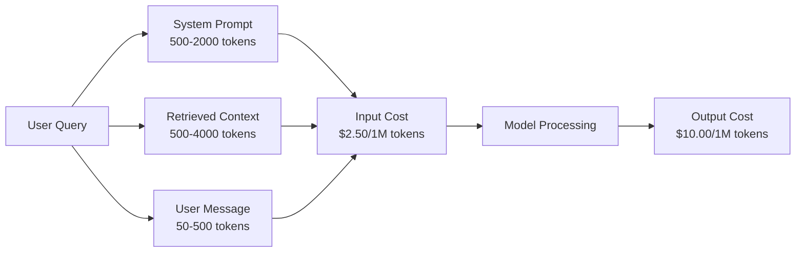
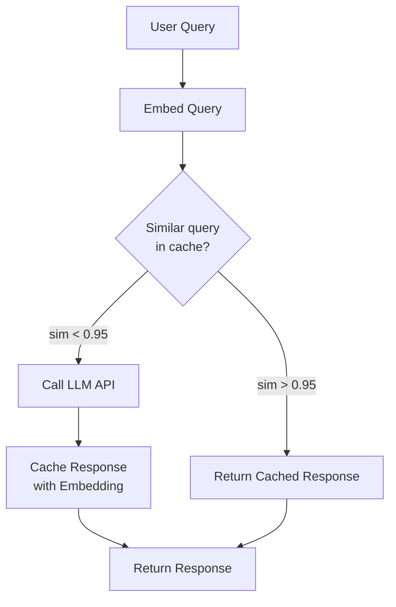
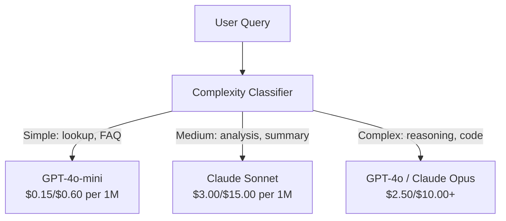

<!-- i18n:manual -->
# Кэширование, rate limiting и оптимизация стоимости

> Большинство AI-стартапов умирают не от плохих моделей. Они умирают от плохой юнит-экономики. Один вызов GPT-4o стоит доли цента. Десять тысяч пользователей по десять вызовов в день — это уже $250 в день только на входных токенах, ещё до того как вы получили первый доллар выручки. Выживают те компании, которые смотрят на каждый вызов API как на финансовую транзакцию, а не как на вызов функции.

**Type:** Build
**Languages:** Python
**Prerequisites:** Phase 11 Lesson 09 (Function Calling)
**Time:** ~45 minutes
**Related:** Phase 11 · 15 (Prompt Caching) — этот урок про кэширование на уровне приложения (семантический кэш, точный кэш по хэшу, роутинг моделей). Урок 15 — про prompt caching на стороне провайдера (Anthropic cache_control, автоматический у OpenAI, Gemini CachedContent). Вместе они дают снижение стоимости на 50-95%.

## Learning Objectives

- Реализовать семантическое кэширование, которое отдаёт повторяющиеся и похожие запросы из кэша вместо нового вызова API
- Считать стоимость одного запроса у разных провайдеров и сделать rate limiting с учётом токенов плюс алерты по бюджету
- Собрать слой оптимизации стоимости: сжатие промптов, роутинг моделей (дорогая против дешёвой) и кэширование ответов
- Спроектировать многоуровневую стратегию кэширования — точное совпадение, семантическая близость и кэш префикса — под разные типы запросов

## The Problem

Вы собрали RAG-чатбота. Работает отлично. Пользователи в восторге.

Потом приходит счёт.

GPT-5 стоит $5 за миллион входных токенов и $15 за миллион выходных. Claude Opus 4.7 — $15 на вход и $75 на выход. Gemini 3 Pro — $1.25 и $5. GPT-5-mini — $0.25/$2. Цены ниже приведены для примера; всегда сверяйтесь с актуальной страницей цен провайдера.

Вот арифметика, которая убивает стартапы:

- 10 000 активных пользователей в день
- 10 запросов на пользователя в день
- 1000 входных токенов на запрос (системный промпт + контекст + сообщение пользователя)
- 500 выходных токенов на ответ

**Daily input cost:** 10,000 x 10 x 1,000 / 1,000,000 x $2.50 = **$250 в день**
**Daily output cost:** 10,000 x 10 x 500 / 1,000,000 x $10.00 = **$500 в день**
**Monthly total:** **$22,500 в месяц**

И это только LLM. Добавьте эмбеддинги, хостинг векторной базы, инфраструктуру. Получается $30 000 в месяц за чатбота.

Самое обидное: 40-60% этих запросов — почти дубликаты. Пользователи спрашивают одно и то же чуть разными словами. Ваш системный промпт — одинаковый в каждом запросе — оплачивается каждый раз заново. Документы, которые RAG достаёт из базы, повторяются у всех, кто спрашивает про одну тему.

Вы платите полную цену за одни и те же вычисления.

> 🎒 **На пальцах.** Посмотрите на $22 500 в месяц и вспомните, что почти половина запросов — повторы. Это как если бы в кофейне вы каждый раз заново оплачивали аренду помещения при покупке одного латте. Кэш нужен, чтобы за повтор платить ноль, а не $0.0075.

## The Concept

### The Cost Anatomy of an LLM Call

У каждого вызова API есть пять составляющих стоимости.



Системные промпты — тихий убийца. Системный промпт на 1500 токенов, который улетает с каждым запросом, стоит $3.75 на миллион запросов только за этот префикс. При 100 тысячах запросов в день это $375 в день — $11 250 в месяц — за текст, который вообще не меняется.

> 🎒 **На пальцах.** Разложите один запрос на части: 1500 токенов системного промпта, 2000 токенов найденного контекста, 100 токенов вопроса. Пользователь написал 100 токенов, а платите вы за 3600 — то есть 97% счёта это то, что пользователь даже не видел. Как такси, где 97% суммы на счётчике набежало, пока машина стояла у подъезда.

### Provider Caching: Built-in Discounts

Все три крупных провайдера в 2026 году умеют кэшировать промпт на своей стороне, но механика разная. Подробный разбор — в Phase 11 · 15.

| Provider | Mechanism | Discount | Minimum | Cache Duration |
|----------|-----------|----------|---------|----------------|
| Anthropic | Явные маркеры cache_control | 90% при попадании в кэш (плюс 25% доплаты за запись) | 1024 токена (Sonnet/Opus), 2048 (Haiku) | 5 минут по умолчанию; 1 час расширенно (запись дороже вдвое) |
| OpenAI | Автоматическое совпадение префикса | 50% при попадании в кэш | 1024 токена | По возможности, до часа |
| Google Gemini | Явный API CachedContent | Примерно -75% (плюс плата за хранение) | 4096 (Flash) / 32 768 (Pro) | TTL настраивается пользователем |

**Anthropic's approach** — явный. Вы помечаете куски промпта через `cache_control: {"type": "ephemeral"}`. Первый запрос платит 25% надбавки за запись. Все следующие запросы с тем же префиксом получают скидку 90%. Системный промпт на 2000 токенов, который обычно стоит $0.005, при попадании в кэш стоит $0.000625. На 100 тысячах запросов это экономит $437.50 в день.

**OpenAI's approach** — автоматический. Любой префикс промпта, совпавший с предыдущим запросом, получает скидку 50%. Маркеры не нужны. Компромисс: скидка меньше и контроля меньше, зато и делать ничего не надо.

> 🎒 **На пальцах.** Сравните два числа из абзаца выше: без кэша префикс на 2000 токенов стоит $0.005, с кэшем — $0.000625, то есть в восемь раз дешевле. Провайдер как гардероб в театре: первый раз вы сдаёте пальто и платите за номерок, а дальше просто предъявляете номерок.

### Semantic Caching: Your Custom Layer

Кэш провайдера работает только для одинаковых префиксов. Семантический кэш решает задачу посложнее: разные формулировки с одним смыслом.

«What is the return policy?» и «How do I return an item?» — разные строки, но одно намерение. Семантический кэш превращает оба запроса в эмбеддинги, считает косинусную близость и отдаёт закэшированный ответ, если близость выше порога (обычно 0.92-0.95).



Эмбеддинги стоят копейки. text-embedding-3-small у OpenAI стоит $0.02 за миллион токенов. Проверка кэша практически бесплатна по сравнению с полноценным вызовом LLM.

> 🎒 **На пальцах.** Запрос на 20 токенов через эмбеддинг стоит примерно $0.0000004, а вызов GPT-4o по тому же запросу — около $0.0075. Разница в двадцать тысяч раз. Это как позвонить и спросить «есть ли товар», прежде чем ехать через весь город.

### Exact Caching: Hash and Match

Для детерминированных вызовов (temperature=0, та же модель, тот же промпт) проще и быстрее точный кэш. Считаем хэш всего промпта, смотрим в кэш, отдаём найденное.

Отлично работает для:
- Системный промпт + фиксированный контекст + одинаковые запросы пользователя
- Function calling с одинаковыми определениями инструментов
- Пакетной обработки, где один и тот же документ прогоняется несколько раз

### Rate Limiting: Protecting Your Budget

Rate limiting — это не про справедливость. Это про выживание.

**Token bucket algorithm:** каждому пользователю выдаётся ведро на N токенов, которое пополняется со скоростью R в секунду. Запрос забирает токены из ведра. Ведро пустое — запрос отклоняется. Так разрешаются всплески (можно выпить ведро разом), но средняя скорость остаётся под контролем.

**Per-user quotas:** задавайте дневные и месячные лимиты токенов по тарифу пользователя.

| Tier | Daily Token Limit | Max Requests/min | Model Access |
|------|------------------|------------------|-------------|
| Free | 50 000 | 10 | только GPT-4o-mini |
| Pro | 500 000 | 60 | GPT-4o, Claude Sonnet |
| Enterprise | 5 000 000 | 300 | все модели |

> 🎒 **На пальцах.** Возьмите тариф Free: ведро на 50 000 токенов и пополнение 500 токенов в секунду. Один запрос на 1000 токенов опустошает ведро за 50 запросов подряд, а потом придётся ждать по две секунды на каждый следующий. Ведро с краником: набрать залпом можно много, но течёт обратно медленно.

### Model Routing: Right Model for the Right Job

Не каждому запросу нужен GPT-4o.

«What time does the store close?» не требует модели по $10 за миллион выходных токенов. GPT-4o-mini за $0.60 за миллион справится прекрасно. Claude Haiku за $1.25 тоже справится. Простой классификатор отправляет дешёвые запросы дешёвым моделям, а сложные — дорогим.



Хорошо настроенный роутер экономит 40-70% только на моделях.

> 🎒 **На пальцах.** Один и тот же вопрос «во сколько вы закрываетесь» стоит $0.0075 на GPT-4o и $0.00045 на GPT-4o-mini — в шестнадцать раз дешевле при одинаковом ответе. Это как вызывать эвакуатор, чтобы перевезти велосипед.

### Cost Tracking: Know Where the Money Goes

Нельзя оптимизировать то, что не измеряешь. Логируйте каждый вызов API:

- Время
- Название модели
- Входные токены
- Выходные токены
- Задержка (мс)
- Посчитанная стоимость ($)
- ID пользователя
- Попадание/промах кэша
- Категория запроса

Эти данные показывают, какие фичи дорогие, какие пользователи потребляют больше всех и где кэш даёт максимальный эффект.

### Batching: Bulk Discounts

Batch API у OpenAI обрабатывает запросы асинхронно со скидкой 50%. Вы отправляете пачку до 50 000 запросов, результаты приходят в течение 24 часов.

Батчинг подходит для:
- Ночной обработки документов
- Массовой классификации
- Прогонов оценки
- Пайплайнов обогащения данных

Не подходит для: запросов от живого пользователя в реальном времени (там важна задержка).

### Budget Alerts and Circuit Breakers

Circuit breaker останавливает трату, когда вы упёрлись в лимит. Без него баг или злоупотребление сожгут месячный бюджет за несколько часов.

Задайте три порога:
1. **Warning** (70% бюджета): отправить алерт
2. **Throttle** (85% бюджета): перейти только на дешёвые модели
3. **Stop** (95% бюджета): отклонять новые запросы, отдавать только кэш

> 🎒 **На пальцах.** При бюджете $1000 первый порог сработает на $700, второй на $850, третий на $950 — и у вас останется $50 запаса вместо счёта на $8000 из-за цикла с багом. Это автомат в электрощитке: лучше выбить пробки, чем спалить проводку.

### The Optimization Stack

Применяйте техники по порядку. Каждый слой умножается на предыдущие.

| Layer | Technique | Typical Savings | Implementation Effort |
|-------|-----------|----------------|----------------------|
| 1 | Prompt caching у провайдера | 30-50% | Низкое (добавить маркеры кэша) |
| 2 | Точный кэш | 10-20% | Низкое (хэш + словарь) |
| 3 | Семантический кэш | 15-30% | Среднее (эмбеддинги + близость) |
| 4 | Роутинг моделей | 40-70% | Среднее (классификатор) |
| 5 | Rate limiting | Защита бюджета | Низкое (token bucket) |
| 6 | Сжатие промптов | 10-30% | Среднее (переписать промпты) |
| 7 | Батчинг | 50% на подходящих задачах | Низкое (batch API) |

RAG-приложение, применившее слои 1-5, обычно снижает расходы с $22 500 в месяц до $4000-6000. Это разница между сжиганием денег инвестора и построением бизнеса.

> 🎒 **На пальцах.** Слои перемножаются, а не складываются: если кэш провайдера убирает 40%, точный кэш ещё 15% от остатка, а роутер ещё 50%, то остаётся 0.6 × 0.85 × 0.5 = 0.255, то есть четверть исходного счёта. Как три скидочных купона на кассе подряд.

### Real Savings: Before and After

Вот реальная раскладка для RAG-чатбота на 10 000 активных пользователей в день.

| Metric | Before Optimization | After Optimization | Savings |
|--------|--------------------|--------------------|---------|
| Стоимость LLM в месяц | $22 500 | $5200 | 77% |
| Средняя стоимость запроса | $0.0075 | $0.0017 | 77% |
| Доля попаданий в кэш | 0% | 52% | -- |
| Запросов, ушедших на mini | 0% | 65% | -- |
| Задержка P95 | 2800 мс | 900 мс (попадания в кэш: 50 мс) | 68% |
| Стоимость эмбеддингов в месяц | $0 | $180 | (новая статья) |
| Итого в месяц | $22 500 | $5380 | 76% |

Эмбеддинги для семантического кэша ($180 в месяц) окупаются за первый же час попаданий в кэш.

> 🎒 **На пальцах.** Сравните строки таблицы: $180 в месяц за эмбеддинги против $17 300 сэкономленных — это возврат почти в сто раз. И задержка упала с 2800 мс до 900 мс, а на попаданиях в кэш до 50 мс, то есть в 56 раз быстрее ответа модели.

```figure
semantic-cache
```

## Build It

### Step 1: Cost Calculator

Соберите калькулятор стоимости токенов, который знает актуальные цены основных моделей.

```python
import hashlib
import time
import json
import math
from dataclasses import dataclass, field


MODEL_PRICING = {
    "gpt-4o": {"input": 2.50, "output": 10.00, "cached_input": 1.25},
    "gpt-4o-mini": {"input": 0.15, "output": 0.60, "cached_input": 0.075},
    "gpt-4.1": {"input": 2.00, "output": 8.00, "cached_input": 0.50},
    "gpt-4.1-mini": {"input": 0.40, "output": 1.60, "cached_input": 0.10},
    "gpt-4.1-nano": {"input": 0.10, "output": 0.40, "cached_input": 0.025},
    "o3": {"input": 2.00, "output": 8.00, "cached_input": 0.50},
    "o3-mini": {"input": 1.10, "output": 4.40, "cached_input": 0.55},
    "o4-mini": {"input": 1.10, "output": 4.40, "cached_input": 0.275},
    "claude-opus-4": {"input": 15.00, "output": 75.00, "cached_input": 1.50},
    "claude-sonnet-4": {"input": 3.00, "output": 15.00, "cached_input": 0.30},
    "claude-haiku-3.5": {"input": 0.80, "output": 4.00, "cached_input": 0.08},
    "gemini-2.5-pro": {"input": 1.25, "output": 10.00, "cached_input": 0.3125},
    "gemini-2.5-flash": {"input": 0.15, "output": 0.60, "cached_input": 0.0375},
}


def calculate_cost(model, input_tokens, output_tokens, cached_input_tokens=0):
    if model not in MODEL_PRICING:
        return {"error": f"Unknown model: {model}"}
    pricing = MODEL_PRICING[model]
    non_cached = input_tokens - cached_input_tokens
    input_cost = (non_cached / 1_000_000) * pricing["input"]
    cached_cost = (cached_input_tokens / 1_000_000) * pricing["cached_input"]
    output_cost = (output_tokens / 1_000_000) * pricing["output"]
    total = input_cost + cached_cost + output_cost
    return {
        "model": model,
        "input_tokens": input_tokens,
        "output_tokens": output_tokens,
        "cached_input_tokens": cached_input_tokens,
        "input_cost": round(input_cost, 6),
        "cached_input_cost": round(cached_cost, 6),
        "output_cost": round(output_cost, 6),
        "total_cost": round(total, 6),
    }
```

> 🎒 **На пальцах.** Прогоните формулу руками для gpt-4o: 1000 входных токенов дают 1000 / 1 000 000 × $2.50 = $0.0025, а 500 выходных — 500 / 1 000 000 × $10.00 = $0.005. Итого $0.0075 за один запрос. Обратите внимание: выход дороже входа вдвое за токен, поэтому «пиши короче» экономит сильнее, чем «читай меньше».

### Step 2: Exact Cache

Считаем хэш всего промпта и отдаём закэшированный ответ на одинаковые запросы.

```python
class ExactCache:
    def __init__(self, max_size=1000, ttl_seconds=3600):
        self.cache = {}
        self.max_size = max_size
        self.ttl = ttl_seconds
        self.hits = 0
        self.misses = 0

    def _hash(self, model, messages, temperature):
        key_data = json.dumps({"model": model, "messages": messages, "temperature": temperature}, sort_keys=True)
        return hashlib.sha256(key_data.encode()).hexdigest()

    def get(self, model, messages, temperature=0.0):
        if temperature > 0:
            self.misses += 1
            return None
        key = self._hash(model, messages, temperature)
        if key in self.cache:
            entry = self.cache[key]
            if time.time() - entry["timestamp"] < self.ttl:
                self.hits += 1
                entry["access_count"] += 1
                return entry["response"]
            del self.cache[key]
        self.misses += 1
        return None

    def put(self, model, messages, temperature, response):
        if temperature > 0:
            return
        if len(self.cache) >= self.max_size:
            oldest_key = min(self.cache, key=lambda k: self.cache[k]["timestamp"])
            del self.cache[oldest_key]
        key = self._hash(model, messages, temperature)
        self.cache[key] = {
            "response": response,
            "timestamp": time.time(),
            "access_count": 1,
        }

    def stats(self):
        total = self.hits + self.misses
        return {
            "hits": self.hits,
            "misses": self.misses,
            "hit_rate": round(self.hits / total, 4) if total > 0 else 0,
            "cache_size": len(self.cache),
        }
```

Обратите внимание на проверку `temperature > 0`: при ненулевой температуре модель каждый раз отвечает по-разному, поэтому кэшировать такой ответ нечестно — метод просто засчитывает промах и выходит.

### Step 3: Semantic Cache

Превращаем запросы в эмбеддинги и отдаём ответ из кэша, когда близость выше порога.

```python
def simple_embed(text):
    words = text.lower().split()
    vocab = {}
    for w in words:
        vocab[w] = vocab.get(w, 0) + 1
    norm = math.sqrt(sum(v * v for v in vocab.values()))
    if norm == 0:
        return {}
    return {k: v / norm for k, v in vocab.items()}


def cosine_similarity(a, b):
    if not a or not b:
        return 0.0
    all_keys = set(a) | set(b)
    dot = sum(a.get(k, 0) * b.get(k, 0) for k in all_keys)
    return dot


class SemanticCache:
    def __init__(self, similarity_threshold=0.85, max_size=500, ttl_seconds=3600):
        self.entries = []
        self.threshold = similarity_threshold
        self.max_size = max_size
        self.ttl = ttl_seconds
        self.hits = 0
        self.misses = 0

    def get(self, query):
        query_embedding = simple_embed(query)
        now = time.time()
        best_match = None
        best_sim = 0.0
        for entry in self.entries:
            if now - entry["timestamp"] > self.ttl:
                continue
            sim = cosine_similarity(query_embedding, entry["embedding"])
            if sim > best_sim:
                best_sim = sim
                best_match = entry
        if best_match and best_sim >= self.threshold:
            self.hits += 1
            best_match["access_count"] += 1
            return {"response": best_match["response"], "similarity": round(best_sim, 4), "original_query": best_match["query"]}
        self.misses += 1
        return None

    def put(self, query, response):
        if len(self.entries) >= self.max_size:
            self.entries.sort(key=lambda e: e["timestamp"])
            self.entries.pop(0)
        self.entries.append({
            "query": query,
            "embedding": simple_embed(query),
            "response": response,
            "timestamp": time.time(),
            "access_count": 1,
        })

    def stats(self):
        total = self.hits + self.misses
        return {
            "hits": self.hits,
            "misses": self.misses,
            "hit_rate": round(self.hits / total, 4) if total > 0 else 0,
            "cache_size": len(self.entries),
        }
```

> 🎒 **На пальцах.** `simple_embed` — это игрушечный эмбеддер: он считает слова и делит на длину вектора. У запроса «What are your store hours?» и «When does the store open?» общие слова только «store» — близость получится низкой, и кэш честно даст промах. Настоящие эмбеддинги ловят смысл, а не буквы, поэтому в бою здесь стоит text-embedding-3-small.

### Step 4: Rate Limiter

Rate limiter по алгоритму token bucket с квотами на пользователя.

```python
class TokenBucketRateLimiter:
    def __init__(self):
        self.buckets = {}
        self.tiers = {
            "free": {"capacity": 50_000, "refill_rate": 500, "max_requests_per_min": 10},
            "pro": {"capacity": 500_000, "refill_rate": 5_000, "max_requests_per_min": 60},
            "enterprise": {"capacity": 5_000_000, "refill_rate": 50_000, "max_requests_per_min": 300},
        }

    def _get_bucket(self, user_id, tier="free"):
        if user_id not in self.buckets:
            tier_config = self.tiers.get(tier, self.tiers["free"])
            self.buckets[user_id] = {
                "tokens": tier_config["capacity"],
                "capacity": tier_config["capacity"],
                "refill_rate": tier_config["refill_rate"],
                "last_refill": time.time(),
                "request_timestamps": [],
                "max_rpm": tier_config["max_requests_per_min"],
                "tier": tier,
                "total_tokens_used": 0,
            }
        return self.buckets[user_id]

    def _refill(self, bucket):
        now = time.time()
        elapsed = now - bucket["last_refill"]
        refill = int(elapsed * bucket["refill_rate"])
        if refill > 0:
            bucket["tokens"] = min(bucket["capacity"], bucket["tokens"] + refill)
            bucket["last_refill"] = now

    def check(self, user_id, tokens_needed, tier="free"):
        bucket = self._get_bucket(user_id, tier)
        self._refill(bucket)
        now = time.time()
        bucket["request_timestamps"] = [t for t in bucket["request_timestamps"] if now - t < 60]
        if len(bucket["request_timestamps"]) >= bucket["max_rpm"]:
            return {"allowed": False, "reason": "rate_limit", "retry_after_seconds": 60 - (now - bucket["request_timestamps"][0])}
        if bucket["tokens"] < tokens_needed:
            deficit = tokens_needed - bucket["tokens"]
            wait = deficit / bucket["refill_rate"]
            return {"allowed": False, "reason": "token_limit", "tokens_available": bucket["tokens"], "retry_after_seconds": round(wait, 1)}
        return {"allowed": True, "tokens_available": bucket["tokens"]}

    def consume(self, user_id, tokens_used, tier="free"):
        bucket = self._get_bucket(user_id, tier)
        bucket["tokens"] -= tokens_used
        bucket["request_timestamps"].append(time.time())
        bucket["total_tokens_used"] += tokens_used

    def get_usage(self, user_id):
        if user_id not in self.buckets:
            return {"error": "User not found"}
        b = self.buckets[user_id]
        return {
            "user_id": user_id,
            "tier": b["tier"],
            "tokens_remaining": b["tokens"],
            "capacity": b["capacity"],
            "total_tokens_used": b["total_tokens_used"],
            "utilization": round(b["total_tokens_used"] / b["capacity"], 4) if b["capacity"] else 0,
        }
```

> 🎒 **На пальцах.** Посчитайте `check` для тарифа free: ведро 50 000 токенов, лимит 10 запросов в минуту. На двенадцатом запросе список `request_timestamps` уже содержит 10 свежих меток, и вы получите отказ с причиной `rate_limit`, хотя токенов в ведре ещё 40 000. Два разных ограничителя: один считает деньги, другой — частоту.

### Step 5: Cost Tracker

Логируем каждый вызов и считаем нарастающие итоги.

```python
class CostTracker:
    def __init__(self, monthly_budget=1000.0):
        self.logs = []
        self.monthly_budget = monthly_budget
        self.alerts = []

    def log_call(self, model, input_tokens, output_tokens, cached_input_tokens=0, latency_ms=0, user_id="anonymous", cache_status="miss"):
        cost = calculate_cost(model, input_tokens, output_tokens, cached_input_tokens)
        entry = {
            "timestamp": time.time(),
            "model": model,
            "input_tokens": input_tokens,
            "output_tokens": output_tokens,
            "cached_input_tokens": cached_input_tokens,
            "latency_ms": latency_ms,
            "cost": cost["total_cost"],
            "user_id": user_id,
            "cache_status": cache_status,
        }
        self.logs.append(entry)
        self._check_budget()
        return entry

    def _check_budget(self):
        total = self.total_cost()
        pct = total / self.monthly_budget if self.monthly_budget > 0 else 0
        if pct >= 0.95 and not any(a["level"] == "stop" for a in self.alerts):
            self.alerts.append({"level": "stop", "message": f"Budget 95% consumed: ${total:.2f}/${self.monthly_budget:.2f}", "timestamp": time.time()})
        elif pct >= 0.85 and not any(a["level"] == "throttle" for a in self.alerts):
            self.alerts.append({"level": "throttle", "message": f"Budget 85% consumed: ${total:.2f}/${self.monthly_budget:.2f}", "timestamp": time.time()})
        elif pct >= 0.70 and not any(a["level"] == "warning" for a in self.alerts):
            self.alerts.append({"level": "warning", "message": f"Budget 70% consumed: ${total:.2f}/${self.monthly_budget:.2f}", "timestamp": time.time()})

    def total_cost(self):
        return round(sum(e["cost"] for e in self.logs), 6)

    def cost_by_model(self):
        by_model = {}
        for e in self.logs:
            m = e["model"]
            if m not in by_model:
                by_model[m] = {"calls": 0, "cost": 0, "input_tokens": 0, "output_tokens": 0}
            by_model[m]["calls"] += 1
            by_model[m]["cost"] = round(by_model[m]["cost"] + e["cost"], 6)
            by_model[m]["input_tokens"] += e["input_tokens"]
            by_model[m]["output_tokens"] += e["output_tokens"]
        return by_model

    def cache_savings(self):
        cache_hits = [e for e in self.logs if e["cache_status"] == "hit"]
        if not cache_hits:
            return {"saved": 0, "cache_hits": 0}
        saved = 0
        for e in cache_hits:
            full_cost = calculate_cost(e["model"], e["input_tokens"], e["output_tokens"])
            saved += full_cost["total_cost"]
        return {"saved": round(saved, 4), "cache_hits": len(cache_hits)}

    def summary(self):
        if not self.logs:
            return {"total_calls": 0, "total_cost": 0}
        total_latency = sum(e["latency_ms"] for e in self.logs)
        cache_hits = sum(1 for e in self.logs if e["cache_status"] == "hit")
        return {
            "total_calls": len(self.logs),
            "total_cost": self.total_cost(),
            "avg_cost_per_call": round(self.total_cost() / len(self.logs), 6),
            "avg_latency_ms": round(total_latency / len(self.logs), 1),
            "cache_hit_rate": round(cache_hits / len(self.logs), 4),
            "cost_by_model": self.cost_by_model(),
            "cache_savings": self.cache_savings(),
            "budget_remaining": round(self.monthly_budget - self.total_cost(), 2),
            "budget_utilization": round(self.total_cost() / self.monthly_budget, 4) if self.monthly_budget > 0 else 0,
            "alerts": self.alerts,
        }
```

### Step 6: Model Router

Отправляем запрос самой дешёвой модели, которая с ним справится.

```python
SIMPLE_KEYWORDS = ["what time", "hours", "address", "phone", "price", "return policy", "hello", "hi", "thanks", "yes", "no"]
COMPLEX_KEYWORDS = ["analyze", "compare", "explain why", "write code", "debug", "architect", "design", "trade-off", "evaluate"]


def classify_complexity(query):
    q = query.lower()
    if len(q.split()) <= 5 or any(kw in q for kw in SIMPLE_KEYWORDS):
        return "simple"
    if any(kw in q for kw in COMPLEX_KEYWORDS):
        return "complex"
    return "medium"


def route_model(query, tier="pro"):
    complexity = classify_complexity(query)
    routing_table = {
        "simple": {"free": "gpt-4.1-nano", "pro": "gpt-4o-mini", "enterprise": "gpt-4o-mini"},
        "medium": {"free": "gpt-4o-mini", "pro": "claude-sonnet-4", "enterprise": "claude-sonnet-4"},
        "complex": {"free": "gpt-4o-mini", "pro": "gpt-4o", "enterprise": "claude-opus-4"},
    }
    model = routing_table[complexity].get(tier, "gpt-4o-mini")
    return {"query": query, "complexity": complexity, "model": model, "tier": tier}
```

### Step 7: Run the Demo

```python
def simulate_llm_call(model, query):
    input_tokens = len(query.split()) * 4 + 500
    output_tokens = 150 + (len(query.split()) * 2)
    latency = 200 + (output_tokens * 2)
    return {
        "model": model,
        "response": f"[Simulated {model} response to: {query[:50]}...]",
        "input_tokens": input_tokens,
        "output_tokens": output_tokens,
        "latency_ms": latency,
    }


def run_demo():
    print("=" * 60)
    print("  Caching, Rate Limiting & Cost Optimization Demo")
    print("=" * 60)

    print("\n--- Model Pricing ---")
    for model, pricing in list(MODEL_PRICING.items())[:6]:
        cost_1k = calculate_cost(model, 1000, 500)
        print(f"  {model}: ${cost_1k['total_cost']:.6f} per 1K in + 500 out")

    print("\n--- Cost Comparison: 100K Requests ---")
    for model in ["gpt-4o", "gpt-4o-mini", "claude-sonnet-4", "claude-haiku-3.5"]:
        cost = calculate_cost(model, 1000 * 100_000, 500 * 100_000)
        print(f"  {model}: ${cost['total_cost']:.2f}")

    print("\n--- Anthropic Cache Savings ---")
    no_cache = calculate_cost("claude-sonnet-4", 2000, 500, 0)
    with_cache = calculate_cost("claude-sonnet-4", 2000, 500, 1500)
    saving = no_cache["total_cost"] - with_cache["total_cost"]
    print(f"  Without cache: ${no_cache['total_cost']:.6f}")
    print(f"  With 1500 cached tokens: ${with_cache['total_cost']:.6f}")
    print(f"  Savings per call: ${saving:.6f} ({saving/no_cache['total_cost']*100:.1f}%)")

    exact_cache = ExactCache(max_size=100, ttl_seconds=300)
    semantic_cache = SemanticCache(similarity_threshold=0.75, max_size=100)
    rate_limiter = TokenBucketRateLimiter()
    tracker = CostTracker(monthly_budget=100.0)

    print("\n--- Exact Cache ---")
    messages_1 = [{"role": "user", "content": "What is the return policy?"}]
    result = exact_cache.get("gpt-4o-mini", messages_1, 0.0)
    print(f"  First lookup: {'HIT' if result else 'MISS'}")
    exact_cache.put("gpt-4o-mini", messages_1, 0.0, "You can return items within 30 days.")
    result = exact_cache.get("gpt-4o-mini", messages_1, 0.0)
    print(f"  Second lookup: {'HIT' if result else 'MISS'} -> {result}")
    result = exact_cache.get("gpt-4o-mini", messages_1, 0.7)
    print(f"  With temp=0.7: {'HIT' if result else 'MISS (non-deterministic, skip cache)'}")
    print(f"  Stats: {exact_cache.stats()}")

    print("\n--- Semantic Cache ---")
    test_queries = [
        ("What is the return policy?", "Items can be returned within 30 days with receipt."),
        ("How do I return an item?", None),
        ("What are your store hours?", "We are open 9am-9pm Monday through Saturday."),
        ("When does the store open?", None),
        ("Tell me about quantum computing", "Quantum computers use qubits..."),
        ("Explain quantum mechanics", None),
    ]
    for query, response in test_queries:
        cached = semantic_cache.get(query)
        if cached:
            print(f"  '{query[:40]}' -> CACHE HIT (sim={cached['similarity']}, original='{cached['original_query'][:40]}')")
        elif response:
            semantic_cache.put(query, response)
            print(f"  '{query[:40]}' -> MISS (stored)")
        else:
            print(f"  '{query[:40]}' -> MISS (no match)")
    print(f"  Stats: {semantic_cache.stats()}")

    print("\n--- Rate Limiting ---")
    for i in range(12):
        check = rate_limiter.check("user_1", 1000, "free")
        if check["allowed"]:
            rate_limiter.consume("user_1", 1000, "free")
        status = "OK" if check["allowed"] else f"BLOCKED ({check['reason']})"
        if i < 5 or not check["allowed"]:
            print(f"  Request {i+1}: {status}")
    print(f"  Usage: {rate_limiter.get_usage('user_1')}")

    print("\n--- Model Routing ---")
    routing_queries = [
        "What time do you close?",
        "Summarize this quarterly earnings report",
        "Analyze the trade-offs between microservices and monoliths",
        "Hello",
        "Write code for a binary search tree with deletion",
    ]
    for q in routing_queries:
        route = route_model(q, "pro")
        print(f"  '{q[:50]}' -> {route['model']} ({route['complexity']})")

    print("\n--- Full Pipeline: Before vs After Optimization ---")
    queries = [
        "What is the return policy?",
        "How do I return something?",
        "What are your hours?",
        "When do you open?",
        "Explain the difference between TCP and UDP",
        "Compare TCP vs UDP protocols",
        "Hello",
        "What is your phone number?",
        "Write a Python function to sort a list",
        "Analyze the pros and cons of serverless architecture",
    ]

    print("\n  [Before: no caching, single model (gpt-4o)]")
    tracker_before = CostTracker(monthly_budget=1000.0)
    for q in queries:
        result = simulate_llm_call("gpt-4o", q)
        tracker_before.log_call("gpt-4o", result["input_tokens"], result["output_tokens"], latency_ms=result["latency_ms"], cache_status="miss")
    before = tracker_before.summary()
    print(f"  Total cost: ${before['total_cost']:.6f}")
    print(f"  Avg cost/call: ${before['avg_cost_per_call']:.6f}")
    print(f"  Avg latency: {before['avg_latency_ms']}ms")

    print("\n  [After: caching + routing + rate limiting]")
    exact_c = ExactCache()
    semantic_c = SemanticCache(similarity_threshold=0.75)
    tracker_after = CostTracker(monthly_budget=1000.0)

    for q in queries:
        messages = [{"role": "user", "content": q}]
        cached = exact_c.get("gpt-4o", messages, 0.0)
        if cached:
            tracker_after.log_call("gpt-4o-mini", 0, 0, latency_ms=5, cache_status="hit")
            continue
        sem_cached = semantic_c.get(q)
        if sem_cached:
            tracker_after.log_call("gpt-4o-mini", 0, 0, latency_ms=15, cache_status="hit")
            continue
        route = route_model(q)
        result = simulate_llm_call(route["model"], q)
        tracker_after.log_call(route["model"], result["input_tokens"], result["output_tokens"], latency_ms=result["latency_ms"], cache_status="miss")
        exact_c.put(route["model"], messages, 0.0, result["response"])
        semantic_c.put(q, result["response"])

    after = tracker_after.summary()
    print(f"  Total cost: ${after['total_cost']:.6f}")
    print(f"  Avg cost/call: ${after['avg_cost_per_call']:.6f}")
    print(f"  Avg latency: {after['avg_latency_ms']}ms")
    print(f"  Cache hit rate: {after['cache_hit_rate']:.0%}")

    if before["total_cost"] > 0:
        savings_pct = (1 - after["total_cost"] / before["total_cost"]) * 100
        print(f"\n  SAVINGS: {savings_pct:.1f}% cost reduction")
        print(f"  Latency improvement: {(1 - after['avg_latency_ms'] / before['avg_latency_ms']) * 100:.1f}% faster")

    print("\n--- Budget Alerts Demo ---")
    alert_tracker = CostTracker(monthly_budget=0.01)
    for i in range(5):
        alert_tracker.log_call("gpt-4o", 5000, 2000, latency_ms=500)
    print(f"  Total spent: ${alert_tracker.total_cost():.6f} / ${alert_tracker.monthly_budget}")
    for alert in alert_tracker.alerts:
        print(f"  ALERT [{alert['level'].upper()}]: {alert['message']}")

    print("\n--- Cost Breakdown by Model ---")
    multi_tracker = CostTracker(monthly_budget=500.0)
    for _ in range(50):
        multi_tracker.log_call("gpt-4o-mini", 800, 200, latency_ms=150)
    for _ in range(30):
        multi_tracker.log_call("claude-sonnet-4", 1500, 500, latency_ms=400)
    for _ in range(10):
        multi_tracker.log_call("gpt-4o", 2000, 800, latency_ms=600)
    for _ in range(10):
        multi_tracker.log_call("claude-opus-4", 3000, 1000, latency_ms=1200)
    breakdown = multi_tracker.cost_by_model()
    for model, data in sorted(breakdown.items(), key=lambda x: x[1]["cost"], reverse=True):
        print(f"  {model}: {data['calls']} calls, ${data['cost']:.6f}, {data['input_tokens']:,} in / {data['output_tokens']:,} out")
    print(f"  Total: ${multi_tracker.total_cost():.6f}")

    print("\n" + "=" * 60)
    print("  Demo complete.")
    print("=" * 60)


if __name__ == "__main__":
    run_demo()
```

> 🎒 **На пальцах.** Демо считает экономию честно: до оптимизации все 10 запросов идут в gpt-4o по $0.0075, это $0.075. После — часть уходит в кэш почти за ноль, часть на gpt-4o-mini, и итог падает в разы. Заодно средняя задержка падает, потому что попадание в кэш занимает 5 мс вместо 500.

## Use It

### Anthropic Prompt Caching

```python
# import anthropic
#
# client = anthropic.Anthropic()
#
# response = client.messages.create(
#     model="claude-sonnet-5",
#     max_tokens=1024,
#     system=[
#         {
#             "type": "text",
#             "text": "You are a helpful customer support agent for Acme Corp...",
#             "cache_control": {"type": "ephemeral"},
#         }
#     ],
#     messages=[{"role": "user", "content": "What is the return policy?"}],
# )
#
# print(f"Input tokens: {response.usage.input_tokens}")
# print(f"Cache creation tokens: {response.usage.cache_creation_input_tokens}")
# print(f"Cache read tokens: {response.usage.cache_read_input_tokens}")
```

Первый вызов пишет в кэш (надбавка 25%). Каждый следующий вызов с тем же префиксом системного промпта читает из кэша (скидка 90%). Кэш живёт 5 минут, и таймер сбрасывается при каждом попадании.

### OpenAI Automatic Caching

```python
# from openai import OpenAI
#
# client = OpenAI()
#
# response = client.chat.completions.create(
#     model="gpt-4o",
#     messages=[
#         {"role": "system", "content": "You are a helpful customer support agent..."},
#         {"role": "user", "content": "What is the return policy?"},
#     ],
# )
#
# print(f"Prompt tokens: {response.usage.prompt_tokens}")
# print(f"Cached tokens: {response.usage.prompt_tokens_details.cached_tokens}")
# print(f"Completion tokens: {response.usage.completion_tokens}")
```

OpenAI кэширует автоматически. Любой префикс промпта от 1024 токенов, совпавший с недавним запросом, получает скидку 50%. Менять код не нужно — просто проверьте поле `prompt_tokens_details.cached_tokens` в ответе, чтобы убедиться, что кэш работает.

### OpenAI Batch API

```python
# import json
# from openai import OpenAI
#
# client = OpenAI()
#
# requests = []
# for i, query in enumerate(queries):
#     requests.append({
#         "custom_id": f"request-{i}",
#         "method": "POST",
#         "url": "/v1/chat/completions",
#         "body": {
#             "model": "gpt-4o-mini",
#             "messages": [{"role": "user", "content": query}],
#         },
#     })
#
# with open("batch_input.jsonl", "w") as f:
#     for r in requests:
#         f.write(json.dumps(r) + "\n")
#
# batch_file = client.files.create(file=open("batch_input.jsonl", "rb"), purpose="batch")
# batch = client.batches.create(input_file_id=batch_file.id, endpoint="/v1/chat/completions", completion_window="24h")
# print(f"Batch ID: {batch.id}, Status: {batch.status}")
```

Batch API даёт ровную скидку 50% на все токены. Результаты приходят в течение 24 часов. Идеально для задач не в реальном времени: оценки, разметка данных, массовая суммаризация.

### Production Semantic Cache with Redis

```python
# import redis
# import numpy as np
# from openai import OpenAI
#
# r = redis.Redis()
# client = OpenAI()
#
# def get_embedding(text):
#     response = client.embeddings.create(model="text-embedding-3-small", input=text)
#     return response.data[0].embedding
#
# def semantic_cache_lookup(query, threshold=0.95):
#     query_emb = np.array(get_embedding(query))
#     keys = r.keys("cache:emb:*")
#     best_sim, best_key = 0, None
#     for key in keys:
#         stored_emb = np.frombuffer(r.get(key), dtype=np.float32)
#         sim = np.dot(query_emb, stored_emb) / (np.linalg.norm(query_emb) * np.linalg.norm(stored_emb))
#         if sim > best_sim:
#             best_sim, best_key = sim, key
#     if best_sim >= threshold and best_key:
#         response_key = best_key.decode().replace("cache:emb:", "cache:resp:")
#         return r.get(response_key).decode()
#     return None
```

В продакшене замените линейный перебор на векторный индекс (Redis Vector Search, Pinecone или pgvector). Линейный перебор нормально работает до 1000 записей. Дальше берите ANN (приблизительный поиск ближайших соседей) ради поиска за O(log n).

> 🎒 **На пальцах.** Линейный перебор при 1000 записей — это 1000 скалярных произведений на каждый запрос, доли миллисекунды. При 100 000 записей это уже 100 000 умножений, и проверка кэша начинает тормозить сильнее, чем сам вызов модели. Как искать книгу, перебирая все полки, вместо того чтобы заглянуть в каталог.

## Ship It

Этот урок даёт `outputs/prompt-cost-optimizer.md` — готовый промпт, который анализирует ваше LLM-приложение и предлагает конкретные способы снизить расходы с прогнозом экономии.

Ещё он даёт `outputs/skill-cost-patterns.md` — схему принятия решений: какую стратегию кэширования выбрать, как настроить rate limiting и по каким правилам роутить модели под вашу задачу.

## Exercises

1. **Implement LRU eviction for the semantic cache.** Замените вытеснение «самый старый первым» на вытеснение «дольше всех не использовался». Храните время последнего обращения к каждой записи и выкидывайте запись с самым старым обращением, когда кэш заполнен. Сравните долю попаданий у двух стратегий на 100 запросах.

2. **Build a cost projection tool.** По логу вызовов API (логи CostTracker) спрогнозируйте месячные расходы на основе среднего за последние 7 дней. Учтите разницу между буднями и выходными. Поднимайте алерт, если прогноз превышает бюджет больше чем на 20%.

3. **Implement tiered semantic caching.** Используйте два порога близости: 0.98 для уверенных попаданий (отдаём сразу) и 0.90 для средних (отдаём с оговоркой: «Основано на похожем предыдущем вопросе...»). Отмечайте, из какого уровня пришло попадание, и измеряйте разницу в удовлетворённости пользователей.

4. **Build a model routing classifier.** Замените классификатор по ключевым словам на классификатор по эмбеддингам. Постройте эмбеддинги для 50 размеченных запросов (simple/medium/complex), затем классифицируйте новые запросы по ближайшему размеченному примеру. Измерьте точность на тестовом наборе из 20 запросов.

5. **Implement a circuit breaker with degradation levels.** На 70% бюджета — писать предупреждение в лог. На 85% — автоматически переключать весь роутинг на самую дешёвую модель (gpt-4o-mini). На 95% — отдавать только кэш и отклонять новые запросы. Проверьте, симулировав 1000 запросов при бюджете $1.00, что каждый порог срабатывает как надо.

> 🎒 **На пальцах.** Начните с пятого задания — оно спасает деньги быстрее всех. При бюджете $1.00 и стоимости $0.0075 за запрос вы упрётесь в порог 70% примерно на 93-м запросе из 1000, так что все три уровня успеют сработать на одном прогоне. Это дешёвая репетиция пожара до того, как загорится по-настоящему.

## Key Terms

| Term | What people say | What it actually means |
|------|----------------|----------------------|
| Prompt caching | «Закэшируй системный промпт» | Кэширование на стороне провайдера, где повторяющиеся префиксы промпта получают скидку (90% у Anthropic, 50% у OpenAI) — у OpenAI без изменений в коде, у Anthropic через явные маркеры |
| Semantic caching | «Умное кэширование» | Строим эмбеддинг запроса, считаем близость к прошлым запросам и отдаём закэшированный ответ, если близость выше порога — ловит перефразировки, которые точное совпадение пропускает |
| Exact caching | «Кэш по хэшу» | Хэшируем весь промпт (модель + сообщения + температура) и отдаём закэшированный ответ на одинаковый вход — работает только для детерминированных вызовов с temperature=0 |
| Token bucket | «Ограничитель частоты» | Алгоритм, где у каждого пользователя есть ведро на N токенов, пополняемое со скоростью R в секунду — разрешает всплески до N, удерживая среднюю скорость R |
| Model routing | «Роутинг для жадных» | Классификатор отправляет простые запросы дешёвым моделям (GPT-4o-mini, Haiku), а сложные — дорогим (GPT-4o, Opus) — экономит 40-70% на моделях |
| Cost tracking | «Учёт потребления» | Логируем каждый вызов API с моделью, токенами, задержкой, стоимостью и ID пользователя, чтобы точно знать, куда уходят деньги и какие фичи дорогие |
| Circuit breaker | «Аварийный рубильник» | Автоматически ухудшаем сервис (дешёвые модели, только кэш) или вовсе останавливаем запросы, когда траты подходят к границе бюджета |
| Batch API | «Оптовая скидка» | Асинхронная обработка у OpenAI со скидкой 50% — отправляете до 50 000 запросов, результаты получаете в течение 24 часов |
| Prompt compression | «Диета для токенов» | Переписываем системные промпты и контекст так, чтобы токенов было меньше, а смысл сохранился — короткие промпты дешевле и часто работают лучше |
| Cache hit rate | «Эффективность кэша» | Доля запросов, отданных из кэша вместо вызова LLM — для боевых чатботов типично 40-60%, экономия пропорциональна |

## Further Reading

- [Anthropic Prompt Caching Guide](https://docs.anthropic.com/en/docs/build-with-claude/prompt-caching) -- официальная документация по явным маркерам cache_control у Anthropic, ценам и времени жизни кэша
- [OpenAI Prompt Caching](https://platform.openai.com/docs/guides/prompt-caching) -- автоматическое кэширование у OpenAI, как проверить попадания через поля usage и какова минимальная длина префикса
- [OpenAI Batch API](https://platform.openai.com/docs/guides/batch) -- скидка 50% за асинхронную обработку, формат JSONL, окно выполнения 24 часа и лимит в 50 тысяч запросов
- [GPTCache](https://github.com/zilliztech/GPTCache) -- open-source библиотека семантического кэширования с поддержкой разных эмбеддеров, векторных хранилищ и политик вытеснения
- [Martian Model Router](https://docs.withmartian.com) -- боевой роутер моделей, который сам выбирает самую дешёвую модель, способную справиться с запросом
- [Not Diamond](https://www.notdiamond.ai) -- роутер моделей на ML, который учится на вашем трафике и балансирует стоимость против качества между провайдерами
- [Helicone](https://www.helicone.ai) -- платформа наблюдаемости для LLM: учёт стоимости, кэширование, rate limiting и алерты по бюджету на уровне прокси
- [Dean & Barroso, "The Tail at Scale" (CACM 2013)](https://research.google/pubs/the-tail-at-scale/) -- задержка, пропускная способность, перцентили TTFT/TPOT и дублирующие запросы; модель стоимости, стоящая за правилом «бери самую дешёвую модель, которая ещё укладывается в P95»
- [Kwon et al., "Efficient Memory Management for Large Language Model Serving with PagedAttention" (SOSP 2023)](https://arxiv.org/abs/2309.06180) -- статья про vLLM; почему постраничный KV-кэш и continuous batching обгоняют наивные серверы в 24 раза по пропускной способности — это инфраструктурный слой под «кэшированием и стоимостью»
- [Dao et al., "FlashAttention-2: Faster Attention with Better Parallelism and Work Partitioning" (ICLR 2024)](https://arxiv.org/abs/2307.08691) -- снижение стоимости на уровне ядер, ортогональное prompt caching; читайте вместе со speculative decoding и GQA, чтобы увидеть всю кривую стоимости
