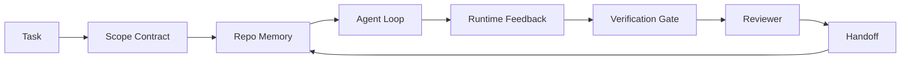

<!-- i18n:manual -->
# Инженерия agent workbench: почему сильные модели всё равно проваливаются

> Сильной модели недостаточно. Надёжному агенту нужен workbench: инструкции, состояние, границы работы, обратная связь, верификация, ревью и передача дел. Уберите их — и даже фронтирная модель выдаст работу, которую страшно отправлять в продакшен.

**Type:** Learn + Build
**Languages:** Python (stdlib)
**Prerequisites:** Phase 14 · 01 (Agent Loop), Phase 14 · 26 (Failure Modes)
**Time:** ~45 minutes

## Learning Objectives

- Отделять способности модели от надёжности исполнения.
- Назвать семь поверхностей workbench, от которых зависит, дойдёт ли работа агента до продакшена.
- Сравнить прогон «только промпт» с прогоном под управлением workbench на маленькой задаче в репозитории.
- Собрать отчёт о режимах отказа, где каждая пропущенная поверхность связана с симптомом, который она вызвала.

## The Problem

Вы запускаете фронтирную модель в настоящем репозитории и просите добавить валидацию входных данных. Она открывает четыре файла, пишет правдоподобный код, объявляет успех и останавливается. Вы запускаете тесты. Два падают. Ещё один файл изменён, хотя к валидации он не имел никакого отношения. И нигде нет записи о том, что агент предположил, что попробовал сначала и что осталось сделать.

Модель не ошиблась в Python. Она ошиблась в работе. Она не знала, что считается «готово», где ей разрешено писать, какие тесты авторитетны и как следующая сессия должна подхватить дело.

Это не баг модели. Это баг workbench. В окружении вокруг агента не хватает ровно тех частей, которые превращают одноразовую генерацию в надёжную инженерию, которую можно продолжить.

> 🎒 **На пальцах.** Это как попросить помощника «сделай салат», не сказав, какие продукты трогать и как понять, что готово. Цена такой неопределённости в примере выше посчитана: четыре открытых файла, два упавших теста и один лишний изменённый файл. Модель отлично знает Python — ей просто никто не описал работу.

## The Concept

Workbench — это рабочее окружение, которое оборачивает модель на время задачи. У него семь поверхностей:

| Surface | What it carries | Failure when missing |
|---------|-----------------|----------------------|
| Instructions | Правила старта, запрещённые действия, определение готовности | Агент сам догадывается, что значит «сделано» |
| State | Текущая задача, затронутые файлы, блокеры, следующее действие | Каждая сессия начинается с нуля |
| Scope | Разрешённые файлы, запрещённые файлы, критерии приёмки | Правки утекают в посторонний код |
| Feedback | Реальный вывод команд, попадающий обратно в цикл | Агент объявляет успех, получив 400 |
| Verification | Тесты, линтер, дымовой прогон, проверка границ | «Вроде нормально» доезжает до main |
| Review | Второй проход в другой роли | Строитель сам проверяет свою домашку |
| Handoff | Что изменилось, почему, что осталось | Следующая сессия заново всё выясняет |

Workbench не зависит от модели. Модель можно заменить, а поверхности оставить. Заменить поверхности и сохранить надёжность — не выйдет.

> 🎒 **На пальцах.** Семь поверхностей — как семь вещей на верстаке мастера: инструкция, ярлык на детали, разметка, линейка, ОТК, приёмщик и записка сменщику. Заметьте по таблице: у каждой строки есть свой конкретный режим отказа, и он не абстрактный — «объявил успех, получив 400» это ровно про отсутствие Feedback.



Цикл замыкается на файле состояния, а не на истории чата. Чат летуч. Репозиторий — система учёта.

> 🎒 **На пальцах.** На схеме стрелка от Handoff идёт обратно в State, а не в чат — и это главное. История чата исчезнет при перезапуске, файл в репозитории останется. Как вахтенный журнал: смена ушла, запись осталась.

### Workbench versus prompt engineering

Промптинг говорит модели, чего вы хотите на этом ходу. Workbench говорит, как делать работу через много ходов и через много сессий. Большинство историй про провалы агентов — это провалы workbench, переодетые в prompt engineering.

> 🎒 **На пальцах.** Промпт — это просьба на один раз, workbench — регламент на всю смену. Вспомните первый пример: сколько бы вы ни шлифовали формулировку «добавь валидацию», без файла состояния следующая сессия всё равно начнёт с нуля.

### Workbench versus framework

Фреймворк даёт вам рантайм (LangGraph, AutoGen, Agents SDK). Workbench даёт агенту место для работы внутри этого рантайма. Нужно и то, и другое. Этот мини-трек — про второе.

> 🎒 **На пальцах.** Фреймворк — это цех с электричеством и станками, workbench — конкретный верстак с разложенным инструментом. Цех без верстака работать не даст, и наоборот тоже.

### Reasoning from primitives, not from vendor taxonomies

Про «harness engineering» сейчас пишут очень много. Addy Osmani, OpenAI, Anthropic, LangChain, Martin Fowler, MongoDB, HumanLayer, Augment Code, Thoughtworks, awesome-список от walkinglabs и ровный поток статей на Medium и Hacker News — все тянут эту тему. Они расходятся в том, где граница harness, что входит в его зону ответственности и какими словами это называть. Нам не нужно выбирать сторону. Семь поверхностей — это слой UX; под любым workbench лежит один и тот же набор примитивов распределённых систем, на которых держится любой надёжный бэкенд.

Снимите на минуту ярлык «агент». Прогон агента — это вычисление, растянутое по времени, процессам и машинам. Чтобы оно было надёжным, нужны те же примитивы, что и любой продакшен-системе.

| Primitive | What it is | What it carries for an agent |
|-----------|------------|------------------------------|
| Function | Типизированный обработчик. По возможности чистый. Владеет своими входами и выходами. | Вызов инструмента, проверка правила, шаг верификации, обращение к модели |
| Worker | Долгоживущий процесс, которому принадлежат одна или несколько функций и жизненный цикл | Строитель, ревьюер, верификатор, MCP-сервер |
| Trigger | Источник события, который вызывает функцию | Тик цикла агента, HTTP-запрос, сообщение из очереди, cron, изменение файла, хук |
| Runtime | Граница, которая решает, что где выполняется, с какими таймаутами и ресурсами | Процесс Claude Code, рантайм LangGraph, контейнер воркера |
| HTTP / RPC | Провод между вызывающим и воркером | Протокол вызова инструментов, запрос MCP, API модели |
| Queue | Устойчивый буфер между триггером и воркером; back-pressure, ретраи, идемпотентность | Доска задач, лог обратной связи, входящие ревьюера |
| Session persistence | Состояние, которое переживает падения, перезапуски и смену модели | `agent_state.json`, чекпойнты, KV-хранилища, сам репозиторий |
| Authorization policy | Кто какую функцию может вызвать и с какой областью действия | Разрешённые и запрещённые файлы, границы согласований, списки возможностей MCP |

> 🎒 **На пальцах.** Смотрите на строку Queue: «доска задач» и «лог обратной связи» — это не метафоры, это буквально очередь с ретраями, какую вы бы поставили в обычном бэкенде. Восемь примитивов на восемь строк таблицы: ничего специфически «агентного» тут нет, и это хорошая новость — про них уже написаны учебники.

Теперь наложим семь поверхностей workbench на эти примитивы.

- **Instructions** — политика плюс метаданные функций. Правила — это проверки (функции). Роутер (`AGENTS.md`) — политика, привязанная к старту рантайма.
- **State** — session persistence. Хранилище по ключу, которое рантайм читает на каждом шаге. Файл, KV или база; важна семантика хранения, а не бэкенд.
- **Scope** — политика авторизации на конкретную задачу. Разрешённые и запрещённые globs — это ACL. Обязательные согласования — решётка прав.
- **Feedback** — журнал вызовов, записанный в очередь. Каждый вызов shell — это запись: устойчивая и воспроизводимая.
- **Verification** — функция. Детерминированная по входам. Срабатывает при закрытии задачи. При сбое закрывает проход, а не пропускает.
- **Review** — отдельный воркер с правом только читать артефакты строителя и только писать отчёты ревью.
- **Handoff** — устойчивая запись, которую выдаёт триггер конца сессии. Триггер старта следующей сессии её читает.

Сам цикл агента — это воркер, который потребляет события (сообщение пользователя, результат инструмента, тик таймера), вызывает функции (сначала модель, потом инструменты, которые модель выбрала), пишет записи (состояние, обратная связь) и выдаёт триггеры (верификация, ревью, передача дел). Никакой магии; форма ровно та же, что у обработчика задач.

> 🎒 **На пальцах.** Семь поверхностей превратились в восемь примитивов почти один в один: Scope стал ACL, Feedback — очередью, Review — отдельным воркером с урезанными правами. Ревьюеру дают только чтение чужих артефактов и только запись своих отчётов — это та же логика, по которой кассир не может сам подписывать акт проверки кассы.

### Patterns in circulation, translated to primitives

Каждый популярный паттерн harness сводится к восьми примитивам. Таблица перевода.

| Vendor or community pattern | What it actually is |
|------------------------------|--------------------|
| Ralph Loop (Claude Code, Codex, книга agentic_harness) — заново вбрасывать исходную задачу в чистое окно контекста, когда агент пытается остановиться раньше времени | Триггер, который переставляет задачу в очередь с чистым контекстом; session persistence переносит цель дальше |
| Plan / Execute / Verify (PEV) | Три воркера, по одному на роль, общаются через состояние и очередь между фазами |
| Harness-compute separation (OpenAI Agents SDK, апрель 2026) — разделить план управления и план исполнения | Пересказ разделения control plane и data plane. Оно старше ярлыка «агент» на десятки лет |
| Open Agent Passport (OAP, март 2026) — подписывать и аудировать каждый вызов инструмента по декларативной политике до исполнения | Политика авторизации, которую применяет воркер перед действием, плюс очередь подписанного аудита |
| Guides and Sensors (Birgitta Böckeler / Thoughtworks) — правила вперёд + наблюдаемость обратной связи | Политика авторизации + функции верификации + трейсы наблюдаемости |
| Progressive compaction, 5 стадий (реверс-инжиниринг Claude Code, апрель 2026) | Воркер управления состоянием, который по расписанию проходит по session persistence и держит её в рамках бюджета |
| Hooks / middleware (LangChain, Claude Code) — перехватывать вызовы модели и инструментов | Триггеры и функции, обёрнутые вокруг пути вызова в рантайме |
| Skills как Markdown с постепенным раскрытием (Anthropic, Flue) | Реестр функций, где метаданные функции подгружаются в контекст ровно в момент нужды |
| Sandbox-агенты (Codex, Sandcastle, Vercel Sandbox) | План вычислений: рантайм с изолированной файловой системой, сетью и жизненным циклом |
| MCP-серверы | Воркеры, которые отдают функции по стабильному RPC, а списки возможностей работают как авторизация |

Каждая строка этой таблицы — история о том, как сообщество агентов дошло до примитива, у которого уже сто лет есть имя в распределённых системах, и придумало ему новое. Для маркетинга ярлыки полезные; как инженерный словарь — нет.

> 🎒 **На пальцах.** Возьмите Ralph Loop: звучит как изобретение, а это «положить задачу обратно в очередь и начать с чистого листа» — то же самое делает ваш почтовый сервис, когда письмо не отправилось. Из десяти громких паттернов в таблице ни один не потребовал нового примитива.

### What the receipts actually say

За утверждением «harness важнее модели» уже есть числа. Их стоит знать, потому что это же и единственный честный аргумент против «давайте просто подождём модель поумнее».

- Terminal Bench 2.0 — та же модель, изменился только harness: кодовый агент переехал из-за пределов топ-30 на пятое место (LangChain, *Anatomy of an Agent Harness*).
- Vercel — удалили 80% инструментов своего агента; доля успеха подскочила с 80% до 100% (MongoDB).
- Harvey — юридические агенты больше чем удвоили точность только за счёт оптимизации harness (MongoDB).
- 88% корпоративных проектов с AI-агентами не доходят до продакшена. Провалы кучкуются вокруг рантайма, а не вокруг рассуждений (preprints.org, *Harness Engineering for Language Agents*, март 2026).
- Бенчмарк-исследование 2025 года по трём популярным open-source фреймворкам показало около 50% выполненных задач; WebAgent на длинном контексте просел с 40-50% до менее 10%, в основном из-за бесконечных циклов и потери цели (это широко разобрали в статьях начала 2026 года).

Вывод не в том, что «harness победил навсегда». Модели со временем впитывают трюки harness. Вывод в том, что сегодня несущая инженерия находится вокруг модели, а не внутри неё, и нагрузку держат ровно те примитивы, которые всегда были нужны любой продакшен-системе.

> 🎒 **На пальцах.** Самое поучительное число здесь — Vercel: они не добавили ничего, они удалили 80% инструментов, и успех вырос с 80% до 100%. Это как убрать с верстака девятнадцать лишних отвёрток из двадцати и внезапно начать закручивать винты без ошибок.

### Where vendor writeups stop short

Вот та часть, где вежливость не нужна.

- LangChain в *Anatomy of an Agent Harness* перечисляет одиннадцать компонентов — промпты, инструменты, хуки, песочницы, оркестрацию, память, skills, субагентов и «тупой цикл» рантайма. Там не названы очереди, воркер как единица деплоя, семантика триггеров, session persistence как отдельная забота и политика авторизации. Harness там — объект, который вы настраиваете, а не система, которую вы деплоите.
- Addy Osmani в *Agent Harness Engineering* удачно вводит рамку `Agent = Model + Harness` и паттерн ratchet, но не доходит до того, из чего harness собран. Это позиция, а не спецификация.
- Anthropic и OpenAI копают поверхности глубже всех, но остаются внутри своих рантаймов. Анонс «harness-compute separation» в Agents SDK от апреля 2026 — первый вендорский текст, который прямо поддерживает разделение control plane и data plane. Идея из примитивов, и совсем не новая.
- Книга agentic_harness обращается с harness как с конфигурационным объектом (Jaymin West, *Agentic Engineering*, глава 6), и самая сильная строка в ней — «harness это главная граница безопасности в агентной системе». А это просто политика авторизации, пересказанная другими словами.
- Треды на Hacker News приходят туда же. Тред апреля 2026 *The agent harness belongs outside the sandbox* доказывает, что harness должен стоять «скорее как гипервизор, который находится снаружи всего и выдаёт доступ исходя из контекста и пользователя». То есть снова политика авторизации как отдельный план.

С этими текстами не обязательно спорить, чтобы увидеть пробел. Они пишут UX-описания системы, которая уже существует. Мы пишем саму систему. Если система собрана правильно, семь поверхностей выпадают из примитивов сами. Если собрана неправильно, никакая шлифовка `AGENTS.md` не заменит отсутствующую очередь.

Поэтому, услышав где-то «harness engineering», переводите в примитивы. Промпты и правила — это политика и функции. Скаффолдинг — это рантайм. Guardrails — это авторизация плюс верификация. Хуки — это триггеры. Память — это session persistence. Ralph Loop — это возврат в очередь. Субагенты — это воркеры. Песочницы — это планы вычислений. Словарь меняется, инженерия нет. Workbench — это UX, повёрнутый к агенту; а harness, в том смысле, который переживёт следующую вендорскую переупаковку, — это функции, воркеры, триггеры, рантаймы, очереди, персистентность и политика, правильно соединённые между собой.

> 🎒 **На пальцах.** Проверьте себя на переводчике: услышали «guardrails» — сказали «авторизация плюс верификация»; услышали «memory» — сказали «session persistence». Из пяти разобранных выше вендорских текстов ни один не назвал очередь, хотя доска задач и лог обратной связи есть в каждом.

```figure
wb-seven-surfaces
```

## Build It

`code/main.py` дважды прогоняет крошечную задачу в репозитории. Сначала «только промпт», потом с подключёнными семью поверхностями. Та же модель, та же задача. Скрипт считает, каких поверхностей не хватало в провалившемся прогоне, и печатает отчёт о режимах отказа.

Задача специально маленькая: добавить валидацию входных данных в однофайловый обработчик в стиле FastAPI и написать проходящий тест.

Запуск:

```
python3 code/main.py
```

На выходе: лог двух прогонов рядом, файл `failure_modes.json` с разбором прогона «только промпт» и однострочный вердикт по прогону с workbench.

Агент здесь — крошечная заглушка на правилах; смысл в поверхностях, а не в модели. В остальных уроках мини-трека вы пересоберёте каждую поверхность как настоящий переиспользуемый артефакт.

> 🎒 **На пальцах.** Обратите внимание на подвох: агент в скрипте — заглушка на if-ах, вообще без модели, и всё равно второй прогон проходит, а первый нет. Значит разницу дали не «мозги», а семь поверхностей. Один и тот же тупой исполнитель без разметки портит лишний файл, а с разметкой — нет.

## Use It

Три места, где поверхности workbench уже существуют в реальной жизни, даже если их так никто не называет:

- **Claude Code, Codex, Cursor.** `AGENTS.md` и `CLAUDE.md` — это поверхность инструкций. Слэш-команды — это границы. Хуки — это верификация.
- **LangGraph, OpenAI Agents SDK.** Чекпойнты и хранилища сессий — это поверхность состояния. Handoffs — это поверхность передачи дел.
- **CI на настоящем репозитории.** Тесты, линтер и проверка типов — это верификация. Шаблон PR — это передача дел. CODEOWNERS — это ревью.

Инженерия workbench — это дисциплина делать эти поверхности явными и переиспользуемыми, вместо того чтобы каждая команда открывала их заново.

> 🎒 **На пальцах.** Если у вас есть репозиторий с CI, у вас уже три поверхности из семи: тесты (Verification), шаблон PR (Handoff), CODEOWNERS (Review). Осталось четыре — и обычно самая дешёвая из недостающих это файл состояния на десять строк JSON.

## Ship It

`outputs/skill-workbench-audit.md` — переносимый skill, который аудирует существующий репозиторий по семи поверхностям workbench и сообщает, какие отсутствуют, какие частичные, а какие в порядке. Положите его рядом с любой сборкой агента — он скажет, что чинить первым.

> 🎒 **На пальцах.** Аудит нужен ровно за тем же, зачем техосмотр: не «всё плохо», а «вот эта деталь изношена». Семь поверхностей дают семь оценок, и починка обычно начинается с той, где стоит «отсутствует», а не с той, где «частично».

## Exercises

1. Возьмите репозиторий, где вы уже запускаете агента. Оцените семь поверхностей от 0 (нет) до 2 (в порядке). Какая поверхность самая слабая?
2. Расширьте `main.py` так, чтобы прогон «только промпт» ещё и выдавал фальшивое заявление об успехе. Проверьте, что гейт верификации его поймал бы.
3. Добавьте восьмую поверхность под свой продукт. Обоснуйте, почему она не сворачивается в одну из существующих семи.
4. Перезапустите скрипт с другой заглушкой агента, которая галлюцинирует запись в лишний файл. Какая поверхность поймает это первой?
5. Сопоставьте пять повторяющихся в индустрии режимов отказа из Phase 14 · 26 с семью поверхностями. Какой режим отказа поглощает каждая поверхность?

> 🎒 **На пальцах.** Начните с первого задания, оно занимает десять минут: семь поверхностей, оценка 0-2, максимум 14 баллов. Почти у всех первым проваливается State — файла состояния нет вообще, поэтому это чистый ноль и самая дешёвая починка.

## Key Terms

| Term | What people say | What it actually means |
|------|----------------|------------------------|
| Workbench | «Ну, настройки» | Спроектированные поверхности вокруг модели, которые делают работу надёжной |
| Surface | «Какой-то документ» или «какой-то скрипт» | Именованный машиночитаемый вход, который агент читает или пишет каждый ход |
| System of record | «Заметки» | Файл, который агент считает истиной, когда история чата пропала |
| Definition of done | «Приёмка» | Объективный чеклист, опирающийся на файлы, который агент не может подделать |
| Workbench audit | «Проверка готовности репозитория» | Проход по семи поверхностям, который находит недостающие части до начала работы |

## Further Reading

Читайте это как данные, а не как истину в последней инстанции. Каждый текст — частичная таксономия. Переводите любое понятие обратно в примитив (функция, воркер, триггер, рантайм, HTTP/RPC, очередь, персистентность, политика), прежде чем решать, брать ли его на вооружение.

Вендорские рамки:

- [Addy Osmani, Agent Harness Engineering](https://addyosmani.com/blog/agent-harness-engineering/) — `Agent = Model + Harness` и паттерн ratchet; про инфраструктуру почти ничего
- [LangChain, The Anatomy of an Agent Harness](https://blog.langchain.com/the-anatomy-of-an-agent-harness/) — одиннадцать компонентов: промпты, инструменты, хуки, оркестрация, песочницы, память, skills, субагенты, рантайм; очереди, деплой и авторизация пропущены
- [OpenAI, Harness engineering: leveraging Codex in an agent-first world](https://openai.com/index/harness-engineering/) — взгляд команды Codex на поверхности вокруг их рантайма
- [OpenAI, Unrolling the Codex agent loop](https://openai.com/index/unrolling-the-codex-agent-loop/) — цикл агента, сведённый к `while` поверх вызовов функций
- [Anthropic, Effective harnesses for long-running agents](https://www.anthropic.com/engineering/effective-harnesses-for-long-running-agents) — поверхности для долгих задач внутри конкретного рантайма
- [Anthropic, Harness design for long-running application development](https://www.anthropic.com/engineering/harness-design-long-running-apps) — прикладные заметки по проектированию
- [LangChain Deep Agents harness capabilities](https://docs.langchain.com/oss/python/deepagents/harness) — поверхность конфигурации рантайма

Практические тексты с полезными деталями:

- [Martin Fowler / Birgitta Böckeler, Harness engineering for coding agent users](https://martinfowler.com/articles/harness-engineering.html) — guides (вперёд) + sensors (обратно); самая чистая рамка из теории управления
- [HumanLayer, Skill Issue: Harness Engineering for Coding Agents](https://www.humanlayer.dev/blog/skill-issue-harness-engineering-for-coding-agents) — «проблема не в модели, проблема в конфигурации»
- [MongoDB, The Agent Harness: Why the LLM Is the Smallest Part of Your Agent System](https://www.mongodb.com/company/blog/technical/agent-harness-why-llm-is-smallest-part-of-your-agent-system) — те самые числа: Vercel с 80% до 100%, Harvey двукратная точность, Terminal Bench из топ-30 в топ-5
- [Augment Code, Harness Engineering for AI Coding Agents](https://www.augmentcode.com/guides/harness-engineering-ai-coding-agents) — разбор с упором на ограничения
- [Sequoia podcast, Harrison Chase on Context Engineering Long-Horizon Agents](https://sequoiacap.com/podcast/context-engineering-our-way-to-long-horizon-agents-langchains-harrison-chase/) — про рантайм важнее, чем про модель

Книги, статьи и референсные реализации:

- [Jaymin West, Agentic Engineering — Chapter 6: Harnesses](https://www.jayminwest.com/agentic-engineering-book/6-harnesses) — разбор на объём книги, harness как главная граница безопасности
- [preprints.org, Harness Engineering for Language Agents (March 2026)](https://www.preprints.org/manuscript/202603.1756) — академическая рамка: управление / агентность / рантайм
- [walkinglabs/awesome-harness-engineering](https://github.com/walkinglabs/awesome-harness-engineering) — подборка ссылок по контексту, оценке, наблюдаемости, оркестрации
- [ai-boost/awesome-harness-engineering](https://github.com/ai-boost/awesome-harness-engineering) — другая подборка (инструменты, оценки, память, MCP, права)
- [andrewgarst/agentic_harness](https://github.com/andrewgarst/agentic_harness) — готовая к продакшену референсная реализация с памятью на Redis и набором оценок
- [HKUDS/OpenHarness](https://github.com/HKUDS/OpenHarness) — открытый agent harness со встроенным личным агентом

Треды на Hacker News, которые стоит читать ради разногласий, а не ради консенсуса:

- [HN: Effective harnesses for long-running agents](https://news.ycombinator.com/item?id=46081704)
- [HN: Improving 15 LLMs at Coding in One Afternoon. Only the Harness Changed](https://news.ycombinator.com/item?id=46988596)
- [HN: The agent harness belongs outside the sandbox](https://news.ycombinator.com/item?id=47990675) — доказывает, что авторизация должна быть отдельным планом

Перекрёстные ссылки внутри этого курса:

- Phase 14 · 23 — конвенции OpenTelemetry GenAI: тот слой наблюдаемости, на который указывает литература про сенсоры
- Phase 14 · 26 — каталог режимов отказа, которые призваны поглощать семь поверхностей
- Phase 14 · 27 — защиты от prompt injection, живущие на примитиве политики авторизации
- Phase 14 · 29 — продакшен-рантаймы (очередь, событие, cron): где примитивы из этого урока оказываются при деплое
