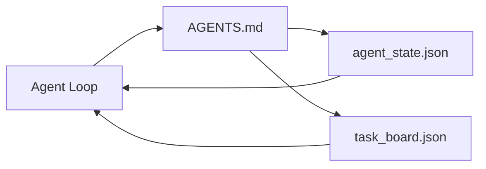

<!-- i18n:manual -->
# Минимальный agent workbench

> Самый маленький полезный workbench — это три файла: корневой роутер инструкций, файл состояния и доска задач. Всё остальное наслаивается сверху. Если репозиторий не выдерживает даже эти три файла, его не спасёт никакая модель.

**Type:** Build
**Languages:** Python (stdlib)
**Prerequisites:** Phase 14 · 31 (Why Capable Models Still Fail)
**Time:** ~45 minutes

## Learning Objectives

- Определить три файла, из которых складывается минимально жизнеспособный workbench.
- Объяснить, почему короткий корневой роутер лучше длинного монолитного `AGENTS.md`.
- Собрать файл состояния, который агент читает на каждом ходу и пишет в конце.
- Собрать доску задач, которая переживает многосессионную работу без истории чата.

## The Problem

Большинство команд подходит к workbench так: пишут `AGENTS.md` на 3000 строк и считают дело сделанным. Модель загружает его, игнорирует те части, которые не смогла пересказать, и продолжает падать на тех же поверхностях, на которых падала всегда.

> 🎒 **На пальцах.** Файл на 3000 строк — это как инструкция к стиральной машине на сто страниц: её пролистывают и жмут «Старт». Хуже того, эти строки платятся токенами в каждом вызове, то есть вы покупаете внимание модели за деньги и тратите его на текст, который она пропустила.

Нужно ровно наоборот. Крошечный корневой файл, который отправляет агента в более глубокие файлы только тогда, когда они относятся к делу. Устойчивое состояние, которое агент читает перед действием и пишет после. Доска задач, которая говорит, что в работе, что заблокировано и что следующее.

Три файла. У каждого своя работа. Каждый достаточно машиночитаем, чтобы позже вырасти в настоящую систему.

> 🎒 **На пальцах.** Сравните объёмы честно: три файла общим весом строк на пятьдесят против одного на три тысячи. Роутер отвечает «куда идти», состояние — «где я», доска — «что дальше». Это как записка на холодильнике вместо семейного архива в подвале.

## The Concept



> 🎒 **На пальцах.** На схеме стрелки двусторонние: роутер ведёт агента к двум файлам, а те возвращают его обратно в цикл. Никакой третьей сущности вроде «памяти диалога» на схеме нет — и это специально.

### AGENTS.md is a router, not a manual

Хороший `AGENTS.md` короткий. Он указывает агенту на:

- Файл состояния (где вы находитесь).
- Доску задач (что осталось).
- Более глубокие правила (в `docs/agent-rules.md`).
- Команду верификации (как понять, что работает).

Всё, что длиннее, уходит в глубокие документы и загружается только при необходимости. Длинные руководства игнорируют. Короткие роутеры выполняют.

> 🎒 **На пальцах.** Роутер — это указатели в аэропорту, а не путеводитель по городу. Четыре пункта в списке выше и есть весь минимум: где я, что осталось, какие правила, чем проверить. Уложить это в четыре строки реально.

### agent_state.json is the system of record

Состояние несёт: id активной задачи, затронутые файлы, сделанные предположения, блокеры и следующее действие. Агент читает его на каждом ходу. Следующая сессия читает его вместо того, чтобы переигрывать чат.

Состояние живёт в файле, потому что история чата ненадёжна. Сессии умирают. Диалоги обрезаются. Файл — нет.

> 🎒 **На пальцах.** Пять полей — как строка в вахтенном журнале: задача, что трогал, что предположил, что мешает, что дальше. Особенно ценно поле «предположения»: именно из-за незаписанных предположений в уроке 31 агент испортил лишний файл и никто не смог понять, почему.

### task_board.json is the queue

Доска задач несёт каждую задачу со статусом `todo | in_progress | done | blocked`. Это очередь, из которой агент берёт работу, когда состояние пустое, и очередь, которую читаете вы, когда хотите понять, идёт ли агент по плану.

У задачи на доске есть id, цель, владелец (`builder`, `reviewer` или `human`) и критерии приёмки. Доска специально маленькая: когда она перестаёт влезать в экран, у вас проблема с планированием, а не с доской.

> 🎒 **На пальцах.** Четыре статуса — как магнитики на школьной доске дежурств: «надо», «делаю», «сделал», «застрял». Владелец задачи из трёх вариантов сразу отвечает на вопрос «а кто следующий»: если там `human`, агент честно останавливается, вместо того чтобы гадать.

### Three files is the floor, not the ceiling

Дальнейшие уроки добавят контракты границ, раннеры обратной связи, гейты верификации, чеклисты ревьюера и пакеты передачи дел. Три файла из этого урока — это то, на что все они опираются.

```figure
wb-three-files
```

> 🎒 **На пальцах.** «Пол, а не потолок» значит: без этих трёх файлов дальше строить нечего. Гейт верификации не сработает, если он не знает, какая задача активна, — а это ровно поле из файла состояния.

## Build It

`code/main.py` записывает минимальный workbench в пустой репозиторий и показывает один ход агента, который:

1. Читает `agent_state.json`.
2. Берёт следующую задачу из `task_board.json`, если состояние пустое.
3. Трогает один файл внутри разрешённых границ.
4. Записывает обновлённое состояние обратно.

Запуск:

```
python3 code/main.py
```

Скрипт создаёт рядом с собой `workdir/`, раскладывает три файла, делает один ход и печатает diff. Запустите его ещё раз, чтобы увидеть, как второй ход подхватывает работу там, где закончился первый.

> 🎒 **На пальцах.** Обратите внимание на порядок из четырёх шагов: читать состояние — первое, писать — последнее, а трогать файл разрешено только между ними. Это как правило «сначала посмотри в журнал, потом работай, потом запиши». Именно поэтому второй запуск не начинает всё заново.

## Use It

Внутри продакшен-продуктов для агентов те же три файла всплывают под другими именами:

- **Claude Code:** `AGENTS.md` или `CLAUDE.md` в роли роутера, хранилища в стиле `.claude/state.json` для состояния, хуки для доски.
- **Codex / Cursor:** правила рабочего пространства в роли роутера, память сессии для состояния, задачи в очереди в сайдбаре чата для доски.
- **Custom Python agent:** ровно те файлы, которые вы только что написали.

Имена меняются. Форма — нет.

> 🎒 **На пальцах.** Три продукта, три набора названий, одна и та же тройка: роутер, состояние, очередь. Полезный вывод для вас: свой агент можно писать так же, без фреймворка, потому что все три файла — это просто JSON и Markdown.

## Production patterns in the wild

Минимальный workbench выдерживает столкновение с настоящими монорепозиториями, если сверху наслоить три паттерна. Они независимы; берите те, которые вашему репозиторию действительно нужны.

**Nested `AGENTS.md` with nearest-wins precedence.** У OpenAI в основном репозитории лежат 88 файлов `AGENTS.md`, по одному на подкомпонент. Codex, Cursor, Claude Code и Copilot идут от рабочего файла вверх к корню репозитория и склеивают все `AGENTS.md`, которые встретили по пути. Файлы в подкаталогах дополняют корневой. Codex добавляет `AGENTS.override.md`, который заменяет, а не дополняет; механизм override специфичен для Codex, и для кросс-инструментальной работы его лучше не использовать. Главная строка — замер от Augment Code: лучшие файлы `AGENTS.md` дают прирост качества, равный переходу с Haiku на Opus; худшие делают результат хуже, чем вообще без файла.

> 🎒 **На пальцах.** «Nearest-wins» — как правила в доме: общие висят в прихожей, а на кухне своя записка, и на кухне слушают кухонную. 88 файлов у OpenAI звучит дико, но каждый из них короткий и относится только к своему подкаталогу.

**Anti-patterns to refuse, even when they look like coverage.** Противоречащие друг другу инструкции молча сбрасывают агента из интерактивного режима в жадный (ICLR 2026 AMBIG-SWE: 48.8% → 28% доля решённых задач); нумеруйте приоритеты, а не складывайте правила плоским списком. Непроверяемые правила стиля («следуйте Google Python Style Guide») без команды-энфорсера позволяют агенту выдумать себе соответствие; к каждому правилу стиля прикладывайте точную команду линтера. Если начать со стиля вместо команд, путь верификации окажется погребён; команды первыми, стиль последним. Писать для людей, а не для агентов — это трата бюджета контекста; сухость здесь фича.

> 🎒 **На пальцах.** Цифра 48.8% → 28% стоит того, чтобы её запомнить: два противоречащих правила уронили долю решённых задач почти в два раза. Это как дать водителю две карты с разными объездами — он перестанет спрашивать и поедет наугад.

**Cross-tool symlinks.** Один корневой файл со симлинками (`ln -s AGENTS.md CLAUDE.md`, `ln -s AGENTS.md .github/copilot-instructions.md`, `ln -s AGENTS.md .cursorrules`) держит все кодовые агенты на одном источнике истины. `nx ai-setup` от Nx автоматизирует это сразу для Claude Code, Cursor, Copilot, Gemini, Codex и OpenCode из одного конфига.

> 🎒 **На пальцах.** Симлинк — это ярлык, а не копия: правите один файл, меняется у всех шести инструментов. Копии же расползаются через месяц, и вы получаете четыре разных набора правил в одном репозитории.

## Ship It

`outputs/skill-minimal-workbench.md` генерирует трёхфайловый workbench для любого нового репозитория: роутер `AGENTS.md`, подогнанный под проект, `agent_state.json` с нужными ключами и `task_board.json`, заполненный текущим бэклогом.

> 🎒 **На пальцах.** Это как стартовый набор для нового проекта: три файла за одну команду вместо получаса ручной работы. Заполненный бэклог здесь важнее всего — пустая доска задач ничем не отличается от отсутствующей.

## Exercises

1. Добавьте в `agent_state.json` поле `last_run` с временной меткой. Отказывайтесь запускаться, если файл старше 24 часов, пока оператор не подтвердит.
2. Добавьте на доску задач поле `priority` и научите «доставалу» всегда выбирать самую приоритетную задачу в статусе `todo`.
3. Переведите `task_board.json` на JSON Lines, чтобы каждая задача была строкой и диффы в системе контроля версий оставались чистыми.
4. Напишите `lint_workbench.py`, который падает, если `AGENTS.md` длиннее 80 строк или ссылается на несуществующий файл.
5. Решите, потеря какого из трёх файлов ударит больнее всего. Обоснуйте.

> 🎒 **На пальцах.** Начните с четвёртого задания, оно короче всех: две проверки — количество строк и существование ссылок. Порог 80 строк тут не украшение, а тот самый барьер, который не даёт роутеру снова разрастись в руководство на 3000 строк.

## Key Terms

| Term | What people say | What it actually means |
|------|----------------|------------------------|
| Router | `AGENTS.md` | Короткий корневой файл, который указывает агенту на глубокие документы и файлы |
| State file | «Заметки» | Машиночитаемая запись о том, где находится агент, пишется каждый ход |
| Task board | «Бэклог» | Очередь работы в JSON со статусом, владельцем и приёмкой |
| System of record | «Источник истины» | Файл, который workbench считает авторитетным, когда чата больше нет |

## Further Reading

- [agents.md — the open spec](https://agents.md/) — принята Cursor, Codex, Claude Code, Copilot, Gemini, OpenCode
- [Augment Code, A good AGENTS.md is a model upgrade. A bad one is worse than no docs at all](https://www.augmentcode.com/blog/how-to-write-good-agents-dot-md-files) — измеренные приросты качества
- [Blake Crosley, AGENTS.md Patterns: What Actually Changes Agent Behavior](https://blakecrosley.com/blog/agents-md-patterns) — что работает по опыту, а что нет
- [Datadog Frontend, Steering AI Agents in Monorepos with AGENTS.md](https://dev.to/datadog-frontend-dev/steering-ai-agents-in-monorepos-with-agentsmd-13g0) — вложенные приоритеты на практике
- [Nx Blog, Teach Your AI Agent How to Work in a Monorepo](https://nx.dev/blog/nx-ai-agent-skills) — генерация из одного источника сразу для шести инструментов
- [The Prompt Shelf, AGENTS.md Best Practices: Structure, Scope, and Real Examples](https://thepromptshelf.dev/blog/agents-md-best-practices/) — порядок разделов, который переживает ревью
- [Anthropic, Claude Code subagents](https://code.claude.com/docs/en/sub-agents)
- Phase 14 · 31 — режимы отказа, которые поглощает этот минимум
- Phase 14 · 34 — схема устойчивого состояния, которую этот урок анонсирует
