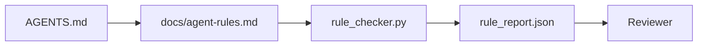

<!-- i18n:manual -->
# Инструкции для агента как исполняемые ограничения

> Инструкции, написанные прозой, — это пожелания. Инструкции, написанные как ограничения, — это тесты. Workbench превращает каждое правило в то, что агент может проверить во время работы, а ревьюер — после неё.

**Type:** Build
**Languages:** Python (stdlib)
**Prerequisites:** Phase 14 · 32 (Minimal Workbench)
**Time:** ~50 minutes

## Learning Objectives

- Отделять маршрутную прозу от операционных правил.
- Выражать правила старта, запрещённые действия, определение готовности, работу с неопределённостью и границы согласований как машинно-проверяемые ограничения.
- Реализовать проверяльщик правил, который оценивает прогон по набору правил.
- Сделать набор правил дружелюбным к диффам, чтобы на ревью было видно, что изменилось.

## The Problem

Типичный `AGENTS.md` читается как документация для новичка. Он велит агенту «быть осторожным», «тщательно тестировать» и «спрашивать, если не уверен». Через три дня агент отправляет изменение без тестов, пишет в запрещённый каталог и ни о чём не спрашивает, потому что никогда не знал, где проходит граница.

Инструкции сильны, когда они операционные, и слабы, когда они мечтательные. Лечится это так: правила надо писать в виде, который workbench может интерпретировать, а ревьюер — оценить.

> 🎒 **На пальцах.** «Будь осторожен» — это как сказать школьнику «учись хорошо»: проверить нечего. А «pytest завершается с кодом 0» проверяется одной командой. Три пожелания из абзаца выше дали три конкретных провала: нет тестов, запись в запрещённый каталог, ни одного вопроса.

## The Concept

Правила живут в `docs/agent-rules.md`, отдельно от короткого корневого роутера. У каждого правила есть имя, категория и проверка.



### Five categories that cover most rules

| Category | Question the rule answers | Example |
|----------|---------------------------|---------|
| Startup | Что должно быть верно до начала работы? | «файл состояния существует и свежий» |
| Forbidden | Что не должно происходить никогда? | «не редактировать `scripts/release.sh`» |
| Definition of done | Что доказывает, что задача закончена? | «pytest завершается с 0 и строка приёмки проходит» |
| Uncertainty | Что агент делает, когда не уверен? | «открыть заметку с вопросом вместо угадывания» |
| Approval | Что требует согласования с человеком? | «любая новая зависимость, любая запись в прод» |

Правило, которое не влезает ни в одну из этих пяти категорий, обычно хочет стать двумя правилами. Заставьте его разделиться.

> 🎒 **На пальцах.** Пять категорий — это пять вопросов, на которые правило обязано отвечать: до, никогда, готово, не уверен, спросить. Проверьте на своём «тщательно тестируй»: он не отвечает ни на один из пяти, поэтому его надо переписать в Definition of done с конкретной командой.

### Rules are machine-readable

У каждого правила есть slug, категория, однострочное описание и поле `check`, в котором указано имя функции из `rule_checker.py`. Добавить правило — значит добавить проверку; проверяльщик растёт вместе с workbench.

> 🎒 **На пальцах.** Связка «правило — имя функции» и есть весь фокус: правило перестаёт быть текстом и становится вызовом. Нет функции для `check` — значит правила фактически нет, каким бы красивым ни был его текст.

### Rules are diff-friendly

Правила лежат по одному на заголовок в одном markdown-файле. Переименования видны в диффах. Новые правила встают наверх своей категории. Устаревшие правила удаляются, а не закомментируются, потому что источник истины — это workbench, а не лог переписки о том, что команда чувствовала в прошлом квартале.

> 🎒 **На пальцах.** Один заголовок на правило — как один товар в чеке: изменилось одно, в диффе видна одна строка. Если бы правила лежали абзацами вперемешку, ревьюер видел бы «изменён весь блок» и переставал бы читать.

### Rules versus framework guardrails

Guardrails фреймворков (guardrails в OpenAI Agents SDK, interrupts в LangGraph) применяют правила на уровне рантайма. Набор правил из этого урока — читаемый человеком и пригодный для ревью контракт, который эти guardrails реализуют. Нужно и то, и другое: рантайм ловит нарушения по ходу хода, а набор правил доказывает, что рантайм делает именно то, что надо.

> 🎒 **На пальцах.** Это как ПДД и лежачий полицейский: правило написано в книжке, а тормозит вас бугор на асфальте. Одна книжка без бугров никого не остановит, а бугры без книжки нельзя проверить на осмысленность.

### Progressive disclosure: a map, not an encyclopedia

`AGENTS.md` растёт потому, что каждый инцидент добавляет правило и ни один инцидент не удаляет. Через год файл занимает две тысячи строк, агент читает первый экран, у него кончается бюджет внимания, и он действует по малой доле того, что ему сказали. Огромный файл инструкций проваливается по той же причине, по которой проваливается сорокастраничный документ для новичков: читатель пробегает его один раз и никогда не возвращается к той части, которая была важна.

> 🎒 **На пальцах.** Считаем прирост: один инцидент — одно правило, ни одного удаления. По правилу в неделю это пятьдесят правил за год, а с ними и две тысячи строк. Файл растёт как ящик с чеками, куда всё кладут и ничего не выбрасывают.

Лечится это не более коротким файлом. Лечится слоями. Корневой роутер остаётся достаточно коротким, чтобы читать его каждую сессию, и не содержит ничего, кроме указателей. Глубина живёт в тематических файлах, которые агент загружает только тогда, когда задача их касается. Дайте агенту карту, а не всю энциклопедию, и пусть он сам дойдёт до нужной страницы.

```
AGENTS.md                  # router, < 50 lines: what this repo is, where to look, the 5 hard rules
docs/
  agent-rules.md           # the full rule set (this lesson)
  architecture.md          # loaded when the task touches module boundaries
  testing.md               # loaded when the task writes or runs tests
  deploy.md                # loaded only for release work, gated behind an approval rule
feature_list.json          # the backlog (Phase 14 · 36)
```

> 🎒 **На пальцах.** Посмотрите на дерево: в корне один файл, в `docs/` четыре тематических, и `deploy.md` вообще открывается только для релизной работы. Это как аптечка, где сверху лежат пластыри, а редкие лекарства — на дальней полке.

| Tier | Lives in | Read when | Size budget |
|------|----------|-----------|-------------|
| Router | `AGENTS.md` | Каждую сессию, всегда | Меньше ~50 строк |
| Rules | `docs/agent-rules.md` | Каждую сессию, на старте | По одному экрану на категорию |
| Topic docs | `docs/<topic>.md` | Только когда задача касается этой темы | Настолько глубоко, насколько нужно |

Честность слоёв держат два теста. Тест достижимости: агент должен добираться до любого правила максимум за два перехода от роутера, поэтому роутер обязан ссылаться на каждый тематический документ путём, а не описывать его прозой. Тест свежести: роутер достаточно короткий, чтобы ревьюер перечитывал его на каждом PR, и только это не даёт ему тихо разрастись обратно в ту энциклопедию, которую он заменил. Указатель, который больше никуда не ведёт, хуже отсутствующего правила, поэтому битая ссылка в роутере сама является нарушением startup-проверки.

> 🎒 **На пальцах.** Три уровня, три бюджета: 50 строк на роутер, экран на категорию правил, сколько угодно на тему. Тест достижимости легко проверить руками: откройте роутер и попробуйте дойти до любого правила за два клика — если не получилось, где-то проза вместо пути.

```figure
wb-rule-checkoff
```

## Build It

`code/main.py` содержит:

- Парсер `agent-rules.md`, который загружает правила в датакласс.
- Функции проверок в стиле `rule_checker.py`, по одной на каждую ссылку `check`.
- Демонстрационный прогон агента, который нарушает два правила, и проход проверок, который их ловит.

Запуск:

```
python3 code/main.py
```

На выходе: разобранный набор правил, трейс прогона, pass/fail по каждому правилу и файл `rule_report.json`, сохранённый рядом со скриптом.

> 🎒 **На пальцах.** Обратите внимание на структуру: парсер отдельно, проверки отдельно, отчёт отдельно. Демо специально нарушает ровно два правила, чтобы вы увидели, что в `rule_report.json` попадают и провалы, и успехи — отчёт без успехов невозможно отличить от отчёта, который просто не запустился.

## Production patterns in the wild

Три паттерна отличают набор правил, который живёт квартал, от того, который сгнивает за неделю.

**Severity tagging at write time.** У каждого правила есть `severity`: `block`, `warn` или `info`. Проверяльщик сообщает про все три; рантайм отказывается работать только на `block`. Большинство команд сначала завышают серьёзность, а потом тихо ослабляют её под давлением сроков; проставление тега в момент написания заставляет откалибровать всё заранее. Сочетайте с гейтом верификации (Phase 14 · 38), который подписывает любое обход правила уровня `block` в аудит-лог `overrides.jsonl`.

> 🎒 **На пальцах.** Три уровня — как пожарная сигнализация: `block` останавливает всех, `warn` заставляет посмотреть, `info` просто пишется в журнал. Если у вас все правила `block`, вы получите то же, что от сигнализации, которая пищит на каждый тост, — её отключат целиком.

**Rule expiry as a forcing function.** У каждого правила есть дата `expires_at` (по умолчанию 90 дней от момента написания). Проверяльщик выдаёт предупреждение, когда у неистёкшего правила 60 дней подряд не было ни одного нарушения; на следующем квартальном разборе правило либо обосновывают, либо ослабляют до `info`, либо удаляют. Данные Cloudflare по продакшен-системе AI Code Review (апрель 2026, 131 246 прогонов ревью по 5 169 репозиториям за 30 дней) показали: наборы правил с явным сроком годности держались в пределах 30 правил на репозиторий; наборы без срока разрастались до 80+, причём большинство правил никогда не срабатывали.

> 🎒 **На пальцах.** Срок годности как на продуктах: не выбросил вовремя — холодильник забит. Цифры Cloudflare сравнивают честно: 30 правил с истечением против 80+ без него, и в большом наборе большинство правил не сработали ни разу.

**Markdown-as-source, JSON-as-cache.** `agent-rules.md` — файл, который пишет человек; `agent-rules.lock.json` — кеш, который проверяльщик читает на горячем пути. Lock пересобирается pre-commit-хуком. Диффы markdown пригодны для ревью; парсинг JSON не мешается на каждом ходу. Та же форма, что у `package.json` / `package-lock.json` и `Cargo.toml` / `Cargo.lock`.

> 🎒 **На пальцах.** Вы уже видели этот приём в любом npm-проекте: правите `package.json`, читается `package-lock.json`. Человек редактирует удобное, машина читает быстрое, а хук держит их в согласии.

## Use It

В продакшене:

- Claude Code, Codex и Cursor читают правила на старте сессии и цитируют их, когда отказываются что-то делать. Проверяльщик повторно прогоняет их в CI, чтобы поймать тихое расхождение.
- Guardrails в OpenAI Agents SDK регистрируют те же самые проверки как входные и выходные guardrails. Markdown — это поверхность документации; SDK — поверхность рантайма.
- Interrupts в LangGraph срабатывают, когда узел в процессе выполнения нарушает правило. Обработчик прерывания читает правило, спрашивает человека и продолжает работу.

Набор правил переносим между всеми тремя, потому что это просто markdown плюс имена функций.

> 🎒 **На пальцах.** «Просто markdown плюс имена функций» — это и есть причина переносимости: ни одного специфичного для фреймворка объекта. Перевезли файл правил в другой инструмент, дописали три функции-проверки — и контракт работает там же.

## Ship It

`outputs/skill-rule-set-builder.md` интервьюирует владельца проекта, раскладывает его существующие прозаические инструкции по пяти категориям и выдаёт версионированный `agent-rules.md` вместе с заготовкой проверяльщика.

> 🎒 **На пальцах.** Это как разобрать шкаф по полкам: вещи те же, но теперь понятно, чего не хватает. Обычно после раскладки по пяти категориям выясняется, что категория Uncertainty пустая — то есть агенту никто не сказал, что делать при сомнениях.

## Exercises

1. Добавьте шестую категорию, если вашему продукту она действительно нужна. Обоснуйте, почему она не сворачивается в одну из пяти.
2. Расширьте проверяльщик так, чтобы правило могло нести severity (`block`, `warn`, `info`), а отчёт агрегировал результаты по ним.
3. Подключите проверяльщик к CI: пусть сборка падает, если правило с severity block провалилось на последнем прогоне агента.
4. Добавьте к каждому правилу поле «expiry». Через 90 дней без единого провала проверки правило выносится на разбор.
5. Найдите настоящий `AGENTS.md` и перепишите его как правила по пяти категориям. Сколько его строк были операционными? Сколько — мечтательными?

> 🎒 **На пальцах.** Пятое задание самое отрезвляющее и делается за полчаса: возьмите свой `AGENTS.md` и поставьте напротив каждой строки плюс, если её можно проверить командой. Обычно операционными оказываются одна строка из пяти, а остальное — вежливые пожелания.

## Key Terms

| Term | What people say | What it actually means |
|------|----------------|------------------------|
| Operational rule | «Настоящая инструкция» | Правило, которое workbench может проверить во время работы |
| Aspirational rule | «Будь осторожен» | Правило без проверки; либо удалить, либо доработать |
| Definition of done | «Приёмка» | Объективное, опирающееся на файлы доказательство, что задача закончена |
| Block severity | «Жёсткое правило» | Нарушение останавливает прогон; заглушить без оператора нельзя |
| Rule expiry | «Уборка протухших правил» | Правило без провалов за N дней выносится на списание |

## Further Reading

- [OpenAI Agents SDK guardrails](https://openai.github.io/openai-agents-python/guardrails/)
- [LangGraph interrupts](https://langchain-ai.github.io/langgraph/how-tos/human_in_the_loop/breakpoints/)
- [Anthropic, Building Effective Agents](https://www.anthropic.com/research/building-effective-agents)
- [Rick Hightower, Agent RuleZ: A Deterministic Policy Engine](https://medium.com/@richardhightower/agent-rulez-a-deterministic-policy-engine-for-ai-coding-agents-9489e0561edf) — уровни block/warn/info в продакшене
- [Cloudflare, Orchestrating AI Code Review at Scale](https://blog.cloudflare.com/ai-code-review/) — 131 тысяча прогонов ревью, уроки про состав набора правил
- [microservices.io, GenAI development platform — part 1: guardrails](https://microservices.io/post/architecture/2026/03/09/genai-development-platform-part-1-development-guardrails.html) — защита в глубину между правилами и CI
- [Type-Checked Compliance: Deterministic Guardrails (arXiv 2604.01483)](https://arxiv.org/pdf/2604.01483) — Lean 4 как верхняя граница идеи «правило как проверка»
- [logi-cmd/agent-guardrails](https://github.com/logi-cmd/agent-guardrails) — реализация merge-гейта: границы, мутационное тестирование, бюджеты нарушений
- Phase 14 · 32 — минимальный workbench, в который встраивается этот набор правил
- Phase 14 · 38 — гейт верификации, который потребляет отчёт по правилам
- Phase 14 · 39 — агент-ревьюер, который оценивает соблюдение правил
