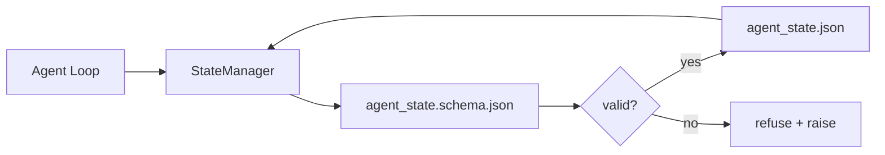

<!-- i18n:manual -->
# Память в репозитории и устойчивое состояние

> История чата летучая. Репозиторий устойчивый. Workbench хранит состояние агента в версионируемых файлах, чтобы следующая сессия, следующий агент и следующий ревьюер читали один и тот же источник правды.

**Type:** Build
**Languages:** Python (stdlib + `jsonschema` optional)
**Prerequisites:** Phase 14 · 32 (Minimal Workbench)
**Time:** ~60 minutes

## Learning Objectives

- Определить, что относится к памяти репозитория, а что — к истории чата.
- Написать JSON Schema для `agent_state.json` и `task_board.json`.
- Собрать менеджер состояния, который загружает, валидирует, меняет и атомарно сохраняет состояние.
- Использовать схему, чтобы отказывать плохим записям до того, как они испортят workbench.

## The Problem

Агент закончил сессию. Чат закрылся. Открывается следующая сессия и спрашивает, с чего начать. Модель говорит «дайте посмотрю файлы», читает устаревшие заметки и заново делает работу, которая уже была сделана. Или хуже: переписывает готовый файл, потому что никто не сказал ей, что файл готов.

Лечение в workbench — память репозитория: состояние живёт в JSON-файлах внутри репозитория, пишется по схеме, сохраняется атомарно и удобно читается в code review как diff. Чат — это временная лента; репозиторий — система учёта.

> 🎒 **На пальцах.** Как вахтенный журнал на корабле: смена ушла, люди сменились, а запись осталась. Посчитайте асимметрию: история чата пропадает целиком, а пяти строк в JSON (активная задача, тронутые файлы, допущения, блокеры, следующий шаг) хватает, чтобы следующая сессия не переписала уже готовый файл.

## The Concept



> 🎒 **На пальцах.** На схеме из ромба `valid?` выходит ровно две стрелки: «да» пишет `agent_state.json`, «нет» бросает исключение. Третьего пути — «записать как получилось» — не существует, и это главное. Как турникет в метро: либо билет проходит, либо вы остались снаружи, но внутрь без билета не просачиваетесь.

### What belongs in repo memory

| Belongs | Does not belong |
|---------|-----------------|
| Id активной задачи | Сырые транскрипты чата |
| Файлы, тронутые в этой сессии | Трассы рассуждений на уровне токенов |
| Допущения, которые сделал агент | «Пользователь выглядел раздражённым» |
| Открытые блокеры | Сэмплированные завершения |
| Следующее действие | Специфичные для вендора id моделей |

Проверка одна — на устойчивость: пригодится ли это через три месяца при повторном прогоне в CI? Если да — в репозиторий. Если нет — в телеметрию.

> 🎒 **На пальцах.** Прогоните этот тест по таблице выше: «Пользователь выглядел раздражённым» через три месяца в CI не даст ничего, а «id активной задачи» — единственное, с чего можно продолжить. Как список дел на холодильнике против настроения, с которым вы его писали: первое переживёт месяц, второе нет.

### Schema-first state

JSON Schema — это контракт. Без него каждый агент придумывает новые поля, каждый ревьюер разбирается в новой форме, а каждому CI-скрипту приходится отдельно обрабатывать прошлые версии. С ним плохая запись — это отказанная запись.

Схема покрывает:

- Обязательные ключи.
- Допустимые значения `status`.
- Запрещённые значения (например, `null` вместо массива).
- Ограничения по шаблону (id задачи совпадает с `T-\d{3,}`).
- Поле версии для миграций.

> 🎒 **На пальцах.** Пять правил схемы работают как пять графов в бланке, который принимают только заполненным правильно. Шаблон `T-\d{3,}` требует минимум три цифры: `T-007` пройдёт, а `T-7` будет отклонён на входе, ещё до того, как что-то попадёт в файл.

### Atomic writes

Записи состояния должны переживать частичные сбои: пишем в временный файл, делаем fsync, переименовываем поверх целевого. Файл состояния — источник правды; наполовину записанный файл хуже, чем никакого файла вообще.

> 🎒 **На пальцах.** Три шага — временный файл, `fsync`, переименование — и падение на любом из них оставляет прежнее состояние целым: подмена происходит одним движением. Так же вы дописываете черновик до конца и только потом кладёте его вместо чистовика, чтобы читатель не увидел половину фразы.

### Migrations

Когда схема меняется, вместе с поднятием версии выпускайте скрипт миграции. Файл состояния несёт поле `schema_version`; менеджер отказывается загружать файл версии, которую не умеет миграровать.

```figure
wb-state-persist
```

> 🎒 **На пальцах.** Поле `schema_version` — как год выпуска на детали: менеджер видит v1, знает миграцию с v1 на v2 и загружает файл, а на v5 честно отказывается вместо того, чтобы угадывать. Отказ дешевле догадки: испорченное состояние вы заметите через три сессии, а отказ — сразу.

## Build It

`code/main.py` реализует:

- `agent_state.schema.json` и `task_board.schema.json`.
- Валидатор только на стандартной библиотеке (подмножество JSON Schema: required, type, enum, pattern, items).
- `StateManager.load`, `StateManager.update`, `StateManager.commit` с атомарной записью через временный файл и переименование.
- Демо, которое меняет состояние, сохраняет, перезагружает и доказывает, что круг замкнулся.

Запустите его:

```
python3 code/main.py
```

Скрипт пишет `workdir/agent_state.json` и `workdir/task_board.json`, меняет их за два хода и печатает провалидированное состояние на каждом шаге.

> 🎒 **На пальцах.** Валидатор понимает всего пять ключевых слов JSON Schema: required, type, enum, pattern, items. В полной спецификации их десятки, но эти пять закрывают почти все реальные ошибки записи. Как автомобильная аптечка: не больница, но того, что нужно на дороге, там хватает.

> 🎒 **На пальцах.** Демо гоняет круг «записал — перезагрузил — сверил» два раза, и это не формальность: половина ошибок в состоянии видна только на чтении, а не на записи. Как проверить, что дверь заперта, дёрнув за ручку, а не просто повернув ключ.

## Production patterns in the wild

Четыре паттерна превращают минимум из этого урока в то, что выживет в мультиагентном монорепозитории.

**Atomic temp-and-rename is not optional.** Баг-репорт в проекте Hive от марта 2026 года описывает этот режим отказа предельно чисто: `state.json` писался через `write_text()`, а исключения ловились и глушились. Частичные записи оставляли сессии, которые возобновлялись на испорченном состоянии без единого сигнала. Лечение всегда одно: `tempfile.mkstemp` в той же директории, что и целевой файл, запись, `fsync`, `os.replace` (атомарное переименование и на POSIX, и на Windows). `atomic_write` в этом уроке делает ровно это.

> 🎒 **На пальцах.** В том баге две ошибки, и вторая страшнее: запись была не атомарной, а исключения ещё и глушились. Значит, состояние портилось молча. Как течь за гипсокартоном: сама течь мелкая, но узнаете вы о ней, когда обвалится потолок.

**Idempotency keys on every non-idempotent tool call.** Если агент падает после вызова инструмента, но до сохранения чекпоинта, восстановление повторит вызов. Для чтений это безопасно; для писем, вставок в базу и загрузок файлов — опасно. Паттерн такой: пишите id каждого вызова инструмента в `pending_calls.jsonl` до его выполнения. При повторе проверьте id; если он там есть, пропустите вызов и возьмите закэшированный результат. И Anthropic, и LangChain указывают на это в своих рекомендациях 2026 года; checkpointer в LangGraph сохраняет отложенные записи по той же причине.

> 🎒 **На пальцах.** Разница на примере: повторить чтение файла — ноль последствий, повторить отправку письма — клиент получил два письма. Поэтому id пишется в журнал до выполнения, а не после: только так после падения видно, что вызов уже уходил. Как номерок в гардеробе — по нему выдают одно пальто, а не второе такое же.

**Separate large artifacts from state.** Не храните CSV, длинные транскрипты и сгенерированные файлы в `agent_state.json`. Сохраните артефакт отдельным файлом (или загрузите в объектное хранилище), а в состоянии держите только путь. Чекпоинты остаются маленькими и быстрыми; артефакты растут сами по себе.

**Event sourcing for audit, snapshots for resume.** Дописывайте в журнал событий (`state.events.jsonl`) при каждом изменении; периодически снимайте снапшот в `state.json`. Возобновление читает снапшот, а потом проигрывает события, случившиеся после его отметки времени. Диска это ест больше, зато решения агента можно воспроизвести дословно — незаменимо при отладке долгих прогонов. Ту же форму Postgres использует внутри для WAL.

> 🎒 **На пальцах.** Два файла делят обязанности: журнал событий отвечает на «как мы сюда пришли», снапшот — на «где мы сейчас». Возобновление читает снапшот и доигрывает только события после его отметки времени, а не весь журнал с начала. Как банковская выписка плюс текущий баланс: баланс быстрее, выписка объясняет.

**Schema migrations or refuse to load.** Целое число `schema_version` — это контракт. Когда менеджер видит файл неизвестной версии, он отказывается читать. Выпускайте скрипт миграции вместе с поднятием схемы; `tools/migrate_state.py` запускается идемпотентно при каждом старте.

> 🎒 **На пальцах.** «Идемпотентно при каждом старте» значит: скрипт можно запустить десять раз подряд, и после первого раза он ничего не изменит. Файл, который уже на v2, миграция v1 → v2 просто пропустит. Как прививка с отметкой в карте — вторую дозу не колют, потому что запись уже есть.

## Use It

В продакшене:

- **LangGraph checkpointers.** Та же идея, другое хранилище. Checkpointer сохраняет состояние графа в SQLite, Postgres или свой бэкенд. Схема из этого урока — то, за чем вы полезете, когда checkpointer ляжет и состояние придётся читать руками.
- **Letta memory blocks.** Постоянные блоки со структурированными схемами (Phase 14 · 08). Та же дисциплина, но в масштабе долгоживущих персон.
- **OpenAI Agents SDK session store.** Подключаемые бэкенды, знающие про схему. Файл состояния из этого урока — это бэкенд «локальный файл».

> 🎒 **На пальцах.** Все три примера — один и тот же файл состояния под разными вывесками: SQLite у LangGraph, блоки у Letta, session store у OpenAI. Схема из урока нужна ровно для того, чтобы, когда любой из них ляжет, вы открыли состояние текстовым редактором и поняли его без документации.

## Ship It

`outputs/skill-state-schema.md` генерирует пару JSON Schema под ваш проект (состояние + доска), Python-класс `StateManager`, подключённый к атомарной записи, и каркас миграции, чтобы следующее поднятие схемы не сломало workbench.

> 🎒 **На пальцах.** Навык выдаёт три вещи сразу: две схемы, `StateManager` и каркас миграции. Третье легче всего забыть — и именно оно спасёт, когда через месяц вы переименуете `blockers` в `risks` и обнаружите десять файлов состояния старой формы.

## Exercises

1. Добавьте отметку времени `last_human_touch`. Отказывайте любой записи агента в пределах пяти секунд после правки человеком.
2. Расширьте валидатор поддержкой `oneOf`, чтобы задача могла быть либо задачей на сборку, либо задачей на ревью, с разными обязательными полями.
3. Добавьте поле `schema_version` и напишите миграцию с v1 на v2 (переименование `blockers` в `risks`).
4. Переведите бэкенд хранения с локального файла на SQLite. API `StateManager` оставьте прежним.
5. Запустите двух агентов на одном файле состояния с гонкой записи в 50 мс. Что ломается и как атомарное переименование вас спасает?

> 🎒 **На пальцах.** Начните с пятого задания — оно самое поучительное. Два агента, гонка в 50 мс: без атомарности вы получите файл, где половина от одного и половина от другого; с `os.replace` победит кто-то один целиком, и это уже отлаживаемая ситуация. Как двое, дописывающих одну записку: лучше пусть кто-то один перепишет её заново.

## Key Terms

| Term | What people say | What it actually means |
|------|----------------|------------------------|
| Repo memory | «Файл с заметками» | Состояние в отслеживаемых файлах репозитория, под схемой |
| Schema-first | «Валидируем ввод» | Определяем контракт раньше писателя, отказываем дрейфу |
| Atomic write | «Просто переименуй» | Пишем в temp, fsync, переименование — частичный сбой не портит файл |
| Migration | «Поднятие схемы» | Скрипт, который превращает состояние vN в состояние v(N+1) |
| System of record | «Источник правды» | Артефакт, который workbench считает авторитетным |

## Further Reading

- [JSON Schema specification](https://json-schema.org/specification.html)
- [LangGraph checkpointers](https://langchain-ai.github.io/langgraph/concepts/persistence/)
- [Letta memory blocks](https://docs.letta.com/concepts/memory)
- [Fast.io, AI Agent State Checkpointing: A Practical Guide](https://fast.io/resources/ai-agent-state-checkpointing/) — чекпоинты по схеме и идемпотентность
- [Fast.io, AI Agent Workflow State Persistence: Best Practices 2026](https://fast.io/resources/ai-agent-workflow-state-persistence/) — контроль конкурентности, TTL, event sourcing
- [Hive Issue #6263 — non-atomic state.json writes silently ignored](https://github.com/aden-hive/hive/issues/6263) — этот режим отказа в живом проекте
- [eunomia, Checkpoint/Restore Systems: Evolution, Techniques, Applications](https://eunomia.dev/blog/2025/05/11/checkpointrestore-systems-evolution-techniques-and-applications-in-ai-agents/) — примитивы checkpoint/restore из истории ОС, приложенные к агентам
- [Indium, 7 State Persistence Strategies for Long-Running AI Agents in 2026](https://www.indium.tech/blog/7-state-persistence-strategies-ai-agents-2026/)
- [Microsoft Agent Framework, Compaction](https://learn.microsoft.com/en-us/agent-framework/agents/conversations/compaction) — вендорский менеджер чекпоинтов
- Phase 14 · 08 — блоки памяти и sleep-time compute
- Phase 14 · 32 — минимум из трёх файлов, которому этот урок даёт схему
- Phase 14 · 40 — пакеты передачи, читаемые из той же схемы
