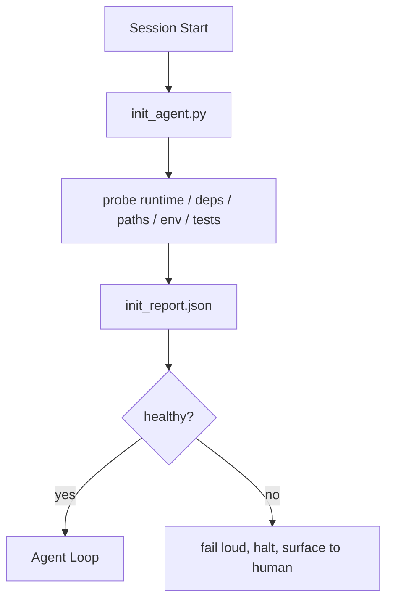

<!-- i18n:manual -->
# Скрипты инициализации для агентов

> Каждая сессия, которая начинается с холодного старта, платит налог. Агент читает те же файлы, повторяет те же пробы и заново находит те же пути. Init-скрипт платит этот налог один раз и записывает ответы в состояние.

**Type:** Build
**Languages:** Python (stdlib)
**Prerequisites:** Phase 14 · 32 (Minimal Workbench), Phase 14 · 34 (Repo Memory)
**Time:** ~45 minutes

## Learning Objectives

- Понять, какую работу агент никогда не должен переделывать в каждой сессии.
- Собрать детерминированный init-скрипт, который проверяет рантайм, зависимости и здоровье репозитория.
- Сохранять результат проб, чтобы агент читал его, а не прогонял проверки заново.
- Падать громко, быстро и так, чтобы при сбое инициализации смотреть надо было в одно место.

## The Problem

Открываем сессию. Агент угадывает версию Python. Угадывает команду тестов. Пять раз перечисляет корень репозитория, чтобы найти точку входа. Пробует импортировать пакет, которого не установлено. Спрашивает пользователя, где лежит файл конфига. К моменту, когда он делает первую настоящую правку, десять тысяч токенов ушли на работу по настройке, которая должна была быть одним скриптом.

Лечение — один скрипт инициализации, который запускается раньше всего остального и пишет `init_report.json`, а агент читает его на старте.

> 🎒 **На пальцах.** Посчитайте цену: десять тысяч токенов на угадывание версии Python и команды тестов — это как заново прочитать половину урока перед каждой задачей. Init-скрипт выясняет то же самое за один прогон и оставляет ответы в файле. Как записка «где что лежит» для нового повара вместо того, чтобы открывать все шкафы подряд.

## The Concept



> 🎒 **На пальцах.** На схеме важна не левая часть, а ромб `healthy?`: ветка «нет» ведёт не к агенту, а к остановке с криком в сторону человека. Агент просто не стартует на сломанном стенде. Как предполётная проверка: не горит одна лампочка — самолёт не вылетает, а не «взлетим и разберёмся».

### What the init script probes

| Probe | Why it matters |
|-------|----------------|
| Версии рантайма | Не та версия Python или Node — это молчаливые баги от неправильной версии |
| Наличие зависимостей | Пропавший пакет потом стоит в десять раз дороже, чем поймать его сейчас |
| Команда тестов | Агент обязан знать, как проверять; нет команды — workbench сломан |
| Пути в репозитории | Прибитые пути уезжают; разрешите их один раз и зафиксируйте |
| Переменные окружения | Отсутствующий `OPENAI_API_KEY` — это точка отказа, а не загадка на рантайме |
| Свежесть state и доски | Устаревшее состояние после упавшей сессии — выстрел себе в ногу |
| Коммит last-known-good | Опора для diff при передаче в конце сессии |

> 🎒 **На пальцах.** Семь проб — это семь способов потерять час. Возьмите вторую строку буквально: поймать отсутствующий пакет на старте стоит одну секунду, а поймать его на сороковой минуте работы — это выброшенная сессия целиком. Как проверить бензин перед выездом, а не на трассе.

### Fail loud, fail fast, fail in one place

Провал пробы означает остановку и вынос проблемы человеку. Никакого «агент сам разберётся». Весь смысл init в том, чтобы отказаться стартовать, когда workbench сломан.

> 🎒 **На пальцах.** «В одном месте» — это про `init_report.json`: когда что-то сломалось, вы не читаете десять логов, а открываете один файл, где против каждой пробы стоит статус. Как электрощиток: не надо обходить всю квартиру, достаточно посмотреть, какой автомат выбило.

### Idempotent

Запустите его два раза подряд. Второй прогон должен ничего не менять, кроме свежей отметки времени. Именно идемпотентность позволяет вшить скрипт в CI, в хуки или в слэш-команду перед задачей.

> 🎒 **На пальцах.** Проверка простая: сравните два `init_report.json` подряд — отличаться должна ровно одна строка, timestamp. Отличается что-то ещё — значит, скрипт сам меняет мир, и в CI ему доверять нельзя. Как измерение роста: линейка рост не меняет.

### Init versus startup rules

Правила (Phase 14 · 33) описывают, что должно быть верно, чтобы действовать. Init — это скрипт, который делает эти правила проверяемыми. Правила без init превращаются в «будь осторожен». Init без правил превращается в отполированный провал.

```figure
wb-init-probes
```

> 🎒 **На пальцах.** Разведите роли: правило говорит «не коммить без прогона тестов», а init выясняет, что вообще за команда тестов в этом репозитории. Без второго первое — просто пожелание. Как «не выходи без зонта» без единого взгляда на погоду.

## Build It

`code/main.py` реализует `init_agent.py`:

- Пять проб: версия Python, перечисленные зависимости через `importlib.util.find_spec`, разрешимость команды тестов, обязательные переменные окружения, свежесть файла состояния.
- Каждая проба возвращает `(name, status, detail)`.
- Скрипт пишет `init_report.json` со всем набором проб и выходит с ненулевым кодом, если провалилась хотя бы одна проба с уровнем block.

Запустите его:

```
python3 code/main.py
```

Скрипт печатает таблицу проб, пишет `init_report.json` и выходит с нулём на счастливом пути либо с ненулевым кодом и списком провалившихся проб.

> 🎒 **На пальцах.** Одинаковая форма `(name, status, detail)` у всех пяти проб — не педантизм: благодаря ей отчёт печатается одним циклом, а шестая проба добавляется одной функцией. Как одинаковые розетки в доме: любой прибор включается, не переделывая проводку.

> 🎒 **На пальцах.** Ненулевой код выхода — единственное, что понимают CI, Docker и хуки. Скрипт может напечатать сколь угодно красивую таблицу, но если при провале он вышел с нулём, конвейер поедет дальше как ни в чём не бывало. Как красная лампочка, которая горит, но ни к чему не подключена.

## Production patterns in the wild

Три паттерна отличают полезный init-скрипт от ритуала.

**Last-known-good commit anchoring.** Сравните текущий коммит с файлом `LKG`, записанным при последнем успешном merge. Если diff выходит за бюджет (по умолчанию 50 файлов), откажитесь стартовать и потребуйте, чтобы человек утвердил новую базу. Именно так AI Code Review у Cloudflare ограничивает агентов-ревьюеров: каждая сессия ревью опирается на один и тот же last-known-good и никогда не накапливает дрейф между сессиями.

> 🎒 **На пальцах.** Порог в 50 файлов — это про доверие: сравнить свою работу с базой, отличающейся на 5 файлов, агент может честно, а на 500 — уже нет, и начнёт выдумывать. Поэтому вместо героизма скрипт останавливается и просит человека утвердить новую базу. Как разметка после ремонта дороги: пока новую не нанесли, ехать по старой нельзя.

**Lock files with TTL.** Пишите `prereqs.lock` после первого успешного прохода проб. Дальнейшие запуски верят локу N часов (по умолчанию 24) и пропускают дорогие пробы. Init-скрипт сперва читает лок; если тот свежий и хэш манифеста зависимостей совпадает, скрипт замыкается коротко. Тот же паттерн Docker использует для кэша слоёв: идемпотентная проба + хэш содержимого = пропуск.

> 🎒 **На пальцах.** Двух условий недостаточно по одному, нужны оба: свежесть по времени и совпадение хэша манифеста. Поменяли зависимость через минуту после прогона — лок ещё свежий, но хэш уже другой, и пробы честно гоняются заново. Как срок годности плюс целая упаковка: одна дата ничего не гарантирует.

**No network, no LLM, no surprises in the hot path.** Пробы init — это детерминированная сантехника. Проба, которая зовёт LLM, чтобы классифицировать сбой, или дёргает внешний сервис, чтобы проверить лицензию, — это не проба, а workflow. Если проба на холостом прогоне идёт дольше трёх секунд, считайте это запахом workbench и либо унесите её из init, либо кэшируйте результат.

> 🎒 **На пальцах.** Три секунды — не придирка: init запускается перед каждой сессией, и проба на 10 секунд при двадцати сессиях в день съедает больше трёх минут чистого ожидания. А проба, зовущая LLM, вдобавок недетерминированна: сегодня стенд «здоров», завтра тот же стенд «сломан». Как термометр, который каждый раз показывает разное.

## Use It

В продакшене:

- **Claude Code hooks.** Хук `pre-task` вызывает init-скрипт и не даёт запустить агента, если тот провалился.
- **GitHub Actions.** Job `setup-agent` прогоняет init-скрипт; job агента зависит от него.
- **Docker entrypoint.** Контейнер агента запускает init-скрипт до exec рантайма агента; при сбое логи всплывают наружу.

Init-скрипт переносим, потому что не делает вызовов ни в один конкретный фреймворк. Обернуть его может и bash, и Make, и файл задач.

> 🎒 **На пальцах.** Все три обёртки — хук, CI-job и entrypoint — общаются со скриптом одним и тем же способом: кодом выхода. Поэтому одна и та же утилита на пятьдесят строк работает локально, в CI и в контейнере без единой правки. Как один штепсель на все розетки в стране.

## Ship It

`outputs/skill-init-script.md` расспрашивает проект, раскладывает его работу по настройке на пробы и выдаёт `init_agent.py` под этот проект плюс CI-workflow, который запускает его до любого шага агента.

> 🎒 **На пальцах.** Ключевое слово здесь — «расспрашивает»: пробы нельзя угадать, у каждого проекта они свои. У одного это `OPENAI_API_KEY` и pytest, у другого — Node 22 и поднятый Postgres. Как список вещей в поход: составляется под конкретный маршрут, а не скачивается готовым.

## Exercises

1. Добавьте пробу, которая сравнивает текущий коммит с коммитом last-known-good и отказывается стартовать, если изменилось больше 50 файлов.
2. Научите скрипт писать файл `prereqs.lock` и отказываться стартовать, если лок старше семи дней.
3. Добавьте флаг `--fix`, который сам доустанавливает недостающие dev-зависимости, но никогда не трогает рантайм-зависимости без одобрения.
4. Перенесите пробы из захардкоженных функций в реестр на YAML. Защитите этот компромисс.
5. Добавьте бюджет по времени на каждую пробу. Проба, которая идёт дольше трёх секунд, — это запах workbench.

> 🎒 **На пальцах.** Начните со второго задания — оно самое практичное. Лок на семь дней означает, что дорогие пробы гоняются раз в неделю, а не двадцать раз в день. Но сразу проверьте обратный случай: удалите пакет руками и убедитесь, что свежий лок не пропустил сломанный стенд.

## Key Terms

| Term | What people say | What it actually means |
|------|----------------|------------------------|
| Probe | «Проверка» | Детерминированная функция, возвращающая `(name, status, detail)` |
| Init report | «Вывод настройки» | JSON рядом с состоянием, куда сложены результаты проб |
| Idempotent | «Можно перезапускать» | Два прогона подряд дают одинаковые отчёты с точностью до отметки времени |
| Fail loud | «Не глотай ошибку» | Остановиться и вынести человеку; никаких молчаливых откатов |
| Setup tax | «Цена бутстрапа» | Токены, которые агент тратит в каждой сессии, заново открывая очевидное |

## Further Reading

- [Anthropic, Effective harnesses for long-running agents](https://www.anthropic.com/engineering/effective-harnesses-for-long-running-agents)
- [GitHub Actions, composite actions for setup](https://docs.github.com/en/actions/sharing-automations/creating-actions/creating-a-composite-action)
- [microservices.io, GenAI dev platform: guardrails](https://microservices.io/post/architecture/2026/03/09/genai-development-platform-part-1-development-guardrails.html) — проверки pre-commit и CI в роли init
- [Augment Code, How to Build Your AGENTS.md (2026)](https://www.augmentcode.com/guides/how-to-build-agents-md) — что ожидают от init
- [Codex Blog, Codex CLI Context Compaction](https://codex.danielvaughan.com/2026/03/31/codex-cli-context-compaction-architecture/) — старт сессии как init, знающий про компакцию контекста
- Phase 14 · 33 — набор правил, который этот скрипт делает возможным
- Phase 14 · 34 — файл состояния, который этот скрипт засеивает
- Phase 14 · 38 — гейт верификации, который этот скрипт кормит
- Phase 14 · 40 — передача, которая потребляет last-known-good из init-отчёта
